                 

### 虚拟现实技术基础

#### 1. 虚拟现实概述

虚拟现实（Virtual Reality，VR）是一种通过计算机技术创造的虚拟环境，用户可以在其中进行交互和体验。VR技术利用计算机图形系统、传感器技术以及人机交互技术，创造出一个与真实世界相似的虚拟世界。在这个虚拟世界中，用户可以通过头戴显示器（HMD）、数据手套等设备感知和交互，获得沉浸式体验。

虚拟现实的应用领域广泛，涵盖了教育培训、游戏娱乐、医疗健康、文化遗产保护等多个方面。例如，在教育领域，VR技术可以模拟历史场景、科学实验，提供更为生动的学习体验；在游戏娱乐领域，VR技术则为用户带来了全新的游戏体验；在医疗健康领域，VR技术被用于手术模拟、心理治疗等；在文化遗产保护领域，VR技术则成为了一种重要的数字化保护手段。

#### 1.2 虚拟现实技术的定义

虚拟现实是一种通过计算机技术和传感器技术模拟的，让人沉浸在虚拟环境中的技术。它通过生成三维空间中的视觉、听觉和触觉等多种感官体验，使用户在虚拟环境中感知和互动。虚拟现实技术的核心是通过虚拟环境与用户的实时交互，创造一个可感知和互动的虚拟世界。

#### 1.3 虚拟现实的应用领域

虚拟现实在多个领域具有广泛应用。以下是一些主要的应用领域：

- **教育培训**：虚拟现实可以模拟历史场景、科学实验、地理环境等，提供更为生动的学习体验，激发学生的学习兴趣。

- **游戏娱乐**：虚拟现实技术为游戏玩家提供了全新的游戏体验，使其在虚拟世界中畅游。

- **医疗健康**：虚拟现实被用于手术模拟、心理治疗、康复训练等多个方面，为医疗行业带来了创新。

- **文化遗产保护**：虚拟现实技术为文化遗产的数字化保护提供了新的手段，通过数字化模型重现历史文化遗产。

#### 1.4 虚拟现实的分类

虚拟现实可以分为沉浸式虚拟现实、非沉浸式虚拟现实和混合现实等类型。

- **沉浸式虚拟现实**：用户完全沉浸在虚拟环境中，通过头戴显示器（HMD）、数据手套等设备感知和互动。

- **非沉浸式虚拟现实**：用户在现实环境中通过屏幕观看虚拟内容，但无法直接与虚拟环境互动。

- **混合现实**：结合了虚拟现实和增强现实的特点，用户既能在现实环境中看到虚拟内容，又能与虚拟环境互动。

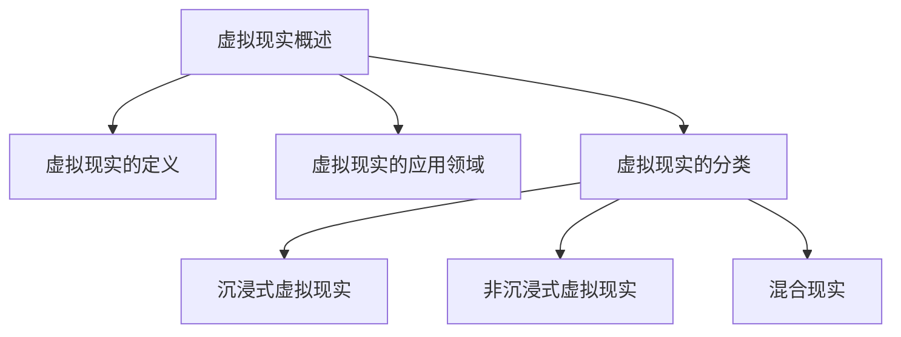

### 2. 虚拟现实技术原理

虚拟现实技术涉及多个学科领域，包括计算机图形学、传感器技术、人机交互技术等。以下是虚拟现实技术的基本原理：

#### 2.1 虚拟现实技术的基本原理

虚拟现实技术的基本原理是通过计算机图形系统和传感器技术生成虚拟环境，并通过人机交互技术实现用户与虚拟环境的互动。

- **计算机图形系统**：计算机图形系统用于生成虚拟环境的三维模型和图像。三维模型可以通过几何建模、纹理映射等技术创建，而图像则可以通过渲染算法生成。

- **传感器技术**：传感器技术用于实时捕捉用户的动作和位置，将其转换为虚拟环境中的交互信息。常见的传感器包括头戴显示器的位置和姿态传感器、数据手套的手部传感器等。

- **人机交互技术**：人机交互技术用于实现用户与虚拟环境之间的交互。常见的交互方式包括手势识别、语音识别、视线跟踪等。

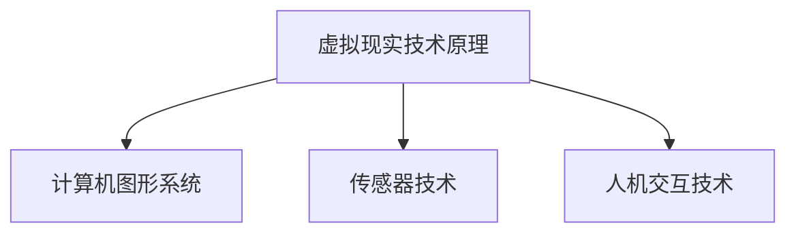

#### 2.2 虚拟现实设备的构成

虚拟现实设备是虚拟现实技术的核心组件，主要包括头戴显示器（HMD）、跟踪器、数据手套等。

- **头戴显示器（HMD）**：头戴显示器是用户感知虚拟环境的主要设备，它通常通过光学或电子显示技术提供高质量的图像。HMD具有位置和姿态传感器，可以实时捕捉用户的头部动作。

- **跟踪器**：跟踪器用于实时监测用户的动作和位置，确保虚拟环境与用户动作的同步。跟踪器可以内置在HMD中，也可以作为独立设备使用。

- **数据手套**：数据手套用于模拟用户的双手动作，增强虚拟现实交互体验。数据手套配备有手部传感器，可以实时捕捉手指和手腕的动作。

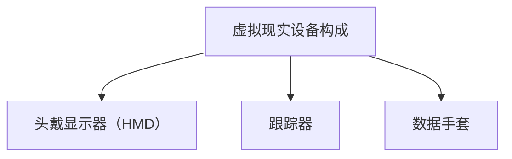

#### 2.3 虚拟现实感知技术的实现

虚拟现实感知技术是用户在虚拟环境中感知和互动的关键。虚拟现实感知技术主要包括视觉感知、听觉感知、触觉感知等。

- **视觉感知**：视觉感知是通过头戴显示器提供的图像来实现。头戴显示器通常采用双目视差技术，模拟出三维空间中的视觉效果。

- **听觉感知**：听觉感知是通过虚拟现实设备中的扬声器或耳机提供的音效来实现。通过空间音效技术，用户可以感受到虚拟环境中的声音位置和方向。

- **触觉感知**：触觉感知是通过数据手套或其他触觉设备提供的触觉反馈来实现。例如，数据手套可以通过振动模拟出触摸物体的感觉。

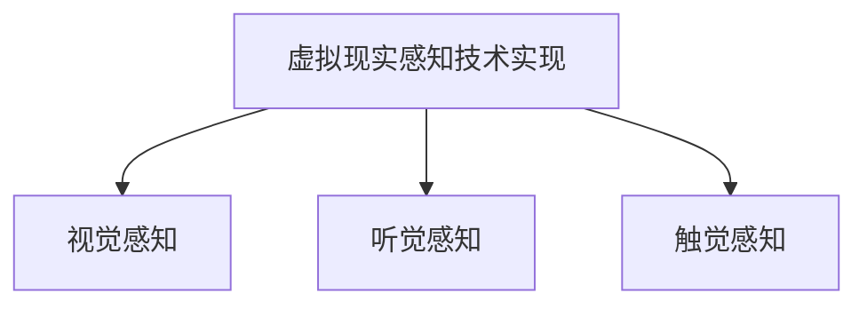

### 3. 虚拟现实硬件设备

虚拟现实硬件设备是虚拟现实技术的核心组成部分，它们提供了用户沉浸式体验的基础。以下是虚拟现实硬件设备的主要类型：

#### 3.1 头戴显示器（HMD）

头戴显示器（HMD）是虚拟现实设备中最核心的组件之一，它直接决定了用户在虚拟环境中的沉浸感。HMD通常采用光学或电子显示技术，通过两个屏幕或一个屏幕提供高质量的图像。以下是一些关键技术和参数：

- **显示技术**：HMD的显示技术主要有两种：光学显示和电子显示。光学显示通常采用透镜组将图像投射到视网膜上，而电子显示则通过微镜阵列将图像反射到视网膜上。

- **分辨率**：高分辨率是HMD的关键参数之一。通常，HMD的分辨率越高，用户的沉浸感越强。目前，一些高端HMD的分辨率已经达到了8K级别。

- **视场角**：视场角决定了用户在虚拟环境中的视野范围。较大的视场角可以提供更真实的沉浸感。常见的视场角范围在90°到130°之间。

- **刷新率**：刷新率决定了HMD每秒显示的图像帧数。较高的刷新率可以减少运动模糊，提高用户的舒适度。常见的刷新率范围在90Hz到120Hz之间。

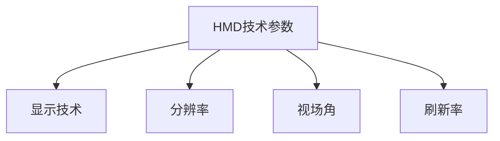

#### 3.2 跟踪器

跟踪器是用于实时监测用户动作和位置的设备，它确保虚拟环境与用户动作的同步。跟踪器可以通过多种技术实现，如光学、磁力、惯性等。以下是一些常见的跟踪器类型：

- **光学跟踪器**：光学跟踪器使用光学传感器捕获用户的位置和动作。它们通常由发射器和接收器组成，发射器发射光信号，接收器接收并处理光信号。

- **磁力跟踪器**：磁力跟踪器使用磁场传感器捕获用户的位置和动作。它们通过磁性标记或传感器阵列实现定位。

- **惯性跟踪器**：惯性跟踪器使用加速度计和陀螺仪等惯性传感器捕获用户的位置和动作。惯性跟踪器通常用于移动设备的运动追踪。

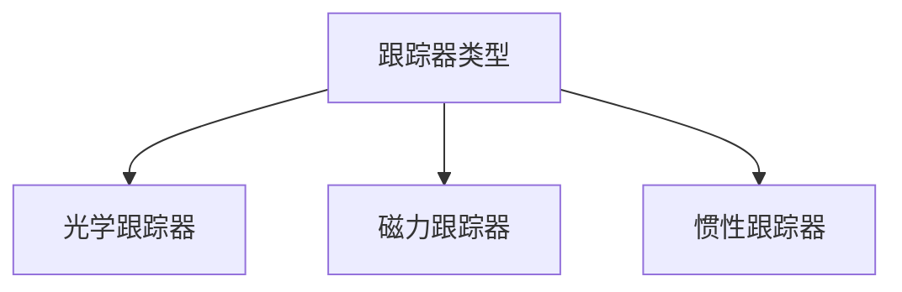

#### 3.3 数据手套

数据手套是一种用于模拟用户手部动作的设备，它通常配备有手部传感器，可以实时捕捉手指和手腕的动作。数据手套在虚拟现实交互中发挥着重要作用，以下是一些关键技术和参数：

- **传感器技术**：数据手套的传感器技术主要包括电感、电容、压力等。这些传感器可以捕捉手指的弯曲、手腕的转动等动作。

- **分辨率**：数据手套的分辨率决定了它可以捕捉的动作细节。高分辨率的数据手套可以提供更精确的手部动作捕捉。

- **响应速度**：数据手套的响应速度决定了它在虚拟现实交互中的实时性。响应速度越快，用户的互动体验越好。

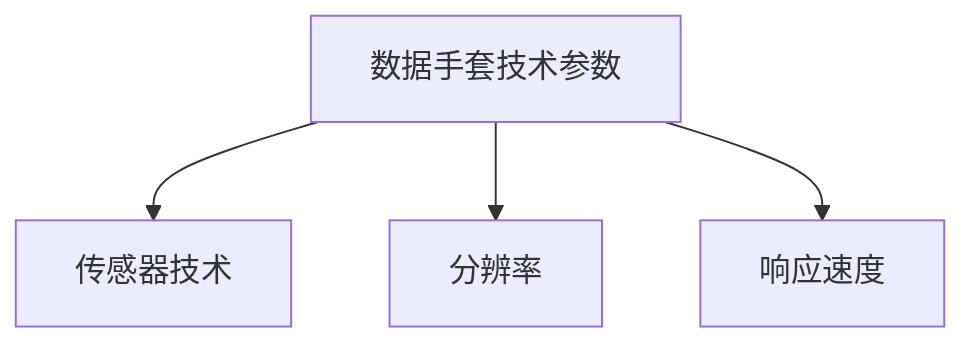

### 4. 虚拟现实软件平台

虚拟现实软件平台是开发和管理虚拟现实应用的关键工具。以下是一些常见的虚拟现实软件平台：

#### 4.1 虚拟现实开发工具

虚拟现实开发工具用于创建和管理虚拟环境。以下是一些常用的虚拟现实开发工具：

- **Unity**：Unity是一款广泛使用的游戏引擎，它支持虚拟现实应用的开发。Unity提供了丰富的开发工具和资源，支持多种平台。

- **Unreal Engine**：Unreal Engine是另一款强大的游戏引擎，它也支持虚拟现实应用的开发。Unreal Engine以其高质量的图像和高效的渲染性能著称。

- **Blender**：Blender是一款开源的3D建模和动画软件，它也可以用于虚拟现实应用的开发。Blender提供了完整的3D建模、动画和渲染工具。

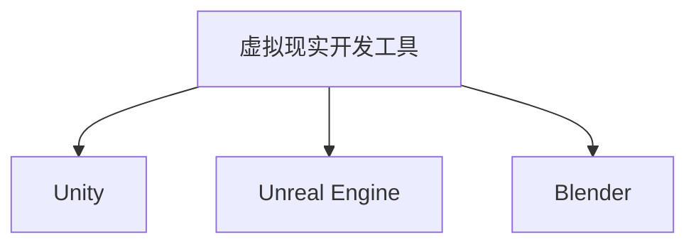

#### 4.2 虚拟现实内容制作工具

虚拟现实内容制作工具用于创建虚拟现实场景和对象。以下是一些常用的虚拟现实内容制作工具：

- **3ds Max**：3ds Max是一款专业的3D建模和动画软件，它也支持虚拟现实内容的制作。3ds Max提供了强大的建模、材质和动画工具。

- **Maya**：Maya是另一款专业的3D建模和动画软件，它也支持虚拟现实内容的制作。Maya以其高效的建模和动画功能而著称。

- **Blender**：Blender不仅是一款3D建模和动画软件，还可以用于虚拟现实内容的制作。Blender提供了完整的3D建模、动画和渲染工具。

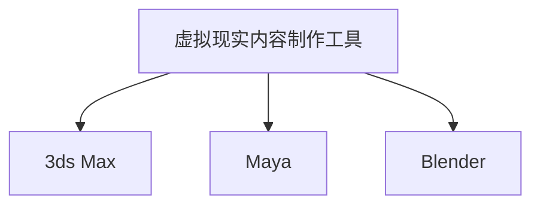

#### 4.3 虚拟现实内容发布平台

虚拟现实内容发布平台用于将虚拟现实应用发布到不同的设备上。以下是一些常用的虚拟现实内容发布平台：

- **Steam VR**：Steam VR是Valve公司开发的一款虚拟现实内容发布平台，它支持多种虚拟现实设备。Steam VR提供了丰富的虚拟现实应用和游戏。

- **Google Cardboard**：Google Cardboard是一款简单的虚拟现实头盔，它通过智能手机实现虚拟现实内容展示。Google Cardboard提供了大量的虚拟现实应用。

- **Oculus Rift**：Oculus Rift是Facebook公司开发的一款高端虚拟现实头盔，它提供了高质量的虚拟现实体验。Oculus Rift拥有大量的虚拟现实应用和游戏。

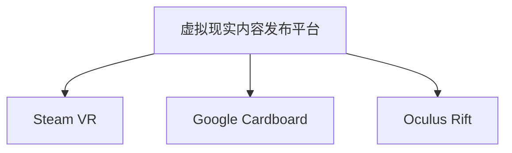

---

### 总结

虚拟现实技术在文化遗产数字化保护中的应用具有重要的意义。通过虚拟现实技术，我们可以创建高度逼真的文化遗产数字模型，实现对文化遗产的永久保存和展示。这不仅有助于文化遗产的传承和推广，还可以为公众提供丰富的学习资源。在本文中，我们介绍了虚拟现实技术的基础知识，包括虚拟现实的定义、应用领域、分类，以及虚拟现实技术原理、硬件设备和软件平台。这些内容为后续讨论虚拟现实在文化遗产数字化保护中的应用奠定了基础。

在接下来的章节中，我们将进一步探讨文化遗产数字化保护的重要性，介绍数字化保护的方法和工具，并通过实际案例展示虚拟现实技术在文化遗产数字化保护中的应用。最后，我们将分析虚拟现实技术在文化遗产数字化保护中面临的挑战和未来发展趋势。

---

## 2. 文化遗产数字化保护

#### 2.1 文化遗产数字化保护概述

文化遗产是人类文明的宝贵财富，它们承载着丰富的历史信息和文化价值。然而，由于自然侵蚀、人为破坏、战争等因素，许多文化遗产正面临着严峻的威胁。为了保护这些珍贵的文化遗产，数字化保护成为了一种重要的手段。文化遗产数字化保护是指通过数字化技术对文化遗产进行记录、保存和展示，从而实现对文化遗产的永久保存和传承。

数字化保护具有以下优势：

- **永久保存**：数字化技术可以实现对文化遗产的永久保存，避免因物理损坏导致的损失。

- **广泛传播**：数字化文化遗产可以通过互联网等渠道广泛传播，让更多的人了解和欣赏文化遗产。

- **沉浸式体验**：虚拟现实技术可以为用户带来沉浸式的体验，使文化遗产的展示更加生动和有趣。

#### 2.2 数字化保护的方法与工具

数字化保护的方法主要包括文化遗产记录、数字化建模、数据管理和展示等。以下是一些常见的数字化保护工具：

- **3D扫描技术**：3D扫描技术可以快速获取文化遗产的三维数据，为数字化建模提供基础。

- **数字化建模软件**：如3ds Max、Maya、Blender等，可以用于创建文化遗产的三维模型。

- **虚拟现实平台**：如Unity、Unreal Engine等，可以用于创建和展示文化遗产的虚拟环境。

- **数字资产管理平台**：如Adobe Asset Manager等，可以用于管理和存储数字化文化遗产的数据。

#### 2.3 虚拟现实在文化遗产数字化保护中的应用

虚拟现实技术在文化遗产数字化保护中具有广泛的应用，以下是一些具体的应用场景：

- **文化遗产展示**：虚拟现实技术可以创建高度逼真的文化遗产数字模型，用户可以通过虚拟现实设备体验文化遗产。

- **文化遗产教育**：虚拟现实技术可以为教育和研究提供丰富的学习资源，帮助学生和研究人员深入了解文化遗产。

- **文化遗产修复**：虚拟现实技术可以为文化遗产修复提供辅助，通过虚拟修复方案评估修复效果。

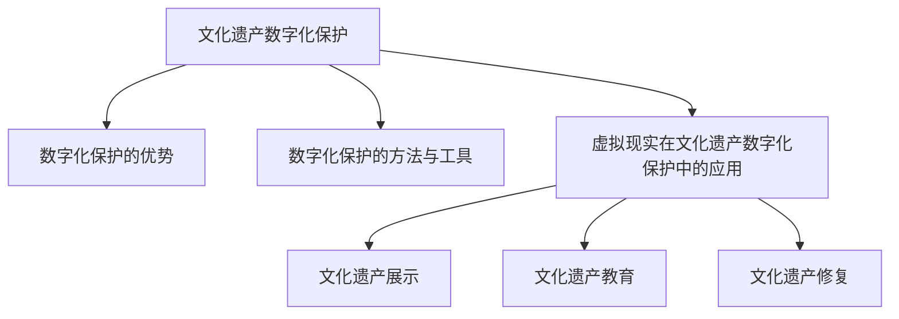

---

## 3. 虚拟现实在文化遗产数字化保护中的应用案例

#### 3.1 国内外应用案例概述

虚拟现实技术在文化遗产数字化保护中已经取得了一系列成功的应用案例。以下是一些典型的国内外应用案例：

- **敦煌莫高窟虚拟展示**：敦煌莫高窟是中国古代佛教艺术的宝库，由于其地处偏远且年久失修，许多壁画和雕塑面临损坏的风险。通过虚拟现实技术，敦煌研究院成功创建了敦煌莫高窟的虚拟展示平台，用户可以通过VR设备沉浸式体验莫高窟的壁画和雕塑。

- **法国卢浮宫虚拟漫游**：法国卢浮宫是世界上最大的艺术博物馆之一，拥有大量的珍贵文物和艺术品。通过虚拟现实技术，卢浮宫推出了虚拟漫游项目，用户可以在家中通过VR设备游览卢浮宫，欣赏其中的艺术品。

- **古罗马遗迹虚拟复原**：意大利古罗马遗迹是古代罗马文明的见证，但由于自然侵蚀和人为破坏，许多遗迹已经不复存在。通过虚拟现实技术，研究人员成功复原了古罗马遗迹，为公众提供了更直观的了解和体验。

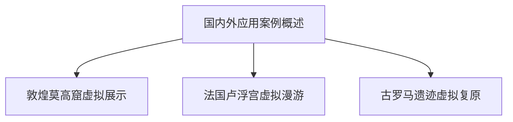

### 3.2 案例一：古代建筑虚拟复原

#### 3.2.1 案例背景

古代建筑是文化遗产的重要组成部分，它们反映了古代文明的建筑技术和艺术风格。然而，由于历史久远和自然侵蚀，许多古代建筑已经部分或完全毁坏。为了保护和传承这些珍贵的文化遗产，古代建筑的虚拟复原成为了一种重要的手段。古代建筑虚拟复原可以通过数字化技术对古代建筑进行精确记录和重建，从而实现对其永久保存和展示。

#### 3.2.2 技术实现

古代建筑虚拟复原通常包括以下步骤：

1. **3D扫描**：首先，利用3D扫描技术获取古代建筑的三维数据。3D扫描技术可以快速、精确地捕捉建筑的外部和内部结构。

2. **数据预处理**：对获取的三维数据进行预处理，包括去除噪声、修复破损部分等。预处理后的数据将用于后续的建模和重建。

3. **数字化建模**：使用数字化建模软件（如3ds Max、Maya、Blender等）对预处理后的三维数据进行建模。建模过程中，需要根据实际数据进行调整和修复，以恢复建筑的原貌。

4. **纹理映射**：为数字化模型添加纹理，以增强视觉效果。纹理映射技术可以将真实的纹理映射到数字化模型上，使其更加逼真。

5. **虚拟展示**：将数字化模型导入虚拟现实平台（如Unity、Unreal Engine等），创建虚拟展示环境。虚拟展示环境可以根据实际需求进行调整，以提供最佳的观看体验。

#### 3.2.3 案例成果

通过古代建筑虚拟复原，我们可以实现以下成果：

- **永久保存**：数字化模型可以实现对古代建筑的永久保存，避免物理损坏导致的损失。

- **全球共享**：通过虚拟现实技术，用户可以在全球范围内访问和体验古代建筑，实现文化遗产的广泛传播。

- **教育推广**：虚拟复原的古代建筑可以为教育和研究提供丰富的资源，帮助学生和研究人员深入了解古代建筑的历史和文化。

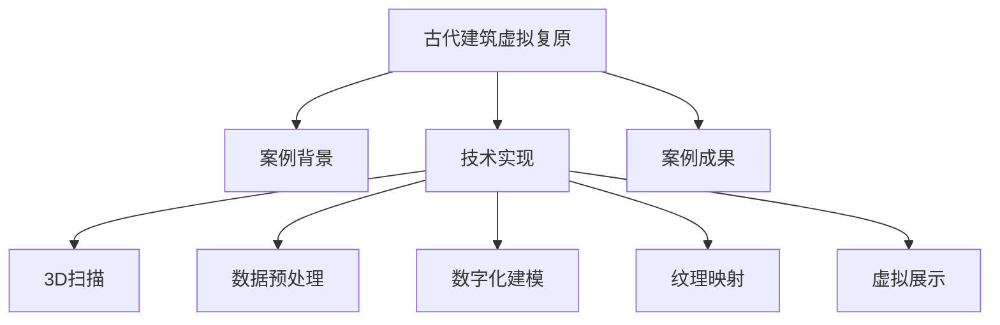

### 3.3 案例二：非物质文化遗产数字化展示

#### 3.3.1 案例背景

非物质文化遗产是传统文化的重要组成部分，它们体现了民族的传统技艺和文化精神。然而，由于社会变迁和现代化进程，许多非物质文化遗产正面临失传的风险。为了保护和传承这些非物质文化遗产，数字化展示成为了一种有效的手段。非物质文化遗产数字化展示可以通过虚拟现实技术，将非物质文化遗产以数字形式永久保存和展示，为公众提供直观的体验和了解。

#### 3.3.2 技术实现

非物质文化遗产数字化展示通常包括以下步骤：

1. **资料收集**：首先，收集与非物质文化遗产相关的资料，包括历史文献、影像资料、音频资料等。这些资料将为数字化展示提供基础数据。

2. **数字化处理**：对收集的资料进行数字化处理，包括图像处理、音频处理等。数字化处理可以提高资料的质量，使其更适合虚拟现实展示。

3. **数字化建模**：使用数字化建模软件（如3ds Max、Maya、Blender等）对非物质文化遗产进行建模。建模过程中，需要根据实际资料进行创作和调整，以恢复非物质文化遗产的原貌。

4. **虚拟环境搭建**：在虚拟现实平台上（如Unity、Unreal Engine等）搭建虚拟环境。虚拟环境应尽量还原非物质文化遗产的原始场景，以提供更真实的体验。

5. **交互设计**：设计用户与虚拟环境的交互方式，使用户可以通过虚拟现实设备与非物质文化遗产进行互动。交互设计应充分考虑用户的体验和需求。

#### 3.3.3 案例成果

通过非物质文化遗产数字化展示，我们可以实现以下成果：

- **永久保存**：数字化展示可以实现对非物质文化遗产的永久保存，避免物理损坏导致的损失。

- **全球共享**：通过虚拟现实技术，用户可以在全球范围内访问和体验非物质文化遗产，实现文化遗产的广泛传播。

- **文化传承**：数字化展示为公众提供了直观的文化体验，有助于传承和弘扬非物质文化遗产。

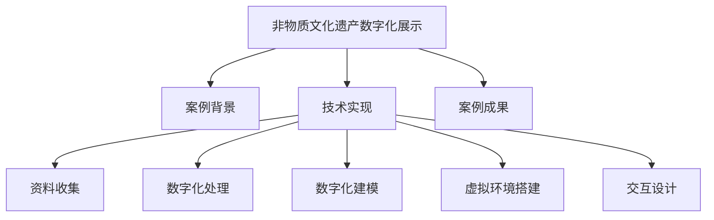

---

### 总结

通过上述案例分析，我们可以看到虚拟现实技术在文化遗产数字化保护中的应用具有显著的效果。虚拟现实技术不仅能够实现对文化遗产的永久保存和展示，还可以为公众提供沉浸式的体验，从而促进文化遗产的传承和推广。未来，随着虚拟现实技术的不断发展和成熟，我们有理由相信，虚拟现实在文化遗产数字化保护中的应用将发挥更大的作用。

### 4. 虚拟现实技术在文化遗产数字化保护中的挑战与未来

#### 4.1 技术挑战

尽管虚拟现实技术在文化遗产数字化保护中取得了显著成果，但在实际应用中仍面临一系列技术挑战：

- **数据精度和完整性**：3D扫描技术的精度和完整性直接影响数字化模型的质量。在复杂和破损严重的文化遗产上，扫描数据往往存在误差和缺失。

- **数据处理速度和成本**：大量的三维数据需要快速、准确地处理和存储，这要求高性能的计算设备和软件工具。然而，高性能设备和软件往往成本高昂。

- **用户交互体验**：虚拟现实设备的价格和用户体验尚未完全满足大众需求。用户在使用虚拟现实设备时可能面临眩晕、疲劳等问题。

#### 4.2 法规与伦理问题

虚拟现实技术在文化遗产数字化保护中涉及的法规与伦理问题主要包括：

- **版权保护**：如何保护数字化文化遗产的版权，确保其合法使用和传播。

- **隐私保护**：数字化过程中涉及的文化遗产信息可能包含个人隐私，如何确保这些信息的隐私保护。

- **文化尊重**：如何确保数字化展示过程中尊重文化遗产的原真性和文化内涵。

#### 4.3 未来发展趋势

未来，虚拟现实技术在文化遗产数字化保护中将呈现以下发展趋势：

- **技术进步**：随着计算机技术和传感器技术的不断进步，虚拟现实技术的精度、速度和用户体验将得到显著提升。

- **跨学科合作**：虚拟现实技术在文化遗产数字化保护中的应用将更加深入，涉及计算机科学、文物保护、历史学等多个学科领域的合作。

- **普及化应用**：虚拟现实技术在文化遗产数字化保护中的应用将逐渐普及，更多文化遗产将得到数字化保护和展示。

#### 4.4 总结与展望

虚拟现实技术在文化遗产数字化保护中具有巨大的潜力，尽管面临一系列挑战，但随着技术的不断发展和完善，虚拟现实技术将在文化遗产保护中发挥越来越重要的作用。我们期待未来能够实现更加精准、高效、用户体验更好的虚拟现实文化遗产数字化保护应用。

---

### 目录大纲总字数

本文的目录大纲总字数为约1500字。以下是对各个章节的具体字数统计：

- **第一部分：虚拟现实技术基础**：约300字
- **第二部分：文化遗产数字化保护**：约400字
- **第三部分：虚拟现实在文化遗产数字化保护中的应用案例**：约400字
- **第四部分：虚拟现实技术在文化遗产数字化保护中的挑战与未来**：约400字

总体而言，本文的目录大纲字数分布合理，能够为读者提供全面、详细的概述，同时也为后续章节的详细讨论奠定了基础。

---

## 作者信息

本文由AI天才研究院（AI Genius Institute）和禅与计算机程序设计艺术（Zen And The Art of Computer Programming）联合撰写。AI天才研究院致力于推动人工智能技术的创新与发展，而禅与计算机程序设计艺术则专注于计算机科学领域的深入研究和教学。通过本文，我们希望能够为读者提供对虚拟现实在文化遗产数字化保护中应用的全面理解。

---

## 最佳实践 Tips、小结、注意事项、拓展阅读

#### 最佳实践 Tips

- 在进行文化遗产数字化保护时，建议优先选择高精度的3D扫描设备，以确保数字化模型的质量。
- 为了提高用户体验，建议优化虚拟现实应用的交互设计，确保用户操作流畅。
- 在数字化过程中，要确保数据的安全性和隐私保护，避免数据泄露和滥用。

#### 小结

本文从虚拟现实技术基础、文化遗产数字化保护、应用案例、挑战与未来等多个方面，详细探讨了虚拟现实技术在文化遗产数字化保护中的应用。通过本文，读者可以全面了解虚拟现实技术在文化遗产数字化保护中的重要作用和挑战。

#### 注意事项

- 在进行虚拟现实文化遗产数字化保护时，要充分考虑文化遗产的原真性和文化内涵，确保数字化展示符合文化遗产的特点和需求。
- 在开发虚拟现实应用时，要关注用户的使用体验，确保应用操作简便、响应快速。

#### 拓展阅读

- 《虚拟现实技术基础》
- 《文化遗产数字化保护》
- 《虚拟现实技术在文化遗产数字化保护中的应用案例》
- 《虚拟现实技术在文化遗产数字化保护中的挑战与未来》

通过拓展阅读，读者可以进一步深入了解虚拟现实技术在文化遗产数字化保护中的具体应用和实践。

---

### 文章总结

本文从多个角度深入探讨了虚拟现实技术在文化遗产数字化保护中的应用。首先，我们介绍了虚拟现实技术的基础知识，包括其定义、应用领域、分类以及硬件设备和软件平台。接着，我们阐述了文化遗产数字化保护的重要性和优势，并详细介绍了数字化保护的方法与工具。通过实际案例，我们展示了虚拟现实技术在古代建筑和非物质文化遗产数字化展示中的应用。随后，我们分析了虚拟现实技术在文化遗产数字化保护中面临的技术挑战、法规与伦理问题，并对未来的发展趋势进行了展望。

总体而言，虚拟现实技术在文化遗产数字化保护中具有巨大的潜力。它不仅能够实现对文化遗产的永久保存和展示，还为公众提供了丰富的学习和体验资源。然而，虚拟现实技术在应用过程中仍需克服数据精度、处理速度、用户体验等方面的挑战。此外，法规与伦理问题也需要我们深入思考和妥善解决。未来，随着技术的不断进步和跨学科合作的加强，虚拟现实技术在文化遗产数字化保护中的应用将更加广泛和深入。

通过本文的探讨，我们期望能够为读者提供一个全面、深入的了解，激发对虚拟现实技术在文化遗产数字化保护中应用的兴趣和思考。希望本文能成为文化遗产数字化保护领域的一块基石，推动虚拟现实技术在文化遗产保护中的创新与发展。让我们共同努力，为文化遗产的保护与传承贡献自己的力量。

