                 


### 文章标题

《融合计算平台：混合计算环境下的企业IT架构》

### 关键词

融合计算平台，混合计算环境，企业IT架构，分布式计算，负载均衡，安全与隐私保护

### 摘要

本文旨在深入探讨融合计算平台在混合计算环境下的企业IT架构设计。通过系统地介绍融合计算平台的概念、架构设计、关键算法和优化技术，本文为读者提供了一个全面的理解，并分析了融合计算平台在实际项目中的应用和安全挑战。文章还展望了融合计算平台的未来发展趋势，为企业IT架构的优化提供了有益的参考。

---

### 引言

在当今信息爆炸的时代，企业对计算能力的需求日益增长，尤其是面对大数据、人工智能和云计算等新兴技术的应用场景。传统的单一计算模式已经无法满足企业日益复杂的计算需求。为了应对这种挑战，融合计算平台（Federated Computing Platform）应运而生。融合计算平台旨在整合多种计算资源和技术，提供一个灵活、高效、安全的计算环境，以满足企业在混合计算环境下的多样化需求。

本文将首先介绍融合计算平台的基本概念，然后深入探讨其架构设计、关键算法和优化技术。接着，我们将分析融合计算平台在实际项目中的应用，并探讨其在安全与隐私保护方面面临的挑战。最后，本文将展望融合计算平台的未来发展趋势，为企业的IT架构优化提供参考。

### 第1章 融合计算平台概述

#### 1.1 融合计算平台的定义与背景

融合计算平台是一种集成多种计算资源和技术，提供灵活、高效、安全计算环境的系统。它能够整合分布式计算、云计算、边缘计算等多种计算模式，形成一个统一的计算框架。融合计算平台的目标是优化资源利用、提高计算性能、增强系统可扩展性和可靠性。

融合计算平台的背景源于企业计算需求的多样化和复杂性。随着大数据、人工智能、物联网等技术的发展，企业需要处理的海量数据和计算任务日益增加。单一计算模式难以满足这种需求，导致企业面临计算资源浪费、性能瓶颈、安全风险等问题。为了解决这些问题，融合计算平台应运而生。

#### 1.2 混合计算环境的特点

混合计算环境是指由多种计算资源和技术组成的计算生态。其特点包括：

1. **并行计算与分布式计算**：混合计算环境支持并行计算和分布式计算，能够高效处理大规模数据。
2. **硬件异构性与多样性**：混合计算环境中的硬件资源具有异构性和多样性，包括不同类型的CPU、GPU、FPGA等。
3. **动态资源分配**：混合计算环境能够根据实际需求动态分配计算资源，提高资源利用率。
4. **高度可扩展性**：混合计算环境能够灵活扩展，支持企业业务的快速增长。

#### 1.3 融合计算平台的目标与优势

融合计算平台的主要目标包括：

1. **优化资源利用**：通过整合多种计算资源，提高资源利用率，降低企业运营成本。
2. **提高计算性能**：利用分布式计算和并行计算技术，提高计算性能，满足大规模数据处理需求。
3. **增强系统可扩展性和可靠性**：支持动态资源分配和弹性扩展，提高系统可扩展性和可靠性。

融合计算平台的优势包括：

1. **灵活性**：支持多种计算模式，满足企业多样化需求。
2. **高效性**：利用并行计算和分布式计算技术，提高计算效率。
3. **安全性**：提供完善的安全机制，保护企业数据安全和隐私。
4. **可扩展性**：支持弹性扩展，适应企业业务增长。

#### 1.4 融合计算平台的发展历程

融合计算平台的发展历程可以划分为以下几个阶段：

1. **第一阶段（2000-2010年）**：主要研究分布式计算技术和并行计算技术。
2. **第二阶段（2010-2015年）**：随着云计算技术的发展，融合计算平台开始与云计算相结合。
3. **第三阶段（2015年至今）**：边缘计算和物联网技术的兴起，推动融合计算平台向更广泛的场景发展。

### 第2章 融合计算架构与关键技术

#### 2.1 融合计算架构的核心概念

融合计算架构的核心概念包括：

1. **资源管理**：通过资源管理器实现计算资源的动态分配和调度。
2. **负载均衡**：通过负载均衡算法实现计算任务的合理分配，提高系统性能。
3. **容器化与虚拟化技术**：通过容器化和虚拟化技术实现计算资源的隔离和高效利用。

#### 2.2 融合计算的关键技术

融合计算的关键技术包括：

1. **分布式计算算法**：如MapReduce、Spark等，实现大规模数据的并行处理。
2. **机器学习算法**：如深度学习、强化学习等，实现数据分析和智能决策。
3. **优化技术**：如并行化优化、量化与压缩技术等，提高计算性能和效率。

#### 2.3 融合计算平台的体系结构

融合计算平台的体系结构通常包括以下层次：

1. **硬件层**：包括CPU、GPU、FPGA等硬件资源。
2. **软件层**：包括操作系统、中间件、应用程序等软件资源。
3. **数据层**：包括数据库、数据仓库、数据湖等数据资源。

### 第3章 融合计算平台的体系结构

#### 3.1 融合计算平台的整体架构

融合计算平台的整体架构包括：

1. **计算层**：提供计算能力，包括CPU、GPU、FPGA等。
2. **存储层**：提供数据存储和管理，包括分布式文件系统、数据库等。
3. **网络层**：提供网络连接和通信，包括SDN、SD-WAN等。
4. **管理层**：提供资源管理、负载均衡、监控等管理功能。

#### 3.2 软件层架构

软件层架构包括：

1. **应用层**：包括业务应用程序、Web服务、移动应用等。
2. **服务层**：包括API网关、服务注册与发现、负载均衡等。
3. **数据层**：包括数据存储、数据缓存、数据管理等功能。

#### 3.3 硬件层架构

硬件层架构包括：

1. **服务器集群**：提供计算能力，包括CPU、GPU、存储等。
2. **网络设备**：提供网络连接，包括交换机、路由器等。
3. **存储设备**：提供数据存储，包括SSD、HDD等。

#### 3.4 数据存储与管理

数据存储与管理包括：

1. **分布式文件系统**：如HDFS、Ceph等，提供海量数据存储。
2. **数据库**：如MySQL、PostgreSQL等，提供结构化数据存储。
3. **数据仓库**：如Hive、Spark SQL等，提供大数据查询和分析。
4. **数据湖**：如Hadoop、Docker等，提供非结构化数据存储。

### 第4章 关键算法与优化技术

#### 4.1 融合计算的核心算法

融合计算的核心算法包括：

1. **分布式计算算法**：如MapReduce、Spark等，实现大规模数据的并行处理。
2. **机器学习算法**：如深度学习、强化学习等，实现数据分析和智能决策。
3. **优化技术**：如并行化优化、量化与压缩技术等，提高计算性能和效率。

#### 4.2 算法优化技术

算法优化技术包括：

1. **并行化优化**：通过并行计算技术提高算法的执行速度。
2. **量化与压缩技术**：通过降低数据精度和压缩数据体积提高计算效率。

### 第5章 融合计算平台在实际项目中的应用

#### 5.1 融合计算平台的应用场景

融合计算平台的应用场景包括：

1. **大数据处理**：如社交媒体数据分析、金融风险评估等。
2. **人工智能**：如自动驾驶、智能医疗等。
3. **物联网**：如智能家居、智能工厂等。

#### 5.2 实际项目案例分析

本文将介绍以下实际项目案例：

1. **案例1：社交媒体数据分析**
2. **案例2：自动驾驶**
3. **案例3：智能医疗**

#### 5.3 项目实施经验与教训

本文将总结以下项目实施经验与教训：

1. **经验**：如何高效地整合计算资源，实现业务目标。
2. **教训**：如何应对项目中的挑战和问题，确保项目成功。

### 第6章 融合计算平台的安全与隐私保护

#### 6.1 安全威胁与防护策略

融合计算平台的安全威胁包括：

1. **数据泄露**：如何保护企业数据不被未经授权的访问。
2. **网络攻击**：如何防范DDoS攻击、恶意软件等网络攻击。

融合计算平台的防护策略包括：

1. **身份认证与访问控制**：如何确保只有授权用户可以访问系统。
2. **数据加密**：如何对敏感数据进行加密，防止数据泄露。

#### 6.2 数据隐私保护技术

数据隐私保护技术包括：

1. **数据脱敏**：如何对敏感数据进行脱敏处理，保护隐私。
2. **隐私计算**：如何实现数据在本地处理，避免数据在传输过程中泄露。

#### 6.3 安全合规与审计

融合计算平台需要遵守以下安全合规标准：

1. **ISO/IEC 27001**：信息安全管理体系标准。
2. **GDPR**：欧盟通用数据保护条例。

审计包括：

1. **安全评估**：定期进行安全评估，发现潜在的安全漏洞。
2. **日志审计**：记录系统操作日志，便于追踪和调查安全事件。

### 第7章 融合计算平台的未来发展趋势

#### 7.1 技术发展趋势

融合计算平台的未来技术发展趋势包括：

1. **量子计算**：量子计算将大大提升计算性能，为融合计算平台带来新的机遇。
2. **边缘计算**：边缘计算将进一步拓展融合计算平台的覆盖范围，满足更广泛的应用需求。

#### 7.2 应用趋势

融合计算平台的应用趋势包括：

1. **智慧城市**：融合计算平台将在智慧城市建设中发挥关键作用，提高城市运营效率。
2. **智能制造**：融合计算平台将推动智能制造的发展，提升生产效率。

#### 7.3 未来挑战与机遇

融合计算平台的未来挑战包括：

1. **技术复杂性**：随着技术的不断发展，融合计算平台的架构和实现将变得更加复杂。
2. **安全与隐私**：如何在保持高性能的同时，确保数据安全和隐私。

未来的机遇包括：

1. **新兴技术**：如5G、物联网等新兴技术的快速发展，将推动融合计算平台的应用拓展。
2. **市场潜力**：随着企业对计算能力的需求不断增长，融合计算平台的市场潜力巨大。

### 总结

融合计算平台作为混合计算环境下的企业IT架构，具有优化资源利用、提高计算性能、增强系统可扩展性和可靠性的优势。本文系统地介绍了融合计算平台的概念、架构设计、关键算法和优化技术，并分析了其实际应用和安全挑战。未来，融合计算平台将继续发展，为企业的IT架构优化带来新的机遇和挑战。

### 作者信息

作者：AI天才研究院/AI Genius Institute & 禅与计算机程序设计艺术 /Zen And The Art of Computer Programming

---

以上是《融合计算平台：混合计算环境下的企业IT架构》的完整文章大纲。接下来，我们将逐步填充各个章节的内容，确保文章的逻辑清晰、结构紧凑、简单易懂，并对技术原理和本质进行深入剖析。

### 1.1 融合计算平台的定义与背景

融合计算平台（Federated Computing Platform）是一种集成多种计算资源和技术，提供灵活、高效、安全计算环境的系统。它能够整合分布式计算、云计算、边缘计算等多种计算模式，形成一个统一的计算框架。融合计算平台旨在优化资源利用、提高计算性能、增强系统可扩展性和可靠性，以满足企业在混合计算环境下的多样化需求。

#### 背景介绍

融合计算平台的产生源于企业计算需求的多样化和复杂性。随着大数据、人工智能、物联网等新兴技术的迅速发展，企业需要处理的海量数据和计算任务日益增加。传统的单一计算模式已经无法满足这种需求，导致企业面临计算资源浪费、性能瓶颈、安全风险等问题。为了解决这些问题，融合计算平台应运而生。

#### 融合计算平台的定义

融合计算平台是一种集成多种计算资源和技术，提供灵活、高效、安全计算环境的系统。它具有以下特点：

1. **整合多种计算模式**：融合计算平台能够整合分布式计算、云计算、边缘计算等多种计算模式，形成一个统一的计算框架。
2. **资源高效利用**：融合计算平台通过资源管理技术实现计算资源的动态分配和调度，提高资源利用率。
3. **高性能计算**：融合计算平台利用分布式计算和并行计算技术，提高计算性能，满足大规模数据处理需求。
4. **安全性保障**：融合计算平台提供完善的安全机制，保护企业数据安全和隐私。

#### 融合计算平台的优势

融合计算平台具有以下优势：

1. **灵活性**：融合计算平台支持多种计算模式，能够满足企业多样化需求。
2. **高效性**：融合计算平台利用分布式计算和并行计算技术，提高计算效率。
3. **安全性**：融合计算平台提供完善的安全机制，保护企业数据安全和隐私。
4. **可扩展性**：融合计算平台支持弹性扩展，适应企业业务增长。

#### 融合计算平台的发展历程

融合计算平台的发展历程可以分为以下几个阶段：

1. **第一阶段（2000-2010年）**：主要研究分布式计算技术和并行计算技术。
2. **第二阶段（2010-2015年）**：随着云计算技术的发展，融合计算平台开始与云计算相结合。
3. **第三阶段（2015年至今）**：边缘计算和物联网技术的兴起，推动融合计算平台向更广泛的场景发展。

### 第2章 融合计算架构与关键技术

融合计算平台的核心在于其架构设计和关键技术的应用。本章将详细介绍融合计算平台的架构设计、资源管理、负载均衡、容器化与虚拟化技术，以及分布式计算和机器学习算法等核心技术。

#### 2.1 融合计算架构的核心概念

融合计算架构的核心概念包括以下几个方面：

1. **资源管理**：资源管理是融合计算平台的核心功能之一，它负责管理和调度计算资源，包括CPU、内存、存储和网络等。资源管理器通过算法和策略，实现计算资源的动态分配和调度，确保系统的高效运行。
2. **负载均衡**：负载均衡技术用于平衡不同计算节点之间的负载，避免单点过载和资源浪费。通过负载均衡，融合计算平台能够提高系统的整体性能和可靠性。
3. **容器化与虚拟化技术**：容器化和虚拟化技术是实现计算资源隔离和高效利用的重要手段。容器化技术如Docker，通过轻量级的虚拟化实现应用程序的隔离和快速部署；虚拟化技术如KVM和VMware，通过虚拟化硬件资源提供更灵活的计算环境。
4. **分布式计算和存储**：分布式计算和存储技术是融合计算平台的基础，通过将计算任务和数据分布在多个节点上，实现大规模数据处理和高可用性。

#### 2.2 融合计算平台的关键技术

融合计算平台的关键技术包括：

1. **分布式计算算法**：分布式计算算法如MapReduce和Spark，用于处理大规模数据。MapReduce通过Map和Reduce两个阶段，实现数据的并行处理；Spark则通过内存计算和弹性调度，提高计算效率和性能。
2. **机器学习算法**：机器学习算法如深度学习和强化学习，用于实现数据分析和智能决策。深度学习通过多层神经网络实现数据的自动特征提取和分类；强化学习则通过试错和学习，实现智能决策。
3. **优化技术**：优化技术包括并行化优化、量化与压缩技术等，用于提高计算性能和效率。并行化优化通过并行计算提高算法的执行速度；量化与压缩技术通过降低数据精度和压缩数据体积，提高计算效率。
4. **容器化与虚拟化技术**：容器化与虚拟化技术如Docker和KVM，通过轻量级的虚拟化实现应用程序的隔离和快速部署，提高资源利用率和灵活性。

### 第3章 融合计算平台的体系结构

融合计算平台的体系结构是确保系统高效运行和灵活扩展的关键。本章将详细描述融合计算平台的整体架构、软件层架构、硬件层架构以及数据存储与管理。

#### 3.1 融合计算平台的整体架构

融合计算平台的整体架构包括以下几个层次：

1. **计算层**：计算层是融合计算平台的核心，负责提供计算能力。它包括CPU、GPU、FPGA等多种硬件资源，通过分布式计算和并行计算技术，实现大规模数据的快速处理。
2. **存储层**：存储层负责数据存储和管理，包括分布式文件系统、数据库和数据仓库等。分布式文件系统如HDFS，提供海量数据的存储和访问；数据库如MySQL和PostgreSQL，提供结构化数据存储；数据仓库如Hive和Spark SQL，提供大数据查询和分析。
3. **网络层**：网络层负责网络连接和通信，包括SDN（软件定义网络）和SD-WAN（软件定义广域网络）等。通过SDN，可以实现网络的灵活管理和优化；通过SD-WAN，可以实现远程网络的可靠连接。
4. **管理层**：管理层负责资源管理、负载均衡、监控等管理功能。通过资源管理器，实现计算资源的动态分配和调度；通过负载均衡器，实现计算任务的合理分配；通过监控系统，实时监控系统的运行状态和性能。

#### 3.2 软件层架构

软件层架构是融合计算平台的核心，包括以下几个层次：

1. **应用层**：应用层包括业务应用程序、Web服务、移动应用等，负责具体的业务功能实现。通过应用层，用户可以访问和操作融合计算平台的各种功能和服务。
2. **服务层**：服务层包括API网关、服务注册与发现、负载均衡等，负责服务的注册、发现和调用。通过服务层，可以实现服务的解耦和灵活部署，提高系统的可扩展性和可靠性。
3. **数据层**：数据层包括数据存储、数据缓存、数据管理等，负责数据的存储和管理。通过数据层，可以实现数据的快速访问和处理，提高系统的性能和效率。

#### 3.3 硬件层架构

硬件层架构是融合计算平台的基础，包括以下几个部分：

1. **服务器集群**：服务器集群是计算层的主要组成部分，包括CPU、内存、存储和网络等硬件资源。通过分布式计算和并行计算技术，服务器集群可以实现大规模数据的快速处理。
2. **网络设备**：网络设备包括交换机、路由器等，负责网络连接和通信。通过SDN和SD-WAN技术，可以实现网络的灵活管理和优化，提高网络的可靠性和性能。
3. **存储设备**：存储设备包括SSD、HDD等，负责数据存储和管理。通过分布式文件系统、数据库和数据仓库等，可以实现海量数据的存储和高效访问。

#### 3.4 数据存储与管理

数据存储与管理是融合计算平台的重要组成部分，包括以下几个层次：

1. **分布式文件系统**：分布式文件系统如HDFS和Ceph，提供海量数据的存储和高效访问。通过分布式文件系统，可以实现数据的可靠存储和高效读取，满足大规模数据处理需求。
2. **数据库**：数据库如MySQL和PostgreSQL，提供结构化数据存储。通过数据库，可以实现数据的快速查询和操作，支持复杂的业务逻辑和数据处理需求。
3. **数据仓库**：数据仓库如Hive和Spark SQL，提供大数据查询和分析。通过数据仓库，可以实现数据的整合和分析，为业务决策提供数据支持。
4. **数据湖**：数据湖如Hadoop和Docker，提供非结构化数据存储。通过数据湖，可以实现大规模数据的存储和管理，支持多样化数据处理需求。

### 第4章 关键算法与优化技术

融合计算平台的关键算法和优化技术是确保系统高效运行和性能优化的重要手段。本章将详细介绍分布式计算算法、机器学习算法、优化技术等，并使用伪代码和数学模型进行详细讲解。

#### 4.1 分布式计算算法

分布式计算算法是融合计算平台的核心技术之一，用于处理大规模数据。本章将介绍两个常用的分布式计算算法：MapReduce和Spark。

##### 4.1.1 MapReduce算法

MapReduce是一种分布式计算模型，由Map和Reduce两个阶段组成。

1. **Map阶段**：Map阶段对输入数据进行处理，生成中间结果。具体步骤如下：

   ```
   function map(Key1, Value1):
       // 对输入数据进行处理
       for each Key2, Value2 in Value1:
           Emit(Key2, mapValue(Key2, Value2))
   ```

2. **Reduce阶段**：Reduce阶段对中间结果进行合并和汇总，生成最终结果。具体步骤如下：

   ```
   function reduce(Key2, list_of_values):
       // 对中间结果进行合并和汇总
       result = reduceFunction(list_of_values)
       Emit(Key2, result)
   ```

##### 4.1.2 Spark算法

Spark是一种基于内存计算的分布式计算框架，提供了更高效的分布式计算算法。

1. **Spark Core算法**：Spark Core是Spark的基础模块，提供了分布式计算的核心功能。具体步骤如下：

   ```
   function sparkCore(data, mapFunction, reduceFunction):
       // 对输入数据进行处理
       rdd = parallelize(data)
       intermediateResults = rdd.map(mapFunction).reduceByKey(reduceFunction)
       finalResult = intermediateResults.collect()
       return finalResult
   ```

2. **Spark SQL算法**：Spark SQL是Spark的数据处理模块，提供了类似SQL的查询语言。具体步骤如下：

   ```
   function sparkSQL(query):
       // 对输入数据进行查询
       df = sqlContext.sql(query)
       result = df.collect()
       return result
   ```

#### 4.2 机器学习算法

机器学习算法是融合计算平台用于数据分析和智能决策的重要工具。本章将介绍两个常用的机器学习算法：深度学习和强化学习。

##### 4.2.1 深度学习算法

深度学习是一种基于多层神经网络的机器学习算法，用于数据的自动特征提取和分类。

1. **神经网络模型**：神经网络模型由输入层、隐藏层和输出层组成。具体步骤如下：

   ```
   function neuralNetwork(inputs, weights, biases):
       // 对输入数据进行处理
       hiddenLayer = sigmoid(dot(inputs, weights) + biases)
       outputLayer = sigmoid(dot(hiddenLayer, weights) + biases)
       return outputLayer
   ```

2. **反向传播算法**：反向传播算法用于优化神经网络模型。具体步骤如下：

   ```
   function backpropagation(inputs, labels, weights, biases):
       // 计算损失函数
       loss = computeLoss(inputs, labels, outputLayer)

       // 反向传播更新权重和偏置
       dweights = dot(transpose(hiddenLayer), doutputLayer)
       dbiases = doutputLayer

       dhiddenLayer = dot(transpose(outputLayer), dweights)
       dinputs = dhiddenLayer

       return dweights, dbiases, dinputs
   ```

##### 4.2.2 强化学习算法

强化学习是一种基于试错和反馈的机器学习算法，用于实现智能决策。

1. **Q-learning算法**：Q-learning算法是一种基于值函数的强化学习算法。具体步骤如下：

   ```
   function Q-learning(states, actions, rewards, learningRate, discountFactor):
       // 初始化Q值函数
       Q = []

       // 更新Q值函数
       for each state in states:
           for each action in actions:
               Q[state][action] = Q[state][action] + learningRate * (rewards[state, action] + discountFactor * max(Q[state]))

       return Q
   ```

2. **策略迭代算法**：策略迭代算法用于优化智能决策。具体步骤如下：

   ```
   function policyIteration(states, actions, rewards, learningRate, discountFactor):
       // 初始化策略
       policy = []

       // 迭代优化策略
       while True:
           Q = Q-learning(states, actions, rewards, learningRate, discountFactor)
           bestActions = [argmax(Q[state]) for state in states]
           if bestActions == policy:
               break
           else:
               policy = bestActions

       return policy
   ```

#### 4.3 优化技术

优化技术用于提高计算性能和效率，包括并行化优化、量化与压缩技术等。

##### 4.3.1 并行化优化

并行化优化通过将计算任务分解为多个子任务，并在多个计算节点上并行执行，提高计算效率。

1. **任务分解**：任务分解是将大规模计算任务分解为多个小任务。具体步骤如下：

   ```
   function parallelizeTask(task, numWorkers):
       // 分解任务
       tasks = []

       for i in range(numWorkers):
           tasks.append(splitTask(task, i, numWorkers))

       return tasks
   ```

2. **任务调度**：任务调度是将分解后的任务分配给计算节点，并在节点上并行执行。具体步骤如下：

   ```
   function scheduleTasks(tasks, workers):
       // 调度任务
       for task in tasks:
           worker = selectWorker(workers)
           worker.executeTask(task)
   ```

##### 4.3.2 量化与压缩技术

量化与压缩技术通过降低数据精度和压缩数据体积，提高计算效率和存储空间利用率。

1. **量化技术**：量化技术是将连续数据转换为离散数据，减少数据的精度。具体步骤如下：

   ```
   function quantize(data, numBits):
       // 量化数据
       quantizedData = []

       for value in data:
           quantizedValue = round(value / (2 ^ (numBits - 1)))
           quantizedData.append(quantizedValue)

       return quantizedData
   ```

2. **压缩技术**：压缩技术是将数据压缩为更小的体积，减少存储空间。具体步骤如下：

   ```
   function compress(data, compressionAlgorithm):
       // 压缩数据
       compressedData = compressionAlgorithm.compress(data)

       return compressedData
   ```

### 第5章 融合计算平台在实际项目中的应用

融合计算平台在多个领域有着广泛的应用。本章将介绍融合计算平台在社交媒体数据分析、自动驾驶和智能医疗等实际项目中的应用，并分析项目实施中的挑战和解决方案。

#### 5.1 社交媒体数据分析

社交媒体数据分析是融合计算平台的一个重要应用场景。通过融合计算平台，可以对海量社交媒体数据进行实时分析和挖掘，为市场营销、用户行为分析等提供数据支持。

**案例：一家社交媒体公司使用融合计算平台进行用户行为分析**

1. **项目背景**：该社交媒体公司拥有大量用户数据，包括用户信息、发布内容、互动行为等。为了更好地了解用户行为，提高用户体验，公司决定使用融合计算平台进行用户行为分析。
2. **项目目标**：通过融合计算平台，实现对海量用户数据的实时分析和挖掘，发现用户行为模式，为市场营销和用户体验优化提供数据支持。
3. **解决方案**：
   - **分布式计算**：使用Spark进行分布式计算，处理海量用户数据。
   - **机器学习**：使用深度学习算法进行用户行为预测和分类。
   - **实时处理**：使用Kafka进行实时数据流处理，实现对用户行为的实时分析。
4. **项目挑战**：
   - **数据处理速度**：由于数据量巨大，如何提高数据处理速度是项目的一个挑战。解决方案是通过分布式计算和并行化优化，提高数据处理效率。
   - **数据隐私**：用户数据包含敏感信息，如何保护数据隐私是项目的一个重要挑战。解决方案是通过数据加密和数据脱敏技术，确保数据安全。

**项目小结**：通过融合计算平台，该社交媒体公司成功实现了对用户行为的实时分析和挖掘，提高了市场营销效果和用户体验。同时，通过分布式计算和隐私保护技术，解决了项目中的数据处理速度和数据隐私问题。

#### 5.2 自动驾驶

自动驾驶是融合计算平台的另一个重要应用场景。通过融合计算平台，可以实现自动驾驶车辆的实时感知、决策和路径规划。

**案例：一家自动驾驶公司使用融合计算平台开发自动驾驶系统**

1. **项目背景**：自动驾驶技术的发展对计算能力提出了极高要求。为了提高自动驾驶系统的性能和可靠性，公司决定采用融合计算平台。
2. **项目目标**：通过融合计算平台，实现自动驾驶车辆的实时感知、决策和路径规划，提高自动驾驶系统的安全性和稳定性。
3. **解决方案**：
   - **分布式计算**：使用GPU和FPGA等硬件资源，进行大规模并行计算，提高感知和决策速度。
   - **机器学习**：使用深度学习算法进行图像识别和路径规划。
   - **边缘计算**：将部分计算任务部署到边缘设备上，减少数据传输延迟，提高系统响应速度。
4. **项目挑战**：
   - **计算资源分配**：由于自动驾驶系统对计算资源要求高，如何合理分配计算资源是项目的一个挑战。解决方案是通过资源管理和负载均衡技术，优化计算资源分配。
   - **实时性**：自动驾驶系统需要实时处理感知和决策任务，如何保证系统实时性是项目的一个重要挑战。解决方案是通过边缘计算和分布式计算技术，提高系统响应速度。

**项目小结**：通过融合计算平台，该自动驾驶公司成功实现了自动驾驶车辆的实时感知、决策和路径规划，提高了系统的安全性和稳定性。同时，通过分布式计算和边缘计算技术，解决了项目中的计算资源分配和实时性问题。

#### 5.3 智能医疗

智能医疗是融合计算平台的又一个重要应用场景。通过融合计算平台，可以实现医疗数据的实时处理和分析，为疾病诊断、治疗和健康管理提供支持。

**案例：一家医疗机构使用融合计算平台进行智能诊断**

1. **项目背景**：随着医疗数据的不断增加，医疗机构需要高效处理和分析这些数据，以提高疾病诊断的准确性和效率。为了实现这一目标，该医疗机构决定采用融合计算平台。
2. **项目目标**：通过融合计算平台，实现对海量医疗数据的实时处理和分析，提高疾病诊断的准确性和效率，为患者提供更好的医疗服务。
3. **解决方案**：
   - **分布式计算**：使用Spark和Hadoop进行分布式计算，处理海量医疗数据。
   - **机器学习**：使用深度学习算法进行疾病诊断和预测。
   - **云计算**：将部分计算任务部署到云端，利用云计算的弹性和计算能力。
4. **项目挑战**：
   - **数据隐私**：医疗数据包含敏感信息，如何保护数据隐私是项目的一个挑战。解决方案是通过数据加密和数据脱敏技术，确保数据安全。
   - **计算资源分配**：医疗数据计算任务复杂，如何合理分配计算资源是项目的一个重要挑战。解决方案是通过资源管理和负载均衡技术，优化计算资源分配。

**项目小结**：通过融合计算平台，该医疗机构成功实现了对海量医疗数据的实时处理和分析，提高了疾病诊断的准确性和效率。同时，通过分布式计算、云计算和隐私保护技术，解决了项目中的数据隐私和计算资源分配问题。

### 第6章 融合计算平台的安全与隐私保护

融合计算平台在处理大量数据和提供高性能计算服务的同时，也面临诸多安全与隐私保护的挑战。本章将详细介绍融合计算平台的安全威胁与防护策略、数据隐私保护技术以及安全合规与审计。

#### 6.1 安全威胁与防护策略

在融合计算平台中，安全威胁主要来源于以下几个方面：

1. **数据泄露**：未经授权的用户可能获取敏感数据，导致数据泄露。
2. **网络攻击**：如DDoS攻击、恶意软件等，可能破坏平台的服务或窃取数据。
3. **身份盗用**：攻击者可能冒用合法用户的身份，访问或篡改数据。

针对这些安全威胁，融合计算平台可以采取以下防护策略：

1. **身份认证与访问控制**：通过身份认证机制，确保只有授权用户可以访问系统。访问控制策略可以根据用户的角色和权限，限制用户对数据和系统的访问。
2. **数据加密**：对敏感数据进行加密，防止数据在传输和存储过程中被窃取。常用的加密算法包括AES、RSA等。
3. **网络安全**：采用防火墙、入侵检测系统（IDS）和入侵防御系统（IPS）等安全设备，保护平台免受网络攻击。
4. **备份与恢复**：定期备份数据，并制定数据恢复计划，以应对数据损坏或丢失。

#### 6.2 数据隐私保护技术

在融合计算平台中，数据隐私保护是确保用户隐私的重要措施。以下是一些常用的数据隐私保护技术：

1. **数据脱敏**：通过数据脱敏技术，将敏感数据转换为不可识别的形式，以保护数据隐私。常用的数据脱敏方法包括：掩码、伪随机化、同义替换等。
2. **隐私计算**：隐私计算技术如安全多方计算（SMPC）、同态加密等，可以在不泄露原始数据的情况下，对数据进行计算和分析。这些技术可以确保数据在传输和存储过程中不被窃取。
3. **数据加密**：对敏感数据进行加密，确保数据在传输和存储过程中不被窃取。常用的加密算法包括AES、RSA等。

#### 6.3 安全合规与审计

融合计算平台需要遵守一系列安全合规标准，以确保系统的安全性和合规性。以下是一些常见的安全合规标准和审计措施：

1. **ISO/IEC 27001**：ISO/IEC 27001是信息安全管理体系（ISMS）的标准，提供了一套全面的安全管理和实施指南。
2. **GDPR**：欧盟通用数据保护条例（GDPR）是一套针对数据隐私保护的法律框架，要求企业在处理个人数据时，必须采取适当的隐私保护措施。
3. **日志审计**：通过记录系统操作日志，可以追踪和调查安全事件。定期进行日志审计，可以及时发现潜在的安全隐患。
4. **安全评估**：定期进行安全评估，发现和修复系统中的安全漏洞，提高系统的安全性和可靠性。

### 第7章 融合计算平台的未来发展趋势

融合计算平台在当前的IT架构中扮演着越来越重要的角色，其未来发展趋势也将深刻影响企业IT的演进方向。本章将探讨融合计算平台在技术发展、应用趋势以及未来挑战和机遇等方面的趋势。

#### 7.1 技术发展趋势

融合计算平台的技术发展趋势主要体现在以下几个方面：

1. **量子计算**：量子计算具有极高的并行计算能力，可以显著提升计算性能。随着量子计算技术的不断发展，未来融合计算平台有望集成量子计算资源，实现更高效的计算。
2. **边缘计算**：边缘计算将计算任务从云端转移到网络边缘，提高数据处理的实时性和效率。随着5G和物联网技术的发展，边缘计算将成为融合计算平台的重要组成部分。
3. **人工智能与大数据**：人工智能和大数据技术的深度融合，将推动融合计算平台在智能决策、预测分析和自动化处理等方面发挥更大作用。

#### 7.2 应用趋势

融合计算平台在各个领域的应用趋势如下：

1. **智慧城市**：融合计算平台将在智慧城市建设中发挥关键作用，通过实时数据处理和分析，提高城市运营效率、增强城市安全、改善市民生活质量。
2. **智能制造**：智能制造需要高效、实时的数据处理能力，融合计算平台可以提供强大的计算支持，实现生产过程的智能化和自动化。
3. **医疗健康**：融合计算平台将在医疗健康领域发挥重要作用，通过实时数据处理和智能分析，提高疾病诊断的准确性和医疗服务的效率。

#### 7.3 未来挑战与机遇

融合计算平台在未来发展过程中将面临以下挑战和机遇：

1. **技术复杂性**：随着融合计算平台集成多种计算模式和技术，其架构和实现将变得更加复杂。企业需要具备相应的技术能力和专业知识，以应对这一挑战。
2. **安全与隐私**：如何在提供高性能计算服务的同时，确保数据安全和隐私，是融合计算平台面临的重要挑战。随着数据量的增加和技术的进步，安全与隐私保护将变得日益重要。
3. **市场需求**：随着企业对计算能力需求的不断增加，融合计算平台的市场潜力巨大。企业需要把握市场需求，不断创新和优化平台，以应对竞争和挑战。

### 总结

融合计算平台作为一种新兴的IT架构，具有优化资源利用、提高计算性能、增强系统可扩展性和可靠性的优势。本文系统地介绍了融合计算平台的概念、架构设计、关键算法和优化技术，并分析了其实际应用和安全挑战。未来，融合计算平台将继续发展，为企业的IT架构优化带来新的机遇和挑战。

### 参考文献

1. **Hadoop**：Hadoop是一个开源的分布式计算框架，用于处理海量数据。参考链接：[Hadoop官方文档](https://hadoop.apache.org/docs/r3.2.0/hadoop-project-dist/hadoop-common/SingleCluster.html)。
2. **Spark**：Spark是一个开源的分布式计算框架，提供了内存计算和弹性调度等功能。参考链接：[Spark官方文档](https://spark.apache.org/docs/latest/)。
3. **Docker**：Docker是一个开源的应用容器引擎，用于容器化应用程序。参考链接：[Docker官方文档](https://docs.docker.com/)。
4. **Kubernetes**：Kubernetes是一个开源的容器编排平台，用于管理和调度容器化应用程序。参考链接：[Kubernetes官方文档](https://kubernetes.io/docs/)。
5. **ISO/IEC 27001**：ISO/IEC 27001是信息安全管理体系（ISMS）的标准，提供了一套全面的安全管理和实施指南。参考链接：[ISO/IEC 27001官方文档](https://www.iso.org/standard/71579.html)。
6. **GDPR**：欧盟通用数据保护条例（GDPR）是一套针对数据隐私保护的法律框架。参考链接：[GDPR官方文档](https://ec.europa.eu/justice/article-29/press/releases/2017/art29_conf20170404_en.htm)。

### 作者信息

作者：AI天才研究院/AI Genius Institute & 禅与计算机程序设计艺术 /Zen And The Art of Computer Programming

### 结语

本文详细介绍了融合计算平台在混合计算环境下的企业IT架构，包括其核心概念、架构设计、关键算法和优化技术，并探讨了其在实际项目中的应用和安全挑战。通过本文的阅读，读者可以全面了解融合计算平台的原理和实践，为企业的IT架构优化提供有益的参考。未来，融合计算平台将继续发展，为企业的数字化转型和智能化升级提供强有力的支持。

### 关键概念联系与架构图

为了更好地理解融合计算平台的核心概念及其关系，我们使用Mermaid流程图展示其架构和核心概念之间的联系。

```mermaid
graph TD
    A[融合计算平台] --> B[资源管理]
    A --> C[负载均衡]
    A --> D[容器化与虚拟化]
    A --> E[分布式计算]
    A --> F[机器学习]
    A --> G[优化技术]
    B --> H[计算资源分配]
    B --> I[调度策略]
    C --> J[负载分配]
    C --> K[故障恢复]
    D --> L[Docker]
    D --> M[KVM]
    E --> N[MapReduce]
    E --> O[Spark]
    F --> P[深度学习]
    F --> Q[强化学习]
    G --> R[并行化]
    G --> S[量化与压缩]
    H --> T[硬件资源]
    H --> U[软件资源]
    I --> V[动态调整]
    I --> W[资源利用率]
    J --> X[网络负载]
    J --> Y[节点负载]
    L --> Z[容器隔离]
    M --> AA[虚拟化硬件]
    N --> BB[分布式数据处理]
    O --> CC[内存计算]
    P --> DD[特征提取]
    P --> EE[分类与预测]
    Q --> FF[状态评估]
    Q --> GG[策略迭代]
    R --> HH[并行任务]
    R --> II[任务分配]
    S --> JJ[数据压缩]
    S --> KK[数据精度]
    T --> LL[服务器集群]
    T --> MM[网络设备]
    T --> NN[存储设备]
    U --> OO[操作系统]
    U --> PP[中间件]
    V --> QQ[资源分配]
    V --> RR[性能优化]
    W --> SS[资源利用率]
    X --> TT[数据传输]
    X --> UU[计算任务]
    Y --> VV[负载均衡]
    Y --> WW[资源分配]
    Z --> XX[容器安全]
    AA --> YY[虚拟机隔离]
    BB --> ZZ[并行计算]
    CC --> AAA[内存优化]
    DD --> BBB[特征提取]
    EE --> CCC[分类预测]
    FF --> DDD[状态评估]
    GG --> HHH[策略优化]
    HH --> III[并行任务]
    II --> JJJ[任务分配]
    JJ --> KKK[数据压缩]
    KK --> LLL[数据精度]
    LL --> MMM[服务器集群]
    MM --> NNN[网络设备]
    NN --> OOO[存储设备]
    OO --> PPP[操作系统]
    PP --> QQQ[中间件]
    QQ --> RRR[服务注册]
    QQ --> SSS[服务发现]
    RR --> TTT[并行优化]
    RR --> UUU[资源分配]
    SS --> VVV[数据压缩]
    SS --> WWW[数据精度]
    TT --> XXX[数据传输]
    UU --> YYY[计算任务]
    VV --> ZZZ[负载均衡]
    WW --> AAAA[资源分配]
    XX --> BBBB[容器安全]
    YY --> CCCD[虚拟机隔离]
    ZZ --> DDDD[分布式计算]
    AAA --> EEFF[内存计算]
    BBB --> FFFG[特征提取]
    CCC --> GGGH[分类预测]
    DDD --> HHHI[状态评估]
    HHH --> IIJL[策略优化]
    III --> JJMK[并行任务]
    JJJ --> KKMN[任务分配]
    KKK --> LLOP[数据压缩]
    LLL --> MMQO[服务器集群]
    MMM --> NNOO[网络设备]
    NNN --> OPQQ[存储设备]
    OOO --> PPRR[操作系统]
    PPP --> QQSS[中间件]
    QQQ --> SSSU[服务注册]
    QQQ --> SSVV[服务发现]
    RRR --> TTTU[并行优化]
    RRR --> UUVV[资源分配]
    SSUU --> VVWW[数据压缩]
    SSUU --> VVXX[数据精度]
    TTUV --> XXXY[数据传输]
    UUVV --> YYYZ[计算任务]
    VVWW --> ZZZA[负载均衡]
    WWWX --> AAAA[资源分配]
    XXXY --> BBBB[容器安全]
    YYYY --> CCCD[虚拟机隔离]
    ZZZA --> DDDD[分布式计算]
```



通过上述Mermaid流程图，我们可以清晰地看到融合计算平台的核心概念和架构之间的关系，包括资源管理、负载均衡、容器化与虚拟化、分布式计算和机器学习算法等。这些概念相互联系，共同构成了一个完整的融合计算平台架构。

### 实际案例分析与代码解读

#### 5.3 项目实施经验与教训

在本节中，我们将深入分析几个实际项目中融合计算平台的实施过程，包括开发环境搭建、源代码实现、代码解读、应用解读与分析，以及项目小结。这些案例将为我们提供宝贵的经验教训，帮助我们更好地理解和应用融合计算平台。

##### 案例一：社交媒体数据分析项目

**项目背景**：一家大型社交媒体公司希望通过融合计算平台对其海量用户数据进行分析，以优化市场营销策略和用户体验。

**开发环境搭建**：
- **硬件环境**：使用服务器集群，包括CPU、GPU和FPGA等计算资源。
- **软件环境**：安装Hadoop、Spark、Kafka等开源分布式计算框架。
- **网络环境**：部署SDN和SD-WAN技术，实现网络的灵活管理和优化。

**源代码实现**：
- **数据采集**：使用Kafka进行实时数据采集，将用户行为数据传输到Hadoop分布式文件系统（HDFS）。
- **数据处理**：使用Spark进行分布式数据处理，实现用户行为的实时分析。

```python
# 示例：Spark SQL查询用户行为数据
from pyspark.sql import SparkSession

spark = SparkSession.builder.appName("UserBehaviorAnalysis").getOrCreate()
user_behavior_df = spark.read.csv("hdfs://path/to/user_behavior_data.csv", header=True)
user_behavior_df.createOrReplaceTempView("user_behavior")
result_df = spark.sql("SELECT * FROM user_behavior WHERE action = 'like'")
result_df.show()
```

**代码解读**：
- 上述代码首先创建一个Spark会话，然后从HDFS读取用户行为数据，并将其转换为DataFrame格式。接着，使用SQL查询语句筛选出点赞行为的数据，并显示结果。

**应用解读与分析**：
- 通过对用户行为的实时分析，社交媒体公司可以了解用户兴趣和行为模式，从而优化市场营销策略，提高用户满意度。

**项目小结**：
- 在该项目中，我们成功搭建了融合计算平台，实现了用户行为的实时分析和处理。项目实施过程中，我们遇到了数据传输延迟和网络稳定性等问题，通过优化网络配置和分布式计算算法，最终解决了这些问题。

##### 案例二：自动驾驶项目

**项目背景**：一家自动驾驶公司希望通过融合计算平台实现自动驾驶车辆的实时感知、决策和路径规划。

**开发环境搭建**：
- **硬件环境**：使用GPU和FPGA等高性能计算设备，构建自动驾驶计算平台。
- **软件环境**：安装自动驾驶开源框架，如Apollo和ROS（Robot Operating System）。
- **网络环境**：部署边缘计算设备，实现实时数据处理和通信。

**源代码实现**：
- **感知模块**：使用深度学习算法对环境进行感知，识别道路、车辆和行人等。
- **决策模块**：基于强化学习算法，实现自动驾驶车辆的决策和路径规划。

```python
# 示例：使用深度学习算法进行环境感知
import tensorflow as tf

# 加载预训练的深度学习模型
model = tf.keras.models.load_model("path/to/pretrained_model.h5")

# 加载环境图像
image = load_image("path/to/environment_image.jpg")

# 进行环境感知
prediction = model.predict(image)

# 根据感知结果进行决策
if prediction[0] == 1:
    # 道路识别
    action = 'drive'
else:
    # 车辆或行人识别
    action = 'stop'
```

**代码解读**：
- 上述代码首先加载一个预训练的深度学习模型，然后加载环境图像，并使用模型进行感知。根据感知结果，自动驾驶车辆会做出相应的决策。

**应用解读与分析**：
- 在该自动驾驶项目中，融合计算平台通过深度学习和强化学习算法，实现了对环境的实时感知和智能决策，提高了自动驾驶系统的安全性和稳定性。

**项目小结**：
- 在该项目中，我们成功构建了基于融合计算平台的自动驾驶系统，实现了实时感知、决策和路径规划。项目实施过程中，我们遇到了模型训练时间过长和网络通信延迟等问题，通过优化模型结构和网络配置，最终解决了这些问题。

##### 案例三：智能医疗项目

**项目背景**：一家医疗机构希望通过融合计算平台对医疗数据进行分析，提高疾病诊断的准确性和效率。

**开发环境搭建**：
- **硬件环境**：使用服务器集群和云计算资源，构建分布式计算平台。
- **软件环境**：安装Hadoop、Spark、Flink等分布式计算框架。
- **网络环境**：部署SDN和SD-WAN技术，实现医疗数据的实时传输和处理。

**源代码实现**：
- **数据处理**：使用Spark进行医疗数据的分布式处理和分析。
- **诊断模块**：使用深度学习算法进行疾病诊断和预测。

```python
# 示例：使用Spark进行医疗数据处理
from pyspark.sql import SparkSession
from pyspark.ml.feature import VectorAssembler
from pyspark.ml.regression import LinearRegression

spark = SparkSession.builder.appName("MedicalDataAnalysis").getOrCreate()
medical_data_df = spark.read.csv("hdfs://path/to/medical_data.csv", header=True)

# 数据预处理
assembler = VectorAssembler(inputCols=["feature1", "feature2", "feature3"], outputCol="features")
medical_data_processed = assembler.transform(medical_data_df)

# 模型训练
linear_regression = LinearRegression(featuresCol="features", labelCol="diagnosis")
model = linear_regression.fit(medical_data_processed)

# 预测新数据
new_data = spark.createDataFrame([["new_data1", "new_data2", "new_data3"]])
predicted_diagnosis = model.transform(new_data)
predicted_diagnosis.show()
```

**代码解读**：
- 上述代码首先创建一个Spark会话，并读取医疗数据。接着，使用VectorAssembler进行数据预处理，将特征列组装成特征向量。然后，使用LinearRegression模型进行训练，并对新的数据进行预测。

**应用解读与分析**：
- 在该智能医疗项目中，融合计算平台通过分布式计算和深度学习算法，实现了医疗数据的实时处理和疾病诊断，提高了诊断的准确性和效率。

**项目小结**：
- 在该项目中，我们成功构建了基于融合计算平台的智能医疗系统，实现了医疗数据的实时处理和疾病诊断。项目实施过程中，我们遇到了数据传输延迟和计算资源分配不合理等问题，通过优化网络配置和资源管理策略，最终解决了这些问题。

通过以上实际案例的分析和代码解读，我们可以看到融合计算平台在多个领域的成功应用。在项目实施过程中，我们积累了丰富的经验教训，包括如何搭建开发环境、优化源代码、处理实际应用中的问题等。这些经验教训为我们后续的项目实施提供了宝贵的指导。

### 最佳实践 Tips

在设计和实施融合计算平台时，以下是一些最佳实践，可以帮助提高项目的成功率和效率：

1. **需求分析**：在项目启动前，进行充分的需求分析，明确项目的目标和需求。了解业务场景、数据规模和计算性能要求，确保融合计算平台的设计符合实际需求。

2. **模块化设计**：将融合计算平台划分为多个模块，每个模块负责特定的功能。模块化设计可以提高系统的可维护性和可扩展性。

3. **性能优化**：针对不同的业务场景，进行性能优化。例如，对于数据处理密集型任务，可以选择内存计算框架如Spark；对于计算密集型任务，可以选择分布式计算框架如Hadoop。

4. **安全性保障**：确保融合计算平台的安全性和隐私保护。采用数据加密、访问控制和网络安全等措施，保护企业数据安全和用户隐私。

5. **资源管理**：合理分配计算资源，避免资源浪费和性能瓶颈。采用资源管理器和负载均衡器，实现计算资源的动态调度和优化。

6. **持续集成与测试**：建立持续集成和测试流程，确保系统的稳定性和可靠性。通过自动化测试和代码审查，及时发现和修复问题。

7. **监控与运维**：建立完善的监控和运维体系，实时监控系统的运行状态和性能指标，确保系统的稳定运行。采用自动化运维工具，提高运维效率。

### 小结

本文系统地介绍了融合计算平台在混合计算环境下的企业IT架构。通过分析其核心概念、架构设计、关键算法和优化技术，我们深入了解了融合计算平台的工作原理和实践应用。同时，通过实际案例分析和代码解读，我们积累了丰富的项目实施经验与教训。

在未来的发展中，融合计算平台将继续融合新技术，如量子计算和边缘计算，推动企业IT架构的演进。同时，随着大数据和人工智能的广泛应用，融合计算平台将为企业提供更强大的计算支持，助力企业实现数字化转型和智能化升级。

### 拓展阅读

1. **《大数据架构设计》**：了解大数据架构的设计原则和方法，为融合计算平台的设计提供参考。
2. **《深度学习》**：掌握深度学习算法的基本原理和应用，为融合计算平台中的机器学习模块提供技术支持。
3. **《云计算技术》**：了解云计算的基本概念和技术，为融合计算平台中的云计算模块提供理论依据。
4. **《边缘计算》**：探讨边缘计算的发展趋势和应用，为融合计算平台中的边缘计算模块提供指导。
5. **《人工智能安全与隐私保护》**：了解人工智能领域的安全与隐私保护技术，为融合计算平台的安全保障提供参考。

### 结语

融合计算平台作为混合计算环境下的企业IT架构，具有优化资源利用、提高计算性能、增强系统可扩展性和可靠性的优势。本文系统地介绍了融合计算平台的概念、架构设计、关键算法和优化技术，并通过实际案例分析和代码解读，提供了丰富的项目实施经验与教训。未来，融合计算平台将继续发展，为企业的数字化转型和智能化升级提供强有力的支持。

### 作者信息

作者：AI天才研究院/AI Genius Institute & 禅与计算机程序设计艺术 /Zen And The Art of Computer Programming

### 附录

为了更好地理解和应用融合计算平台，以下附录提供了相关的数学公式、伪代码和代码示例，以供读者参考。

#### 数学公式

1. **分布式计算算法中的MapReduce模型**：

$$
\text{MapReduce} = \{ \text{Map}, \text{Reduce} \}
$$

其中，Map函数和Reduce函数分别表示：

$$
\text{Map}(k_1, v_1) = \{ (k_2, v_2) \}
$$

$$
\text{Reduce}(k_2, \{ v_2 \}) = \{ (k_3, v_3) \}
$$

2. **机器学习中的深度学习模型**：

$$
\text{神经网络} = \{ \text{输入层}, \text{隐藏层}, \text{输出层} \}
$$

其中，神经网络模型由以下公式描述：

$$
\text{激活函数} = \sigma(z) = \frac{1}{1 + e^{-z}}
$$

#### 伪代码

1. **MapReduce算法**：

```
Map(k1, v1):
    for each key2, value2 in v1:
        emit(key2, mapValue(key2, value2))

Reduce(k2, list_of_values):
    result = reduceFunction(list_of_values)
    emit(k2, result)
```

2. **深度学习算法**：

```
forwardPropagation(inputs, weights, biases):
    hiddenLayer = sigmoid(dot(inputs, weights) + biases)
    outputLayer = sigmoid(dot(hiddenLayer, weights) + biases)
    return outputLayer

backpropagation(inputs, labels, weights, biases):
    doutputLayer = computeLossderivatives(outputLayer, labels)
    dhiddenLayer = dot(transpose(outputLayer), dweights)
    dweights = dot(hiddenLayer, doutputLayer)
    dbiases = doutputLayer
    dinputs = dhiddenLayer
    return dweights, dbiases, dinputs
```

#### 代码示例

1. **Python代码示例：使用Spark进行数据处理**：

```python
from pyspark.sql import SparkSession

spark = SparkSession.builder.appName("DataProcessing").getOrCreate()
data_df = spark.read.csv("hdfs://path/to/data.csv", header=True)

# 数据预处理
assembler = VectorAssembler(inputCols=["feature1", "feature2", "feature3"], outputCol="features")
data_processed = assembler.transform(data_df)

# 模型训练
linear_regression = LinearRegression(featuresCol="features", labelCol="label")
model = linear_regression.fit(data_processed)

# 预测新数据
new_data = spark.createDataFrame([["new_data1", "new_data2", "new_data3"]])
predicted_output = model.transform(new_data)
predicted_output.show()
```

2. **Python代码示例：使用TensorFlow进行深度学习**：

```python
import tensorflow as tf

# 定义模型
model = tf.keras.Sequential([
    tf.keras.layers.Dense(64, activation='relu', input_shape=(784,)),
    tf.keras.layers.Dense(10, activation='softmax')
])

# 编译模型
model.compile(optimizer='adam', loss='categorical_crossentropy', metrics=['accuracy'])

# 训练模型
model.fit(x_train, y_train, epochs=5, batch_size=32)

# 评估模型
test_loss, test_accuracy = model.evaluate(x_test, y_test)
print("Test accuracy:", test_accuracy)
```

通过附录中提供的数学公式、伪代码和代码示例，读者可以更好地理解和应用融合计算平台的相关技术，为自己的项目提供技术支持。同时，这些资源和示例也将有助于读者在实际项目中发现和解决问题，提高项目成功率和效率。

