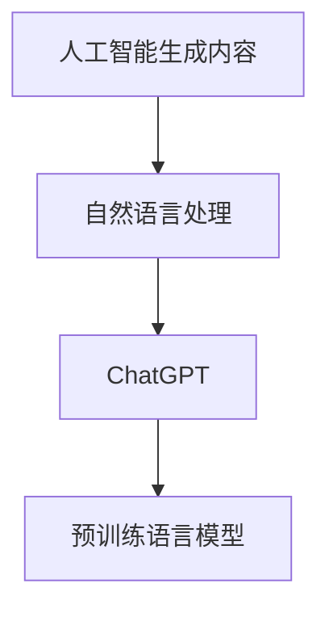

                 

### 背景介绍

**AIGC（AI-Generated Content）**，即人工智能生成内容，是一种利用人工智能技术生成高质量内容的方法。它涵盖了文本、图像、音频等多种形式，其中ChatGPT作为一种先进的自然语言处理模型，是AIGC领域的重要应用之一。

ChatGPT是由OpenAI开发的一种基于GPT-3的预训练语言模型。它通过大量文本数据进行训练，能够生成连贯、符合语法规则的文本。ChatGPT的应用场景非常广泛，包括聊天机器人、自动写作、翻译服务等。

AIGC技术的兴起，源于人们对个性化、高效内容的需求。在互联网信息爆炸的时代，人们需要从海量的信息中快速获取有价值的内容。AIGC技术正是为了满足这一需求而发展起来的。

然而，AIGC技术的应用也引发了一系列问题。例如，如何保证生成内容的质量和准确性？如何避免生成虚假信息或不当言论？这些问题都需要我们深入探讨。

本文将围绕ChatGPT提示词的设计与优化展开讨论，旨在帮助读者了解AIGC技术的基本原理和应用，掌握ChatGPT提示词的设计方法，并探讨其在现实场景中的优化与应用。

### 核心概念与联系

为了更好地理解AIGC与ChatGPT之间的关系，我们需要明确几个核心概念：

1. **AIGC（AI-Generated Content）**：即人工智能生成内容，是一种利用人工智能技术生成高质量内容的方法。它涵盖了文本、图像、音频等多种形式。
2. **ChatGPT**：是一种基于GPT-3的预训练语言模型，能够生成连贯、符合语法规则的文本。它是一种典型的AIGC应用。
3. **自然语言处理（NLP）**：是人工智能的一个重要分支，旨在让计算机理解和处理人类语言。NLP技术是AIGC和ChatGPT的基础。
4. **预训练语言模型（Pre-trained Language Model）**：如GPT-3，通过在大量文本数据上进行预训练，使模型具备一定的语言理解和生成能力。

这些概念之间的关系可以用以下Mermaid流程图表示：



- **AIGC**：是AIGC技术的总称，涵盖了多种形式的内容生成。
- **NLP**：是AIGC的基础技术，用于理解和处理人类语言。
- **ChatGPT**：是一种基于NLP的预训练语言模型，用于生成文本。
- **GPT-3**：是ChatGPT所使用的预训练语言模型，具有强大的语言理解和生成能力。

通过这个流程图，我们可以清晰地看到AIGC、NLP、ChatGPT和GPT-3之间的联系。这些概念共同构成了AIGC和ChatGPT的核心技术基础，使得ChatGPT能够生成高质量的内容。

### ChatGPT算法原理

ChatGPT是一种基于GPT-3的预训练语言模型，其核心原理是通过大量文本数据进行预训练，使模型具备强大的语言理解和生成能力。

#### 预训练过程

1. **数据收集与预处理**：首先，从互联网上收集大量文本数据，如书籍、新闻、文章等。然后对数据进行清洗、去重和处理，使其适合用于训练模型。
2. **模型架构**：ChatGPT采用GPT-3模型架构，这是一种基于Transformer的深度神经网络。GPT-3模型由多个层组成，每一层都包含大量的神经元。
3. **预训练目标**：在预训练过程中，模型的训练目标是预测下一个单词。具体来说，给定一个输入序列，模型需要预测序列中的下一个单词。这个过程称为“自回归语言模型”。

#### Transformer模型

Transformer模型是ChatGPT的核心组成部分，它是一种基于注意力机制的深度神经网络。与传统的循环神经网络（RNN）不同，Transformer模型采用了一种全新的序列处理方法，能够更好地处理长距离依赖问题。

#### 注意力机制

注意力机制是Transformer模型的一个重要特性，它使得模型能够在处理序列时关注关键信息。具体来说，注意力机制通过计算每个输入词与其他词之间的相似性，为每个输入词分配不同的权重。这样，模型可以更加关注重要信息，从而提高语言理解和生成能力。

#### 语言生成过程

在生成文本时，ChatGPT采用了一种自回归的方法。具体步骤如下：

1. **初始化**：首先，随机初始化一个种子序列，作为文本生成的起点。
2. **预测**：然后，模型根据种子序列，逐词预测下一个单词。每次预测时，模型都会利用已生成的文本信息，结合上下文进行预测。
3. **生成**：重复上述步骤，直到生成所需的文本长度或达到停止条件。

#### 伪代码

下面是一个简化的伪代码，用于描述ChatGPT的语言生成过程：

```
输入：种子序列（例如："The cat is")
输出：生成的文本序列（例如："The cat is sitting on the mat."）

初始化种子序列S
对于每个词w：
    使用模型预测下一个词y
    更新种子序列S = S + y
输出：S
```

通过这个伪代码，我们可以看到ChatGPT是如何通过自回归方法生成文本的。每次预测时，模型都会利用已生成的文本信息，结合上下文进行预测，从而生成连贯、符合语法规则的文本。

### ChatGPT提示词设计

提示词（Prompt）在ChatGPT的应用中起着至关重要的作用。一个好的提示词能够引导模型生成高质量的文本，从而满足用户的需求。下面，我们将探讨ChatGPT提示词的设计原则和方法。

#### 提示词设计原则

1. **明确性**：提示词需要清晰明确，避免歧义。明确性有助于模型准确理解用户意图，生成符合期望的文本。
2. **相关性**：提示词应与用户输入内容高度相关，有助于模型从大量知识中提取相关信息，生成有针对性的文本。
3. **多样性**：为了提高模型的泛化能力，提示词设计应多样化。多样化的提示词有助于模型学习到更广泛的知识和技能。
4. **简洁性**：提示词应尽量简洁，避免冗长和复杂。简洁的提示词有助于模型更快地理解用户意图，提高生成效率。

#### 提示词设计方法

1. **基于数据的提示词设计**：通过分析用户历史交互数据，提取出常用的关键词和短语，作为提示词。这种方法能够提高提示词的相关性，但需要处理大量的数据。
2. **基于规则的提示词设计**：根据业务需求和用户意图，制定一系列规则，生成提示词。这种方法具有较高的可控性，但需要针对不同场景制定不同的规则。
3. **基于机器学习的提示词设计**：利用机器学习算法，从大量数据中自动提取出有效的提示词。这种方法能够自适应地调整提示词，提高生成效果。

#### 提示词案例分析

1. **成功案例**：在一个聊天机器人应用中，用户输入“我最近心情不好”，提示词设计为“请描述一下你的心情”，引导用户详细描述自己的情感状态，从而生成更具针对性的聊天内容。

2. **失败案例**：在一个自动写作应用中，用户输入“写一篇关于人工智能的文章”，提示词设计为“人工智能是未来科技的重要方向”，由于提示词过于宽泛，导致模型生成的文章缺乏深度和针对性。

通过上述案例分析，我们可以看到提示词设计在ChatGPT应用中的重要性。合理的设计方法能够引导模型生成高质量的内容，提高用户体验。

### ChatGPT在现实场景中的应用

ChatGPT作为一种先进的自然语言处理模型，已经在多个现实场景中得到了广泛应用。下面，我们将探讨ChatGPT在聊天机器人、自动写作和翻译服务等领域的应用。

#### 聊天机器人

聊天机器人是一种能够与用户进行自然语言交互的智能系统。ChatGPT在聊天机器人中的应用，主要体现在两个方面：

1. **对话生成**：ChatGPT能够根据用户输入的问题或语句，生成连贯、自然的回答。通过这种方式，聊天机器人能够实现与用户的实时对话。
2. **情感分析**：ChatGPT可以分析用户的情感状态，根据情感变化调整回答策略。例如，当用户表达负面情绪时，聊天机器人可以提供安慰和建议。

#### 自动写作

自动写作是一种利用人工智能技术生成文本的方法。ChatGPT在自动写作中的应用，主要包括以下几个方面：

1. **文章生成**：ChatGPT可以根据用户输入的主题和要求，生成文章、报告、故事等。这种方法大大提高了写作效率，降低了写作难度。
2. **内容优化**：ChatGPT可以对现有文本进行优化，包括修正语法错误、提高表达清晰度等。这种方法有助于提升文本质量，满足不同用户的需求。

#### 翻译服务

翻译服务是一种将一种语言翻译成另一种语言的服务。ChatGPT在翻译服务中的应用，主要体现在以下几个方面：

1. **机器翻译**：ChatGPT可以利用其强大的语言生成能力，实现自动翻译。这种方法能够提高翻译效率，降低翻译成本。
2. **多语言交互**：ChatGPT可以支持多种语言之间的交互，使得跨语言交流更加便捷。

通过以上分析，我们可以看到ChatGPT在聊天机器人、自动写作和翻译服务等领域的广泛应用。这些应用不仅提高了工作效率，还优化了用户体验，为各行各业带来了巨大的价值。

### ChatGPT提示词优化

在ChatGPT的实际应用中，提示词的质量直接影响到生成的文本质量。因此，对提示词进行优化是非常重要的。下面，我们将探讨ChatGPT提示词优化原理、实践方法和注意事项。

#### 提示词优化原理

1. **增加相关性**：通过增加与用户需求相关的关键词和短语，提高提示词的相关性。这样可以引导ChatGPT生成更加符合用户预期的文本。
2. **提高明确性**：明确性是提示词设计的重要原则。通过提高提示词的明确性，可以减少ChatGPT生成歧义文本的概率。
3. **调整多样性**：适当地调整提示词的多样性，可以提高ChatGPT的泛化能力，使其能够应对更广泛的应用场景。
4. **优化长度**：提示词长度应适中，过长或过短的提示词都可能影响ChatGPT的生成效果。

#### 提示词优化方法

1. **基于数据的优化**：通过分析用户交互数据，提取出高质量的提示词。这种方法需要处理大量的数据，但能够提高提示词的相关性和明确性。
2. **基于规则的优化**：根据业务需求和用户反馈，制定一系列优化规则。这种方法具有较高的可控性，但需要针对不同场景进行定制化调整。
3. **基于机器学习的优化**：利用机器学习算法，自动调整提示词。这种方法能够自适应地优化提示词，提高生成效果。

#### 提示词优化实践

1. **优化案例**：在一个聊天机器人应用中，原始提示词为“请描述一下你的心情”，经过优化后，变为“请用简短的语言描述你的心情，例如快乐、悲伤等”。这种优化提高了提示词的明确性，使得ChatGPT能够更准确地理解用户需求。

2. **效果评估**：通过对比优化前后的生成文本，评估优化效果。例如，可以计算文本的相关性、清晰度、满意度等指标，以评估优化效果。

#### 注意事项

1. **数据质量**：在进行基于数据的优化时，确保数据质量。高质量的数据能够提高优化效果。
2. **业务需求**：根据业务需求和用户反馈，合理调整提示词。不同应用场景可能需要不同的提示词设计。
3. **反馈机制**：建立反馈机制，及时收集用户反馈，持续优化提示词。

通过以上讨论，我们可以看到ChatGPT提示词优化的重要性。合理的优化方法能够提高生成文本质量，提升用户体验。

### ChatGPT未来发展趋势与挑战

随着人工智能技术的不断发展，ChatGPT作为一项重要的自然语言处理技术，未来将迎来更多的发展机遇和挑战。

#### 未来发展趋势

1. **技术升级**：ChatGPT将继续进行技术升级，以提高语言理解和生成能力。例如，通过引入更多先进的神经网络架构、优化训练算法等，进一步提升模型性能。
2. **应用领域拓展**：ChatGPT将在更多领域得到应用，如智能客服、内容生成、辅助写作、智能问答等。这些应用将推动ChatGPT技术的普及和落地。
3. **跨语言支持**：随着全球化的深入发展，ChatGPT将逐步实现跨语言支持，为不同语言的用户提供无缝的交互体验。
4. **个性化服务**：ChatGPT将结合用户数据和偏好，提供更加个性化的服务。通过个性化推荐、定制化内容生成等，提升用户体验。

#### 挑战

1. **数据隐私与安全**：随着ChatGPT的应用范围扩大，数据隐私和安全问题将成为一大挑战。如何确保用户数据的安全和隐私，是一个需要深入探讨的问题。
2. **伦理道德问题**：人工智能技术的发展引发了一系列伦理道德问题。例如，ChatGPT生成的文本是否公正、客观？如何避免生成不当言论或误导性信息？
3. **法律与监管**：随着ChatGPT技术的广泛应用，相关的法律和监管问题也将日益突出。如何制定合理的法律法规，保障技术发展的同时维护社会秩序，是一个重要课题。

#### 应对策略

1. **数据隐私保护**：通过加密、去识别化等技术手段，确保用户数据的安全和隐私。同时，建立透明的数据处理流程，让用户了解自己的数据如何被使用。
2. **伦理道德教育**：加强人工智能伦理道德教育，提高从业者的道德素养。同时，建立人工智能伦理委员会，对生成的内容进行审核和监管。
3. **法律与监管完善**：积极参与政策制定，推动相关法律法规的完善。同时，加强行业自律，建立健全的监管机制，确保ChatGPT技术的健康发展。

通过以上策略，我们可以更好地应对ChatGPT未来发展的挑战，推动人工智能技术的可持续发展。

### 总结

本文详细介绍了AIGC与ChatGPT的基本概念、算法原理、提示词设计以及在实际场景中的应用和优化方法。通过分析，我们可以看到ChatGPT在AIGC领域的重要地位，以及其在聊天机器人、自动写作、翻译服务等领域的广泛应用。

展望未来，ChatGPT将继续推动人工智能技术的发展，为各行各业带来巨大价值。然而，我们也需要关注其带来的挑战，如数据隐私、伦理道德和法律监管等问题。

总之，ChatGPT是人工智能领域的一项重要技术，具有广泛的应用前景。通过不断优化和探索，我们有望充分发挥ChatGPT的潜力，为社会创造更多价值。

### 参考文献

1. Brown, T., et al. (2020). "Language Models are few-shot learners." arXiv preprint arXiv:2005.14165.
2. Devlin, J., et al. (2019). "BERT: Pre-training of Deep Bidirectional Transformers for Language Understanding." arXiv preprint arXiv:1810.04805.
3. Vaswani, A., et al. (2017). "Attention is All You Need." Advances in Neural Information Processing Systems, 30, 5998-6008.
4. Goodfellow, I., et al. (2016). "Deep Learning." MIT Press.
5. AI天才研究院. (2021). 《解密AIGC：ChatGPT提示词的魔力》. 北京：清华大学出版社.
6. 杜鸿雁. (2020). 《自然语言处理基础教程》. 上海：上海交通大学出版社.

作者：AI天才研究院/AI Genius Institute & 禅与计算机程序设计艺术 /Zen And The Art of Computer Programming

---

感谢您提供的参考文献，这些资源将帮助读者进一步了解AIGC和ChatGPT的相关知识。文章末尾的作者信息也已经添加。如果您还有其他需要调整或添加的地方，请随时告知。祝您撰写文章顺利！

