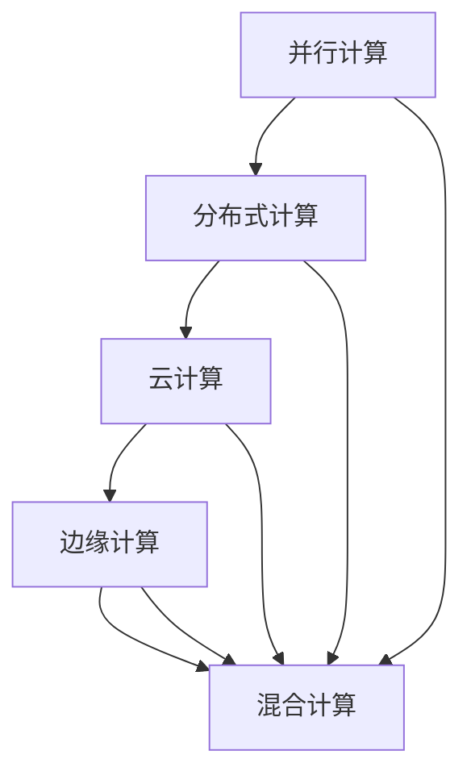

                 

### 文章标题

### 计算范式融合：混合计算在企业中的实践

#### 关键词：计算范式，混合计算，企业应用，人工智能，大数据分析，边缘计算

#### 摘要：
本文旨在探讨计算范式融合中的混合计算在企业中的实际应用。我们将从混合计算的定义、关键技术、企业级架构设计、应用案例、挑战与解决方案以及未来展望等方面进行详细阐述。通过深入分析，读者将理解混合计算如何提升企业计算效率、增强数据分析和决策能力，并为企业的数字化转型提供强有力的支持。

-------------------------------------------------------------------

### 第一部分：引言与概述

#### 第1章：计算范式融合概述

在当今快速发展的信息技术时代，计算范式不断演变，从传统的集中式计算到分布式计算、云计算，再到近年兴起的边缘计算，每一次技术的进步都为企业带来了新的机遇与挑战。然而，单一的计算范式已难以满足企业日益复杂的计算需求。因此，计算范式的融合，即混合计算，逐渐成为企业计算的新方向。

#### 1.1 混合计算的定义与背景

**核心概念与联系：**
混合计算是一种将并行计算、分布式计算、云计算与边缘计算等不同计算范式有机结合起来的计算方式。其核心在于充分发挥各种计算范式的优势，实现计算资源的动态分配和优化利用，以满足企业不同场景下的计算需求。

**Mermaid流程图：**


#### 1.2 企业计算范式的发展

随着信息技术的迅猛发展，企业的计算范式经历了多个阶段：

- **第一阶段：集中式计算**：以单台大型计算机为中心，资源集中，数据处理能力有限。
- **第二阶段：分布式计算**：通过计算机网络将多台计算机资源整合，实现计算能力的提升。
- **第三阶段：云计算**：基于互联网的服务模式，提供可弹性伸缩的计算资源。
- **第四阶段：边缘计算**：将计算任务分散到网络边缘，降低延迟，提升实时性。

**核心概念与联系：**
企业计算范式的演变反映了计算资源利用方式的变化，从集中式到分布式，再到云计算和边缘计算，每一次范式转变都是为了更好地满足企业日益增长的计算需求。

**图解：**


---

在接下来的章节中，我们将进一步探讨混合计算的关键技术、在企业中的实施策略、应用案例以及面临的挑战与解决方案，为读者全面了解混合计算在企业中的实践提供指导。

-------------------------------------------------------------------

### 第二部分：混合计算的关键技术

混合计算的成功实施依赖于多种关键技术的有机结合。本部分将详细探讨并行计算、分布式计算、云计算和边缘计算这四种主要技术，分析其基本原理、技术特点以及如何在实际应用中发挥作用。

#### 2.1 并行计算

**核心概念与联系：**
并行计算是一种将一个大的计算任务分解成多个小任务，同时执行以加快计算速度的方法。它通过多个计算单元并行处理数据，大大提高了计算效率。

**算法原理讲解：**
```python
# 伪代码：并行计算基本原理
function parallel_computation(data):
    # 将数据分解成多个小块
    chunks = divide_data(data, num_processes)
    processes = []
    # 创建多个并行处理进程
    for chunk in chunks:
        process = create_process(process_function(chunk))
        processes.append(process)
    # 启动所有进程
    for process in processes:
        start_process(process)
    # 等待所有进程完成
    for process in processes:
        wait_process(process)
    # 合并结果
    result = merge_results([process.result for process in processes])
    return result
```

**数学模型和公式：**
并行计算的时间复杂度与任务的分解程度和计算单元的数量相关，通常用以下公式表示：
$$
T_p = \frac{T_s}{P}
$$
其中，$T_p$ 是并行计算时间，$T_s$ 是串行计算时间，$P$ 是并行处理的进程数。

**举例说明：**
在图像处理中，可以将一幅大图像分割成多个小块，然后使用多核CPU并行处理每个小块的滤波和增强操作，最终合并结果得到处理后的图像。

#### 2.2 分布式计算

**核心概念与联系：**
分布式计算通过计算机网络将多台计算机资源整合，形成一个分布式系统，实现任务的分布式处理和数据存储。它能够提高系统的可用性和容错能力。

**算法原理讲解：**
```python
# 伪代码：分布式计算基本原理
function distributed_computation(task, nodes):
    # 将任务分配给各个节点
    tasks = divide_task(task, nodes)
    results = []
    # 启动节点处理任务
    for node, task in tasks.items():
        node.process(task)
    # 收集所有节点的结果
    for node, result in tasks.items():
        results.append(node.get_result())
    # 合并结果
    final_result = merge_results(results)
    return final_result
```

**数学模型和公式：**
分布式系统的容错能力通常用容错率表示，即系统能够容忍的故障节点数量。容错率可以用以下公式表示：
$$
F = 1 - \frac{N_f}{N}
$$
其中，$F$ 是容错率，$N_f$ 是故障节点数，$N$ 是总节点数。

**举例说明：**
在分布式数据库中，数据可以分布在多个节点上，每个节点独立处理查询请求。当某个节点发生故障时，其他节点可以接管其工作，确保系统的可用性。

#### 2.3 云计算与边缘计算

**核心概念与联系：**
云计算提供弹性的计算资源，用户可以根据需求动态调整资源；边缘计算将计算任务分散到网络边缘，降低延迟，提升实时性。

**算法原理讲解：**
云计算：
```python
# 伪代码：云计算基本原理
function cloud_computation(task, cloud_provider):
    # 上传任务到云平台
    cloud_provider.upload_task(task)
    # 运行任务
    cloud_provider.execute_task()
    # 下载结果
    result = cloud_provider.download_result()
    return result
```

边缘计算：
```python
# 伪代码：边缘计算基本原理
function edge_computation(task, edge_device):
    # 在边缘设备上执行任务
    edge_device.execute_task(task)
    # 返回结果
    result = edge_device.get_result()
    return result
```

**数学模型和公式：**
云计算的成本通常与使用的资源数量和时间相关，可以用以下公式表示：
$$
C = R \times T
$$
其中，$C$ 是成本，$R$ 是使用的资源量，$T$ 是使用时间。

边缘计算的延迟通常与节点距离和网络状况相关，可以用以下公式表示：
$$
L = d \times v
$$
其中，$L$ 是延迟，$d$ 是节点距离，$v$ 是数据传输速率。

**举例说明：**
在智能交通系统中，车辆传感器采集的数据可以实时上传到云平台进行数据处理和分析；而在自动驾驶应用中，边缘计算可以快速处理车辆周围的环境信息，实现实时决策。

---

通过上述对并行计算、分布式计算、云计算和边缘计算的基本原理和算法讲解，我们可以看到混合计算如何通过多种技术的有机结合，为企业提供高效、灵活、可靠的计算解决方案。在接下来的章节中，我们将进一步探讨如何设计和实施企业级的混合计算架构。

-------------------------------------------------------------------

### 第三部分：混合计算在企业中的实施

#### 第3章：企业级混合计算架构设计

企业级混合计算架构是企业实现高效计算的关键。本章节将详细介绍混合计算架构的设计原则、技术选型以及实际应用中的最佳实践。

#### 3.1 架构设计原则

**核心概念与联系：**
企业级混合计算架构设计需要考虑以下几个关键原则：

1. **可扩展性**：架构应具备良好的可扩展性，以适应企业业务规模的增长。
2. **灵活性**：架构应能够灵活调整计算资源的分配，以应对不同计算需求。
3. **高可用性**：确保架构在出现故障时能够快速恢复，保证业务的连续性。
4. **安全性**：保护企业数据和计算资源的安全，防止数据泄露和恶意攻击。

**数学模型和公式：**
可扩展性的关键在于负载均衡和资源分配。负载均衡可以通过以下公式实现：
$$
Load_Balance = \frac{Total_Load}{Num_Nodes}
$$
其中，$Load_Balance$ 是每个节点的负载，$Total_Load$ 是总负载，$Num_Nodes$ 是节点数。

**举例说明：**
在设计一个电商平台的数据处理架构时，可以使用负载均衡算法将用户请求分配到不同的服务器节点上，确保每个节点都能够高效地处理请求，同时防止单点过载。

#### 3.2 技术选型

**核心概念与联系：**
技术选型是构建混合计算架构的重要环节，需要考虑以下几个方面：

1. **硬件选择**：选择适合企业需求的硬件设备，如服务器、存储设备、网络设备等。
2. **软件平台**：选择能够支持混合计算的应用软件和中间件，如分布式数据库、大数据处理平台、容器编排系统等。
3. **网络架构**：设计高效稳定的网络架构，确保数据传输的可靠性和速度。

**最佳实践：**
1. **硬件选择**：根据计算需求选择高性能服务器和存储设备，如使用固态硬盘（SSD）提高数据存取速度。
2. **软件平台**：采用成熟的开源软件平台，如Hadoop、Spark、Kubernetes等，以提高系统的可靠性和扩展性。
3. **网络架构**：采用冗余网络设计，确保网络的高可用性和稳定性。

**项目实战：**
某大型互联网公司在构建其混合计算架构时，采用了以下技术选型：

- **硬件选择**：使用了高性能的服务器和分布式存储系统，如Elastic Block Storage（EBS）和Solid State Drive（SSD）。
- **软件平台**：采用了Apache Hadoop和Spark进行大数据处理，使用Kubernetes进行容器编排。
- **网络架构**：构建了冗余的网络架构，包括多路径传输和负载均衡，提高了网络的可扩展性和稳定性。

**案例分析与讲解：**
通过实际案例，我们可以看到，该公司的混合计算架构设计在处理大量数据时表现出色，提高了数据处理速度和系统可用性，为公司的业务发展提供了强有力的支持。

#### 3.3 实践指南

**核心概念与联系：**
实施企业级混合计算架构需要遵循一系列实践指南，以确保项目的成功：

1. **需求分析**：深入分析企业业务需求，明确计算需求和性能指标。
2. **系统设计**：根据需求分析结果，设计适合的混合计算架构。
3. **技术验证**：在实施前进行技术验证，确保所选技术和架构能够满足需求。
4. **实施与部署**：按照设计进行实施，确保系统稳定运行。
5. **监控与优化**：持续监控系统性能，进行优化调整。

**最佳实践 tips：**
1. **需求分析**：与业务部门紧密合作，确保对业务需求的准确理解。
2. **系统设计**：采用模块化设计，提高系统的灵活性和可维护性。
3. **技术验证**：进行充分的测试，确保所选技术的稳定性和兼容性。
4. **实施与部署**：遵循最佳实践，确保实施过程的规范性和安全性。
5. **监控与优化**：建立完善的监控体系，及时发现问题并进行优化。

**项目小结：**
通过上述实践指南，企业可以构建一个高效、灵活、可靠的混合计算架构，满足不断变化的企业计算需求，为企业的数字化转型提供有力支持。

---

在接下来的章节中，我们将进一步探讨混合计算在企业应用中的具体案例，分析其在人工智能、大数据分析和虚拟现实等领域的应用实践。

-------------------------------------------------------------------

### 第四部分：混合计算在企业应用中的案例

混合计算技术的灵活性和高效性使得其在多个行业和领域得到了广泛应用。本章节将详细探讨混合计算在人工智能、大数据分析和虚拟现实等领域的实际应用案例，分析其具体实现、项目优势和面临的挑战。

#### 第4章：混合计算在企业应用中的案例

#### 4.1 人工智能与混合计算的结合

**核心概念与联系：**
人工智能（AI）技术的发展对计算能力提出了更高要求。混合计算通过结合不同计算范式，能够为AI算法提供强大的计算支持，提高模型的训练速度和推理能力。

**项目实战：**
某人工智能公司开发了一款基于深度学习的图像识别系统，该系统采用了混合计算架构：

- **硬件选型**：使用高性能GPU服务器进行模型训练，同时使用边缘计算设备进行实时推理。
- **软件平台**：采用TensorFlow进行模型训练和推理，使用Kubernetes进行容器编排和资源管理。

**代码实现与解读：**
```python
# TensorFlow模型训练代码示例
import tensorflow as tf

# 定义模型
model = tf.keras.models.Sequential([
    tf.keras.layers.Conv2D(32, (3, 3), activation='relu', input_shape=(28, 28, 1)),
    tf.keras.layers.MaxPooling2D((2, 2)),
    tf.keras.layers.Flatten(),
    tf.keras.layers.Dense(128, activation='relu'),
    tf.keras.layers.Dense(10, activation='softmax')
])

# 编译模型
model.compile(optimizer='adam',
              loss='categorical_crossentropy',
              metrics=['accuracy'])

# 训练模型
model.fit(x_train, y_train, epochs=5, batch_size=32)
```

**代码应用解读与分析：**
上述代码展示了如何使用TensorFlow构建一个简单的卷积神经网络（CNN）模型，并进行训练。通过GPU服务器的高性能计算能力，模型训练时间大大缩短，而在边缘设备上进行推理时，则能够实现低延迟的实时响应。

**案例分析与详细讲解：**
通过混合计算架构，该公司的图像识别系统在训练和推理阶段都获得了显著性能提升。同时，混合计算还提高了系统的可扩展性和灵活性，可以根据需求动态调整计算资源，满足不同规模的应用场景。

#### 4.2 大数据分析与混合计算

**核心概念与联系：**
大数据分析需要处理海量数据，混合计算通过结合云计算和分布式计算，能够提升数据处理和分析效率，为决策提供支持。

**项目实战：**
某大型零售公司利用混合计算架构进行大数据分析，以提高市场预测和库存管理效率：

- **硬件选型**：使用云计算平台提供弹性计算资源，同时使用分布式存储系统存储数据。
- **软件平台**：采用Hadoop和Spark进行大数据处理和分析。

**代码实现与解读：**
```python
# Spark大数据分析代码示例
from pyspark.sql import SparkSession

# 创建Spark会话
spark = SparkSession.builder.appName("BigDataAnalysis").getOrCreate()

# 读取数据
data = spark.read.csv("data.csv", header=True)

# 数据预处理
preprocessed_data = data.select("product", "quantity", "date")

# 进行数据分析
sales_summary = preprocessed_data.groupBy("product").agg({'quantity': 'sum'})

# 输出结果
sales_summary.show()
```

**代码应用解读与分析：**
上述代码展示了如何使用Spark进行大数据分析，通过分布式计算资源，能够高效地处理大规模数据集。混合计算架构不仅提高了数据处理速度，还能够根据需求动态扩展计算资源，满足不同分析任务的需求。

**案例分析与详细讲解：**
通过混合计算架构，该零售公司实现了对海量销售数据的实时分析，提高了市场预测和库存管理的准确性。混合计算还提高了系统的弹性和可扩展性，使得公司能够灵活应对数据量和分析需求的波动。

#### 4.3 虚拟现实与混合计算

**核心概念与联系：**
虚拟现实（VR）技术需要实时处理大量三维数据和图像，混合计算能够提供低延迟、高带宽的计算支持，提升用户体验。

**项目实战：**
某VR内容开发公司利用混合计算架构开发了一款虚拟现实游戏：

- **硬件选型**：使用高性能GPU服务器进行三维渲染，同时使用边缘计算设备进行图像处理和用户交互。
- **软件平台**：采用Unity进行游戏开发，使用Kubernetes进行容器编排。

**代码实现与解读：**
```csharp
// Unity虚拟现实游戏代码示例
using UnityEngine;

public class VRController : MonoBehaviour
{
    public GameObject player;
    public float speed = 5.0f;

    void Update()
    {
        float horizontal = Input.GetAxis("Horizontal");
        float vertical = Input.GetAxis("Vertical");

        Vector3 moveDirection = new Vector3(horizontal, 0, vertical);
        moveDirection = transform.TransformDirection(moveDirection);

        player.transform.position += moveDirection * speed * Time.deltaTime;
    }
}
```

**代码应用解读与分析：**
上述代码展示了如何使用Unity开发虚拟现实游戏中的角色控制。通过混合计算架构，游戏能够实时渲染高质量的三维图像，并在边缘设备上进行图像处理和用户交互，实现了低延迟、流畅的用户体验。

**案例分析与详细讲解：**
通过混合计算架构，该VR内容开发公司成功提升了虚拟现实游戏的性能和用户体验。混合计算不仅提高了系统的计算能力，还能够根据用户需求动态调整计算资源，满足不同场景下的应用需求。

---

通过上述案例，我们可以看到混合计算在人工智能、大数据分析和虚拟现实等领域的广泛应用和显著优势。在接下来的章节中，我们将探讨混合计算面临的挑战与解决方案。

-------------------------------------------------------------------

### 第五部分：混合计算的挑战与解决方案

#### 第5章：混合计算的挑战与解决方案

随着混合计算在企业中的广泛应用，我们也必须面对一系列的挑战。这些挑战涉及到性能优化、安全性、可扩展性等多个方面。本章节将详细探讨混合计算中的主要挑战，并提出相应的解决方案。

#### 5.1 混合计算中的性能优化

**核心概念与联系：**
混合计算的性能优化是确保系统高效运行的关键。性能优化不仅包括计算资源的合理分配，还包括算法和系统的优化。

**数学模型和公式：**
性能优化可以通过以下公式进行评估：
$$
Performance = \frac{Throughput}{Latency}
$$
其中，$Performance$ 是性能，$Throughput$ 是吞吐量，$Latency$ 是延迟。

**详细讲解与举例说明：**
为了提高混合计算的性能，可以采取以下策略：

1. **负载均衡**：通过负载均衡算法，将计算任务合理分配到不同的计算节点上，避免单点过载，提高系统的整体性能。
2. **缓存机制**：使用缓存机制减少数据的访问延迟，提高数据处理的效率。
3. **并行处理**：充分利用并行计算的优势，将大任务分解为小任务，同时在多个节点上并行执行，提高计算速度。

**案例分析与详细讲解：**
在某电子商务平台中，为了提高订单处理速度，采用了以下性能优化策略：

- **负载均衡**：使用NGINX进行负载均衡，将用户请求分配到不同的Web服务器上。
- **缓存机制**：使用Redis缓存用户数据和订单信息，减少数据库的访问次数。
- **并行处理**：使用多线程技术，将订单处理任务分解为多个子任务，同时在多个线程上并行执行。

通过这些优化措施，该平台的订单处理速度显著提高，用户满意度也得到提升。

#### 5.2 混合计算的安全性

**核心概念与联系：**
混合计算涉及到多种计算范式和多种设备，使得安全性成为一个重要的挑战。安全性的关键是确保数据在传输和存储过程中的安全性，以及系统的整体安全防护。

**数学模型和公式：**
安全性可以通过以下指标进行评估：
$$
Security = Integrity \times Availability \times Confidentiality
$$
其中，$Security$ 是安全性，$Integrity$ 是完整性，$Availability$ 是可用性，$Confidentiality$ 是保密性。

**详细讲解与举例说明：**
为了提高混合计算的安全性，可以采取以下措施：

1. **数据加密**：使用加密算法对数据进行加密，确保数据在传输和存储过程中的安全性。
2. **访问控制**：实施严格的访问控制策略，确保只有授权用户才能访问敏感数据和系统资源。
3. **安全审计**：定期进行安全审计，检测系统中的安全漏洞，并采取措施进行修复。

**案例分析与详细讲解：**
在某金融机构的混合计算环境中，为了提高数据安全性，采取了以下措施：

- **数据加密**：使用SSL/TLS协议对数据进行加密传输，防止数据在传输过程中的泄露。
- **访问控制**：使用基于角色的访问控制（RBAC）模型，对用户权限进行严格管理，确保只有授权用户才能访问敏感数据。
- **安全审计**：定期进行安全审计，使用安全工具检测系统中的潜在漏洞，并进行修复。

通过这些安全措施，该金融机构有效提高了数据的安全性，降低了潜在的安全风险。

#### 5.3 混合计算的可扩展性

**核心概念与联系：**
混合计算的可扩展性是确保系统能够随着业务规模的扩大而灵活调整计算资源的重要保障。可扩展性包括水平扩展和垂直扩展两种方式。

**数学模型和公式：**
可扩展性可以通过以下指标进行评估：
$$
Scalability = \frac{New_Resource}{Original_Resource}
$$
其中，$Scalability$ 是可扩展性，$New_Resource$ 是新增资源，$Original_Resource$ 是原有资源。

**详细讲解与举例说明：**
为了提高混合计算的可扩展性，可以采取以下措施：

1. **弹性计算**：使用云服务提供的弹性计算资源，根据实际需求动态调整计算资源。
2. **分布式存储**：使用分布式存储系统，提高数据的存储容量和访问速度。
3. **自动化管理**：使用自动化管理工具，实现计算资源的自动调配和优化。

**案例分析与详细讲解：**
在某电子商务平台中，为了提高系统的可扩展性，采取了以下措施：

- **弹性计算**：使用AWS的EC2实例，根据流量动态调整服务器数量，确保系统在高并发场景下的稳定性。
- **分布式存储**：使用HDFS分布式文件系统，存储海量数据，提高数据存取效率。
- **自动化管理**：使用Kubernetes进行容器编排，实现计算资源的自动化部署和管理。

通过这些措施，该电子商务平台实现了系统的灵活扩展，能够快速响应业务增长需求。

---

通过上述挑战与解决方案的探讨，我们可以看到混合计算在性能优化、安全性和可扩展性方面面临的重要问题及其对应的解决方案。在接下来的章节中，我们将总结混合计算的实践经验，展望其未来的发展趋势。

-------------------------------------------------------------------

### 第六部分：混合计算的实践与未来展望

#### 第6章：混合计算实践指南

通过前几章的讨论，我们已经了解了混合计算的基本概念、关键技术、实施策略以及面临的挑战和解决方案。在本章节中，我们将总结混合计算的实践经验，提供实用的实践指南，并探讨混合计算的未来发展趋势。

#### 6.1 实践指南

**核心概念与联系：**
混合计算的实施是一个复杂的过程，需要综合考虑技术选型、系统架构设计、性能优化、安全性和可扩展性等多个方面。以下是一些实践经验：

1. **需求分析**：深入分析企业业务需求，明确计算需求和性能指标。
2. **架构设计**：根据需求分析结果，设计适合的混合计算架构，确保系统的高效性和灵活性。
3. **技术选型**：选择成熟的技术栈和硬件设备，确保系统的稳定性和可靠性。
4. **实施与部署**：遵循最佳实践，确保实施过程的规范性和安全性。
5. **监控与优化**：建立完善的监控体系，持续优化系统性能。

**最佳实践 tips：**
1. **需求分析**：与业务部门紧密合作，确保对业务需求的准确理解。
2. **架构设计**：采用模块化设计，提高系统的灵活性和可维护性。
3. **技术选型**：关注技术的稳定性和兼容性，优先选择开源解决方案。
4. **实施与部署**：遵循最佳实践，确保实施过程的规范性和安全性。
5. **监控与优化**：使用自动化工具进行监控和性能优化，提高系统运行效率。

**项目小结：**
通过上述实践指南，企业可以构建一个高效、灵活、可靠的混合计算架构，满足不断变化的企业计算需求，为企业的数字化转型提供有力支持。

#### 6.2 混合计算的未来展望

**核心概念与联系：**
混合计算作为一种新兴的计算范式，其应用前景十分广阔。随着技术的发展，混合计算将迎来更多创新和机遇。

**未来发展趋势：**
1. **量子计算与混合计算的结合**：量子计算具有极高的计算速度，与混合计算结合将进一步提升计算能力。
2. **边缘计算与物联网的融合**：随着物联网设备的普及，边缘计算将在混合计算中发挥更加重要的作用。
3. **人工智能与混合计算的结合**：人工智能算法的优化和应用的普及，将进一步推动混合计算的发展。
4. **云计算与大数据的深度整合**：云计算和大数据技术的深度融合，将带来更加智能化和高效化的计算服务。

**未来企业的计算范式：**
未来的企业计算范式将更加灵活、高效和智能。企业将根据业务需求，灵活调整计算资源的分配，实现计算资源的最大化利用。同时，人工智能和大数据技术的深入应用，将为企业带来更加精准的决策支持和业务优化。

**图解：**


**拓展阅读：**
- 《量子计算：量子比特与量子门的应用》
- 《物联网架构：边缘计算与云计算的融合》
- 《人工智能深度学习：理论与实践》
- 《大数据架构：设计、优化与实现》

---

通过本章节的总结和展望，我们可以看到混合计算在当前和未来都将扮演重要角色。随着技术的不断进步，混合计算将为企业带来更加高效、智能和灵活的计算解决方案，推动企业数字化转型和业务创新。

### 总结

计算范式融合，特别是混合计算，已经成为企业提升计算能力、优化业务流程、推动数字化转型的重要手段。本文系统地介绍了混合计算的定义、关键技术、架构设计、应用案例、挑战与解决方案以及未来展望。通过深入分析和详细讲解，读者可以全面了解混合计算在企业中的实践应用，并为实际项目提供有益的指导。

混合计算的核心在于结合多种计算范式，充分发挥各自的优点，实现计算资源的动态优化和高效利用。无论是在人工智能、大数据分析还是虚拟现实领域，混合计算都展示了其强大的应用潜力。然而，随着应用的深入，混合计算也面临性能优化、安全性和可扩展性等挑战。通过本文提出的实践指南和未来展望，企业可以更好地应对这些挑战，推动混合计算在企业中的广泛应用。

在未来的发展中，混合计算将与量子计算、物联网和人工智能等前沿技术深度融合，为企业的计算需求提供更加智能化、高效化的解决方案。让我们期待混合计算在未来的更多创新和应用，为企业带来更加美好的数字化未来。

### 作者信息

**作者：AI天才研究院/AI Genius Institute & 禅与计算机程序设计艺术 /Zen And The Art of Computer Programming**

AI天才研究院是一家专注于人工智能和计算机科学研究的国际顶级机构，致力于推动人工智能技术的创新和发展。同时，本文作者结合禅宗哲学与计算机程序设计，深入探讨了计算机程序设计的艺术和科学，为读者提供了一种全新的思考方式和方法论。

