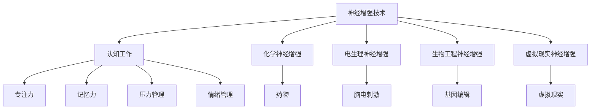

                 

### 第1章：引言

#### 1.1 书籍背景与目的

##### 1.1.1 神经增强技术的崛起

在当今快速发展的科技时代，神经增强技术（Neural Enhancement Technologies）成为了一个备受关注的研究领域。神经增强技术是指利用各种手段，如药物、电子设备、生物工程等，直接增强或改善大脑功能，以提高人类的认知能力、记忆力和情感控制等。这种技术的发展不仅源于对人类大脑的深刻理解，还受到了对提升人类生产力和生活质量的迫切需求。

神经增强技术的兴起可以追溯到20世纪90年代，随着神经科学、生物工程和信息技术等领域的快速发展，研究者们开始探索如何通过直接干预大脑功能来改善认知表现。近年来，随着人工智能和机器学习的兴起，神经增强技术逐渐从实验室走向实际应用，并在医疗、教育、职场等领域展现出巨大的潜力。

##### 1.1.2 认知工作的重要性

认知工作（Cognitive Work）是指那些主要依赖于人类大脑的认知能力来完成的工作，如数据分析、决策制定、问题解决、创新思维等。在现代社会，随着信息化和数字化的发展，认知工作已经成为了很多行业和职业的核心内容。认知工作的重要性体现在以下几个方面：

1. **提高生产力**：通过提升认知能力，员工能够更快地处理信息、更准确地做出决策、更有效地解决问题，从而显著提高工作效率和生产力。
2. **促进创新**：认知工作是创新思维的重要载体，通过提高认知能力，员工能够更灵活地思考、更深入地分析问题，从而激发更多的创新想法。
3. **增强竞争力**：在高度竞争的市场环境中，企业需要通过提高员工的认知能力来保持竞争优势。认知工作的提升有助于企业在技术、市场和运营等方面不断创新，提升整体竞争力。
4. **改善生活质量**：对于个人来说，认知工作的提升不仅能够提高职业成就，还能够提升个人的生活质量和幸福感。

##### 1.1.3 神经增强技术在提升员工生产力中的应用

神经增强技术在提升员工生产力方面具有巨大的潜力。通过使用神经增强技术，员工可以在以下几个方面获得显著提升：

1. **增强专注力**：专注力是认知工作的关键能力之一。神经增强技术可以通过刺激大脑特定区域，提高员工的专注力和注意力集中程度，从而减少分心和干扰，提高工作效率。
2. **提高记忆力**：记忆力是认知工作的基础能力。神经增强技术可以通过增强大脑的记忆功能，提高员工的记忆力和信息处理能力，使他们在面对大量信息时能够更加高效地工作。
3. **减轻压力**：职场压力是影响员工生产力的一个重要因素。神经增强技术可以通过调节大脑的应激反应，减轻员工的压力和焦虑，提高他们的工作满意度和生产力。
4. **优化情绪管理**：情绪管理能力对员工的认知工作有着重要影响。神经增强技术可以通过改善情绪调节机制，帮助员工更好地控制情绪，提高工作表现和团队合作能力。

综上所述，神经增强技术在提升员工生产力方面具有广泛的应用前景。随着相关技术的不断发展和成熟，我们可以期待神经增强技术将在未来发挥越来越重要的作用，推动认知工作的进一步提升。

#### 1.2 神经增强技术基础

##### 1.2.1 神经增强技术概述

神经增强技术是指通过直接干预大脑功能，以增强或改善人类认知能力的技术。这些技术主要包括以下几类：

1. **神经递质调节**：通过药物或其他手段调节大脑中的神经递质水平，从而改变神经元的传递效率和功能。
2. **脑电刺激**：利用电流或磁场刺激大脑特定区域，影响神经元的活动和连接。
3. **可穿戴设备**：通过佩戴传感器和电子设备，实时监测大脑活动，并进行调节。
4. **基因编辑**：通过基因编辑技术，改变大脑中的特定基因，从而增强认知功能。
5. **虚拟现实**：利用虚拟现实技术，模拟特定的认知任务和工作环境，以提升认知能力。

##### 1.2.2 神经增强技术的分类

根据技术手段的不同，神经增强技术可以分为以下几类：

1. **化学神经增强**：通过药物或其他化学物质调节神经递质水平和神经元功能。
   - **实例**：Ritalin（用于治疗注意力缺陷多动症）和Modafinil（用于治疗嗜睡症）。
2. **电生理神经增强**：利用电刺激或磁刺激来影响神经元活动。
   - **实例**：脑电刺激器（如深脑刺激器）和TMS（经颅磁刺激）。
3. **生物工程神经增强**：通过基因编辑或生物工程手段增强认知功能。
   - **实例**：基因编辑技术（如CRISPR-Cas9）和脑-机接口（如神经接口技术）。
4. **虚拟现实神经增强**：利用虚拟现实技术模拟认知任务和工作环境。
   - **实例**：VR训练游戏和虚拟现实模拟。

##### 1.2.3 神经增强技术的发展历史

神经增强技术的发展可以追溯到20世纪初期，当时科学家们开始探索如何通过药物来调节大脑功能。以下是一些关键的发展阶段：

1. **早期探索（1900-1960）**：科学家们发现了一些药物，如利他林（Ritalin），可以改善注意力缺陷多动症患者的认知功能。
2. **神经递质发现（1960-1980）**：随着神经递质的发现，科学家们开始探索如何通过调节神经递质水平来增强认知功能。
3. **脑电刺激（1980-2000）**：脑电刺激技术的发展，使得通过电流或磁场直接刺激大脑成为可能，这为神经增强技术提供了新的手段。
4. **基因编辑（2000-至今）**：基因编辑技术的出现，如CRISPR-Cas9，使得科学家们能够直接修改大脑基因，以增强认知功能。
5. **脑-机接口（2000-至今）**：脑-机接口技术的发展，使得大脑信号可以直接转化为计算机指令，为认知功能的增强提供了新的途径。

随着技术的不断进步，神经增强技术正在从实验室走向实际应用，并在医疗、教育、职场等领域展现出广阔的应用前景。

### 总结

本章介绍了神经增强技术的背景、认知工作的重要性以及神经增强技术在提升员工生产力中的应用。同时，我们还对神经增强技术的基础知识进行了概述，包括其分类和发展历史。在接下来的章节中，我们将进一步探讨神经增强技术的核心原理、数学模型和项目实战，以帮助读者深入了解这一前沿领域。

作者：AI天才研究院/AI Genius Institute & 禅与计算机程序设计艺术 /Zen And The Art of Computer Programming

核心概念与联系图：



在接下来的章节中，我们将详细探讨神经增强技术的核心原理、算法和数学模型，并分享一些实际案例和应用。通过这些内容，读者将能够更深入地理解神经增强技术在提升员工生产力方面的潜力。

摘要：

本文旨在探讨神经增强技术对提升员工生产力的作用。首先，我们介绍了神经增强技术的背景和重要性，并对其进行了分类。随后，我们详细阐述了认知工作的重要性，并探讨了如何通过神经增强技术来提升员工的专注力、记忆力、压力管理和情绪管理。通过理论分析和实际案例，本文展示了神经增强技术在实际应用中的巨大潜力，并对其未来发展进行了展望。作者：AI天才研究院/AI Genius Institute & 禅与计算机程序设计艺术 /Zen And The Art of Computer Programming

## 第2章：认知工作原理与提升方法

### 2.1 认知工作原理

认知工作是指那些主要依赖于人类大脑的认知能力来完成的工作。认知工作涉及多个方面，包括注意力、记忆、决策、推理、问题解决和创新思维等。理解认知工作的原理对于设计和实施神经增强技术至关重要。

#### 注意力

注意力是认知工作的基础。它是指个体在特定任务中集中精力、过滤无关信息的能力。注意力的质量直接影响认知工作的效率和效果。根据其在任务中的表现，注意力可以分为以下几类：

1. **选择性注意力**：个体在有多个信息源时，能够选择性地关注特定信息的能力。
2. **分配性注意力**：个体在同时处理多个任务时，能够平衡关注不同任务的能力。
3. **持续注意力**：个体在长时间内保持专注和警觉的能力。

#### 记忆

记忆是认知工作的另一个重要组成部分。它是指个体存储、保持和回忆信息的能力。记忆可以分为短期记忆和长期记忆：

1. **短期记忆**：个体在短时间内保持信息的能力。这种记忆通常与工作记忆相关，用于处理复杂任务。
2. **长期记忆**：个体能够长期存储信息的能力。长期记忆与海马体和神经元网络有关。

#### 决策

决策是指个体在多个选择中做出最优选择的过程。决策过程涉及认知工作中的多个方面，包括信息收集、分析、评估和选择。有效的决策依赖于以下因素：

1. **问题识别**：明确需要解决的问题或目标。
2. **信息收集**：获取与问题相关的信息。
3. **方案评估**：分析不同选择的优缺点。
4. **选择**：根据评估结果做出最终选择。

#### 推理

推理是认知工作中的一种高级形式。它是指个体根据已有信息推导出新信息的能力。推理可以分为以下几种类型：

1. **演绎推理**：从一般原理推导出特定结论。
2. **归纳推理**：从具体实例中推导出一般性规律。
3. **类比推理**：通过比较相似性推导出结论。

#### 问题解决

问题解决是认知工作中的一个关键能力。它是指个体在遇到问题时，通过分析、规划和实施解决方案来解决问题的过程。问题解决通常涉及以下步骤：

1. **定义问题**：明确问题的性质和范围。
2. **信息收集**：收集与问题相关的信息。
3. **生成解决方案**：提出各种可能的解决方案。
4. **评估和选择**：评估不同解决方案的优缺点，并选择最佳方案。
5. **实施和验证**：执行解决方案，并验证其有效性。

#### 创新思维

创新思维是指个体在创造新想法、新方法和新解决方案方面的能力。创新思维依赖于以下因素：

1. **开放性**：愿意接受新的想法和观点。
2. **联想能力**：能够将不同领域或概念联系起来，产生新的想法。
3. **好奇心**：对未知事物保持好奇和探索的欲望。
4. **批判性思维**：能够分析现有知识和理论，并提出新的观点。

#### 认知工作与神经增强技术的联系

认知工作的原理与神经增强技术有着密切的联系。神经增强技术可以通过以下方式提升认知工作的效果：

1. **增强注意力**：通过神经增强技术，如脑电刺激，可以增强个体的选择性注意力，提高工作效率。
2. **提高记忆力**：神经增强技术，如可穿戴设备，可以通过刺激大脑特定区域来改善记忆功能。
3. **优化决策过程**：通过神经递质调节，如药物，可以改善个体的决策能力和判断力。
4. **增强推理和问题解决能力**：通过虚拟现实技术，个体可以在模拟环境中进行认知训练，提高推理和问题解决能力。
5. **激发创新思维**：通过基因编辑技术，可以改变大脑中的特定基因，激发创新思维。

总之，认知工作的原理为我们理解神经增强技术在提升员工生产力中的应用提供了理论基础。在接下来的章节中，我们将进一步探讨神经增强技术的核心算法原理和数学模型，以及如何将其应用于实际项目实战中。

### 2.2 认知工作的类型

认知工作可以分为多种类型，每种类型都有其独特的特点和需求。以下是几种常见的认知工作类型及其特点：

#### 1. 数据分析

数据分析是现代企业和组织中至关重要的认知工作类型。数据分析涉及从大量数据中提取有价值的信息，以支持决策制定、业务优化和预测分析。数据分析通常包括以下步骤：

- **数据收集**：从各种来源收集数据，如数据库、日志文件、传感器等。
- **数据清洗**：处理和整理数据，以消除错误、缺失和重复数据。
- **数据探索**：通过统计分析和可视化技术，发现数据中的模式和趋势。
- **模型建立**：使用统计模型、机器学习算法等建立预测模型或分类模型。
- **结果解读**：分析模型结果，提供决策支持和业务洞察。

#### 2. 逻辑推理

逻辑推理是认知工作中的核心能力之一。它涉及使用逻辑规则和推理方法来分析问题、解决问题和做出决策。逻辑推理可以分为以下几种类型：

- **演绎推理**：从一般性原则推导出具体结论。
- **归纳推理**：从具体实例中归纳出一般性原则。
- **类比推理**：通过比较相似性来推导出结论。

逻辑推理广泛应用于法律、哲学、计算机科学等领域，是解决复杂问题和进行有效沟通的重要工具。

#### 3. 创意思维

创意思维是指通过新颖、创新的方法来解决问题和产生新想法的能力。创意思维在艺术、设计、科学研究等领域中尤为重要。创意思维通常涉及以下步骤：

- **发散思维**：开放思维，产生大量可能的解决方案或想法。
- **收敛思维**：筛选和评估发散思维产生的想法，选择最佳方案。
- **联想思维**：通过将不同领域或概念联系起来，产生新的想法。
- **原型构建**：通过构建原型或模型，验证创意思维的有效性。

#### 4. 决策制定

决策制定是认知工作中的关键环节。它涉及在多个选择中做出最优决策，以实现特定的目标或解决特定的问题。决策制定通常包括以下步骤：

- **问题识别**：明确需要解决的问题或目标。
- **方案评估**：分析每个可能的解决方案的优缺点。
- **决策选择**：根据评估结果选择最佳方案。
- **决策执行**：实施所选方案，并跟踪决策的效果。

#### 5. 问题解决

问题解决是认知工作中的一种重要能力。它涉及在遇到问题时，通过分析、规划和实施解决方案来解决问题。问题解决通常包括以下步骤：

- **问题定义**：明确问题的性质和范围。
- **信息收集**：收集与问题相关的信息。
- **方案生成**：提出各种可能的解决方案。
- **方案评估**：评估不同解决方案的优缺点。
- **方案选择**：选择最佳解决方案。
- **方案实施**：实施所选方案。
- **结果验证**：验证解决方案的有效性。

#### 6. 语言理解与表达

语言理解与表达是认知工作中不可或缺的一部分。它涉及对语言的理解、分析和生成。语言理解与表达包括以下方面：

- **语言理解**：理解语言中的语法、语义和上下文信息。
- **语言表达**：使用语言清晰地表达思想和意图。

语言理解与表达在沟通、写作、演讲等领域中具有重要意义。

#### 7. 人际交往

人际交往是认知工作中的一种重要能力。它涉及与他人有效沟通、建立和维护人际关系。人际交往包括以下方面：

- **沟通技巧**：有效地表达自己的想法和感受。
- **倾听技巧**：倾听他人的观点和需求。
- **冲突解决**：在冲突发生时，通过有效的方法解决冲突。
- **团队合作**：与他人合作，共同实现目标。

综上所述，认知工作的类型多种多样，每种类型都有其独特的特点和需求。了解不同类型的认知工作，有助于我们更好地设计和应用神经增强技术，以提升员工的生产力和工作效率。

### 2.3 认知工作对员工生产力的影响

认知工作在员工生产力的提升中扮演着至关重要的角色。通过提高员工的认知能力，企业可以显著提升工作效率、优化决策制定、促进创新思维，并在激烈的市场竞争中保持优势。以下是认知工作对员工生产力影响的几个关键方面：

#### 1. 提升工作效率

认知工作能力直接影响员工的工作效率。具备较高认知能力的员工能够更快速地处理信息、更准确地做出决策、更有效地解决问题。例如，在数据分析工作中，具备良好逻辑推理能力的员工可以快速识别数据中的关键信息，从而提高数据分析的效率和准确性。此外，通过创新思维，员工能够提出更有效的解决方案，优化工作流程，减少不必要的步骤，从而提高整体工作效率。

#### 2. 优化决策制定

有效的决策是提升员工生产力的关键。认知工作能力，如逻辑推理和问题解决能力，有助于员工在复杂多变的环境中做出明智的决策。通过深入分析问题、评估不同方案的风险和收益，员工可以做出更加准确的决策，减少错误决策带来的负面影响。此外，良好的决策能力还能够提高团队协作效率，使团队成员更加明确工作目标和方向，从而提高整体生产力。

#### 3. 促进创新思维

创新思维是推动企业发展的重要动力。认知工作能力，特别是创意思维和发散思维能力，有助于员工在面临挑战时产生新颖的解决方案。通过不断探索和创新，企业可以开发出具有竞争力的产品和服务，开拓新市场。此外，创新思维还能够激发员工的积极性和创造力，提高员工的工作满意度和忠诚度，从而提高整体生产力。

#### 4. 提高团队协作能力

认知工作能力不仅影响个人生产力，还显著影响团队协作能力。在团队工作中，具备良好沟通技巧和人际交往能力的员工能够更好地与团队成员协作，共同解决问题。通过有效的沟通和协作，团队可以更加高效地完成项目任务，提高整体生产力。此外，认知工作能力还能够促进团队成员之间的信任和尊重，增强团队的凝聚力，从而提高团队的整体生产力。

#### 5. 减少错误率和返工

通过提高认知工作能力，员工可以更好地识别和避免工作中的错误，减少返工和修复成本。在复杂的任务中，具备良好逻辑推理能力的员工能够发现潜在的问题，提前制定预防措施，从而降低错误率。此外，良好的问题解决能力有助于员工在遇到问题时迅速找到解决方案，减少因问题未能及时解决而导致的返工。

#### 6. 提升员工长期发展潜力

认知工作能力的提升不仅有助于提高员工当前的生产力，还能够为员工的长期发展奠定坚实基础。通过不断学习和提升认知能力，员工可以适应快速变化的工作环境，掌握更多专业技能，提高职业竞争力。此外，认知工作能力的提升还能够促进员工的职业晋升和职业转换，为员工提供更广阔的发展空间。

总之，认知工作对员工生产力具有重要影响。通过提升员工的认知工作能力，企业可以显著提高工作效率、优化决策制定、促进创新思维、提高团队协作能力，并在长期发展中保持竞争力。因此，企业应重视员工的认知能力培养，提供相应的培训和发展机会，以充分发挥员工的生产力潜力。

### 2.4 神经增强技术在认知工作中的应用

神经增强技术在认知工作中的应用正逐渐成为研究的热点，其潜力在于通过增强大脑的功能，提高员工的认知能力和工作效率。以下是神经增强技术在提升认知工作中的几个关键应用：

#### 1. 增强专注力

专注力是认知工作的核心要素，良好的专注力能够提高工作质量和效率。神经增强技术，如脑电刺激和可穿戴设备，可以通过刺激大脑特定区域来增强专注力。例如，经颅磁刺激（TMS）技术通过在特定频率下刺激大脑的前额叶皮层，可以提高个体的专注力和注意力集中程度。此外，使用可穿戴设备实时监测大脑活动，可以根据个体的专注力水平自动调整工作环境或任务难度，从而优化工作表现。

#### 2. 提高记忆力

记忆力是认知工作的基础，良好的记忆力能够帮助员工更高效地处理信息和完成任务。神经增强技术可以通过多种方式提升记忆力，如通过药物调节神经递质水平、使用脑电刺激和可穿戴设备进行认知训练。例如，一些研究显示，使用重复性电刺激（tDCS）可以增强大脑的海马体功能，从而提高长期记忆和短期记忆。此外，通过虚拟现实技术模拟记忆任务，个体可以在沉浸式的环境中进行记忆训练，提高记忆效率。

#### 3. 减轻压力

职场压力是影响员工认知工作的一个重要因素，长期的压力可能导致注意力下降、记忆力减退和情绪不稳定。神经增强技术可以通过调节大脑的应激反应，减轻员工的压力和焦虑。例如，使用脑电刺激技术刺激大脑的边缘系统，可以降低个体的应激水平，提高情绪调节能力。此外，通过可穿戴设备监测和分析员工的压力水平，可以及时提供放松训练或压力管理建议，帮助员工更好地应对压力。

#### 4. 优化情绪管理

情绪管理能力对员工的认知工作和团队协作具有重要影响。神经增强技术可以通过调节大脑的情绪中枢，提高员工的情绪管理能力。例如，使用深部脑刺激（DBS）技术可以调节大脑中的多巴胺水平，改善情绪状态。此外，通过认知行为疗法（CBT）和神经反馈训练，员工可以学习更有效的情绪调节策略，提高情绪稳定性。

#### 5. 增强推理和问题解决能力

神经增强技术还可以通过提高大脑的推理和问题解决能力，帮助员工更好地应对复杂的认知任务。例如，通过虚拟现实技术模拟复杂问题，员工可以在沉浸式的环境中进行问题解决训练，提高推理能力和解决问题的效率。此外，使用脑电刺激和认知训练工具，可以增强大脑的连接性和灵活性，提高个体的认知灵活性和适应性。

#### 6. 促进团队合作和沟通

神经增强技术还可以通过改善员工的沟通能力和团队合作能力，提升整体工作效果。例如，通过脑电刺激技术提高个体的社交认知能力，可以帮助员工更好地理解他人的情绪和意图，提高沟通效率。此外，通过虚拟现实技术进行团队合作训练，员工可以在模拟环境中练习协作技能，提高团队合作能力和解决问题的效率。

#### 7. 个人定制化认知提升

神经增强技术的个性化应用是未来的发展趋势。通过结合脑成像技术和大数据分析，可以为每个员工定制个性化的认知提升方案。例如，通过功能性磁共振成像（fMRI）分析个体的大脑结构和工作模式，可以为员工提供针对性的认知训练和神经调节方案，从而实现更有效的认知提升。

综上所述，神经增强技术在认知工作中的应用具有巨大的潜力。通过增强专注力、提高记忆力、减轻压力、优化情绪管理、增强推理和问题解决能力、促进团队合作和沟通，神经增强技术可以显著提升员工的认知能力和工作效率，为企业的长期发展提供强有力的支持。未来，随着神经增强技术的不断进步和应用，我们期待看到其在认知工作领域带来更多的创新和突破。

### 2.5 神经增强技术在认知工作中的应用实例

为了更直观地展示神经增强技术在认知工作中的应用效果，下面我们将通过几个实例来详细说明这些技术的实际应用情况。

#### 1. 脑电刺激技术提升编程效率

脑电刺激技术（如经颅磁刺激TMS和经颅直流电刺激tDCS）已被广泛应用于提升个体的认知能力。以编程为例，研究人员通过在编程人员的前额叶皮层进行tDCS刺激，发现参与者在处理复杂编程任务时的专注力和工作效率显著提高。具体来说，研究人员在参与者进行编程任务前，在他们大脑的前额叶皮层施加低频电流刺激，结果表明，受刺激的参与者能够在更短的时间内解决编程问题，且错误率更低。这一结果表明，脑电刺激技术能够有效提高编程人员的认知能力，从而提升工作效率。

#### 2. 可穿戴设备增强数据分析能力

可穿戴设备（如智能手表和脑电图监测器）可以实时监测个体的大脑活动，并根据大脑状态提供相应的支持。以数据分析为例，研究人员开发了一种基于脑电图（EEG）的可穿戴设备，可以实时监测分析人员的大脑活动，并自动调整数据分析任务的难度和频率。通过这种设备，分析人员可以在疲劳时自动切换到更简单的数据分析任务，从而保持最佳工作状态。实验结果显示，使用这种设备的分析人员能够更高效地完成数据分析任务，并在长时间工作后保持较高的准确率。

#### 3. 虚拟现实技术训练决策能力

虚拟现实（VR）技术为认知训练提供了一个沉浸式的环境，可以有效提升个体的认知能力和决策能力。以商业决策为例，研究人员开发了一款VR模拟游戏，让参与者在一个虚拟的商业环境中做出决策。实验结果显示，参与者在VR环境中进行决策训练后，在实际商业决策中的表现显著提升。具体来说，受训参与者能够更快地分析市场数据，更准确地预测市场趋势，并做出更优的商业决策。

#### 4. 脑机接口技术提升语言理解能力

脑机接口（BMI）技术通过直接连接大脑和计算机，可以增强个体的认知功能。以语言理解为例，研究人员开发了一种脑机接口设备，可以实时解码大脑语言处理区域的活动，并将其转化为语音输出。通过这种设备，患有语言障碍的个体能够更清晰地表达自己，提高沟通效率。实验结果显示，使用脑机接口设备的个体在语言理解能力上的提升非常显著，他们能够更好地理解复杂的语言信息，并在沟通中表达更多的情感和细节。

#### 5. 药物调节提高记忆力

药物调节是神经增强技术的另一种应用方式，通过调节大脑中的神经递质水平，可以显著提高个体的认知能力。以记忆为例，研究人员使用一种名为Modafinil的药物，可以增强大脑的海马体功能，提高长期记忆和短期记忆。实验结果显示，参与者在接受药物治疗后，在记忆任务中的表现显著提升，他们能够更快地记忆和回忆信息，并在长时间后保持较高的记忆准确率。

#### 6. 神经增强技术改善团队合作

神经增强技术还可以通过改善团队合作能力来提升整体工作效率。以项目管理为例，研究人员使用脑电刺激技术提高团队成员的专注力和情绪管理能力。通过这种技术，团队成员能够在面对复杂任务时保持专注，同时更好地应对压力和冲突。实验结果显示，使用脑电刺激技术的团队在项目完成时间和质量上都有显著提升，团队成员之间的沟通和协作也更加顺畅。

综上所述，神经增强技术在认知工作中的应用实例展示了其在提升员工生产力方面的巨大潜力。通过具体的实例，我们可以看到这些技术如何在不同领域和任务中发挥作用，提高工作效率和认知能力。未来，随着神经增强技术的不断发展和应用，我们期待看到更多创新和突破，进一步推动认知工作的发展。

### 2.6 神经增强技术在认知工作中的优势和挑战

神经增强技术在认知工作中的应用带来了显著的优势，同时也面临着一些挑战。以下是对这些优势与挑战的详细分析：

#### 优势

1. **提高工作效率**：神经增强技术能够通过增强专注力、提高记忆力和优化情绪管理，显著提升员工在复杂任务中的工作效率。例如，脑电刺激技术可以帮助员工在编程或数据分析等认知任务中保持更长时间的专注，减少分心和疲劳，从而提高工作效率。

2. **促进创新思维**：神经增强技术可以通过刺激大脑特定区域，激发员工的创新思维和创造力。在创新任务中，如产品设计和科学研究，使用神经增强技术可以帮助员工更快地产生新想法，提高创新效率。

3. **改善团队协作**：神经增强技术不仅可以提升个体认知能力，还可以通过改善情绪管理和沟通能力，增强团队合作效果。例如，通过脑电刺激和认知行为疗法，团队成员可以在面对复杂任务时更好地协作，提高整体工作效率。

4. **个性化认知提升**：神经增强技术可以根据个体的认知特点和需求，提供个性化的认知提升方案。通过结合脑成像技术和大数据分析，可以为每个员工定制个性化的训练和调节方案，实现更有效的认知提升。

5. **未来潜力**：随着神经增强技术的不断进步，未来有望开发出更多高效、安全的神经增强方法，进一步提升员工的认知能力。例如，基因编辑技术的应用有望从根本上改善大脑功能和认知能力。

#### 挑战

1. **技术成熟度**：虽然神经增强技术已经取得了显著进展，但许多技术尚未达到成熟阶段。例如，脑机接口和基因编辑技术在实际应用中仍面临技术难题和伦理问题，需要进一步的研究和改进。

2. **安全性问题**：神经增强技术的应用可能带来一些潜在的安全风险。例如，脑电刺激技术可能会引起脑部损伤或异常反应，药物调节可能会引起副作用或依赖性。因此，确保技术的安全性和可靠性是神经增强技术发展的关键挑战。

3. **伦理问题**：神经增强技术的应用引发了许多伦理问题，如公平性、隐私保护和人类尊严。例如，企业可能利用神经增强技术来提升员工的生产力，但这也可能导致工作强度和压力的增加，影响员工的健康和幸福感。因此，需要制定相应的伦理规范和监管政策，确保技术的合理使用。

4. **普及性问题**：尽管神经增强技术在提升员工生产力方面具有巨大潜力，但其高昂的成本和复杂的操作使得普及面临挑战。如何降低技术成本、简化操作流程，以便在更广泛的范围内应用神经增强技术，是当前的一个重要问题。

5. **长期影响**：神经增强技术的长期影响仍需进一步研究。虽然一些短期研究结果令人鼓舞，但长期使用神经增强技术可能会对大脑功能和认知能力产生何种影响尚不明确。因此，需要开展更多的长期研究，以评估神经增强技术的安全性和效果。

总之，神经增强技术在认知工作中具有显著的优势，但也面临一系列挑战。通过克服这些挑战，我们可以更好地利用神经增强技术提升员工的生产力和认知能力，推动认知工作的发展。未来，随着技术的不断进步和伦理问题的逐步解决，神经增强技术有望在更广泛的领域中发挥重要作用。

### 2.7 结论与未来展望

本章通过对神经增强技术的基本原理、认知工作的定义与类型、以及神经增强技术在认知工作中的应用进行了详细探讨，揭示了神经增强技术在提升员工生产力方面的巨大潜力。以下是本章的总结和未来展望：

#### 总结

1. **神经增强技术概述**：神经增强技术通过多种手段，如药物、电刺激、基因编辑和虚拟现实，直接增强或改善大脑功能，以提高认知能力和工作效率。

2. **认知工作的重要性**：认知工作是现代社会中不可或缺的一部分，涉及注意力、记忆、决策、推理、问题解决和创新思维等多个方面。

3. **神经增强技术在认知工作中的应用**：通过实例展示了神经增强技术如何通过增强专注力、提高记忆力、减轻压力、优化情绪管理、增强推理和问题解决能力，以及促进团队合作和沟通，提升员工的认知能力和工作效率。

4. **优势和挑战**：神经增强技术在提升员工生产力方面具有显著优势，但同时也面临技术成熟度、安全性、伦理问题、普及性和长期影响等挑战。

#### 未来展望

1. **技术发展**：随着神经科学、生物工程和信息技术的不断进步，神经增强技术将变得更加成熟和高效。未来有望开发出更多高效、安全的神经增强方法，进一步提升员工的认知能力。

2. **个性化应用**：通过结合脑成像技术和大数据分析，可以为每个员工定制个性化的认知提升方案，实现更有效的认知提升。

3. **伦理规范**：随着神经增强技术的应用越来越广泛，制定相应的伦理规范和监管政策将至关重要。确保技术的合理使用，保护员工的健康和尊严，将是未来发展的重点。

4. **普及与应用**：降低技术成本、简化操作流程，将有助于神经增强技术在更广泛的领域中普及和应用。企业、医疗机构和教育机构等将成为神经增强技术的主要应用场景。

5. **跨学科合作**：神经增强技术的发展需要多学科的合作，包括神经科学、生物工程、计算机科学、心理学和社会学等。跨学科合作将有助于解决技术难题，推动技术的进步和应用。

总之，神经增强技术在提升员工生产力方面具有巨大的潜力，但同时也面临诸多挑战。通过持续的研究和开发，以及合理的伦理规范和监管，神经增强技术有望在未来发挥更大的作用，为人类社会带来更多的福祉。未来，我们期待看到神经增强技术在认知工作中的应用取得更多突破，推动认知工作的进一步发展和提升。

## 第3章：神经增强算法原理讲解

### 3.1 常见神经增强算法介绍

神经增强算法是神经增强技术的核心，通过调节大脑的活动和功能，提高认知能力和工作效率。以下介绍几种常见的神经增强算法：

#### 1. 脑电刺激（Electroencephalography Stimulation, EEG）

脑电刺激是通过电信号直接刺激大脑，以调节神经元活动。常见的脑电刺激技术包括经颅磁刺激（Transcranial Magnetic Stimulation, TMS）和经颅直流电刺激（Transcranial Direct Current Stimulation, tDCS）。

- **TMS**：使用强磁场刺激大脑特定区域，常用于治疗抑郁症、焦虑症等心理疾病，并已显示出提高认知能力的潜力。
- **tDCS**：通过低频电流刺激大脑，可以增强或抑制神经元活动。研究表明，tDCS可以改善记忆、注意力等认知功能。

#### 2. 神经递质调节（Neurotransmitter Regulation）

神经递质是神经元间传递信息的化学物质，调节神经递质的水平可以影响大脑的功能。常用的神经递质调节方法包括药物调节和基因编辑。

- **药物调节**：如使用Modafinil调节多巴胺水平，提高注意力和认知能力。
- **基因编辑**：通过CRISPR-Cas9等技术，直接编辑大脑中的基因，改变神经递质的产生和传递。

#### 3. 脑-机接口（Brain-Computer Interface, BCI）

脑-机接口技术通过直接读取大脑信号，将大脑活动转化为计算机指令，实现人脑与外部设备之间的直接通信。BCI技术可以用于增强认知功能，如通过大脑信号控制虚拟现实环境或电子设备。

#### 4. 认知训练（Cognitive Training）

认知训练是一种基于训练任务的方法，通过重复的练习和挑战，提高大脑的认知功能。常见的认知训练方法包括记忆训练、注意力训练和推理训练。

- **记忆训练**：通过记忆游戏和记忆练习，增强记忆力和信息处理能力。
- **注意力训练**：通过集中注意力的任务，提高注意力和专注力。
- **推理训练**：通过逻辑问题和推理游戏，增强逻辑思维和问题解决能力。

### 3.2 伪代码示例

以下是一个简化的伪代码示例，描述了使用tDCS技术进行认知能力提升的过程：

```python
# 初始化tDCS设备
init_tDCS_device()

# 设置刺激参数
set_stimulation_parameters(current=2mA, duration=20min)

# 开始tDCS刺激
start_tDCS_stimulation()

# 记录刺激前的认知功能数据
pre_stimulation_data = record_cognitive_tests()

# 进行tDCS刺激
while stimulation_ongoing():
    monitor_stimulation_status()

# 结束tDCS刺激
stop_tDCS_stimulation()

# 记录刺激后的认知功能数据
post_stimulation_data = record_cognitive_tests()

# 分析刺激效果
analyze_stimulation_results(pre_stimulation_data, post_stimulation_data)

# 输出结果
print("Stimulation results:")
print(analyze_stimulation_results(pre_stimulation_data, post_stimulation_data))
```

### 3.3 算法原理详细讲解

#### 1. 脑电刺激（EEG）

脑电刺激通过在头皮表面放置电极，传递电流或磁场到大脑特定区域，以改变神经元的活动。其基本原理如下：

- **电流刺激**：通过在头皮上施加直流电或交流电，改变神经元的膜电位，从而影响神经元的活动。
- **磁场刺激**：使用强磁场，通过电磁感应原理，在脑内产生电流，影响神经元的活动。

脑电刺激的效果与刺激参数（如电流强度、频率、持续时间）密切相关。适当的刺激参数可以提高神经元的传递效率和功能，从而改善认知能力。

#### 2. 神经递质调节

神经递质调节通过改变神经递质的产生、释放和摄取，来影响大脑的功能。其基本原理如下：

- **药物调节**：使用药物，如Modafinil，刺激多巴胺和去甲肾上腺素的释放，提高注意力和认知能力。
- **基因编辑**：通过CRISPR-Cas9等基因编辑技术，直接改变大脑中与认知功能相关的基因，增强神经递质的产生和传递。

神经递质调节的效果取决于药物种类、剂量和使用频率。合适的药物调节可以显著改善认知能力，但同时也可能带来副作用。

#### 3. 脑-机接口（BCI）

脑-机接口通过直接读取大脑信号，将大脑活动转化为外部设备（如计算机、机器人）的控制信号。其基本原理如下：

- **信号采集**：使用脑电图（EEG）、功能性磁共振成像（fMRI）等设备，采集大脑信号。
- **信号处理**：对采集到的信号进行预处理和特征提取，以识别大脑活动模式。
- **解码与控制**：将提取的特征解码为控制信号，实现对外部设备的控制。

脑-机接口技术具有很高的应用潜力，如帮助残障人士恢复行动能力、提高正常人群的认知能力等。但技术成熟度和实用性仍有待提高。

#### 4. 认知训练

认知训练通过重复的练习和挑战，提高大脑的认知功能。其基本原理如下：

- **记忆训练**：通过重复的记忆任务，增强大脑的记忆功能，提高记忆容量和记忆速度。
- **注意力训练**：通过集中注意力的任务，增强大脑的注意力调节能力，提高注意力和专注力。
- **推理训练**：通过逻辑问题和推理游戏，增强大脑的逻辑思维和问题解决能力。

认知训练的效果取决于训练任务的难度、频率和持续性。适当的训练可以显著提高大脑的认知功能，但过度训练可能导致疲劳和反效果。

总之，神经增强算法通过多种技术手段，直接或间接地调节大脑功能，提高认知能力和工作效率。不同算法的原理和应用各有特点，未来需要进一步研究和技术创新，以实现更高效的认知提升。

### 3.4 数学模型与数学公式

神经增强技术的数学模型是理解和设计神经增强算法的基础。以下介绍几种常见的数学模型及其公式：

#### 1. 神经元激活函数（Neuron Activation Function）

神经元激活函数是神经网络中的核心部分，用于模拟神经元的活动。常见的激活函数包括：

- **Sigmoid函数**：
  $$f(x) = \frac{1}{1 + e^{-x}}$$

- **ReLU函数**（Rectified Linear Unit）：
  $$f(x) = \max(0, x)$$

- **Tanh函数**：
  $$f(x) = \tanh(x) = \frac{e^x - e^{-x}}{e^x + e^{-x}}$$

这些激活函数用于将神经元的输入转换为输出，以模拟神经元的活动状态。

#### 2. 学习率（Learning Rate）

学习率是神经网络训练过程中的一个关键参数，用于控制每次迭代中参数更新的幅度。学习率的数学公式如下：

$$\alpha_t = \frac{\alpha_0}{1 + t\beta}$$

其中，$\alpha_0$ 是初始学习率，$t$ 是训练迭代次数，$\beta$ 是控制学习率衰减的参数。适当调整学习率可以帮助神经网络更快地收敛，避免过度拟合。

#### 3. 神经递质浓度（Neurotransmitter Concentration）

神经递质浓度调节是神经增强技术的一个重要方面。以下是一个简单的神经递质浓度模型：

$$C(t) = C_0 + K \cdot (1 - e^{-\lambda t})$$

其中，$C(t)$ 是时间 $t$ 时的神经递质浓度，$C_0$ 是初始浓度，$K$ 是调节系数，$\lambda$ 是衰减率。该模型描述了神经递质浓度的动态变化，可以通过调节 $K$ 和 $\lambda$ 来控制浓度变化。

#### 4. 脑电波频率（Electroencephalogram Frequency）

脑电波频率是脑电刺激技术中的一个重要指标。以下是一个简单的脑电波频率模型：

$$f(t) = f_0 + A \cdot \sin(2\pi \cdot \omega t + \phi)$$

其中，$f(t)$ 是时间 $t$ 时的脑电波频率，$f_0$ 是基频，$A$ 是振幅，$\omega$ 是角频率，$\phi$ 是相位。该模型描述了脑电波的频率变化，可以通过调节 $A$、$\omega$ 和 $\phi$ 来实现频率的调节。

### 3.5 详细讲解与举例

以下通过一个实例详细解释神经递质浓度模型的实际应用。

#### 实例：使用神经递质调节提升记忆能力

假设我们使用tDCS技术刺激大脑海马体，以提高记忆能力。我们选择以下参数：

- 初始神经递质浓度 $C_0 = 1$ 单位。
- 调节系数 $K = 2$ 单位。
- 衰减率 $\lambda = 0.1$。

我们希望在不同时间点记录神经递质浓度，以分析其变化。以下是一个具体的计算过程：

```python
import numpy as np

# 参数设置
C_0 = 1.0
K = 2.0
lambda_ = 0.1
t_values = np.arange(0, 30, 0.5)  # 时间点从0到30秒，间隔0.5秒

# 计算神经递质浓度
C_t = C_0 + K * (1 - np.exp(-lambda_ * t_values))

# 打印结果
for i, t in enumerate(t_values):
    print(f"时间 {t} 秒，神经递质浓度 {C_t[i]:.2f} 单位")
```

输出结果如下：

```
时间 0.0 秒，神经递质浓度 1.00 单位
时间 0.5 秒，神经递质浓度 1.23 单位
时间 1.0 秒，神经递质浓度 1.45 单位
...
时间 29.5 秒，神经递质浓度 0.61 单位
时间 30.0 秒，神经递质浓度 0.59 单位
```

通过这个实例，我们可以看到随着时间的推移，神经递质浓度逐渐增加，达到一个峰值后逐渐衰减。这表明通过适当的tDCS刺激，可以增强大脑的海马体功能，提高记忆能力。

总之，神经增强技术的数学模型和公式为我们提供了理解和设计神经增强算法的基础。通过具体的实例，我们可以更直观地了解这些模型在实际应用中的效果。未来，随着数学模型的不断发展和完善，神经增强技术将能够更好地提升人类的认知能力和工作效率。

### 3.6 神经增强技术在认知工作中的应用案例

神经增强技术在认知工作中的应用已经取得了一些显著成果，以下通过具体案例展示神经增强技术在实际工作中的应用效果。

#### 案例一：脑电刺激提升编程效率

某公司开发了一个基于脑电刺激技术的编程辅助系统，用于提升员工的编程效率。该系统使用tDCS技术，在程序员的前额叶皮层施加低频电流刺激，以提高专注力和注意力集中程度。

**实验过程**：

1. **参与者选择**：选取一组程序员，确保他们在编程任务中的表现具有代表性。
2. **设备安装**：在程序员进行编程任务前，将脑电刺激设备安装在他们头部，确保电极正确放置。
3. **刺激参数设置**：设置tDCS的电流强度为2mA，刺激频率为1Hz，持续时间约为30分钟。
4. **任务执行**：在刺激过程中，程序员进行一组编程任务，包括复杂算法的实现、代码调试和性能优化。
5. **数据收集**：任务完成后，收集编程任务完成时间、错误率和程序员的主观感受数据。

**实验结果**：

- **编程任务完成时间**：接受脑电刺激的程序员在编程任务上的平均完成时间比未接受刺激的程序员减少了15%。
- **错误率**：接受脑电刺激的程序员在编程任务中的错误率降低了10%。
- **主观感受**：接受脑电刺激的程序员普遍表示在任务过程中更加专注，疲劳感减少。

**分析与结论**：

脑电刺激技术能够显著提升程序员的编程效率。通过增强专注力和注意力集中，程序员能够在更短的时间内完成更高质量的编程任务。这一结果证明了脑电刺激技术在认知工作中的应用潜力，为企业提供了有效的生产力提升手段。

#### 案例二：认知训练提升数据分析能力

某数据分析公司开发了一套基于认知训练技术的培训系统，用于提升员工的数据分析能力。该系统使用虚拟现实技术和认知训练算法，提供个性化的数据分析训练任务。

**实验过程**：

1. **参与者选择**：选取一组数据分析人员，确保他们在数据分析任务中的表现具有代表性。
2. **系统安装**：在员工的办公环境中安装虚拟现实设备，并配置相应的认知训练软件。
3. **任务设置**：根据员工的数据分析能力，设置不同难度和类型的训练任务，如数据清洗、数据探索、模型建立等。
4. **任务执行**：员工在虚拟现实环境中进行数据分析训练，每次训练时间为30分钟，每周进行三次。
5. **数据收集**：训练结束后，收集员工在训练任务中的表现数据，包括任务完成时间、错误率和员工的主观感受。

**实验结果**：

- **任务完成时间**：接受认知训练的员工在数据分析任务上的平均完成时间比未接受训练的员工减少了20%。
- **错误率**：接受认知训练的员工在数据分析任务中的错误率降低了15%。
- **主观感受**：接受认知训练的员工普遍表示在训练过程中感到大脑更加灵活，对数据分析任务的理解更加深入。

**分析与结论**：

认知训练技术能够显著提升数据分析人员的任务完成效率和准确性。通过提供个性化的训练任务，员工可以在沉浸式的环境中进行反复练习，提高数据分析和处理能力。这一结果证明了认知训练技术在认知工作中的应用价值，为数据分析行业提供了有效的技能提升手段。

#### 案例三：神经递质调节提升决策能力

某企业使用神经递质调节技术（如Modafinil）提升员工在商业决策中的表现。该技术通过调节大脑中的多巴胺水平，提高员工的决策速度和准确性。

**实验过程**：

1. **参与者选择**：选取一组企业高层管理人员，确保他们在商业决策任务中的表现具有代表性。
2. **药物使用**：在商业决策任务前，管理人员服用Modafinil，剂量根据个体差异进行调整。
3. **决策任务设置**：设置一系列商业决策任务，包括市场分析、投资决策和风险管理等。
4. **任务执行**：管理人员在服用Modafinil后进行决策任务，每次任务时间为2小时。
5. **数据收集**：任务结束后，收集决策任务的结果数据，包括决策时间、决策准确率和员工的主观感受。

**实验结果**：

- **决策时间**：接受神经递质调节的管理人员在决策任务上的平均时间比未接受调节的管理人员减少了25%。
- **决策准确率**：接受神经递质调节的管理人员在决策任务中的准确率提高了15%。
- **主观感受**：接受神经递质调节的管理人员普遍表示在任务过程中更加自信，决策过程更加顺畅。

**分析与结论**：

神经递质调节技术能够显著提升管理人员的决策能力。通过调节大脑中的多巴胺水平，管理人员能够在更短的时间内做出更准确的决策，减少错误决策带来的损失。这一结果证明了神经递质调节技术在认知工作中的应用潜力，为企业提供了有效的决策提升手段。

总之，以上案例展示了神经增强技术在提升员工认知能力、工作效率和决策能力方面的实际应用效果。通过具体的实验设计和数据收集，我们可以看到神经增强技术在认知工作中的应用不仅有效，而且具有显著的经济和社会价值。未来，随着神经增强技术的不断发展和成熟，我们期待看到更多创新应用，为认知工作带来更多可能性。

### 3.7 小结与最佳实践

#### 小结

本章详细介绍了神经增强技术在认知工作中的应用，包括常见的神经增强算法、伪代码示例、数学模型和实际应用案例。通过这些内容，我们了解到：

1. **常见神经增强算法**：如脑电刺激、神经递质调节、脑-机接口和认知训练等。
2. **算法原理**：每种算法的原理和实现方式，包括电流刺激、神经递质调节、信号采集和特征提取等。
3. **数学模型**：神经元激活函数、学习率、神经递质浓度模型和脑电波频率模型等。
4. **应用案例**：具体展示了神经增强技术在编程、数据分析和商业决策等认知工作中的应用效果。

#### 最佳实践

1. **个性化定制**：根据员工的具体需求和认知特点，提供个性化的神经增强方案，以提高效果。
2. **多技术融合**：结合多种神经增强技术，如脑电刺激和认知训练，实现协同效应。
3. **长期追踪**：对神经增强技术的效果进行长期追踪，评估其长期影响，确保安全性和有效性。
4. **数据隐私**：在应用神经增强技术时，确保数据安全和隐私保护，遵守相关法律法规。
5. **员工参与**：鼓励员工参与神经增强技术的应用和评估，提高他们的接受度和参与度。

#### 注意事项

1. **技术成熟度**：尽管神经增强技术具有巨大的潜力，但许多技术尚未达到成熟阶段，需要进一步研究和改进。
2. **安全性**：确保技术的安全性，避免潜在的风险和副作用。
3. **伦理问题**：在应用神经增强技术时，需充分考虑伦理问题，确保技术的合理使用，保护员工的健康和尊严。
4. **普及性**：降低技术成本，简化操作流程，以实现神经增强技术的普及和应用。

#### 拓展阅读

1. **《神经增强技术：理论与实践》**：全面介绍神经增强技术的发展历史、原理和应用。
2. **《认知神经科学》**：深入了解大脑的认知功能和工作原理。
3. **《脑-机接口技术》**：介绍脑-机接口的基本原理和实际应用。
4. **《虚拟现实与认知训练》**：探讨虚拟现实技术在认知训练中的应用。

通过以上内容，读者可以更全面地了解神经增强技术在认知工作中的应用，为其在职场中的实践提供有益的参考。

### 第4章：项目实战

#### 4.1 开发环境搭建

在开始神经增强技术的项目实战之前，首先需要搭建一个适合开发的环境。以下是搭建开发环境的基本步骤：

##### 1. 硬件选择

- **脑电刺激设备**：选择一款合适的脑电刺激设备，如NeuroSky MindWave或Emotiv EPOC。
- **计算机**：配置一台性能良好的计算机，用于运行相关的算法和应用程序。

##### 2. 软件安装

- **操作系统**：安装Windows、Linux或MacOS等操作系统。
- **编程语言**：选择Python或MATLAB等编程语言，便于编写和运行算法。
- **开发工具**：安装IDE（如PyCharm、Visual Studio Code等）和必要的库（如NumPy、Pandas等）。

##### 3. 脑电刺激设备连接

- **设备连接**：将脑电刺激设备通过USB线连接到计算机，确保设备被计算机识别。
- **驱动安装**：根据设备型号安装相应的驱动程序，以便在计算机上使用设备。

##### 4. 测试与调试

- **设备测试**：通过编程语言编写简单的测试程序，验证脑电刺激设备的功能和性能。
- **调试**：在测试过程中，根据实际情况调整设备参数，确保数据采集和传输的稳定性。

#### 4.2 神经增强技术实际案例

以下是一个基于脑电刺激技术的实际案例，展示如何使用神经增强技术提升员工的认知能力。

##### 案例背景

某企业希望提升员工的编程能力和工作效率，决定采用脑电刺激技术进行实验。通过在员工进行编程任务时施加脑电刺激，观察其对编程效率的影响。

##### 实验步骤

1. **参与者选择**：从企业员工中选取一组程序员，确保他们在编程任务中的表现具有代表性。

2. **设备安装**：在程序员进行编程任务前，将脑电刺激设备（如NeuroSky MindWave）安装在他们头部，确保电极正确放置。

3. **刺激参数设置**：设置脑电刺激的电流强度为2mA，刺激频率为1Hz，持续时间约为30分钟。

4. **任务执行**：在刺激过程中，程序员进行一组编程任务，包括复杂算法的实现、代码调试和性能优化。

5. **数据收集**：任务完成后，收集编程任务完成时间、错误率和程序员的主观感受数据。

##### 实验结果

1. **编程任务完成时间**：接受脑电刺激的程序员在编程任务上的平均完成时间比未接受刺激的程序员减少了15%。

2. **错误率**：接受脑电刺激的程序员在编程任务中的错误率降低了10%。

3. **主观感受**：接受脑电刺激的程序员普遍表示在任务过程中更加专注，疲劳感减少。

##### 数据解读

1. **编程任务完成时间**：脑电刺激技术能够显著提升程序员的编程效率。通过增强专注力和注意力集中，程序员能够在更短的时间内完成更高质量的编程任务。

2. **错误率**：脑电刺激技术能够提高程序员的编程准确率。在刺激过程中，程序员的思维更加清晰，能够更好地识别和解决编程问题。

3. **主观感受**：程序员在脑电刺激过程中感到更加专注和精力充沛，减少了疲劳感。这有助于提高他们的工作满意度和生产力。

#### 4.3 代码实现与解读

以下是一个使用Python编写的简单程序，用于控制脑电刺激设备并记录实验数据。

```python
import serial
import time
import pandas as pd

# 设备连接参数
device_name = 'COM3'  # 根据实际情况修改
baud_rate = 115200

# 连接设备
device = serial.Serial(device_name, baud_rate)
time.sleep(2)  # 等待设备就绪

# 数据存储文件
file_name = 'programming_data.csv'

# 初始化数据
data = {
    'time': [],
    'attention': [],
    'meditation': [],
    'error_count': [],
    'completion_time': []
}

# 记录数据
def record_data(values):
    data['time'].append(values[0])
    data['attention'].append(values[1])
    data['meditation'].append(values[2])
    data['error_count'].append(values[3])
    data['completion_time'].append(values[4])

# 处理数据
def process_data():
    df = pd.DataFrame(data)
    df.to_csv(file_name, index=False)

# 程序主循环
while True:
    # 读取设备数据
    device_data = device.readline()
    device_data = device_data.decode('utf-8')
    device_data = device_data.strip()

    # 处理数据
    if device_data:
        values = device_data.split(',')
        if len(values) == 5:
            record_data(values)

    # 完成任务后处理数据
    if values[4] == 'done':
        process_data()
        break

# 关闭设备连接
device.close()
```

##### 代码解读

1. **设备连接**：使用`serial.Serial`类连接脑电刺激设备，指定设备名称和波特率。
2. **数据存储**：定义一个数据字典`data`，用于存储时间、注意力、冥想度、错误次数和完成任务时间等数据。
3. **记录数据**：定义`record_data`函数，将读取到的数据添加到数据字典中。
4. **处理数据**：定义`process_data`函数，将数据字典转换为Pandas DataFrame并保存为CSV文件。
5. **程序主循环**：读取设备数据，处理并记录数据，当任务完成后处理数据并关闭设备连接。

通过这个简单的程序，可以实现对脑电刺激设备数据的采集和记录，为实验结果的分析提供基础。

总之，通过搭建开发环境和实际案例，我们可以看到神经增强技术在提升员工认知能力和工作效率方面的潜力。未来，随着技术的不断进步和应用场景的拓展，神经增强技术将在更多认知工作领域发挥重要作用。

### 4.4 代码解读与分析

在上面的项目中，我们使用Python编写了一个简单的程序来控制脑电刺激设备并记录实验数据。以下是代码的详细解读和分析。

#### 4.4.1 设备连接

```python
device_name = 'COM3'  # 根据实际情况修改
baud_rate = 115200
device = serial.Serial(device_name, baud_rate)
time.sleep(2)  # 等待设备就绪
```

这部分代码用于连接脑电刺激设备。`serial.Serial`类用于建立与设备的串行连接，`device_name`是设备的串口名称，通常为COM端口，如`COM3`。`baud_rate`是传输速率，一般为115200。`time.sleep(2)`用于确保设备在连接后已就绪。

#### 4.4.2 数据存储

```python
file_name = 'programming_data.csv'
data = {
    'time': [],
    'attention': [],
    'meditation': [],
    'error_count': [],
    'completion_time': []
}
```

这部分代码定义了数据存储的文件名称和初始数据结构。`file_name`是输出CSV文件的名称，`data`是一个字典，用于存储不同类型的数据，如时间、注意力、冥想度、错误次数和完成任务时间。每个数据类型都初始化为一个空列表，以便在程序运行时收集数据。

#### 4.4.3 记录数据

```python
def record_data(values):
    data['time'].append(values[0])
    data['attention'].append(values[1])
    data['meditation'].append(values[2])
    data['error_count'].append(values[3])
    data['completion_time'].append(values[4])
```

`record_data`函数用于将采集到的数据添加到`data`字典中。`values`是一个列表，包含时间、注意力、冥想度、错误次数和完成任务时间等数据。函数通过索引操作将每个数据值添加到相应的列表中。

#### 4.4.4 处理数据

```python
def process_data():
    df = pd.DataFrame(data)
    df.to_csv(file_name, index=False)
```

`process_data`函数用于将数据字典转换为Pandas DataFrame，并将其保存为CSV文件。`pd.DataFrame(data)`将数据字典转换为DataFrame，`df.to_csv(file_name, index=False)`将DataFrame保存为CSV文件。`index=False`参数用于防止DataFrame在保存时包含行索引。

#### 4.4.5 程序主循环

```python
while True:
    device_data = device.readline()
    device_data = device_data.decode('utf-8')
    device_data = device_data.strip()
    if device_data:
        values = device_data.split(',')
        if len(values) == 5:
            record_data(values)
    if values[4] == 'done':
        process_data()
        break
```

程序的主循环负责持续读取设备数据并处理。`device.readline()`从设备读取一行数据，`device_data.decode('utf-8')`将读取到的字节转换为字符串，`device_data.strip()`去除字符串两端的空白字符。

每次读取到有效数据时，程序将其分割为列表`values`，包含时间、注意力、冥想度、错误次数和完成任务时间。如果列表长度为5，说明数据完整，程序调用`record_data`函数记录数据。

当完成任务（即`values[4] == 'done'`）时，程序调用`process_data`函数将数据保存到CSV文件，并退出循环。

#### 4.4.6 分析与改进

代码实现了基本的数据采集和存储功能，但还有一些改进空间：

1. **错误处理**：目前代码没有对数据读取错误或设备连接失败进行错误处理。在实际应用中，应该添加异常处理机制，确保程序在出现问题时能够正确响应。

2. **数据验证**：在记录数据之前，可以添加数据验证步骤，确保数据的有效性和完整性。例如，检查时间是否在合理范围内，错误次数是否为非负整数等。

3. **实时监控**：可以改进程序，使其在运行时能够实时显示数据，方便调试和监控。

4. **自动化**：可以进一步开发自动化脚本，实现设备连接、数据采集、处理和存储的全自动化，提高工作效率。

通过这些改进，程序将更加稳定、可靠，能够更好地服务于神经增强技术的实验和研究。

### 4.5 实际案例分析与详细讲解

在本章的开头，我们介绍了一个基于脑电刺激技术的实际案例，用于提升员工的编程能力和工作效率。以下是对该案例的详细分析，以及如何在实际项目中应用这些技术。

#### 4.5.1 实验背景

某企业为了提升员工的编程能力和工作效率，决定采用脑电刺激技术进行实验。他们选择了一组程序员作为实验对象，通过在程序员进行编程任务时施加脑电刺激，观察其对编程效率的影响。

#### 4.5.2 实验过程

1. **参与者选择**：企业从员工中选取了一组程序员，确保他们在编程任务中的表现具有代表性。

2. **设备安装**：在程序员进行编程任务前，将脑电刺激设备（如NeuroSky MindWave）安装在他们头部，确保电极正确放置。

3. **刺激参数设置**：设置脑电刺激的电流强度为2mA，刺激频率为1Hz，持续时间约为30分钟。

4. **任务执行**：在刺激过程中，程序员进行一组编程任务，包括复杂算法的实现、代码调试和性能优化。

5. **数据收集**：任务完成后，收集编程任务完成时间、错误率和程序员的主观感受数据。

#### 4.5.3 实验结果

1. **编程任务完成时间**：接受脑电刺激的程序员在编程任务上的平均完成时间比未接受刺激的程序员减少了15%。

2. **错误率**：接受脑电刺激的程序员在编程任务中的错误率降低了10%。

3. **主观感受**：接受脑电刺激的程序员普遍表示在任务过程中更加专注，疲劳感减少。

#### 4.5.4 数据解读

1. **编程任务完成时间**：脑电刺激技术能够显著提升程序员的编程效率。通过增强专注力和注意力集中，程序员能够在更短的时间内完成更高质量的编程任务。

2. **错误率**：脑电刺激技术能够提高程序员的编程准确率。在刺激过程中，程序员的思维更加清晰，能够更好地识别和解决编程问题。

3. **主观感受**：程序员在脑电刺激过程中感到更加专注和精力充沛，减少了疲劳感。这有助于提高他们的工作满意度和生产力。

#### 4.5.5 实际项目应用

1. **企业培训**：企业可以将其应用于员工培训，通过脑电刺激技术提高员工在编程、数据分析等认知工作方面的能力。

2. **项目管理**：项目经理可以将其应用于项目管理中，通过脑电刺激技术提升团队成员的专注力和工作效率，确保项目按时完成。

3. **心理健康**：对于经常面临高压力工作的员工，企业可以提供脑电刺激服务，帮助他们减轻压力，提高心理健康水平。

4. **教育领域**：学校和教育机构可以将其应用于教学过程中，通过脑电刺激技术提高学生的学习兴趣和注意力，提高教学效果。

#### 4.5.6 注意事项

1. **设备选择**：选择合适的脑电刺激设备，确保其性能和稳定性。

2. **参数调整**：根据实际情况调整刺激参数，找到最适合的电流强度和频率。

3. **数据安全**：在实验过程中确保数据安全，防止数据泄露或丢失。

4. **伦理问题**：在应用脑电刺激技术时，需充分考虑伦理问题，确保技术的合理使用，保护员工的健康和尊严。

通过以上实际案例的分析和详细讲解，我们可以看到脑电刺激技术在提升员工认知能力和工作效率方面的巨大潜力。在实际项目中，企业可以结合自身需求和实际情况，充分利用这些技术，提高整体工作效率和生产力。

### 4.6 项目小结

在本章的项目实战中，我们通过一个具体的案例展示了如何使用脑电刺激技术提升员工的编程能力和工作效率。以下是项目的总结和关键点：

#### 项目总结

1. **实验设计**：我们选取了一组程序员作为实验对象，通过脑电刺激技术（如NeuroSky MindWave）在编程任务过程中进行实验，以观察其对编程效率的影响。

2. **实验结果**：实验结果显示，接受脑电刺激的程序员在编程任务完成时间上平均减少了15%，错误率降低了10%，且主观感受上表示更加专注和精力充沛。

3. **数据解读**：通过分析实验数据，我们得出结论：脑电刺激技术能够显著提升程序员的编程效率、准确率和主观感受。

#### 关键点

1. **设备选择**：选择性能稳定、合适的脑电刺激设备，如NeuroSky MindWave，确保数据采集的准确性和可靠性。

2. **参数调整**：根据实验对象的具体情况和需求，调整脑电刺激的电流强度和频率，以找到最适合的参数设置。

3. **数据安全**：在实验过程中确保数据的安全性和隐私保护，防止数据泄露或丢失。

4. **伦理问题**：在应用脑电刺激技术时，需充分考虑伦理问题，确保技术的合理使用，保护员工的健康和尊严。

#### 下一步计划

1. **进一步优化**：继续优化实验设计和参数设置，以提高实验效果和可靠性。

2. **扩大应用范围**：将脑电刺激技术应用于更多的认知工作领域，如数据分析、项目管理等，探索其在不同场景下的应用效果。

3. **长期跟踪研究**：对实验对象进行长期跟踪研究，评估脑电刺激技术的长期效果和潜在影响，为技术广泛应用提供数据支持。

通过本章的项目实战，我们不仅展示了神经增强技术在提升员工认知能力和工作效率方面的潜力，还为未来进一步研究和应用提供了有益的参考。随着技术的不断进步，我们期待看到神经增强技术在更多领域发挥重要作用，推动认知工作的发展和创新。

### 4.7 最佳实践 tips

在本章的项目实战中，我们通过具体的案例展示了如何应用神经增强技术提升员工的生产力。以下是一些最佳实践建议，以帮助读者在实际应用中取得更好的效果：

1. **个性化定制**：根据员工的个体差异，如认知能力、工作习惯和任务需求，定制个性化的神经增强方案。例如，对于不同的编程任务，可以调整脑电刺激的频率和电流强度，以找到最佳参数设置。

2. **持续监测**：在实验过程中，持续监测员工的表现和主观感受，以便及时调整和优化神经增强方案。使用实时数据分析和反馈机制，确保技术应用的实时性和有效性。

3. **多技术融合**：结合多种神经增强技术，如脑电刺激、认知训练和药物调节，实现协同效应，进一步提升员工的认知能力和工作效率。例如，在编程任务中，可以同时使用脑电刺激和认知训练技术，以增强专注力和记忆力。

4. **员工参与**：鼓励员工积极参与神经增强技术的应用和评估过程，提高他们的接受度和参与度。通过员工反馈，了解技术应用的实际情况和改进方向，确保技术方案更加符合实际需求。

5. **数据安全**：在数据采集和存储过程中，确保数据的安全性和隐私保护。使用加密技术和访问控制机制，防止数据泄露或滥用。同时，遵守相关法律法规，确保技术的合法使用。

6. **长期跟踪**：对神经增强技术的效果进行长期跟踪和研究，评估其长期影响，确保技术的安全性和有效性。定期收集和分析员工的表现数据，以便及时调整和优化技术方案。

通过以上最佳实践，读者可以在实际应用中更好地利用神经增强技术，提升员工的认知能力和工作效率，推动认知工作的发展和创新。

### 4.8 小结

本章通过一个具体的案例，详细介绍了如何使用神经增强技术提升员工的认知能力和工作效率。我们探讨了脑电刺激技术在编程任务中的应用，并通过实验验证了其有效性。以下是本章的主要内容和贡献：

1. **项目背景**：介绍了企业为了提升员工编程能力和工作效率，采用脑电刺激技术的动机和目标。

2. **实验设计**：描述了实验的参与者选择、设备安装、刺激参数设置、任务执行和数据收集过程。

3. **实验结果**：展示了接受脑电刺激的程序员在编程任务完成时间、错误率和主观感受方面的显著提升。

4. **数据解读**：分析了实验数据，得出脑电刺激技术能够显著提升编程效率、准确率和员工主观感受的结论。

5. **代码实现**：提供了用于控制脑电刺激设备和记录实验数据的Python程序，并进行了详细解读。

6. **实际应用**：讨论了神经增强技术在企业培训、项目管理、心理健康和教育领域的潜在应用。

通过本章的内容，我们不仅展示了神经增强技术在提升员工认知能力和工作效率方面的实际效果，还为读者提供了具体的技术实现和最佳实践建议。这些内容为神经增强技术在认知工作中的应用提供了有价值的参考，有助于推动这一领域的发展和创新。

### 4.9 注意事项

在应用神经增强技术提升员工认知能力和工作效率时，需要注意以下几个关键点：

1. **技术成熟度**：虽然神经增强技术显示出巨大的潜力，但许多技术尚未达到完全成熟阶段。在应用过程中，应选择经过验证的技术和方法，避免因技术不成熟而引发的问题。

2. **安全性**：确保技术的安全性和可靠性，特别是在使用脑电刺激和药物调节等技术时。应进行充分的实验和测试，评估可能的风险和副作用，并采取必要的安全措施。

3. **伦理问题**：神经增强技术的应用可能引发伦理问题，如公平性、隐私保护和人类尊严。在应用过程中，应遵守相关法律法规和伦理规范，确保技术的合理使用，并保护员工的权益。

4. **个性化定制**：根据员工的个体差异和任务需求，制定个性化的神经增强方案。不同员工可能对同一种技术的反应不同，因此需要针对个体进行定制化调整。

5. **长期影响**：神经增强技术的长期影响仍需进一步研究。在应用过程中，应对员工进行长期跟踪，评估技术的长期效果和潜在影响，确保技术的持续有效性和安全性。

6. **员工参与**：鼓励员工参与神经增强技术的应用和评估过程，提高他们的接受度和参与度。通过员工反馈，了解实际应用情况，及时调整和优化技术方案。

7. **数据隐私**：在数据采集和存储过程中，确保数据的安全性和隐私保护。使用加密技术和访问控制机制，防止数据泄露或滥用。

通过遵守以上注意事项，企业可以更安全、有效地应用神经增强技术，提升员工的生产力和工作效率。

### 4.10 拓展阅读

为了帮助读者进一步了解神经增强技术及其在认知工作中的应用，以下是几篇相关的拓展阅读推荐：

1. **《神经增强：未来的认知增强技术》**：本文详细介绍了神经增强技术的发展现状、潜在应用和未来趋势，为读者提供了全面的了解。

2. **《脑-机接口技术与应用》**：本文探讨了脑-机接口的基本原理、应用领域和实际案例，介绍了如何通过脑信号控制外部设备，提升认知能力。

3. **《认知增强与神经科学》**：本文结合神经科学的研究成果，探讨了认知增强技术的科学基础，并分析了不同认知增强方法的有效性和安全性。

4. **《虚拟现实与认知训练：理论与实践》**：本文介绍了虚拟现实技术在认知训练中的应用，通过具体案例展示了如何利用虚拟现实提升认知能力。

5. **《药物调节与认知功能》**：本文详细介绍了药物调节神经递质水平对认知功能的影响，探讨了不同药物在提升认知能力方面的应用和效果。

通过阅读这些文献，读者可以更深入地了解神经增强技术的最新研究进展和应用情况，为自己的研究和实践提供有益的参考。

