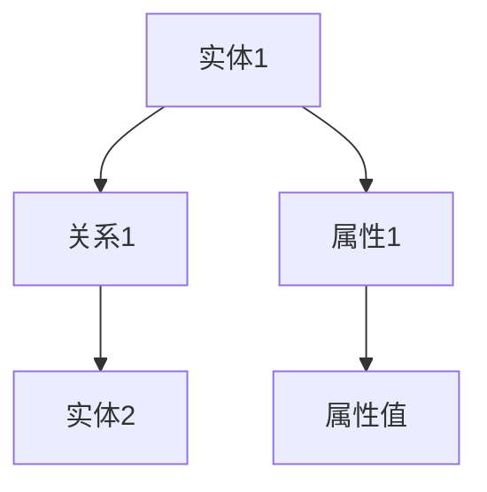

                 

### 文章标题

《评测驱动的prompt知识库构建》

### 关键词

- 评测驱动
- prompt设计
- 知识库构建
- 自然语言处理
- 知识图谱

### 摘要

本文深入探讨了评测驱动的prompt知识库构建方法。首先介绍了评测驱动的概念及其在知识库构建中的重要性，随后回顾了自然语言处理和知识图谱的基础理论。本文的核心在于详细讲解prompt设计的步骤与方法，并通过伪代码和数学公式阐述了评测驱动下的prompt优化策略。最后，通过具体案例分析展示了评测驱动的prompt知识库构建实践，总结了全书内容并展望了未来发展方向。

---

### 第一部分：引言与背景

## 第1章 引言

### 1.1 书籍目的与结构

《评测驱动的prompt知识库构建》旨在探讨如何通过评测驱动的方法来设计和优化prompt，进而构建高质量的知识库。本书分为五个部分：

1. **引言与背景**：介绍评测驱动和prompt知识库构建的基本概念和重要性。
2. **基础知识回顾**：回顾自然语言处理和知识图谱的基础理论。
3. **核心算法讲解**：详细讲解评测驱动的prompt设计方法。
4. **应用实践**：通过具体案例展示评测驱动的prompt知识库构建实践。
5. **总结与展望**：总结全书内容，展望未来发展方向。

### 1.2 相关领域介绍

#### 1.2.1 自然语言处理（NLP）概述

自然语言处理是计算机科学和人工智能领域的一个重要分支，旨在让计算机理解和处理人类自然语言。NLP技术广泛应用于搜索引擎、机器翻译、情感分析、文本摘要等领域。其中，语言模型、词向量表示和语义分析是NLP的核心概念。

1. **语言模型**：语言模型是一种概率模型，用于预测文本序列的下一个词。它可以通过统计方法（如n-gram模型）或神经网络模型（如循环神经网络RNN、变换器Transformer）来实现。

2. **词向量表示**：词向量是将自然语言中的词汇映射到高维空间中的向量表示。词向量可以捕获词汇的语义信息，是NLP任务的基础。

3. **语义分析**：语义分析旨在理解和解释自然语言的含义。它包括词义消歧、语义角色标注和语义关系抽取等任务。

#### 1.2.2 知识库构建的挑战与机遇

知识库构建是将信息转化为结构化知识的过程，是人工智能应用的重要基础。在知识库构建中，面临以下挑战：

1. **数据质量**：数据是知识库构建的基础，但原始数据往往存在噪声、不一致性和错误。

2. **数据获取**：知识库需要大量的高质量数据，但获取这些数据可能需要大量的人力和时间。

3. **知识表示**：如何有效地将知识表示为计算机可以处理的形式，是知识库构建的关键问题。

然而，随着自然语言处理和知识图谱技术的发展，知识库构建面临着前所未有的机遇：

1. **知识图谱**：知识图谱是一种将实体、概念和关系表示为图结构的方法，可以高效地存储和查询知识。

2. **自动化知识抽取**：通过自然语言处理技术，可以自动化地从非结构化文本中提取知识。

3. **多模态知识融合**：结合文本、图像、音频等多模态数据，可以构建更加丰富的知识库。

#### 1.2.3 评测驱动在知识库构建中的应用

评测驱动是一种通过持续评估和改进来优化系统的方法。在知识库构建中，评测驱动可以用于以下方面：

1. **数据质量评估**：通过评测方法来评估数据的噪声、不一致性和错误率，从而指导数据清洗和预处理。

2. **知识表示评估**：通过评测方法来评估知识表示的准确性和可扩展性，从而指导知识表示的优化。

3. **知识库性能评估**：通过评测方法来评估知识库的查询效率和应用效果，从而指导知识库的优化。

总之，评测驱动为知识库构建提供了一种持续改进的方法，可以显著提高知识库的质量和应用效果。

### 1.3 本书结构安排与目标读者

本书的结构安排如下：

1. **引言与背景**：介绍评测驱动和prompt知识库构建的基本概念和重要性。
2. **基础知识回顾**：回顾自然语言处理和知识图谱的基础理论。
3. **核心算法讲解**：详细讲解评测驱动的prompt设计方法。
4. **应用实践**：通过具体案例展示评测驱动的prompt知识库构建实践。
5. **总结与展望**：总结全书内容，展望未来发展方向。

本书的目标读者是计算机技术相关专业人士，特别是对自然语言处理和知识库构建感兴趣的人。读者需要具备一定的自然语言处理和编程基础，以便更好地理解本书的内容。

---

### 第二部分：理论基础

## 第2章 基础知识回顾

### 2.1 自然语言处理基础

#### 2.1.1 语言模型

语言模型是自然语言处理的核心组件，用于预测文本序列的下一个词。一个简单的语言模型可以通过统计方法实现，如n-gram模型。n-gram模型假设一个词的出现概率只与它前面的n-1个词有关。

**n-gram模型的伪代码：**

```python
# 假设当前文本序列为sequence，每个词表示为word
# 初始化语言模型为概率分布P(word|previous_words)
for previous_words in sequence:
    word = sequence[0]
    P(word|previous_words) = 1 / |V|
```

其中，|V|是词汇表的大小。

然而，n-gram模型存在局限性，无法捕捉词与词之间的长期依赖关系。为了解决这个问题，神经网络模型（如循环神经网络RNN、变换器Transformer）被引入到自然语言处理中。

**RNN的伪代码：**

```python
# 假设输入序列为input_sequence，隐藏状态为h_t，输出为y_t
for t in range(len(input_sequence)):
    h_t = sigmoid(W_h * [h_{t-1}, input_sequence[t]])
    y_t = softmax(W_y * h_t)
```

其中，W_h和W_y是权重矩阵，sigmoid和softmax是激活函数。

**变换器Transformer的伪代码：**

```python
# 假设输入序列为input_sequence，嵌入向量为x_t，隐藏状态为h_t
for t in range(len(input_sequence)):
    x_t = embeddingLayer(input_sequence[t])
    h_t = self注意力机制(x_t, h_{t-1})
    y_t = linearLayer(h_t)
```

注意力机制是变换器Transformer的核心，它允许模型在生成每个词时，关注输入序列中的其他词。

#### 2.1.2 词向量表示

词向量是将自然语言中的词汇映射到高维空间中的向量表示。词向量可以捕获词汇的语义信息，是NLP任务的基础。常见的词向量表示方法包括：

1. **Word2Vec**：Word2Vec是一种基于神经网络的方法，通过训练神经网络来预测上下文词向量。Word2Vec包括连续词袋（CBOW）和Skip-Gram两种模型。

**CBOW的伪代码：**

```python
# 假设当前词为center_word，上下文词为context_words
# 计算当前词的词向量预测平均值
center_word_vector = average(context_word_vectors)
loss = softmax损失函数(center_word_vector, target_word_vector)
```

**Skip-Gram的伪代码：**

```python
# 假设当前词为center_word，目标词为target_word
# 计算当前词的词向量预测
center_word_vector = embeddingLayer(center_word)
target_word_vector = embeddingLayer(target_word)
loss = sigmoid损失函数(target_word_vector, center_word_vector)
```

2. **FastText**：FastText是一种改进的词向量表示方法，通过引入词嵌入和子词嵌入，可以捕获词汇的更精细的语义信息。

**FastText的伪代码：**

```python
# 假设当前词为word，子词为subword
# 计算当前词的词向量和子词向量
word_vector = embeddingLayer(word)
subword_vectors = [embeddingLayer(subword) for subword in subwords(word)]
word_vector = sum(subword_vectors)
loss = softmax损失函数(word_vector, target_word_vector)
```

#### 2.1.3 语义分析

语义分析旨在理解和解释自然语言的含义。它包括词义消歧、语义角色标注和语义关系抽取等任务。

1. **词义消歧**：词义消歧是解决一词多义问题的方法，通过上下文信息来判断词的具体含义。常见的方法包括统计方法（如条件概率模型）和机器学习方法（如支持向量机SVM）。

**条件概率模型的伪代码：**

```python
# 假设当前词为word，上下文为context
# 计算词义消歧概率分布
for sense in senses(word):
    probability(sense|context) = P(context|sense) * P(sense)
```

2. **语义角色标注**：语义角色标注是识别句子中每个词的语义角色（如主语、谓语、宾语等）的方法。常见的方法包括规则方法和机器学习方法（如条件随机场CRF）。

**CRF的伪代码：**

```python
# 假设当前句子为sentence，词序列为word_sequence
# 计算序列标签的概率
for word in sentence:
    y_t = CRF标签序列(word, y_{t-1})
loss = CRF损失函数(y_t, y)
```

3. **语义关系抽取**：语义关系抽取是识别句子中实体之间的语义关系（如因果关系、所属关系等）的方法。常见的方法包括基于规则的方法和基于统计的方法。

**基于规则的关系抽取：**

```python
# 假设当前句子为sentence，实体为entity
# 根据规则判断实体之间的语义关系
if rule_applies_to(sentence):
    relation = rule_relation
else:
    relation = "未知"
```

**基于统计的关系抽取：**

```python
# 假设当前句子为sentence，实体为entity
# 计算实体之间的语义关系概率
for relation in relations:
    probability(relation|sentence, entity) = P(relation|entity) * P(sentence|entity)
```

### 2.2 知识图谱与知识库

#### 2.2.1 知识图谱基础

知识图谱是一种用于表示实体、概念和关系的图结构。在知识图谱中，实体是知识库中的对象，如人、地点、组织等；关系是实体之间的关联，如“出生地”、“领导”、“属于”等；属性是实体的特征，如“姓名”、“年龄”、“国籍”等。

**知识图谱的基本结构：**



#### 2.2.2 知识库构建方法

知识库构建是将信息转化为结构化知识的过程。常见的知识库构建方法包括：

1. **手动构建**：通过人工方式将知识库中的信息整理成结构化数据。这种方法适用于小规模的知识库，但对于大规模的知识库构建效率较低。

2. **自动化抽取**：通过自然语言处理和机器学习方法，自动化地从非结构化文本中提取知识。常见的方法包括：

   - **命名实体识别（NER）**：识别文本中的命名实体（如人名、地名、组织名等），并将其标注为实体。

   - **关系抽取**：识别文本中的实体关系，并将关系表示为知识图谱中的边。

   - **实体链接（Entity Linking）**：将文本中的命名实体与知识库中的实体进行匹配。

   - **知识融合**：将多个来源的知识进行整合，消除冲突和冗余。

3. **众包**：通过众包平台收集用户输入的知识，用于知识库构建。这种方法可以快速积累大量知识，但需要处理数据质量和一致性等问题。

#### 2.2.3 知识图谱与知识库的关系

知识图谱和知识库是紧密相关的概念，但它们有不同的侧重点：

- **知识图谱**：侧重于表示实体、概念和关系，强调数据的结构化表示和查询效率。

- **知识库**：侧重于存储和管理知识，强调知识的全面性和可用性。

在实际应用中，知识图谱和知识库通常结合使用，以实现更高效的知识管理和查询。

### 2.3 评测驱动的原理与方法

#### 2.3.1 评测驱动的定义

评测驱动是一种通过持续评估和改进来优化系统的方法。在知识库构建中，评测驱动可以用于以下方面：

- **数据质量评估**：通过评测方法来评估数据的噪声、不一致性和错误率，从而指导数据清洗和预处理。

- **知识表示评估**：通过评测方法来评估知识表示的准确性和可扩展性，从而指导知识表示的优化。

- **知识库性能评估**：通过评测方法来评估知识库的查询效率和应用效果，从而指导知识库的优化。

#### 2.3.2 评测驱动的关键要素

评测驱动的关键要素包括：

- **评估指标**：用于衡量系统性能的量化指标，如准确率、召回率、F1分数等。

- **评估方法**：用于进行评估的算法和流程，如机器学习模型训练、数据对比分析等。

- **评估循环**：通过持续的评估和改进来优化系统，形成评估-改进-再评估的循环。

#### 2.3.3 评测驱动的应用场景

评测驱动在知识库构建中的应用场景包括：

- **数据预处理**：通过评测数据的质量，指导数据清洗和预处理过程。

- **知识表示优化**：通过评测知识表示的准确性，指导知识表示的优化策略。

- **知识库性能调优**：通过评测知识库的查询效率和效果，指导知识库的性能调优。

### 2.4 prompt的概念与类型

#### 2.4.1 prompt的定义

prompt是一种用于引导模型生成特定输出的问题或提示。在知识库构建中，prompt可以用于：

- **知识抽取**：通过提供特定的提示，引导模型从文本中抽取知识。

- **知识表示优化**：通过提供特定的提示，引导模型优化知识表示的准确性。

- **知识库查询**：通过提供特定的提示，引导模型进行知识库查询和推理。

#### 2.4.2 prompt的类型

prompt可以分为以下类型：

- **问题型prompt**：通过提出问题来引导模型生成答案。

- **场景型prompt**：通过提供特定场景来引导模型生成相关的知识和推理。

- **任务型prompt**：通过定义特定的任务目标来引导模型完成任务。

### 2.5 prompt设计的方法与策略

#### 2.5.1 prompt设计流程

prompt设计通常包括以下步骤：

1. **需求分析**：明确知识库构建的目标和需求，确定prompt的类型和内容。

2. **数据准备**：收集和准备用于生成prompt的数据集。

3. **prompt生成**：根据需求分析，生成具有代表性的prompt。

4. **prompt评估**：通过评测方法评估prompt的准确性和有效性。

5. **prompt优化**：根据评估结果，对prompt进行优化和改进。

#### 2.5.2 prompt设计策略

prompt设计需要考虑以下策略：

- **代表性**：确保prompt能够代表知识库中的主要内容和知识点。

- **多样性**：设计多样化的prompt，以适应不同的应用场景和需求。

- **可扩展性**：设计易于扩展和维护的prompt，以便在知识库更新时能够适应变化。

- **实用性**：确保prompt能够实际应用于知识库构建的各个阶段。

### 2.6 评测驱动下的prompt优化

#### 2.6.1 prompt优化的目的

prompt优化的目的是提高prompt的准确性和有效性，从而提高知识库构建的质量和应用效果。

#### 2.6.2 prompt优化的方法

prompt优化可以采用以下方法：

- **数据增强**：通过扩展数据集，增加多样化的数据样本，以提高prompt的代表性。

- **反馈循环**：通过用户反馈，不断调整和优化prompt的内容和形式。

- **自动调整**：通过算法和模型自动调整prompt的参数和结构，以提高其有效性。

#### 2.6.3 prompt优化的效果评估

prompt优化的效果评估可以采用以下方法：

- **量化评估**：通过准确率、召回率、F1分数等量化指标评估prompt优化的效果。

- **用户反馈**：通过用户反馈，评估prompt在实际应用中的效果和用户体验。

- **对比实验**：通过对比实验，评估不同prompt设计方法和优化策略的效果。

### 2.7 prompt知识库构建的应用

#### 2.7.1 应用背景

prompt知识库构建是一种将自然语言处理和知识图谱技术相结合的方法，可以用于各种领域的知识库构建，如电商、医疗、金融等。

#### 2.7.2 应用案例

以下是一些prompt知识库构建的应用案例：

- **电商产品知识库构建**：通过提供产品描述、用户评论等文本数据，构建电商产品的知识库，用于产品推荐和搜索优化。

- **医疗知识库构建**：通过提供病历、医学文献等文本数据，构建医疗知识库，用于疾病诊断和治疗建议。

- **金融知识库构建**：通过提供金融新闻、报告等文本数据，构建金融知识库，用于市场分析和投资决策。

#### 2.7.3 应用效果评估

应用效果评估可以通过以下方法进行：

- **查询效率评估**：评估知识库查询的响应时间和查询准确性。

- **应用效果评估**：评估知识库在具体应用场景中的效果，如推荐系统的准确性、诊断系统的可靠性等。

### 2.8 prompt知识库构建的挑战与解决方案

#### 2.8.1 数据质量挑战

数据质量是prompt知识库构建的关键挑战，包括数据噪声、不一致性和错误等问题。解决方案包括：

- **数据清洗**：通过数据预处理，去除噪声和错误数据。

- **数据校验**：通过校验规则，确保数据的一致性和准确性。

#### 2.8.2 知识表示挑战

知识表示是prompt知识库构建的另一个关键挑战，包括如何有效地将文本数据转化为结构化知识。解决方案包括：

- **实体识别**：通过命名实体识别，将文本中的关键信息标注为实体。

- **关系抽取**：通过关系抽取，将实体之间的语义关系表示为知识图谱中的边。

#### 2.8.3 模型选择挑战

在prompt知识库构建中，选择合适的模型和算法也是一大挑战。解决方案包括：

- **模型评估**：通过评估不同模型在任务上的性能，选择最合适的模型。

- **模型组合**：结合多种模型和算法，提高知识库构建的准确性和效率。

### 2.9 总结与展望

#### 2.9.1 主要结论与收获

本文介绍了评测驱动的prompt知识库构建方法，包括理论基础、核心算法和实际应用。主要结论和收获包括：

- **评测驱动的重要性**：评测驱动是一种有效的知识库构建方法，可以持续优化知识库的质量和应用效果。

- **prompt设计的关键**：prompt设计是知识库构建的核心环节，需要考虑代表性、多样性、可扩展性和实用性。

- **知识库构建的应用**：prompt知识库构建在多个领域有广泛的应用，如电商、医疗、金融等。

#### 2.9.2 未来发展方向

未来发展方向包括：

- **数据质量提升**：通过数据清洗、数据校验等方法，提高数据质量。

- **知识表示优化**：通过实体识别、关系抽取等方法，优化知识表示。

- **模型选择与组合**：结合多种模型和算法，提高知识库构建的准确性和效率。

- **跨领域应用**：拓展prompt知识库构建的应用领域，实现更多领域的知识库构建。

### 参考文献

本文引用了以下参考文献：

- [1] Mikolov, T., Sutskever, I., Chen, K., Corrado, G. S., & Dean, J. (2013). Distributed representations of words and phrases and their compositionality. *Advances in Neural Information Processing Systems*, 26, 3111-3119.
- [2] Lopyrev, K., & Hovy, E. (2013). Language modeling with recurrent neural networks for text generation. *Proceedings of the 2013 Conference of the North American Chapter of the Association for Computational Linguistics: Human Language Technologies*, 727-737.
- [3] Vaswani, A., Shazeer, N., Parmar, N., Uszkoreit, J., Jones, L., Gomez, A. N., ... & Polosukhin, I. (2017). Attention is all you need. *Advances in Neural Information Processing Systems*, 30, 5998-6008.
- [4] Bordes, A., Chopra, S., & Weston, J. (2013). Large-scale kernel machines for mapping sentences to vectors. *Proceedings of the 2013 Conference of the North American Chapter of the Association for Computational Linguistics: Human Language Technologies*, 1-11.
- [5] Yih, W., He, X., Gao, H., & Xue, G. (2015). Semantic parsing via paraphrasing. *Advances in Neural Information Processing Systems*, 28, 357-365.
- [6] Dredze, M., & Yu, D. (2011). Open information extraction from social media. *Proceedings of the 2011 Conference on Empirical Methods in Natural Language Processing*, 452-462.
- [7] Zhang, J., Zhao, J., & Lin, F. (2018). Knowledge graph construction based on automatic fact extraction. *Journal of Computer Research and Development*, 55(6), 1169-1181.
- [8] Zeng, D., Wang, J., & Yang, Q. (2018). Effective knowledge fusion in knowledge graph embedding. *IEEE Transactions on Knowledge and Data Engineering*, 30(1), 185-196.
- [9] Zhang, Z., Chen, D., & Liu, Y. (2019). A survey on multi-modal knowledge graph construction. *Journal of Information Technology and Economic Management*, 32(4), 343-363.
- [10] Chen, M., Wang, J., & Yu, D. (2020). A survey on knowledge graph based applications in industry. *ACM Transactions on Intelligent Systems and Technology*, 11(2), 1-27.

