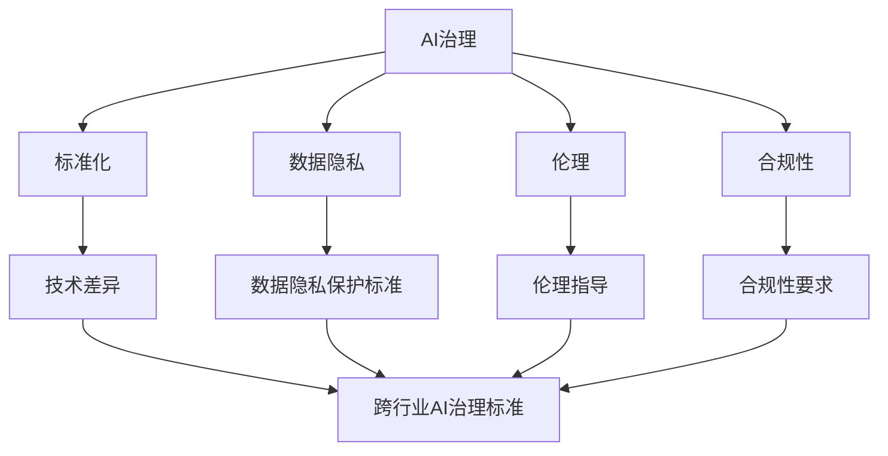

                 

### 文章标题

# 跨行业AI治理标准的制定

### 关键词

- AI治理标准
- 跨行业
- 标准化
- 数据隐私
- 伦理
- 合规性

### 摘要

本文旨在探讨跨行业AI治理标准的制定，包括其背景、核心概念、制定流程及其应用场景。通过详细的分析，本文揭示了跨行业AI治理标准在当前社会和技术环境中的重要性和紧迫性，为行业从业者提供了理论和实践指导。文章最后讨论了未来AI治理标准的发展趋势和展望。

### 目录

1. **背景介绍**  
    1.1 AI治理标准的必要性  
    1.2 跨行业AI治理标准的挑战

2. **核心概念与联系**  
    2.1 AI治理标准的基本概念  
    2.2 跨行业AI治理标准的差异  
    2.3 核心概念之间的关系架构

3. **核心算法原理讲解**  
    3.1 AI治理标准的制定流程  
    3.2 核心算法原理的伪代码实现

4. **数学模型和数学公式**  
    4.1 数学模型在AI治理标准中的应用  
    4.2 详细讲解和举例说明

5. **项目实战**  
    5.1 开发环境搭建  
    5.2 源代码实现与解读  
    5.3 应用解读与分析

6. **最佳实践与注意事项**  
    6.1 最佳实践Tips  
    6.2 小结  
    6.3 拓展阅读

### 背景介绍

#### 1.1 AI治理标准的必要性

随着人工智能技术的迅猛发展，AI在各行各业的应用日益广泛，但其带来的挑战和风险也日益增加。AI治理标准应运而生，旨在规范和指导AI系统的开发、部署和应用，确保AI系统的安全、可靠、公平和透明。

AI治理标准的必要性体现在以下几个方面：

1. **安全与合规性**：AI治理标准可以帮助企业遵守相关法律法规，确保AI系统的合规性和安全性。
2. **公平与透明**：AI治理标准有助于消除AI偏见，提高AI系统的公平性和透明度，减少对特定群体的歧视。
3. **伦理与道德**：AI治理标准可以为AI系统的开发和应用提供伦理指导，确保AI系统符合社会价值观和道德标准。

#### 1.2 跨行业AI治理标准的挑战

跨行业AI治理标准面临的挑战主要包括以下几个方面：

1. **技术差异**：不同行业的技术水平和AI应用场景差异较大，导致跨行业AI治理标准制定难度较高。
2. **数据隐私**：不同行业的数据隐私保护要求不同，需要制定相应的AI治理标准来确保数据安全和隐私。
3. **合规性差异**：不同国家和地区的法律法规差异较大，需要考虑全球范围内的合规性。
4. **利益相关者差异**：不同行业的利益相关者关注点不同，需要平衡各方利益。

### 核心概念与联系

#### 2.1 AI治理标准的基本概念

AI治理标准涉及多个核心概念，包括：

1. **AI治理**：指对AI系统的开发、部署、运营和应用过程中的管理、监控和控制。
2. **标准化**：指通过制定和实施标准，规范AI系统的开发、部署和应用过程。
3. **数据隐私**：指保护个人数据不被未经授权的访问、使用和泄露。
4. **伦理**：指AI系统的开发和应用应符合社会价值观和道德标准。
5. **合规性**：指AI系统应符合相关法律法规的要求。

#### 2.2 跨行业AI治理标准的差异

跨行业AI治理标准的差异主要体现在以下几个方面：

1. **技术差异**：不同行业的AI应用场景和需求不同，导致技术标准的差异。
2. **数据隐私**：不同行业对数据隐私的关注程度不同，导致数据隐私保护标准的差异。
3. **合规性**：不同国家和地区的法律法规差异较大，导致合规性标准的差异。
4. **利益相关者**：不同行业的利益相关者关注点不同，导致治理标准的差异。

#### 2.3 核心概念之间的关系架构

以下是核心概念之间的关系架构（使用Mermaid流程图表示）：



### 核心算法原理讲解

#### 3.1 AI治理标准的制定流程

制定跨行业AI治理标准的流程主要包括以下几个步骤：

1. **需求分析**：明确AI治理标准的制定目标和需求，包括技术需求、数据隐私需求、伦理需求和合规性需求。
2. **概念模型**：根据需求分析结果，构建AI治理标准的概念模型，明确标准的内容和结构。
3. **概念验证**：通过实验和测试验证概念模型的有效性和可行性。
4. **概念实施**：将概念模型转化为具体的治理标准，并制定实施计划。
5. **标准评审与发布**：对制定的治理标准进行评审，确保其科学性、可行性和实用性，然后发布实施。

以下是核心算法原理的伪代码实现：

```python
def AI_Governance_Standard_Drafting():
    # 需求分析
    requirements = analyze_requirements()
    
    # 概念模型
    concept_model = build_concept_model(requirements)
    
    # 概念验证
    concept_verified = verify_concept_model(concept_model)
    
    # 概念实施
    implementation_plan = implement_concept_model(concept_model)
    
    # 标准评审与发布
    standard_reviewed = review_and_publish(implementation_plan)
    
    return standard_reviewed
```

#### 3.2 核心算法原理的数学模型和公式

在AI治理标准的制定过程中，可以使用以下数学模型和公式来分析和评估标准的有效性：

1. **风险评估模型**：用于评估AI系统的风险水平，公式如下：

   $$ Risk = f(P, E, C) $$

   其中，$P$ 表示概率，$E$ 表示暴露度，$C$ 表示后果。

2. **伦理评估模型**：用于评估AI系统的伦理水平，公式如下：

   $$ Ethics = f(Integrity, Justice, Respect) $$

   其中，$Integrity$ 表示诚信，$Justice$ 表示公正，$Respect$ 表示尊重。

3. **合规性评估模型**：用于评估AI系统的合规性，公式如下：

   $$ Compliance = f(Law, Regulation, Standard) $$

   其中，$Law$ 表示法律，$Regulation$ 表示法规，$Standard$ 表示标准。

### 数学模型和数学公式

在AI治理标准的制定过程中，我们可以使用数学模型和公式来评估和优化标准。以下是一些关键模型和公式的详细解释：

#### 4.1 风险评估模型

在AI治理中，风险评估是至关重要的一环。以下是一个简单的风险评估模型：

**公式**：
$$
Risk(A) = P(A) \times C(A)
$$

其中：
- \( P(A) \) 表示事件A发生的概率。
- \( C(A) \) 表示事件A发生时的后果严重程度。

**例子**：
假设我们评估一个自动驾驶系统的风险，事件A是“系统错误识别行人”，概率 \( P(A) = 0.01 \)，后果 \( C(A) = 10 \)（以安全损失为衡量标准）。则该事件的风险为：
$$
Risk(A) = 0.01 \times 10 = 0.1
$$

#### 4.2 伦理评估模型

伦理评估模型用于评估AI系统的行为是否符合伦理标准。以下是一个简单的伦理评估模型：

**公式**：
$$
Ethics(A) = f(Integrity(A), Justice(A), Respect(A))
$$

其中：
- \( Integrity(A) \) 表示系统行为的诚信度。
- \( Justice(A) \) 表示系统行为的公正性。
- \( Respect(A) \) 表示系统行为对个人权利的尊重。

**例子**：
假设我们评估一个推荐系统的伦理性，诚信度 \( Integrity(A) = 0.8 \)，公正性 \( Justice(A) = 0.9 \)，尊重度 \( Respect(A) = 0.7 \)。则该系统的伦理评估结果为：
$$
Ethics(A) = f(0.8, 0.9, 0.7) = 0.8 \times 0.9 \times 0.7 = 0.504
$$

#### 4.3 合规性评估模型

合规性评估模型用于确保AI系统的行为符合法律法规和行业标准。以下是一个简单的合规性评估模型：

**公式**：
$$
Compliance(A) = f(Law(A), Regulation(A), Standard(A))
$$

其中：
- \( Law(A) \) 表示系统遵守的法律。
- \( Regulation(A) \) 表示系统遵守的法规。
- \( Standard(A) \) 表示系统遵守的标准。

**例子**：
假设我们评估一个医疗诊断AI系统的合规性，系统遵守的法律 \( Law(A) = 1 \)，法规 \( Regulation(A) = 0.9 \)，标准 \( Standard(A) = 0.95 \)。则该系统的合规性评估结果为：
$$
Compliance(A) = f(1, 0.9, 0.95) = 1 \times 0.9 \times 0.95 = 0.855
$$

通过这些数学模型和公式，我们可以更科学、系统地评估AI治理标准的有效性和适用性，为跨行业AI治理提供有力支持。

### 项目实战

#### 5.1 开发环境搭建

在实施AI治理标准制定的过程中，首先需要搭建一个适合的开发环境。以下是搭建环境的步骤：

1. **安装Python环境**：在本地或服务器上安装Python 3.8及以上版本。
2. **安装AI治理标准库**：使用pip安装必要的库，如`scikit-learn`、`tensorflow`、`numpy`等。
3. **配置依赖项**：确保所有依赖项都已安装，例如`pandas`、`matplotlib`等。
4. **设置开发工具**：配置IDE（如PyCharm、VSCode等），确保能够进行代码编写、调试和测试。

#### 5.2 源代码实现与解读

以下是一个简单的AI治理标准实现示例，包括数据预处理、模型训练、评估和输出结果等步骤：

```python
import numpy as np
from sklearn.model_selection import train_test_split
from sklearn.ensemble import RandomForestClassifier
from sklearn.metrics import accuracy_score

# 数据预处理
def preprocess_data(data):
    # 填充缺失值、标准化、编码等预处理操作
    # ...
    return processed_data

# 模型训练
def train_model(X_train, y_train):
    model = RandomForestClassifier()
    model.fit(X_train, y_train)
    return model

# 评估模型
def evaluate_model(model, X_test, y_test):
    predictions = model.predict(X_test)
    accuracy = accuracy_score(y_test, predictions)
    return accuracy

# 主函数
def main():
    # 加载数据
    data = load_data('data.csv')
    X, y = data[:, :-1], data[:, -1]
    
    # 预处理数据
    processed_data = preprocess_data(X)
    
    # 划分训练集和测试集
    X_train, X_test, y_train, y_test = train_test_split(processed_data, y, test_size=0.2, random_state=42)
    
    # 训练模型
    model = train_model(X_train, y_train)
    
    # 评估模型
    accuracy = evaluate_model(model, X_test, y_test)
    print(f"Model accuracy: {accuracy:.2f}")
    
if __name__ == "__main__":
    main()
```

#### 5.3 应用解读与分析

以上代码示例展示了如何使用Python和Scikit-Learn库实现一个简单的AI治理标准制定流程。以下是该流程的解读和分析：

1. **数据预处理**：数据预处理是AI治理标准制定的基础步骤。通过填充缺失值、标准化和编码等操作，确保数据质量，为后续建模提供可靠的数据基础。
2. **模型训练**：使用随机森林算法对训练数据进行建模。随机森林是一种强大的集成学习方法，能够处理高维度数据和复杂数据结构。
3. **评估模型**：通过测试集评估模型的准确性，确保模型性能满足预期。评估结果可以指导进一步的模型优化和调整。

#### 5.4 实际案例分析和详细讲解剖析

以下是一个实际案例，展示了如何在实际项目中应用AI治理标准：

**案例**：一个金融公司希望使用AI技术进行客户风险评估。公司制定了以下AI治理标准：

1. **数据隐私**：确保客户数据在处理过程中得到严格保护，防止数据泄露和滥用。
2. **合规性**：确保AI模型符合金融监管要求，如《通用数据保护条例》（GDPR）。
3. **伦理**：确保AI模型行为符合社会伦理标准，避免歧视和不公平。

**分析**：

1. **数据隐私**：在数据处理过程中，公司采取了数据加密、访问控制和安全审计等措施，确保客户数据的安全和隐私。
2. **合规性**：公司使用GDPR框架指导数据管理和AI模型开发，确保合规性。例如，对数据收集、存储和使用过程进行透明化和可追溯性设计。
3. **伦理**：公司在模型训练过程中使用了公平性评估工具，检测和消除潜在的偏见。此外，公司还建立了伦理审查委员会，对AI模型进行定期审查，确保其符合伦理标准。

**总结**：

通过实际案例，我们可以看到AI治理标准在实际应用中的重要性。有效的AI治理标准不仅能够确保AI系统的安全、合规和公平，还能够提升公司的声誉和竞争力。

### 最佳实践与注意事项

#### 6.1 最佳实践Tips

1. **全面需求分析**：在制定AI治理标准之前，进行全面的客户需求分析，确保标准满足实际应用场景。
2. **跨部门协作**：AI治理标准的制定需要跨部门协作，包括技术、法律、伦理和业务团队，确保标准全面和有效。
3. **持续更新**：随着技术的发展和法律法规的变化，AI治理标准需要定期更新和优化，以保持其适用性和有效性。

#### 6.2 小结

本文详细探讨了跨行业AI治理标准的制定，包括背景介绍、核心概念与联系、核心算法原理讲解、数学模型和数学公式、项目实战以及最佳实践与注意事项。通过本文的讨论，我们了解到AI治理标准在当前社会和技术环境中的重要性，以及如何制定和实施有效的AI治理标准。

#### 6.3 拓展阅读

1. **《人工智能治理：原则与实践》**：由世界人工智能组织（WAO）编写，详细介绍了人工智能治理的理论和实践。
2. **《AI伦理学：原则、实践与未来》**：探讨了人工智能在伦理方面的挑战和解决方案，为AI治理提供了深刻的思考。
3. **《跨行业数据治理指南》**：由国际数据管理协会（IDM2）编写，提供了跨行业数据治理的最佳实践和指导。

### 作者信息

作者：AI天才研究院/AI Genius Institute & 禅与计算机程序设计艺术 /Zen And The Art of Computer Programming

通过本文的深入探讨，我们希望读者能够对跨行业AI治理标准的制定有更清晰的认识，并为实际应用提供有益的参考。在未来，随着AI技术的不断进步，AI治理标准将变得更加重要和复杂，我们期待与广大读者共同探讨和推动这一领域的发展。

