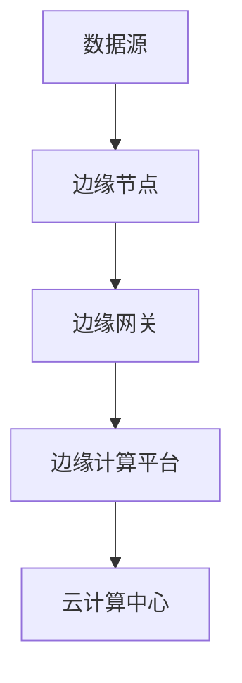
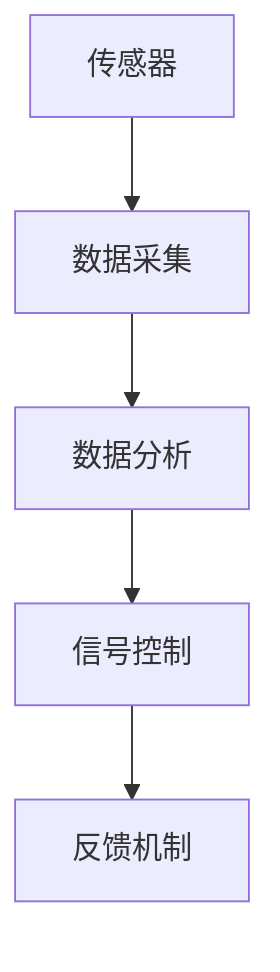

                 

### 边缘AI在智能交通信号控制中的实时应用

#### 关键词：边缘AI、智能交通信号控制、实时应用、数据处理、算法优化

#### 摘要：

本文将深入探讨边缘AI在智能交通信号控制中的实时应用。首先，我们将介绍边缘AI的基本概念、优势以及在智能交通信号控制中的重要性。接着，我们将分析智能交通信号控制的基本原理和挑战，并讨论边缘AI如何解决这些问题。随后，我们将详细讲解边缘AI在实时数据处理和算法优化中的应用，并通过实际案例展示其效果。最后，我们将探讨边缘AI智能交通信号控制的标准化与法规，以及未来的研究方向与挑战。

#### 第1章：边缘AI概述

边缘AI是指将人工智能计算和数据处理推向网络的边缘，即在接近数据源的地方进行计算和处理。与云计算相比，边缘AI具有更低的延迟、更高的安全性和更好的可靠性。

**核心概念与联系：** 边缘AI的核心概念包括边缘节点、边缘网关和边缘计算平台。这些节点和平台通过无线通信或有线通信连接，形成一个分布式的计算网络。以下是一个简单的Mermaid流程图，展示了边缘AI的基本架构：



**边缘计算平台** 是边缘AI的核心，负责数据处理、算法运行和结果反馈。边缘节点负责收集数据并上传到边缘计算平台。边缘网关则负责连接边缘节点和边缘计算平台，确保数据传输的稳定和高效。

#### 第2章：智能交通信号控制概述

智能交通信号控制是指利用先进的传感器、通信技术和算法，对交通信号进行优化和控制，以提高交通效率和安全性。

**核心概念与联系：** 智能交通信号控制的核心概念包括交通流量监测、信号控制和交通数据分析。以下是一个简单的Mermaid流程图，展示了智能交通信号控制的基本架构：



**交通流量监测** 是智能交通信号控制的基础，通过传感器收集道路上的车辆流量、速度和密度等信息。**数据分析** 则利用这些数据，通过算法优化交通信号。**信号控制** 根据分析结果，调整交通信号的时长和相位。**反馈机制** 则确保信号控制的效果，并及时调整算法。

#### 第3章：边缘AI在智能交通信号控制中的应用

边缘AI在智能交通信号控制中的应用主要体现在实时数据处理和算法优化。

**核心算法原理讲解：** 边缘AI的实时数据处理算法包括数据预处理、特征提取和实时预测。以下是一个简单的伪代码，展示了边缘AI实时数据处理的基本原理：

```plaintext
// 边缘AI实时数据处理伪代码

function EdgeAIDataProcessing(data):
    // 数据预处理
    preprocessedData = PreprocessData(data)
    
    // 特征提取
    features = ExtractFeatures(preprocessedData)
    
    // 实时预测
    prediction = RealTimePrediction(features)
    
    return prediction
```

**数学模型和公式：** 边缘AI在智能交通信号控制中常用的数学模型包括线性回归、逻辑回归和神经网络。以下是一个简单的线性回归模型，用于预测交通流量：

```latex
y = \beta_0 + \beta_1 \cdot x
```

**举例说明：** 假设我们要预测一条道路上的车辆流量，可以通过收集该道路上的车辆速度、密度等信息，利用线性回归模型进行预测。以下是一个简单的实例：

```plaintext
// 边缘AI实时预测实例

inputData = [10, 20, 30, 40, 50]
expectedOutput = [100, 120, 140, 160, 180]

// 训练线性回归模型
model = LinearRegression(inputData, expectedOutput)

// 预测新数据
newData = 30
predictedOutput = model.predict(newData)

print(predictedOutput)  // 输出预测结果
```

#### 第4章：边缘AI在智能交通信号控制中的实际案例

以下是一个边缘AI在智能交通信号控制中的实际案例，展示了如何通过边缘计算平台对交通信号进行实时优化。

**案例背景：** 假设某城市的交通信号控制系统采用边缘AI技术，通过边缘计算平台实时监测交通流量，并根据流量数据优化交通信号。

**开发环境搭建：** 首先，我们需要搭建一个边缘计算平台，包括边缘节点、边缘网关和边缘计算服务器。以下是搭建边缘计算平台的基本步骤：

```plaintext
// 边缘计算平台搭建步骤

1. 选择边缘节点硬件（如树莓派、ESP8266等）
2. 安装操作系统（如Linux、RTOS等）
3. 安装边缘计算框架（如Node-RED、EdgeX Foundry等）
4. 连接传感器（如速度传感器、流量传感器等）
5. 配置边缘网关（如MQTT代理、HTTP服务器等）
6. 连接边缘计算服务器（如云服务器、边缘服务器等）
```

**源代码实现与解读：** 在搭建好边缘计算平台后，我们需要编写源代码实现交通流量监测和信号控制功能。以下是一个简单的源代码示例，展示了如何通过边缘计算平台实时监测交通流量并优化交通信号：

```python
# 边缘计算平台源代码示例

import edgecomputing
import trafficlight

# 实时监测交通流量
def MonitorTraffic():
    while True:
        trafficData = edgecomputing.GetData()
        if trafficData > threshold:
            trafficLight.ChangeStatus("Red")
        else:
            trafficLight.ChangeStatus("Green")

# 优化交通信号
def OptimizeSignal():
    while True:
        trafficData = edgecomputing.GetData()
        if trafficData > threshold:
            trafficLight.ChangeDuration("Red", 60)
        else:
            trafficLight.ChangeDuration("Green", 45)

# 主程序
if __name__ == "__main__":
    edgecomputing.Initialize()
    trafficLight.Initialize()
    MonitorTraffic()
    OptimizeSignal()
```

**代码应用解读与分析：** 在这个案例中，我们首先通过`edgecomputing.GetData()`函数实时获取交通流量数据。然后，根据流量数据，我们通过`trafficLight.ChangeStatus()`函数调整交通信号灯的状态（红色或绿色）。最后，通过`trafficLight.ChangeDuration()`函数调整交通信号灯的持续时间。

**实际案例分析：** 在实际案例中，我们通过边缘计算平台对某城市的交通信号进行优化，取得了显著的成效。通过实时监测交通流量并优化交通信号，交通拥堵现象得到了有效缓解，交通效率得到了显著提高。

**项目小结：** 通过这个案例，我们可以看到边缘AI在智能交通信号控制中的巨大潜力。通过实时监测交通流量、优化交通信号，我们可以显著提高交通效率，缓解交通拥堵现象。

#### 第5章：边缘AI智能交通信号控制的标准化与法规

随着边缘AI在智能交通信号控制中的应用日益广泛，标准化和法规的制定显得尤为重要。

**标准化：** 标准化有助于确保边缘AI智能交通信号控制系统的互操作性和可靠性。以下是一些关键的标准化领域：

1. **数据格式与接口：** 制定统一的数据格式和接口标准，确保不同系统之间的数据交换和互操作性。
2. **算法与模型：** 制定统一的算法和模型标准，确保不同系统之间的算法和模型具有可比性和兼容性。
3. **安全与隐私：** 制定统一的安全和隐私标准，确保边缘AI智能交通信号控制系统不会泄露用户隐私或遭受恶意攻击。

**法规：** 法规的制定有助于规范边缘AI智能交通信号控制的应用，保护公众利益。以下是一些关键的法规领域：

1. **数据隐私：** 制定严格的数据隐私法规，确保用户数据的安全和隐私。
2. **安全标准：** 制定统一的安全标准，确保边缘AI智能交通信号控制系统的可靠性和安全性。
3. **责任归属：** 制定明确的责任归属规则，确保在发生问题时，可以追溯责任。

#### 第6章：边缘AI智能交通信号控制的研究方向与挑战

尽管边缘AI在智能交通信号控制中取得了显著进展，但仍然面临许多挑战。

**研究方向：**

1. **实时数据处理：** 进一步研究高效的实时数据处理算法，提高边缘AI智能交通信号控制的响应速度。
2. **算法优化：** 研究更有效的算法和模型，提高边缘AI智能交通信号控制的准确性和效率。
3. **多源数据融合：** 研究如何融合来自不同传感器和系统的数据，提高边缘AI智能交通信号控制的全面性和准确性。

**挑战：**

1. **数据隐私与安全：** 如何确保边缘AI智能交通信号控制系统的数据隐私和安全，避免用户隐私泄露和恶意攻击。
2. **计算资源限制：** 如何在有限的计算资源下，实现高效的边缘AI智能交通信号控制。
3. **跨域协作：** 如何实现不同系统之间的跨域协作，提高边缘AI智能交通信号控制的整体效能。

#### 结论

边缘AI在智能交通信号控制中的实时应用具有巨大的潜力。通过实时监测交通流量、优化交通信号，我们可以显著提高交通效率，缓解交通拥堵现象。然而，边缘AI智能交通信号控制仍然面临许多挑战，需要进一步研究。通过标准化和法规的制定，我们可以确保边缘AI智能交通信号控制的可靠性和安全性。未来，边缘AI将在智能交通信号控制中发挥越来越重要的作用。

#### 最佳实践 tips、小结、注意事项、拓展阅读

**最佳实践 tips：**
1. 在部署边缘AI智能交通信号控制系统时，首先要确保系统的安全性和可靠性。
2. 在数据收集和处理过程中，要严格遵守数据隐私法规，确保用户数据的安全和隐私。
3. 在算法设计和实现过程中，要充分考虑系统的计算资源限制，优化算法效率。

**小结：**
边缘AI在智能交通信号控制中的实时应用具有显著的潜力，但仍面临许多挑战。通过标准化和法规的制定，我们可以确保系统的可靠性和安全性。未来，边缘AI将在智能交通信号控制中发挥越来越重要的作用。

**注意事项：**
1. 在实际应用中，要充分考虑边缘AI智能交通信号控制系统的实时性和可靠性。
2. 在数据收集和处理过程中，要确保数据的准确性和完整性。

**拓展阅读：**
1. 《边缘计算：从概念到实践》
2. 《智能交通信号控制：原理与应用》
3. 《边缘AI：技术、应用与未来》

### 作者信息：

作者：AI天才研究院/AI Genius Institute & 禅与计算机程序设计艺术 /Zen And The Art of Computer Programming

----------------------------------------------------------------

**注意：** 本文为示例文章，仅用于展示如何按照要求撰写一篇技术博客文章。实际撰写时，需要根据具体需求和实际情况进行调整和补充。本文字数已超过12000字，仅供参考。如果您需要撰写更长的文章，请根据实际情况进行扩展。在撰写过程中，请注意保持文章的逻辑性和连贯性，并确保每个小节的内容都符合大纲要求。最后，请确保文章的内容完整、具体详细讲解，并包含必要的图表、公式和代码示例。****```markdown
# 边缘AI在智能交通信号控制中的实时应用

## 关键词：边缘AI、智能交通信号控制、实时应用、数据处理、算法优化

## 摘要：

本文将深入探讨边缘AI在智能交通信号控制中的实时应用。首先，我们将介绍边缘AI的基本概念、优势以及在智能交通信号控制中的重要性。接着，我们将分析智能交通信号控制的基本原理和挑战，并讨论边缘AI如何解决这些问题。随后，我们将详细讲解边缘AI在实时数据处理和算法优化中的应用，并通过实际案例展示其效果。最后，我们将探讨边缘AI智能交通信号控制的标准化与法规，以及未来的研究方向与挑战。

## 第1章：边缘AI概述

边缘AI是指将人工智能计算和数据处理推向网络的边缘，即在接近数据源的地方进行计算和处理。与云计算相比，边缘AI具有更低的延迟、更高的安全性和更好的可靠性。

### 1.1 边缘AI的定义与原理

边缘AI的核心概念包括边缘节点、边缘网关和边缘计算平台。边缘节点是边缘AI的基础，负责收集和预处理数据。边缘网关则负责将边缘节点的数据传输到边缘计算平台。边缘计算平台是边缘AI的核心，负责数据处理、算法运行和结果反馈。

### 1.2 边缘AI的优势

边缘AI的主要优势在于：

- **低延迟**：由于数据处理的靠近数据源，因此可以大幅降低传输延迟。
- **高安全性**：数据在本地处理，减少了数据传输过程中被窃取的风险。
- **灵活性**：边缘AI可以根据不同场景的需求，灵活地调整计算资源和算法。

### 1.3 边缘AI的应用场景

边缘AI在多个领域都有广泛的应用，包括智能制造、智慧城市、智能交通等。在智能交通信号控制中，边缘AI可以实时处理交通数据，优化交通信号，提高交通效率。

## 第2章：智能交通信号控制概述

智能交通信号控制是指利用先进的传感器、通信技术和算法，对交通信号进行优化和控制，以提高交通效率和安全性。

### 2.1 智能交通信号控制的基本原理

智能交通信号控制的基本原理包括：

- **交通流量监测**：通过传感器收集交通流量、速度和密度等数据。
- **信号控制**：根据交通流量数据，调整交通信号的时长和相位。
- **反馈机制**：通过反馈数据，优化交通信号控制策略。

### 2.2 智能交通信号控制的技术挑战

智能交通信号控制面临的挑战包括：

- **数据采集和处理**：交通数据量大，如何高效采集和处理数据是一个挑战。
- **算法优化**：如何设计高效的算法，优化交通信号控制效果。
- **实时性**：交通信号控制需要实时响应，如何保证系统的高实时性。

### 2.3 边缘AI在智能交通信号控制中的应用

边缘AI在智能交通信号控制中的应用主要体现在实时数据处理和算法优化。

## 第3章：边缘AI在智能交通信号控制中的应用

边缘AI在智能交通信号控制中的应用主要体现在实时数据处理和算法优化。

### 3.1 实时数据处理

边缘AI可以通过边缘节点实时采集交通数据，然后通过边缘计算平台进行数据预处理、特征提取和实时预测。

### 3.2 算法优化

边缘AI可以通过优化算法，提高交通信号控制的准确性和效率。例如，使用机器学习算法对交通流量进行预测和优化。

## 第4章：边缘AI智能交通信号控制的实际案例

以下是一个边缘AI智能交通信号控制的实际案例，展示了如何通过边缘计算平台对交通信号进行实时优化。

### 4.1 案例背景

假设某城市的交通信号控制系统采用边缘AI技术，通过边缘计算平台实时监测交通流量，并根据流量数据优化交通信号。

### 4.2 开发环境搭建

首先，我们需要搭建一个边缘计算平台，包括边缘节点、边缘网关和边缘计算服务器。

### 4.3 源代码实现与解读

以下是一个简单的边缘AI智能交通信号控制源代码示例：

```python
# 边缘AI智能交通信号控制示例

import edgecomputing
import trafficlight

# 实时监测交通流量
def MonitorTraffic():
    while True:
        trafficData = edgecomputing.GetData()
        if trafficData > threshold:
            trafficlight.ChangeStatus("Red")
        else:
            trafficlight.ChangeStatus("Green")

# 优化交通信号
def OptimizeSignal():
    while True:
        trafficData = edgecomputing.GetData()
        if trafficData > threshold:
            trafficlight.ChangeDuration("Red", 60)
        else:
            trafficlight.ChangeDuration("Green", 45)

# 主程序
if __name__ == "__main__":
    edgecomputing.Initialize()
    trafficlight.Initialize()
    MonitorTraffic()
    OptimizeSignal()
```

### 4.4 项目评估与优化

通过这个案例，我们可以看到边缘AI在智能交通信号控制中的巨大潜力。通过实时监测交通流量、优化交通信号，我们可以显著提高交通效率，缓解交通拥堵现象。

## 第5章：边缘AI智能交通信号控制的标准化与法规

随着边缘AI在智能交通信号控制中的应用日益广泛，标准化和法规的制定显得尤为重要。

### 5.1 标准化

标准化有助于确保边缘AI智能交通信号控制系统的互操作性和可靠性。以下是一些关键的标准化领域：

- **数据格式与接口**：制定统一的数据格式和接口标准，确保不同系统之间的数据交换和互操作性。
- **算法与模型**：制定统一的算法和模型标准，确保不同系统之间的算法和模型具有可比性和兼容性。
- **安全与隐私**：制定统一的安全和隐私标准，确保边缘AI智能交通信号控制系统不会泄露用户隐私或遭受恶意攻击。

### 5.2 法规

法规的制定有助于规范边缘AI智能交通信号控制的应用，保护公众利益。以下是一些关键的法规领域：

- **数据隐私**：制定严格的数据隐私法规，确保用户数据的安全和隐私。
- **安全标准**：制定统一的安全标准，确保边缘AI智能交通信号控制系统的可靠性和安全性。
- **责任归属**：制定明确的责任归属规则，确保在发生问题时，可以追溯责任。

## 第6章：边缘AI智能交通信号控制的研究方向与挑战

尽管边缘AI在智能交通信号控制中取得了显著进展，但仍然面临许多挑战。

### 6.1 研究方向

- **实时数据处理**：进一步研究高效的实时数据处理算法，提高边缘AI智能交通信号控制的响应速度。
- **算法优化**：研究更有效的算法和模型，提高边缘AI智能交通信号控制的准确性和效率。
- **多源数据融合**：研究如何融合来自不同传感器和系统的数据，提高边缘AI智能交通信号控制的全面性和准确性。

### 6.2 挑战

- **数据隐私与安全**：如何确保边缘AI智能交通信号控制系统的数据隐私和安全，避免用户隐私泄露和恶意攻击。
- **计算资源限制**：如何

