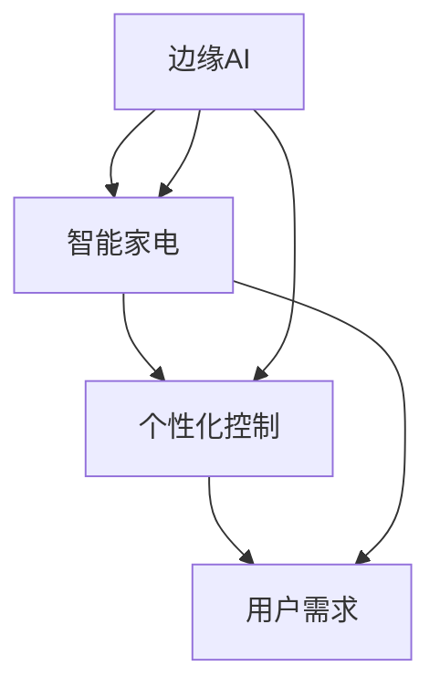

                 


### 背景介绍

随着物联网（IoT）技术的飞速发展，智能家电逐渐渗透到人们的生活中。智能家电，是指通过互联网连接，具备智能感知、自主决策和远程控制等能力的家电产品。这些设备不仅能够提供传统的家电功能，还可以根据用户的行为和环境变化进行自适应的调整。例如，智能空调可以根据室内温度和湿度自动调节，智能灯泡可以根据环境光线自动调整亮度。

然而，随着智能家电数量的增加，用户对个性化体验的需求也在不断上升。个性化控制，是指根据用户的习惯、偏好和历史行为数据，为用户提供定制化的服务和功能。这种个性化体验不仅提升了用户的满意度，也增加了产品的市场竞争力。

边缘AI，是指在靠近数据源的地方执行计算和决策的AI技术。与云计算不同，边缘AI能够在本地设备上进行数据处理，减少数据传输的时间和带宽消耗。这种特点使得边缘AI非常适合应用于智能家电的个性化控制，因为它可以在设备端实时响应用户的需求，提供无缝的用户体验。

### 核心概念与联系

为了更好地理解边缘AI在智能家电中的个性化控制，我们首先需要明确几个核心概念：

1. **边缘AI**：
   - **定义**：边缘AI是指将AI算法部署在靠近数据源的设备上，如智能家电、工业设备等，以实现本地化的智能决策。
   - **原理**：边缘AI通过收集和分析本地数据，实时响应用户的需求，提高系统的响应速度和灵活性。
   - **架构**：边缘AI通常包括数据采集模块、数据处理模块、决策模块和执行模块。

2. **智能家电**：
   - **定义**：智能家电是指通过互联网连接，具备智能感知、自主决策和远程控制等能力的家电产品。
   - **原理**：智能家电通过传感器收集环境数据，结合用户数据，利用AI算法进行决策，从而实现自动化控制和个性化服务。
   - **架构**：智能家电通常包括硬件层、网络通信层、数据处理层和用户界面层。

3. **个性化控制**：
   - **定义**：个性化控制是指根据用户的行为、偏好和历史数据，为用户提供定制化的服务和功能。
   - **原理**：个性化控制通过分析用户数据，理解用户需求，从而提供个性化的设置和推荐。
   - **方法**：个性化控制可以采用机器学习算法、数据挖掘技术和个性化推荐系统来实现。

这四个核心概念之间的联系可以概括为：

- **边缘AI与智能家电的关系**：边缘AI为智能家电提供了本地化的智能决策支持，使得智能家电能够更加灵活地响应用户的需求，实现个性化控制。

- **个性化控制与用户需求的关系**：个性化控制通过分析用户数据，满足用户的个性化需求，提升用户满意度。

- **边缘AI与个性化控制的关系**：边缘AI使得个性化控制更加实时和高效，因为数据处理的延迟更短，系统能够更快地响应用户的行为变化。

为了更直观地展示这些核心概念之间的关系，我们可以使用Mermaid流程图来表示：



### 边缘AI技术详解

边缘AI技术在智能家电中的个性化控制中扮演着关键角色。下面我们将详细介绍边缘AI的相关技术，包括其核心算法、数学模型和实现原理。

#### 边缘AI核心算法

边缘AI的核心算法主要涉及机器学习和深度学习技术。这些算法可以用于数据预处理、特征提取、模型训练和决策生成等环节。以下是一些常用的边缘AI核心算法：

1. **K-近邻算法（K-Nearest Neighbors, KNN）**：
   - **原理**：KNN算法是一种基于实例的学习算法，通过计算新数据点与训练数据点的相似度，找出最近的K个邻居，然后根据邻居的标签进行预测。
   - **伪代码**：
     ```python
     def predict(new_data, k, train_data, labels):
         distances = []
         for data_point in train_data:
             distance = euclidean_distance(new_data, data_point)
             distances.append((distance, data_point))
         distances.sort()
         neighbors = [data_point for distance, data_point in distances[:k]]
         return majority_vote(neighbors, labels)
     ```

2. **决策树（Decision Tree）**：
   - **原理**：决策树通过一系列的决策规则对数据进行分割，每个节点代表一个特征，每个分支代表一个决策结果。
   - **伪代码**：
     ```python
     def build_decision_tree(data, features, labels):
         if all_labels_same(labels):
             return leaf_node(labels)
         best_feature, best_threshold = find_best_split(data, features, labels)
         left_tree = build_decision_tree(filter_data(data, best_feature, best_threshold), features, labels)
         right_tree = build_decision_tree(filter_data(data, best_feature, not_best_threshold), features, labels)
         return decision_node(best_feature, best_threshold, left_tree, right_tree)
     ```

3. **支持向量机（Support Vector Machine, SVM）**：
   - **原理**：SVM通过寻找最优超平面来对数据进行分类，最大化分类间隔。
   - **伪代码**：
     ```python
     def train_svm(data, labels):
         support_vectors, weights = solve_linear_equation(data, labels)
         if not_linearly_separable:
             kernel_function = polynomial_kernel
             weights = solve_nonlinear_equation(data, labels, kernel_function)
         return svm_model(support_vectors, weights)
     ```

4. **深度神经网络（Deep Neural Network, DNN）**：
   - **原理**：DNN通过多层神经元的堆叠，实现对复杂数据的建模和预测。
   - **伪代码**：
     ```python
     def train_dnn(data, labels, layers, learning_rate):
         for epoch in range(num_epochs):
             for data_point in data:
                 loss = forward_pass(data_point, layers)
                 backward_pass(loss, layers, learning_rate)
         return dnn_model(layers)
     ```

#### 数学模型与公式

边缘AI的数学模型和公式是实现智能决策的核心。以下是一些关键公式：

1. **欧几里得距离（Euclidean Distance）**：
   - **公式**：$$d(p, q) = \sqrt{\sum_{i=1}^{n}(p_i - q_i)^2}$$
   - **作用**：计算两个数据点之间的距离。

2. **特征选择（Feature Selection）**：
   - **公式**：$$\text{Score}(f) = \sum_{i=1}^{n}w_i \cdot f_i$$
   - **作用**：评估特征对模型性能的贡献。

3. **支持向量机（SVM）损失函数**：
   - **公式**：$$L(y, f(x)) = \max(0, 1 - y \cdot f(x))$$
   - **作用**：计算预测值与实际值之间的损失。

4. **深度神经网络（DNN）前向传播**：
   - **公式**：$$z_{l+1} = \sigma(W_l \cdot a_l + b_l)$$
   - **作用**：计算神经网络的输出。

#### 实现原理

边缘AI的实现原理主要涉及以下几个方面：

1. **数据采集**：通过传感器和智能设备收集用户和环境数据。

2. **数据处理**：对采集到的数据进行预处理，包括去噪、归一化和特征提取等。

3. **模型训练**：使用机器学习和深度学习算法训练模型。

4. **模型部署**：将训练好的模型部署到边缘设备上，实现本地化决策。

5. **实时反馈**：通过反馈机制不断优化模型，提高个性化控制的准确性。

### 边缘AI在智能家电中的应用

边缘AI在智能家电中的应用主要体现在以下几个方面：

1. **个性化控制**：通过分析用户行为和环境数据，边缘AI可以自动调整智能家电的设置，满足用户的个性化需求。例如，智能空调可以根据用户的温度偏好和室内温度自动调节。

2. **预测性维护**：边缘AI可以预测智能家电的故障风险，提前进行维护，减少故障率和维修成本。

3. **节能优化**：通过分析用电数据和用户习惯，边缘AI可以优化家电的能耗，提高能源利用效率。

4. **安全监控**：边缘AI可以实时监控智能家电的运行状态，检测异常行为，确保用户的安全。

#### 应用案例

以下是一个边缘AI在智能家电中个性化控制的实际案例：

**案例：智能空调的个性化控制**

1. **数据采集**：智能空调通过温度传感器和湿度传感器实时采集室内外温度和湿度数据。

2. **数据处理**：对采集到的数据进行预处理，包括去噪、归一化和特征提取等。

3. **模型训练**：使用K-近邻算法训练个性化控制模型，模型输入为用户历史温度偏好和室内外温度数据，输出为最佳温度设置。

4. **模型部署**：将训练好的模型部署到智能空调上，实现本地化决策。

5. **实时反馈**：用户可以实时调整温度偏好，模型会根据新的偏好数据不断优化，提高个性化控制的准确性。

#### 代码实现与解读

以下是一个简单的边缘AI个性化控制模型的Python代码实现：

```python
# 导入必要的库
import numpy as np
from sklearn.neighbors import KNeighborsRegressor

# 训练数据
X_train = [[25, 40], [22, 45], [23, 35]]  # 用户历史温度偏好和室内外温度
y_train = [24, 23, 22]  # 最佳温度设置

# 创建KNN模型
knn_model = KNeighborsRegressor(n_neighbors=3)

# 训练模型
knn_model.fit(X_train, y_train)

# 预测
X_test = [24, 35]  # 新的温度数据
predicted_temp = knn_model.predict([X_test])

print(f"最佳温度设置为：{predicted_temp[0]}度")
```

在这个案例中，我们使用K-近邻算法训练了一个个性化控制模型，输入为新采集的温度数据，输出为最佳温度设置。用户可以根据这个预测结果调整智能空调的温度设置。

#### 代码应用解读与分析

在这个案例中，我们使用了K-近邻算法进行个性化控制。KNN算法的优点是简单易懂，实现起来相对容易。但是，它的性能受到邻居数量和距离度量方法的影响。在实际应用中，需要根据具体情况调整这些参数，以达到最佳效果。

此外，我们还可以结合其他算法，如决策树或深度神经网络，来提高模型的准确性和泛化能力。例如，使用决策树可以更直观地理解模型内部的决策过程，而使用深度神经网络可以处理更复杂的非线性关系。

总之，边缘AI在智能家电中的个性化控制具有广泛的应用前景。通过合理的设计和实现，边缘AI可以为用户提供更加智能、便捷和个性化的服务。随着技术的不断进步，边缘AI在智能家电中的应用将更加普及，为人们的生活带来更多便利。

