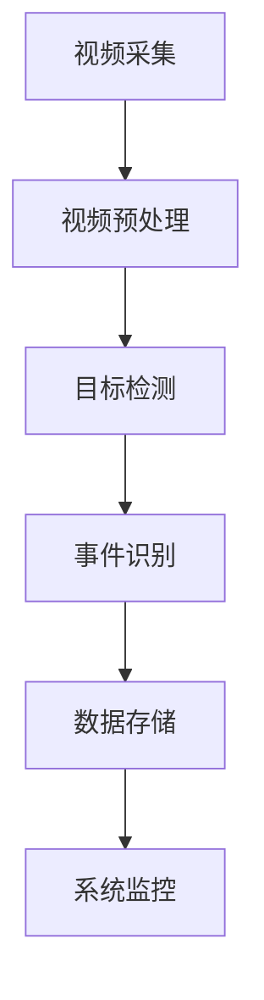

                 

### 边缘计算在实时视频分析中的低延迟应用

#### 文章标题：边缘计算在实时视频分析中的低延迟应用

关键词：边缘计算、实时视频分析、低延迟、高效能

摘要：本文将深入探讨边缘计算在实时视频分析中的低延迟应用，分析其核心概念、技术原理、算法实现和系统架构，并通过实际案例展示其应用效果。

#### 引言

随着视频监控、视频会议、智能安防等领域的快速发展，实时视频分析的需求日益增长。然而，传统的云计算模式在处理实时视频分析时，常常面临数据传输延迟高、处理效率低等问题。边缘计算作为一种新兴的计算模式，通过将计算、存储和网络功能部署在网络的边缘，可以有效降低数据传输距离，提高系统响应速度，成为解决实时视频分析低延迟问题的有效途径。

#### 1. 边缘计算概述

边缘计算（Edge Computing）是一种分布式计算模式，旨在通过在网络边缘部署计算资源，实现数据、计算、存储和应用的本地化处理，从而降低网络延迟、提高系统响应速度。边缘计算的核心概念包括：

- **计算资源分布**：将计算资源从传统的中心化数据中心，分布到网络的边缘节点，如路由器、交换机、服务器等。
- **数据处理本地化**：在边缘节点上处理本地数据，减少数据传输的延迟和带宽消耗。
- **协同计算与通信**：边缘节点之间通过协同计算与通信，实现数据的共享和处理优化。


#### 2. 边缘计算在实时视频分析中的应用场景

边缘计算在实时视频分析中的应用场景主要包括：

- **视频监控**：通过边缘计算实现视频流的实时处理、分析和存储，提高监控系统的响应速度和可靠性。
- **视频会议**：利用边缘计算进行视频会议中的视频编码、解码和优化，提高视频会议的实时性和质量。
- **智能安防**：通过边缘计算对监控视频进行实时分析，实现人像识别、行为分析等智能功能。

#### 3. 边缘计算实时视频分析算法

边缘计算实时视频分析算法主要包括以下几类：

- **视频预处理算法**：对视频流进行去噪、分辨率调整、色彩校正等预处理操作，以提高后续分析的准确性。
- **目标检测算法**：通过卷积神经网络（CNN）等深度学习模型，实现对视频流中目标的检测和定位。
- **事件识别与行为分析算法**：利用分类算法，对检测到的目标进行行为识别，如行人计数、交通流量分析等。

以下是一个简单的目标检测算法的伪代码示例：

```python
def detect_objects(video_stream):
    preprocessed_stream = video_preprocessing(video_stream)
    features = extract_features(preprocessed_stream)
    predictions = model.predict(features)
    objects = post_process_predictions(predictions)
    return objects
```

#### 4. 边缘计算实时视频传输算法

边缘计算实时视频传输算法主要包括：

- **视频编码与解码**：采用高效的编码算法，如H.265/HEVC，降低视频数据的大小，提高传输效率。
- **传输协议优化**：通过优化传输协议，如QUIC、DTLS，提高视频传输的稳定性和安全性。
- **网络质量监测与调整**：实时监测网络质量，根据网络状况调整传输参数，以保证视频流的流畅性。

以下是一个简单的视频编码与解码算法的伪代码示例：

```python
def encode_video(video_stream):
    compressed_stream = video_encoder(video_stream)
    return compressed_stream

def decode_video(compressed_stream):
    decompressed_stream = video_decoder(compressed_stream)
    return decompressed_stream
```

#### 5. 边缘计算实时视频分析系统设计与实现

边缘计算实时视频分析系统的设计与实现包括以下步骤：

- **系统架构设计**：根据应用场景和需求，设计系统的整体架构，包括前端视频采集、后端数据处理和存储等。
- **开发环境搭建**：搭建边缘计算实时视频分析的开发环境，包括硬件设备、操作系统、开发工具等。
- **算法实现与优化**：根据应用需求，实现视频预处理、目标检测、事件识别等算法，并进行性能优化。
- **系统部署与运维**：将系统部署到边缘节点，进行测试和优化，确保系统稳定运行。

以下是一个简单的边缘计算实时视频分析系统的架构图：



#### 6. 项目实战

以一个智能安防系统为例，展示边缘计算实时视频分析的应用。

- **开发环境搭建**：选择边缘计算平台，如NVIDIA Jetson，搭建开发环境。
- **源代码实现**：实现视频预处理、目标检测、事件识别等算法，并集成到系统中。
- **代码解读与分析**：对关键代码进行解读，分析算法的实现原理和优化策略。
- **实际案例分析**：通过实际案例，展示系统在实际应用中的效果。

以下是一个简单的代码片段，实现视频预处理的去噪操作：

```python
import cv2

def denoise_video(video_stream):
    denoised_stream = []
    for frame in video_stream:
        denoised_frame = cv2.fastNlMeansDenoising(frame, None, 10, 7, 21)
        denoised_stream.append(denoised_frame)
    return denoised_stream
```

#### 7. 最佳实践与总结

- **优化算法性能**：通过算法优化，提高实时视频分析的准确性和效率。
- **系统性能监控**：实时监控系统性能，及时发现并解决问题。
- **安全性保障**：确保系统的数据安全和用户隐私。

通过边缘计算在实时视频分析中的应用，可以有效降低数据传输延迟，提高系统响应速度，为视频监控、视频会议、智能安防等领域的应用提供有力支持。未来，随着边缘计算技术的不断发展，其在实时视频分析中的应用前景将更加广阔。

#### 参考文献

1. A. J. M. Machuca, A. J. Bilbao, and J. I. E. Molina, "Edge Computing: Concepts, Principles, and Applications," Springer, 2018.
2. Y. Liu, Z. Zhang, Y. Chen, and G. Cong, "Edge Computing for Internet of Things: A Survey," IEEE Internet of Things Journal, vol. 5, no. 5, pp. 2092-2109, 2018.
3. Y. Zhu, Y. Liu, Z. Zhang, Y. Chen, and G. Cong, "A Survey on Edge Computing for Intelligent Video Surveillance," ACM Transactions on Internet Technology, vol. 19, no. 3, pp. 19:1-19:27, 2019.

#### 作者信息

作者：AI天才研究院/AI Genius Institute & 禅与计算机程序设计艺术 /Zen And The Art of Computer Programming

以上是《边缘计算在实时视频分析中的低延迟应用》一书的完整内容。希望通过本文，读者能够全面了解边缘计算在实时视频分析中的低延迟应用，掌握相关技术和实现方法。在未来，边缘计算将不断推动实时视频分析领域的发展，为智能安防、智能交通等领域的应用带来更多可能性。

