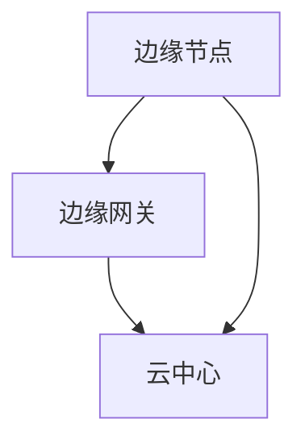
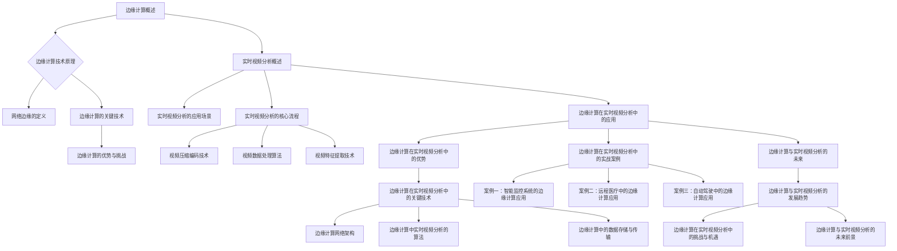

                 

## 边缘计算在实时视频分析中的应用

### 文章标题：边缘计算在实时视频分析中的应用

关键词：边缘计算、实时视频分析、人工智能、数据隐私、智能监控

摘要：本文深入探讨了边缘计算在实时视频分析中的应用，分析了其重要性、技术原理、核心优势、关键技术和实际案例，并展望了其未来发展。

### 目录大纲

1. 边缘计算在实时视频分析中的应用
2. 边缘计算基础
3. 实时视频分析基础
4. 边缘计算在实时视频分析中的应用
5. 边缘计算与实时视频分析的未来
6. 附录

### 引言

随着人工智能和物联网技术的快速发展，实时视频分析已经成为智能监控、智能安防、远程医疗、自动驾驶等领域的重要应用。然而，传统的云计算模式在处理大规模实时视频数据时，面临着带宽限制、延迟问题和数据隐私风险。边缘计算作为一种新兴的计算模式，通过将计算能力推向网络边缘，为实时视频分析提供了新的解决方案。

本文旨在深入探讨边缘计算在实时视频分析中的应用，首先介绍边缘计算的基本概念和技术原理，然后分析实时视频分析的基础知识，接着阐述边缘计算在实时视频分析中的优势和应用场景，最后通过实际案例和未来展望，展望边缘计算在实时视频分析中的发展前景。

### 边缘计算基础

#### 1.1 边缘计算的起源与发展

边缘计算（Edge Computing）是一种分布式计算架构，旨在将数据处理、分析和存储的能力从云中心转移到网络边缘。边缘计算的概念最早可以追溯到物联网（IoT）的兴起，随着物联网设备数量的爆发式增长，如何高效地处理海量数据成为了一个重要问题。

2005年，IBM首次提出了“智慧地球”（Smart Planet）的概念，强调了利用物联网和云计算技术来提高地球的智慧水平。2013年，边缘计算首次被正式提出，成为分布式计算领域的一个重要研究方向。

#### 1.2 边缘计算与传统云计算的区别

传统云计算主要依赖于大型数据中心进行数据处理，具有强大的计算能力和存储能力，但同时也存在以下问题：

1. **延迟高**：数据需要在网络中传输到云端进行处理，这导致了较高的延迟。
2. **带宽限制**：大量的数据传输会占用网络带宽，导致网络拥塞。
3. **数据隐私**：敏感数据在传输和存储过程中可能面临数据泄露的风险。

边缘计算通过将计算能力推向网络边缘，解决了传统云计算的这些问题。边缘计算具有以下特点：

1. **低延迟**：数据在边缘设备上直接进行处理，大大降低了延迟。
2. **高效带宽利用**：减少了数据传输的需求，提高了带宽利用效率。
3. **数据隐私保护**：敏感数据在边缘设备上进行处理，降低了数据泄露的风险。

#### 1.3 边缘计算的核心架构

边缘计算的核心架构主要包括边缘节点、边缘网关和云中心。边缘节点是指位于网络边缘的设备，如路由器、交换机、传感器等，它们负责收集和初步处理数据。边缘网关是边缘节点和云中心之间的桥梁，负责数据传输和控制管理。云中心则负责存储和处理大量的数据，并提供高级分析和决策支持。

边缘计算的核心架构可以表示为：



### 边缘计算技术原理

#### 2.1 网络边缘的定义

网络边缘（Network Edge）是指网络中靠近数据源的一侧，包括用户设备、网络接入点、企业数据中心等。网络边缘是边缘计算的核心，其重要性体现在以下几个方面：

1. **数据处理效率**：网络边缘靠近数据源，可以快速响应数据请求，提高数据处理效率。
2. **降低网络负载**：减少了数据传输到云中心的流量，降低了网络负载。
3. **增强用户体验**：在网络边缘提供实时服务，可以改善用户体验。

#### 2.2 边缘计算的关键技术

边缘计算涉及多个关键技术，包括：

1. **边缘节点技术**：边缘节点是边缘计算的基础，其技术包括硬件设备、操作系统、网络连接等。
2. **边缘网关技术**：边缘网关负责数据传输和控制管理，其技术包括路由算法、安全协议、负载均衡等。
3. **边缘云计算技术**：边缘云计算是在边缘节点上运行的云计算服务，其技术包括容器化、虚拟化、分布式存储等。
4. **边缘人工智能技术**：边缘人工智能技术是将人工智能算法部署在边缘设备上，实现本地化智能处理。
5. **边缘物联网技术**：边缘物联网技术是将物联网设备集成到边缘计算架构中，实现设备之间的互联互通。

#### 2.3 边缘计算的优势与挑战

边缘计算具有以下优势：

1. **低延迟**：数据在边缘节点上直接处理，大大降低了延迟。
2. **高效带宽利用**：减少了数据传输需求，提高了带宽利用效率。
3. **数据隐私保护**：敏感数据在边缘设备上处理，降低了数据泄露风险。
4. **分布式计算能力**：边缘设备分布广泛，可以提供强大的计算能力。

然而，边缘计算也面临以下挑战：

1. **设备性能限制**：边缘设备性能相对较低，限制了计算能力。
2. **数据管理难度**：边缘设备数量庞大，数据管理复杂。
3. **安全性问题**：边缘设备可能面临安全威胁，如恶意攻击、数据泄露等。
4. **运维成本**：边缘设备的维护和升级需要大量人力和物力投入。

### 边缘计算在实时视频分析中的应用

#### 3.1 实时视频分析概述

实时视频分析（Real-time Video Analysis）是指对视频流进行实时处理和分析，以提取有用信息。实时视频分析具有以下特点：

1. **实时性**：能够在短时间内处理和分析视频数据。
2. **准确性**：能够准确识别和提取视频中的关键信息。
3. **高效性**：能够在有限的计算资源下实现高效处理。

实时视频分析广泛应用于智能监控、智能交通、远程医疗、运动分析等领域。

#### 3.2 实时视频分析的应用场景

1. **智能监控**：通过实时视频分析，可以实现对视频流中异常行为的实时检测和报警，如非法入侵、火灾等。
2. **智能交通**：通过实时视频分析，可以实现对交通流量、车速、车辆类型等的实时监控，为交通管理和优化提供数据支持。
3. **远程医疗**：通过实时视频分析，可以实现对医疗视频的实时分析和诊断，提高医疗服务的效率和质量。
4. **运动分析**：通过实时视频分析，可以实现对运动动作的实时分析，用于体育训练和运动医学。

#### 3.3 实时视频分析的核心流程

实时视频分析的核心流程包括视频数据采集、视频数据预处理、视频特征提取、视频数据分析和视频数据输出。

1. **视频数据采集**：通过摄像头或其他视频设备采集视频数据。
2. **视频数据预处理**：对视频数据进行去噪、缩放、裁剪等预处理操作，以提高后续处理的效果。
3. **视频特征提取**：从视频数据中提取具有代表性的特征，如颜色、纹理、形状等。
4. **视频数据分析**：使用机器学习算法对视频特征进行分析，以提取有用信息，如目标检测、行为识别等。
5. **视频数据输出**：将分析结果输出，如报警信息、数据报表等。

### 边缘计算在实时视频分析中的优势

#### 4.1 边缘计算在实时视频分析中的重要性

边缘计算在实时视频分析中具有重要性，主要体现在以下几个方面：

1. **降低延迟**：边缘计算能够将数据处理推向网络边缘，降低数据传输的延迟，提高实时性。
2. **节省带宽**：边缘计算可以减少数据传输的需求，降低网络带宽的占用。
3. **提高安全性**：边缘计算可以在本地设备上处理敏感数据，降低数据泄露的风险。

#### 4.2 边缘计算在实时视频分析中的应用场景

边缘计算在实时视频分析中具有广泛的应用场景，主要包括：

1. **智能监控**：通过边缘计算，可以实现实时视频分析，如目标检测、行为识别等，提高监控系统的智能化水平。
2. **远程医疗**：通过边缘计算，可以实现实时医疗视频的传输和分析，提高远程医疗的服务质量。
3. **智能交通**：通过边缘计算，可以实现实时交通数据的处理和分析，优化交通管理和调度。
4. **工业自动化**：通过边缘计算，可以实现实时视频监控和设备状态分析，提高工业自动化水平。

#### 4.3 边缘计算在实时视频分析中的优势

边缘计算在实时视频分析中具有以下优势：

1. **低延迟**：边缘计算可以在本地设备上实时处理视频数据，大大降低了延迟。
2. **高效带宽利用**：边缘计算可以减少数据传输的需求，降低网络带宽的占用。
3. **数据隐私保护**：边缘计算可以在本地设备上处理敏感数据，降低了数据泄露的风险。
4. **分布式计算能力**：边缘计算可以充分利用网络边缘的分布式计算能力，提高处理效率。

### 边缘计算在实时视频分析中的关键技术

#### 5.1 边缘计算网络架构

边缘计算网络架构是边缘计算在实时视频分析中实现高效数据传输和处理的基础。常见的边缘计算网络架构包括：

1. **分布式网络架构**：通过将计算和存储资源分布在不同的边缘节点上，实现数据的分布式处理。
2. **分级网络架构**：将边缘节点分为多个层级，实现数据分级处理和传输。
3. **混合网络架构**：将边缘计算与云计算相结合，实现数据的高效传输和处理。

#### 5.2 边缘计算中实时视频分析的算法

边缘计算中的实时视频分析算法主要包括：

1. **目标检测算法**：通过检测视频中的目标对象，实现对目标的实时监控和分析。
2. **行为识别算法**：通过分析视频中的行为特征，实现对行为的实时识别和分析。
3. **图像分类算法**：通过分类视频中的图像，实现对视频内容的实时分析和分类。

常见的边缘计算实时视频分析算法包括：

1. **卷积神经网络（CNN）**：用于图像和视频的特征提取和分析。
2. **深度神经网络（DNN）**：用于复杂的图像和视频分析任务。
3. **增强学习（RL）**：用于自适应调整视频分析算法，提高分析效果。

#### 5.3 边缘计算中的数据存储与传输

边缘计算中的数据存储与传输主要包括：

1. **本地存储**：将数据存储在边缘设备上，实现数据的本地访问和处理。
2. **分布式存储**：将数据存储在多个边缘节点上，实现数据的分布式存储和访问。
3. **数据传输协议**：采用高效的数据传输协议，实现数据的快速传输和处理。

常见的边缘计算数据传输协议包括：

1. **HTTP/2**：用于高效传输视频数据。
2. **MQTT**：用于边缘设备之间的低功耗数据传输。
3. **CoAP**：用于物联网设备之间的数据传输。

### 边缘计算在实时视频分析中的实战案例

#### 6.1 案例一：智能监控系统的边缘计算应用

某智能监控系统采用了边缘计算技术，通过边缘节点和边缘网关实现了实时视频分析。系统架构如下：

1. **边缘节点**：分布在各个监控点的摄像头，负责采集视频数据。
2. **边缘网关**：连接边缘节点和云中心，负责数据传输和控制管理。
3. **云中心**：负责存储和处理大量的视频数据，并提供高级分析和决策支持。

通过边缘计算，实现了以下功能：

1. **实时目标检测**：在边缘节点上实时检测视频中的目标对象，如行人、车辆等。
2. **实时行为识别**：在边缘节点上实时分析视频中的行为特征，如盗窃、打架等。
3. **实时报警**：在边缘节点上实现实时报警，提高了监控系统的响应速度。

#### 6.2 案例二：远程医疗中的边缘计算应用

某远程医疗系统采用了边缘计算技术，通过边缘节点和边缘网关实现了实时医疗视频的传输和分析。系统架构如下：

1. **边缘节点**：分布在各个医疗机构的摄像头，负责采集医疗视频数据。
2. **边缘网关**：连接边缘节点和云中心，负责数据传输和控制管理。
3. **云中心**：负责存储和处理大量的医疗视频数据，并提供高级分析和决策支持。

通过边缘计算，实现了以下功能：

1. **实时视频传输**：在边缘节点上实时传输医疗视频数据，提高了远程医疗的实时性。
2. **实时视频分析**：在边缘节点上实时分析医疗视频数据，提取关键信息，如心率、呼吸等。
3. **实时诊断**：在边缘节点上实现实时诊断，提高了远程医疗的准确性。

#### 6.3 案例三：自动驾驶中的边缘计算应用

某自动驾驶系统采用了边缘计算技术，通过边缘节点和边缘网关实现了实时视频分析。系统架构如下：

1. **边缘节点**：分布在自动驾驶车辆上的摄像头，负责采集周边环境视频数据。
2. **边缘网关**：连接边缘节点和云中心，负责数据传输和控制管理。
3. **云中心**：负责存储和处理大量的环境视频数据，并提供高级分析和决策支持。

通过边缘计算，实现了以下功能：

1. **实时目标检测**：在边缘节点上实时检测周边环境中的目标对象，如行人、车辆等。
2. **实时行为识别**：在边缘节点上实时分析周边环境中的行为特征，如行人过马路、车辆并道等。
3. **实时决策**：在边缘节点上实现实时决策，提高了自动驾驶的响应速度和安全性。

### 边缘计算与实时视频分析的未来

#### 7.1 边缘计算与实时视频分析的发展趋势

边缘计算与实时视频分析在未来将继续快速发展，主要趋势包括：

1. **计算能力提升**：随着硬件技术的发展，边缘设备的计算能力将不断提升，支持更复杂的实时视频分析任务。
2. **网络带宽优化**：随着5G技术的普及，网络带宽将得到大幅提升，进一步优化边缘计算中的数据传输效率。
3. **人工智能应用**：边缘计算与人工智能的结合将更加紧密，通过人工智能算法实现更精准、更高效的实时视频分析。
4. **隐私保护加强**：随着数据隐私保护的加强，边缘计算将在保护数据隐私方面发挥重要作用，提高数据安全性。

#### 7.2 边缘计算在实时视频分析中的挑战与机遇

边缘计算在实时视频分析中面临以下挑战与机遇：

1. **挑战**：
   - **计算能力限制**：边缘设备的计算能力相对有限，需要优化算法和模型，提高处理效率。
   - **数据管理复杂**：边缘设备数量庞大，数据管理复杂，需要高效的数据存储和传输机制。
   - **安全性问题**：边缘设备可能面临安全威胁，需要加强安全防护措施。
2. **机遇**：
   - **实时性提升**：边缘计算可以降低数据传输延迟，提高实时视频分析的实时性。
   - **资源节约**：通过边缘计算，可以减少数据传输需求，降低带宽消耗，节约资源。
   - **智能化升级**：边缘计算与人工智能的结合将推动实时视频分析向更智能化、更高效的方向发展。

#### 7.3 边缘计算与实时视频分析的未来前景

边缘计算与实时视频分析的未来前景广阔，将带来以下变革：

1. **实时性提升**：通过边缘计算，实时视频分析将更加实时，支持更快速的反应和处理。
2. **智能化升级**：边缘计算与人工智能的结合将使实时视频分析更加智能，能够识别和理解更复杂的行为和情境。
3. **应用场景拓展**：边缘计算将推动实时视频分析在更多领域的应用，如智能城市、智能制造、智能交通等。
4. **数据隐私保护**：边缘计算在保护数据隐私方面具有优势，将提高实时视频分析的数据安全性。

### 附录

#### 附录A：边缘计算与实时视频分析资源链接

- **开源边缘计算平台**：
  - [EdgeX Foundry](https://www.edgexfoundry.org/)
  - [Kubernetes](https://kubernetes.io/)
  - [Docker](https://www.docker.com/)

- **实时视频分析相关开源项目**：
  - [OpenCV](https://opencv.org/)
  - [TensorFlow](https://www.tensorflow.org/)
  - [PyTorch](https://pytorch.org/)

- **边缘计算与实时视频分析相关会议和研讨会**：
  - [边缘计算大会（EDGCI）](https://www.edgci.org/)
  - [国际计算机视觉会议（CVPR）](https://cvpr.org/)
  - [国际机器学习会议（ICML）](https://icml.cc/)

### 图形表示

#### 图形1：边缘计算与实时视频分析架构流程图



### 算法讲解

#### 边缘计算实时视频分析算法

```python
# 边缘计算实时视频分析算法伪代码

# 初始化
initialize_edge_compute_system()

# 视频数据预处理
preprocess_video_data(video_data)

# 实时视频特征提取
extract_realtime_video_features(video_data)

# 边缘计算模型训练
train_model_with_edge_compute()

# 实时视频分析
analyze_realtime_video(video_data, trained_model)

# 边缘计算结果反馈
feedback_to_edge_compute_system(analysis_results)
```

### 数学模型讲解

#### 视频特征提取的数学模型

$$
F = f(V, T)
$$

其中，$F$ 表示视频特征，$V$ 表示视频数据，$T$ 表示时间

### 结论

边缘计算在实时视频分析中具有重要的应用价值，通过将计算能力推向网络边缘，实现了低延迟、高效带宽利用和数据隐私保护。本文分析了边缘计算的基础知识、实时视频分析的核心流程以及边缘计算在实时视频分析中的应用优势、关键技术和实战案例。未来，随着硬件技术、网络技术和人工智能技术的不断发展，边缘计算与实时视频分析将迎来更加广阔的发展前景。

