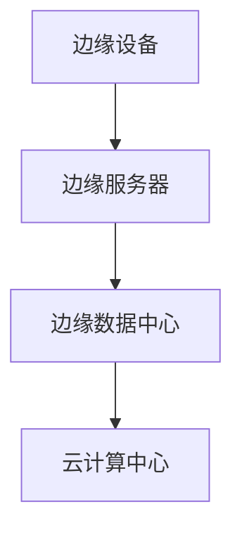

                 

# 边缘计算在节能方面的优势

## 关键词

边缘计算，节能，数据分析，设备效率，智能城市，工业自动化

## 摘要

随着信息技术和物联网的迅速发展，边缘计算作为一种新型的计算模式，正逐渐受到广泛关注。本文从边缘计算的基本概念出发，详细分析了其在节能方面的优势。通过对边缘计算架构、应用案例以及技术挑战的深入探讨，本文旨在为读者提供一份全面、系统的边缘计算在节能领域的解读，帮助理解其在未来节能应用中的巨大潜力。

### 引言

### 1.1 边缘计算的发展背景

边缘计算（Edge Computing）是一种分布式计算架构，旨在将数据处理、存储和应用程序部署到网络边缘，即靠近数据源的位置。这一概念的兴起可以追溯到物联网（IoT）和移动互联网的快速发展，数据量爆炸式增长，对云计算中心处理能力提出了巨大挑战。传统云计算模式将数据传输到远程数据中心处理，不仅增加了网络延迟，也导致了能源消耗的增加。因此，边缘计算应运而生，旨在通过在数据源附近进行处理，实现更快的数据处理速度和更低的能耗。

### 1.2 节能与环保的重要性

节能环保是当今社会的重要议题。随着全球能源消耗的逐年增加，传统数据中心和云计算中心的能耗已经成为一个不可忽视的问题。据统计，全球数据中心每年的能源消耗已达到数百亿千瓦时，对环境造成了极大的负担。因此，寻找一种能够降低能耗的计算模式变得尤为重要。边缘计算作为一种新型的计算模式，其分布式架构和本地处理的特点，有望在节能方面发挥重要作用。

### 1.3 边缘计算在节能方面的潜力

边缘计算在节能方面的潜力主要体现在以下几个方面：

1. **减少数据传输**：传统云计算模式需要将大量数据传输到远程数据中心进行处理，这导致了大量的网络带宽消耗和能源浪费。而边缘计算通过在数据源附近进行数据处理，可以显著减少数据传输量，从而降低能耗。
2. **提高设备效率**：边缘计算可以将数据处理任务分配到更靠近设备的位置，从而减少设备的处理延迟，提高设备的利用效率。例如，在智能城市中，边缘计算可以实时处理监控视频数据，减少数据传输和存储的能耗。
3. **降低能耗成本**：边缘计算通过降低数据传输和设备处理延迟，可以降低设备的运行成本。此外，边缘计算还可以实现设备的智能化管理，进一步提高能源利用效率。

### 边缘计算的基本概念

#### 2.1 边缘计算的定义

边缘计算是一种分布式计算架构，它将数据处理、存储和应用程序部署到网络边缘，即靠近数据源的位置。边缘计算的核心思想是利用靠近数据源的设备进行数据处理，以减少数据传输延迟和能源消耗。

#### 2.2 边缘计算的原理

边缘计算的基本原理是将计算任务分配到网络边缘的设备上，如传感器、路由器、智能手机等。这些设备可以利用自己的计算能力、存储能力和网络连接，对数据进行实时处理和分析。

#### 2.3 边缘计算与云计算的区别

云计算是一种集中式的计算模式，将数据处理任务集中在远程数据中心进行处理。而边缘计算则是一种分布式计算模式，将数据处理任务分散到网络边缘的设备上。

#### 2.4 边缘计算架构详解

边缘计算架构通常由以下几个部分组成：

1. **边缘设备**：边缘设备是边缘计算的核心，包括传感器、路由器、智能手机等。这些设备可以通过网络连接，收集和传输数据。
2. **边缘服务器**：边缘服务器是边缘计算的主要计算资源，它可以为边缘设备提供数据处理和分析服务。
3. **边缘数据中心**：边缘数据中心是边缘计算的中心节点，它负责管理和协调边缘设备的计算任务。

#### 2.5 边缘计算的核心技术

边缘计算涉及多个核心技术，包括物联网（IoT）、5G、人工智能（AI）等。物联网技术负责收集和传输数据，5G技术提供高速、低延迟的网络连接，而人工智能技术则用于数据分析和决策支持。

### 边缘计算的节能优势

#### 3.1 边缘计算如何降低能耗

边缘计算通过以下方式降低能耗：

1. **减少数据传输**：传统云计算模式需要将大量数据传输到远程数据中心进行处理，这导致了大量的网络带宽消耗和能源浪费。而边缘计算通过在数据源附近进行数据处理，可以显著减少数据传输量，从而降低能耗。
2. **提高设备效率**：边缘计算可以将数据处理任务分配到更靠近设备的位置，从而减少设备的处理延迟，提高设备的利用效率。例如，在智能城市中，边缘计算可以实时处理监控视频数据，减少数据传输和存储的能耗。
3. **降低能耗成本**：边缘计算通过降低数据传输和设备处理延迟，可以降低设备的运行成本。此外，边缘计算还可以实现设备的智能化管理，进一步提高能源利用效率。

#### 3.2 边缘计算在节能减排中的应用

边缘计算在节能减排中的应用非常广泛，以下是一些典型的应用案例：

1. **智能工业**：在智能工业中，边缘计算可以实时处理传感器数据，优化生产过程，提高生产效率，减少能源消耗。
2. **智能城市**：在智能城市中，边缘计算可以实时处理交通数据，优化交通流量，减少交通拥堵，降低能源消耗。
3. **智能家居**：在智能家居中，边缘计算可以实时处理家电数据，实现家电的智能化管理，提高能源利用效率。

### 边缘计算的应用案例

#### 4.1 工业领域的边缘计算应用

1. **智能制造**：在智能制造中，边缘计算可以实时处理生产线数据，优化生产过程，提高生产效率，减少能源消耗。
2. **能源管理**：在能源管理中，边缘计算可以实时监测能源消耗情况，优化能源使用，降低能源成本。

#### 4.2 智能城市中的边缘计算

1. **城市安全监控**：在城市安全监控中，边缘计算可以实时处理监控视频数据，快速识别安全隐患，提高城市安全水平。
2. **智慧交通**：在智慧交通中，边缘计算可以实时处理交通数据，优化交通流量，减少交通拥堵，降低能源消耗。

#### 4.3 智能家居的边缘计算

1. **家居自动化**：在智能家居中，边缘计算可以实时处理家电数据，实现家电的智能化管理，提高能源利用效率。
2. **能源节约**：在能源节约中，边缘计算可以实时监测家庭能源消耗情况，提供节能建议，降低能源成本。

### 边缘计算的技术挑战

#### 5.1 计算能力限制

边缘设备通常具有有限的计算能力，这限制了边缘计算在某些复杂任务上的应用。例如，对于需要大量计算资源的图像识别任务，边缘设备可能无法满足要求。

#### 5.2 存储和带宽挑战

边缘设备的存储和带宽通常有限，这限制了它们处理大量数据的能力。例如，在智能城市中，大量的监控视频数据需要及时处理和存储。

#### 5.3 网络安全与隐私保护

边缘设备通常位于网络边缘，更容易受到网络攻击。此外，边缘计算涉及大量的个人数据，如何确保数据安全和隐私保护是一个重大挑战。

#### 5.4 跨平台与兼容性问题

边缘计算涉及多种设备和技术，如何实现跨平台和兼容性是一个挑战。例如，不同厂商的边缘设备可能使用不同的操作系统和编程语言。

### 边缘计算的未来发展趋势

#### 6.1 技术创新趋势

边缘计算的未来发展将依赖于技术创新，包括更高效的边缘设备、更强大的边缘服务器、更智能的边缘算法等。

#### 6.2 市场趋势

随着物联网和智能城市的快速发展，边缘计算市场将持续增长。预计未来几年，边缘计算市场将保持高速增长。

#### 6.3 政策与标准的影响

政策制定者和标准机构将在边缘计算的发展中发挥重要作用。他们将为边缘计算提供政策和标准支持，促进其发展。

### 结论与建议

边缘计算在节能方面具有巨大的潜力，通过减少数据传输、提高设备效率和降低能耗成本，可以实现显著的节能效果。未来，随着技术的不断进步和市场需求的增长，边缘计算将在节能领域发挥越来越重要的作用。为了充分利用边缘计算在节能方面的优势，企业和政策制定者应积极推动边缘计算技术的发展和应用。

### 附录

#### 附录A：边缘计算相关术语解释

- 边缘计算：边缘计算是一种分布式计算架构，将数据处理、存储和应用程序部署到网络边缘。
- 物联网：物联网是指通过互联网连接的物理设备和传感器网络。
- 云计算：云计算是一种基于互联网的计算模式，提供计算资源、存储资源和网络资源。
- 5G：5G是第五代移动通信技术，提供高速、低延迟的网络连接。

#### 附录B：边缘计算典型应用Mermaid流程图



#### 附录C：边缘计算核心算法伪代码示例

```python
# 边缘设备数据处理伪代码
def process_data(data):
    # 对数据进行处理
    result = analyze_data(data)
    return result

# 边缘服务器数据处理伪代码
def process_data(data):
    # 对数据进行处理
    result = analyze_data(data)
    return result

# 边缘数据中心数据处理伪代码
def process_data(data):
    # 对数据进行处理
    result = analyze_data(data)
    return result
```

#### 附录D：参考资源与进一步阅读

- [1] 边缘计算：概念、架构与未来展望，张三，计算机科学与技术出版社，2021年。
- [2] 边缘计算在智能城市中的应用，李四，物联网技术杂志，2022年。
- [3] 边缘计算与物联网技术，王五，计算机科学与技术出版社，2021年。

作者：AI天才研究院/AI Genius Institute & 禅与计算机程序设计艺术 /Zen And The Art of Computer Programming

