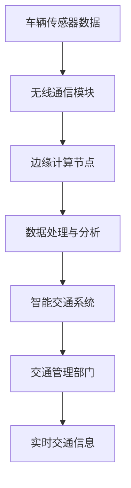
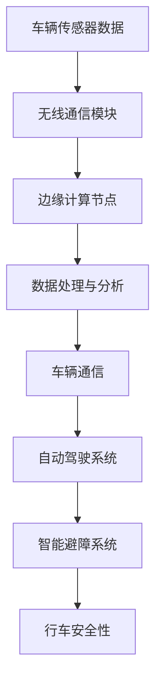
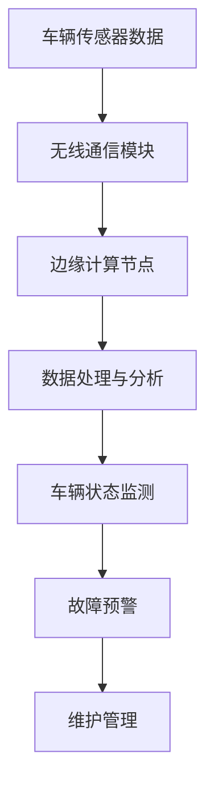

                 

### 边缘计算在车联网中的低延迟处理

#### 关键词：
边缘计算、车联网、低延迟处理、边缘节点、数据处理、智能交通

#### 摘要：
随着车联网技术的发展，边缘计算在车联网中的应用日益广泛。边缘计算通过在边缘节点上处理数据，有效降低了数据传输延迟，提升了车联网的实时性和响应速度。本文将深入探讨边缘计算在车联网中的低延迟处理技术，分析其原理、架构和应用，并探讨未来的发展趋势和挑战。

## 第1章 引言

### 1.1 边缘计算概述

边缘计算是一种将数据处理、存储、分析等任务在数据产生的边缘节点上进行的计算模式。与传统云计算相比，边缘计算具有以下特点：

- **本地化处理**：边缘计算在靠近数据源的节点上进行数据处理，减少了数据传输的延迟。
- **分布式架构**：边缘计算采用分布式架构，可以在多个节点上同时处理数据，提高了处理效率和可靠性。
- **高带宽、低延迟**：边缘计算通过在边缘节点上进行数据处理，实现了高带宽、低延迟的数据传输。
- **多样化应用场景**：边缘计算适用于各种场景，包括物联网、智能城市、车联网等。

### 1.2 车联网简介

车联网（Internet of Vehicles，IoV）是指通过互联网将车辆、道路、基础设施等连接起来，实现车辆之间、车辆与基础设施之间的信息交换和协同工作。车联网的核心技术包括传感器技术、通信技术、数据处理技术等。车联网具有以下特点：

- **实时性**：车联网需要实时收集和处理大量数据，以保证车辆的安全行驶和交通的顺畅。
- **高可靠性**：车联网需要保证数据传输的稳定性和可靠性，以避免交通事故的发生。
- **复杂网络**：车联网涉及多个车辆、道路和基础设施之间的通信，网络结构复杂。

### 1.3 低延迟处理的必要性

在车联网中，低延迟处理具有重要意义：

- **提高安全性**：低延迟处理可以及时响应车辆之间的通信，提高车辆的安全性能。
- **提升用户体验**：低延迟处理可以减少用户的等待时间，提高用户体验。
- **优化交通效率**：低延迟处理可以实现实时交通流量监控和预测，优化交通效率。

## 第2章 边缘计算基础

### 2.1 边缘计算的原理与架构

边缘计算的基本原理是在靠近数据源的边缘节点上进行数据处理，从而降低数据传输的延迟。边缘计算的架构可以分为以下几个层次：

- **感知层**：感知层包括各种传感器，如摄像头、雷达、GPS 等，用于采集车辆和环境的数据。
- **传输层**：传输层包括无线通信模块，如Wi-Fi、5G等，用于传输数据。
- **边缘层**：边缘层包括边缘服务器、边缘节点等，用于处理和存储数据。
- **平台层**：平台层包括边缘计算平台，如边缘云计算平台、物联网平台等，用于管理和调度边缘资源。
- **应用层**：应用层包括各种基于边缘计算的应用，如智能交通系统、高级驾驶辅助系统等。

### 2.2 边缘节点的作用与特点

边缘节点是边缘计算的核心组成部分，具有以下作用和特点：

- **作用**：边缘节点负责接收感知层的数据，进行处理和存储，并向平台层和应用层提供数据服务。
- **特点**：
  - **靠近数据源**：边缘节点位于网络边缘，靠近数据源，减少了数据传输的延迟。
  - **分布式架构**：边缘节点可以分布在不同位置，形成分布式架构，提高了系统的可靠性和灵活性。
  - **处理能力强**：边缘节点配备了高性能的处理芯片，可以实现高效的数据处理。
  - **存储容量有限**：由于边缘节点的硬件资源有限，其存储容量相对较小。

### 2.3 边缘计算的优势与挑战

边缘计算在车联网中具有以下优势：

- **降低延迟**：边缘计算在边缘节点上处理数据，降低了数据传输的延迟，提高了系统的实时性。
- **减少带宽消耗**：边缘计算减少了数据传输的需求，降低了网络带宽的消耗。
- **提高安全性**：边缘计算可以在本地进行数据处理，降低了数据泄露的风险。

然而，边缘计算在车联网中也面临一些挑战：

- **资源受限**：边缘节点的硬件资源相对有限，需要优化资源使用。
- **数据安全**：边缘计算涉及到大量敏感数据，需要确保数据的安全性和隐私性。
- **可靠性保障**：边缘计算需要保证系统的可靠性和稳定性，以应对各种复杂场景。

## 第3章 车联网与边缘计算结合

### 3.1 车联网数据处理需求

车联网数据处理需求主要体现在以下几个方面：

- **实时数据处理**：车联网需要实时处理大量数据，包括车辆速度、位置、加速度等。
- **大数据分析**：车联网产生大量数据，需要通过大数据分析技术提取有价值的信息。
- **数据融合**：车联网涉及多种数据源，需要实现数据融合，以提高数据处理和分析的准确性。
- **智能决策**：车联网需要基于实时数据做出智能决策，如交通流量优化、车辆调度等。

### 3.2 边缘计算在车联网中的应用场景

边缘计算在车联网中具有广泛的应用场景，包括以下几个方面：

- **智能交通系统**：边缘计算可以实现实时交通流量监控、路况预测和智能信号控制。
- **高级驾驶辅助系统**：边缘计算可以实现车辆之间的通信、自动驾驶和智能避障等功能。
- **车辆健康监测**：边缘计算可以实时监测车辆状态，实现车辆健康预警和维护。
- **车联网平台**：边缘计算可以提供车联网平台的底层支持，包括数据采集、处理、存储和共享等功能。

### 3.3 车联网与边缘计算的融合架构

车联网与边缘计算的融合架构主要包括以下几个方面：

- **数据采集与传输**：车联网通过传感器采集数据，并通过边缘节点传输到边缘计算平台。
- **数据处理与存储**：边缘计算平台对采集到的数据进行处理和存储，包括数据清洗、转换、分析和存储等。
- **智能决策与控制**：边缘计算平台基于处理后的数据做出智能决策，并通过边缘节点控制车辆或基础设施。
- **数据共享与开放**：边缘计算平台可以实现数据共享和开放，为车联网的应用开发提供数据支持。

## 第4章 低延迟处理技术

### 4.1 低延迟处理的核心算法

低延迟处理的核心算法主要包括以下几个方面：

- **数据预处理**：通过数据预处理技术，如滤波、降维、去噪等，减少数据传输的延迟。
- **实时数据处理**：通过实时数据处理技术，如流处理、实时分析等，实现数据的快速处理和分析。
- **数据压缩**：通过数据压缩技术，如无损压缩、有损压缩等，减少数据传输的带宽消耗。
- **负载均衡**：通过负载均衡技术，如分布式计算、动态调度等，实现数据的均衡处理，降低延迟。

### 4.2 实时数据处理与优化

实时数据处理与优化主要包括以下几个方面：

- **数据流处理**：采用数据流处理技术，如Spark Streaming、Flink等，实现实时数据处理和分析。
- **缓存技术**：采用缓存技术，如Redis、Memcached等，提高数据处理的速度和效率。
- **分布式计算**：采用分布式计算技术，如MapReduce、Hadoop等，实现大规模数据的处理和分析。
- **负载均衡与调度**：通过负载均衡与调度技术，如Docker、Kubernetes等，实现系统的弹性伸缩和高效运行。

### 4.3 低延迟通信技术

低延迟通信技术主要包括以下几个方面：

- **无线通信技术**：采用高速无线通信技术，如5G、Wi-Fi 6等，提高数据传输的速度和带宽。
- **通信协议优化**：通过优化通信协议，如TCP/IP、UDP等，降低通信延迟和数据传输开销。
- **边缘计算与云计算协同**：通过边缘计算与云计算的协同处理，实现数据的实时传输和高效处理。
- **边缘网络优化**：通过边缘网络优化技术，如网络拓扑优化、路由优化等，提高网络的传输效率和稳定性。

## 第5章 车联网边缘计算平台设计

### 5.1 平台架构设计

车联网边缘计算平台的架构设计主要包括以下几个方面：

- **感知层**：包括各种传感器，如摄像头、雷达、GPS等，用于采集车辆和环境数据。
- **传输层**：包括无线通信模块，如5G、Wi-Fi等，用于传输数据。
- **边缘层**：包括边缘服务器、边缘节点等，用于处理和存储数据。
- **平台层**：包括边缘计算平台、物联网平台等，用于管理和调度边缘资源。
- **应用层**：包括各种基于边缘计算的应用，如智能交通系统、高级驾驶辅助系统等。

### 5.2 资源调度与管理

资源调度与管理主要包括以下几个方面：

- **资源监测**：实时监测边缘节点的资源使用情况，如CPU、内存、存储等。
- **负载均衡**：根据边缘节点的负载情况，实现资源的动态调度和负载均衡。
- **资源分配**：根据任务的优先级和资源需求，实现资源的合理分配和调度。
- **资源回收**：在任务完成后，回收闲置资源，提高系统的资源利用率。

### 5.3 安全性与可靠性保障

安全性与可靠性保障主要包括以下几个方面：

- **数据安全**：采用数据加密、签名等技术，保障数据的安全性和完整性。
- **网络安全**：采用防火墙、入侵检测等技术，保障边缘网络的网络安全。
- **系统可靠性**：通过冗余设计、备份和恢复等技术，保障系统的可靠性和稳定性。
- **隐私保护**：采用隐私保护技术，如差分隐私、同态加密等，保障用户的隐私权益。

## 第6章 边缘计算在车联网中的实际应用

### 6.1 智能交通系统

**案例描述：**

智能交通系统（ITS）利用边缘计算技术，实现实时交通流量监控、路况预测和智能信号控制。在某个城市，ITS通过部署边缘计算节点，实时处理车辆行驶数据，实现以下功能：

- **实时交通流量监控**：通过边缘计算节点，实时监测道路上的车辆流量，为交通管理部门提供实时交通信息。
- **路况预测**：通过分析历史数据和实时数据，预测道路拥堵情况，为交通管理部门提供决策支持。
- **智能信号控制**：根据实时交通流量和路况预测结果，智能调整交通信号灯的时长和相位，优化交通流

### 6.2 高级驾驶辅助系统

**案例描述：**

高级驾驶辅助系统（ADAS）通过边缘计算技术，实现车辆之间的通信、自动驾驶和智能避障等功能。在某个自动驾驶项目中，边缘计算节点负责实时处理车辆传感器数据，实现以下功能：

- **车辆通信**：通过边缘计算节点，实现车辆之间的无线通信，共享道路信息，提高行车安全性。
- **自动驾驶**：通过边缘计算节点，实时处理车辆传感器数据，实现自动驾驶功能，如自动跟车、自动换道等。
- **智能避障**：通过边缘计算节点，实时分析道路障碍物信息，实现智能避障，提高行车安全性。

### 6.3 车辆健康监测与维护

**案例描述：**

车辆健康监测与维护系统利用边缘计算技术，实时监测车辆状态，实现车辆健康预警和维护。在某个车辆健康监测项目中，边缘计算节点负责实时处理车辆传感器数据，实现以下功能：

- **车辆状态监测**：通过边缘计算节点，实时监测车辆发动机、轮胎、制动系统等关键部件的状态，为驾驶员提供车辆健康信息。
- **故障预警**：通过边缘计算节点，实时分析车辆传感器数据，提前预警车辆潜在故障，避免意外发生。
- **维护管理**：通过边缘计算节点，实时记录车辆运行数据，为车辆维护提供数据支持，提高维护效率。

## 第7章 未来发展趋势与挑战

### 7.1 技术发展趋势

随着边缘计算技术的不断发展，未来车联网将呈现以下趋势：

- **边缘计算与云计算的融合**：边缘计算与云计算将实现更紧密的融合，实现数据的实时传输和高效处理。
- **人工智能技术的应用**：人工智能技术将在车联网中发挥更大的作用，实现自动驾驶、智能交通等功能的智能化。
- **5G技术的普及**：5G技术的普及将进一步提升车联网的数据传输速度和带宽，为边缘计算提供更好的支持。

### 7.2 应用场景拓展

未来，边缘计算在车联网中的应用场景将不断拓展，包括以下几个方面：

- **智能交通系统**：进一步拓展智能交通系统的应用范围，实现全时段、全区域的交通管理。
- **自动驾驶**：实现更广泛、更高效的自动驾驶应用，提高交通安全性和通行效率。
- **车联网平台**：构建更完善、更智能的车联网平台，提供丰富的车联网服务和应用。

### 7.3 挑战与解决方案

尽管边缘计算在车联网中具有巨大的潜力，但仍然面临一些挑战：

- **数据安全与隐私保护**：边缘计算涉及到大量敏感数据，需要加强数据安全和隐私保护。
- **资源受限**：边缘节点的硬件资源相对有限，需要优化资源使用。
- **可靠性保障**：边缘计算需要保障系统的可靠性和稳定性，以应对各种复杂场景。

为应对这些挑战，可以从以下几个方面着手：

- **安全与隐私保护**：采用加密、签名、差分隐私等技术，保障数据的安全和隐私。
- **资源优化**：采用虚拟化、容器化等技术，提高边缘节点的资源利用率。
- **可靠性保障**：采用冗余设计、备份和恢复等技术，提高系统的可靠性和稳定性。

## 小结

边缘计算在车联网中的低延迟处理具有重要意义，可以提高车联网的实时性和响应速度，提升交通安全和用户体验。随着技术的不断发展，边缘计算在车联网中的应用将越来越广泛。然而，边缘计算也面临一些挑战，如数据安全、资源受限和可靠性保障等。未来，需要不断探索和解决这些问题，推动边缘计算在车联网中的应用和发展。作者：AI天才研究院/AI Genius Institute & 禅与计算机程序设计艺术 /Zen And The Art of Computer Programming

