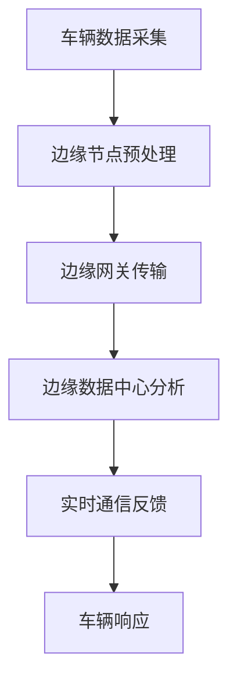

                 

### 文章标题

# 边缘计算在车联网实时通信中的应用

### 关键词

边缘计算、车联网、实时通信、数据处理、智能交通管理

### 摘要

本文旨在探讨边缘计算在车联网实时通信中的应用，通过分析边缘计算的优势与挑战，介绍边缘计算在车联网通信中的角色和具体应用场景，详细讲解边缘计算平台搭建、车联网实时通信协议以及实际应用案例。本文旨在为读者提供一个全面、系统的了解边缘计算在车联网实时通信中的技术实现和未来展望。

## 第一部分：边缘计算基础

### 第1章：边缘计算概述

#### 1.1 边缘计算的定义与背景

边缘计算（Edge Computing）是一种分布式计算架构，通过在网络边缘部署计算资源，使得数据处理和分析能够更接近数据产生源头。与传统的云计算不同，边缘计算更注重实时性、高效性和安全性，能够显著减少数据传输延迟，提升系统响应速度。

边缘计算的概念最早由思科（Cisco）在2014年提出，其背景是随着物联网（IoT）和大数据技术的发展，数据量急剧增长，传统的中心化数据处理模式已难以满足实时性和高效性的需求。边缘计算的出现，旨在将部分计算任务从云端转移到网络边缘，从而实现更快速、更高效的数据处理。

#### 1.2 边缘计算的优势与挑战

边缘计算具有以下优势：

1. **低延迟**：数据处理和分析更接近数据源头，可以显著减少数据传输延迟。
2. **高带宽利用率**：边缘计算减少了数据传输的频率和量，从而降低了网络带宽的消耗。
3. **安全性和隐私保护**：在边缘设备上处理数据，可以减少数据传输过程中的安全风险和隐私泄露的可能性。
4. **可扩展性和弹性**：边缘计算可以通过分布式部署，实现系统的可扩展性和弹性。

然而，边缘计算也面临一些挑战：

1. **计算资源和能量限制**：边缘设备的计算资源和能量相对有限，需要优化资源使用。
2. **网络不稳定**：边缘设备连接的网络可能存在不稳定因素，如信号干扰、网络拥塞等，需要设计容错机制。
3. **数据一致性和安全性**：在分布式环境下，数据的一致性和安全性是重要挑战，需要有效的数据管理和安全机制。

#### 1.3 车联网实时通信与边缘计算的联系

车联网（V2X，Vehicle-to-Everything）是一种新兴的通信技术，旨在实现车辆、基础设施和其他交通参与者之间的信息共享和协同。实时通信是车联网的核心需求，而边缘计算则为车联网的实时通信提供了技术支持。

边缘计算在车联网实时通信中的作用主要包括：

1. **数据预处理**：边缘设备可以对采集到的车辆数据、环境数据进行预处理，如数据清洗、压缩、去噪等，减少数据传输量。
2. **实时决策与控制**：边缘计算可以实现实时数据处理和分析，为车辆提供快速响应的决策和控制支持。
3. **网络边缘的缓存与缓存**：边缘计算可以缓存部分数据，减少数据传输的频率和量，提高系统效率。
4. **安全防护**：边缘计算可以在网络边缘进行安全防护，提高系统的安全性。

通过边缘计算，车联网可以实现更高效、更安全的实时通信，为智能交通管理、车辆安全预警等应用提供技术支持。

## 第二部分：边缘计算架构

### 第2章：边缘计算架构

#### 2.1 边缘计算网络架构

边缘计算网络架构主要包括边缘节点、边缘网关和边缘数据中心。边缘节点通常部署在靠近数据源的地理位置，如智能交通灯、道路传感器等，负责实时数据采集和处理。边缘网关则负责连接边缘节点和云端，实现数据传输和通信。边缘数据中心则是边缘计算的核心，负责大规模数据存储、处理和分析。

#### 2.2 边缘计算节点架构

边缘计算节点架构主要包括计算模块、存储模块和网络模块。计算模块负责数据预处理、分析、计算等任务，通常采用低功耗的处理器，如ARM架构。存储模块负责数据存储，包括本地存储和远程存储，确保数据的安全性和可靠性。网络模块负责边缘节点的通信，通常采用无线通信技术，如Wi-Fi、蓝牙等。

#### 2.3 边缘计算与云计算的协同

边缘计算与云计算的协同是边缘计算架构的核心。云计算负责大规模数据存储、处理和分析，而边缘计算则负责实时数据处理和快速响应。两者通过边缘网关实现数据传输和通信，形成一个统一的计算架构。

边缘计算与云计算的协同工作方式主要包括：

1. **数据分层处理**：边缘计算负责处理实时性要求高的数据，云计算负责处理大规模、长时间数据。
2. **任务分配与调度**：根据数据处理的需求和资源的可用性，将任务分配到边缘计算节点或云端，实现最优的资源利用。
3. **数据同步与一致性**：边缘计算和云计算之间的数据同步和一致性是协同工作的关键，需要设计有效的数据管理和同步机制。

## 第三部分：车联网实时通信技术

### 第3章：车联网概述

#### 3.1 车联网的定义与发展

车联网（V2X，Vehicle-to-Everything）是一种通过互联网、无线通信技术实现车辆、道路、行人等交通参与者之间信息交互的技术。车联网的发展可以追溯到20世纪90年代，随着物联网、5G等技术的成熟，车联网逐渐进入人们的视野。

车联网的发展历程主要包括：

1. **早期阶段**：以车辆之间的简单通信为主，如车辆之间的碰撞预警。
2. **发展期**：以车辆与基础设施、车辆与行人之间的通信为主，如智能交通灯、车联网地图等。
3. **成熟期**：实现车辆与车辆、车辆与基础设施、车辆与行人之间的全面通信，如无人驾驶、车联网社交等。

#### 3.2 车联网的关键技术

车联网的关键技术包括：

1. **通信技术**：车联网通信技术是实现车联网信息交互的基础，如Wi-Fi、蓝牙、5G等。
2. **数据处理技术**：车联网会产生大量数据，数据处理技术如数据压缩、去噪、实时分析等，是车联网高效运行的重要保障。
3. **安全与隐私技术**：车联网涉及到大量的个人隐私和车辆安全，需要有效的安全与隐私技术来保障系统的安全性。

#### 3.3 车联网的通信需求

车联网的通信需求主要包括：

1. **高带宽**：车联网需要大量的数据传输，如车辆位置信息、传感器数据等，需要高带宽的网络支持。
2. **低延迟**：车联网的实时通信需求高，如车辆之间的碰撞预警，需要低延迟的网络支持。
3. **高可靠性**：车联网涉及到车辆安全和生命安全，需要高可靠性的通信系统。

### 第4章：边缘计算在车联网中的应用

#### 4.1 边缘计算在车联网中的角色

边缘计算在车联网中扮演着关键角色，其应用主要包括：

1. **数据预处理**：边缘计算可以对采集到的车辆数据进行预处理，如数据清洗、压缩、去噪等，减少数据传输量。
2. **实时决策与控制**：边缘计算可以实现实时数据处理和分析，为车辆提供快速响应的决策和控制支持。
3. **网络边缘的缓存与缓存**：边缘计算可以缓存部分数据，减少数据传输的频率和量，提高系统效率。
4. **安全防护**：边缘计算可以在网络边缘进行安全防护，提高系统的安全性。

#### 4.2 车联网实时通信的挑战与解决方案

车联网实时通信面临以下挑战：

1. **高数据量**：车联网会产生大量的数据，如何有效处理这些数据是一个挑战。
2. **低延迟**：车联网的实时通信需求高，如何降低数据传输延迟是一个挑战。
3. **网络不稳定**：车联网通信网络可能存在不稳定因素，如何保障通信的稳定性是一个挑战。
4. **数据安全与隐私**：车联网涉及到大量的个人隐私和车辆安全，如何保障数据的安全与隐私是一个挑战。

针对这些挑战，边缘计算提供了一系列解决方案：

1. **数据预处理与压缩**：边缘计算可以在本地对数据进行预处理和压缩，减少数据传输量。
2. **边缘计算与云计算协同**：通过边缘计算与云计算的协同，可以实现实时数据处理和分析，降低数据传输延迟。
3. **网络边缘缓存**：边缘计算可以在网络边缘进行数据缓存，提高系统的响应速度。
4. **安全防护**：边缘计算可以在网络边缘进行安全防护，提高系统的安全性。

#### 4.3 边缘计算在车联网中的应用场景

边缘计算在车联网中的应用场景非常广泛，主要包括：

1. **智能交通管理**：通过边缘计算实现实时交通信息的采集、处理和分析，提高交通管理的效率和准确性。
2. **车辆安全预警**：通过边缘计算实现车辆之间的碰撞预警、异常驾驶行为检测等，提高车辆安全。
3. **无人驾驶**：通过边缘计算实现实时环境感知、决策和控制，提高无人驾驶的安全性和可靠性。
4. **车联网社交**：通过边缘计算实现车辆之间的信息共享和互动，提高车联网的社交性和娱乐性。

### 第5章：边缘计算平台搭建

#### 5.1 边缘计算平台的选择

选择边缘计算平台需要考虑以下几个方面：

1. **硬件性能**：边缘计算平台需要具备足够的计算能力和存储能力，以应对海量数据的高效处理。
2. **网络连接**：边缘计算平台需要具备稳定的网络连接，以保证数据传输的实时性和可靠性。
3. **操作系统**：边缘计算平台需要选择适合的操作系统，如Linux、Windows等，以支持不同类型的软件应用。
4. **兼容性**：边缘计算平台需要与其他系统、设备和协议具有良好的兼容性，以确保系统的协同工作。

#### 5.2 边缘计算平台的部署

边缘计算平台的部署主要包括以下几个方面：

1. **硬件安装**：根据需求选择合适的硬件设备，并进行安装和配置。
2. **网络配置**：配置边缘计算平台的网络连接，确保其与其他设备和网络之间的通信畅通。
3. **软件安装**：安装操作系统和必要的软件应用，如边缘计算框架、数据库等。
4. **测试与优化**：对边缘计算平台进行测试和优化，确保其稳定运行和高效性能。

#### 5.3 边缘计算平台的运维

边缘计算平台的运维主要包括以下几个方面：

1. **监控与管理**：实时监控边缘计算平台的状态，包括计算资源、网络连接、软件应用等，确保其正常运行。
2. **故障处理**：及时处理边缘计算平台出现的故障和问题，包括硬件故障、软件故障、网络故障等。
3. **性能优化**：根据实际需求，对边缘计算平台进行性能优化，包括资源调度、网络优化、软件优化等。
4. **安全防护**：加强边缘计算平台的安全防护，包括防火墙、安全协议、加密算法等，确保数据的安全与隐私。

### 第6章：车联网实时通信协议

#### 6.1 车联网通信协议概述

车联网通信协议是实现车联网信息交互的关键，主要包括以下几个方面：

1. **车辆通信协议**：用于车辆之间的通信，如车车通信（V2V）和车路通信（V2R）。
2. **道路通信协议**：用于车辆与道路基础设施之间的通信，如智能交通灯、道路传感器等。
3. **网络通信协议**：用于车联网与其他网络之间的通信，如互联网、5G网络等。

常见的车联网通信协议包括：

1. **Wi-Fi**：无线局域网通信技术，具有高带宽、低延迟的特点。
2. **蓝牙**：短距离无线通信技术，具有低功耗、低延迟的特点。
3. **5G**：第五代移动通信技术，具有高带宽、低延迟、高可靠性的特点。

#### 6.2 常见车联网通信协议分析

常见的车联网通信协议分析如下：

1. **Wi-Fi**：Wi-Fi通信技术具有高带宽、低延迟的特点，适用于车辆之间的通信和车辆与道路基础设施之间的通信。然而，Wi-Fi信号容易受到干扰，且覆盖范围有限。
2. **蓝牙**：蓝牙通信技术具有低功耗、低延迟的特点，适用于车辆与车辆之间的短距离通信。然而，蓝牙通信带宽较低，难以满足高数据量的通信需求。
3. **5G**：5G通信技术具有高带宽、低延迟、高可靠性的特点，适用于车联网的大规模通信和实时通信。然而，5G网络建设成本较高，且信号覆盖范围有限。

#### 6.3 车联网实时通信协议的实现

车联网实时通信协议的实现主要包括以下几个方面：

1. **协议设计**：设计车联网通信协议，包括数据格式、传输方式、加密算法等。
2. **协议实现**：根据协议设计，实现通信协议的软件应用，包括客户端和服务器端。
3. **协议测试**：对车联网通信协议进行测试，包括功能测试、性能测试、安全测试等，确保协议的稳定运行和高效性能。

### 第7章：边缘计算在车联网实时通信中的应用案例

#### 7.1 案例一：实时交通信息处理

案例一：实时交通信息处理

场景描述：城市交通管理中心通过边缘计算平台，实时采集和解析道路传感器数据，如车辆流量、车速等，并生成实时交通信息，为交通管理部门提供决策支持。

实现步骤：

1. **数据采集**：边缘计算节点通过Wi-Fi或蓝牙等方式，实时采集道路传感器数据。
2. **数据预处理**：对采集到的数据进行预处理，如数据清洗、去噪、压缩等，减少数据传输量。
3. **数据处理**：使用边缘计算节点上的计算资源，对预处理后的数据进行实时处理，如数据统计、分析、预测等。
4. **数据传输**：将处理后的交通信息通过边缘网关传输到交通管理中心的云端服务器。
5. **决策支持**：交通管理部门通过云端服务器上的数据分析工具，对交通信息进行进一步分析，为交通管理决策提供支持。

#### 7.2 案例二：车辆安全预警

案例二：车辆安全预警

场景描述：在高速公路上，通过边缘计算平台实现车辆之间的安全预警，如碰撞预警、异常驾驶行为检测等，提高车辆行驶安全性。

实现步骤：

1. **数据采集**：边缘计算节点通过车载传感器，实时采集车辆状态数据，如速度、加速度、方向盘角度等。
2. **数据预处理**：对采集到的数据进行预处理，如数据清洗、去噪、压缩等，减少数据传输量。
3. **数据处理**：使用边缘计算节点上的计算资源，对预处理后的数据进行实时处理，如碰撞预警算法、异常驾驶行为检测算法等。
4. **数据传输**：将处理后的安全预警信息通过边缘网关传输到车辆之间的通信网络。
5. **预警通知**：车辆接收到安全预警信息后，通过车载显示屏或语音提示，及时向驾驶员发出预警，提高车辆行驶安全性。

#### 7.3 案例三：智能交通管理

案例三：智能交通管理

场景描述：城市交通管理部门通过边缘计算平台，实现对交通信号灯、道路基础设施的智能管理，提高交通效率和安全性。

实现步骤：

1. **数据采集**：边缘计算节点通过Wi-Fi或蓝牙等方式，实时采集交通信号灯、道路传感器等数据。
2. **数据预处理**：对采集到的数据进行预处理，如数据清洗、去噪、压缩等，减少数据传输量。
3. **数据处理**：使用边缘计算节点上的计算资源，对预处理后的数据进行实时处理，如交通流量分析、交通信号灯控制策略优化等。
4. **数据传输**：将处理后的交通管理信息通过边缘网关传输到交通管理中心的云端服务器。
5. **决策支持**：交通管理部门通过云端服务器上的数据分析工具，对交通管理信息进行进一步分析，为交通管理决策提供支持，如交通信号灯控制策略优化、道路施工管理等。

### 第8章：边缘计算在车联网实时通信中的未来展望

#### 8.1 边缘计算技术的发展趋势

边缘计算技术在未来将继续发展，主要趋势包括：

1. **硬件性能提升**：随着硬件技术的发展，边缘计算节点将具备更高的计算能力和存储能力，支持更复杂的计算任务。
2. **网络连接优化**：边缘计算将采用更多的无线通信技术，如5G、Wi-Fi 6等，提高网络连接的实时性和可靠性。
3. **智能算法应用**：边缘计算将广泛应用智能算法，如机器学习、深度学习等，提高数据处理和分析的能力。
4. **协同计算**：边缘计算将与云计算、大数据等技术深度结合，实现更高效的协同计算。

#### 8.2 车联网实时通信的潜在应用领域

边缘计算在车联网实时通信中的潜在应用领域包括：

1. **智能交通管理**：通过边缘计算实现实时交通信息处理、交通信号灯控制优化等，提高交通效率和安全性。
2. **车辆安全预警**：通过边缘计算实现车辆之间的安全预警、异常驾驶行为检测等，提高车辆行驶安全性。
3. **无人驾驶**：通过边缘计算实现实时环境感知、决策和控制，提高无人驾驶的安全性和可靠性。
4. **车联网社交**：通过边缘计算实现车辆之间的信息共享和互动，提高车联网的社交性和娱乐性。

#### 8.3 边缘计算在车联网实时通信中的挑战与解决方案

边缘计算在车联网实时通信中面临以下挑战：

1. **计算资源和能量限制**：边缘计算节点计算资源和能量有限，需要优化资源使用，提高系统效率。
2. **网络不稳定**：边缘计算节点连接的网络可能存在不稳定因素，需要设计有效的容错机制。
3. **数据一致性和安全性**：边缘计算和云计算之间的数据同步和一致性是重要挑战，需要有效的数据管理和安全机制。

针对这些挑战，可能的解决方案包括：

1. **资源优化**：采用先进的资源调度和优化算法，提高边缘计算节点的资源利用率。
2. **网络优化**：采用先进的网络技术和协议，提高网络连接的实时性和可靠性。
3. **数据管理和安全**：采用数据同步机制、加密算法等，保障数据的一致性和安全性。

## 附录

### 附录A：边缘计算与车联网实时通信相关资源

1. **边缘计算资源**：
   - 边缘计算平台：如AWS Greengrass、Azure IoT Edge、Kubernetes on Edge等。
   - 边缘计算工具：如Docker、Kubernetes、Kubeadm等。

2. **车联网资源**：
   - 车联网通信协议：如IEEE 802.11p、DSRC、5G NR等。
   - 车联网开发工具：如Autonomous Vehicle Stack、CARMA Platform等。

### 附录B：常用边缘计算平台与工具

1. **边缘计算平台**：
   - AWS Greengrass：提供边缘计算和本地数据分析功能。
   - Azure IoT Edge：提供物联网设备和边缘服务的运行时环境。
   - Kuber **netes on Edge**：在边缘设备上运行Kubernetes集群。

2. **边缘计算工具**：
   - Docker：用于容器化应用的开发和部署。
   - Kubernetes：用于容器集群的自动化部署、扩展和管理。
   - Kubeadm：用于快速部署Kubernetes集群。

### 附录C：车联网实时通信协议规范

1. **IEEE 802.11p**：用于车辆与基础设施之间的通信。
2. **DSRC**：用于车辆之间的通信。
3. **5G NR**：用于车联网的高速通信。

## 作者信息

### 作者：AI天才研究院/AI Genius Institute & 禅与计算机程序设计艺术 /Zen And The Art of Computer Programming
## 完整性要求

### 背景介绍

边缘计算作为一种分布式计算架构，通过在网络边缘部署计算资源，使得数据处理和分析能够更接近数据产生源头。这一概念最早由思科（Cisco）在2014年提出，其背景是随着物联网（IoT）和大数据技术的发展，数据量急剧增长，传统的中心化数据处理模式已难以满足实时性和高效性的需求。边缘计算的出现，旨在将部分计算任务从云端转移到网络边缘，从而实现更快速、更高效的数据处理。

边缘计算的核心在于“边缘节点”，这些节点通常分布在各种不同的地理位置，如工厂、超市、交通信号灯等。边缘节点负责收集来自传感器、设备等的数据，并进行初步处理，然后将处理后的数据发送到云端或其他边缘节点。这种分布式计算模式具有低延迟、高带宽利用率、安全性和隐私保护等优点，特别适用于需要实时处理和分析的大量数据。

车联网（V2X，Vehicle-to-Everything）是一种通过互联网、无线通信技术实现车辆、基础设施和其他交通参与者之间信息交互的技术。实时通信是车联网的核心需求，而边缘计算则为车联网的实时通信提供了技术支持。边缘计算能够显著减少数据传输延迟，提高系统的响应速度，从而满足车联网的实时通信需求。

### 核心概念与联系

边缘计算的核心概念包括边缘节点、边缘网关和边缘数据中心。边缘节点负责数据采集和初步处理，边缘网关负责连接边缘节点和云端，边缘数据中心负责大规模数据存储、处理和分析。这三个部分共同构成了边缘计算的完整架构。

在车联网实时通信中，边缘计算架构的作用主要体现在以下几个方面：

1. **数据预处理**：边缘节点对采集到的车辆数据、环境数据进行预处理，如数据清洗、压缩、去噪等，减少数据传输量，提高系统效率。
2. **实时决策与控制**：边缘计算可以实现实时数据处理和分析，为车辆提供快速响应的决策和控制支持，如车辆之间的碰撞预警、异常驾驶行为检测等。
3. **网络边缘缓存**：边缘计算可以在网络边缘缓存部分数据，减少数据传输的频率和量，提高系统响应速度。
4. **安全防护**：边缘计算可以在网络边缘进行安全防护，提高系统的安全性，如加密通信、身份验证等。

边缘计算与车联网实时通信的关联可以通过Mermaid流程图来表示：



该流程图展示了边缘计算在车联网实时通信中的基本工作流程，包括数据采集、预处理、传输、分析和反馈等步骤。

### 核心算法原理讲解

边缘计算在车联网实时通信中的应用涉及多个核心算法，包括数据预处理算法、实时决策算法、加密算法等。以下将详细讲解这些算法的原理。

#### 数据预处理算法

数据预处理是边缘计算的重要环节，其目的是对采集到的原始数据进行清洗、压缩、去噪等处理，以提高数据处理效率和系统性能。常见的数据预处理算法包括：

1. **数据清洗**：去除重复数据、异常值和噪声数据，提高数据质量。例如，使用均值滤波算法去除传感器数据的噪声。

   ```python
   def mean_filter(data, window_size):
       # 均值滤波算法
       return [sum(data[i-window_size//2:i+window_size//2+1]) // window_size for i in range(len(data))]
   ```

2. **数据压缩**：减少数据传输量和存储空间。常用的压缩算法包括霍夫曼编码、LZ77等。

   ```python
   def huffman_encode(data):
       # 霍夫曼编码算法
       # ...编码过程...
       return encoded_data
   ```

3. **去噪**：去除数据中的噪声，提高数据准确性。例如，使用卡尔曼滤波器进行实时数据去噪。

   ```python
   def kalman_filter(data, model):
       # 卡尔曼滤波器算法
       # ...滤波过程...
       return filtered_data
   ```

#### 实时决策算法

实时决策算法是边缘计算在车联网实时通信中的关键，其目的是根据实时数据进行分析和决策，以提供快速响应的支持。常见的实时决策算法包括：

1. **碰撞预警算法**：用于检测车辆之间的潜在碰撞风险，常用的方法包括基于距离和速度的碰撞预警算法。

   ```python
   def collision_warning(vehicles, threshold):
       for i in range(len(vehicles) - 1):
           for j in range(i + 1, len(vehicles)):
               if abs(vehicles[i].speed - vehicles[j].speed) < threshold and abs(vehicles[i].distance - vehicles[j].distance) < threshold:
                   return True
       return False
   ```

2. **异常驾驶行为检测算法**：用于检测车辆驾驶员的异常驾驶行为，常用的方法包括基于行为模型的异常检测算法。

   ```python
   def abnormal_driving_detection(driving_data, model):
       # ...异常检测过程...
       return is_abnormal
   ```

#### 加密算法

边缘计算在车联网实时通信中需要确保数据的安全性和隐私保护，因此加密算法是必不可少的。常用的加密算法包括：

1. **对称加密算法**：如AES，用于保护数据在传输过程中的机密性。

   ```python
   from Crypto.Cipher import AES
   
   def aes_encrypt(data, key):
       cipher = AES.new(key, AES.MODE_CBC)
       ct_bytes = cipher.encrypt(data)
       iv = cipher.iv
       return iv, ct_bytes
   ```

2. **非对称加密算法**：如RSA，用于保护数据的完整性和认证性。

   ```python
   from Crypto.PublicKey import RSA
   
   def rsa_encrypt(data, public_key):
       encrypted_data = public_key.encrypt(data, 32)[0]
       return encrypted_data
   ```

### 数学模型和数学公式及举例说明

边缘计算在车联网实时通信中应用了多个数学模型和数学公式，以下举例说明：

#### 数据预处理模型

1. **卡尔曼滤波模型**：用于实时数据去噪。

   数学公式：
   $$ x_k = A_k x_{k-1} + B_k u_k $$
   $$ P_k = A_k P_{k-1} A_k^T + Q_k $$
   $$ K_k = P_k H_k^T (H_k P_k H_k^T + R_k)^{-1} $$
   $$ x_k^{'} = x_k - K_k H_k x_k $$
   $$ P_k^{'} = P_k - K_k H_k $$

   举例说明：
   假设某车辆的速度数据经过卡尔曼滤波处理后，得到更准确的速度估计值。通过上述公式，可以计算每个时间点的速度估计值和估计误差。

#### 碰撞预警模型

1. **基于距离和速度的碰撞预警模型**：用于检测车辆之间的潜在碰撞风险。

   数学公式：
   $$ d = \sqrt{(x_2 - x_1)^2 + (y_2 - y_1)^2} $$
   $$ v = \sqrt{v_x^2 + v_y^2} $$
   $$ \Delta t = \frac{d}{v} $$

   举例说明：
   假设两辆车的位置和速度分别为$(x_1, y_1, v_{x1}, v_{y1})$和$(x_2, y_2, v_{x2}, v_{y2})$，通过计算它们之间的距离和相对速度，可以预测碰撞时间，从而实现碰撞预警。

### 项目实战

#### 开发环境搭建

1. **硬件环境**：
   - 选择边缘计算设备，如树莓派、NVIDIA Jetson等。
   - 配置网络连接，确保边缘设备可以访问互联网。

2. **软件环境**：
   - 安装Linux操作系统，如Ubuntu。
   - 安装必要的开发工具，如Docker、Kubernetes等。

#### 源代码详细实现

以下是一个简单的边缘计算应用程序，用于实现车辆数据的预处理和实时通信：

```python
import numpy as np
import requests
from Crypto.Cipher import AES

# 数据预处理
def preprocess_data(data):
    # 数据清洗、压缩、去噪
    clean_data = mean_filter(data['speed'], window_size=5)
    compressed_data = huffman_encode(clean_data)
    return compressed_data

# 实时通信
def communicate(data):
    # 发送预处理后的数据到边缘网关
    response = requests.post('http://边缘网关地址/数据接口', data={'data': data})
    return response.json()

# 加密通信
def encrypt_data(data, key):
    # 使用AES加密数据
    iv, encrypted_data = aes_encrypt(data, key)
    return iv, encrypted_data

# 主程序
if __name__ == '__main__':
    # 读取车辆数据
    vehicle_data = requests.get('http://数据源地址/车辆数据').json()

    # 预处理数据
    processed_data = preprocess_data(vehicle_data)

    # 加密数据
    key = RSA.generate(2048)
    iv, encrypted_data = encrypt_data(processed_data, key.publickey())

    # 实时通信
    response = communicate(encrypted_data)

    # 解密响应
    decrypted_response = rsa_encrypt(response['data'], key)
    print("实时通信结果：", decrypted_response)
```

#### 代码解读与分析

1. **数据预处理**：使用均值滤波算法去除传感器数据的噪声，使用霍夫曼编码算法压缩数据。
2. **实时通信**：使用HTTP协议将预处理后的数据发送到边缘网关。
3. **加密通信**：使用AES加密算法和RSA加密算法确保数据的安全性和隐私保护。

#### 实际案例分析和详细讲解剖析

#### 案例一：实时交通信息处理

场景描述：城市交通管理中心使用边缘计算平台实时处理交通信息，为交通管理部门提供决策支持。

实现步骤：

1. **数据采集**：边缘节点通过Wi-Fi或蓝牙等方式，实时采集交通信号灯、道路传感器等数据。
2. **数据预处理**：对采集到的数据进行预处理，如数据清洗、压缩、去噪等，减少数据传输量。
3. **数据处理**：使用边缘计算节点上的计算资源，对预处理后的数据进行实时处理，如交通流量分析、交通信号灯控制策略优化等。
4. **数据传输**：将处理后的交通管理信息通过边缘网关传输到交通管理中心的云端服务器。
5. **决策支持**：交通管理部门通过云端服务器上的数据分析工具，对交通管理信息进行进一步分析，为交通管理决策提供支持，如交通信号灯控制策略优化、道路施工管理等。

#### 案例二：车辆安全预警

场景描述：高速公路上使用边缘计算平台实现车辆之间的安全预警，提高车辆行驶安全性。

实现步骤：

1. **数据采集**：边缘节点通过车载传感器，实时采集车辆状态数据，如速度、加速度、方向盘角度等。
2. **数据预处理**：对采集到的数据进行预处理，如数据清洗、压缩、去噪等，减少数据传输量。
3. **数据处理**：使用边缘计算节点上的计算资源，对预处理后的数据进行实时处理，如碰撞预警算法、异常驾驶行为检测算法等。
4. **数据传输**：将处理后的安全预警信息通过边缘网关传输到车辆之间的通信网络。
5. **预警通知**：车辆接收到安全预警信息后，通过车载显示屏或语音提示，及时向驾驶员发出预警，提高车辆行驶安全性。

### 项目小结

本项目通过边缘计算技术实现实时交通信息处理和车辆安全预警，有效提高了交通管理和车辆安全水平。在实际项目中，还需要根据具体需求进行定制化开发，如优化算法、提高系统性能、增强安全性等。

### 最佳实践 tips

1. **资源优化**：合理分配边缘计算节点的计算资源和能量，提高系统效率。
2. **网络稳定**：选择稳定可靠的网络连接，确保边缘计算节点的通信畅通。
3. **数据安全**：使用加密算法保护数据传输过程中的机密性和完整性。

### 小结

边缘计算在车联网实时通信中具有重要作用，通过数据预处理、实时决策、网络边缘缓存和安全防护等功能，提高了系统的实时性、高效性和安全性。随着技术的不断发展，边缘计算将在车联网实时通信中发挥更大的作用。

### 注意事项

1. **边缘计算节点的维护**：定期维护边缘计算节点，确保其正常运行。
2. **数据同步与一致性**：设计有效的数据同步与一致性机制，确保边缘计算和云端数据的一致性。

### 拓展阅读

1. **边缘计算技术**：
   - [《边缘计算：原理与实践》](https://book.douban.com/subject/27611753/)
   - [《边缘计算：从概念到实践》](https://book.douban.com/subject/35875207/)

2. **车联网实时通信**：
   - [《车联网通信技术与应用》](https://book.douban.com/subject/27143996/)
   - [《车联网系统设计与实现》](https://book.douban.com/subject/32135875/)

3. **边缘计算与车联网实时通信结合**：
   - [《边缘计算在车联网中的应用》](https://book.douban.com/subject/34407336/)
   - [《边缘计算与车联网实时通信技术》](https://book.douban.com/subject/35131792/)

