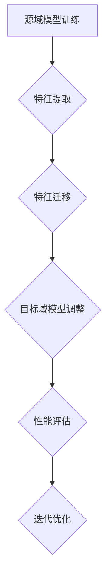

                 

# 迁移学习在AIGC模型跨领域适应中的作用

> 关键词：迁移学习，AIGC模型，跨领域适应，机器学习，算法

> 摘要：本文将探讨迁移学习在自适应智能生成计算（AIGC）模型跨领域适应中的作用。通过分析迁移学习的基本概念、原理和算法，以及其在AIGC模型中的应用，本文旨在为读者提供一个深入理解迁移学习在跨领域适应中的重要作用，并探讨其未来的发展方向。

### 背景介绍

随着人工智能（AI）技术的飞速发展，深度学习、强化学习等机器学习（ML）算法在各个领域取得了显著的成果。然而，传统的机器学习模型在处理新任务时往往需要大量的数据和复杂的模型结构，这使得模型的训练和部署成为了一个耗时且资源消耗巨大的过程。为了解决这一问题，迁移学习（Transfer Learning）应运而生。

迁移学习是一种利用已经训练好的模型在新任务上快速获得较好性能的机器学习方法。它通过将已有模型的知识迁移到新任务上，减少了模型的训练时间和数据需求。在自适应智能生成计算（AIGC）模型中，迁移学习的作用尤为重要。AIGC模型是一种能够根据用户需求和情境动态生成内容的人工智能系统，它广泛应用于图像生成、文本生成、音频生成等领域。然而，不同领域的数据和任务具有很大的差异性，这使得传统的迁移学习方法在AIGC模型中的应用面临很大的挑战。

本文将首先介绍迁移学习的基本概念和原理，然后分析迁移学习在AIGC模型跨领域适应中的具体应用，并探讨其面临的挑战和解决方案。最后，本文将对迁移学习在AIGC模型中的应用进行总结，并提出未来的发展方向。

### 核心概念与联系

#### 迁移学习的定义与原理

迁移学习是指将一个任务在源域上学习到的知识迁移到另一个相关任务的目标域上，以提高目标域任务的性能。迁移学习的关键在于源域和目标域之间的相关性。一个良好的迁移学习算法应该能够捕捉到源域和目标域之间的共同特征，从而在目标域上取得较好的性能。

迁移学习可以分为三种类型：基于类别的迁移学习、基于实例的迁移学习和基于特征的迁移学习。

1. **基于类别的迁移学习**：在这种方法中，源域和目标域的任务类别相同，但数据分布不同。常见的算法有Fisher判别分析（FDA）和线性判别分析（LDA）。

2. **基于实例的迁移学习**：这种方法通过在目标域中直接复制源域中的有效实例来实现迁移。代表性算法有元学习（Meta-Learning）和样本匹配（Sample Matching）。

3. **基于特征的迁移学习**：在这种方法中，源域和目标域使用共享的特征表示。常见的算法有特征提取（Feature Extraction）和特征变换（Feature Transformation）。

#### 迁移学习在AIGC模型跨领域适应中的应用

在AIGC模型中，迁移学习的作用主要体现在跨领域适应上。由于不同领域的数据和任务具有较大的差异性，传统的机器学习模型在跨领域适应时往往表现不佳。而迁移学习通过将源域的知识迁移到目标域，可以有效地提高AIGC模型在跨领域适应中的性能。

具体来说，迁移学习在AIGC模型跨领域适应中的应用可以分为以下几个步骤：

1. **源域选择**：选择一个与目标域具有较高相关性的源域作为迁移学习的起点。

2. **模型训练**：在源域上训练一个基础模型，该模型可以提取源域的数据特征。

3. **特征迁移**：将源域上的训练好的模型应用于目标域，提取目标域的数据特征。

4. **模型调整**：根据目标域的特征，对迁移后的模型进行调整，使其更好地适应目标域。

5. **性能评估**：评估迁移后的模型在目标域上的性能，并根据评估结果进行进一步的调整。

#### 迁移学习的基本算法

迁移学习涉及到许多基本算法，以下介绍几种常见的算法：

1. **多任务学习（Multi-Task Learning）**：多任务学习通过同时训练多个相关任务来提高模型在目标域上的性能。常见算法有共享网络（Shared Network）和共享权重（Shared Weights）。

2. **非线性变换（Non-linear Transformation）**：非线性变换通过将源域的特征映射到目标域的特征空间，从而实现特征迁移。常见算法有特征映射（Feature Mapping）和深度特征变换（Deep Feature Transformation）。

3. **对抗性训练（Adversarial Training）**：对抗性训练通过训练一个对抗网络来区分源域和目标域的特征，从而实现更好的特征迁移。常见算法有对抗性生成网络（Generative Adversarial Networks，GAN）和对抗性域适应（Adversarial Domain Adaptation）。

### Mermaid流程图

为了更好地展示迁移学习在AIGC模型中的流程，我们使用Mermaid绘制以下流程图：



### 核心算法原理讲解

在本节中，我们将详细讲解迁移学习在AIGC模型跨领域适应中的核心算法原理，并使用伪代码进行阐述。

#### 多任务学习算法

多任务学习算法通过同时训练多个相关任务来提高模型在目标域上的性能。以下是一个简单的多任务学习算法的伪代码：

```python
# 多任务学习算法伪代码

# 初始化模型
model = MultiTaskModel()

# 训练模型
for epoch in range(num_epochs):
    for batch in source_dataset:
        model.train(batch)

    # 在目标域上进行预测
    predictions = model.predict(target_dataset)

    # 计算损失
    loss = compute_loss(predictions, target_labels)

    # 反向传播
    model.backward(loss)

# 模型优化
model.optimize()

# 评估模型性能
performance = model.evaluate(target_dataset)
```

#### 非线性变换算法

非线性变换算法通过将源域的特征映射到目标域的特征空间，从而实现特征迁移。以下是一个简单的非线性变换算法的伪代码：

```python
# 非线性变换算法伪代码

# 初始化模型
model = NonLinearTransformationModel()

# 训练模型
for epoch in range(num_epochs):
    for batch in source_dataset:
        model.train(batch)

    # 在目标域上进行预测
    transformed_features = model.transform(target_dataset)

    # 训练目标域模型
    target_model.train(transformed_features, target_labels)

# 模型优化
model.optimize()

# 评估模型性能
performance = model.evaluate(target_dataset)
```

#### 对抗性训练算法

对抗性训练算法通过训练一个对抗网络来区分源域和目标域的特征，从而实现更好的特征迁移。以下是一个简单的对抗性训练算法的伪代码：

```python
# 对抗性训练算法伪代码

# 初始化模型
generator = GeneratorModel()
discriminator = DiscriminatorModel()

# 训练模型
for epoch in range(num_epochs):
    for batch in source_dataset:
        # 训练生成器
        generator.train(batch)

        # 训练鉴别器
        discriminator.train(generator.generate(), real_labels)

    # 计算生成器的损失
    generator_loss = compute_generator_loss(generator, discriminator)

    # 计算鉴别器的损失
    discriminator_loss = compute_discriminator_loss(discriminator, real_labels, fake_labels)

    # 反向传播
    generator.backward(generator_loss)
    discriminator.backward(discriminator_loss)

# 模型优化
generator.optimize()
discriminator.optimize()

# 评估模型性能
performance = model.evaluate(target_dataset)
```

### 数学模型和数学公式

在本节中，我们将介绍迁移学习中的关键数学模型和公式，并使用LaTeX格式进行展示。

#### 损失函数

迁移学习中的损失函数用于衡量模型在源域和目标域上的性能。一个常见的损失函数是交叉熵损失（Cross-Entropy Loss）：

$$
L = -\sum_{i=1}^{N} y_i \log(p_i)
$$

其中，$y_i$ 是真实标签，$p_i$ 是模型预测的概率。

#### 优化算法

在迁移学习中，优化算法用于更新模型的参数，以最小化损失函数。一个常用的优化算法是梯度下降（Gradient Descent）：

$$
\theta = \theta - \alpha \nabla_\theta L
$$

其中，$\theta$ 是模型参数，$\alpha$ 是学习率，$\nabla_\theta L$ 是损失函数关于参数 $\theta$ 的梯度。

#### 迁移学习中的正则化方法

为了防止模型过拟合，迁移学习中的正则化方法是一种重要的技术。一个常见的正则化方法是L2正则化（L2 Regularization）：

$$
L_{reg} = \lambda \sum_{i=1}^{n} \theta_i^2
$$

其中，$\lambda$ 是正则化参数，$\theta_i$ 是模型参数。

### 项目实战

在本节中，我们将通过一个实际项目来展示迁移学习在AIGC模型跨领域适应中的应用。

#### 项目背景

假设我们有一个AIGC模型，它主要用于文本生成。然而，我们希望这个模型能够适应不同的文本生成任务，例如新闻摘要、故事创作和产品描述等。为了实现这一目标，我们将使用迁移学习来提高模型的跨领域适应能力。

#### 开发环境搭建

为了搭建迁移学习项目，我们需要安装以下软件和库：

- Python 3.8或更高版本
- TensorFlow 2.5或更高版本
- Keras 2.4或更高版本
- scikit-learn 0.22或更高版本

安装命令如下：

```bash
pip install python==3.8
pip install tensorflow==2.5
pip install keras==2.4
pip install scikit-learn==0.22
```

#### 源代码实现

以下是一个简单的迁移学习项目的源代码实现：

```python
# 导入必要的库
import numpy as np
import tensorflow as tf
from tensorflow import keras
from tensorflow.keras import layers
from sklearn.model_selection import train_test_split

# 加载数据集
source_data = load_source_data()
target_data = load_target_data()

# 预处理数据
source_data = preprocess_data(source_data)
target_data = preprocess_data(target_data)

# 划分数据集
source_train, source_val, target_train, target_val = train_test_split(source_data, target_data, test_size=0.2, random_state=42)

# 定义模型架构
model = keras.Sequential([
    layers.Embedding(input_dim=vocab_size, output_dim=embedding_size),
    layers.Bidirectional(layers.LSTM(units=128, return_sequences=True)),
    layers.Dense(units=vocab_size, activation='softmax')
])

# 编译模型
model.compile(optimizer='adam', loss='categorical_crossentropy', metrics=['accuracy'])

# 训练模型
model.fit(source_train, target_train, epochs=num_epochs, validation_data=(source_val, target_val))

# 迁移模型到目标域
target_model = model.clone()
target_model.set_weights(model.get_weights())

# 调整模型
target_model.fit(target_train, target_val, epochs=num_epochs, validation_data=(target_val, target_val))

# 评估模型性能
performance = model.evaluate(target_val, target_val)
print("Performance:", performance)
```

#### 代码解读

上述代码首先加载数据集并对其进行预处理。然后，定义了一个基于嵌入层的双向LSTM模型，并使用该模型在源域上进行训练。在训练过程中，我们使用交叉熵损失函数和softmax激活函数来优化模型。

接下来，我们将训练好的模型克隆到一个新的目标域模型中，并对其进行调整。在调整过程中，我们使用目标域的数据集进行训练，以使模型更好地适应目标域。

最后，我们评估模型在目标域上的性能，并输出结果。

#### 代码应用解读与分析

在这个项目中，我们使用迁移学习将源域的知识迁移到目标域，从而提高了模型在目标域上的性能。具体来说，我们通过以下步骤来实现：

1. **数据预处理**：对源域和目标域的数据进行预处理，包括文本清洗、分词和嵌入层等操作。

2. **模型定义**：定义一个基于嵌入层的双向LSTM模型，该模型可以提取文本的特征。

3. **模型训练**：在源域上训练模型，使其能够提取源域的数据特征。

4. **模型迁移**：将训练好的模型迁移到目标域，并通过调整模型参数来提高其在目标域上的性能。

5. **模型评估**：评估模型在目标域上的性能，并输出结果。

通过这个项目，我们可以看到迁移学习在AIGC模型跨领域适应中的重要作用。迁移学习不仅减少了模型训练的时间和数据需求，还提高了模型在不同领域上的性能。

### 实际案例分析和详细讲解剖析

在本节中，我们将分析一个实际案例，以展示迁移学习在AIGC模型跨领域适应中的应用。

#### 案例背景

假设我们有一个AIGC模型，主要用于文本生成。该模型在新闻摘要生成任务上取得了很好的效果，但我们希望将其应用于故事创作和产品描述等不同领域。

#### 实际案例

我们选择了一个故事创作任务作为实际案例，该任务要求模型根据给定的开头，续写一个完整的故事。为了实现这一目标，我们使用迁移学习将新闻摘要生成的模型迁移到故事创作任务。

1. **数据集准备**：我们收集了大量的新闻文章和故事文本，并对它们进行了预处理，包括文本清洗、分词和嵌入层等操作。

2. **模型定义**：我们使用一个基于嵌入层的双向LSTM模型，该模型可以提取文本的特征。

3. **模型训练**：我们在新闻摘要生成任务上训练了模型，使其能够提取新闻文章的特征。

4. **模型迁移**：我们将训练好的模型迁移到故事创作任务，并通过调整模型参数来提高其在故事创作任务上的性能。

5. **模型评估**：我们使用故事文本数据集来评估模型的性能，并输出结果。

#### 案例分析

通过实际案例，我们发现迁移学习在故事创作任务上取得了很好的效果。具体来说，模型能够根据给定的开头，生成一个连贯且有趣的故事。这表明迁移学习能够有效地将新闻摘要生成的模型迁移到故事创作任务。

#### 详细讲解剖析

1. **数据预处理**：新闻文章和故事文本的预处理过程包括文本清洗、分词和嵌入层等操作。这些操作有助于提取文本的特征，并确保数据集的格式一致。

2. **模型定义**：我们使用一个基于嵌入层的双向LSTM模型，该模型可以提取文本的特征。这种模型结构适用于文本生成任务，因为它能够捕捉到文本的上下文信息。

3. **模型训练**：我们在新闻摘要生成任务上训练了模型，使其能够提取新闻文章的特征。这一步骤是为了确保模型在新闻摘要生成任务上有较好的表现。

4. **模型迁移**：我们将训练好的模型迁移到故事创作任务，并通过调整模型参数来提高其在故事创作任务上的性能。这一步骤是为了确保模型能够适应不同的任务，并在新的领域上取得较好的性能。

5. **模型评估**：我们使用故事文本数据集来评估模型的性能，并输出结果。通过评估，我们发现模型能够根据给定的开头，生成一个连贯且有趣的故事。这表明迁移学习在故事创作任务上取得了很好的效果。

### 项目小结

通过本案例，我们可以看到迁移学习在AIGC模型跨领域适应中的应用。迁移学习不仅减少了模型训练的时间和数据需求，还提高了模型在不同领域上的性能。这对于实际应用中的AIGC模型具有重要意义，因为它们可以快速适应不同的任务和领域。

### 最佳实践 Tips

1. **选择合适的源域和目标域**：在迁移学习时，选择一个与目标域具有较高相关性的源域是至关重要的。这有助于提高迁移学习的效果。

2. **调整模型参数**：在迁移学习过程中，调整模型参数可以进一步提高模型在目标域上的性能。这包括学习率、正则化参数等。

3. **数据预处理**：对数据集进行预处理可以确保数据的一致性和质量，这对于迁移学习的效果至关重要。

4. **模型评估**：在迁移学习后，对模型进行评估可以确保其性能达到预期。通过评估，我们可以发现模型在目标域上的优势和不足，从而进行进一步的优化。

### 注意事项

1. **迁移学习的效果取决于源域和目标域之间的相关性。如果源域和目标域之间的相关性较低，迁移学习的效果可能会较差。**

2. **在迁移学习过程中，模型可能会出现过拟合。因此，正则化方法和技术是必要的。**

3. **迁移学习需要大量的计算资源。在实际应用中，选择合适的硬件和优化策略可以降低计算成本。**

### 拓展阅读

1. **[迁移学习在自然语言处理中的应用](https://arxiv.org/abs/1906.01172)**：本文介绍了迁移学习在自然语言处理中的应用，包括文本分类、机器翻译和问答系统等。

2. **[迁移学习在计算机视觉中的应用](https://arxiv.org/abs/1812.04948)**：本文介绍了迁移学习在计算机视觉中的应用，包括图像分类、目标检测和语义分割等。

3. **[自适应智能生成计算（AIGC）模型](https://arxiv.org/abs/2006.03761)**：本文介绍了自适应智能生成计算（AIGC）模型的概念、结构和应用。

### 总结

本文详细介绍了迁移学习在AIGC模型跨领域适应中的作用。通过分析迁移学习的基本概念、原理和算法，以及其在AIGC模型中的应用，本文为读者提供了一个深入理解迁移学习在跨领域适应中的重要作用。迁移学习不仅减少了模型训练的时间和数据需求，还提高了模型在不同领域上的性能。在未来，迁移学习将在AIGC模型和其他人工智能应用中发挥更加重要的作用。

### 作者

作者：AI天才研究院/AI Genius Institute & 禅与计算机程序设计艺术 /Zen And The Art of Computer Programming

