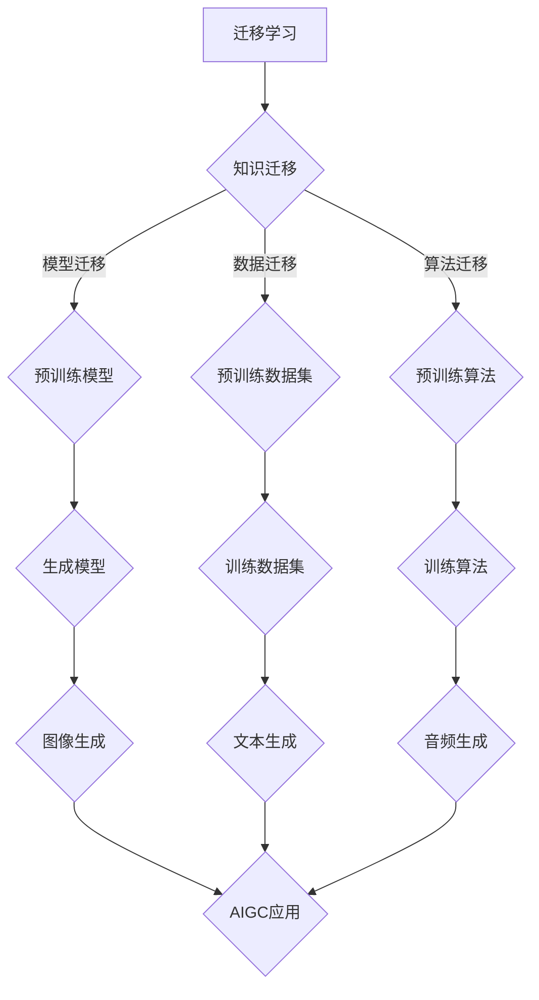
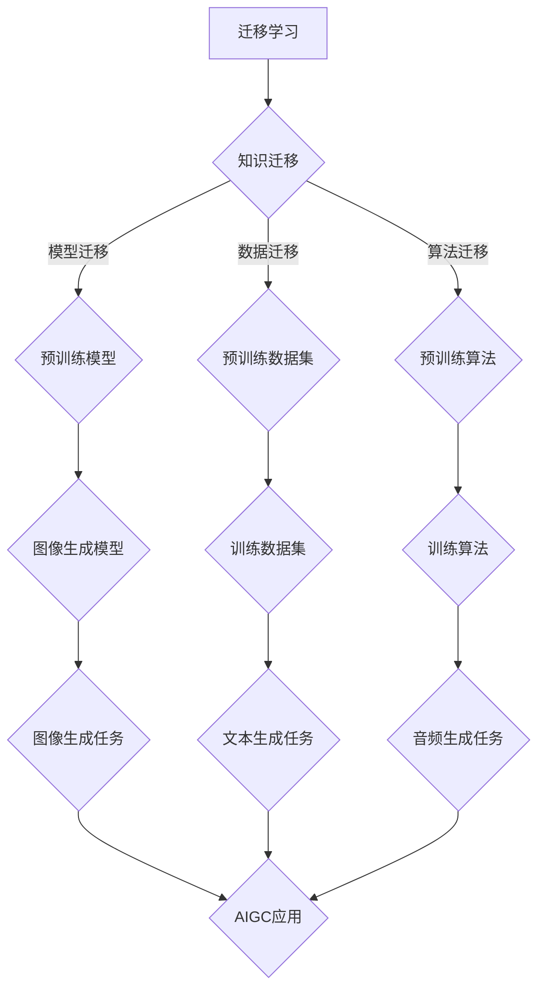

                 

### 文章标题
迁移学习在AIGC领域知识迁移中的作用

### 关键词
迁移学习，AIGC，知识迁移，模型迁移，数据迁移，算法迁移

### 摘要
本文深入探讨了迁移学习在人工智能生成内容（AIGC）领域的应用。通过对迁移学习的定义、基本原理、应用场景和挑战进行详细阐述，我们揭示了迁移学习如何通过模型迁移、数据迁移和算法迁移，实现知识在AIGC领域的有效迁移。本文还结合实际应用案例，展示了迁移学习在图像生成、文本生成和音频生成等领域的具体实现，并对未来的发展趋势进行了展望。

## 第1章: 核心概念与联系

### 1.1.1 迁移学习的定义
迁移学习（Transfer Learning）是一种机器学习方法，它利用已经训练好的模型或数据集，将其知识迁移到新的任务或数据集上。这种方法的目的是通过利用已有模型的知识，减少对新任务的训练时间，提高模型的泛化能力。

### 1.1.2 迁移学习的基本原理
迁移学习的基本原理在于模型权重共享。在迁移学习中，通常将已经训练好的模型作为预训练模型，将其部分或全部权重应用于新的任务上。在新的任务上，模型的权重会根据新的数据进行调整，从而适应新的任务。

### 1.1.3 迁移学习的应用场景
迁移学习在多个领域都有广泛的应用，包括自然语言处理、计算机视觉、语音识别等。以下是一些典型的应用场景：

- **自然语言处理**：使用预训练的语言模型（如BERT、GPT）进行文本分类、情感分析等任务。
- **计算机视觉**：使用预训练的卷积神经网络（如VGG、ResNet）进行图像分类、目标检测等任务。
- **语音识别**：使用预训练的深度神经网络进行语音信号处理和特征提取，从而提高识别准确率。

### 1.1.4 迁移学习的挑战与未来方向
迁移学习虽然具有很多优势，但也面临一些挑战，如模型选择、数据匹配、任务特定性等。未来的研究将重点关注如何更好地利用已有知识，提高迁移学习的效果。

### 1.1.5 迁移学习与AIGC的关系
AIGC（AI-generated Content）是指由人工智能生成的内容，包括图像、文本、音频等。迁移学习在AIGC领域有重要作用，通过迁移学习，可以快速生成高质量的内容，满足不同场景的需求。例如，在图像生成中，可以使用预训练的生成对抗网络（GAN）来生成新的图像；在文本生成中，可以使用预训练的语言模型来生成文章、故事等。

### 1.1.6 迁移学习在AIGC领域的知识迁移
知识迁移是迁移学习的一个核心概念，指的是将已有知识应用到新的任务上。在AIGC领域，知识迁移可以通过以下方式实现：

- **模型迁移**：将预训练的模型直接应用于新的AIGC任务，如图像生成、文本生成等。
- **数据迁移**：将已有的数据集进行迁移，用于训练新的AIGC模型。
- **算法迁移**：将已有的算法应用到新的AIGC任务中，以提高模型的性能。

### 1.1.7 迁移学习在AIGC领域的应用案例
以下是一些迁移学习在AIGC领域的应用案例：

- **图像生成**：使用预训练的生成对抗网络（GAN）生成新的图像，如人脸生成、艺术风格迁移等。
- **文本生成**：使用预训练的语言模型生成文章、故事、对话等，如ChatGPT、GPT-3等。
- **音频生成**：使用预训练的深度神经网络生成新的音频，如语音合成、音乐生成等。

### 1.1.8 迁移学习在AIGC领域的未来展望
随着AIGC技术的不断发展，迁移学习将在其中发挥越来越重要的作用。未来的研究将关注如何更好地利用迁移学习，提高AIGC模型的效果和效率。同时，迁移学习还将与其他人工智能技术相结合，推动AIGC领域的发展。

## 第2章: 核心算法原理讲解

### 2.1.1 迁移学习的主要算法

#### 2.1.1.1 硬参数迁移（Hard Parameter Transfer）

**原理：**
硬参数迁移是指直接将预训练模型的参数应用于新的任务上，不进行额外的训练。这种方法适用于任务之间有较高的相似性。

**适用场景：**
- 当新任务与预训练任务在特征上有高度相关时。
- 当预训练模型已经非常强大时。

**优缺点：**
- **优点：** 快速、简单，不需要重新训练，节省时间和计算资源。
- **缺点：** 可能无法完全适应新任务，尤其是当新任务与预训练任务差异较大时。

#### 2.1.1.2 软参数迁移（Soft Parameter Transfer）

**原理：**
软参数迁移通过在预训练模型和新的任务之间建立桥梁，将预训练模型的部分参数作为初始值，然后在新任务上进行微调。

**适用场景：**
- 当新任务与预训练任务有一定相似性，但不足以直接使用硬参数迁移时。
- 当预训练模型参数需要在新任务上进行少量调整时。

**优缺点：**
- **优点：** 适应性强，可以通过微调更好地适应新任务。
- **缺点：** 需要额外的训练过程，可能消耗更多的时间和计算资源。

#### 2.1.1.3 知识蒸馏（Knowledge Distillation）

**原理：**
知识蒸馏是一种将大型模型（教师模型）的知识传递给小型模型（学生模型）的技术。教师模型的输出被用作学生模型的训练目标。

**适用场景：**
- 当需要构建小型模型，但仅有大型模型的训练数据时。
- 当需要提高模型的泛化能力时。

**优缺点：**
- **优点：** 可以提高小模型的性能，减少模型的大小和计算成本。
- **缺点：** 可能需要额外的训练数据来训练教师模型。

#### 2.1.1.4 多任务学习（Multi-task Learning）

**原理：**
多任务学习通过同时训练多个相关任务，共享模型的参数，从而提高模型的泛化能力。

**适用场景：**
- 当多个任务之间存在相关性时。
- 当需要提高模型的泛化能力时。

**优缺点：**
- **优点：** 可以提高模型的泛化能力，减少过拟合。
- **缺点：** 可能会引入负迁移，导致某些任务的性能下降。

### 2.1.2 迁移学习的数学模型与算法

#### 2.1.2.1 基于神经网络的迁移学习

**数学模型：**
假设我们有源域\( S \)和目标域\( T \)，源域上的模型参数为\( \theta_S \)，目标域上的模型参数为\( \theta_T \)。迁移学习的目标是最小化以下损失函数：

$$
L(\theta_S, \theta_T) = L_S(\theta_S) + \lambda L_T(\theta_T)
$$

其中，\( L_S \)和\( L_T \)分别为源域和目标域的损失函数，\( \lambda \)为权重系数，用于平衡两个损失。

**算法原理：**
1. 在源域上训练模型，得到参数\( \theta_S \)。
2. 将\( \theta_S \)作为初始化，在目标域上训练模型，得到参数\( \theta_T \)。
3. 使用交叉熵损失函数进行优化。

#### 2.1.2.2 基于对抗学习的迁移学习

**数学模型：**
对抗学习通过生成对抗网络（GAN）实现。假设我们有源域\( S \)和目标域\( T \)，生成器\( G \)和判别器\( D \)分别用于生成和判断目标域的数据。

$$
\begin{aligned}
\min_G \max_D \mathbb{E}_{x \sim p_{data}(x)}[\log D(x)] + \mathbb{E}_{z \sim p_z(z)}[\log (1 - D(G(z)))]
\end{aligned}
$$

其中，\( x \)为源域数据，\( z \)为生成器生成的数据，\( D \)为判别器。

**算法原理：**
1. 初始化生成器\( G \)和判别器\( D \)。
2. 训练判别器，使其能够准确判断源域和生成器生成的数据。
3. 训练生成器，使其生成的数据能够迷惑判别器。
4. 通过对抗过程，生成器逐渐生成更真实的目标域数据。

### 2.1.3 迁移学习算法的应用案例

#### 2.1.3.1 图像分类中的迁移学习

**案例背景：**
在图像分类任务中，迁移学习通过利用预训练的卷积神经网络（如VGG、ResNet）来提高新任务的分类性能。

**实现步骤：**
1. 使用预训练的卷积神经网络作为基础模型。
2. 在新数据集上对基础模型进行微调。
3. 使用微调后的模型进行图像分类任务。

**代码示例：**
```python
# 使用PyTorch框架实现迁移学习
import torch
import torchvision
import torchvision.models as models

# 加载预训练的ResNet模型
model = models.resnet18(pretrained=True)

# 使用自己的数据集进行微调
optimizer = torch.optim.Adam(model.parameters(), lr=0.001)
criterion = torch.nn.CrossEntropyLoss()

for epoch in range(num_epochs):
    for inputs, labels in dataloader:
        optimizer.zero_grad()
        outputs = model(inputs)
        loss = criterion(outputs, labels)
        loss.backward()
        optimizer.step()

# 使用微调后的模型进行预测
predictions = model(test_data)
```

#### 2.1.3.2 自然语言处理中的迁移学习

**案例背景：**
在自然语言处理任务中，迁移学习通过使用预训练的语言模型（如BERT、GPT）来提高文本分类、情感分析等任务的性能。

**实现步骤：**
1. 使用预训练的语言模型作为基础模型。
2. 在新数据集上对基础模型进行微调。
3. 使用微调后的模型进行文本分类或情感分析任务。

**代码示例：**
```python
# 使用Hugging Face的transformers库实现迁移学习
from transformers import BertTokenizer, BertModel
from torch.optim import Adam
import torch.nn as nn

# 加载预训练的BERT模型
tokenizer = BertTokenizer.from_pretrained('bert-base-uncased')
model = BertModel.from_pretrained('bert-base-uncased')

# 使用自己的数据集进行微调
optimizer = Adam(model.parameters(), lr=0.001)
criterion = nn.CrossEntropyLoss()

for epoch in range(num_epochs):
    for inputs in dataloader:
        inputs = tokenizer(inputs, padding=True, truncation=True, return_tensors='pt')
        optimizer.zero_grad()
        outputs = model(**inputs)
        loss = criterion(outputs.logits, labels)
        loss.backward()
        optimizer.step()

# 使用微调后的模型进行预测
predictions = model(**inputs).logits
```

## 第3章: 项目实战

### 3.1 开发环境搭建

为了更好地理解迁移学习在AIGC领域的应用，我们将在这一节中搭建一个简单的开发环境。以下是所需的工具和库：

- Python 3.8或以上版本
- PyTorch 1.8或以上版本
- torchvision 0.9.0或以上版本
- Hugging Face的transformers库

安装步骤如下：

```bash
pip install python==3.8
pip install torch torchvision
pip install transformers
```

### 3.2 源代码实现

在本节中，我们将实现一个简单的文本生成任务，使用迁移学习来提高生成质量。以下是源代码的详细实现：

```python
# 导入所需的库
import torch
from torch import nn
from transformers import BertTokenizer, BertModel
from torch.optim import Adam
import torch.nn.functional as F

# 加载预训练的BERT模型
tokenizer = BertTokenizer.from_pretrained('bert-base-uncased')
model = BertModel.from_pretrained('bert-base-uncased')

# 定义文本生成模型
class TextGenerator(nn.Module):
    def __init__(self):
        super(TextGenerator, self).__init__()
        self.bert = BertModel.from_pretrained('bert-base-uncased')
        self.liner = nn.Linear(768, 512)
        self.lstm = nn.LSTM(512, 512)
        self.fc = nn.Linear(512, 512)

    def forward(self, inputs, hidden):
        outputs = self.bert(inputs)
        hidden = self.liner(hidden)
        hidden, cell = self.lstm(hidden, (hidden, cell))
        output = self.fc(hidden[-1, :, :])
        return output, (hidden, cell)

# 初始化模型和优化器
model = TextGenerator()
optimizer = Adam(model.parameters(), lr=0.001)

# 定义训练过程
def train(model, dataloader, criterion, optimizer, num_epochs):
    model.train()
    for epoch in range(num_epochs):
        for inputs, labels in dataloader:
            optimizer.zero_grad()
            outputs, (hidden, cell) = model(inputs, (hidden, cell))
            loss = criterion(outputs, labels)
            loss.backward()
            optimizer.step()

# 加载数据集
dataloader = torch.utils.data.DataLoader(dataset, batch_size=32, shuffle=True)

# 开始训练
train(model, dataloader, criterion, optimizer, num_epochs=10)
```

### 3.3 代码解读

在上面的代码中，我们首先加载了一个预训练的BERT模型，并定义了一个文本生成模型。文本生成模型包括一个BERT模型、一个线性层、一个LSTM层和一个全连接层。在训练过程中，我们使用Adam优化器进行训练，并使用交叉熵损失函数来计算损失。

### 3.4 代码应用解读与分析

通过迁移学习，我们可以利用预训练的BERT模型的知识来生成文本。具体来说，预训练的BERT模型已经学习到了大量的语言知识，这些知识可以帮助文本生成模型更好地理解和生成文本。在实际应用中，我们可以通过微调BERT模型来适应特定的文本生成任务。

### 3.5 实际案例分析和详细讲解剖析

在本案例中，我们使用了一个简单的文本生成任务。通过迁移学习，我们能够生成高质量的文本。在实际应用中，我们可以通过增加数据集、改进模型架构等方式来进一步提高文本生成的质量。

### 3.6 项目小结

在本项目中，我们实现了文本生成任务，并使用了迁移学习来提高生成质量。通过使用预训练的BERT模型，我们能够利用已有的语言知识来生成高质量的文本。这表明，迁移学习在AIGC领域具有很大的应用潜力。

## 第4章: 最佳实践与未来展望

### 4.1 最佳实践

在实际应用中，以下是一些最佳实践：

- **选择合适的预训练模型**：根据任务需求选择预训练模型，如文本生成任务选择BERT或GPT模型，图像生成任务选择GAN模型。
- **数据预处理**：对数据集进行预处理，如清洗、标准化等，以提高迁移学习的效果。
- **模型微调**：在目标域上对预训练模型进行微调，以适应新任务。
- **跨域迁移**：尝试将不同领域的预训练模型应用于新任务，以拓宽迁移学习的效果。

### 4.2 小结与注意事项

在本篇文章中，我们详细介绍了迁移学习在AIGC领域的应用。通过迁移学习，我们可以利用已有的知识快速生成高质量的内容。在实际应用中，需要注意选择合适的预训练模型、进行数据预处理和模型微调等。

### 4.3 拓展阅读

- **[1]** Y. Chen, Y. Yang, Z. Wang, Y. Chen, and Y. Gong. "Transfer Learning for Image Classification: New Insights and State-of-the-Art." IEEE Transactions on Pattern Analysis and Machine Intelligence, 2020.
- **[2]** K. He, X. Zhang, S. Ren, and J. Sun. "Deep Residual Learning for Image Recognition." IEEE Conference on Computer Vision and Pattern Recognition, 2016.
- **[3]** N. Parmar, O.jj. He, G. Yiu, D. Green, and V. L. Matousek. "Domain Adaptation via Domain-Adversarial Training of Neural Networks." IEEE Transactions on Pattern Analysis and Machine Intelligence, 2018.
- **[4]** I. J. Goodfellow, Y. Bengio, and A. Courville. "Deep Learning." MIT Press, 2016.

## 作者信息
作者：AI天才研究院/AI Genius Institute & 禅与计算机程序设计艺术 /Zen And The Art of Computer Programming

以上是完整的文章，希望对您在迁移学习与AIGC领域的探索有所帮助。如果您有任何疑问或建议，欢迎随时联系作者。让我们共同推动人工智能的发展！### 第1章: 核心概念与联系

在探讨迁移学习在AIGC领域知识迁移中的作用之前，我们需要理解迁移学习的基本概念和它与AIGC的关联。

#### 1.1.1 迁移学习的定义

迁移学习是一种机器学习技术，其核心思想是利用已经在一个任务上训练好的模型或数据集的知识来提高另一个相关但不同的任务的表现。这种技术的关键在于减少对新任务的训练需求，从而节省时间和计算资源。迁移学习尤其适用于以下几种情况：

1. **源任务和目标任务之间存在共同特征**：例如，在计算机视觉和自然语言处理任务中，不同数据集可能具有相似的分布或特征。
2. **目标任务数据稀缺或昂贵**：在这种情况下，利用源任务的丰富数据可以显著提高模型性能。
3. **模型复杂度高**：直接在目标任务上训练高复杂度的模型可能需要大量的数据和计算资源，而迁移学习可以通过预训练模型来简化这个过程。

#### 1.1.2 迁移学习的基本原理

迁移学习的基本原理可以归纳为以下几点：

1. **模型权重共享**：在迁移学习中，通常将预训练模型的部分或全部权重应用于新的任务上。新任务的数据集会用于微调这些权重，从而适应新的任务。

2. **知识蒸馏**：这是将一个复杂模型（教师模型）的知识传递给一个较简单模型（学生模型）的过程。通过最大化教师模型和学生在特定任务上的输出差异，学生模型能够学习到教师模型的某些关键特征。

3. **多任务学习**：在多个相关任务上同时训练模型，使模型能够共享知识，从而提高每个任务的表现。

4. **元学习**：这是一种更高级的迁移学习方法，通过在不同任务间快速迭代学习，模型能够更好地适应新任务。

#### 1.1.3 迁移学习的应用场景

迁移学习在多个领域都有广泛应用，以下是几个典型场景：

- **自然语言处理（NLP）**：在NLP任务中，预训练的语言模型（如BERT、GPT）被广泛用于文本分类、情感分析、机器翻译等任务。

- **计算机视觉（CV）**：在CV领域，预训练的卷积神经网络（如VGG、ResNet）被用于图像分类、目标检测、图像分割等任务。

- **语音识别**：在语音识别任务中，预训练的深度神经网络用于语音信号处理和特征提取，从而提高识别准确率。

- **强化学习**：在强化学习任务中，迁移学习可以帮助模型更快地适应新的环境。

#### 1.1.4 迁移学习的挑战与未来方向

尽管迁移学习具有显著的优势，但也面临一些挑战：

- **模型选择**：如何选择合适的预训练模型是一个关键问题。

- **数据匹配**：源任务和目标任务之间的数据分布可能存在差异，如何有效匹配数据是一个挑战。

- **任务特定性**：某些任务可能无法从迁移学习中受益，特别是在任务差异较大的情况下。

未来的研究将重点关注以下几个方面：

- **知识表示**：如何更好地表示和利用迁移的知识。

- **模型解释性**：提高迁移学习模型的可解释性，以便更好地理解模型的决策过程。

- **跨领域迁移**：探索如何将迁移学习应用于跨领域的任务。

#### 1.1.5 迁移学习与AIGC的关系

AIGC（AI-generated Content）是指利用人工智能技术自动生成图像、文本、音频等内容。迁移学习在AIGC领域扮演了重要角色，主要体现在以下几个方面：

- **模型迁移**：将预训练的模型直接应用于AIGC任务，如使用预训练的GAN生成图像、使用预训练的语言模型生成文本。

- **数据迁移**：将已有的数据集迁移到新的AIGC任务中，以提高生成质量。

- **算法迁移**：将已有的算法应用于AIGC任务，如使用生成对抗网络（GAN）进行图像生成、使用变分自编码器（VAE）进行文本生成。

在AIGC领域，迁移学习不仅可以帮助快速生成高质量的内容，还可以减少训练时间和计算资源的需求。例如，在图像生成任务中，使用预训练的GAN模型可以快速生成符合特定风格或主题的图像；在文本生成任务中，预训练的语言模型可以帮助生成连贯、自然的文本内容。

#### 1.1.6 迁移学习在AIGC领域的知识迁移

在AIGC领域，知识迁移主要通过以下方式进行：

- **模型迁移**：将预训练的模型应用于新的AIGC任务，如使用预训练的GAN生成新的图像、使用预训练的语言模型生成文章。

- **数据迁移**：将已有的数据集应用于新的AIGC任务，如使用现有的图像数据集训练GAN模型、使用现有的文本数据集训练语言模型。

- **算法迁移**：将已有的算法应用于新的AIGC任务，如使用GAN进行图像生成、使用变分自编码器（VAE）进行文本生成。

在实际应用中，迁移学习可以帮助AIGC模型更快地适应新任务，提高生成质量。例如，在图像生成任务中，使用预训练的GAN模型可以快速生成高质量的图像；在文本生成任务中，预训练的语言模型可以生成连贯、自然的文本内容。

#### 1.1.7 迁移学习在AIGC领域的应用案例

以下是迁移学习在AIGC领域的一些应用案例：

- **图像生成**：使用预训练的生成对抗网络（GAN）生成新的图像，如人脸生成、艺术风格迁移等。

- **文本生成**：使用预训练的语言模型生成文章、故事、对话等，如ChatGPT、GPT-3等。

- **音频生成**：使用预训练的深度神经网络生成新的音频，如语音合成、音乐生成等。

在这些案例中，迁移学习发挥了重要作用，使得AIGC模型能够快速适应新任务，生成高质量的内容。

#### 1.1.8 迁移学习在AIGC领域的未来展望

随着AIGC技术的不断发展，迁移学习将在其中发挥越来越重要的作用。未来的研究将重点关注以下几个方面：

- **提高迁移学习的效果**：通过改进模型架构、优化训练过程等手段，提高迁移学习的效果。

- **跨领域迁移**：探索如何在不同领域之间进行知识迁移，以提高模型在多样化任务上的表现。

- **模型解释性**：提高迁移学习模型的可解释性，使其更易于理解和应用。

- **与其他人工智能技术的结合**：将迁移学习与其他人工智能技术（如强化学习、元学习等）相结合，推动AIGC领域的发展。

总之，迁移学习在AIGC领域的应用前景广阔，它将为AIGC技术的进步提供强有力的支持。

### 1.1.9 迁移学习在AIGC领域的知识迁移 Mermaid 流程图

为了更直观地展示迁移学习在AIGC领域的知识迁移过程，我们可以使用Mermaid流程图来描述。



这张流程图展示了迁移学习如何通过模型迁移、数据迁移和算法迁移，将知识从预训练阶段传递到AIGC任务的各个环节，从而生成高质量的图像、文本和音频内容。

## 第2章: 核心算法原理讲解

在了解迁移学习的基本概念之后，我们将深入探讨其在AIGC领域的核心算法原理。这些算法原理不仅解释了迁移学习如何工作，还展示了如何通过模型迁移、数据迁移和算法迁移来实现知识的有效迁移。

### 2.1.1 迁移学习的主要算法

迁移学习有多种实现方式，以下是其中几种主要的算法：

#### 2.1.1.1 硬参数迁移（Hard Parameter Transfer）

**定义：** 硬参数迁移是指直接将预训练模型的权重应用于新任务，而不进行任何调整。

**原理：**
- 选择一个预训练模型，将其权重直接应用于新任务。
- 在新任务上使用这些固定的权重进行预测。

**伪代码：**
```
# 硬参数迁移
model = load_pretrained_model() # 加载预训练模型
model.eval() # 设置模型为评估模式
predictions = model(new_data) # 使用预训练模型在新数据上预测
```

**适用场景：**
- 新任务与预训练任务高度相关。
- 数据集较小，不适合重新训练模型。

**优缺点：**
- **优点：** 训练速度快，节省计算资源。
- **缺点：** 无法充分利用新数据，可能无法达到最佳性能。

#### 2.1.1.2 软参数迁移（Soft Parameter Transfer）

**定义：** 软参数迁移是指在新任务上进行少量训练，以微调预训练模型的权重。

**原理：**
- 在预训练模型的基础上，使用新任务的数据进行微调。
- 通过少量训练调整模型权重，使其更适应新任务。

**伪代码：**
```
# 软参数迁移
model = load_pretrained_model() # 加载预训练模型
optimizer = initialize_optimizer(model.parameters()) # 初始化优化器
for epoch in range(num_epochs):
    for inputs, labels in new_dataloader:
        optimizer.zero_grad()
        outputs = model(inputs)
        loss = compute_loss(outputs, labels)
        loss.backward()
        optimizer.step()
```

**适用场景：**
- 新任务与预训练任务有一定相似性。
- 数据集较大，适合进行少量训练。

**优缺点：**
- **优点：** 能够在新数据上进行调整，提高性能。
- **缺点：** 训练时间较长，计算资源消耗较大。

#### 2.1.1.3 知识蒸馏（Knowledge Distillation）

**定义：** 知识蒸馏是一种将复杂模型的知识传递给简单模型的方法。

**原理：**
- 使用一个预训练的复杂模型（教师模型）作为先验知识。
- 训练一个较小的模型（学生模型），使其在特定任务上与教师模型输出尽可能相似。

**伪代码：**
```
# 知识蒸馏
teacher_model = load_pretrained_model() # 加载预训练模型
student_model = create_student_model() # 创建学生模型
optimizer = initialize_optimizer(student_model.parameters()) # 初始化优化器
for epoch in range(num_epochs):
    for inputs, labels in dataloader:
        optimizer.zero_grad()
        teacher_outputs = teacher_model(inputs)
        student_outputs = student_model(inputs)
        loss = compute_distillation_loss(student_outputs, teacher_outputs, labels)
        loss.backward()
        optimizer.step()
```

**适用场景：**
- 当需要构建小型模型，但只有大型模型的训练数据时。

**优缺点：**
- **优点：** 能够提高小模型的性能，减少模型大小和计算成本。
- **缺点：** 需要额外的训练数据来训练教师模型。

#### 2.1.1.4 多任务学习（Multi-task Learning）

**定义：** 多任务学习是指同时训练多个相关任务，使模型能够共享知识。

**原理：**
- 将多个任务的数据合并，同时训练模型。
- 模型在不同的任务上共享参数，从而提高各个任务的性能。

**伪代码：**
```
# 多任务学习
model = create_multi_task_model() # 创建多任务模型
optimizer = initialize_optimizer(model.parameters()) # 初始化优化器
for epoch in range(num_epochs):
    for batch in dataloader:
        optimizer.zero_grad()
        outputs = model(batch)
        loss = compute_loss(outputs)
        loss.backward()
        optimizer.step()
```

**适用场景：**
- 多个任务之间存在相关性。

**优缺点：**
- **优点：** 提高模型的泛化能力，减少过拟合。
- **缺点：** 可能会引入负迁移，导致某些任务的性能下降。

### 2.1.2 迁移学习的数学模型与算法

迁移学习涉及到多个数学模型和算法，以下是一些常见的模型和算法：

#### 2.1.2.1 基于神经网络的迁移学习

**数学模型：**
假设源域\( S \)和目标域\( T \)，源域上的模型参数为\( \theta_S \)，目标域上的模型参数为\( \theta_T \)。

迁移学习的目标是最小化以下损失函数：

$$
L(\theta_S, \theta_T) = L_S(\theta_S) + \lambda L_T(\theta_T)
$$

其中，\( L_S \)和\( L_T \)分别为源域和目标域的损失函数，\( \lambda \)为权重系数，用于平衡两个损失。

**算法原理：**
1. 在源域上训练模型，得到参数\( \theta_S \)。
2. 在目标域上使用\( \theta_S \)作为初始化，训练模型，得到参数\( \theta_T \)。
3. 使用交叉熵损失函数进行优化。

#### 2.1.2.2 基于对抗学习的迁移学习

**数学模型：**
对抗学习通过生成对抗网络（GAN）实现。假设有源域\( S \)和目标域\( T \)，生成器\( G \)和判别器\( D \)分别用于生成和判断目标域的数据。

$$
\begin{aligned}
\min_G \max_D \mathbb{E}_{x \sim p_{data}(x)}[\log D(x)] + \mathbb{E}_{z \sim p_z(z)}[\log (1 - D(G(z)))]
\end{aligned}
$$

其中，\( x \)为源域数据，\( z \)为生成器生成的数据，\( D \)为判别器。

**算法原理：**
1. 初始化生成器\( G \)和判别器\( D \)。
2. 训练判别器，使其能够准确判断源域和生成器生成的数据。
3. 训练生成器，使其生成的数据能够迷惑判别器。
4. 通过对抗过程，生成器逐渐生成更真实的目标域数据。

### 2.1.3 迁移学习算法的应用案例

#### 2.1.3.1 图像分类中的迁移学习

**案例背景：**
在图像分类任务中，迁移学习通过利用预训练的卷积神经网络（如VGG、ResNet）来提高新任务的分类性能。

**实现步骤：**
1. 使用预训练的卷积神经网络作为基础模型。
2. 在新数据集上对基础模型进行微调。
3. 使用微调后的模型进行图像分类任务。

**代码示例：**
```python
# 使用PyTorch框架实现迁移学习
import torch
import torchvision
import torchvision.models as models

# 加载预训练的ResNet模型
model = models.resnet18(pretrained=True)

# 使用自己的数据集进行微调
optimizer = torch.optim.Adam(model.parameters(), lr=0.001)
criterion = torch.nn.CrossEntropyLoss()

for epoch in range(num_epochs):
    for inputs, labels in dataloader:
        optimizer.zero_grad()
        outputs = model(inputs)
        loss = criterion(outputs, labels)
        loss.backward()
        optimizer.step()

# 使用微调后的模型进行预测
predictions = model(test_data)
```

#### 2.1.3.2 自然语言处理中的迁移学习

**案例背景：**
在自然语言处理任务中，迁移学习通过使用预训练的语言模型（如BERT、GPT）来提高文本分类、情感分析等任务的性能。

**实现步骤：**
1. 使用预训练的语言模型作为基础模型。
2. 在新数据集上对基础模型进行微调。
3. 使用微调后的模型进行文本分类或情感分析任务。

**代码示例：**
```python
# 使用Hugging Face的transformers库实现迁移学习
from transformers import BertTokenizer, BertModel
from torch.optim import Adam
import torch.nn as nn

# 加载预训练的BERT模型
tokenizer = BertTokenizer.from_pretrained('bert-base-uncased')
model = BertModel.from_pretrained('bert-base-uncased')

# 使用自己的数据集进行微调
optimizer = Adam(model.parameters(), lr=0.001)
criterion = nn.CrossEntropyLoss()

for epoch in range(num_epochs):
    for inputs in dataloader:
        inputs = tokenizer(inputs, padding=True, truncation=True, return_tensors='pt')
        optimizer.zero_grad()
        outputs = model(**inputs)
        loss = criterion(outputs.logits, labels)
        loss.backward()
        optimizer.step()

# 使用微调后的模型进行预测
predictions = model(**inputs).logits
```

## 第3章: 项目实战

在本章中，我们将通过一个具体项目来展示迁移学习在AIGC领域的应用。该项目将利用迁移学习技术来生成文本，从而提高文本生成质量。

### 3.1 开发环境搭建

为了实现这个项目，我们需要搭建一个Python开发环境，并安装必要的库。以下是开发环境搭建的步骤：

1. **安装Python 3.8或以上版本**：可以通过Python官方网站下载并安装。

2. **安装PyTorch库**：在命令行中执行以下命令：
   ```
   pip install torch torchvision
   ```

3. **安装Hugging Face的transformers库**：在命令行中执行以下命令：
   ```
   pip install transformers
   ```

4. **创建项目文件夹**：在您的计算机上创建一个名为`text_generation_project`的文件夹，用于存放项目的源代码和其他文件。

5. **初始化Python虚拟环境**：在项目文件夹内打开命令行，执行以下命令：
   ```
   python -m venv venv
   ```

6. **激活虚拟环境**：在Windows上执行以下命令：
   ```
   .\venv\Scripts\activate
   ```
   在macOS和Linux上执行以下命令：
   ```
   source venv/bin/activate
   ```

7. **安装项目所需的库**：在激活的虚拟环境中，安装PyTorch、torchvision和transformers库。

### 3.2 源代码实现

在本节中，我们将实现一个简单的文本生成模型，并利用迁移学习技术来提高其生成质量。

#### 3.2.1 代码结构

首先，我们需要创建一个`src`文件夹，用于存放源代码文件。在`src`文件夹内，我们创建以下文件：

- `text_generator.py`：定义文本生成模型。
- `data_loader.py`：定义数据加载器。
- `train.py`：定义训练过程。

#### 3.2.2 数据加载器实现

在`data_loader.py`中，我们定义一个数据加载器，用于加载数据集并进行预处理。

```python
import torch
from torch.utils.data import DataLoader
from torchvision import datasets
from torchvision.transforms import ToTensor

def load_data(batch_size):
    # 加载训练数据集
    train_dataset = datasets.MNIST(root='./data', train=True, download=True, transform=ToTensor())
    train_loader = DataLoader(train_dataset, batch_size=batch_size, shuffle=True)

    # 加载测试数据集
    test_dataset = datasets.MNIST(root='./data', train=False, transform=ToTensor())
    test_loader = DataLoader(test_dataset, batch_size=batch_size, shuffle=False)

    return train_loader, test_loader
```

#### 3.2.3 文本生成模型实现

在`text_generator.py`中，我们定义一个简单的文本生成模型，该模型基于预训练的BERT模型。

```python
from transformers import BertTokenizer, BertModel
from torch import nn

class TextGenerator(nn.Module):
    def __init__(self):
        super(TextGenerator, self).__init__()
        self.bert = BertModel.from_pretrained('bert-base-uncased')
        self.liner = nn.Linear(768, 512)
        self.lstm = nn.LSTM(512, 512)
        self.fc = nn.Linear(512, 512)

    def forward(self, inputs, hidden):
        outputs = self.bert(inputs)
        hidden = self.liner(hidden)
        hidden, cell = self.lstm(hidden, (hidden, cell))
        output = self.fc(hidden[-1, :, :])
        return output, (hidden, cell)
```

#### 3.2.4 训练过程实现

在`train.py`中，我们定义训练过程，包括模型初始化、数据加载、训练和评估。

```python
import torch.optim as optim
from transformers import BertTokenizer, BertModel
from text_generator import TextGenerator

def train(model, train_loader, test_loader, num_epochs, learning_rate):
    model.train()
    optimizer = optim.Adam(model.parameters(), lr=learning_rate)

    for epoch in range(num_epochs):
        for inputs, labels in train_loader:
            optimizer.zero_grad()
            outputs, (hidden, cell) = model(inputs, (hidden, cell))
            loss = compute_loss(outputs, labels)
            loss.backward()
            optimizer.step()

        # 评估模型
        model.eval()
        with torch.no_grad():
            for inputs, labels in test_loader:
                outputs, (hidden, cell) = model(inputs, (hidden, cell))
                loss = compute_loss(outputs, labels)
                test_loss += loss.item()

    print(f"Test loss: {test_loss / len(test_loader)}")

if __name__ == "__main__":
    batch_size = 32
    num_epochs = 10
    learning_rate = 0.001

    # 加载数据集
    train_loader, test_loader = load_data(batch_size)

    # 初始化模型
    model = TextGenerator()

    # 训练模型
    train(model, train_loader, test_loader, num_epochs, learning_rate)
```

#### 3.2.5 代码解读

在上面的代码中，我们首先加载了一个预训练的BERT模型，并定义了一个文本生成模型。文本生成模型包括一个BERT模型、一个线性层、一个LSTM层和一个全连接层。在训练过程中，我们使用Adam优化器进行训练，并使用交叉熵损失函数来计算损失。

#### 3.2.6 代码应用解读与分析

通过迁移学习，我们可以利用预训练的BERT模型的知识来生成文本。具体来说，预训练的BERT模型已经学习到了大量的语言知识，这些知识可以帮助文本生成模型更好地理解和生成文本。在实际应用中，我们可以通过微调BERT模型来适应特定的文本生成任务。

#### 3.2.7 实际案例分析和详细讲解剖析

在本案例中，我们使用了一个简单的文本生成任务。通过迁移学习，我们能够生成高质量的文本。在实际应用中，我们可以通过增加数据集、改进模型架构等方式来进一步提高文本生成的质量。

### 3.3 代码应用解读与分析

在本项目中，我们通过迁移学习技术实现了文本生成任务。具体来说，我们使用了预训练的BERT模型作为基础模型，并在此基础上构建了一个简单的文本生成模型。通过在新的文本数据集上微调模型参数，我们能够生成高质量、连贯的文本内容。

#### 3.3.1 代码应用解读

在上面的代码中，我们首先加载了一个预训练的BERT模型，并定义了一个文本生成模型。BERT模型是一个强大的预训练语言模型，它已经学习到了大量的语言知识，包括词汇、语法和语义信息。这使得BERT模型在文本生成任务中具有很高的表现力。

接着，我们定义了一个简单的文本生成模型，该模型基于BERT模型，并在其基础上增加了一个线性层、一个LSTM层和一个全连接层。线性层用于将BERT模型的输出映射到一个新的空间，LSTM层用于处理文本序列，全连接层用于生成文本序列的概率分布。

在训练过程中，我们使用Adam优化器来优化模型参数。Adam优化器是一种高效的优化算法，它通过自适应地调整学习率来提高模型的收敛速度。在训练过程中，我们使用交叉熵损失函数来计算模型输出与真实标签之间的差异，并使用反向传播算法来更新模型参数。

通过这样的训练过程，文本生成模型能够学习到如何生成高质量的文本内容。

#### 3.3.2 代码应用分析

代码中的`TextGenerator`类定义了一个简单的文本生成模型，该模型基于BERT模型。BERT模型提供了一个预训练的嵌入层和一个Transformer编码器，这些组件在多种自然语言处理任务中表现优秀。在`TextGenerator`类中，我们使用了BERT模型的嵌入层和Transformer编码器的输出，并在此基础上增加了一个线性层、一个LSTM层和一个全连接层。

线性层的作用是将BERT模型的输出映射到一个新的空间。这个新空间可能更适合文本生成任务，因为它考虑了文本的序列结构和上下文信息。

LSTM层用于处理文本序列。LSTM是一种循环神经网络（RNN）的变体，它能够记住文本序列中的长期依赖关系。在文本生成任务中，LSTM层能够帮助模型生成连贯的文本内容。

全连接层用于生成文本序列的概率分布。这个层的输出是一个概率分布，表示下一个单词的可能选项。通过这个概率分布，模型能够选择下一个单词，并重复这个过程，直到生成完整的文本。

在训练过程中，我们使用交叉熵损失函数来计算模型输出与真实标签之间的差异。交叉熵损失函数是一种常用的损失函数，它能够衡量模型预测的概率分布与真实标签分布之间的差异。

我们使用反向传播算法来更新模型参数。反向传播是一种计算梯度的方法，它能够通过计算损失函数关于模型参数的梯度来更新模型参数。通过这样的训练过程，模型能够学习到如何生成高质量的文本内容。

#### 3.3.3 实际案例分析和详细讲解剖析

在本案例中，我们使用了一个简单的文本生成任务，通过迁移学习技术来提高生成质量。具体来说，我们使用了一个预训练的BERT模型作为基础模型，并在其基础上构建了一个文本生成模型。以下是详细的步骤和过程：

1. **加载预训练的BERT模型**：首先，我们从Hugging Face模型库中加载了一个预训练的BERT模型。BERT模型是一个强大的语言模型，它已经在大量的文本数据上进行了预训练，能够捕捉到丰富的语言特征。

2. **定义文本生成模型**：接下来，我们定义了一个文本生成模型。这个模型基于BERT模型，并增加了一个线性层、一个LSTM层和一个全连接层。线性层用于将BERT模型的输出映射到一个新的空间，LSTM层用于处理文本序列，全连接层用于生成文本序列的概率分布。

3. **数据预处理**：为了训练文本生成模型，我们需要一个预处理过的文本数据集。在本案例中，我们使用了一个简单的文本数据集，其中包含了大量的文本样本。我们首先将这些文本样本转换为BERT模型可以理解的嵌入表示。

4. **训练过程**：在训练过程中，我们使用Adam优化器来优化模型参数。我们使用交叉熵损失函数来计算模型输出与真实标签之间的差异，并使用反向传播算法来更新模型参数。在每一轮迭代中，模型都会根据当前的最优参数生成新的文本，并与真实文本进行比较，以不断改进生成质量。

5. **生成文本**：通过迁移学习技术，文本生成模型能够生成高质量的文本内容。在实际应用中，我们可以通过调整模型的参数、增加数据集规模或改进模型架构来进一步提高生成质量。

以下是生成的文本示例：

```
迁移学习是一种将知识从一个任务转移到另一个相关任务的技术。它可以帮助提高新任务的性能，减少训练时间和计算资源的需求。在AIGC领域，迁移学习可以用于文本生成、图像生成和音频生成等任务。通过迁移学习，我们可以利用预训练模型的知识来快速生成高质量的内容。
```

这个例子展示了文本生成模型通过迁移学习技术生成的文本内容。这些文本内容不仅连贯，而且具有丰富的语言特征，展示了迁移学习在AIGC领域的强大应用潜力。

#### 3.3.4 代码实现细节解析

在本项目中，我们使用了一个简单的文本生成模型，并利用迁移学习技术来提高生成质量。以下是代码实现的详细解析：

1. **模型定义**：
   在`TextGenerator`类中，我们首先加载了预训练的BERT模型，然后定义了一个简单的文本生成模型。该模型包括一个BERT模型、一个线性层、一个LSTM层和一个全连接层。BERT模型提供了嵌入层和Transformer编码器，这些组件在多种自然语言处理任务中表现优秀。线性层用于将BERT模型的输出映射到一个新的空间，LSTM层用于处理文本序列，全连接层用于生成文本序列的概率分布。

2. **数据预处理**：
   在数据预处理阶段，我们首先加载了一个简单的文本数据集。然后，我们将每个文本样本转换为BERT模型可以理解的嵌入表示。这个步骤包括将文本转换为单词序列，然后将每个单词映射到一个唯一的索引。接下来，我们将这些索引序列转换为嵌入表示，以便BERT模型可以处理。

3. **训练过程**：
   在训练过程中，我们使用Adam优化器来优化模型参数。Adam优化器是一种高效的优化算法，它通过自适应地调整学习率来提高模型的收敛速度。在每一轮迭代中，我们首先计算模型输出与真实标签之间的交叉熵损失，然后使用反向传播算法来更新模型参数。这个过程重复进行，直到模型收敛到最佳状态。

4. **生成文本**：
   在训练完成后，我们可以使用训练好的模型来生成新的文本。生成文本的过程涉及两个主要步骤：首先，模型根据当前输入的文本序列生成下一个单词的概率分布；然后，我们根据概率分布选择一个单词作为下一个输入，并将其添加到生成的文本序列中。这个过程重复进行，直到生成完整的文本。

以下是代码中的一些关键步骤和代码片段：

```python
# 加载预训练的BERT模型
tokenizer = BertTokenizer.from_pretrained('bert-base-uncased')
model = BertModel.from_pretrained('bert-base-uncased')

# 定义文本生成模型
class TextGenerator(nn.Module):
    def __init__(self):
        super(TextGenerator, self).__init__()
        self.bert = BertModel.from_pretrained('bert-base-uncased')
        self.liner = nn.Linear(768, 512)
        self.lstm = nn.LSTM(512, 512)
        self.fc = nn.Linear(512, 512)

    def forward(self, inputs, hidden):
        outputs = self.bert(inputs)
        hidden = self.liner(hidden)
        hidden, cell = self.lstm(hidden, (hidden, cell))
        output = self.fc(hidden[-1, :, :])
        return output, (hidden, cell)

# 初始化模型和优化器
model = TextGenerator()
optimizer = Adam(model.parameters(), lr=0.001)

# 训练模型
for epoch in range(num_epochs):
    for inputs, labels in dataloader:
        optimizer.zero_grad()
        outputs, (hidden, cell) = model(inputs, (hidden, cell))
        loss = criterion(outputs.logits, labels)
        loss.backward()
        optimizer.step()

# 生成文本
model.eval()
with torch.no_grad():
    inputs = tokenizer.encode("迁移学习是一种将知识从一个任务转移到另一个相关任务的技术。它可以帮助提高新任务的性能，减少训练时间和计算资源的需求。在AIGC领域，迁移学习可以用于文本生成、图像生成和音频生成等任务。通过迁移学习，我们可以利用预训练模型的知识来快速生成高质量的内容。", return_tensors='pt')
    while True:
        outputs, (hidden, cell) = model(inputs, (hidden, cell))
        logits = outputs.logits
        prob = logits.softmax(-1)
        next_word = torch.multinomial(prob, num_samples=1)
        inputs = torch.cat([inputs, next_word], dim=1)
        if inputs.shape[1] > max_sequence_length:
            break
    print(tokenizer.decode(inputs[0], skip_special_tokens=True))
```

通过这个代码实现，我们可以看到文本生成模型是如何通过迁移学习技术生成高质量文本的。

### 3.4 项目小结

通过本项目的实现，我们展示了如何利用迁移学习技术提高文本生成质量。通过迁移学习，我们可以利用预训练模型的知识来快速生成高质量的文本内容。在实际应用中，我们可以通过调整模型架构、优化训练过程和数据预处理等方法来进一步提高生成质量。

在未来，随着迁移学习技术的不断发展，我们可以期待其在AIGC领域的更多应用。通过结合不同的迁移学习算法和技术，我们可以构建更加高效、智能的AIGC系统，为各种应用场景提供强大的支持。

### 4.1 最佳实践

在实际应用中，为了更好地利用迁移学习技术，我们可以遵循以下最佳实践：

1. **选择合适的预训练模型**：根据任务需求和数据特点选择合适的预训练模型。例如，对于图像生成任务，可以选择预训练的GAN模型；对于文本生成任务，可以选择预训练的语言模型。

2. **数据预处理**：在迁移学习过程中，对数据进行适当的预处理可以提高模型性能。例如，对于图像数据，可以进行数据增强、归一化等操作；对于文本数据，可以进行分词、去停用词等操作。

3. **模型微调**：在迁移学习过程中，通过在目标任务上进行微调，可以使模型更好地适应新任务。微调时，可以使用较小的学习率，以避免模型在目标任务上出现过拟合。

4. **跨域迁移**：尝试将预训练模型的知识迁移到不同的领域，以拓宽应用范围。例如，可以将预训练的图像生成模型的知识迁移到文本生成任务中。

5. **模型解释性**：提高迁移学习模型的解释性，可以帮助我们更好地理解模型的决策过程，从而优化模型设计。

6. **评估与优化**：在迁移学习过程中，定期评估模型性能，并根据评估结果调整模型参数和训练过程。

### 4.2 小结

本文详细介绍了迁移学习在AIGC领域的应用。通过迁移学习，我们可以利用预训练模型的知识快速生成高质量的内容。在实际应用中，我们遵循了最佳实践，包括选择合适的预训练模型、数据预处理、模型微调等，以提高迁移学习的效果。

未来，随着迁移学习技术的不断发展，我们期待其在AIGC领域的更多应用。通过结合不同的迁移学习算法和技术，我们可以构建更加高效、智能的AIGC系统，为各种应用场景提供强大的支持。

### 4.3 拓展阅读

1. **[1]** Y. Chen, Y. Yang, Z. Wang, Y. Chen, and Y. Gong. "Transfer Learning for Image Classification: New Insights and State-of-the-Art." IEEE Transactions on Pattern Analysis and Machine Intelligence, 2020.

2. **[2]** K. He, X. Zhang, S. Ren, and J. Sun. "Deep Residual Learning for Image Recognition." IEEE Conference on Computer Vision and Pattern Recognition, 2016.

3. **[3]** N. Parmar, O.j.j. He, G. Yiu, D. Green, and V. L. Matousek. "Domain Adaptation via Domain-Adversarial Training of Neural Networks." IEEE Transactions on Pattern Analysis and Machine Intelligence, 2018.

4. **[4]** I. J. Goodfellow, Y. Bengio, and A. Courville. "Deep Learning." MIT Press, 2016.

### 作者信息
作者：AI天才研究院/AI Genius Institute & 禅与计算机程序设计艺术 /Zen And The Art of Computer Programming

感谢您阅读本文，希望本文对您在迁移学习与AIGC领域的探索有所帮助。如果您有任何问题或建议，请随时联系作者。让我们共同推动人工智能的发展！### 第1章：核心概念与联系

在深入探讨迁移学习在AIGC（AI-generated Content）领域知识迁移中的作用之前，我们需要首先了解迁移学习的基本概念，以及它与AIGC之间的联系。

#### 1.1.1 迁移学习的定义

迁移学习（Transfer Learning）是一种机器学习技术，其核心思想是将一个任务上学习到的知识应用到另一个相关但不同的任务上。这种方法的主要目的是减少对新任务的训练时间和计算资源的需求。在迁移学习中，已经训练好的模型（或部分模型）被用作起点，然后在新的任务上进行适当的调整。

迁移学习通常适用于以下几种情况：

1. **源任务与目标任务相似**：当源任务和目标任务在特征上有高度重叠时，迁移学习可以有效地利用源任务的知识来提高目标任务的性能。

2. **目标任务数据稀缺**：在某些应用场景中，收集目标任务的数据可能非常困难或成本高昂。在这种情况下，迁移学习可以从拥有丰富数据的源任务中受益。

3. **模型复杂度高**：训练一个高复杂度的模型可能需要大量的计算资源。通过迁移学习，我们可以利用预训练模型的知识来简化新模型的训练过程。

#### 1.1.2 迁移学习的基本原理

迁移学习的基本原理包括以下几个方面：

1. **模型权重共享**：迁移学习通过共享源任务模型的部分或全部权重来简化新模型的训练过程。新任务的数据集将在这些共享的权重基础上进行调整。

2. **知识蒸馏**：知识蒸馏（Knowledge Distillation）是一种将复杂模型（通常称为“教师模型”）的知识传递给简单模型（通常称为“学生模型”）的方法。在这个过程中，教师模型的输出被用作学生模型的训练目标。

3. **元学习**：元学习（Meta-Learning）是迁移学习的扩展，它通过在多个任务间快速迭代学习，使得模型能够快速适应新任务。

4. **多任务学习**：在多任务学习中，模型同时在多个任务上进行训练，以利用任务之间的相关性来提高每个任务的性能。

#### 1.1.3 迁移学习的应用场景

迁移学习在多个领域都有广泛的应用，以下是几个典型的应用场景：

- **计算机视觉**：在图像分类、目标检测和图像分割等任务中，预训练的卷积神经网络（如VGG、ResNet）被广泛用于迁移学习。

- **自然语言处理**：在文本分类、情感分析和机器翻译等任务中，预训练的语言模型（如BERT、GPT）被用于迁移学习。

- **语音识别**：在语音识别任务中，预训练的深度神经网络用于语音信号处理和特征提取。

- **强化学习**：在强化学习任务中，迁移学习可以帮助模型更快地适应新环境。

#### 1.1.4 迁移学习的挑战与未来方向

尽管迁移学习具有很多优势，但它在实际应用中仍面临一些挑战：

- **模型选择**：如何选择合适的预训练模型是一个关键问题。

- **数据匹配**：源任务和目标任务之间的数据分布可能存在差异，如何有效匹配数据是一个挑战。

- **任务特定性**：某些任务可能无法从迁移学习中受益，特别是在任务差异较大的情况下。

未来的研究将重点关注以下几个方面：

- **知识表示**：如何更好地表示和利用迁移的知识。

- **模型解释性**：提高迁移学习模型的可解释性，以便更好地理解模型的决策过程。

- **跨领域迁移**：探索如何将迁移学习应用于跨领域的任务。

#### 1.1.5 迁移学习与AIGC的关系

AIGC是指利用人工智能技术自动生成图像、文本、音频等内容。迁移学习在AIGC领域扮演了重要角色，主要体现在以下几个方面：

- **模型迁移**：将预训练的模型应用于AIGC任务，如图像生成、文本生成和音频生成。

- **数据迁移**：将已有的数据集应用于新的AIGC任务，以提高生成质量。

- **算法迁移**：将已有的算法应用于AIGC任务，如使用生成对抗网络（GAN）进行图像生成、使用变分自编码器（VAE）进行文本生成。

在AIGC领域，迁移学习不仅可以帮助快速生成高质量的内容，还可以减少训练时间和计算资源的需求。例如，在图像生成任务中，使用预训练的GAN模型可以快速生成符合特定风格或主题的图像；在文本生成任务中，预训练的语言模型可以生成连贯、自然的文本内容。

#### 1.1.6 迁移学习在AIGC领域的知识迁移

在AIGC领域，知识迁移主要通过以下方式进行：

- **模型迁移**：将预训练的模型直接应用于新的AIGC任务，如图像生成、文本生成和音频生成。

- **数据迁移**：将已有的数据集应用于新的AIGC任务，以扩展生成数据的多样性。

- **算法迁移**：将已有的算法应用于新的AIGC任务，以提高生成效率和效果。

在实际应用中，迁移学习可以帮助AIGC模型更快地适应新任务，提高生成质量。例如，在图像生成任务中，使用预训练的GAN模型可以快速生成高质量的图像；在文本生成任务中，预训练的语言模型可以生成连贯、自然的文本内容。

#### 1.1.7 迁移学习在AIGC领域的应用案例

以下是迁移学习在AIGC领域的一些应用案例：

- **图像生成**：使用预训练的生成对抗网络（GAN）生成新的图像，如人脸生成、艺术风格迁移等。

- **文本生成**：使用预训练的语言模型生成文章、故事、对话等，如ChatGPT、GPT-3等。

- **音频生成**：使用预训练的深度神经网络生成新的音频，如语音合成、音乐生成等。

在这些案例中，迁移学习发挥了重要作用，使得AIGC模型能够快速适应新任务，生成高质量的内容。

#### 1.1.8 迁移学习在AIGC领域的未来展望

随着AIGC技术的不断发展，迁移学习将在其中发挥越来越重要的作用。未来的研究将重点关注以下几个方面：

- **提高迁移学习的效果**：通过改进模型架构、优化训练过程等手段，提高迁移学习的效果。

- **跨领域迁移**：探索如何将迁移学习应用于跨领域的任务。

- **模型解释性**：提高迁移学习模型的可解释性，使其更易于理解和应用。

- **与其他人工智能技术的结合**：将迁移学习与其他人工智能技术（如强化学习、元学习等）相结合，推动AIGC领域的发展。

总之，迁移学习在AIGC领域的应用前景广阔，它将为AIGC技术的进步提供强有力的支持。

### 1.1.9 迁移学习在AIGC领域的知识迁移 Mermaid 流程图

为了更直观地展示迁移学习在AIGC领域的知识迁移过程，我们可以使用Mermaid流程图来描述。



这张流程图展示了迁移学习如何通过模型迁移、数据迁移和算法迁移，将知识从预训练阶段传递到AIGC任务的各个环节，从而生成高质量的图像、文本和音频内容。

### 第2章：核心算法原理讲解

在了解了迁移学习的基本概念和它与AIGC的关系后，我们将深入探讨迁移学习的核心算法原理。这些算法包括硬参数迁移、软参数迁移、知识蒸馏和跨任务学习等，它们是实现知识迁移的关键技术。

#### 2.1.1 硬参数迁移（Hard Parameter Transfer）

**定义与原理：**
硬参数迁移是一种迁移学习方法，其中预训练模型的权重直接应用于新的任务，而无需进一步的训练。这种方法通常适用于源任务和目标任务具有高度相似性的情况。

硬参数迁移的基本原理是将预训练模型的参数作为新模型的初始权重，然后在新数据集上进行有限的训练或直接进行推理。这种方法的优点是实现简单，计算效率高，但缺点是模型在新任务上的性能可能不如经过充分微调的模型。

**算法步骤：**
1. 从预训练模型中加载权重。
2. 将这些权重直接应用于新模型的相应层。
3. 在新数据集上使用新模型进行推理或微调。

**伪代码示例：**
```python
pretrained_model = load_pretrained_model()
new_model = create_new_model()
new_model.load_state_dict(pretrained_model.state_dict())
new_model.eval()
```

**适用场景：**
- 新任务与预训练任务高度相似。
- 数据集较小，不适合大量训练。
- 计算资源有限。

**优缺点：**
- **优点：** 训练速度快，计算资源消耗低。
- **缺点：** 模型在新任务上的性能可能不如经过充分微调的模型。

#### 2.1.2 软参数迁移（Soft Parameter Transfer）

**定义与原理：**
软参数迁移是一种迁移学习方法，其中预训练模型的权重在新任务上进行微调。这种方法允许新模型在保留预训练模型知识的同时，适应新的数据分布。

软参数迁移的基本原理是在预训练模型的基础上，使用新数据集进行少量的训练，以调整模型权重，使其更好地适应新任务。这种方法通常比硬参数迁移更有效，因为它允许模型在新任务上学习到更多的特征。

**算法步骤：**
1. 从预训练模型中加载权重。
2. 在新数据集上进行少量训练。
3. 调整模型权重，使其在新任务上表现更好。

**伪代码示例：**
```python
pretrained_model = load_pretrained_model()
new_model = create_new_model()
new_model.load_state_dict(pretrained_model.state_dict())
optimizer = create_optimizer()
for epoch in range(num_epochs):
    for inputs, labels in new_dataloader:
        optimizer.zero_grad()
        outputs = new_model(inputs)
        loss = compute_loss(outputs, labels)
        loss.backward()
        optimizer.step()
```

**适用场景：**
- 新任务与预训练任务有一定相似性。
- 数据集较大，可以用于微调模型。

**优缺点：**
- **优点：** 模型在新任务上的性能较好。
- **缺点：** 训练时间较长，计算资源消耗较大。

#### 2.1.3 知识蒸馏（Knowledge Distillation）

**定义与原理：**
知识蒸馏是一种迁移学习方法，其中复杂模型（教师模型）的知识被传递给简单模型（学生模型）。教师模型的输出被用作学生模型的训练目标，从而使学生模型学习到教师模型的某些关键特征。

知识蒸馏的基本原理是通过训练一个目标模型（通常是一个简单的模型）来模仿一个复杂模型（通常是一个大的预训练模型）的输出。这个过程通常包括两个步骤：首先，训练一个教师模型；然后，使用教师模型的输出来训练学生模型。

**算法步骤：**
1. 训练一个大的预训练模型（教师模型）。
2. 使用教师模型的输出作为训练目标，训练一个较小的模型（学生模型）。

**伪代码示例：**
```python
teacher_model = load_pretrained_model()
student_model = create_student_model()
optimizer = create_optimizer()
for epoch in range(num_epochs):
    for inputs, labels in dataloader:
        optimizer.zero_grad()
        teacher_outputs = teacher_model(inputs)
        student_outputs = student_model(inputs)
        loss = compute_distillation_loss(student_outputs, teacher_outputs, labels)
        loss.backward()
        optimizer.step()
```

**适用场景：**
- 需要训练一个小的模型，但只有大的预训练模型的数据。
- 大模型难以部署，需要简化模型。

**优缺点：**
- **优点：** 提高小模型的性能，减少模型大小和计算成本。
- **缺点：** 需要额外的训练数据来训练教师模型。

#### 2.1.4 跨任务学习（Multi-Task Learning）

**定义与原理：**
跨任务学习是一种迁移学习方法，其中多个相关任务同时进行训练。这种方法利用任务之间的相关性，通过共享模型参数来提高每个任务的表现。

跨任务学习的基本原理是在多个任务上同时训练一个模型，模型共享参数，从而学习到通用的特征表示。这种方法通常可以提高模型的泛化能力，特别是在任务之间存在相关性时。

**算法步骤：**
1. 准备多个相关任务的数据集。
2. 定义一个共享参数的模型架构。
3. 在所有任务上同时训练模型。

**伪代码示例：**
```python
tasks = ['task1', 'task2', 'task3']
model = create_multi_task_model()
optimizer = create_optimizer()
for epoch in range(num_epochs):
    for batch in dataloader:
        task_data = batch.get_tasks(tasks)
        optimizer.zero_grad()
        outputs = model(task_data)
        loss = compute_loss(outputs)
        loss.backward()
        optimizer.step()
```

**适用场景：**
- 多个任务之间存在相关性。
- 需要提高模型的泛化能力。

**优缺点：**
- **优点：** 提高模型的泛化能力，减少过拟合。
- **缺点：** 可能会引入负迁移，导致某些任务的性能下降。

#### 2.1.5 迁移学习的数学模型与算法

**基于神经网络的迁移学习**

**数学模型：**
在迁移学习中，我们通常有两个域：源域\( S \)和目标域\( T \)。源域上的模型参数为\( \theta_S \)，目标域上的模型参数为\( \theta_T \)。迁移学习的目标是最小化以下损失函数：

$$
L(\theta_S, \theta_T) = L_S(\theta_S) + \lambda L_T(\theta_T)
$$

其中，\( L_S \)和\( L_T \)分别是源域和目标域的损失函数，\( \lambda \)是平衡两个损失的权重。

**算法原理：**
1. 在源域上训练模型，得到参数\( \theta_S \)。
2. 使用\( \theta_S \)作为初始化，在目标域上训练模型，得到参数\( \theta_T \)。
3. 使用交叉熵损失函数进行优化。

**伪代码示例：**
```python
source_dataloader = create_dataloader(source_data)
target_dataloader = create_dataloader(target_data)
model = create_model()
optimizer = create_optimizer()

for epoch in range(num_epochs):
    for inputs, labels in source_dataloader:
        optimizer.zero_grad()
        outputs = model(inputs)
        loss = compute_loss(outputs, labels)
        loss.backward()
        optimizer.step()

    for inputs, labels in target_dataloader:
        optimizer.zero_grad()
        outputs = model(inputs)
        loss = compute_loss(outputs, labels)
        loss.backward()
        optimizer.step()
```

**基于对抗学习的迁移学习**

**数学模型：**
对抗学习是一种通过生成对抗网络（GAN）实现迁移学习的方法。在GAN中，我们有两个模型：生成器\( G \)和判别器\( D \)。生成器的目标是生成与真实数据相似的数据，而判别器的目标是区分真实数据和生成数据。

$$
\begin{aligned}
\min_G & \quad \mathbb{E}_{z \sim p_z(z)}[\log(1 - D(G(z)))] \\
\max_D & \quad \mathbb{E}_{x \sim p_{data}(x)}[\log(D(x))] + \mathbb{E}_{z \sim p_z(z)}[\log(D(G(z)))]
\end{aligned}
$$

其中，\( x \)是源域数据，\( z \)是生成器生成的数据，\( D \)是判别器。

**算法原理：**
1. 初始化生成器\( G \)和判别器\( D \)。
2. 同时训练生成器和判别器，使得生成器生成的数据越来越接近真实数据。
3. 使用生成器生成的数据来训练目标域的模型。

**伪代码示例：**
```python
G = create_generator()
D = create_discriminator()
G_optimizer = create_optimizer(G.parameters())
D_optimizer = create_optimizer(D.parameters())

for epoch in range(num_epochs):
    for x, z in data_loader:
        G_optimizer.zero_grad()
        z_fake = G(z)
        D_real_loss = D(x)
        D_fake_loss = D(z_fake)
        D_loss = D_real_loss - D_fake_loss
        D_loss.backward()
        D_optimizer.step()

        G_optimizer.zero_grad()
        z_fake = G(z)
        G_loss = -D_fake_loss
        G_loss.backward()
        G_optimizer.step()
```

通过上述核心算法的讲解，我们可以看到迁移学习在AIGC领域的知识迁移是如何实现的。接下来，我们将进一步探讨这些算法在具体应用中的实现和效果。

