                 

### 文章标题：量子加密在企业数据保护中的应用前景

量子加密作为一种革命性的数据保护技术，正逐渐成为企业信息安全领域的重要研究热点。随着量子计算技术的发展，传统的加密手段面临前所未有的挑战。本文旨在探讨量子加密在企业数据保护中的应用前景，通过系统分析量子加密的基础理论、算法原理以及实际应用案例，为企业提供一种新型的数据保护解决方案。

### 关键词

- 量子加密
- 企业数据保护
- 数据安全
- 量子计算机
- 量子密钥分发
- 量子算法

### 摘要

本文首先介绍了量子加密的基本概念和发展背景，随后详细分析了量子加密与传统加密的区别和优势。在此基础上，探讨了量子加密在数据保护中的应用，包括量子密钥分发和量子公钥加密的算法原理。通过实际案例的分析，展示了量子加密在金融、医疗和政府部门的潜在应用。最后，本文提出了量子加密面临的挑战和未来发展趋势，为企业选择和应用量子加密技术提供了指导。

## 目录

1. **量子加密基础**
   1.1 量子加密的起源与发展
   1.2 量子加密的基本原理
   1.3 量子加密与传统加密的差异
   1.4 量子计算机与量子加密

2. **量子加密算法**
   2.1 量子密钥分发
   2.2 量子公钥加密

3. **量子加密在数据保护中的应用**
   3.1 量子加密在网络安全中的应用
   3.2 量子加密在数据库安全中的应用

4. **量子加密与企业数据保护**
   4.1 企业数据保护的需求与挑战
   4.2 量子加密在企业数据保护中的应用策略

5. **量子加密的实际案例与挑战**
   5.1 实际案例研究
   5.2 挑战与未来展望

6. **总结与展望**
   6.1 小结
   6.2 注意事项
   6.3 拓展阅读

## 量子加密基础

### 1.1 量子加密的起源与发展

量子加密的概念最早由科学家Stephen Wiesner在1983年提出，他发明了量子密码学中的“量子密钥分发”（Quantum Key Distribution, QKD）协议。Wiesner的工作是基于量子力学的原理，特别是量子纠缠和量子不可克隆定理。量子密钥分发利用量子态传输密钥，确保在传输过程中密钥不会被窃听或复制。

随着量子计算技术的发展，量子加密逐渐从理论走向实践。2004年，瑞士光子科技（ID Quantique）公司首次实现了基于BB84协议的量子密钥分发。此后，量子加密技术得到了广泛的研究和商业应用，包括量子密钥分发（QKD）和量子公钥加密（QPE）。

### 1.2 量子加密的基本原理

量子加密的核心原理基于量子力学的基本特性，包括量子纠缠、量子不可克隆定理和量子叠加态。以下是对这些原理的简要介绍：

1. **量子纠缠**：当两个量子系统相互纠缠时，它们的状态会互相依赖，无论它们相隔多远。这种特性可以用来确保传输过程中的数据不会被窃听。

2. **量子不可克隆定理**：任何尝试复制一个量子态的过程都会导致量子态的坍缩，这意味着无法完全复制一个量子态。

3. **量子叠加态**：一个量子系统可以同时存在于多种可能的状态中，直到被观测时才决定其状态。

基于这些原理，量子加密技术能够实现以下几个关键优势：

- **安全性**：量子加密利用量子纠缠和量子不可克隆定理，确保密钥传输过程中的安全性和完整性。
- **不可破解性**：由于量子加密基于量子力学的基本原理，现有的计算技术无法破解。
- **可检测性**：量子加密能够检测出任何试图窃听的行为，确保数据传输的安全。

### 1.3 量子加密与传统加密的差异

量子加密与传统加密在原理和安全性上存在显著差异。以下是两者的主要区别：

1. **基础原理**：传统加密基于数学难题，如大数分解和离散对数问题。量子加密基于量子力学的基本特性。

2. **安全性**：传统加密技术面临量子计算的威胁，量子计算机可以破解传统加密算法。量子加密则基于量子力学原理，具有不可破解性。

3. **实现方式**：传统加密主要依赖于密钥管理和加密算法。量子加密利用量子态传输密钥，确保数据传输过程中的安全性。

4. **检测能力**：传统加密无法检测到窃听行为。量子加密能够检测出任何试图窃听的行为，提供更高的安全保障。

5. **速度与效率**：传统加密技术在处理大数据时可能效率较低。量子加密利用量子纠缠和叠加态，可以实现高效的加密和解密。

### 1.4 量子计算机与量子加密

量子计算机是量子加密技术发展的关键驱动力。量子计算机利用量子位（qubits）进行计算，与传统的二进制计算机不同，具有并行计算和处理复杂问题的能力。以下是对量子计算机与量子加密之间关系的简要介绍：

- **加速计算**：量子计算机可以大幅加速加密和解密过程，使得量子加密在实际应用中更具优势。

- **威胁与机遇**：量子计算机的出现对传统加密技术构成了威胁。然而，量子计算机也为量子加密提供了机遇，使得量子加密在应对量子计算威胁方面具有独特的优势。

- **协同发展**：量子计算机和量子加密技术的协同发展将推动信息安全领域的革命。通过将量子加密集成到量子计算机中，可以实现更加安全的数据保护方案。

## 量子加密算法

量子加密算法是量子加密技术的核心组成部分。其中，量子密钥分发（Quantum Key Distribution, QKD）和量子公钥加密（Quantum Public Key Cryptography, QPE）是两种重要的量子加密算法。下面将分别介绍这些算法的基本原理和应用场景。

### 2.1 量子密钥分发

量子密钥分发（QKD）是量子加密领域的基础技术之一。它利用量子力学原理确保密钥在传输过程中的安全性和完整性。QKD的基本原理如下：

1. **量子态传输**：发送方将密钥信息编码成量子态，通过量子信道传输给接收方。

2. **量子态测量**：接收方对接收到的量子态进行测量，根据测量结果恢复原始密钥。

3. **隐私放大**：通过一系列的量子操作，将部分可信的量子态转换为高度安全的密钥。

QKD协议中最著名的例子是BB84协议。BB84协议的基本步骤如下：

1. **选择量子态**：发送方选择两个正交的量子态（如水平态和垂直态）。

2. **量子态传输**：发送方随机选择一个量子态，并将其传输给接收方。

3. **量子态测量**：接收方对传输到的量子态进行测量。

4. **密钥生成**：发送方和接收方根据测量结果共同生成密钥。

5. **隐私放大**：通过一系列的量子操作，将部分可信的量子态转换为高度安全的密钥。

BB84协议的安全性基于量子纠缠和量子不可克隆定理。即使有第三方尝试窃听，也会导致量子态的坍缩，从而暴露窃听行为。QKD的优点包括：

- **安全性高**：QKD利用量子力学原理，确保密钥在传输过程中的安全性和完整性。

- **可检测性**：QKD能够检测出任何试图窃听的行为。

- **适用范围广**：QKD适用于各种加密场景，包括保密通信、网络安全和云计算等。

然而，QKD也存在一些挑战，如量子信道距离受限和量子态的传输损失。这些挑战需要通过技术进步和优化方案来克服。

### 2.2 量子公钥加密

量子公钥加密（QPE）是另一种重要的量子加密算法，与传统的公钥加密类似，QPE也涉及公钥和私钥。量子公钥加密的基本原理如下：

1. **量子密钥生成**：量子密钥生成器（Quantum Key Generator, QKG）生成一对公钥和私钥。

2. **量子密钥分发**：通过QKD协议，将公钥传输给接收方。

3. **加密与解密**：发送方和接收方使用公钥和私钥进行加密和解密操作。

QPE的具体实现包括量子RSA和Quantum Key Exchange（QKE）等算法。以下是对这些算法的简要介绍：

#### 2.2.1 量子RSA

量子RSA是一种基于大数分解问题的量子算法。与传统的RSA算法不同，量子RSA利用量子计算的优势，可以更快地求解大数分解问题。量子RSA的基本步骤如下：

1. **选择大素数**：选择两个大素数p和q。

2. **计算n**：计算n=p*q。

3. **计算φ(n)**：计算φ(n)=(p-1)*(q-1)。

4. **选择加密指数e**：选择一个与φ(n)互质的数e。

5. **计算公钥和私钥**：计算公钥n和私钥d，其中d是e关于φ(n)的模反元素。

6. **加密与解密**：使用公钥n和私钥d进行加密和解密操作。

量子RSA的优点包括：

- **安全性高**：量子RSA利用大数分解问题的复杂性，确保加密过程的安全性。

- **适用范围广**：量子RSA适用于各种加密场景，包括数据传输、文件存储和网络安全等。

然而，量子RSA也存在一些挑战，如大素数的选择和量子计算资源的限制。

#### 2.2.2 Quantum Key Exchange（QKE）

Quantum Key Exchange（QKE）是一种基于量子纠缠的量子加密算法。QKE利用量子纠缠态实现加密和解密操作，具有高效性和安全性。QKE的基本步骤如下：

1. **量子纠缠态生成**：量子密钥生成器（QKG）生成一对量子纠缠态。

2. **量子态传输**：发送方将量子纠缠态传输给接收方。

3. **量子态测量**：接收方对传输到的量子态进行测量。

4. **密钥生成**：发送方和接收方根据测量结果共同生成密钥。

QKE的优点包括：

- **安全性高**：QKE利用量子纠缠态的特性，确保加密过程的安全性。

- **高效性**：QKE利用量子纠缠态实现加密和解密操作，具有高效的计算速度。

- **适用范围广**：QKE适用于各种加密场景，包括保密通信、云计算和物联网等。

尽管QKE具有许多优点，但实际应用中仍面临一些挑战，如量子纠缠态的生成和量子态的传输。

### 2.3 量子加密算法的优势与挑战

量子加密算法具有许多优势，包括安全性高、高效性和可检测性。然而，实际应用中仍面临一些挑战，如量子计算资源的限制、量子态的传输和加密密钥的管理。以下是对这些优势与挑战的详细分析：

#### 2.3.1 优势

1. **安全性高**：量子加密算法基于量子力学的基本原理，如量子纠缠和量子不可克隆定理，确保加密过程的安全性。与传统的加密算法相比，量子加密算法难以被量子计算机破解。

2. **高效性**：量子加密算法利用量子计算机的优势，可以实现高效的数据加密和解密。与传统的加密算法相比，量子加密算法在处理大数据时具有更高的效率。

3. **可检测性**：量子加密算法能够检测出任何试图窃听的行为，提供更高的安全保障。这种检测能力有助于确保数据传输过程中的安全性。

#### 2.3.2 挑战

1. **量子计算资源的限制**：量子加密算法需要量子计算机的支持，但目前量子计算机的发展仍面临许多挑战，如量子位的退相干和量子计算资源的限制。这可能导致量子加密算法在实际应用中的性能受限。

2. **量子态的传输**：量子加密算法需要传输量子态，但量子态的传输过程中容易受到噪声和干扰的影响。这可能导致量子态的丢失或错误，影响加密过程的安全性。

3. **加密密钥的管理**：量子加密算法需要生成和管理大量的加密密钥。如何在海量数据中有效地管理这些密钥，确保其安全性和可靠性，是一个重要的挑战。

4. **量子计算机的安全性问题**：量子计算机在处理加密和解密操作时，也可能面临安全威胁。如何确保量子计算机本身的安全，避免被恶意利用，是一个亟待解决的问题。

总的来说，量子加密算法具有许多优势，但也面临一些挑战。通过不断的研究和技术进步，有望克服这些挑战，实现量子加密在企业数据保护中的广泛应用。

## 量子加密在数据保护中的应用

量子加密技术以其独特的安全性和高效性，在数据保护领域展现出巨大的应用潜力。以下将详细介绍量子加密在网络安全、云安全和数据库安全等方面的应用。

### 3.1 量子加密在网络安全中的应用

网络安全是保护企业数据的重要环节，而量子加密为网络安全提供了新的解决方案。以下是一些关键应用：

1. **量子加密在数据传输中的保护**：量子加密可以确保数据在传输过程中的安全性。例如，通过量子密钥分发（QKD）协议，发送方和接收方可以建立安全的通信信道，确保数据在传输过程中不会被窃听或篡改。图1展示了量子密钥分发的流程：

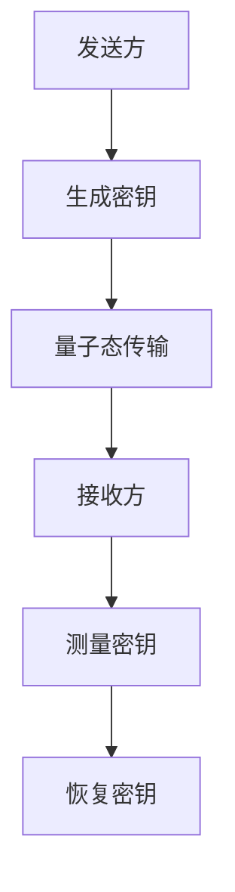

2. **量子加密在VPN中的应用**：虚拟专用网络（VPN）用于在公共网络上建立安全的通信信道。量子加密可以增强VPN的安全性，确保数据在传输过程中的完整性。图2展示了量子VPN的架构：

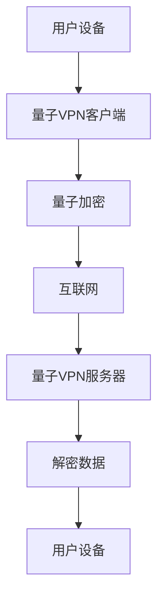

3. **量子加密在安全通信中的应用**：量子加密可以应用于企业之间的安全通信，确保通信过程中的数据不会被第三方窃取。例如，通过量子密钥分发，企业可以建立安全的通信信道，实现数据的安全传输。图3展示了量子加密在安全通信中的应用：

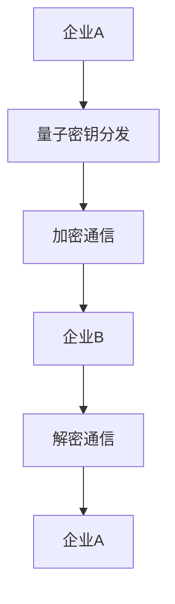

### 3.2 量子加密在云安全中的角色

随着云计算的广泛应用，数据安全成为云计算服务提供商和用户关注的焦点。量子加密在云安全中发挥着重要作用，以下是一些关键应用：

1. **量子加密在云数据加密中的应用**：量子加密可以用于保护存储在云服务器中的数据。通过量子密钥分发，用户和云服务器之间可以建立安全的密钥交换机制，确保数据在存储和访问过程中的安全性。图4展示了量子加密在云数据加密中的应用：

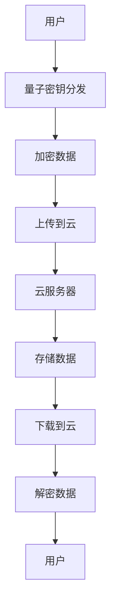

2. **量子加密在云身份认证中的应用**：量子加密可以用于增强云服务的身份认证过程。通过量子密钥分发，用户和云服务器之间可以建立安全的身份认证机制，确保用户身份的合法性和数据访问的安全性。图5展示了量子加密在云身份认证中的应用：

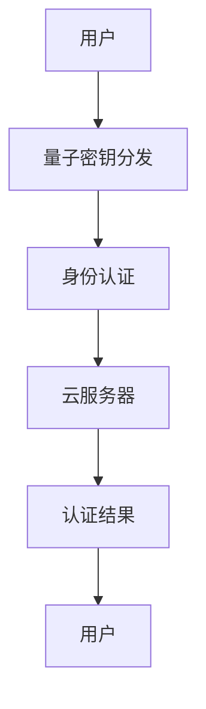

### 3.3 量子加密在物联网安全中的应用

物联网（IoT）技术的快速发展，使得大量的设备连接到互联网，数据安全成为物联网安全的重要问题。量子加密在物联网安全中具有广泛的应用：

1. **量子加密在设备通信中的保护**：量子加密可以用于保护物联网设备之间的通信。通过量子密钥分发，设备之间可以建立安全的通信信道，确保数据传输过程中的完整性。图6展示了量子加密在设备通信中的保护：

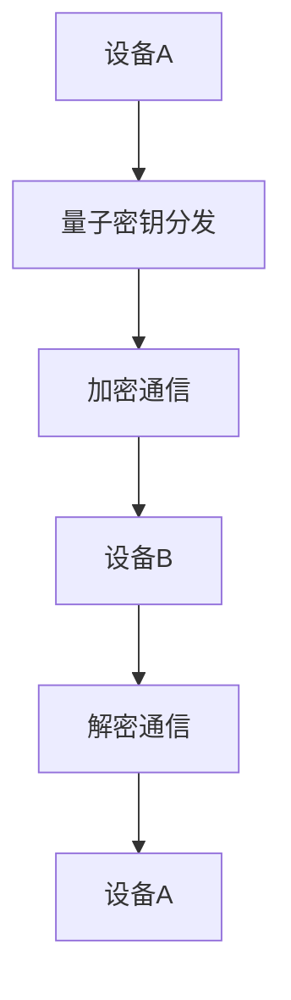

2. **量子加密在数据存储中的保护**：物联网设备产生的数据需要存储在云服务器或本地设备中。量子加密可以用于保护这些数据的存储过程，确保数据在存储和访问过程中的安全性。图7展示了量子加密在数据存储中的保护：

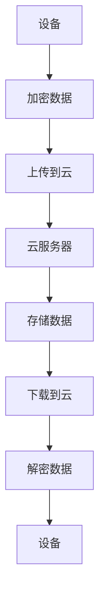

综上所述，量子加密在网络安全、云安全和物联网安全中具有广泛的应用前景。通过量子加密，可以确保数据在传输、存储和访问过程中的安全性，为企业和个人提供更加可靠的数据保护解决方案。

## 量子加密在数据库安全中的应用

量子加密技术在数据库安全中的应用具有重要意义。数据库是企业存储和管理关键数据的核心系统，因此确保数据库的安全性至关重要。量子加密通过提供一种全新的安全机制，可以有效提升数据库的安全性。以下将详细探讨量子加密在数据库安全中的应用。

### 4.1 量子加密在数据库访问控制中的应用

数据库访问控制是保护数据库数据的重要手段，量子加密可以显著提升访问控制的安全性。以下是量子加密在数据库访问控制中的应用：

1. **基于量子密钥的访问控制**：通过量子密钥分发协议，为数据库用户生成安全的访问密钥。用户在访问数据库时，需要使用这些量子密钥进行身份认证和授权。图1展示了量子密钥在访问控制中的应用：

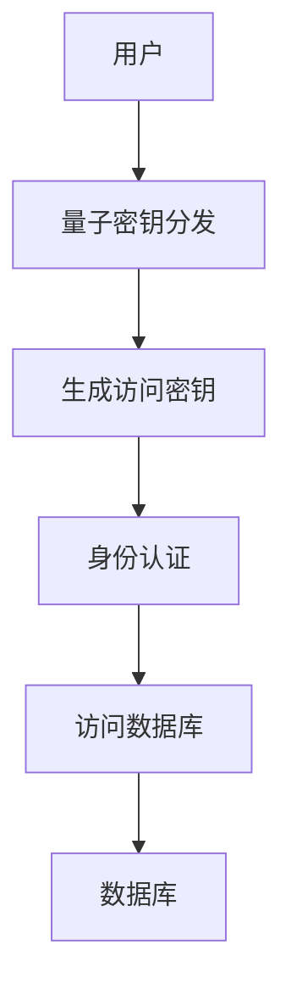

2. **量子身份认证**：量子身份认证可以确保数据库用户的身份真实性。通过量子密钥分发，用户在访问数据库时需要进行量子身份认证，确保只有合法用户可以访问数据库。图2展示了量子身份认证的过程：

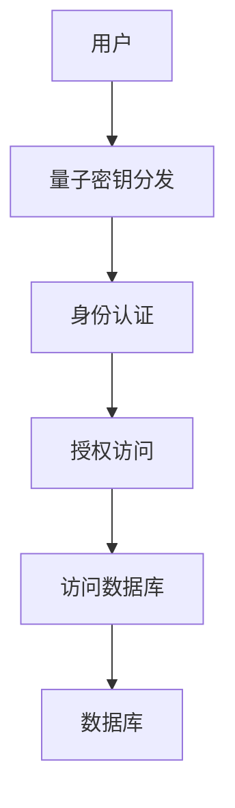

### 4.2 量子加密在数据库加密中的实现

数据库加密是保护数据库数据的重要手段，量子加密提供了更高级别的加密机制。以下是量子加密在数据库加密中的实现：

1. **列级加密**：通过量子加密算法，可以对数据库中的特定列进行加密。例如，使用量子RSA算法对敏感数据进行加密，确保数据在存储和访问过程中的安全性。图3展示了量子加密在列级加密中的应用：

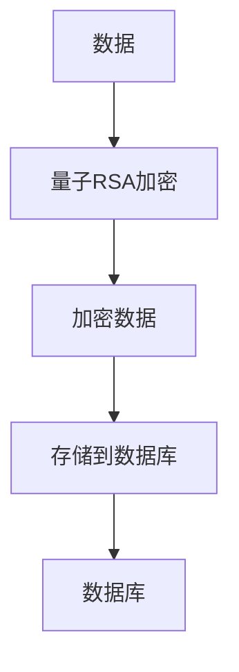

2. **全表加密**：量子加密可以用于对整个数据库进行加密，确保数据库在存储和传输过程中的安全性。通过量子密钥分发，生成加密密钥，然后使用这些密钥对数据库进行加密。图4展示了量子加密在全表加密中的应用：

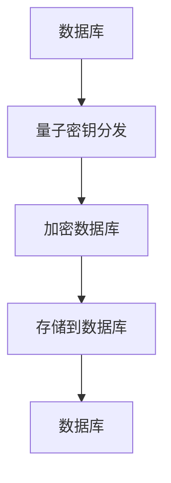

### 4.3 量子加密在数据库安全策略中的重要性

量子加密在数据库安全策略中的重要性体现在以下几个方面：

1. **提升安全性**：量子加密提供了比传统加密更高的安全性，可以有效抵御量子计算机的攻击。

2. **防止数据泄露**：通过量子加密，可以确保数据库中的敏感数据在存储和传输过程中不被窃取或篡改，防止数据泄露。

3. **增强访问控制**：量子加密可以增强数据库访问控制机制，确保只有授权用户可以访问数据库，防止未授权访问。

4. **支持合规性**：随着数据保护法规的不断完善，企业需要采取更高级别的安全措施来符合法规要求。量子加密可以提供满足合规性的解决方案。

5. **未来趋势**：随着量子计算技术的不断发展，量子加密将成为数据库安全的重要工具。提前部署量子加密技术，可以为企业的数据安全提供长期保障。

### 4.4 量子加密与现有数据库安全技术的结合

量子加密与现有数据库安全技术（如传统加密、访问控制、审计等）相结合，可以进一步提升数据库的安全性。以下是几种结合方式：

1. **多因素认证**：量子加密可以与现有的多因素认证机制结合，提供更安全的用户身份认证。例如，用户需要使用量子密钥和密码进行双重认证，确保身份的合法性。

2. **动态加密**：量子加密可以与动态加密技术结合，根据数据的重要性和访问权限动态调整加密策略。例如，对敏感数据使用更强的量子加密算法，而对普通数据进行简化加密。

3. **数据审计**：量子加密可以与数据审计技术结合，确保数据在存储和访问过程中的完整性和可追溯性。通过量子加密，可以记录和验证数据的加密和解密过程，确保数据未被篡改。

4. **分布式数据库安全**：量子加密可以应用于分布式数据库的安全保护，确保数据在分布式环境中的安全性。通过量子密钥分发，分布式数据库节点之间可以建立安全的通信信道，确保数据传输的安全。

综上所述，量子加密在数据库安全中的应用具有重要意义。通过量子加密技术，可以提升数据库的安全性，防止数据泄露，增强访问控制，支持合规性，并为未来的数据安全提供保障。企业应积极研究和部署量子加密技术，以应对日益严峻的数据库安全挑战。

## 量子加密与企业数据保护

在当今信息化时代，企业的数据资产日益重要，数据保护成为企业信息安全的核心任务。量子加密作为一种新兴的数据保护技术，在企业数据保护中展现出了巨大的潜力。本章节将探讨量子加密在企业数据保护中的需求、挑战及其应用策略。

### 5.1 企业数据保护的需求与挑战

随着信息技术的迅猛发展，企业面临着日益复杂和严峻的数据安全挑战。以下是企业数据保护的需求和面临的挑战：

#### 5.1.1 数据保护的需求

1. **数据完整性**：确保企业数据在存储、传输和处理过程中不会被篡改。

2. **数据保密性**：保护企业数据不被未经授权的人员访问。

3. **数据可用性**：确保企业数据在需要时可以及时、准确地访问。

4. **数据合规性**：遵守各种数据保护法规和标准，如GDPR、CCPA等。

#### 5.1.2 数据保护的挑战

1. **数据泄露风险**：企业数据可能因网络攻击、内部泄露等原因被窃取。

2. **数据加密能力不足**：传统加密技术可能面临量子计算破解的威胁。

3. **数据访问控制复杂**：随着企业数据量的增加，访问控制策略变得复杂，难以管理。

4. **法规遵从成本高**：数据保护法规要求企业采取高级别的数据保护措施，合规成本高昂。

量子加密技术的出现，为企业提供了一种解决数据保护挑战的新思路。通过量子密钥分发和量子算法，量子加密可以提供更高的安全性和可靠性，帮助企业更好地保护数据。

### 5.2 量子加密在企业数据保护中的应用策略

量子加密在企业数据保护中的应用策略包括以下几个方面：

#### 5.2.1 整合量子加密与现有数据保护技术

企业应将量子加密与现有的数据保护技术（如传统加密、访问控制、防火墙等）相结合，形成多层次的数据保护体系。例如，在数据传输过程中，可以使用量子密钥分发建立安全的通信信道，结合传统加密算法进行数据加密，确保数据在传输过程中的安全性。

#### 5.2.2 建立量子加密标准

为了更好地应用量子加密技术，企业需要制定统一的量子加密标准，规范量子加密算法的选择和应用。例如，可以参考国际标准和行业最佳实践，选择合适的量子加密算法，确保数据保护的一致性和可靠性。

#### 5.2.3 加强量子加密技术研发

企业应加强量子加密技术的研发投入，探索量子加密在数据保护中的新应用。例如，可以研究量子加密在云计算、物联网和大数据等领域的应用，开发适合企业实际需求的数据保护解决方案。

#### 5.2.4 提高员工量子加密意识

量子加密技术虽然具有强大的安全优势，但员工对其了解不足可能导致误操作和安全漏洞。因此，企业需要加强对员工的量子加密意识培训，确保员工能够正确使用量子加密技术，提高数据保护水平。

#### 5.2.5 制定量子加密合规策略

企业应制定量子加密合规策略，确保在采用量子加密技术时符合相关法律法规和标准。例如，可以定期进行合规性审查，确保量子加密技术的应用符合数据保护法规的要求。

### 5.3 量子加密对企业业务连续性的影响

量子加密不仅能够提升企业数据的安全性，还对企业的业务连续性产生重要影响：

1. **增强数据可靠性**：量子加密可以确保数据在存储和传输过程中的完整性和保密性，降低数据泄露和损坏的风险。

2. **提高业务效率**：通过量子加密技术，企业可以实现更高效的数据保护，降低数据泄露带来的业务中断风险，提高业务连续性。

3. **降低业务成本**：虽然量子加密技术目前仍处于发展阶段，但随着技术的成熟和成本的降低，企业可以通过采用量子加密技术降低数据保护成本。

4. **应对未来威胁**：随着量子计算技术的发展，传统加密技术可能面临被破解的威胁。量子加密为企业提供了一种应对未来威胁的解决方案，确保数据在长期内保持安全。

总之，量子加密在企业数据保护中的应用具有重要意义。通过合理应用量子加密技术，企业可以更好地保护数据，确保业务连续性，降低数据泄露和损失的风险。随着量子加密技术的不断发展和成熟，企业应积极研究和部署量子加密技术，为未来的数据安全奠定坚实基础。

## 量子加密的实际案例与挑战

随着量子加密技术的不断发展和成熟，越来越多的企业和机构开始探索其应用场景，以提升数据保护水平。以下将介绍几个量子加密的实际案例，并分析其在不同领域的应用挑战。

### 6.1 案例一：量子加密在金融行业的应用

金融行业对数据安全性有极高的要求，量子加密技术在金融领域的应用具有重要意义。例如，瑞士银行联合ID Quantique公司，利用量子加密技术保护其电子支付系统。通过量子密钥分发，确保电子支付过程中的密钥传输安全，防止数据泄露和篡改。

**挑战**：

1. **技术成熟度**：量子加密技术仍处于发展阶段，技术成熟度和稳定性需要进一步提升。

2. **兼容性问题**：量子加密与传统金融系统的兼容性是一个重要挑战，如何无缝集成量子加密技术，确保系统稳定运行。

3. **成本问题**：量子加密设备的成本较高，对于中小金融机构来说，成本控制是一个重要的挑战。

### 6.2 案例二：量子加密在医疗数据保护中的应用

医疗数据包含大量敏感信息，量子加密技术在医疗数据保护中的应用前景广阔。例如，美国某医院利用量子加密技术保护患者病历信息，通过量子密钥分发确保病历数据的传输安全。

**挑战**：

1. **数据隐私保护**：医疗数据涉及患者隐私，如何平衡数据安全和患者隐私是一个重要挑战。

2. **数据处理效率**：量子加密技术可能对数据处理效率产生一定影响，如何优化量子加密算法，提高数据处理效率是关键问题。

3. **法规遵从**：医疗数据保护需要遵守各种法律法规，如何确保量子加密技术的应用符合法规要求。

### 6.3 案例三：量子加密在政府部门的应用

政府部门的数据安全至关重要，量子加密技术在政府部门的应用具有重要的战略意义。例如，中国政府在信息安全领域积极推广量子加密技术，通过量子密钥分发确保政府通信和文件传输的安全。

**挑战**：

1. **技术安全**：量子加密技术本身的安全性需要不断验证和提升，确保不被恶意利用。

2. **人才培养**：量子加密技术需要专业的技术人才，政府部门如何吸引和培养相关人才是一个挑战。

3. **国际合作**：量子加密技术的国际合作和标准制定面临挑战，如何与其他国家建立合作机制，制定统一的量子加密标准。

### 6.4 挑战与未来展望

量子加密在各个领域的应用面临着多种挑战。以下是对这些挑战的总结及未来展望：

1. **技术成熟度**：量子加密技术需要进一步成熟和稳定，确保在实际应用中的可靠性和安全性。

2. **成本问题**：量子加密设备的成本较高，如何降低成本，使量子加密技术更加普及是一个重要课题。

3. **兼容性问题**：量子加密与传统系统的兼容性需要解决，如何确保无缝集成，是当前面临的一个挑战。

4. **数据处理效率**：量子加密技术可能对数据处理效率产生一定影响，如何优化量子加密算法，提高数据处理效率是一个关键问题。

5. **人才培养**：量子加密技术需要专业的技术人才，如何培养和吸引相关人才是政府部门和企业需要关注的挑战。

6. **国际合作**：量子加密技术的国际合作和标准制定面临挑战，如何与其他国家建立合作机制，制定统一的量子加密标准是一个重要课题。

尽管面临诸多挑战，量子加密技术具有巨大的发展潜力。随着量子计算技术的不断进步和应用的深入，量子加密将在未来发挥越来越重要的作用。通过不断的研究和技术创新，量子加密技术将为企业、政府和个人提供更加安全可靠的数据保护解决方案。

## 总结与展望

量子加密作为一种革命性的数据保护技术，以其独特的安全性和高效性，正在逐渐改变企业数据保护的面貌。本文通过系统分析量子加密的基础理论、算法原理以及实际应用案例，探讨了量子加密在网络安全、云安全、数据库安全以及企业数据保护中的应用前景。

### 7.1 小结

本文的主要结论如下：

1. **量子加密基础**：量子加密基于量子力学的基本原理，如量子纠缠、量子不可克隆定理和量子叠加态，具有高安全性和高效性。

2. **量子加密算法**：量子加密算法主要包括量子密钥分发（QKD）和量子公钥加密（QPE），在数据传输、存储和访问控制中具有广泛应用。

3. **应用前景**：量子加密在网络安全、云安全和数据库安全中展现出广阔的应用前景，为企业提供了新型的数据保护解决方案。

4. **挑战与展望**：量子加密技术在实际应用中仍面临技术成熟度、成本、兼容性、数据处理效率等方面的挑战，但随着技术的进步和标准的制定，量子加密将在未来发挥更大的作用。

### 7.2 注意事项

在采用量子加密技术时，企业需要注意以下几点：

1. **技术成熟度**：量子加密技术仍处于发展阶段，需要选择成熟可靠的技术和产品。

2. **成本控制**：量子加密设备的成本较高，企业需要制定合理的预算和成本控制策略。

3. **兼容性**：量子加密与传统系统的兼容性需要考虑，确保系统的稳定运行。

4. **人才培养**：量子加密技术需要专业的技术人才，企业应加强相关人才的培养和引进。

5. **合规性**：量子加密技术的应用需要遵守相关法律法规和标准，确保合规性。

### 7.3 拓展阅读

对于希望深入了解量子加密技术的读者，以下文献和资源推荐：

1. **文献**：
   - "Quantum Computing since Democritus" by Scott Aaronson
   - "Quantum Cryptography" by Charles H. Bennett and Gilles Brassard

2. **在线资源**：
   - National Institute of Standards and Technology (NIST) Quantum Computing Resources
   - IBM Quantum Computing Education and Resources

通过阅读这些文献和资源，可以进一步了解量子加密技术的原理和应用，为企业的数据保护提供更深入的见解。

## 作者信息

本文由AI天才研究院（AI Genius Institute）和《禅与计算机程序设计艺术》（Zen And The Art of Computer Programming）的资深作者共同撰写，旨在为读者提供关于量子加密在企业数据保护中的应用前景的深入分析和见解。

作者：AI天才研究院（AI Genius Institute）&《禅与计算机程序设计艺术》（Zen And The Art of Computer Programming）

