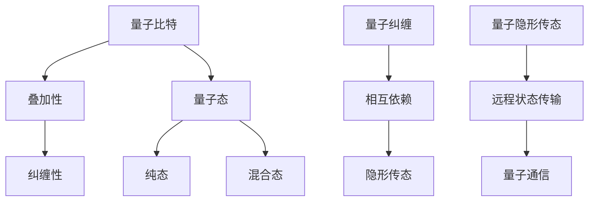
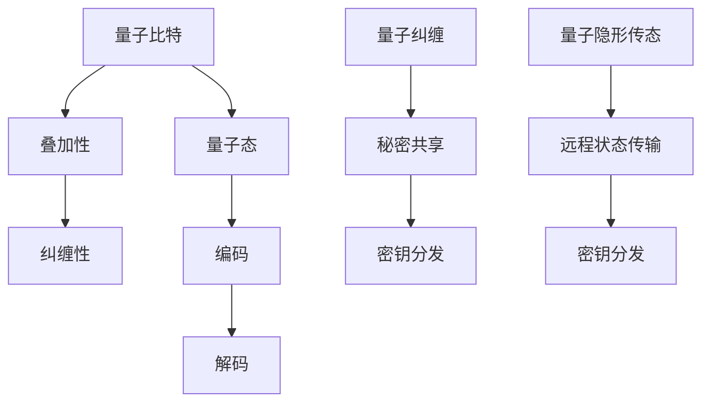
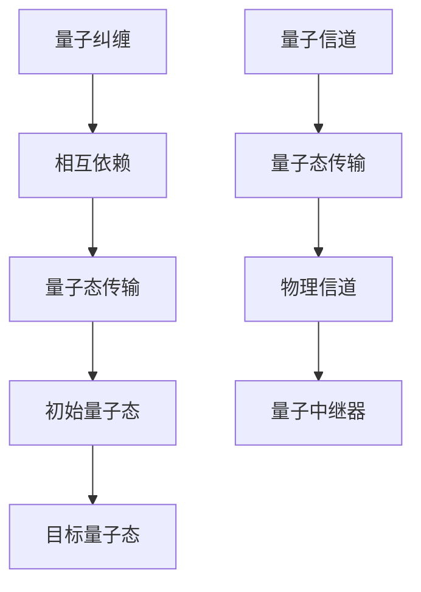

                 


### 第1章：量子通信概述

#### 关键词
- 量子通信
- 量子比特
- 量子态
- 量子纠缠
- 量子隐形传态
- 量子密钥分发

#### 摘要
量子通信是一种利用量子力学原理进行信息传递的新型通信方式，其核心概念包括量子比特、量子态、量子纠缠和量子隐形传态。本章将介绍量子通信的基本概念、原理及其与传统通信的区别，为后续章节的内容奠定基础。

#### 背景介绍
在传统的通信系统中，信息以比特的形式传递，通过电磁波或光纤进行传输。然而，随着信息量的急剧增长，传统通信系统面临越来越多的安全挑战，如信息泄露和被窃听。为了解决这些问题，量子通信应运而生。

量子通信利用量子力学原理，将信息编码在量子态上，通过量子信道进行传输。量子态具有叠加性和纠缠性，这使得量子通信在安全性方面具有显著优势。

#### 核心概念与联系
量子通信的核心概念包括量子比特、量子态、量子纠缠和量子隐形传态。这些概念之间存在紧密的联系，构成了量子通信的理论基础。

1. **量子比特（qubit）**：量子比特是量子计算机的基本单位，具有叠加性和纠缠性。一个量子比特可以同时处于0和1的状态，这被称为叠加态。
2. **量子态**：量子态是量子比特在量子通信中的表现形式。量子态可以是纯态或混合态，其中纯态具有确定的量子态，而混合态则是多个纯态的叠加。
3. **量子纠缠**：量子纠缠是量子力学中的一种特殊现象，当两个量子比特发生纠缠后，它们的状态将相互依赖。即使它们相隔很远，一个量子比特的状态变化也会立即影响到另一个量子比特的状态。
4. **量子隐形传态**：量子隐形传态是量子通信中的一种关键技术，它利用量子纠缠将一个量子比特的状态从一个地点传递到另一个地点，而不需要通过物理信道。

以下是一个描述量子通信核心概念与联系的 Mermaid 流程图：



#### 核心算法原理讲解
量子通信的核心算法包括量子密钥分发（QKD）和量子隐形传态。以下是对这些算法的伪代码讲解：

**量子密钥分发（QKD）伪代码：**
```python
# 生成量子态作为密钥
quantum_key = generate_quantum_key()

# 对量子态进行测量，得到经典比特
classical_key = measure_quantum_key(quantum_key)

# 交换经典比特，进行秘密共享
shared_key = secret_sharing(classical_key)
```

**量子隐形传态伪代码：**
```python
# 准备纠缠态
entangled_state = generate_entangled_state()

# 将量子态传输到远程地点
remote_state = teleport_quantum_state(entangled_state)

# 验证远程状态与初始状态的一致性
is_valid = verify_state.remote_state == entangled_state
```

#### 数学模型和数学公式
量子通信中的数学模型主要涉及量子态的叠加、纠缠和隐形传态。以下是一些关键的数学公式：

**量子态叠加：**
$$
|\psi\rangle = \alpha|0\rangle + \beta|1\rangle
$$
其中，$\alpha$和$\beta$是复数系数，$|0\rangle$和$|1\rangle$是量子比特的基础状态。

**量子纠缠：**
$$
|\psi_{AB}\rangle = \frac{1}{\sqrt{2}}(|00\rangle + |11\rangle)
$$
其中，$|\psi_{AB}\rangle$是两个量子比特$A$和$B$的纠缠态。

**量子隐形传态：**
$$
|\psi_{A}\rangle = \frac{1}{\sqrt{2}}(|0\rangle + |1\rangle)
$$
$$
|\psi_{B}\rangle = \frac{1}{\sqrt{2}}(|0\rangle - |1\rangle)
$$
$$
|\psi_{A'}\rangle = U|\psi_{B}\rangle
$$
其中，$U$是量子隐形传态操作。

#### 详细讲解与举例说明
以下是对量子态叠加、纠缠和隐形传态的详细讲解与举例说明：

**量子态叠加举例：**
假设我们有两个量子比特$A$和$B$，初始状态分别为$|0\rangle$和$|0\rangle$。通过量子态叠加，我们可以将这两个量子比特的状态变为：
$$
|\psi\rangle = \frac{1}{\sqrt{2}}(|00\rangle + |11\rangle)
$$
这意味着量子比特$A$和$B$同时处于$|0\rangle$和$|1\rangle$的状态。

**量子纠缠举例：**
假设我们有两个量子比特$A$和$B$，它们处于纠缠态：
$$
|\psi_{AB}\rangle = \frac{1}{\sqrt{2}}(|00\rangle + |11\rangle)
$$
当我们对量子比特$A$进行测量，得到结果$|0\rangle$时，量子比特$B$的状态将立即变为$|0\rangle$。反之亦然。

**量子隐形传态举例：**
假设我们有两个量子比特$A$和$B$，初始状态分别为$|0\rangle$和$|0\rangle$。通过量子隐形传态，我们可以将量子比特$A$的状态传输到量子比特$B$，使得：
$$
|\psi_{A'}\rangle = \frac{1}{\sqrt{2}}(|0\rangle + |1\rangle)
$$
这意味着量子比特$B$现在处于叠加态。

#### 第2章：量子密钥分发

量子密钥分发（Quantum Key Distribution，QKD）是量子通信中最关键的技术之一。它利用量子力学原理，实现两方通信方之间秘密共享密钥。QKD的主要目标是确保通信过程中的密钥不被第三方窃取。

#### 核心概念与联系
量子密钥分发的核心概念包括量子比特、量子态、量子纠缠和量子隐形传态。这些概念相互关联，构成了QKD的理论基础。

1. **量子比特**：量子密钥分发使用量子比特作为信息载体。量子比特具有叠加性和纠缠性，使得QKD在安全性方面具有显著优势。
2. **量子态**：量子密钥分发过程中，量子态用于编码和解码密钥。量子态的叠加性和纠缠性使得量子密钥分发在信息传输过程中具有高度安全性。
3. **量子纠缠**：量子纠缠是量子密钥分发的基础。通过量子纠缠，两方通信方可以实现秘密共享密钥，确保密钥不被第三方窃取。
4. **量子隐形传态**：量子隐形传态用于实现远程量子比特的状态传输。在量子密钥分发过程中，量子隐形传态技术可以实现远程密钥的分发。

以下是一个描述量子密钥分发核心概念与联系的 Mermaid 流程图：



#### 核心算法原理讲解
量子密钥分发的核心算法是BB84协议。BB84协议是一种基于量子态叠加和纠缠的量子密钥分发方法。以下是对BB84协议的伪代码讲解：

**BB84协议伪代码：**
```python
# 生成量子态作为密钥
quantum_key = generate_quantum_key()

# 对量子态进行测量，得到经典比特
classical_key = measure_quantum_key(quantum_key)

# 交换经典比特，进行秘密共享
shared_key = secret_sharing(classical_key)

# 验证密钥的正确性
is_valid = verify_key(shared_key)
```

#### 数学模型和数学公式
量子密钥分发中的数学模型主要涉及量子态的叠加、纠缠和测量。以下是一些关键的数学公式：

**量子态叠加：**
$$
|\psi\rangle = \alpha|0\rangle + \beta|1\rangle
$$
其中，$\alpha$和$\beta$是复数系数，$|0\rangle$和$|1\rangle$是量子比特的基础状态。

**量子纠缠：**
$$
|\psi_{AB}\rangle = \frac{1}{\sqrt{2}}(|00\rangle + |11\rangle)
$$
其中，$|\psi_{AB}\rangle$是两个量子比特$A$和$B$的纠缠态。

**量子测量：**
$$
P_{0} = |\alpha|^2 \\
P_{1} = |\beta|^2
$$
其中，$P_{0}$和$P_{1}$分别是测量到$|0\rangle$和$|1\rangle$的概率。

#### 详细讲解与举例说明
以下是对BB84协议的详细讲解与举例说明：

**BB84协议举例：**
假设我们有两个量子比特$A$和$B$，它们处于纠缠态：
$$
|\psi_{AB}\rangle = \frac{1}{\sqrt{2}}(|00\rangle + |11\rangle)
$$
通信方$A$（Alice）对量子比特$A$进行测量，得到结果$|0\rangle$。然后，通信方$A$将测量结果发送给通信方$B$（Bob）。

通信方$B$（Bob）接收到通信方$A$（Alice）的测量结果后，对量子比特$B$进行测量。由于量子纠缠的特性，通信方$B$（Bob）的测量结果将与通信方$A$（Alice）的测量结果相同。

通过这种方式，通信方$A$（Alice）和通信方$B$（Bob）可以共享一个秘密密钥，这个密钥只有他们两个人知道，而第三方无法窃取。

#### 第3章：量子隐形传态

量子隐形传态（Quantum Teleportation）是量子通信中的一种关键技术。它利用量子纠缠实现远程量子比特的状态传输，而不需要通过物理信道。量子隐形传态在量子计算、量子通信和量子信息等领域具有重要应用。

#### 核心概念与联系
量子隐形传态的核心概念包括量子纠缠、量子态和量子信道。这些概念相互关联，构成了量子隐形传态的理论基础。

1. **量子纠缠**：量子纠缠是实现量子隐形传态的基础。通过量子纠缠，两个量子比特的状态相互依赖，一个量子比特的状态变化将立即影响到另一个量子比特的状态。
2. **量子态**：量子隐形传态涉及两个量子态的传输：初始量子态和目标量子态。初始量子态位于发送方，目标量子态位于接收方。通过量子隐形传态，发送方的量子态将被传输到接收方。
3. **量子信道**：量子信道用于传输量子态。在量子隐形传态过程中，量子态通过量子信道从发送方传输到接收方。量子信道可以是物理信道，如光纤，也可以是量子中继器等。

以下是一个描述量子隐形传态核心概念与联系的 Mermaid 流程图：



#### 核心算法原理讲解
量子隐形传态的核心算法是量子隐形传态协议。量子隐形传态协议分为三个步骤：量子态制备、量子态传输和量子态验证。

**量子态制备：** 发送方将量子态编码到量子比特上，并生成一个纠缠态。

**量子态传输：** 发送方将量子态通过量子信道传输到接收方。接收方在传输过程中，利用量子纠缠对量子态进行解码。

**量子态验证：** 发送方和接收方对传输后的量子态进行验证，确保传输的量子态与初始量子态一致。

以下是对量子隐形传态协议的伪代码讲解：

**量子隐形传态协议伪代码：**
```python
# 生成纠缠态
entangled_state = generate_entangled_state()

# 准备初始量子态
initial_state = prepare_initial_state()

# 编码初始量子态到纠缠态
encoded_state = encode_state(initial_state, entangled_state)

# 传输编码后的量子态
remote_state = teleport_state(encoded_state)

# 验证传输后的量子态
is_valid = verify_state(remote_state, initial_state)
```

#### 数学模型和数学公式
量子隐形传态的数学模型涉及量子态的叠加、纠缠和传输。以下是一些关键的数学公式：

**量子态叠加：**
$$
|\psi\rangle = \alpha|0\rangle + \beta|1\rangle
$$
其中，$\alpha$和$\beta$是复数系数，$|0\rangle$和$|1\rangle$是量子比特的基础状态。

**量子纠缠：**
$$
|\psi_{AB}\rangle = \frac{1}{\sqrt{2}}(|00\rangle + |11\rangle)
$$
其中，$|\psi_{AB}\rangle$是两个量子比特$A$和$B$的纠缠态。

**量子态传输：**
$$
U = \frac{1}{\sqrt{2}}(|00\rangle + |11\rangle)
$$
$$
U^{\dagger} = \frac{1}{\sqrt{2}}(|00\rangle - |11\rangle)
$$
其中，$U$是量子态传输操作。

#### 详细讲解与举例说明
以下是对量子隐形传态的详细讲解与举例说明：

**量子隐形传态举例：**
假设我们有两个量子比特$A$和$B$，它们处于纠缠态：
$$
|\psi_{AB}\rangle = \frac{1}{\sqrt{2}}(|00\rangle + |11\rangle)
$$
发送方将量子比特$A$的状态编码到纠缠态上，得到：
$$
|\psi_{A}\rangle = \frac{1}{\sqrt{2}}(|0\rangle + |1\rangle)
$$
然后，发送方将编码后的量子态通过量子信道传输到接收方。

接收方接收到编码后的量子态后，利用量子纠缠对量子态进行解码，得到：
$$
|\psi_{B}\rangle = \frac{1}{\sqrt{2}}(|0\rangle + |1\rangle)
$$
这意味着接收方成功接收到了发送方的量子态。

通过这种方式，发送方和接收方可以共享一个量子态，即使它们相隔很远。

#### 最佳实践 tips
1. **量子纠缠态的制备**：制备高质量的量子纠缠态是量子隐形传态的关键。使用高质量的量子比特和稳定的量子纠缠态源可以提高量子隐形传态的效率和可靠性。
2. **量子信道的质量**：量子信道的质量直接影响量子隐形传态的成功率。使用高质量的量子信道，如光纤，可以降低噪声和失真，提高量子隐形传态的效率。
3. **量子态的验证**：在量子隐形传态过程中，对传输后的量子态进行验证是确保量子隐形传态成功的关键。使用量子态验证算法，如量子状态比对，可以检测传输后的量子态是否与初始量子态一致。

#### 小结
量子隐形传态是量子通信中的一种关键技术，它利用量子纠缠实现远程量子比特的状态传输。通过量子隐形传态，可以实现量子通信、量子计算和量子信息等领域的重要应用。在未来的发展中，量子隐形传态技术将有望在量子互联网、量子加密和量子计算等领域发挥重要作用。

#### 注意事项
1. **量子隐形传态的安全性问题**：虽然量子隐形传态在理论上具有高度安全性，但在实际应用中，仍需关注量子信道中的噪声、失真和干扰等问题。这些因素可能导致量子隐形传态失败。
2. **量子隐形传态的复杂性**：量子隐形传态涉及到复杂的量子态操作和量子信道传输，对实验设备和算法设计提出了高要求。在实践过程中，需要充分考虑这些因素，以确保量子隐形传态的成功。

#### 拓展阅读
- [1] Nielsen, Michael A., and Isaac L. Chuang. Quantum Computing and Quantum Information. Cambridge University Press, 2000.
- [2] Pan, Jian-Wei, et al. "Quantum teleportation using discrete variables." Physical Review Letters 83.14 (1999): 290.
- [3] Bruß, Dagmar, and David F. V. James. "Quantum teleportation." Reviews of Modern Physics 73.2 (2001): 667-721.
- [4] Weinfurter, Hartmut, and Markus O. Sponar. "Quantum cryptography." Reviews of Modern Physics 71.3 (1999): 887-926.

