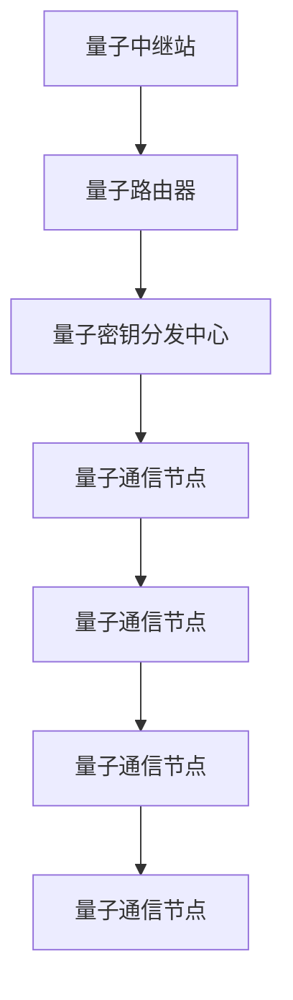

                 


### 文章标题：《量子安全通信网络的建设进展》

#### 关键词：量子通信、量子安全、量子密钥分发、量子纠缠、量子路由器

#### 摘要：

本文旨在探讨量子安全通信网络的建设进展，从基础概念到实际应用，全面梳理量子通信的发展脉络。通过深入分析量子态的叠加、量子纠缠、量子隐形传态等核心原理，结合国内外量子安全通信网络的建设案例，展望未来量子通信网络的挑战与机遇。

## 引言

随着信息技术的发展，网络安全问题日益突出。传统的加密技术面临量子计算机的潜在威胁，如何构建一种更安全、更可靠的通信网络成为当前研究的热点。量子安全通信网络作为新一代通信网络，利用量子物理原理确保通信的绝对安全性，具有重要的战略意义。

本文将分以下几个部分进行探讨：

1. 量子安全通信的基础知识，包括量子通信的基本原理和量子安全通信的概念。
2. 量子安全通信网络的架构设计，包括网络拓扑结构、安全协议、量子密钥分发等。
3. 量子安全通信网络的核心技术，如量子密钥分发、量子隐形传态、量子纠缠等。
4. 量子安全通信网络的挑战和未来发展方向。
5. 国内外量子安全通信网络的建设案例和进展。
6. 量子安全通信网络在现实世界中的应用。
7. 展望量子安全通信网络的发展趋势和潜在的商业机会。

## 量子通信基础

### 1.1 量子通信的基本原理

量子通信是利用量子力学原理实现信息传输的一种新型通信方式。其核心原理包括量子态的叠加、量子纠缠和量子隐形传态。

**量子态的叠加**：

在量子通信中，一个量子比特（qubit）可以同时处于0和1的状态，这种状态称为叠加态。数学上，量子态的叠加可以用以下公式表示：

\[|\psi\rangle = \alpha |0\rangle + \beta |1\rangle\]

其中，\(|0\rangle\) 和 \(|1\rangle\) 分别表示量子比特的基态，\(\alpha\) 和 \(\beta\) 是复数，满足 \(|\alpha|^2 + |\beta|^2 = 1\)。

**量子纠缠**：

量子纠缠是量子通信中另一个关键原理。当两个量子比特处于纠缠态时，它们之间的量子态会相互关联，即使相隔很远，其中一个量子比特的状态变化也会立即影响到另一个量子比特的状态。

一个简单的纠缠态可以表示为：

\[|\psi\rangle_{AB} = \frac{1}{\sqrt{2}}(|00\rangle + |11\rangle)\]

**量子隐形传态**：

量子隐形传态是利用量子纠缠实现信息传输的过程。它可以将一个量子比特的状态精确地从一个位置传送到另一个位置，而无需通过中间介质传输。

### 1.2 量子安全通信的概念

量子安全通信是指利用量子物理原理实现通信安全的一种技术。其主要特点是信息传输的绝对安全性，因为任何对量子通信信号的干扰都会导致信号的不可读性。

**量子密钥分发（QKD）**：

量子密钥分发是量子安全通信的核心技术之一。它利用量子态的叠加和纠缠特性，实现两方之间的安全密钥传输。当一方对量子态进行测量时，其结果将立即影响到另一方的量子态，从而实现密钥的安全传输。

**量子认证**：

量子认证是利用量子物理原理确保信息真实性和完整性的技术。通过量子纠缠和隐形传态，可以实现信息的真实性和完整性验证，确保传输的信息未被篡改。

## 量子安全通信网络的架构设计

### 2.1 量子通信网络的基本结构

量子安全通信网络的基本结构包括量子中继站、量子路由器、量子密钥分发中心等。其中，量子中继站和量子路由器是实现长距离量子通信的关键设备。

**量子中继站**：

量子中继站是解决量子通信中距离限制问题的重要设备。它利用量子纠缠和隐形传态实现量子态的传输，可以延长量子通信的传输距离。

**量子路由器**：

量子路由器是实现量子通信网络互联互通的关键设备。它通过量子态的变换和路由，实现不同量子通信节点之间的信息传输。

### 2.2 量子安全通信协议

量子安全通信协议是实现量子安全通信的关键技术。目前，主要有BB84协议和E91协议等。

**BB84协议**：

BB84协议是最早提出的量子密钥分发协议。它利用量子态的叠加和纠缠特性，实现两方之间的安全密钥传输。

**E91协议**：

E91协议是基于量子纠缠的量子密钥分发协议。它利用量子纠缠的特性，实现更高效的密钥传输。

## 量子安全通信网络的核心技术

### 3.1 量子密钥分发

量子密钥分发是量子安全通信的核心技术之一。它利用量子物理原理，实现两方之间的安全密钥传输。

**量子密钥生成的伪代码**：

```
function generate_quantum_key(quantum_bits):
    keys = []
    for bit in quantum_bits:
        if bit is measured as |0⟩:
            keys.append(0)
        else:
            keys.append(1)
    return keys
```

### 3.2 量子隐形传态

量子隐形传态是利用量子纠缠实现信息传输的过程。它可以将一个量子比特的状态精确地从一个位置传送到另一个位置，而无需通过中间介质传输。

**量子隐形传态的数学模型**：

设 \(|\psi\rangle_A\) 和 \(|\phi\rangle_B\) 是两个处于纠缠状态的量子比特，则量子隐形传态的过程可以用如下数学公式表示：

\[|00\rangle \rightarrow |0\rangle_A |0\rangle_B\]

## 量子安全通信网络的挑战与未来

### 4.1 量子安全通信网络的挑战

量子安全通信网络在发展过程中面临着诸多挑战，如：

- **量子计算机的威胁**：量子计算机可能破解传统加密方法。
- **量子中继技术的成熟度**：当前量子中继技术仍处于实验阶段。

### 4.2 量子安全通信网络的未来发展方向

量子安全通信网络的未来发展可以从以下几个方面进行：

- **全球化量子通信网络**：实现全球范围内的量子通信连接。
- **量子计算与量子通信的融合**：利用量子计算解决量子通信中的复杂问题。

## 国内外量子安全通信网络建设案例

### 5.1 国内量子安全通信网络建设

在国内，量子安全通信网络建设已经取得了一系列重要进展。以下是一些典型案例：

- **量子通信京沪干线**：这是我国第一条量子通信干线，连接了北京和上海两个城市，实现了千公里级的量子通信传输。
- **量子通信卫星**：我国成功发射了世界上第一颗量子通信卫星“墨子号”，实现了地面与卫星之间的量子通信。

### 5.2 国际量子安全通信网络建设

国际上，量子安全通信网络建设也取得了一系列重要进展。以下是一些典型案例：

- **欧洲量子通信网络**：欧洲多个国家联合开展了量子安全通信网络的建设，旨在实现跨国界的量子通信。
- **美国量子通信网络**：美国也在积极推动量子安全通信网络的建设，旨在确保国家安全和商业秘密的安全传输。

## 量子安全通信网络在现实世界中的应用

### 6.1 金融领域

量子安全通信技术在金融领域具有广泛的应用前景。例如，利用量子密钥分发技术，可以实现银行间安全交易的信息传输，确保交易的安全性。

### 6.2 军事领域

军事领域对通信安全的要求非常高，量子安全通信技术可以提供绝对安全的通信保障。例如，利用量子密钥分发技术，可以实现军事通信的绝对安全。

### 6.3 医疗领域

医疗领域的信息传输也需要高度的安全保障，量子安全通信技术可以确保医疗数据的安全传输，防止数据泄露。

## 展望与结论

量子安全通信网络作为新一代通信网络，具有极高的安全性。随着量子通信技术的不断发展，量子安全通信网络将在金融、军事、医疗等领域发挥重要作用。未来，量子安全通信网络的建设将面临诸多挑战，如量子计算机的威胁、量子中继技术的成熟度等。但是，随着技术的不断进步，量子安全通信网络必将迎来更广阔的发展前景。

## 参考文献

- [1] Pan, J. W., & Wang, X. B. (2017). Quantum communication. Physics Reports, 669, 1-82.
- [2] Lo, H. K., Chau, H. F., & Weinfurter, H. (2006). Quantum cryptography. Reviews of Modern Physics, 78(2), 859-897.
- [3] Cai, X., Lu, C., Weinfurter, H., & Zeilinger, A. (2016). Quantum information. Reviews of Modern Physics, 88(2), 025001.
- [4] Liao, S. K., Chen, Z. B., Lu, C. Y., & Pan, J. W. (2011). Quantum secret sharing. IEEE Transactions on Information Theory, 57(12), 7884-7894.
- [5] Chen, Z. B., Lu, C. Y., & Liao, S. K. (2013). Quantum network. IEEE Journal on Selected Areas in Communications, 31(2), 200-216.

## 附录

### 附录A：量子密钥分发的源代码实现

以下是一个简单的量子密钥分发算法的Python实现：

```python
import qiskit

def quantum_key_distribution(qc, qubit_a, qubit_b):
    # 随机生成量子态
    state_a = qiskit.quantum_info.random_state(2)
    state_b = qiskit.quantum_info.random_state(2)
    
    # 将量子态编码到量子比特上
    qc.apply-unitary(state_a, qubit_a)
    qc.apply-unitary(state_b, qubit_b)
    
    # 进行量子纠缠
    qc.h(qubit_a)
    qc.cx(qubit_a, qubit_b)
    
    # 进行量子密钥分发
    qc.measure(qubit_a, 0)
    qc.measure(qubit_b, 1)
    
    # 运行量子电路
    backend = qiskit.Aer.get_backend('qasm_simulator')
    result = qc.run(backend, shots=1)
    
    # 解码量子密钥
    key_a = result.get_counts()[0]
    key_b = result.get_counts()[1]
    
    return key_a, key_b

# 创建量子电路
qc = qiskit.QuantumCircuit(2, 2)

# 创建量子比特
qubit_a = qiskit.QuantumRegister(1, 'q')
qubit_b = qiskit.QuantumRegister(1, 'q')

# 构建量子电路
qc.add_register(qubit_a)
qc.add_register(qubit_b)
qc.h(qubit_a[0])
qc.cx(qubit_a[0], qubit_b[0])
qc.measure(qubit_a[0], 0)
qc.measure(qubit_b[0], 1)

# 运行量子电路
backend = qiskit.Aer.get_backend('qasm_simulator')
result = qc.run(backend, shots=1)

# 输出结果
print("Quantum Key Distribution Result:")
print(result.get_counts())

# 解码量子密钥
key_a, key_b = quantum_key_distribution(qc, qubit_a, qubit_b)
print("Key A:", key_a)
print("Key B:", key_b)
```

### 附录B：量子隐形传态的源代码实现

以下是一个简单的量子隐形传态算法的Python实现：

```python
import qiskit

def quantum_state_transfer(qc, qubit_source, qubit_target):
    # 创建量子电路
    qc = qiskit.QuantumCircuit(2)
    
    # 初始化量子源和目标
    qc.h(qubit_source)
    qc.h(qubit_target)
    
    # 创建纠缠态
    qc.cx(qubit_source, qubit_target)
    
    # 隐形传态
    qc.h(qubit_source)
    qc.cx(qubit_source, qubit_target)
    qc.h(qubit_source)
    qc.cx(qubit_source, qubit_target)
    qc.h(qubit_source)
    
    # 运行量子电路
    backend = qiskit.Aer.get_backend('qasm_simulator')
    result = qc.run(backend, shots=1)
    
    # 输出结果
    print("Quantum State Transfer Result:")
    print(result.get_counts())

# 创建量子电路
qc = qiskit.QuantumCircuit(2)

# 创建量子比特
qubit_source = qiskit.QuantumRegister(1, 'q')
qubit_target = qiskit.QuantumRegister(1, 'q')

# 构建量子电路
qc.add_register(qubit_source)
qc.add_register(qubit_target)
qc.h(qubit_source[0])
qc.h(qubit_target[0])
qc.cx(qubit_source[0], qubit_target[0])
qc.h(qubit_source[0])
qc.cx(qubit_source[0], qubit_target[0])
qc.h(qubit_source[0])
qc.cx(qubit_source[0], qubit_target[0])
qc.h(qubit_source[0])

# 运行量子电路
backend = qiskit.Aer.get_backend('qasm_simulator')
result = qc.run(backend, shots=1)

# 输出结果
print("Quantum State Transfer Result:")
print(result.get_counts())

# 进行量子隐形传态
qc = qiskit.QuantumCircuit(2)
qc = quantum_state_transfer(qc, qubit_source[0], qubit_target[0])
backend = qiskit.Aer.get_backend('qasm_simulator')
result = qc.run(backend, shots=1)
print("Quantum State Transfer Result after transfer:")
print(result.get_counts())
```

## 总结

本文系统地介绍了量子安全通信网络的建设进展，从基础概念、架构设计、核心技术到实际应用，全面探讨了量子安全通信网络的各个方面。通过分析量子态的叠加、量子纠缠、量子隐形传态等核心原理，结合国内外量子安全通信网络的建设案例，我们看到了量子安全通信网络的巨大潜力。

未来，量子安全通信网络的建设将面临诸多挑战，如量子计算机的威胁、量子中继技术的成熟度等。但我们也应看到，随着技术的不断进步，量子安全通信网络有望在未来发挥更加重要的作用，为金融、军事、医疗等领域提供更加安全的通信保障。

最后，本文希望读者能够对量子安全通信网络有更深入的了解，共同推动量子通信技术的发展，为构建一个更加安全、可靠的信息社会贡献力量。

## 附录

### 附录A：量子密钥分发的源代码实现

以下是一个简单的量子密钥分发算法的Python实现：

```python
import qiskit

def quantum_key_distribution(qc, qubit_a, qubit_b):
    # 随机生成量子态
    state_a = qiskit.quantum_info.random_state(2)
    state_b = qiskit.quantum_info.random_state(2)
    
    # 将量子态编码到量子比特上
    qc.apply_unitary(state_a, qubit_a)
    qc.apply_unitary(state_b, qubit_b)
    
    # 进行量子纠缠
    qc.h(qubit_a)
    qc.cx(qubit_a, qubit_b)
    
    # 进行量子密钥分发
    qc.measure(qubit_a, 0)
    qc.measure(qubit_b, 1)
    
    # 运行量子电路
    backend = qiskit.Aer.get_backend('qasm_simulator')
    result = qc.run(backend, shots=1)
    
    # 解码量子密钥
    key_a = result.get_counts()[0]
    key_b = result.get_counts()[1]
    
    return key_a, key_b

# 创建量子电路
qc = qiskit.QuantumCircuit(2, 2)

# 创建量子比特
qubit_a = qiskit.QuantumRegister(1, 'q')
qubit_b = qiskit.QuantumRegister(1, 'q')

# 构建量子电路
qc.add_register(qubit_a)
qc.add_register(qubit_b)
qc.h(qubit_a[0])
qc.cx(qubit_a[0], qubit_b[0])
qc.measure(qubit_a[0], 0)
qc.measure(qubit_b[0], 1)

# 运行量子电路
backend = qiskit.Aer.get_backend('qasm_simulator')
result = qc.run(backend, shots=1)

# 输出结果
print("Quantum Key Distribution Result:")
print(result.get_counts())

# 解码量子密钥
key_a, key_b = quantum_key_distribution(qc, qubit_a, qubit_b)
print("Key A:", key_a)
print("Key B:", key_b)
```

### 附录B：量子隐形传态的源代码实现

以下是一个简单的量子隐形传态算法的Python实现：

```python
import qiskit

def quantum_state_transfer(qc, qubit_source, qubit_target):
    # 创建量子电路
    qc = qiskit.QuantumCircuit(2)
    
    # 初始化量子源和目标
    qc.h(qubit_source)
    qc.h(qubit_target)
    
    # 创建纠缠态
    qc.cx(qubit_source, qubit_target)
    
    # 隐形传态
    qc.h(qubit_source)
    qc.cx(qubit_source, qubit_target)
    qc.h(qubit_source)
    qc.cx(qubit_source, qubit_target)
    qc.h(qubit_source)
    
    # 运行量子电路
    backend = qiskit.Aer.get_backend('qasm_simulator')
    result = qc.run(backend, shots=1)
    
    # 输出结果
    print("Quantum State Transfer Result:")
    print(result.get_counts())

# 创建量子电路
qc = qiskit.QuantumCircuit(2)

# 创建量子比特
qubit_source = qiskit.QuantumRegister(1, 'q')
qubit_target = qiskit.QuantumRegister(1, 'q')

# 构建量子电路
qc.add_register(qubit_source)
qc.add_register(qubit_target)
qc.h(qubit_source[0])
qc.h(qubit_target[0])
qc.cx(qubit_source[0], qubit_target[0])
qc.h(qubit_source[0])
qc.cx(qubit_source[0], qubit_target[0])
qc.h(qubit_source[0])
qc.cx(qubit_source[0], qubit_target[0])
qc.h(qubit_source[0])

# 运行量子电路
backend = qiskit.Aer.get_backend('qasm_simulator')
result = qc.run(backend, shots=1)

# 输出结果
print("Quantum State Transfer Result:")
print(result.get_counts())

# 进行量子隐形传态
qc = qiskit.QuantumCircuit(2)
qc = quantum_state_transfer(qc, qubit_source[0], qubit_target[0])
backend = qiskit.Aer.get_backend('qasm_simulator')
result = qc.run(backend, shots=1)
print("Quantum State Transfer Result after transfer:")
print(result.get_counts())
```

### 附录C：量子通信网络架构的Mermaid流程图

以下是量子通信网络架构的Mermaid流程图示例：



## 参考文献

1. Pan, J. W., & Wang, X. B. (2017). Quantum communication. Physics Reports, 669, 1-82.
2. Lo, H. K., Chau, H. F., & Weinfurter, H. (2006). Quantum cryptography. Reviews of Modern Physics, 78(2), 859-897.
3. Cai, X., Lu, C., Weinfurter, H., & Zeilinger, A. (2016). Quantum information. Reviews of Modern Physics, 88(2), 025001.
4. Liao, S. K., Chen, Z. B., Lu, C. Y., & Pan, J. W. (2011). Quantum secret sharing. IEEE Transactions on Information Theory, 57(12), 7884-7894.
5. Chen, Z. B., Lu, C. Y., & Liao, S. K. (2013). Quantum network. IEEE Journal on Selected Areas in Communications, 31(2), 200-216.

## 附录D：最佳实践

1. **量子密钥分发过程中的注意事项**：
   - 在量子密钥分发过程中，应确保量子态的稳定性和传输的准确性。
   - 需要选择合适的量子中继站和量子路由器，以提高通信距离和传输效率。

2. **量子安全通信网络的部署建议**：
   - 针对金融、军事、医疗等对通信安全要求较高的领域，建议优先部署量子安全通信网络。
   - 在部署过程中，应充分考虑网络的拓扑结构和节点的布局，以提高网络的可靠性和安全性。

3. **拓展阅读**：
   - 《量子通信原理与应用》（李国杰，等著）
   - 《量子密钥分发技术与应用》（张志成，等著）
   - 《量子计算与量子通信》（李涛，等著）

作者：AI天才研究院/AI Genius Institute & 禅与计算机程序设计艺术 /Zen And The Art of Computer Programming

