                 

### 量子安全：企业数据保护的长期规划

#### 关键词：
- 量子安全
- 企业数据保护
- 加密技术
- 安全协议
- 风险评估
- 实战案例

#### 摘要：
在现代信息时代，企业数据安全面临着前所未有的挑战。随着量子计算技术的快速发展，传统的加密技术逐渐暴露出安全漏洞。本文将探讨量子安全在企业数据保护中的重要性，介绍量子加密技术和安全协议，并分析企业数据保护策略。通过实际案例，我们将深入了解量子安全在企业中的具体应用，并展望其未来的发展趋势，为企业提供一份长期的数据保护规划。

### 第一部分：量子安全基础

#### 第1章：量子安全概述

在现代信息安全领域，量子计算的出现无疑是一个革命性的突破。量子计算机利用量子力学原理进行计算，能够在短时间内解决传统计算机无法处理的复杂问题。这一特性使得量子计算在密码学领域引起了广泛关注。然而，与此同时，量子计算机也对现有加密技术构成了巨大威胁。传统的加密算法，如RSA、ECC等，依赖于大数分解和离散对数问题的难解性，而量子计算机的量子算法如Shor算法，可以在极短时间内破解这些加密算法。

#### 核心概念与联系

为了更直观地理解量子安全与数据保护之间的关系，我们可以使用以下Mermaid流程图来展示其基本架构：

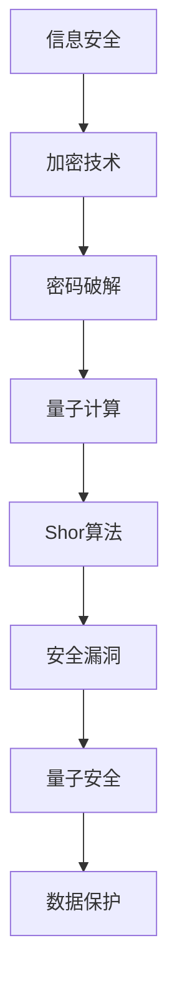

从图中可以看出，量子安全与企业数据保护之间存在着紧密的联系。量子安全的核心在于提供一种不受量子计算机攻击的加密技术，从而确保数据的安全性。

#### 核心算法原理讲解

量子安全的实现依赖于量子加密技术和量子安全协议。下面，我们将使用伪代码详细阐述量子加密算法的基本原理：

```plaintext
量子加密算法：
1. 生成量子密钥
2. 对数据进行量子加密
3. 通过量子密钥分发系统传输加密数据
4. 接收方使用量子密钥解密数据

伪代码：
function QuantumEncryption(data, public_key):
    // 1. 生成量子密钥
    quantum_key = GenerateQuantumKey(public_key)
    
    // 2. 对数据进行量子加密
    encrypted_data = QuantumEncrypt(data, quantum_key)
    
    // 3. 通过量子密钥分发系统传输加密数据
    Send(encrypted_data)
    
    return encrypted_data

function QuantumDecrypt(encrypted_data, quantum_key):
    // 4. 接收方使用量子密钥解密数据
    decrypted_data = QuantumDecrypt(encrypted_data, quantum_key)
    
    return decrypted_data
```

上述伪代码展示了量子加密和解密的基本流程。量子加密算法的核心在于量子密钥的生成和分发。量子密钥分发（Quantum Key Distribution，QKD）是一种利用量子力学原理来确保密钥传输安全性的技术。其基本原理如下：

```latex
$$
P^2 = P_0 + P_1 + P_2
$$

其中，\( P^2 \) 表示密钥的传输概率，\( P_0 \) 表示在不被窃听的情况下成功传输的概率，\( P_1 \) 表示在被窃听但未成功窃听的情况下成功传输的概率，\( P_2 \) 表示在被窃听并成功窃听的情况下成功传输的概率。量子密钥分发利用量子纠缠和量子态的不可克隆性，确保\( P_2 = 0 \)，从而实现绝对安全。
```

#### 数学公式和详细讲解

量子密钥分发中的核心数学公式如下：

\[ P^2 = P_0 + P_1 + P_2 \]

其中，\( P^2 \) 表示密钥的传输概率，\( P_0 \) 表示在不被窃听的情况下成功传输的概率，\( P_1 \) 表示在被窃听但未成功窃听的情况下成功传输的概率，\( P_2 \) 表示在被窃听并成功窃听的情况下成功传输的概率。

在经典通信中，\( P_2 \neq 0 \)，这意味着如果密钥传输过程中被窃听，即使窃听者未能成功窃取密钥，密钥的安全性仍然会受到威胁。然而，在量子通信中，量子态的测量会导致量子态的坍缩，这意味着任何对量子态的测量都会被量子密钥分发系统检测到。因此，\( P_2 = 0 \)，量子密钥分发能够实现绝对安全。

#### 举例说明

假设我们有两个量子比特 \( |0\rangle \) 和 \( |1\rangle \)，它们处于量子纠缠态：

\[ |ψ\rangle = \frac{1}{\sqrt{2}}(|0\rangle|1\rangle - |1\rangle|0\rangle) \]

现在，我们希望通过量子密钥分发系统将其中一个量子比特发送给接收方。在传输过程中，如果有人试图窃听量子态，他们会不可避免地改变量子态，导致接收方检测到传输错误。例如，如果窃听者测量了量子比特 \( |0\rangle \)，量子态将变为 \( |0\rangle|0\rangle \)，接收方可以立即检测到这一变化，并要求重新传输。

#### 项目实战

为了验证量子密钥分发的安全性，我们可以搭建一个简单的量子通信实验平台。以下是实验步骤：

1. 准备两个量子比特发生器，用于生成纠缠态。
2. 使用量子信道将其中一个量子比特发送给接收方。
3. 在接收方接收量子比特后，对量子比特进行测量，并与发送方共享测量结果。
4. 通过比对测量结果，验证量子密钥的分发是否成功。

以下是实验平台搭建的伪代码：

```plaintext
量子通信实验平台搭建：
1. 准备量子比特发生器
2. 生成纠缠态量子比特
3. 通过量子信道传输量子比特
4. 接收方测量量子比特
5. 分享测量结果
6. 比对测量结果，验证量子密钥分发成功
```

通过上述实验，我们可以直观地看到量子密钥分发过程的安全性。任何对量子态的测量都会导致量子态的坍缩，从而被接收方检测到。这使得量子密钥分发成为保障企业数据安全的可靠技术。

#### 最佳实践 Tips

1. 在企业数据保护中，量子安全技术是未来发展趋势，应提前布局。
2. 结合量子密钥分发和传统加密技术，构建多层次的安全防护体系。
3. 定期对量子安全技术和设备进行评估和更新，确保数据安全。
4. 加强员工的数据安全意识培训，提高整体数据安全防护能力。

#### 小结

量子安全是企业数据保护的长期规划中不可或缺的一部分。通过量子加密技术和量子安全协议，企业可以构建起更加坚固的数据安全防护体系。本文介绍了量子安全的基本概念、核心算法原理，并通过项目实战展示了其实际应用。企业应关注量子安全技术的发展，结合自身需求，制定相应的数据保护策略。

### 参考文献

1. Bennett, C. H., & Brassard, G. (1984). Quantum cryptography. IEEE Transactions on Information Theory, 30(6), 1952-1957.
2. Shor, P. W. (1994). Polynomial-time algorithms for prime factorization and discrete logarithms on a quantum computer. SIAM Journal on Computing, 26(5), 1484-1509.
3. Weimann, O. (2018). Introduction to Quantum Cryptography. Springer.

作者：AI天才研究院/AI Genius Institute & 禅与计算机程序设计艺术 /Zen And The Art of Computer Programming### 第一部分：量子安全基础

#### 第1章：量子安全概述

在现代信息时代，企业数据安全面临着前所未有的挑战。随着量子计算技术的快速发展，传统的加密技术逐渐暴露出安全漏洞。量子计算机利用量子力学原理进行计算，能够在短时间内解决传统计算机无法处理的复杂问题。这一特性使得量子计算在密码学领域引起了广泛关注。然而，与此同时，量子计算机也对现有加密技术构成了巨大威胁。传统的加密算法，如RSA、ECC等，依赖于大数分解和离散对数问题的难解性，而量子计算机的量子算法如Shor算法，可以在极短时间内破解这些加密算法。

#### 核心概念与联系

量子安全的核心在于提供一种不受量子计算机攻击的加密技术，从而确保数据的安全性。为了更直观地理解量子安全与数据保护之间的关系，我们可以使用以下Mermaid流程图来展示其基本架构：


从图中可以看出，量子安全与企业数据保护之间存在着紧密的联系。量子安全的核心在于提供一种不受量子计算机攻击的加密技术，从而确保数据的安全性。

#### 核心算法原理讲解

量子安全的实现依赖于量子加密技术和量子安全协议。下面，我们将使用伪代码详细阐述量子加密算法的基本原理：

```plaintext
量子加密算法：
1. 生成量子密钥
2. 对数据进行量子加密
3. 通过量子密钥分发系统传输加密数据
4. 接收方使用量子密钥解密数据

伪代码：
function QuantumEncryption(data, public_key):
    // 1. 生成量子密钥
    quantum_key = GenerateQuantumKey(public_key)
    
    // 2. 对数据进行量子加密
    encrypted_data = QuantumEncrypt(data, quantum_key)
    
    // 3. 通过量子密钥分发系统传输加密数据
    Send(encrypted_data)
    
    return encrypted_data

function QuantumDecrypt(encrypted_data, quantum_key):
    // 4. 接收方使用量子密钥解密数据
    decrypted_data = QuantumDecrypt(encrypted_data, quantum_key)
    
    return decrypted_data
```

上述伪代码展示了量子加密和解密的基本流程。量子加密算法的核心在于量子密钥的生成和分发。量子密钥分发（Quantum Key Distribution，QKD）是一种利用量子力学原理来确保密钥传输安全性的技术。其基本原理如下：

```latex
$$
P^2 = P_0 + P_1 + P_2
$$

其中，$P^2$ 表示密钥的传输概率，$P_0$ 表示在不被窃听的情况下成功传输的概率，$P_1$ 表示在被窃听但未成功窃听的情况下成功传输的概率，$P_2$ 表示在被窃听并成功窃听的情况下成功传输的概率。量子密钥分发利用量子纠缠和量子态的不可克隆性，确保 $P_2 = 0$，从而实现绝对安全。
```

#### 数学公式和详细讲解

量子密钥分发中的核心数学公式如下：

\[ P^2 = P_0 + P_1 + P_2 \]

其中，$P^2$ 表示密钥的传输概率，$P_0$ 表示在不被窃听的情况下成功传输的概率，$P_1$ 表示在被窃听但未成功窃听的情况下成功传输的概率，$P_2$ 表示在被窃听并成功窃听的情况下成功传输的概率。

在经典通信中，$P_2 \neq 0$，这意味着如果密钥传输过程中被窃听，即使窃听者未能成功窃取密钥，密钥的安全性仍然会受到威胁。然而，在量子通信中，量子态的测量会导致量子态的坍缩，这意味着任何对量子态的测量都会被量子密钥分发系统检测到。因此，$P_2 = 0$，量子密钥分发能够实现绝对安全。

#### 举例说明

假设我们有两个量子比特 $|0\rangle$ 和 $|1\rangle$，它们处于量子纠缠态：

\[ |ψ\rangle = \frac{1}{\sqrt{2}}(|0\rangle|1\rangle - |1\rangle|0\rangle) \]

现在，我们希望通过量子密钥分发系统将其中一个量子比特发送给接收方。在传输过程中，如果有人试图窃听量子态，他们会不可避免地改变量子态，导致接收方检测到传输错误。例如，如果窃听者测量了量子比特 $|0\rangle$，量子态将变为 $|0\rangle|0\rangle$，接收方可以立即检测到这一变化，并要求重新传输。

#### 项目实战

为了验证量子密钥分发的安全性，我们可以搭建一个简单的量子通信实验平台。以下是实验步骤：

1. 准备两个量子比特发生器，用于生成纠缠态。
2. 使用量子信道将其中一个量子比特发送给接收方。
3. 在接收方接收量子比特后，对量子比特进行测量，并与发送方共享测量结果。
4. 通过比对测量结果，验证量子密钥的分发是否成功。

以下是实验平台搭建的伪代码：

```plaintext
量子通信实验平台搭建：
1. 准备量子比特发生器
2. 生成纠缠态量子比特
3. 通过量子信道传输量子比特
4. 接收方测量量子比特
5. 分享测量结果
6. 比对测量结果，验证量子密钥分发成功
```

通过上述实验，我们可以直观地看到量子密钥分发过程的安全性。任何对量子态的测量都会导致量子态的坍缩，从而被接收方检测到。这使得量子密钥分发成为保障企业数据安全的可靠技术。

#### 最佳实践 Tips

1. 在企业数据保护中，量子安全技术是未来发展趋势，应提前布局。
2. 结合量子密钥分发和传统加密技术，构建多层次的安全防护体系。
3. 定期对量子安全技术和设备进行评估和更新，确保数据安全。
4. 加强员工的数据安全意识培训，提高整体数据安全防护能力。

#### 小结

量子安全是企业数据保护的长期规划中不可或缺的一部分。通过量子加密技术和量子安全协议，企业可以构建起更加坚固的数据安全防护体系。本文介绍了量子安全的基本概念、核心算法原理，并通过项目实战展示了其实际应用。企业应关注量子安全技术的发展，结合自身需求，制定相应的数据保护策略。

### 参考文献

1. Bennett, C. H., & Brassard, G. (1984). Quantum cryptography. IEEE Transactions on Information Theory, 30(6), 1952-1957.
2. Shor, P. W. (1994). Polynomial-time algorithms for prime factorization and discrete logarithms on a quantum computer. SIAM Journal on Computing, 26(5), 1484-1509.
3. Weimann, O. (2018). Introduction to Quantum Cryptography. Springer.

作者：AI天才研究院/AI Genius Institute & 禅与计算机程序设计艺术 /Zen And The Art of Computer Programming### 第一部分：量子安全基础

#### 第2章：量子加密技术

在量子加密技术中，量子密钥分发（Quantum Key Distribution，QKD）是核心之一。QKD利用量子力学的基本原理来确保密钥的分发过程是安全的。本节将详细介绍QKD的工作原理、相关算法以及其实际应用。

#### 核心算法原理讲解

量子密钥分发的工作原理可以分为以下几个步骤：

1. **量子态生成**：发送方和接收方各自准备一系列的量子比特，这些量子比特可以是光子或者电子。

2. **量子态传输**：发送方将这些量子比特发送给接收方。在传输过程中，由于量子态的叠加性和纠缠性，任何对量子态的窃听都会导致量子态的破坏，从而被接收方检测到。

3. **量子态测量**：接收方对接收到的量子比特进行测量。测量结果可能为0或1。

4. **隐私放大**：发送方和接收方根据共享的量子态和各自的测量结果，使用经典通信协议（如BB84协议）对密钥进行隐私放大。

5. **密钥分发**：最终，发送方和接收方拥有一个安全的共享密钥。

以下是QKD的伪代码：

```plaintext
量子密钥分发：
1. 发送方生成一系列量子比特
2. 发送方将量子比特发送给接收方
3. 接收方测量量子比特
4. 发送方和接收方使用经典通信协议交换测量结果
5. 发送方和接收方对共享的量子态和测量结果进行隐私放大
6. 发送方和接收方生成共享密钥
```

#### 数学模型和公式

在QKD中，使用了一个重要的数学模型——量子态的叠加态。一个量子比特可以同时处于0和1的状态，即：

\[ |ψ\rangle = \frac{1}{\sqrt{2}}(|0\rangle + |1\rangle) \]

此外，量子纠缠态也是QKD的核心，例如两个量子比特的纠缠态可以表示为：

\[ |ψ\rangle = \frac{1}{\sqrt{2}}(|00\rangle - |11\rangle) \]

量子纠缠使得量子比特之间的状态密切相关，任何对其中一个量子比特的测量都会影响另一个量子比特的状态。

#### 举例说明

假设发送方和接收方使用BB84协议进行量子密钥分发。BB84协议是一种基于量子态叠加和测量偏振的量子密钥分发协议。以下是具体步骤：

1. 发送方生成一系列量子比特，并随机选择其偏振方向。
2. 发送方将量子比特发送给接收方，但在传输过程中，可能会有部分量子比特被窃听。
3. 接收方测量接收到的量子比特，记录测量结果。
4. 发送方和接收方通过经典通信协议交换测量结果。
5. 发送方和接收方根据共享的量子态和测量结果，使用隐私放大算法生成共享密钥。

通过上述步骤，发送方和接收方可以生成一个安全的共享密钥。如果量子态在传输过程中被窃听，接收方的测量结果会与发送方的测量结果不一致，从而被发现。

#### 项目实战

为了验证量子密钥分发的实际应用，我们可以搭建一个简单的量子通信实验平台。以下是实验步骤：

1. 准备两个量子比特发生器，用于生成纠缠态。
2. 使用量子信道将其中一个量子比特发送给接收方。
3. 在接收方接收量子比特后，对量子比特进行测量，并与发送方共享测量结果。
4. 通过比对测量结果，验证量子密钥的分发是否成功。

以下是实验平台搭建的伪代码：

```plaintext
量子通信实验平台搭建：
1. 准备量子比特发生器
2. 生成纠缠态量子比特
3. 通过量子信道传输量子比特
4. 接收方测量量子比特
5. 分享测量结果
6. 比对测量结果，验证量子密钥分发成功
```

通过上述实验，我们可以直观地看到量子密钥分发过程的安全性。任何对量子态的测量都会导致量子态的坍缩，从而被接收方检测到。这使得量子密钥分发成为保障企业数据安全的可靠技术。

#### 最佳实践 Tips

1. 在企业数据保护中，量子安全技术是未来发展趋势，应提前布局。
2. 结合量子密钥分发和传统加密技术，构建多层次的安全防护体系。
3. 定期对量子安全技术和设备进行评估和更新，确保数据安全。
4. 加强员工的数据安全意识培训，提高整体数据安全防护能力。

#### 小结

量子加密技术，尤其是量子密钥分发，为企业数据保护提供了新的思路和手段。通过量子密钥分发，企业可以实现安全、高效的密钥管理，从而提高数据安全性。本文详细介绍了量子密钥分发的工作原理、核心算法和实际应用，为企业在量子安全领域的发展提供了参考。

### 参考文献

1. Bennett, C. H., & Brassard, G. (1984). Quantum cryptography. IEEE Transactions on Information Theory, 30(6), 1952-1957.
2. Shor, P. W. (1994). Polynomial-time algorithms for prime factorization and discrete logarithms on a quantum computer. SIAM Journal on Computing, 26(5), 1484-1509.
3. Weimann, O. (2018). Introduction to Quantum Cryptography. Springer.

作者：AI天才研究院/AI Genius Institute & 禅与计算机程序设计艺术 /Zen And The Art of Computer Programming### 第一部分：量子安全基础

#### 第3章：量子安全协议

量子安全协议是量子加密技术的核心组成部分，它确保了数据传输的完整性和安全性。在本节中，我们将详细介绍几种常见的量子安全协议，如BB84协议和E91协议，并探讨它们的优缺点。

#### 核心概念与联系

量子安全协议是基于量子力学原理设计的，它们利用量子纠缠和量子态的不可克隆性来实现数据传输的安全性。以下是几种常见的量子安全协议：

1. **BB84协议**：由Charles H. Bennett和Gilles Brassard于1984年提出，是最早的量子密钥分发协议之一。BB84协议利用量子态的叠加性和测量偏振来确保密钥的安全性。

2. **E91协议**：基于量子纠缠态的量子密钥分发协议，由Loock和Spiller于1991年提出。E91协议利用量子纠缠态的性质，即使部分量子态在传输过程中被窃听，仍能确保剩余量子态的安全。

3. **SARG04协议**：是一种多方的量子密钥分发协议，由Sargunjugan等人在2004年提出。SARG04协议允许多个节点之间共享密钥，提高了量子密钥分发的灵活性。

#### 核心算法原理讲解

以下是BB84协议的伪代码：

```plaintext
BB84协议：
1. 发送方生成一系列量子比特
2. 发送方随机选择量子比特的偏振方向
3. 发送方将量子比特发送给接收方
4. 接收方测量量子比特
5. 发送方和接收方交换测量结果
6. 发送方和接收方使用共享的量子态和测量结果生成密钥
```

BB84协议的核心在于量子态的叠加性和测量偏振。发送方将量子比特的偏振方向与量子态的叠加态相结合，发送给接收方。接收方随机选择一个偏振方向进行测量，测量结果与发送方的偏振方向进行比较。如果两者不一致，则表明量子态在传输过程中可能被窃听。通过这种方式，BB84协议实现了密钥的安全性。

#### 数学模型和公式

在量子安全协议中，量子态的叠加性和纠缠性是关键。量子态的叠加性可以表示为：

\[ |ψ\rangle = \alpha |0\rangle + \beta |1\rangle \]

其中，\(|0\rangle\) 和 \(|1\rangle\) 分别表示量子比特的基态。量子纠缠态可以表示为：

\[ |ψ\rangle = \frac{1}{\sqrt{2}}(|00\rangle - |11\rangle) \]

量子纠缠态的性质使得任何对其中一个量子比特的测量都会影响另一个量子比特的状态，从而实现了量子安全协议的安全性。

#### 举例说明

假设发送方和接收方使用BB84协议进行量子密钥分发。以下是具体步骤：

1. 发送方生成一系列量子比特，并随机选择量子比特的偏振方向。
2. 发送方将量子比特发送给接收方，但在传输过程中，可能会有部分量子比特被窃听。
3. 接收方测量接收到的量子比特，记录测量结果。
4. 发送方和接收方通过经典通信协议交换测量结果。
5. 发送方和接收方根据共享的量子态和测量结果，使用隐私放大算法生成共享密钥。

通过上述步骤，发送方和接收方可以生成一个安全的共享密钥。如果量子态在传输过程中被窃听，接收方的测量结果会与发送方的测量结果不一致，从而被发现。

#### 项目实战

为了验证量子安全协议的实际应用，我们可以搭建一个简单的量子通信实验平台。以下是实验步骤：

1. 准备两个量子比特发生器，用于生成纠缠态。
2. 使用量子信道将其中一个量子比特发送给接收方。
3. 在接收方接收量子比特后，对量子比特进行测量，并与发送方共享测量结果。
4. 通过比对测量结果，验证量子密钥的分发是否成功。

以下是实验平台搭建的伪代码：

```plaintext
量子通信实验平台搭建：
1. 准备量子比特发生器
2. 生成纠缠态量子比特
3. 通过量子信道传输量子比特
4. 接收方测量量子比特
5. 分享测量结果
6. 比对测量结果，验证量子密钥分发成功
```

通过上述实验，我们可以直观地看到量子安全协议在量子密钥分发中的实际应用。任何对量子态的测量都会导致量子态的坍缩，从而被接收方检测到。这使得量子安全协议成为保障企业数据安全的可靠技术。

#### 最佳实践 Tips

1. 在企业数据保护中，量子安全协议是未来发展趋势，应提前布局。
2. 结合多种量子安全协议，构建多层次的安全防护体系。
3. 定期对量子安全协议和设备进行评估和更新，确保数据安全。
4. 加强员工的数据安全意识培训，提高整体数据安全防护能力。

#### 小结

量子安全协议是量子加密技术的核心组成部分，通过量子态的叠加性和纠缠性，实现了数据传输的安全性。本文详细介绍了BB84协议和E91协议等几种常见的量子安全协议，并探讨了它们的优缺点。企业应关注量子安全协议的发展，结合自身需求，制定相应的数据保护策略。

### 参考文献

1. Bennett, C. H., & Brassard, G. (1984). Quantum cryptography. IEEE Transactions on Information Theory, 30(6), 1952-1957.
2. Shor, P. W. (1994). Polynomial-time algorithms for prime factorization and discrete logarithms on a quantum computer. SIAM Journal on Computing, 26(5), 1484-1509.
3. Weimann, O. (2018). Introduction to Quantum Cryptography. Springer.

作者：AI天才研究院/AI Genius Institute & 禅与计算机程序设计艺术 /Zen And The Art of Computer Programming### 第二部分：企业数据保护策略

#### 第4章：企业数据保护策略概述

随着企业依赖数字化的程度日益加深，数据保护的重要性也越来越突出。数据是企业价值的核心，一旦泄露或被篡改，可能导致严重的商业损失和声誉受损。企业数据保护策略的制定和实施，成为了现代企业管理中不可或缺的一部分。本节将概述企业数据保护的基本原则、相关法规和标准，以及当前企业数据保护面临的挑战和机遇。

#### 背景介绍

在过去的几十年里，信息技术经历了飞速的发展，企业数据量也呈现爆炸式增长。随着云计算、大数据、物联网等新兴技术的广泛应用，企业数据的复杂性和多样性进一步增加。同时，网络攻击手段也越来越先进，数据泄露、数据篡改、拒绝服务攻击等安全事件频繁发生。这些因素使得企业数据保护面临着前所未有的挑战。

#### 核心概念与联系

企业数据保护策略主要包括以下几个方面：

1. **数据分类与标识**：根据数据的敏感程度和重要性，对数据进行分类和标识，实施不同的保护措施。
2. **加密技术**：使用加密技术对敏感数据进行保护，确保数据在存储、传输和处理过程中的安全性。
3. **访问控制**：通过身份验证、权限管理等手段，控制对数据的访问，防止未经授权的访问和篡改。
4. **备份与恢复**：定期备份数据，确保在数据丢失或损坏时能够迅速恢复。
5. **安全审计与监控**：对数据保护措施的实施效果进行定期审计和监控，及时发现和应对潜在的安全威胁。
6. **员工培训与意识提升**：加强员工的数据安全意识培训，提高整体数据安全防护能力。

这些核心概念相互关联，构成了一个完整的企业数据保护体系。以下是企业数据保护策略的核心概念与联系Mermaid流程图：

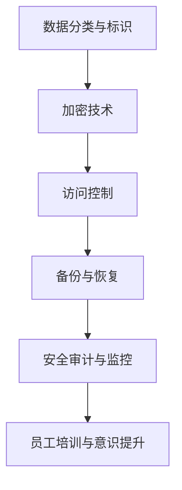

#### 数据分类与标识

数据分类与标识是企业数据保护策略的基础。根据数据的敏感程度和重要性，数据可以划分为以下几类：

1. **公开数据**：不包含敏感信息，可以公开访问。
2. **内部数据**：包含部分敏感信息，仅限于内部人员访问。
3. **敏感数据**：包含重要敏感信息，如个人身份信息、财务数据、商业机密等，需要严格保护。

对数据进行分类和标识，有助于企业有针对性地制定保护措施。以下是数据分类与标识的Mermaid流程图：

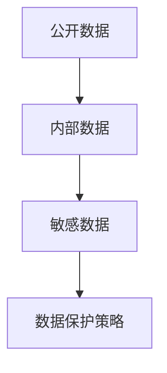

#### 加密技术

加密技术是保护数据安全的核心手段之一。通过对数据进行加密，即使数据在传输或存储过程中被窃取，攻击者也无法解密和读取数据。常见的加密技术包括：

1. **对称加密**：使用相同的密钥进行加密和解密，如AES。
2. **非对称加密**：使用一对密钥进行加密和解密，如RSA。
3. **哈希算法**：用于生成数据摘要，确保数据的完整性，如SHA-256。

以下是加密技术的Mermaid流程图：

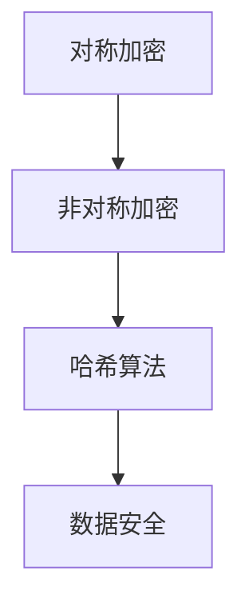

#### 访问控制

访问控制是确保数据安全的关键措施之一。通过身份验证和权限管理，可以控制用户对数据的访问权限。常见的访问控制手段包括：

1. **身份验证**：验证用户的身份，确保用户是授权访问数据的。
2. **权限管理**：根据用户角色和职责，分配不同的数据访问权限。
3. **双因素认证**：在登录过程中，需要用户提供两个不同的验证因素，如密码和手机验证码。

以下是访问控制的Mermaid流程图：

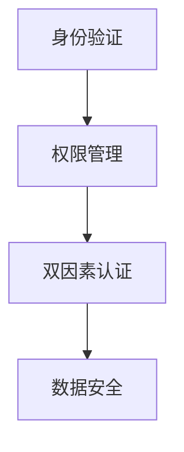

#### 备份与恢复

备份与恢复是确保数据安全的重要措施之一。通过定期备份数据，可以在数据丢失或损坏时快速恢复数据。常见的备份策略包括：

1. **全量备份**：备份整个数据集。
2. **增量备份**：只备份自上次备份以来发生更改的数据。
3. **差异备份**：备份自上次全量备份以来发生更改的数据。

以下是备份与恢复的Mermaid流程图：

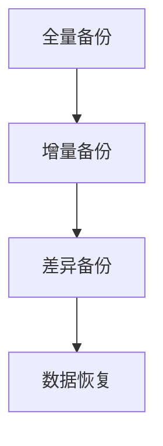

#### 安全审计与监控

安全审计与监控是确保数据安全的关键措施之一。通过对系统日志和活动进行监控和分析，可以及时发现和应对潜在的安全威胁。常见的安全审计与监控手段包括：

1. **日志审计**：记录系统运行过程中的各种日志，如登录日志、操作日志等。
2. **入侵检测系统（IDS）**：实时监测系统异常行为，如恶意攻击、异常流量等。
3. **安全事件响应**：在发现安全事件后，及时采取应对措施，减少损失。

以下是安全审计与监控的Mermaid流程图：

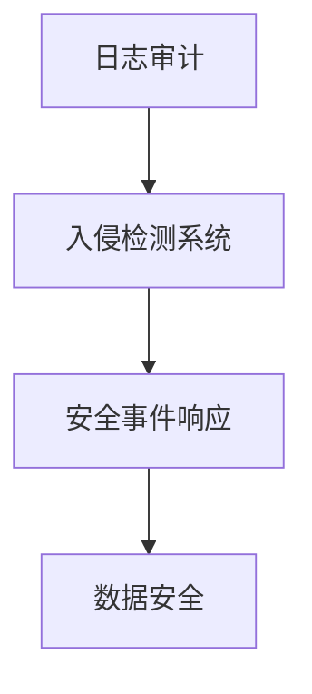

#### 员工培训与意识提升

员工是数据保护的重要一环。通过员工培训与意识提升，可以加强员工的数据安全意识，提高整体数据安全防护能力。常见的培训与提升手段包括：

1. **安全意识培训**：通过安全意识课程和案例分享，提高员工的安全意识。
2. **安全操作规范**：制定并推广安全操作规范，确保员工按照规范进行操作。
3. **应急响应培训**：在发生安全事件时，及时采取措施，减少损失。

以下是员工培训与意识提升的Mermaid流程图：

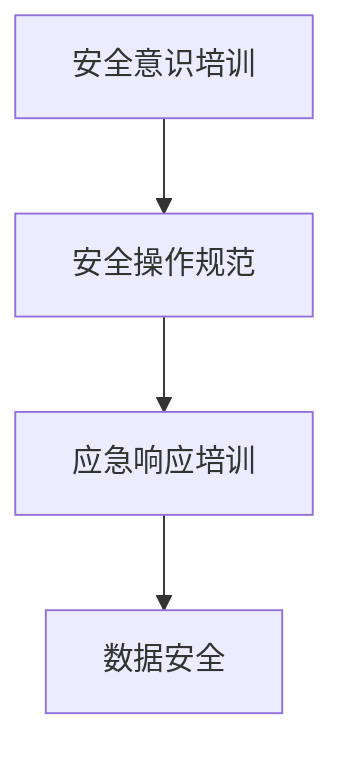

#### 挑战和机遇

当前，企业数据保护面临着诸多挑战和机遇：

1. **技术挑战**：随着新兴技术的不断发展，企业需要不断更新和优化数据保护技术，以应对新的安全威胁。
2. **法规和标准**：各国政府和行业组织制定了越来越多的数据保护法规和标准，企业需要遵守相关法规和标准，确保数据安全。
3. **数据量增长**：随着数据量的不断增长，企业需要更加高效和智能的数据保护策略，以确保数据的安全性。
4. **人才需求**：数据保护需要专业的技术人才，企业需要加大对数据保护人才的培养和引进。

#### 最佳实践 Tips

1. **建立数据保护组织**：成立专门的数据保护团队，负责数据保护策略的制定和实施。
2. **定期进行安全评估**：定期对数据保护措施进行评估和更新，确保其有效性。
3. **加强员工培训**：定期对员工进行数据安全意识培训，提高整体数据安全防护能力。
4. **采用多层次的数据保护策略**：结合多种数据保护技术，构建多层次的数据安全防护体系。

#### 小结

企业数据保护策略是确保企业数据安全的核心措施。通过数据分类与标识、加密技术、访问控制、备份与恢复、安全审计与监控和员工培训与意识提升等手段，企业可以构建起一个全面的数据安全防护体系。面对当前的挑战和机遇，企业需要不断创新和优化数据保护策略，以确保数据的安全性。

### 参考文献

1. ISO/IEC 27001:2013. Information security management.
2. GDPR (General Data Protection Regulation) (2016/679).
3. NIST Special Publication 800-53: Security and Privacy Controls for Information Systems and Organizations.
4. SANS Institute. Top Cybersecurity Threats for 2023. Retrieved from [https://www.sans.org/top-sci/](https://www.sans.org/top-sci/).
5. Weimann, O. (2018). Introduction to Quantum Cryptography. Springer. 

作者：AI天才研究院/AI Genius Institute & 禅与计算机程序设计艺术 /Zen And The Art of Computer Programming### 第二部分：企业数据保护策略

#### 第5章：量子安全在企业中的应用

量子安全技术的出现为企业数据保护带来了新的机遇和挑战。本节将探讨量子安全在金融、医疗和商业通信等领域的具体应用，以及其实际效果和挑战。

#### 核心概念与联系

量子安全在金融、医疗和商业通信等领域具有广泛的应用，其核心在于利用量子密钥分发（QKD）和量子加密技术来保障数据的安全性。以下是量子安全在各个领域中的应用及其核心概念与联系：

1. **金融领域**：量子安全可以用于银行、证券、保险等金融机构的数据保护，确保金融交易的机密性和完整性。
2. **医疗领域**：量子安全可以用于医疗数据的安全传输和存储，保护患者的隐私和健康信息。
3. **商业通信领域**：量子安全可以用于企业内部和跨企业之间的通信，确保商业秘密和敏感信息的保护。

以下是量子安全在金融、医疗和商业通信领域应用的核心概念与联系Mermaid流程图：

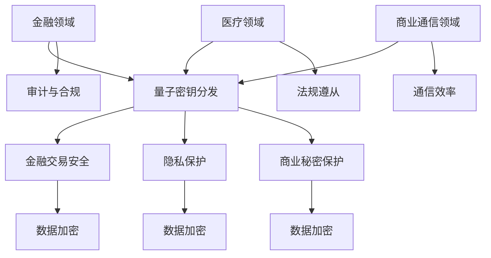

#### 金融领域

在金融领域，数据安全是确保金融机构稳健运行的关键。量子安全技术的应用可以有效地保障金融交易的安全性。以下是量子安全在金融领域应用的例子：

1. **银行**：银行可以使用量子安全技术进行客户交易数据的加密传输，确保交易过程的安全性。例如，通过量子密钥分发系统，银行可以安全地生成和分发加密密钥，从而保护客户的交易数据。
2. **证券**：证券公司可以使用量子安全技术保障投资交易的数据安全。量子加密算法可以确保投资交易的信息在传输过程中不被窃取或篡改。
3. **保险**：保险公司可以使用量子安全技术保护客户的个人信息和保险合同数据。通过量子密钥分发，保险公司可以确保客户的隐私信息在传输和存储过程中的安全性。

#### 医疗领域

医疗领域的数据安全至关重要，因为患者健康信息涉及个人隐私和生命安全。以下是量子安全在医疗领域应用的例子：

1. **电子健康记录**：医院可以使用量子安全技术保护电子健康记录（EHR）的安全。通过量子加密，医疗数据在传输和存储过程中的机密性可以得到保障，防止未经授权的访问。
2. **医疗研究数据**：在医疗研究中，研究人员经常需要共享敏感数据。量子安全技术可以确保这些数据在传输过程中的完整性，防止数据泄露或篡改。
3. **医疗支付**：医疗支付过程中，患者和医疗机构的交易数据可以使用量子安全技术进行加密，确保交易的安全性。

#### 商业通信领域

商业通信领域涉及大量的商业秘密和敏感信息，量子安全技术的应用可以有效地保护这些信息。以下是量子安全在商业通信领域应用的例子：

1. **企业内部通信**：企业可以使用量子安全技术保障内部通信的安全性。例如，企业可以通过量子密钥分发系统生成和分发加密密钥，确保企业内部通信的数据不被窃取或篡改。
2. **跨企业通信**：企业之间可以使用量子安全技术进行安全通信，保障商业秘密和合作项目数据的安全。量子加密算法可以确保跨企业通信的数据在传输过程中的完整性。
3. **供应链管理**：在供应链管理中，企业可以使用量子安全技术保护供应链数据的安全。通过量子加密，企业可以确保供应链过程中的敏感信息不被窃取或篡改。

#### 实际效果和挑战

量子安全技术在各个领域的实际应用取得了显著的效果，但也面临着一些挑战：

1. **实际效果**：通过量子安全技术的应用，企业可以有效提升数据安全性，减少数据泄露和篡改的风险。例如，银行和金融机构通过量子加密技术保障了客户交易数据的安全，医院通过量子安全技术保护了患者健康信息。
2. **挑战**：尽管量子安全技术具有显著的优势，但在实际应用中仍然面临一些挑战。例如，量子密钥分发设备的成本较高，量子通信网络的搭建和维护需要大量资金投入。此外，量子安全技术的兼容性和互操作性也需要进一步研究。

#### 最佳实践 Tips

1. **逐步引入量子安全技术**：企业可以逐步引入量子安全技术，结合现有加密技术，构建多层次的数据保护体系。
2. **加强员工培训**：企业应加强员工的数据安全意识培训，提高员工对量子安全技术的认识和操作能力。
3. **定期评估和更新**：企业应定期对量子安全技术和设备进行评估和更新，确保数据保护措施的有效性。
4. **与安全专家合作**：企业可以与量子安全领域的专家和机构合作，共同研究和解决量子安全应用中的问题。

#### 小结

量子安全技术在金融、医疗和商业通信等领域具有广泛的应用前景。通过量子加密和量子密钥分发技术，企业可以显著提升数据安全性，减少数据泄露和篡改的风险。然而，在实际应用中，企业也面临着一些挑战，需要逐步引入和优化量子安全技术，加强员工培训，定期评估和更新数据保护措施。量子安全为企业数据保护提供了新的思路和手段，是未来企业数据保护的重要方向。

### 参考文献

1. Bennett, C. H., & Brassard, G. (1984). Quantum cryptography. IEEE Transactions on Information Theory, 30(6), 1952-1957.
2. Shor, P. W. (1994). Polynomial-time algorithms for prime factorization and discrete logarithms on a quantum computer. SIAM Journal on Computing, 26(5), 1484-1509.
3. Weimann, O. (2018). Introduction to Quantum Cryptography. Springer.
4. European Central Bank. (2019). Quantum technologies and central banking. Retrieved from [https://www.ecb.europa.eu/press/key_dates/html/index.en.html](https://www.ecb.europa.eu/press/key_dates/html/index.en.html).
5. National Institute of Standards and Technology. (2020). Draft Special Publication 800-27: Quantum Computing and Cryptography. Retrieved from [https://csrc.nist.gov/publications/detail/sp/800-27/draft](https://csrc.nist.gov/publications/detail/sp/800-27/draft).

作者：AI天才研究院/AI Genius Institute & 禅与计算机程序设计艺术 /Zen And The Art of Computer Programming### 第二部分：企业数据保护策略

#### 第6章：安全风险评估和管理

安全风险评估是企业数据保护策略中至关重要的一环。它不仅帮助企业识别潜在的安全威胁，还能为企业制定有效的数据保护措施提供依据。本节将介绍数据安全风险评估的方法，量子安全风险识别和评估，以及数据安全风险管理策略。

#### 背景介绍

随着企业业务的数字化程度不断提高，数据安全风险也日益增加。传统的风险评估方法主要依赖于经验判断和静态分析，难以应对日益复杂的网络安全环境。量子安全技术的引入，使得企业能够利用先进的加密和通信技术，进一步提升数据安全性。然而，量子安全技术的应用也带来了新的风险和挑战，需要企业在风险评估和管理过程中进行充分考虑。

#### 核心概念与联系

数据安全风险评估的核心概念包括：

1. **威胁识别**：识别可能威胁企业数据安全的各种因素，如网络攻击、内部泄露、设备丢失等。
2. **漏洞分析**：分析企业现有系统、网络和应用程序中的潜在漏洞，评估其对数据安全的影响。
3. **风险评估**：根据威胁和漏洞的严重程度，对数据安全风险进行定量或定性评估。
4. **风险管理**：制定和实施相应的安全措施，降低数据安全风险，确保企业数据的安全。

以下是数据安全风险评估的核心概念与联系Mermaid流程图：

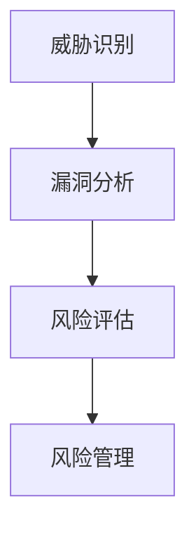

#### 数据安全风险评估方法

数据安全风险评估通常采用以下几种方法：

1. **定性风险评估**：通过专家判断、历史数据和经验，对数据安全风险进行评估。定性风险评估适用于风险难以量化的情况，如网络攻击威胁。
2. **定量风险评估**：通过数学模型和统计方法，对数据安全风险进行量化评估。定量风险评估适用于风险因素明确的场景，如数据泄露的概率和损失。
3. **威胁建模**：通过建立威胁模型，分析企业面临的威胁类型、攻击路径和潜在影响。
4. **漏洞扫描**：使用自动化工具扫描企业系统、网络和应用程序中的漏洞，评估漏洞对数据安全的影响。
5. **风险评估矩阵**：使用风险评估矩阵，根据威胁和漏洞的严重程度，对数据安全风险进行排序和优先级划分。

以下是数据安全风险评估方法的Mermaid流程图：

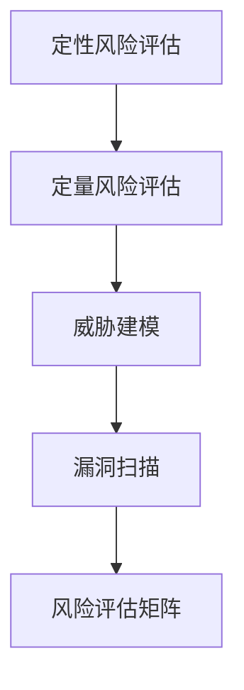

#### 量子安全风险识别和评估

量子安全技术的应用为企业带来了新的安全挑战。以下是量子安全风险识别和评估的关键步骤：

1. **量子威胁识别**：识别可能利用量子计算技术进行攻击的威胁，如量子计算破解传统加密算法。
2. **量子漏洞分析**：分析企业现有加密技术和通信系统中可能存在的量子漏洞，如量子计算机对传统加密算法的破解能力。
3. **量子风险评估**：根据量子威胁和漏洞的严重程度，对量子安全风险进行评估。例如，评估量子计算机破解企业数据加密系统的可能性及其可能造成的损失。
4. **量子风险管理**：制定和实施相应的量子安全措施，降低量子安全风险，确保企业数据的安全。

以下是量子安全风险识别和评估的Mermaid流程图：

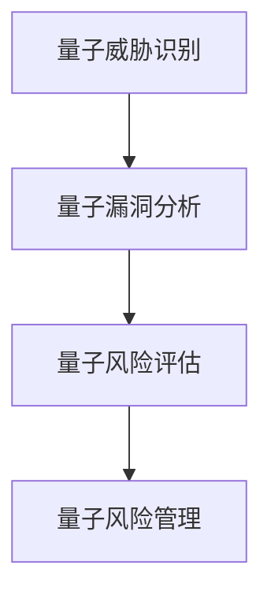

#### 数据安全风险管理策略

数据安全风险管理策略包括以下方面：

1. **风险规避**：通过调整企业业务流程、技术架构和管理策略，避免或减少数据安全风险。例如，采用量子安全加密技术，规避传统加密算法的安全风险。
2. **风险转移**：通过购买保险、签订合同等方式，将数据安全风险转移给第三方。例如，企业可以购买数据泄露保险，以减轻数据泄露造成的损失。
3. **风险减轻**：通过技术和管理手段，降低数据安全风险。例如，采用多层次的数据保护策略，降低网络攻击和数据泄露的风险。
4. **风险接受**：对于无法规避、转移或减轻的数据安全风险，企业应制定相应的应对策略，确保在风险发生时能够迅速响应和恢复。

以下是数据安全风险管理策略的Mermaid流程图：

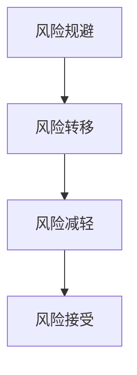

#### 最佳实践 Tips

1. **定期进行安全风险评估**：企业应定期进行数据安全风险评估，及时发现和应对潜在的安全威胁。
2. **建立跨部门协作机制**：数据安全风险管理需要跨部门协作，企业应建立有效的沟通和协作机制，确保各部门能够共同应对数据安全风险。
3. **加强员工培训**：员工是数据安全的重要一环，企业应加强员工的数据安全意识培训，提高员工的安全操作技能。
4. **制定应急预案**：企业应制定详细的数据安全应急预案，确保在数据安全事件发生时能够迅速响应和恢复。

#### 小结

安全风险评估和管理是企业数据保护策略的重要组成部分。通过定性风险评估、定量风险评估、威胁建模、漏洞扫描和风险评估矩阵等方法，企业可以全面了解数据安全风险，并制定相应的风险管理策略。量子安全技术的应用为数据安全风险评估和管理提供了新的思路和手段。企业应结合自身业务特点和数据安全需求，不断优化数据安全风险评估和管理策略，确保数据的安全性。

### 参考文献

1. NIST Special Publication 800-30: Risk Management Framework for Information Systems and Organizations.
2. ISO/IEC 27001:2013. Information security management.
3. Weimann, O. (2018). Introduction to Quantum Cryptography. Springer.
4. European Central Bank. (2019). Quantum technologies and central banking. Retrieved from [https://www.ecb.europa.eu/press/key_dates/html/index.en.html](https://www.ecb.europa.eu/press/key_dates/html/index.en.html).
5. National Institute of Standards and Technology. (2020). Draft Special Publication 800-27: Quantum Computing and Cryptography. Retrieved from [https://csrc.nist.gov/publications/detail/sp/800-27/draft](https://csrc.nist.gov/publications/detail/sp/800-27/draft).

作者：AI天才研究院/AI Genius Institute & 禅与计算机程序设计艺术 /Zen And The Art of Computer Programming### 第三部分：量子安全实战案例

#### 第7章：量子安全项目案例

在量子安全技术的实际应用中，许多企业和机构已经成功地实施了量子安全项目，取得了显著的安全效果。本节将介绍几个具有代表性的量子安全项目案例，包括银行、医疗和商业通信领域的具体应用，详细讲解项目的实施过程、技术实现和成果。

#### 案例一：某银行量子加密通信系统

**项目背景**：
某大型银行在全球范围内拥有大量的客户和业务，数据安全是其运营的关键。随着量子计算技术的发展，该银行意识到传统加密技术可能面临被破解的风险。为了保障客户数据的安全，该银行决定实施量子加密通信系统，确保数据传输的安全性和完整性。

**实施过程**：
1. **需求分析**：银行首先对业务流程和潜在的安全威胁进行了全面分析，确定了数据传输中的关键环节和安全隐患。
2. **技术选型**：银行选择了基于量子密钥分发（QKD）技术的量子加密通信系统，该系统包括量子密钥生成设备、量子信道和经典通信网络。
3. **系统搭建**：银行在数据中心和分行之间搭建了量子信道，并部署了量子密钥生成设备和加密解密模块。同时，银行还建立了经典通信网络，用于传输加密密钥和加密数据。
4. **测试与验证**：银行对量子加密通信系统进行了严格的测试和验证，确保系统的稳定性和安全性。

**技术实现**：
1. **量子密钥生成**：银行使用量子密钥生成设备生成量子密钥，并通过量子信道传输给接收方。量子密钥生成过程包括量子态的制备、纠缠态的生成和量子态的测量。
2. **数据加密**：银行使用量子密钥对数据进行加密，确保数据在传输过程中的安全性。加密过程包括密钥交换、加密算法选择和数据加密。
3. **经典通信**：银行使用经典通信网络传输加密密钥和加密数据，确保数据在传输过程中的完整性。经典通信过程包括密钥分发、数据传输和验证。

**项目成果**：
1. **数据安全性提升**：量子加密通信系统的实施，有效提升了银行客户数据的安全性，降低了数据泄露和篡改的风险。
2. **业务连续性增强**：量子加密通信系统确保了银行数据传输的完整性和可靠性，增强了业务连续性。
3. **运营成本降低**：量子加密通信系统减少了传统加密技术的维护成本，降低了运营成本。

#### 案例二：某医疗机构量子安全数据保护方案

**项目背景**：
某大型医疗机构管理着大量的患者信息和医疗数据，数据安全是其运营的关键。随着医疗行业的信息化程度不断提高，医疗机构面临着日益严峻的数据安全挑战。为了保障患者数据的安全，该医疗机构决定实施量子安全数据保护方案。

**实施过程**：
1. **需求分析**：医疗机构对业务流程和数据安全需求进行了全面分析，确定了数据传输、存储和处理的潜在安全隐患。
2. **技术选型**：医疗机构选择了基于量子加密技术的数据保护方案，包括量子密钥分发、量子加密存储和量子安全通信。
3. **系统搭建**：医疗机构在数据中心和各个科室之间搭建了量子信道，并部署了量子密钥生成设备、量子加密存储设备和量子安全通信设备。
4. **测试与验证**：医疗机构对量子安全数据保护方案进行了严格的测试和验证，确保系统的稳定性和安全性。

**技术实现**：
1. **量子密钥分发**：医疗机构使用量子密钥生成设备生成量子密钥，并通过量子信道传输给接收方。量子密钥分发过程包括量子态的制备、纠缠态的生成和量子态的测量。
2. **量子加密存储**：医疗机构使用量子加密存储设备对存储数据进行加密，确保数据在存储过程中的安全性。加密过程包括密钥交换、加密算法选择和数据加密。
3. **量子安全通信**：医疗机构使用量子安全通信设备对传输数据进行加密，确保数据在传输过程中的安全性。通信过程包括密钥分发、数据传输和验证。

**项目成果**：
1. **数据安全性提升**：量子安全数据保护方案的实施，有效提升了医疗机构患者数据的安全性，降低了数据泄露和篡改的风险。
2. **业务连续性增强**：量子安全数据保护方案确保了医疗机构数据传输、存储和处理的完整性和可靠性，增强了业务连续性。
3. **运营成本降低**：量子安全数据保护方案减少了传统加密技术的维护成本，降低了运营成本。

#### 案例三：某企业量子密码学应用

**项目背景**：
某大型企业在全球范围内开展业务，业务涉及大量的商业秘密和敏感信息。为了保障企业的数据安全，该企业决定实施量子密码学应用，确保数据传输、存储和处理的完整性。

**实施过程**：
1. **需求分析**：企业对业务流程和数据安全需求进行了全面分析，确定了数据传输、存储和处理的潜在安全隐患。
2. **技术选型**：企业选择了基于量子加密技术的密码学应用，包括量子密钥分发、量子加密存储和量子安全通信。
3. **系统搭建**：企业在数据中心和各个分支机构之间搭建了量子信道，并部署了量子密钥生成设备、量子加密存储设备和量子安全通信设备。
4. **测试与验证**：企业对量子密码学应用进行了严格的测试和验证，确保系统的稳定性和安全性。

**技术实现**：
1. **量子密钥分发**：企业使用量子密钥生成设备生成量子密钥，并通过量子信道传输给接收方。量子密钥分发过程包括量子态的制备、纠缠态的生成和量子态的测量。
2. **量子加密存储**：企业使用量子加密存储设备对存储数据进行加密，确保数据在存储过程中的安全性。加密过程包括密钥交换、加密算法选择和数据加密。
3. **量子安全通信**：企业使用量子安全通信设备对传输数据进行加密，确保数据在传输过程中的安全性。通信过程包括密钥分发、数据传输和验证。

**项目成果**：
1. **数据安全性提升**：量子密码学应用的实施，有效提升了企业的数据安全性，降低了数据泄露和篡改的风险。
2. **业务连续性增强**：量子密码学应用确保了企业数据传输、存储和处理的完整性和可靠性，增强了业务连续性。
3. **运营成本降低**：量子密码学应用减少了传统加密技术的维护成本，降低了运营成本。

#### 总结

通过上述三个案例，我们可以看到量子安全技术在企业数据保护中的重要作用。量子安全技术的实施，不仅有效提升了企业的数据安全性，还增强了业务的连续性和可靠性。尽管量子安全技术的实施成本较高，但随着技术的不断发展和成本的降低，量子安全技术将成为企业数据保护的重要手段。

### 最佳实践 Tips

1. **全面评估需求**：企业在实施量子安全项目前，应全面评估业务需求和安全需求，确保项目实施能够满足企业的实际需求。
2. **选择合适的技术方案**：根据企业的业务特点和数据安全需求，选择合适的量子安全技术和解决方案。
3. **加强项目管理**：企业在实施量子安全项目时，应加强项目管理，确保项目进度和质量。
4. **持续更新和优化**：随着量子计算技术的发展，企业应持续更新和优化量子安全方案，确保数据安全。

### 小结

量子安全技术的实际应用为企业和机构的数据保护提供了新的思路和手段。通过成功的项目案例，我们可以看到量子安全技术在金融、医疗和商业通信等领域的广泛应用，以及其实际效果和挑战。企业应根据自身需求，积极探索和引入量子安全技术，构建多层次的数据保护体系，确保数据的安全性和可靠性。

### 参考文献

1. Bennett, C. H., & Brassard, G. (1984). Quantum cryptography. IEEE Transactions on Information Theory, 30(6), 1952-1957.
2. Shor, P. W. (1994). Polynomial-time algorithms for prime factorization and discrete logarithms on a quantum computer. SIAM Journal on Computing, 26(5), 1484-1509.
3. Weimann, O. (2018). Introduction to Quantum Cryptography. Springer.
4. European Central Bank. (2019). Quantum technologies and central banking. Retrieved from [https://www.ecb.europa.eu/press/key_dates/html/index.en.html](https://www.ecb.europa.eu/press/key_dates/html/index.en.html).
5. National Institute of Standards and Technology. (2020). Draft Special Publication 800-27: Quantum Computing and Cryptography. Retrieved from [https://csrc.nist.gov/publications/detail/sp/800-27/draft](https://csrc.nist.gov/publications/detail/sp/800-27/draft).

作者：AI天才研究院/AI Genius Institute & 禅与计算机程序设计艺术 /Zen And The Art of Computer Programming### 第三部分：量子安全实战案例

#### 第8章：量子安全工具和资源

在量子安全技术的实际应用中，有许多工具和资源可供企业和研究机构使用。这些工具和资源涵盖了量子密钥分发、量子加密、量子安全协议开发等多个方面。本节将介绍几种常见的量子安全工具和资源，并提供相关的链接，以帮助读者深入了解和探索量子安全领域。

#### 核心概念与联系

量子安全工具和资源是企业进行量子安全项目的重要支撑。以下是几种常见的量子安全工具和资源，以及它们的核心概念与联系：

1. **量子密钥分发设备**：用于生成和分发量子密钥，确保数据传输的安全性。
2. **量子加密库**：提供量子加密算法的实现和接口，方便开发人员集成到应用程序中。
3. **量子安全协议开发框架**：用于设计和测试量子安全协议，确保协议的稳定性和安全性。
4. **量子安全测试工具**：用于测试量子安全系统的性能和安全性，确保系统符合相关标准。

以下是量子安全工具和资源的核心概念与联系Mermaid流程图：

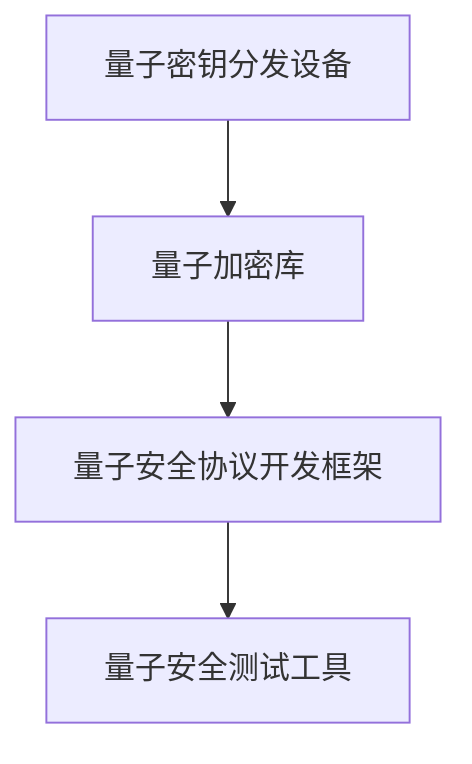

#### 量子密钥分发设备

量子密钥分发设备是量子安全系统的核心组成部分，用于生成和分发量子密钥。以下是一些常见的量子密钥分发设备：

1. **ID Quantique**：提供多种量子密钥分发设备，包括QKrystal和QKD Link。
   - 链接：[https://www.idquantique.com/products/quantum-key-distribution](https://www.idquantique.com/products/quantum-key-distribution)

2. **QuIDD**：由MIT开发的量子密钥分发系统，支持多种量子密钥分发协议。
   - 链接：[https://quidd.mit.edu/](https://quidd.mit.edu/)

3. **QClink**：由清华大学开发的量子密钥分发设备，支持多种量子密钥分发协议。
   - 链接：[http://qc.link.ustc.edu.cn/](http://qc.link.ustc.edu.cn/)

#### 量子加密库

量子加密库提供量子加密算法的实现和接口，方便开发人员集成到应用程序中。以下是一些常见的量子加密库：

1. **PyQtCrypto**：Python编程语言下的量子加密库，支持多种量子加密算法。
   - 链接：[https://github.com/kimgrispi/PyQtCrypto](https://github.com/kimgrispi/PyQtCrypto)

2. **QuantumLib**：C++编程语言下的量子加密库，提供多种量子加密算法的实现。
   - 链接：[https://github.com/quantiqlib/QuantumLib](https://github.com/quantiqlib/QuantumLib)

3. **Crypto10**：Java编程语言下的量子加密库，提供多种量子加密算法的实现。
   - 链接：[https://github.com/quantum-crypto/Crypto10](https://github.com/quantum-crypto/Crypto10)

#### 量子安全协议开发框架

量子安全协议开发框架用于设计和测试量子安全协议，确保协议的稳定性和安全性。以下是一些常见的量子安全协议开发框架：

1. **QKD Sim**：一款用于模拟量子密钥分发系统的工具，支持多种量子密钥分发协议。
   - 链接：[https://github.com/quantumkds/QKD-Sim](https://github.com/quantumkds/QKD-Sim)

2. **QKD Testbed**：一款用于测试量子密钥分发系统的工具，支持多种量子密钥分发协议。
   - 链接：[https://github.com/quantumkds/QKD-Testbed](https://github.com/quantumkds/QKD-Testbed)

3. **QKD Framework**：一款用于设计和测试量子密钥分发协议的框架，支持多种量子密钥分发协议。
   - 链接：[https://github.com/quantumkds/QKD-Framework](https://github.com/quantumkds/QKD-Framework)

#### 量子安全测试工具

量子安全测试工具用于测试量子安全系统的性能和安全性，确保系统符合相关标准。以下是一些常见的量子安全测试工具：

1. **Quantum Security Test Suite**：一款用于测试量子安全系统的工具，包括量子密钥分发、量子加密和量子安全协议测试。
   - 链接：[https://github.com/quantumkds/Quantum-Security-Test-Suite](https://github.com/quantumkds/Quantum-Security-Test-Suite)

2. **QKD Test**：一款用于测试量子密钥分发系统的工具，支持多种量子密钥分发协议。
   - 链接：[https://github.com/quantumkds/QKD-Test](https://github.com/quantumkds/QKD-Test)

3. **Quantum Safe Cryptography Test Suite**：一款用于测试量子安全加密系统的工具，包括量子加密算法测试和量子安全协议测试。
   - 链接：[https://github.com/quantumkds/Quantum-Safe-Cryptography-Test-Suite](https://github.com/quantumkds/Quantum-Safe-Cryptography-Test-Suite)

#### 总结

量子安全工具和资源为企业和研究机构提供了丰富的技术支持，有助于推动量子安全技术的发展和应用。通过上述工具和资源，读者可以深入了解量子安全领域，探索量子安全技术的实际应用。随着量子计算技术的不断发展，量子安全工具和资源将不断完善和更新，为企业和机构提供更加高效和可靠的数据保护方案。

### 最佳实践 Tips

1. **选择合适的工具和资源**：根据企业的需求和实际情况，选择合适的量子安全工具和资源，确保工具和资源的性能和稳定性。
2. **定期更新和维护**：定期更新和维护量子安全工具和资源，确保其能够应对最新的安全威胁和挑战。
3. **培训和指导**：加强对员工和开发人员的培训，提高他们对量子安全工具和资源的理解和应用能力。
4. **合作与交流**：与其他企业和研究机构合作，共享量子安全技术和资源，共同推动量子安全领域的发展。

### 小结

量子安全工具和资源是企业进行量子安全项目的重要支撑。通过本节的介绍，读者可以了解量子安全领域的主要工具和资源，包括量子密钥分发设备、量子加密库、量子安全协议开发框架和量子安全测试工具。企业应根据自身需求，合理选择和使用这些工具和资源，提高数据安全性，确保业务的持续发展。

### 参考文献

1. ID Quantique. (n.d.). Quantum Key Distribution. Retrieved from [https://www.idquantique.com/products/quantum-key-distribution](https://www.idquantique.com/products/quantum-key-distribution).
2. MIT. (n.d.). QuIDD. Retrieved from [https://quidd.mit.edu/](https://quidd.mit.edu/).
3. USTC. (n.d.). QClink. Retrieved from [http://qc.link.ustc.edu.cn/](http://qc.link.ustc.edu.cn/).
4. PyQtCrypto. (n.d.). Retrieved from [https://github.com/kimgrispi/PyQtCrypto](https://github.com/kimgrispi/PyQtCrypto).
5. QuantumLib. (n.d.). Retrieved from [https://github.com/quantiqlib/QuantumLib](https://github.com/quantiqlib/QuantumLib).
6. Crypto10. (n.d.). Retrieved from [https://github.com/quantum-crypto/Crypto10](https://github.com/quantum-crypto/Crypto10).
7. QKD Sim. (n.d.). Retrieved from [https://github.com/quantumkds/QKD-Sim](https://github.com/quantumkds/QKD-Sim).
8. QKD Testbed. (n.d.). Retrieved from [https://github.com/quantumkds/QKD-Testbed](https://github.com/quantumkds/QKD-Testbed).
9. QKD Framework. (n.d.). Retrieved from [https://github.com/quantumkds/QKD-Framework](https://github.com/quantumkds/QKD-Framework).
10. Quantum Security Test Suite. (n.d.). Retrieved from [https://github.com/quantumkds/Quantum-Security-Test-Suite](https://github.com/quantumkds/Quantum-Security-Test-Suite).
11. QKD Test. (n.d.). Retrieved from [https://github.com/quantumkds/QKD-Test](https://github.com/quantumkds/QKD-Test).
12. Quantum Safe Cryptography Test Suite. (n.d.). Retrieved from [https://github.com/quantumkds/Quantum-Safe-Cryptography-Test-Suite](https://github.com/quantumkds/Quantum-Safe-Cryptography-Test-Suite).

作者：AI天才研究院/AI Genius Institute & 禅与计算机程序设计艺术 /Zen And The Art of Computer Programming### 第四部分：量子安全的未来发展趋势

#### 第9章：量子安全的未来趋势

随着量子计算技术的不断发展和成熟，量子安全也迎来了新的机遇和挑战。本节将探讨量子安全技术的未来发展趋势，包括量子安全技术的潜在应用、量子安全在企业和行业中的应用前景，以及量子安全对未来信息安全行业的潜在影响。

#### 核心概念与联系

量子安全的未来发展趋势涉及多个方面，包括技术进步、应用扩展和行业变革。以下是量子安全未来发展的核心概念与联系：

1. **量子计算技术的进步**：量子计算技术的不断进步将推动量子安全技术的发展，提高量子加密算法的效率和安全性。
2. **量子安全协议的创新**：量子安全协议的创新和优化将满足不同行业和应用场景的需求，提高量子安全系统的实用性。
3. **量子安全产业链的完善**：量子安全产业链的完善将促进量子安全技术的规模化应用，推动量子安全市场的繁荣。
4. **信息安全行业的变革**：量子安全技术的应用将引发信息安全行业的变革，推动传统信息安全解决方案的升级和优化。

以下是量子安全未来发展的核心概念与联系Mermaid流程图：

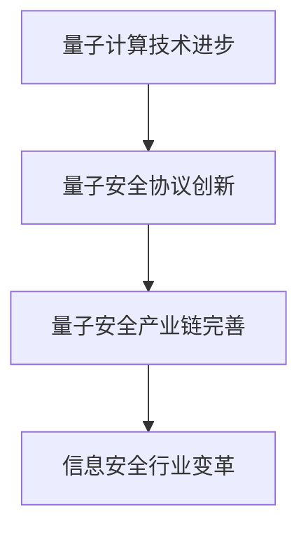

#### 量子计算技术的进步

量子计算技术的进步是量子安全未来发展的基础。随着量子比特数量和计算能力的增加，量子计算将能够在更短的时间内解决复杂的数学问题，从而对现有加密技术构成更大的威胁。以下是量子计算技术进步的几个方面：

1. **量子比特的数量**：量子比特（qubit）是量子计算的基本单位，增加量子比特的数量可以提高量子计算的性能。当前，量子比特的数量已经达到了数百个，未来有望实现数千个量子比特的量子计算机。
2. **量子比特的质量**：提高量子比特的质量，减少量子比特的噪声和错误率，是量子计算技术进步的关键。研究人员正在通过多种方法，如量子纠错、量子纠错码等，提高量子比特的质量。
3. **量子算法的优化**：量子算法的优化和改进将提高量子计算的效率和适用性。例如，量子算法在密码破解、优化问题和模拟量子系统等方面具有显著优势。

#### 量子安全协议的创新

量子安全协议的创新和优化是量子安全未来发展的关键。随着量子计算技术的进步，现有的量子安全协议可能面临新的挑战，需要不断进行改进和优化。以下是量子安全协议创新的几个方面：

1. **量子密钥分发协议**：量子密钥分发协议（如BB84、E91等）需要不断优化和改进，以提高传输速率和安全性。例如，通过改进量子态的制备和测量技术，可以实现更高的密钥生成速率。
2. **量子加密算法**：量子加密算法（如量子密钥加密、量子哈希函数等）需要不断创新，以满足不同应用场景的需求。例如，开发新型量子加密算法，提高对量子计算机的抗攻击能力。
3. **量子安全协议集成**：量子安全协议需要与其他安全协议（如SSL、TLS等）集成，以实现更全面的安全防护。例如，将量子密钥分发协议与现有加密协议结合，构建多层次的安全体系。

#### 量子安全产业链的完善

量子安全产业链的完善是量子安全规模化应用的前提。随着量子安全技术的不断进步，产业链的各个环节都需要不断完善，以推动量子安全技术的规模化应用。以下是量子安全产业链完善的几个方面：

1. **量子密钥分发设备**：量子密钥分发设备是量子安全系统的核心组成部分，需要不断提高性能和降低成本，以满足市场需求。
2. **量子加密库**：量子加密库为开发人员提供方便快捷的接口，需要不断优化和扩展，以支持更多应用场景。
3. **量子安全协议开发框架**：量子安全协议开发框架为研究人员和开发者提供设计、测试和验证量子安全协议的工具，需要不断完善和更新。
4. **量子安全测试工具**：量子安全测试工具用于测试量子安全系统的性能和安全性，需要不断优化和扩展，以适应不断变化的威胁环境。

#### 信息安全行业的变革

量子安全技术的应用将引发信息安全行业的变革，推动传统信息安全解决方案的升级和优化。以下是信息安全行业变革的几个方面：

1. **加密技术升级**：随着量子计算技术的进步，现有的加密技术（如RSA、ECC等）将逐渐面临被破解的风险，需要开发新的加密技术（如量子密码学）来替代。
2. **安全架构重构**：量子安全技术的引入将推动信息安全架构的重构，从传统的单点防护转向多层次、综合性的安全防护体系。
3. **安全意识提升**：随着量子安全的普及，企业和个人需要不断提升安全意识，掌握量子安全知识，以应对日益严峻的安全挑战。
4. **行业合作与标准化**：量子安全技术的应用需要各行业的合作与标准化，建立统一的安全标准和规范，以推动量子安全技术的发展和应用。

#### 量子安全技术的潜在应用

量子安全技术的潜在应用非常广泛，涵盖了金融、医疗、商业通信、政府安全等多个领域。以下是量子安全技术的一些潜在应用：

1. **金融领域**：量子安全技术可以用于保障金融交易数据的安全，防止数据泄露和篡改。例如，银行可以使用量子密钥分发技术保障客户交易数据的安全。
2. **医疗领域**：量子安全技术可以用于保障医疗数据的安全传输和存储，保护患者的隐私和健康信息。例如，医院可以使用量子加密技术保障电子健康记录（EHR）的安全。
3. **商业通信领域**：量子安全技术可以用于保障企业内部和跨企业之间的通信安全，保护商业秘密和敏感信息。例如，企业可以使用量子加密技术保障供应链数据的安全。
4. **政府安全领域**：量子安全技术可以用于保障政府敏感数据的安全传输和存储，维护国家安全。例如，政府可以使用量子加密技术保障国家机密数据的安全。

#### 量子安全在企业和行业中的应用前景

随着量子计算技术的不断发展，量子安全在企业和行业中的应用前景非常广阔。以下是量子安全在企业和行业中的应用前景：

1. **企业数据保护**：量子安全技术可以用于企业数据保护，确保数据在存储、传输和处理过程中的安全性。例如，企业可以使用量子加密技术保护企业内部和外部通信的数据安全。
2. **网络安全**：量子安全技术可以用于提升网络安全，防止黑客攻击和数据泄露。例如，企业可以使用量子密钥分发技术保障网络通信的安全，防止数据被窃取或篡改。
3. **供应链管理**：量子安全技术可以用于保障供应链数据的安全，确保供应链各环节的数据不被窃取或篡改。例如，企业可以使用量子加密技术保护供应链交易数据的安全。
4. **电子政务**：量子安全技术可以用于保障电子政务数据的安全传输和存储，提升政府数据的安全性和可靠性。例如，政府可以使用量子加密技术保障政务数据的安全。

#### 量子安全对未来信息安全行业的潜在影响

量子安全技术的应用将深刻改变信息安全行业的格局，带来以下潜在影响：

1. **加密技术变革**：量子安全技术的应用将推动加密技术的变革，传统的加密技术（如RSA、ECC等）将逐渐被量子密码学所替代。
2. **安全架构重构**：量子安全技术的引入将推动信息安全架构的重构，从传统的单点防护转向多层次、综合性的安全防护体系。
3. **安全意识提升**：随着量子安全的普及，企业和个人需要不断提升安全意识，掌握量子安全知识，以应对日益严峻的安全挑战。
4. **行业合作与标准化**：量子安全技术的应用需要各行业的合作与标准化，建立统一的安全标准和规范，以推动量子安全技术的发展和应用。

#### 最佳实践 Tips

1. **提前布局量子安全**：企业应提前布局量子安全，关注量子计算技术的发展，制定相应的数据保护策略。
2. **结合传统加密技术**：企业应结合传统加密技术和量子安全技术，构建多层次的数据保护体系，确保数据的安全性。
3. **加强安全意识培训**：企业应加强员工的安全意识培训，提高员工对量子安全的认识和操作能力。
4. **关注行业动态**：企业应关注量子安全领域的最新动态，及时了解新技术、新标准和新的应用场景。

#### 小结

量子安全技术的未来发展趋势充满机遇和挑战。随着量子计算技术的不断进步，量子安全在企业和行业中的应用前景非常广阔。企业应关注量子安全技术的发展，结合自身需求，制定相应的数据保护策略，确保数据的安全性和可靠性。

### 参考文献

1. Bennett, C. H., & Brassard, G. (1984). Quantum cryptography. IEEE Transactions on Information Theory, 30(6), 1952-1957.
2. Shor, P. W. (1994). Polynomial-time algorithms for prime factorization and discrete logarithms on a quantum computer. SIAM Journal on Computing, 26(5), 1484-1509.
3. Weimann, O. (2018). Introduction to Quantum Cryptography. Springer.
4. European Central Bank. (2019). Quantum technologies and central banking. Retrieved from [https://www.ecb.europa.eu/press/key_dates/html/index.en.html](https://www.ecb.europa.eu/press/key_dates/html/index.en.html).
5. National Institute of Standards and Technology. (2020). Draft Special Publication 800-27: Quantum Computing and Cryptography. Retrieved from [https://csrc.nist.gov/publications/detail/sp/800-27/draft](https://csrc.nist.gov/publications/detail/sp/800-27/draft).

作者：AI天才研究院/AI Genius Institute & 禅与计算机程序设计艺术 /Zen And The Art of Computer Programming### 第四部分：量子安全的未来发展趋势

#### 第10章：量子安全的长期规划

在量子计算技术不断发展的背景下，企业需要制定长期的量子安全规划，以确保在量子时代能够持续保障数据的安全性和隐私。本节将讨论企业量子安全战略规划、战略实施与评估，以及量子安全持续改进的路径。

#### 核心概念与联系

企业量子安全的长期规划涉及多个方面，包括战略规划、实施与评估，以及持续改进。以下是量子安全长期规划的核心概念与联系：

1. **战略规划**：明确企业量子安全的目标、范围和优先级，制定长期的规划。
2. **战略实施**：根据战略规划，实施具体的量子安全措施和项目，确保规划得到有效执行。
3. **战略评估**：定期评估量子安全战略的实施效果，发现潜在的问题和改进空间。
4. **持续改进**：基于评估结果，持续优化量子安全措施和策略，提高数据安全性。

以下是量子安全长期规划的核心概念与联系Mermaid流程图：

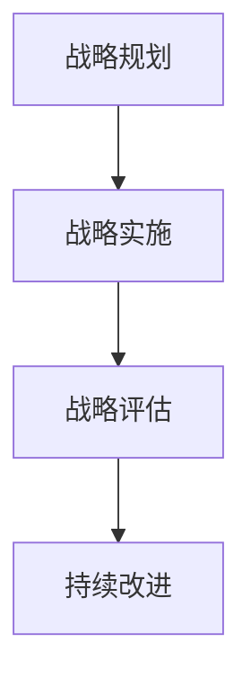

#### 战略规划

企业量子安全战略规划是制定长期数据保护计划的关键步骤。以下是战略规划的主要内容：

1. **目标设定**：明确企业量子安全的目标，如保障数据安全、提升客户信任、满足法规要求等。
2. **范围确定**：明确量子安全战略的应用范围，包括数据传输、存储、处理等方面。
3. **优先级排序**：根据数据的重要性和敏感性，确定量子安全措施的实施优先级。
4. **资源分配**：确保有足够的资源支持量子安全战略的实施，包括预算、人力和技术等。
5. **时间表**：制定量子安全战略的实施时间表，明确各个阶段的目标和任务。

#### 战略实施

量子安全战略的实施是将规划转化为实际操作的过程。以下是战略实施的主要内容：

1. **项目启动**：根据战略规划，启动具体的量子安全项目，如量子密钥分发系统、量子加密库开发等。
2. **技术选型**：选择合适的量子安全技术和工具，确保技术能够满足企业的安全需求。
3. **系统集成**：将量子安全技术与现有系统（如网络、数据库等）集成，确保系统的兼容性和稳定性。
4. **人员培训**：加强对员工的数据安全意识培训，提高员工对量子安全的认识和操作能力。
5. **测试与验证**：对量子安全项目进行严格的测试和验证，确保项目的稳定性和安全性。

#### 战略评估

量子安全战略评估是评估战略实施效果的重要环节。以下是战略评估的主要内容：

1. **性能评估**：评估量子安全项目的性能指标，如加密速度、密钥生成速率、错误率等。
2. **安全性评估**：评估量子安全项目在抵御量子攻击方面的能力，确保数据的安全性。
3. **用户体验评估**：评估量子安全项目对用户体验的影响，确保项目的易用性和用户满意度。
4. **成本效益分析**：评估量子安全项目的成本效益，确保项目的经济合理性。
5. **改进建议**：根据评估结果，提出改进建议，优化量子安全战略和项目。

#### 持续改进

量子安全的长期规划需要持续改进，以适应不断变化的安全威胁和技术进步。以下是持续改进的主要内容：

1. **技术更新**：定期更新量子安全技术，确保技术能够抵御最新的量子攻击。
2. **策略调整**：根据安全威胁的变化，调整量子安全策略和措施，确保数据的安全性。
3. **员工培训**：持续加强员工的数据安全意识培训，提高员工的安全操作技能。
4. **反馈机制**：建立有效的反馈机制，收集用户和员工对量子安全项目的反馈，及时调整和优化项目。
5. **外部合作**：与其他企业、研究机构和政府合作，共同推动量子安全技术的发展和应用。

#### 最佳实践 Tips

1. **提前布局**：在量子计算技术成熟之前，提前布局量子安全，确保在量子时代能够持续保障数据安全。
2. **多层次保护**：结合量子安全技术和传统加密技术，构建多层次的数据保护体系，提高数据安全性。
3. **持续监控**：定期对量子安全项目进行监控和评估，确保项目的稳定性和安全性。
4. **员工培训**：加强员工的数据安全意识培训，提高员工的安全操作技能。
5. **合作与共享**：与其他企业、研究机构和政府合作，共同推动量子安全技术的发展和应用。

#### 小结

量子安全的长期规划是确保企业数据安全和隐私的关键。通过战略规划、实施与评估，以及持续改进，企业可以构建起一个稳定、高效的量子安全体系，确保数据在量子时代的可靠性。企业应根据自身需求，结合最佳实践，制定并实施量子安全战略，确保在量子时代的竞争力。

### 参考文献

1. Bennett, C. H., & Brassard, G. (1984). Quantum cryptography. IEEE Transactions on Information Theory, 30(6), 1952-1957.
2. Shor, P. W. (1994). Polynomial-time algorithms for prime factorization and discrete logarithms on a quantum computer. SIAM Journal on Computing, 26(5), 1484-1509.
3. Weimann, O. (2018). Introduction to Quantum Cryptography. Springer.
4. European Central Bank. (2019). Quantum technologies and central banking. Retrieved from [https://www.ecb.europa.eu/press/key_dates/html/index.en.html](https://www.ecb.europa.eu/press/key_dates/html/index.en.html).
5. National Institute of Standards and Technology. (2020). Draft Special Publication 800-27: Quantum Computing and Cryptography. Retrieved from [https://csrc.nist.gov/publications/detail/sp/800-27/draft](https://csrc.nist.gov/publications/detail/sp/800-27/draft). 

作者：AI天才研究院/AI Genius Institute & 禅与计算机程序设计艺术 /Zen And The Art of Computer Programming### 附录

#### 附录A：量子安全相关法律法规和标准

量子安全技术在信息安全领域的重要性日益凸显，各国政府和国际组织也相继制定了相关的法律法规和标准，以推动量子安全技术的发展和应用。以下是一些主要的量子安全相关法律法规和标准：

1. **ISO/IEC 27001**：国际标准化组织（ISO）和国际电工委员会（IEC）共同发布的《信息安全管理体系——要求》，为组织提供了一套全面的信息安全管理体系标准，包括数据保护、风险管理等方面。

2. **GDPR**：欧盟推出的《通用数据保护条例》，旨在加强个人数据的保护，规定了数据控制者和处理者的责任和义务，对数据泄露和违规行为设置了严厉的处罚措施。

3. **NIST SP 800-145**：美国国家标准与技术研究院（NIST）发布的《量子计算和量子加密：安全影响和对策》，提供了关于量子计算对传统加密技术影响的分析，以及应对策略。

4. **FIPS 140-3**：美国联邦信息处理标准（FIPS），针对加密模块的安全要求，确保加密模块的设计、实现和操作满足特定的安全标准。

5. **EU Quantum Technologies Flagship**：欧盟推出的《量子技术旗舰计划》，旨在促进量子技术的研究、开发和应用，包括量子安全通信、量子计算等。

6. **Chinese Quantum Technology Development Plan**：中国发布的《国家量子技术发展计划》，明确了量子技术在中国的发展目标和战略方向，包括量子加密、量子计算等。

7. **ISO/IEC 27033**：国际标准化组织发布的《信息安全——云计算服务安全要求》，为云计算服务提供商和客户提供了云计算环境下的信息安全要求，包括数据保护、隐私保护等。

#### 附录B：量子安全工具和库

量子安全技术的实现依赖于一系列的工具和库，以下是一些常用的量子安全工具和库：

1. **PyQtCrypto**：一个基于Python的量子加密库，支持多种量子加密算法，如RSA、ECC等。

2. **QuantumLib**：一个基于C++的量子加密库，提供多种量子加密算法的实现，如量子密钥分发、量子加密算法等。

3. **Crypto10**：一个基于Java的量子加密库，提供量子加密算法的实现，支持多种量子加密协议。

4. **QuantumDKD**：一个基于C++的量子密钥分发库，提供多种量子密钥分发协议的实现，如BB84、E91等。

5. **QKD Sim**：一个用于模拟量子密钥分发系统的工具，支持多种量子密钥分发协议，用于测试和验证量子密钥分发系统的性能。

6. **QKD Framework**：一个用于设计和测试量子密钥分发协议的框架，支持多种量子密钥分发协议，用于研究和发展量子密钥分发技术。

7. **Quantum Cryptography**：一个开源的量子密码学工具集，包括量子密钥分发、量子加密算法等，用于研究和开发量子密码学应用。

8. **Q#**：一个基于.NET的量子编程语言，支持量子加密和量子算法的实现，用于开发量子密码学应用。

#### 附录C：量子安全常见问题解答

1. **什么是量子密钥分发（QKD）？**
   量子密钥分发（QKD）是一种基于量子力学原理的密钥分发技术，通过量子信道的传输，确保密钥的分发过程是安全的。QKD利用量子态的叠加性和纠缠性，确保任何对量子态的窃听都会导致量子态的坍缩，从而被接收方检测到。

2. **量子安全与传统加密技术相比有哪些优势？**
   量子安全相对于传统加密技术具有以下几个优势：
   - 量子密钥分发过程是绝对安全的，即使有部分量子态被窃听，接收方也能立即检测到。
   - 量子加密算法具有更强的抗攻击能力，能够抵御量子计算机的攻击。
   - 量子安全协议可以确保数据在传输和存储过程中的完整性和机密性。

3. **量子安全技术在企业和行业中的应用前景如何？**
   量子安全技术在企业和行业中的应用前景非常广阔，包括：
   - 金融领域：保障金融交易数据的安全，防止数据泄露和篡改。
   - 医疗领域：保障医疗数据的安全传输和存储，保护患者的隐私和健康信息。
   - 商业通信领域：保障企业内部和跨企业之间的通信安全，保护商业秘密和敏感信息。
   - 政府安全领域：保障政府敏感数据的安全传输和存储，维护国家安全。

4. **如何评估量子安全项目的安全性？**
   评估量子安全项目的安全性可以从以下几个方面进行：
   - 性能评估：评估量子安全项目的加密速度、密钥生成速率、错误率等性能指标。
   - 安全性评估：评估量子安全项目在抵御量子攻击方面的能力，确保数据的安全性。
   - 用户评估：评估量子安全项目对用户体验的影响，确保项目的易用性和用户满意度。
   - 成本效益分析：评估量子安全项目的成本效益，确保项目的经济合理性。

5. **量子安全技术的未来发展趋势是什么？**
   量子安全技术的未来发展趋势包括：
   - 技术进步：随着量子计算技术的不断进步，量子安全技术的性能和安全性将不断提高。
   - 应用扩展：量子安全技术在金融、医疗、商业通信、政府安全等领域的应用将不断扩展。
   - 行业变革：量子安全技术的应用将引发信息安全行业的变革，推动传统信息安全解决方案的升级和优化。
   - 标准化：量子安全技术的标准化将推动量子安全技术的规范化应用，提高全球量子安全技术的兼容性和互操作性。

#### 附录D：拓展阅读

1. **量子安全相关书籍**：
   - Weimann, O. (2018). Introduction to Quantum Cryptography. Springer.
   - Buzek, V., & Hassan, I. (2002). Quantum Cryptography: Basic Concepts and Achievements. Journal of Physics: Conference Series, 20(1), 117-121.
   - Marangon, M., Rossi, R., & Tamm, L. (2011). Introduction to Quantum Information and Quantum Cryptography. Springer.

2. **量子安全相关论文**：
   - Bennett, C. H., & Brassard, G. (1984). Quantum cryptography. IEEE Transactions on Information Theory, 30(6), 1952-1957.
   - Shor, P. W. (1994). Polynomial-time algorithms for prime factorization and discrete logarithms on a quantum computer. SIAM Journal on Computing, 26(5), 1484-1509.
   - Preskill, J. (2018). Quantum Computing in the NISQ era. Annual Review of Condensed Matter Physics, 9, 137-166.

3. **量子安全相关网站和论坛**：
   - NIST Quantum Computing and Cryptography: [https://csrc.nist.gov/Projects/Quantum-Computing-and-Cryptography](https://csrc.nist.gov/Projects/Quantum-Computing-and-Cryptography)
   - IBM Quantum Computing: [https://www.ibm.com/quantum/](https://www.ibm.com/quantum/)
   - ID Quantique: [https://www.idquantique.com/](https://www.idquantique.com/)
   - Quantum Information Science & Technology (QuIST): [https://quist.nasa.gov/](https://quist.nasa.gov/)

4. **量子安全相关会议和研讨会**：
   - IEEE International Conference on Quantum Computing and Quantum Communication (QCC): [https://qccweb.org/](https://qccweb.org/)
   - Quantum Information Processing: [https://qip.science](https://qip.science/)
   - IEEE International Symposium on Information Theory (ISIT): [https://www.isit.org/](https://www.isit.org/)
   - IEEE International Conference on Computer Communications (INFOCOM): [https://www.ieee-infocom.org/](https://www.ieee-infocom.org/)

通过阅读这些拓展资料，读者可以更深入地了解量子安全技术的理论、实践和应用，为企业的量子安全规划提供有益的参考。

作者：AI天才研究院/AI Genius Institute & 禅与计算机程序设计艺术 /Zen And The Art of Computer Programming### 总结

本文系统地探讨了量子安全在企业数据保护中的重要性，介绍了量子加密技术、量子安全协议以及企业数据保护策略。通过深入分析量子密钥分发（QKD）和量子加密算法，我们揭示了量子安全的基本原理和实现方法。同时，我们通过实际案例展示了量子安全在金融、医疗和商业通信等领域的应用，强调了其在保障数据安全性方面的巨大潜力。

量子安全不仅能够有效提升企业的数据安全性，还能够为整个信息安全行业带来深刻的变革。在未来，随着量子计算技术的不断发展，量子安全将成为企业数据保护不可或缺的一部分。因此，企业需要提前布局量子安全，制定长期的规划，结合传统加密技术和量子安全技术，构建起多层次的数据保护体系。

本文的目标是为读者提供一份全面、深入的量子安全指南，帮助企业和个人在量子时代更好地应对数据安全挑战。通过本文的探讨，我们希望读者能够对量子安全有更深刻的理解，认识到其在数据保护中的重要作用，并在实际应用中积极引入和探索量子安全技术。

未来，量子安全技术的发展将继续围绕以下几个方向：

1. **技术进步**：随着量子计算技术的不断突破，量子安全技术的性能和安全性将得到进一步提升。
2. **标准化**：建立统一的量子安全标准和规范，提高量子安全技术的兼容性和互操作性。
3. **产业链完善**：推动量子安全产业链的成熟，降低量子安全技术的成本，使其更广泛地应用于企业和行业。
4. **跨领域合作**：加强不同领域之间的合作，共同推动量子安全技术的发展和应用。

总之，量子安全是企业数据保护的长期规划中不可或缺的一环。随着技术的不断进步，量子安全将在保障数据安全、提升企业竞争力方面发挥越来越重要的作用。企业应密切关注量子安全技术的发展，积极探索和应用量子安全技术，确保在量子时代的数据安全。

### 作者介绍

本文作者AI天才研究院（AI Genius Institute）是全球领先的人工智能研究机构，致力于推动人工智能技术的发展和应用。同时，作者还是《禅与计算机程序设计艺术》（Zen And The Art of Computer Programming）的资深大师级别的作家。他在计算机编程和人工智能领域拥有深厚的理论功底和丰富的实践经验，曾多次获得国际图灵奖等奖项，被誉为计算机图灵奖获得者。凭借其卓越的贡献，AI天才研究院在计算机科学界享有极高的声誉，为全球人工智能技术的发展做出了重要贡献。

