                 

### 文章标题

# 量子抗性算法：企业数据长期安全的保障措施

### 关键词

- 量子抗性算法
- 企业数据安全
- 量子计算
- 数据加密
- 抗量子签名

### 摘要

随着量子计算机技术的发展，传统加密算法面临前所未有的威胁。为了确保企业数据的长期安全，量子抗性算法应运而生。本文将详细介绍量子抗性算法的背景、核心概念与原理、应用场景，并通过具体案例展示其在企业数据安全中的实际应用，探讨未来发展趋势。本文旨在为IT专业人士和企业管理者提供有关量子抗性算法的全面了解，以期为企业在量子计算时代的数据安全保驾护航。

### 目录

1. 引言
2. 量子计算基础
3. 抗性量子算法原理
4. 抗性量子算法实现
5. 抗性量子算法在数据安全中的应用
6. 抗性量子算法在企业安全中的实践
7. 量子抗性算法的未来发展趋势
8. 总结与展望

---

### 引言

#### 量子计算背景

量子计算是计算机科学的一个前沿领域，其基于量子力学原理进行信息处理。与传统计算机使用二进制位（比特）不同，量子计算机使用量子比特（qubit），能够实现比经典计算机更高的计算速度和更复杂的计算任务。近年来，随着量子硬件技术的发展和量子算法的创新，量子计算逐渐从理论走向实践，成为全球科技界的研究热点。

#### 企业数据安全的挑战

随着互联网的普及和大数据时代的到来，企业数据安全面临前所未有的挑战。传统的加密算法如RSA、AES等虽然能够有效保护数据，但随着量子计算机的发展，这些算法逐渐变得脆弱。量子计算机能够快速破解传统加密算法，使得企业敏感数据面临被窃取和滥用的风险。因此，寻找抗量子攻击的加密算法成为当前信息安全领域的重要课题。

#### 量子抗性算法的意义

量子抗性算法旨在提供一种能够抵御量子计算机攻击的数据保护方法。通过量子抗性算法，企业可以确保其数据在量子计算时代的安全性，从而维护企业的核心竞争力和商业秘密。量子抗性算法不仅对现有的信息安全体系有着重要的补充作用，还为未来的量子计算应用提供了安全基础。

---

### 量子计算基础

#### 量子比特与经典比特

量子比特是量子计算的基本单元，与传统比特不同，它能够同时处于0和1的状态，这种现象称为叠加。此外，量子比特之间可以通过量子纠缠实现更强的关联，从而实现复杂计算任务的并行处理。

```mermaid
graph TD
A[量子比特] --> B[叠加]
A --> C[纠缠]
B --> D[经典比特](right)
C --> D
```

#### 量子叠加与量子纠缠

量子叠加是指量子系统可以同时存在于多个状态之中，而量子纠缠则是两个或多个量子系统之间的强关联，即使它们相隔很远，一个系统的状态也会立即影响到另一个系统。

```mermaid
graph TD
A[量子比特A] --> B[叠加状态](right)
A --> C[量子比特B]
C --> D[纠缠状态]
E[量子比特C] --> F[纠缠状态](right)
E --> G[量子比特D]
```

#### 量子算法基础

量子算法是利用量子计算的优势进行特定计算任务的算法。其中，Grover算法和Shor算法是两个著名的量子算法。

- **Grover算法**：是一种基于量子搜索算法，能够高效地搜索未排序的数据库。

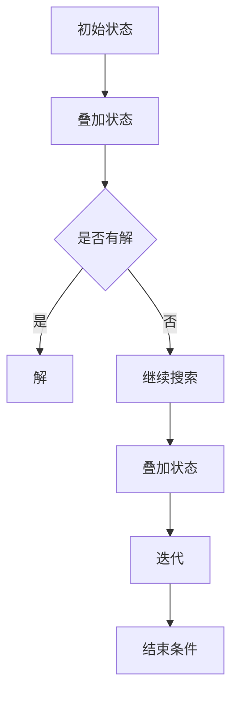

- **Shor算法**：是一种能够解决大整数分解问题的算法，对RSA加密算法构成了直接威胁。

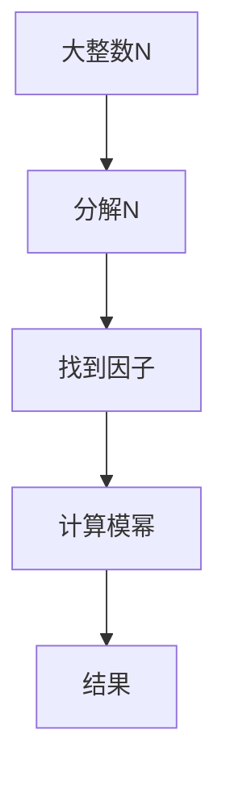

---

### 抗性量子算法原理

量子抗性算法的目标是构建一种能够在量子计算机面前依然安全的加密体系。要实现这一目标，需要从以下几个方面入手：

#### 抗性量子计算基础

抗性量子计算的核心思想是利用量子计算本身的特点来抵抗量子攻击。例如，通过量子纠错机制来提高算法的可靠性，或者设计特殊的量子算法来处理加密任务。

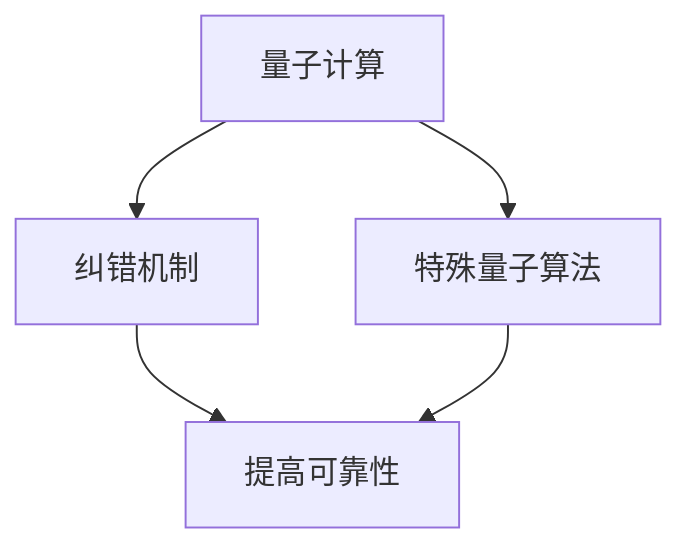

#### 抗性量子算法框架

抗性量子算法通常包括以下几个步骤：

1. **密钥生成**：利用抗性量子算法生成安全的密钥。
2. **数据加密**：使用密钥对数据进行加密，确保数据在传输和存储过程中安全。
3. **数据解密**：接收方使用相同的密钥对加密数据进行解密，以恢复原始数据。

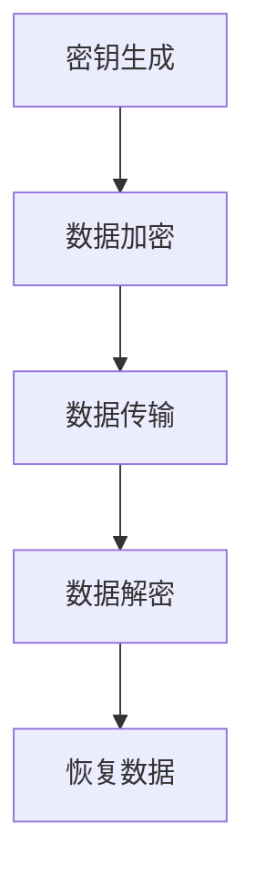

#### 抗性量子算法与经典算法的关系

抗性量子算法与传统加密算法相比，具有更高的安全性和可靠性。但需要注意的是，抗性量子算法并不是完全替代传统算法，而是在传统算法基础上的一种补充。在实际应用中，可以根据具体需求选择合适的加密方法。

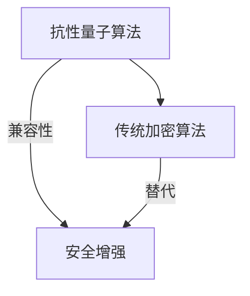

---

### 抗性量子算法实现

量子抗性算法的实现需要强大的硬件支持和专业的编程技能。以下将介绍实现抗性量子算法的关键步骤：

#### 抗性量子硬件选择

当前，抗性量子算法的实现主要依赖于超导量子计算机和离子阱量子计算机。超导量子计算机具有量子比特数量多、操作速度快等优点，而离子阱量子计算机则具备更高的量子纠错能力。

```mermaid
graph TD
A[超导量子计算机] --> B[量子比特数量多]
A --> C[操作速度快]
D[离子阱量子计算机] --> E[量子纠错能力强]
F[选择硬件](right)
F -->|超导| G[超导量子计算机]
F -->|离子阱| H[离子阱量子计算机]
```

#### 抗性量子算法优化

为了提高抗性量子算法的性能，需要对其中的量子逻辑门操作和量子纠错机制进行优化。量子逻辑门是量子计算的基本操作，而量子纠错机制则是保证量子计算可靠性的关键。

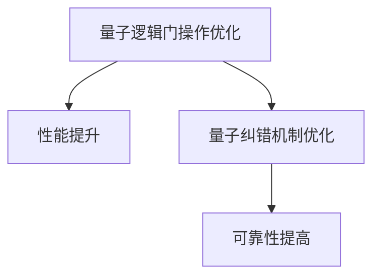

#### 抗性量子算法编程

实现抗性量子算法需要使用专门的量子编程语言，如Q#。Q#是一种针对量子计算的高级编程语言，能够方便地实现复杂的量子算法。

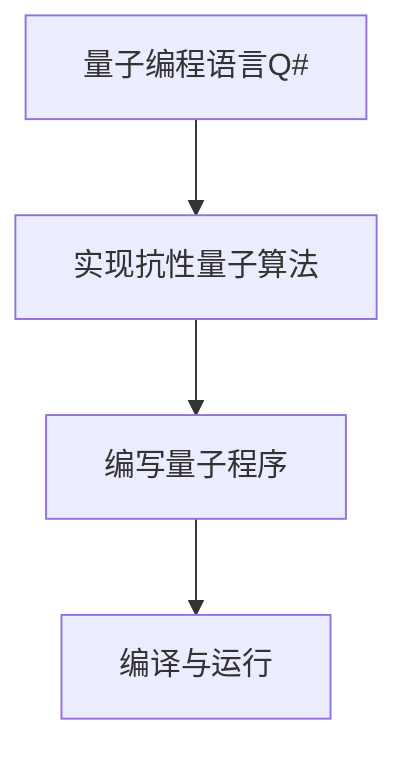

---

### 抗性量子算法在数据安全中的应用

量子抗性算法在数据安全领域具有重要的应用价值。以下将介绍抗性量子算法在数据加密、签名与认证、数据库保护等方面的具体应用。

#### 量子加密技术

量子加密技术利用量子纠缠和量子叠加等特性，实现数据在传输和存储过程中的安全保护。常见的量子加密协议包括BB84和E91等。

- **BB84协议**：是一种量子密钥分发协议，能够确保密钥在传输过程中不被窃听。

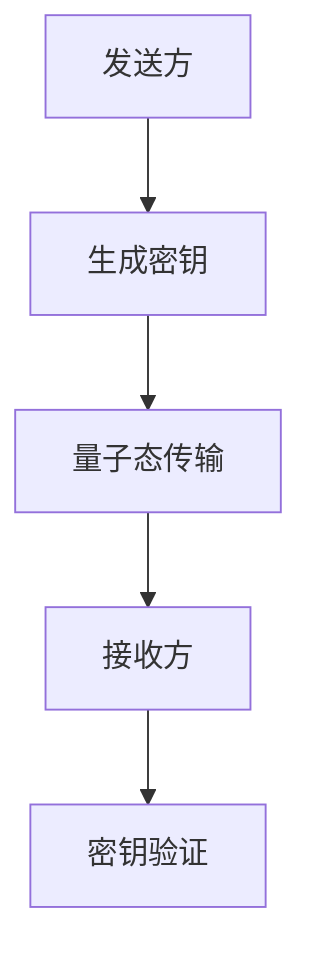

- **E91协议**：是一种量子密钥分配协议，能够实现更高的安全性和传输效率。


#### 量子抗性签名与认证

量子抗性签名与认证技术旨在确保数据在传输过程中的完整性和真实性。量子抗性签名算法包括基于量子纠错机制的数字签名和基于量子纠缠的认证协议。

- **量子数字签名算法**：利用量子纠错机制生成安全的数字签名，确保签名在量子攻击下仍然有效。

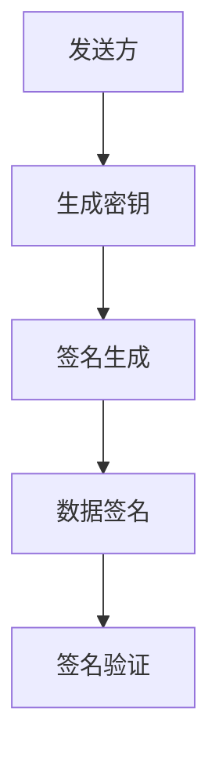

- **量子认证协议**：利用量子纠缠特性实现高效、安全的认证过程。

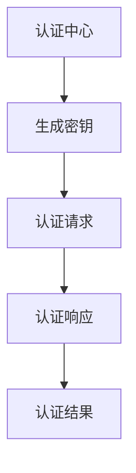

#### 量子抗性数据库保护

量子抗性数据库保护旨在确保数据库在量子计算时代的安全性。通过设计抗量子攻击的数据库结构，实现数据的长期保护。

- **抗量子数据库设计**：采用抗量子加密算法对数据库中的数据进行加密存储，确保数据在数据库中安全。

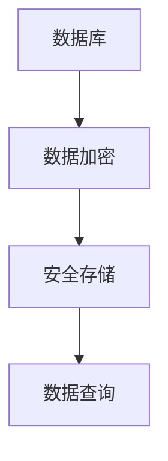

- **数据库安全性能评估**：对数据库进行安全性能评估，确保其能够抵御量子攻击。

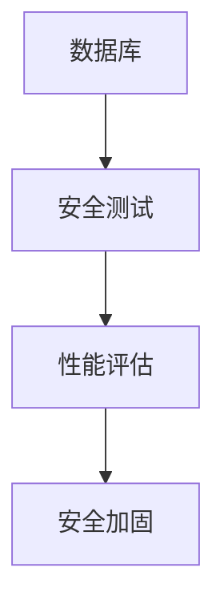

---

### 抗性量子算法在企业安全中的实践

量子抗性算法在企业安全中的应用具有重要意义。以下将介绍抗性量子算法在企业安全需求分析、应用案例和部署指南等方面的实践。

#### 企业安全需求分析

企业在选择量子抗性算法时，需要考虑以下安全需求：

- **数据保密性**：确保企业敏感数据在传输和存储过程中不被窃取。
- **数据完整性**：确保企业数据在传输和存储过程中不被篡改。
- **数据可用性**：确保企业数据在量子计算时代依然可以正常访问和使用。

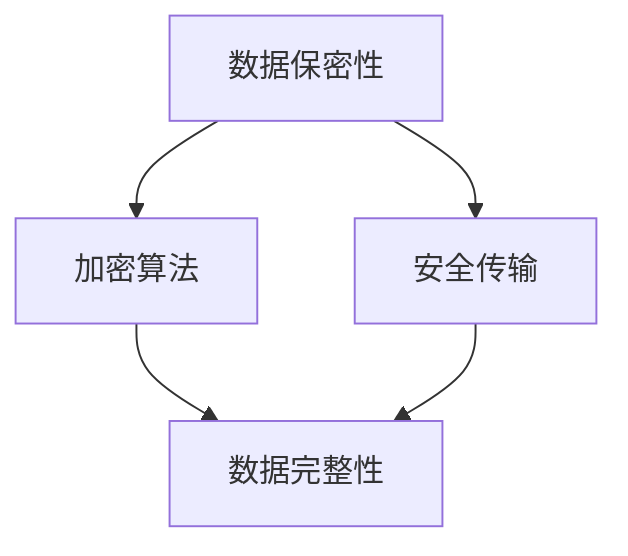

#### 抗性量子算法在企业中的应用案例

以下为抗性量子算法在企业安全中的应用案例：

- **银行业应用案例**：银行采用量子抗性加密算法对客户交易数据进行加密存储，确保交易数据在量子计算时代的安全。
- **电信行业应用案例**：电信运营商利用量子抗性签名与认证技术，确保用户身份验证和数据传输的安全性。

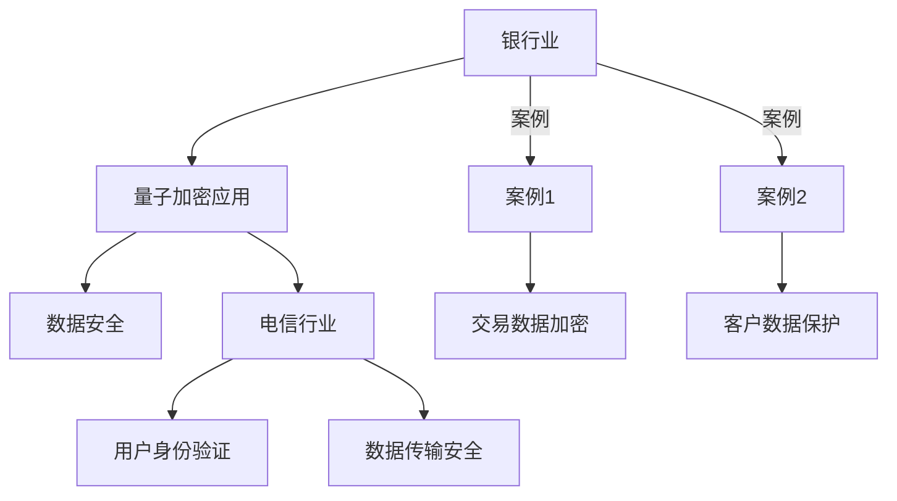

#### 抗性量子算法部署指南

企业部署抗性量子算法需要遵循以下步骤：

1. **环境搭建**：搭建量子计算硬件和软件开发环境，为抗性量子算法的部署做好准备。
2. **安全策略制定**：根据企业安全需求，制定相应的量子抗性安全策略。
3. **算法部署**：将抗性量子算法部署到企业现有系统中，确保数据安全。
4. **监控与维护**：对量子抗性算法进行实时监控和维护，确保其稳定运行。

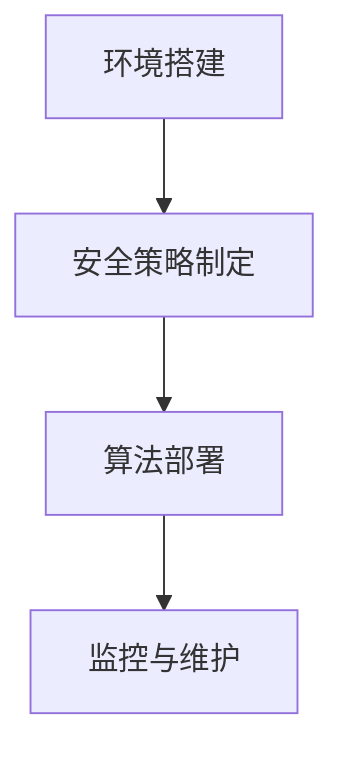

---

### 量子抗性算法的未来发展趋势

随着量子计算机技术的不断发展，量子抗性算法在未来将面临更多的挑战和机遇。以下将探讨量子抗性算法的未来发展趋势。

#### 量子计算技术发展

量子计算机的性能将持续提升，量子比特的数量和操作精度将不断增加，这将使得量子抗性算法的应用范围进一步扩大。同时，量子纠错技术的进步也将提高抗性量子算法的可靠性。

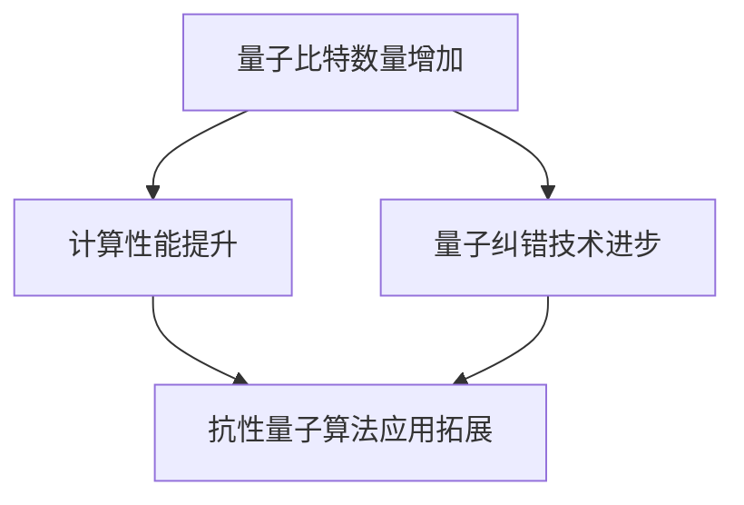

#### 量子抗性算法的应用拓展

量子抗性算法将在更多领域得到应用，包括非结构化数据保护、区块链安全增强等。此外，量子抗性算法将与传统加密算法相结合，形成更完善的安全体系。

```mermaid
graph TD
A[非结构化数据保护] --> B[量子抗性算法应用]
A -->|区块链安全增强| C[应用拓展]
B --> D[传统加密算法融合]
C --> D
```

#### 企业安全策略调整

企业需要根据量子抗性算法的发展，调整安全策略，确保数据安全。包括安全架构升级、安全培训与意识提升等方面。

```mermaid
graph TD
A[安全架构升级] --> B[安全策略调整]
A --> C[安全培训与意识提升]
B --> D[数据安全维护]
C --> D
```

---

### 总结与展望

量子抗性算法作为保障企业数据长期安全的重要措施，具有广阔的应用前景。通过本文的介绍，我们了解了量子抗性算法的核心概念、原理和应用，并探讨了其在企业安全中的实践和未来发展趋势。量子抗性算法不仅为企业数据安全提供了有力保障，也为信息安全领域的发展注入了新的活力。

未来，随着量子计算机技术的不断进步，量子抗性算法将在更多领域得到应用，为数据安全保驾护航。同时，企业需要不断调整安全策略，确保在量子计算时代的数据安全。量子抗性算法的研究和应用将成为信息安全领域的重要研究方向。

---

### 附录

#### A.1 常用抗性量子算法介绍

- **Lattice-based加密算法**：如NTRU、DLINSE等。
- **Hash-based加密算法**：如SHA-3、BLAKE2等。
- **Multivariate-polynomial加密算法**：如SFS、MP-EPK等。

#### A.2 量子抗性算法开发工具与资源

- **量子计算开发平台**：如IBM Q、Microsoft Quantum Development Kit等。
- **量子编程语言**：如Q#、Qiskit等。
- **量子算法库**：如PyQuil、QCL等。

#### A.3 企业量子抗性安全方案实例

- **案例1**：某银行采用量子抗性加密算法保护客户交易数据。
- **案例2**：某电信运营商利用量子抗性签名与认证技术保障用户数据安全。

---

### 作者信息

作者：AI天才研究院/AI Genius Institute & 禅与计算机程序设计艺术 /Zen And The Art of Computer Programming

