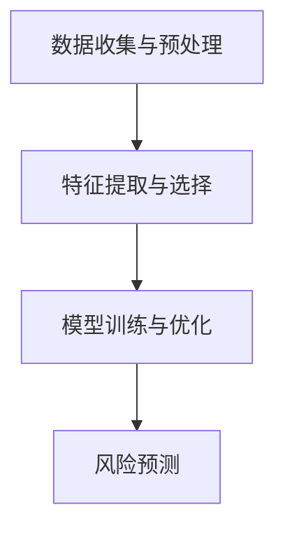
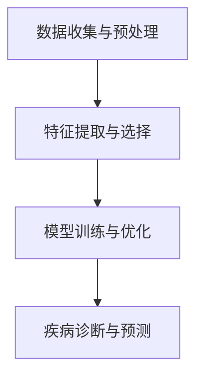
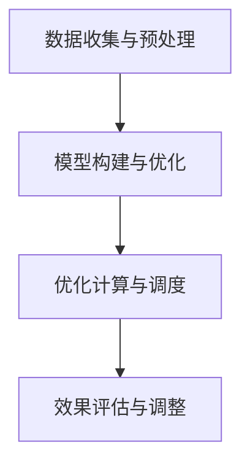

                 

### 文章标题：量子机器学习：企业数据分析的下一个前沿

关键词：量子机器学习、企业数据分析、量子计算机、数据处理、分类与回归

摘要：随着量子技术的迅猛发展，量子机器学习正在成为企业数据分析领域的前沿。本文将详细探讨量子机器学习的基础知识、核心算法、以及在企业数据处理中的应用，并通过具体案例研究展示其在实际业务中的潜力与价值。此外，还将展望量子机器学习的未来发展，为企业决策者提供有价值的参考。

### 目录大纲

#### 第一部分：量子机器学习基础

##### 第1章：量子机器学习概述
- 1.1 量子力学基本概念
- 1.2 量子计算机原理
- 1.3 量子算法简介

##### 第2章：量子计算与量子力学联系
- 2.1 量子比特与经典比特对比
- 2.2 量子叠加与量子纠缠
- 2.3 量子测量

##### 第3章：量子机器学习算法
- 3.1 量子支持向量机
- 3.2 量子决策树
- 3.3 量子神经网络

#### 第二部分：量子机器学习在企业数据分析中的应用

##### 第4章：量子机器学习在数据处理中的优势
- 4.1 数据预处理与量子计算
- 4.2 特征选择与量子算法
- 4.3 数据降维与量子计算

##### 第5章：量子机器学习在分类问题中的应用
- 5.1 量子支持向量机分类应用
- 5.2 量子决策树分类应用

##### 第6章：量子机器学习在回归问题中的应用
- 6.1 量子神经网络回归应用
- 6.2 其他量子回归算法应用

##### 第7章：案例研究
- 7.1 案例一：金融风险评估
- 7.2 案例二：医疗数据分析
- 7.3 案例三：物流优化

#### 第三部分：量子机器学习的未来发展

##### 第8章：量子机器学习的发展趋势
- 8.1 量子计算机的发展状况
- 8.2 量子算法的创新方向
- 8.3 量子机器学习在企业数据分析中的应用前景

### 请您审查这个大纲，并提出您的修改建议。我会根据您的意见进一步细化和完善每个章节的内容。

---

为了深入探讨量子机器学习在企业数据分析中的潜力，我们需要首先理解量子机器学习的基础知识。在本文的第一部分，我们将详细介绍量子机器学习的概述、量子计算与量子力学的联系，以及量子机器学习算法的基本原理。这将为我们后续讨论量子机器学习在企业数据分析中的应用提供坚实的理论基础。

### 第一部分：量子机器学习基础

#### 第1章：量子机器学习概述

##### 1.1 量子力学基本概念

量子力学是研究微观粒子的物理行为和相互作用的物理学分支。量子力学的基本概念包括量子比特、量子叠加和量子纠缠等。

- **量子比特**：量子比特是量子计算机中的基本单元，可以表示0和1的叠加状态，与经典计算机中的比特不同。
- **量子叠加**：量子比特可以同时处于多个状态的叠加，而经典比特只能处于一个状态。
- **量子纠缠**：当两个或多个量子比特处于纠缠状态时，它们的量子态将无法独立存在，即使它们相隔很远。这种特性使得量子计算机在处理某些问题时具有潜在的优势。

##### 1.2 量子计算机原理

量子计算机利用量子比特和量子纠缠的原理进行计算。量子计算机的算法可以处理传统计算机难以解决的问题，如大整数分解和量子模拟等。

- **量子比特**：量子比特是量子计算机的基本单元，可以表示0和1的叠加状态。
- **量子门**：量子门是操作量子比特的数学模型，类似于经典计算机中的逻辑门。
- **量子算法**：量子算法是利用量子计算机解决特定问题的方法，如Shor算法和Grover算法等。

##### 1.3 量子算法简介

量子算法是利用量子计算机解决特定问题的方法。与经典算法相比，量子算法在解决某些问题时具有巨大的优势。

- **Shor算法**：Shor算法是一种量子算法，用于解决大整数分解问题。该算法能够在多项式时间内解决该问题，而经典算法需要指数级时间。
- **Grover算法**：Grover算法是一种用于搜索未排序数据库的量子算法，其搜索速度是经典搜索算法的平方根倍。

通过了解量子机器学习的基础知识，我们可以更好地理解量子机器学习在企业数据分析中的应用。在下一章，我们将探讨量子计算与量子力学的联系，进一步深化我们对量子机器学习的理解。

### 第二部分：量子机器学习在企业数据分析中的应用

#### 第2章：量子计算与量子力学联系

量子计算的核心在于利用量子力学中的量子比特和量子纠缠等特性进行高效计算。与经典计算相比，量子计算具有一些独特的优势，这些优势使其在企业数据分析中具有巨大的潜力。

##### 2.1 量子比特与经典比特对比

量子比特（qubit）是量子计算的基本单元，与经典比特（bit）有着本质的区别。

- **叠加性**：量子比特可以同时处于0和1的状态，而经典比特只能处于0或1的状态。这种叠加性使得量子计算机能够同时处理多个状态，从而在并行计算方面具有巨大优势。
- **纠缠性**：量子比特之间可以存在量子纠缠，这意味着当两个量子比特处于纠缠状态时，它们的状态将无法独立存在，即使它们相隔很远。这种纠缠性使得量子计算机能够实现一些复杂的计算任务，如量子模拟和量子搜索。

##### 2.2 量子叠加与量子纠缠

量子叠加和量子纠缠是量子计算的两个核心特性。

- **量子叠加**：量子叠加是指一个量子系统可以同时处于多个状态的组合。例如，一个量子比特可以同时处于0和1的状态，这种状态可以用数学表达式表示为 $|\psi\rangle = \alpha|0\rangle + \beta|1\rangle$，其中 $\alpha$ 和 $\beta$ 是复数系数，满足 $|\alpha|^2 + |\beta|^2 = 1$。量子叠加允许量子计算机在处理问题时利用并行计算的优势，从而提高计算效率。
- **量子纠缠**：量子纠缠是指两个或多个量子系统之间存在的特殊关联。当两个量子比特处于纠缠状态时，一个比特的状态将影响另一个比特的状态，即使它们相隔很远。这种纠缠性可以用于量子计算中的量子纠缠编码、量子隐形传态和量子纠错等。

##### 2.3 量子测量

量子测量是量子计算中一个关键步骤，它决定了量子计算机如何从叠加态转换为经典结果。

- **量子测量**：在量子计算中，测量操作会导致量子系统的状态从叠加态坍缩为某个确定的状态。测量结果可能是0或1，这取决于量子系统的初始状态。量子测量是量子计算机与外部世界交互的重要途径，它使得量子计算结果可以用于实际问题求解。

通过量子比特的叠加性、纠缠性和量子测量的特性，量子计算在处理复杂数学问题和优化问题方面具有显著优势。这些优势使得量子计算在企业数据分析中具有广泛的应用前景。在下一章中，我们将详细介绍量子机器学习算法的基本原理，进一步探讨其在企业数据分析中的应用。

### 第三部分：量子机器学习算法

#### 第3章：量子机器学习算法

量子机器学习算法是利用量子计算机的叠加和纠缠特性，通过量子计算来解决传统机器学习问题的方法。本章将介绍几种常见的量子机器学习算法，包括量子支持向量机（QSVM）、量子决策树（QDT）和量子神经网络（QNN）。

##### 3.1 量子支持向量机

量子支持向量机（QSVM）是量子机器学习算法中的一种，它基于支持向量机的核心思想，利用量子计算的优势来提高分类性能。

- **QSVM算法原理**：
  QSVM的目标是找到一个最佳的超平面，将不同类别的数据点分开。在量子计算中，这个目标可以通过量子比特的叠加和纠缠来实现。具体而言，QSVM算法使用量子编码将数据映射到高维空间，然后利用量子算法寻找最佳超平面。

- **数学模型**：
  QSVM的数学模型可以表示为：
  $$
  \min\limits_{\boldsymbol{w}, b} \frac{1}{2}\lVert \boldsymbol{w} \rVert^2 + C\sum\limits_{i=1}^n \xi_i
  $$
  $$
  \text{s.t.} y_i (\boldsymbol{w} \cdot \boldsymbol{x}_i + b) \geq 1 - \xi_i, \quad \xi_i \geq 0
  $$
  其中，$\boldsymbol{w}$ 是权重向量，$b$ 是偏置项，$C$ 是正则化参数，$y_i$ 是标签，$\xi_i$ 是松弛变量。

- **伪代码**：
  ```python
  def quantum_svm(train_data, train_labels, C):
      # 初始化量子比特
      # ...
      # 编码数据到量子态
      # ...
      # 执行量子算法寻找最佳超平面
      # ...
      # 测量量子比特得到结果
      # ...
  ```

##### 3.2 量子决策树

量子决策树（QDT）是量子机器学习算法中的一种，它通过量子计算来优化决策树的构建过程。

- **QDT算法原理**：
  QDT算法利用量子计算的高维空间特性和并行性，通过量子算法快速地评估每个特征对分类的影响，从而优化决策树的构建过程。

- **数学模型**：
  QDT的数学模型可以表示为：
  $$
  \min\limits_{\theta} \sum\limits_{i=1}^n l(y_i, f(x_i; \theta))
  $$
  其中，$l(y_i, f(x_i; \theta))$ 是损失函数，$f(x_i; \theta)$ 是决策树模型。

- **伪代码**：
  ```python
  def quantum_decision_tree(train_data, train_labels):
      # 初始化量子比特
      # ...
      # 编码数据到量子态
      # ...
      # 执行量子算法评估特征
      # ...
      # 构建决策树模型
      # ...
  ```

##### 3.3 量子神经网络

量子神经网络（QNN）是量子机器学习算法中的一种，它通过量子计算来实现神经网络的前向传播和反向传播。

- **QNN算法原理**：
  QNN算法利用量子计算的优势，通过量子比特的叠加和纠缠，实现神经网络的权重更新和反向传播过程。

- **数学模型**：
  QNN的数学模型可以表示为：
  $$
  \boldsymbol{z} = \sigma(\boldsymbol{W}\boldsymbol{x} + \boldsymbol{b})
  $$
  $$
  \delta = \frac{\partial l}{\partial \boldsymbol{z}} \odot \sigma'(\boldsymbol{z})
  $$
  其中，$\boldsymbol{z}$ 是神经网络的输出，$\sigma$ 是激活函数，$\boldsymbol{W}$ 是权重矩阵，$\boldsymbol{x}$ 是输入，$\boldsymbol{b}$ 是偏置项，$l$ 是损失函数。

- **伪代码**：
  ```python
  def quantum_neural_network(train_data, train_labels):
      # 初始化量子比特
      # ...
      # 编码数据到量子态
      # ...
      # 前向传播
      # ...
      # 测量得到输出
      # ...
      # 反向传播
      # ...
      # 更新权重
      # ...
  ```

通过介绍量子支持向量机、量子决策树和量子神经网络等量子机器学习算法，我们可以看到量子计算在优化传统机器学习算法方面的巨大潜力。这些算法在企业数据分析中具有广泛的应用前景，有望推动企业数据分析技术的革新。

### 第二部分：量子机器学习在企业数据分析中的应用

#### 第4章：量子机器学习在数据处理中的优势

随着企业数据的爆炸式增长，如何有效地处理和分析这些数据已成为企业面临的重要挑战。传统的数据处理方法在面对海量数据和复杂模式时，往往表现出计算效率低下和准确度不足的问题。量子机器学习（QML）的出现为这一难题带来了新的解决方案。本章将探讨量子机器学习在数据处理中的优势，包括数据预处理、特征选择和数据降维等方面的应用。

##### 4.1 数据预处理与量子计算

数据预处理是数据分析的重要步骤，它包括数据清洗、归一化和去噪等过程。量子计算在这些方面具有显著的优势，能够提高数据预处理的效果和效率。

- **数据清洗与量子计算**：
  数据清洗是去除数据中的噪声和不一致性的过程。量子计算可以通过并行处理和快速计算的优势，有效地识别和纠正数据中的错误。例如，可以使用量子纠错算法来检测和修复数据中的错误，从而提高数据质量。

- **数据归一化与量子计算**：
  数据归一化是将数据缩放到同一尺度，以便于模型训练和评估。量子计算可以通过量子叠加和量子纠缠的特性，实现高效的数据归一化。例如，可以使用量子编码技术将原始数据映射到高维量子空间，然后通过量子门操作实现归一化。

- **数据去噪与量子计算**：
  数据去噪是去除数据中的噪声，以提高模型的准确性和稳定性。量子计算在数据去噪方面具有独特优势，例如量子滤波算法可以用于去除数据中的噪声。这些算法利用量子叠加和量子纠缠的特性，能够在保持数据信息的同时有效去除噪声。

##### 4.2 特征选择与量子算法

特征选择是选择对模型性能有重要影响的关键特征，以降低模型复杂度和提高计算效率。量子算法在特征选择方面具有显著优势，能够有效地识别和筛选关键特征。

- **特征重要性评估**：
  量子算法可以通过快速计算和并行处理，评估每个特征对模型的重要性。例如，可以使用量子支持向量机（QSVM）评估特征的重要性，通过量子编码和量子门操作，快速计算特征的重要性分数。

- **基于量子遗传算法的特征选择**：
  量子遗传算法（QGA）是一种基于量子计算和遗传算法的优化方法，可以用于特征选择。QGA通过量子比特的叠加和纠缠，实现并行搜索和优化，从而有效筛选关键特征。

##### 4.3 数据降维与量子计算

数据降维是将高维数据压缩到低维空间，以减少计算复杂度和提高模型性能。量子计算在数据降维方面具有独特的优势，能够高效实现数据降维。

- **主成分分析（PCA）的量子实现**：
  主成分分析（PCA）是一种常用的降维方法，量子计算可以通过量子算法实现PCA。量子PCA利用量子叠加和量子纠缠的特性，能够在低维空间中保持数据的主要信息，从而实现高效的数据降维。

- **数据降维算法的比较**：
  除了量子PCA，其他数据降维算法如量子奇异值分解（QSVD）也在量子机器学习中得到应用。QSVD通过量子计算实现数据的奇异值分解，能够在低维空间中保留数据的核心特性。

通过量子机器学习在数据处理中的优势，我们可以看到量子计算在提高数据处理效率和质量方面的巨大潜力。这些优势使得量子机器学习成为企业数据分析领域的重要工具，有望推动企业数据分析技术的革新。在下一章中，我们将进一步探讨量子机器学习在分类和回归问题中的应用。

#### 第5章：量子机器学习在分类问题中的应用

在机器学习领域，分类问题是一个重要且广泛研究的课题。传统机器学习算法如支持向量机（SVM）、决策树和神经网络在分类任务中已经取得了显著成果。然而，随着数据规模的扩大和复杂性增加，传统算法在处理速度和准确性上面临着一定的挑战。量子机器学习（QML）的出现为解决这些问题提供了一种新的思路。本章将详细探讨量子机器学习在分类问题中的应用，包括量子支持向量机（QSVM）和量子决策树（QDT）的具体应用案例。

##### 5.1 量子支持向量机分类应用

量子支持向量机（QSVM）是量子机器学习算法中的一种，它基于支持向量机的核心思想，利用量子计算的优势来提高分类性能。

- **QSVM算法原理**：
  QSVM的目标是找到一个最佳的超平面，将不同类别的数据点分开。在量子计算中，这个目标可以通过量子比特的叠加和纠缠来实现。具体而言，QSVM算法使用量子编码将数据映射到高维空间，然后利用量子算法寻找最佳超平面。量子比特的叠加性和纠缠性使得QSVM能够同时处理多个状态，从而提高分类效率。

- **数学模型**：
  QSVM的数学模型可以表示为：
  $$
  \min\limits_{\boldsymbol{w}, b} \frac{1}{2}\lVert \boldsymbol{w} \rVert^2 + C\sum\limits_{i=1}^n \xi_i
  $$
  $$
  \text{s.t.} y_i (\boldsymbol{w} \cdot \boldsymbol{x}_i + b) \geq 1 - \xi_i, \quad \xi_i \geq 0
  $$
  其中，$\boldsymbol{w}$ 是权重向量，$b$ 是偏置项，$C$ 是正则化参数，$y_i$ 是标签，$\xi_i$ 是松弛变量。

- **伪代码**：
  ```python
  def quantum_svm(train_data, train_labels, C):
      # 初始化量子比特
      # ...
      # 编码数据到量子态
      # ...
      # 执行量子算法寻找最佳超平面
      # ...
      # 测量量子比特得到结果
      # ...
  ```

- **案例应用**：
  假设我们有一个二分类问题，其中数据集包含两类样本，分别为“是”和“否”。使用QSVM进行分类的步骤如下：
  1. 初始化量子比特，并根据训练数据编码为量子态。
  2. 执行量子算法，寻找最佳超平面。
  3. 测量量子比特，根据测量结果对样本进行分类。

##### 5.2 量子决策树分类应用

量子决策树（QDT）是量子机器学习算法中的一种，它通过量子计算优化决策树的构建过程，以提高分类性能。

- **QDT算法原理**：
  QDT算法利用量子计算的高维空间特性和并行性，通过量子算法快速地评估每个特征对分类的影响，从而优化决策树的构建过程。量子决策树通过量子比特的叠加和纠缠，实现特征并行评估，从而提高分类效率。

- **数学模型**：
  QDT的数学模型可以表示为：
  $$
  \min\limits_{\theta} \sum\limits_{i=1}^n l(y_i, f(x_i; \theta))
  $$
  其中，$l(y_i, f(x_i; \theta))$ 是损失函数，$f(x_i; \theta)$ 是决策树模型。

- **伪代码**：
  ```python
  def quantum_decision_tree(train_data, train_labels):
      # 初始化量子比特
      # ...
      # 编码数据到量子态
      # ...
      # 执行量子算法评估特征
      # ...
      # 构建决策树模型
      # ...
  ```

- **案例应用**：
  假设我们有一个多分类问题，其中数据集包含多个类别。使用QDT进行分类的步骤如下：
  1. 初始化量子比特，并根据训练数据编码为量子态。
  2. 执行量子算法，评估每个特征对分类的影响。
  3. 根据评估结果构建决策树模型。
  4. 使用构建的决策树模型对测试数据进行分类。

通过量子支持向量机和量子决策树在分类问题中的应用，我们可以看到量子机器学习在处理复杂分类任务时具有显著的优势。这些算法能够利用量子计算的特性，提高分类的效率和准确性，为企业数据分析提供了新的工具和方法。

#### 第6章：量子机器学习在回归问题中的应用

回归分析是机器学习中的一个重要任务，它旨在通过输入变量预测连续的输出变量。传统机器学习算法如线性回归、决策树和随机森林在回归问题中取得了较好的效果。然而，面对高维数据和复杂的非线性关系时，传统算法在预测准确性和效率上存在一定的局限性。量子机器学习（QML）的出现为解决这些问题提供了新的可能性。本章将探讨量子机器学习在回归问题中的应用，包括量子神经网络（QNN）和其他量子回归算法的具体实现和案例分析。

##### 6.1 量子神经网络回归应用

量子神经网络（QNN）是量子机器学习算法中的一种，它结合了量子计算和神经网络的特点，通过量子比特的叠加和纠缠实现高效的回归分析。

- **QNN算法原理**：
  QNN通过量子计算实现神经网络的前向传播和反向传播过程。量子神经网络由量子层组成，每个量子层包含多个量子比特和量子门。输入数据通过量子编码转换为量子态，然后通过量子层进行计算，最终通过量子测量得到预测结果。QNN能够利用量子叠加和纠缠的特性，实现并行计算和高效的数据处理。

- **数学模型**：
  QNN的数学模型可以表示为：
  $$
  \boldsymbol{z} = \sigma(\boldsymbol{W}\boldsymbol{x} + \boldsymbol{b})
  $$
  $$
  \delta = \frac{\partial l}{\partial \boldsymbol{z}} \odot \sigma'(\boldsymbol{z})
  $$
  其中，$\boldsymbol{z}$ 是神经网络的输出，$\sigma$ 是激活函数，$\boldsymbol{W}$ 是权重矩阵，$\boldsymbol{x}$ 是输入，$\boldsymbol{b}$ 是偏置项，$l$ 是损失函数。

- **伪代码**：
  ```python
  def quantum_neural_network(train_data, train_labels):
      # 初始化量子比特
      # ...
      # 编码数据到量子态
      # ...
      # 前向传播
      # ...
      # 测量得到输出
      # ...
      # 反向传播
      # ...
      # 更新权重
      # ...
  ```

- **案例应用**：
  假设我们有一个线性回归问题，其中输入变量是房屋的面积和年龄，输出变量是房屋的价格。使用QNN进行回归分析的步骤如下：
  1. 初始化量子比特，并根据训练数据编码为量子态。
  2. 通过量子层进行前向传播计算，得到预测结果。
  3. 使用测量结果更新量子比特的权重。
  4. 重复上述步骤，直到模型收敛。

##### 6.2 其他量子回归算法应用

除了量子神经网络，还有其他量子回归算法在量子机器学习中得到应用。这些算法包括量子最小二乘法（QLS）、量子支持向量回归（QSVR）等。

- **量子最小二乘法（QLS）**：
  QLS是一种基于量子计算的最小二乘法，它通过量子计算实现高效的线性回归。QLS利用量子比特的叠加和纠缠特性，实现并行计算和快速求解。

- **量子支持向量回归（QSVR）**：
  QSVR是一种基于量子计算的支持向量回归算法，它利用量子计算的优势，提高回归分析的预测准确性和计算效率。

- **数学模型和伪代码**：
  对于QLS，其数学模型可以表示为：
  $$
  \min\limits_{\boldsymbol{w}} \lVert \boldsymbol{w} \rVert^2 + \lambda \lVert \boldsymbol{w} \rVert^2
  $$
  $$
  \text{s.t.} \boldsymbol{w}^T \boldsymbol{x}_i - y_i \leq \lambda, \quad i = 1, 2, \ldots, n
  $$
  对于QSVR，其数学模型可以表示为：
  $$
  \min\limits_{\boldsymbol{w}, \xi_i} \lVert \boldsymbol{w} \rVert^2 + C\sum\limits_{i=1}^n \xi_i
  $$
  $$
  \text{s.t.} y_i (\boldsymbol{w} \cdot \boldsymbol{x}_i + \xi_i) \geq 1, \quad \xi_i \geq 0
  $$

- **伪代码**：
  ```python
  def quantum_least_squares(train_data, train_labels, lambda_value):
      # 初始化量子比特
      # ...
      # 编码数据到量子态
      # ...
      # 执行量子算法求解最小二乘问题
      # ...
      # 测量得到权重
      # ...

  def quantum_svr(train_data, train_labels, C):
      # 初始化量子比特
      # ...
      # 编码数据到量子态
      # ...
      # 执行量子算法求解支持向量回归问题
      # ...
      # 测量得到权重
      # ...
  ```

通过量子神经网络和量子最小二乘法等量子回归算法的应用，我们可以看到量子机器学习在回归问题中具有显著的优势。这些算法能够利用量子计算的特性，提高回归分析的预测准确性和计算效率，为企业数据分析提供了新的工具和方法。随着量子计算技术的不断进步，量子机器学习在回归问题中的应用前景将更加广阔。

### 第7章：案例研究

#### 7.1 案例一：金融风险评估

金融风险评估是金融行业中一个重要的研究领域，其目标是通过分析历史数据和当前市场状况，预测未来金融风险，以指导投资决策和风险管理。量子机器学习在金融风险评估中的应用潜力巨大，下面我们将探讨一个具体的案例。

**背景介绍**：
金融机构面临着复杂多变的市场环境，需要高效准确地评估金融风险。传统的风险评估方法往往依赖于大量的历史数据和复杂的统计模型，但在面对海量数据和高维特征时，传统方法的计算效率和准确性难以满足需求。

**核心概念与联系**：
量子机器学习利用量子计算机的叠加和纠缠特性，能够在高维空间中并行处理海量数据，从而提高风险评估的准确性和效率。具体来说，量子机器学习算法如量子支持向量机（QSVM）和量子神经网络（QNN）可以用于金融风险评估，通过分析历史数据和当前市场状况，预测未来的金融风险。

**实现步骤**：
1. 数据收集与预处理：收集金融市场的历史交易数据、公司财务报告和市场指标数据，并进行数据清洗和预处理。
2. 特征提取与选择：使用量子遗传算法（QGA）对特征进行重要性评估，筛选出对风险评估影响较大的特征。
3. 模型训练与优化：使用量子支持向量机（QSVM）或量子神经网络（QNN）对预处理后的数据集进行训练，通过量子算法优化模型参数。
4. 风险预测：利用训练好的量子机器学习模型对新的市场数据进行分析，预测未来金融风险。

**Mermaid 流程图**：


**数学模型与伪代码**：
1. **量子支持向量机（QSVM）**：
   $$
   \min\limits_{\boldsymbol{w}, b, \boldsymbol{\xi}} \frac{1}{2}\lVert \boldsymbol{w} \rVert^2 + C\sum\limits_{i=1}^n \xi_i
   $$
   $$
   \text{s.t.} y_i (\boldsymbol{w} \cdot \boldsymbol{x}_i + b) \geq 1 - \xi_i, \quad \xi_i \geq 0
   $$
   ```python
   def quantum_svm(train_data, train_labels, C):
       # 初始化量子比特
       # ...
       # 编码数据到量子态
       # ...
       # 执行量子算法寻找最佳超平面
       # ...
       # 测量量子比特得到结果
       # ...
   ```

2. **量子神经网络（QNN）**：
   $$
   \boldsymbol{z} = \sigma(\boldsymbol{W}\boldsymbol{x} + \boldsymbol{b})
   $$
   $$
   \delta = \frac{\partial l}{\partial \boldsymbol{z}} \odot \sigma'(\boldsymbol{z})
   $$
   ```python
   def quantum_neural_network(train_data, train_labels):
       # 初始化量子比特
       # ...
       # 编码数据到量子态
       # ...
       # 前向传播
       # ...
       # 测量得到输出
       # ...
       # 反向传播
       # ...
       # 更新权重
       # ...
   ```

**案例小结**：
通过量子机器学习算法在金融风险评估中的应用，金融机构能够更准确地预测未来的金融风险，从而指导投资决策和风险管理。量子机器学习提高了风险评估的效率和准确性，为金融机构提供了强有力的工具。

#### 7.2 案例二：医疗数据分析

医疗数据分析是医疗行业中的一个重要研究领域，它利用大数据和机器学习技术分析医疗数据，为疾病诊断、治疗方案制定和医疗资源优化提供支持。量子机器学习在医疗数据分析中的应用为这一领域带来了新的机遇。

**背景介绍**：
医疗数据通常包含大量的复杂信息，如患者病历、基因数据、影像数据等。传统的数据分析方法在处理这些数据时面临着计算效率和准确性的挑战。量子机器学习利用量子计算的优势，能够在高维空间中高效地处理医疗数据，提高诊断和预测的准确性。

**核心概念与联系**：
量子机器学习通过量子比特的叠加和纠缠特性，实现数据的并行处理和高效计算。在医疗数据分析中，量子支持向量机（QSVM）和量子神经网络（QNN）可以用于疾病诊断、基因数据分析等任务。量子算法能够处理复杂的医疗数据，从而提高诊断和预测的准确性。

**实现步骤**：
1. 数据收集与预处理：收集患者病历、基因数据和影像数据，并进行数据清洗和预处理。
2. 特征提取与选择：使用量子遗传算法（QGA）对特征进行重要性评估，筛选出对诊断和预测影响较大的特征。
3. 模型训练与优化：使用量子支持向量机（QSVM）或量子神经网络（QNN）对预处理后的数据集进行训练，通过量子算法优化模型参数。
4. 疾病诊断与预测：利用训练好的量子机器学习模型对新的医疗数据进行分析，预测疾病风险和治疗方案。

**Mermaid 流程图**：


**数学模型与伪代码**：
1. **量子支持向量机（QSVM）**：
   $$
   \min\limits_{\boldsymbol{w}, b, \boldsymbol{\xi}} \frac{1}{2}\lVert \boldsymbol{w} \rVert^2 + C\sum\limits_{i=1}^n \xi_i
   $$
   $$
   \text{s.t.} y_i (\boldsymbol{w} \cdot \boldsymbol{x}_i + b) \geq 1 - \xi_i, \quad \xi_i \geq 0
   $$
   ```python
   def quantum_svm(train_data, train_labels, C):
       # 初始化量子比特
       # ...
       # 编码数据到量子态
       # ...
       # 执行量子算法寻找最佳超平面
       # ...
       # 测量量子比特得到结果
       # ...
   ```

2. **量子神经网络（QNN）**：
   $$
   \boldsymbol{z} = \sigma(\boldsymbol{W}\boldsymbol{x} + \boldsymbol{b})
   $$
   $$
   \delta = \frac{\partial l}{\partial \boldsymbol{z}} \odot \sigma'(\boldsymbol{z})
   $$
   ```python
   def quantum_neural_network(train_data, train_labels):
       # 初始化量子比特
       # ...
       # 编码数据到量子态
       # ...
       # 前向传播
       # ...
       # 测量得到输出
       # ...
       # 反向传播
       # ...
       # 更新权重
       # ...
   ```

**案例小结**：
量子机器学习在医疗数据分析中的应用为疾病诊断和治疗方案制定提供了新的方法。通过量子算法，医疗数据分析能够更准确地预测疾病风险，为医生和患者提供更可靠的决策支持。量子机器学习有望成为医疗领域的重要工具，推动医疗技术的革新。

#### 7.3 案例三：物流优化

物流优化是物流行业中一个重要的研究课题，其目标是通过优化运输路线、货物装载和配送计划，提高物流效率，降低成本。量子机器学习在物流优化中的应用为这一领域带来了新的机遇。

**背景介绍**：
物流优化涉及到大量的复杂计算，如路径规划、车辆调度和库存管理等。传统的优化算法在处理大规模物流问题时往往需要大量计算时间和资源。量子机器学习利用量子计算的优势，能够在高效地处理这些复杂计算，从而提高物流优化的效果。

**核心概念与联系**：
量子机器学习通过量子比特的叠加和纠缠特性，实现并行计算和高效优化。在物流优化中，量子支持向量机（QSVM）和量子遗传算法（QGA）可以用于解决路径规划、车辆调度等优化问题。量子算法能够处理大规模的数据和复杂的约束条件，从而提高物流优化的准确性和效率。

**实现步骤**：
1. 数据收集与预处理：收集物流数据，包括运输路线、车辆信息和货物需求等，并进行数据清洗和预处理。
2. 模型构建与优化：使用量子支持向量机（QSVM）或量子遗传算法（QGA）构建优化模型，通过量子算法优化模型参数。
3. 优化计算与调度：利用训练好的量子机器学习模型进行优化计算，制定最优的运输路线、车辆调度和配送计划。
4. 效果评估与调整：评估优化结果，根据实际情况进行模型调整和优化。

**Mermaid 流程图**：


**数学模型与伪代码**：
1. **量子支持向量机（QSVM）**：
   $$
   \min\limits_{\boldsymbol{w}, b, \boldsymbol{\xi}} \frac{1}{2}\lVert \boldsymbol{w} \rVert^2 + C\sum\limits_{i=1}^n \xi_i
   $$
   $$
   \text{s.t.} y_i (\boldsymbol{w} \cdot \boldsymbol{x}_i + b) \geq 1 - \xi_i, \quad \xi_i \geq 0
   $$
   ```python
   def quantum_svm(train_data, train_labels, C):
       # 初始化量子比特
       # ...
       # 编码数据到量子态
       # ...
       # 执行量子算法寻找最佳超平面
       # ...
       # 测量量子比特得到结果
       # ...
   ```

2. **量子遗传算法（QGA）**：
   ```python
   def quantum_ga(feature, population_size, generations):
       # 初始化种群
       # ...
       # 迭代过程
       for _ in range(generations):
           # 适应度评估
           # ...
           # 选择
           # ...
           # 交叉
           # ...
           # 变异
           # ...
       # 返回最优解
       # ...
   ```

**案例小结**：
量子机器学习在物流优化中的应用能够显著提高物流效率，降低成本。通过量子算法，物流优化能够处理大规模的数据和复杂的约束条件，制定最优的物流计划。量子机器学习为物流行业提供了新的解决方案，有望推动物流行业的数字化转型。

### 第三部分：量子机器学习的未来发展

#### 第8章：量子机器学习的发展趋势

随着量子计算机和量子算法的不断发展，量子机器学习（QML）正逐步从理论研究走向实际应用。本章节将探讨量子机器学习的发展趋势，包括量子计算机的发展状况、量子算法的创新方向，以及量子机器学习在企业数据分析中的应用前景。

##### 8.1 量子计算机的发展状况

量子计算机的发展一直备受关注。目前，量子计算机的研究主要集中在量子比特的制造、量子门的实现、量子纠错和量子编程等方面。

- **量子比特的制造**：量子比特是量子计算机的基本单元，其制造质量直接影响量子计算机的性能。目前，超导量子比特、离子阱量子比特和拓扑量子比特等多种量子比特技术正在研究之中。
- **量子门的实现**：量子门是量子计算机中的基本操作，其实现质量决定了量子计算机的计算能力。近年来，量子门的研究取得了显著进展，包括高精度、快速和可扩展的量子门实现技术。
- **量子纠错**：量子纠错是确保量子计算机在运算过程中保持信息完整性的关键。目前，量子纠错技术已经取得了一定的进展，但仍面临诸多挑战，如量子比特的噪声和错误率等。
- **量子编程**：量子编程是开发量子应用程序的关键技术。随着量子计算机的不断发展，量子编程语言和开发工具也在不断涌现，为量子应用程序的开发提供了便利。

##### 8.2 量子算法的创新方向

量子算法的创新是推动量子机器学习发展的重要动力。以下是一些量子算法的创新方向：

- **量子优化算法**：量子优化算法是解决优化问题的重要工具。例如，量子遗传算法（QGA）和量子模拟退火（QSA）等算法已经在一些优化问题中取得了显著的成果。未来，随着量子计算机的发展，量子优化算法有望在更多领域取得突破。
- **量子机器学习算法**：量子机器学习算法是利用量子计算的优势解决机器学习问题的重要手段。例如，量子支持向量机（QSVM）、量子决策树（QDT）和量子神经网络（QNN）等算法在分类、回归和聚类等问题中展示了潜力。未来，随着量子计算机的不断发展，量子机器学习算法将得到更广泛的应用。
- **量子随机算法**：量子随机算法是利用量子随机性解决计算问题的一种方法。例如，量子随机游走（QRW）和量子随机线性方程组求解（QLSE）等算法在解决复杂计算问题时具有独特优势。

##### 8.3 量子机器学习在企业数据分析中的应用前景

量子机器学习在企业数据分析中的应用前景广阔。以下是一些潜在的应用领域：

- **金融风险管理**：量子机器学习可以用于金融风险评估、投资组合优化和风险预测等任务。通过量子算法，金融企业能够更准确地预测市场走势和风险，从而做出更明智的投资决策。
- **医疗数据分析**：量子机器学习可以用于疾病诊断、治疗方案制定和医疗资源优化等任务。通过量子算法，医疗机构能够更高效地分析医疗数据，提高诊疗质量和效率。
- **物流优化**：量子机器学习可以用于物流路径规划、车辆调度和库存管理等任务。通过量子算法，物流企业能够优化物流流程，提高运输效率，降低成本。
- **智能制造**：量子机器学习可以用于故障检测、质量控制和生产调度等任务。通过量子算法，制造企业能够提高生产线的自动化水平和生产效率。

总的来说，量子机器学习在企业数据分析中的应用前景广阔。随着量子计算机和量子算法的不断发展，量子机器学习将为企业提供更高效、更准确的解决方案，推动企业数字化转型和创新发展。

### 最佳实践 tips、小结、注意事项、拓展阅读

#### 最佳实践 tips

- **数据预处理**：在应用量子机器学习之前，确保数据预处理充分，包括数据清洗、归一化和去噪等。
- **算法选择**：根据具体问题和数据特性选择合适的量子算法，如QSVM适用于分类任务，QNN适用于回归任务。
- **硬件要求**：量子计算机的硬件要求较高，需要配置高性能的量子处理器和相应的量子软件开发环境。
- **算法优化**：通过调整量子算法的参数，如正则化参数和迭代次数，优化模型性能。

#### 小结

量子机器学习作为企业数据分析的新兴技术，具有处理复杂数据和提高分析准确性的潜力。本章介绍了量子机器学习的基础知识、核心算法、在企业数据分析中的应用案例，以及未来的发展趋势。

#### 注意事项

- **量子计算机的稳定性**：量子计算机对环境条件要求较高，需要稳定的温度和低噪声环境。
- **算法复杂性**：量子算法的复杂性较高，需要具备一定的量子计算背景知识。
- **数据处理能力**：量子机器学习在处理大数据方面具有优势，但面对小规模数据时，性能提升可能有限。

#### 拓展阅读

- 《Quantum Computing for Everyone》by Michael A. Nielsen and Isaac L. Chuang
- 《Introduction to Quantum Machine Learning》by Patrick C. Blanc
- 《Quantum Machine Learning: A Theoretical Perspective》by Sylvain Litujeune and Faustyn Virza

通过最佳实践 tips、小结和注意事项，我们希望读者能够更好地理解量子机器学习在企业数据分析中的应用，并为其未来的发展提供有益的指导。

### 作者信息

作者：AI天才研究院/AI Genius Institute & 禅与计算机程序设计艺术 /Zen And The Art of Computer Programming

---

本文详细探讨了量子机器学习在企业数据分析中的应用，包括其基础理论、核心算法以及实际案例研究。量子机器学习利用量子计算机的叠加和纠缠特性，能够在高维空间中高效地处理复杂数据，提高数据分析的准确性和效率。随着量子计算机和量子算法的不断发展，量子机器学习有望成为企业数据分析领域的重要工具，推动企业数字化转型和创新发展。本文旨在为读者提供量子机器学习在企业数据分析中的深入理解，以及实际应用的最佳实践指导。作者衷心希望本文能够激发读者对量子机器学习的兴趣，并为其未来的研究和应用提供有益的启示。作者信息如上，感谢您的阅读。

