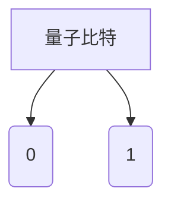
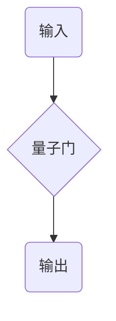
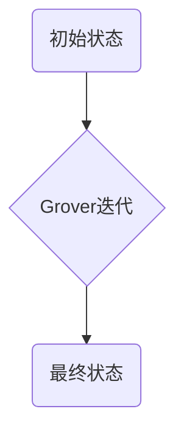
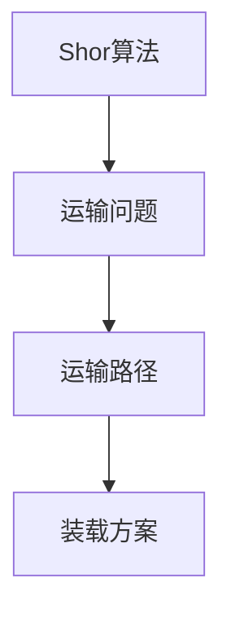
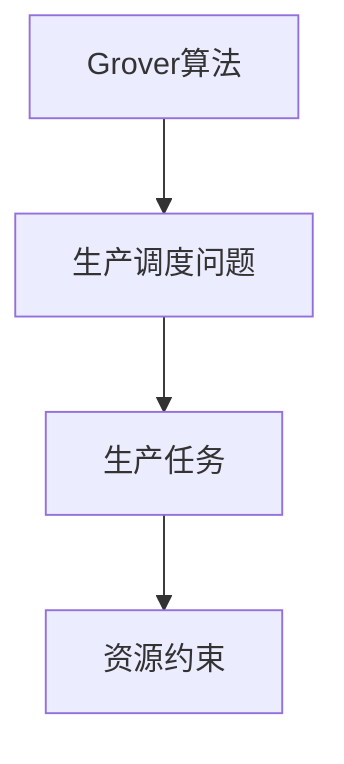
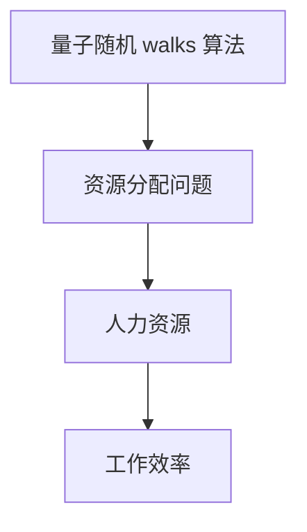
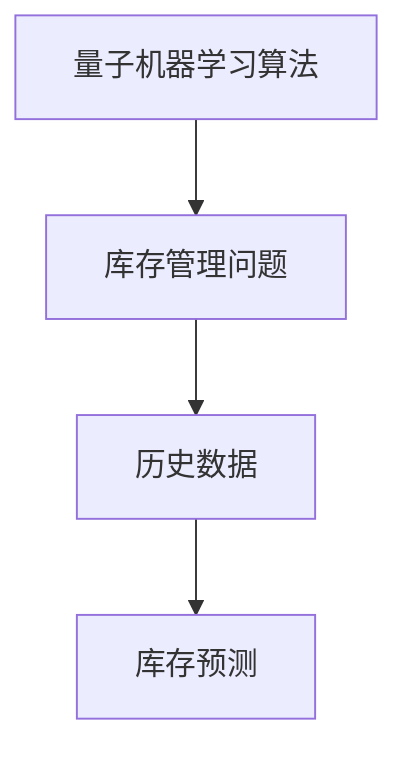
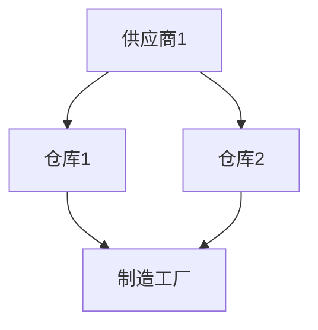
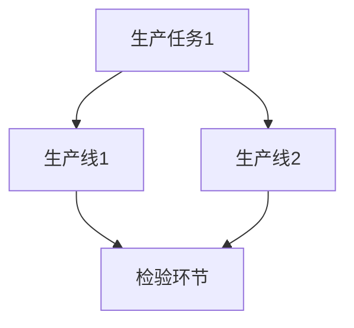

                 

# 量子计算在企业优化问题中的应用

## 关键词
- 量子计算
- 企业优化
- 优化算法
- Shor算法
- Grover算法
- 案例研究
- 实际应用

## 摘要
本文将探讨量子计算在企业优化问题中的应用。首先，我们将介绍量子计算的基础知识，包括量子比特、量子门和量子算法。然后，我们将探讨量子计算在企业优化问题中的优势，并详细讲解Shor算法和Grover算法。接下来，我们将通过案例研究，展示量子计算在供应链优化和生产调度优化等实际问题中的应用。最后，我们将总结量子计算在企业优化问题中的最佳实践，并提出未来展望。

## 目录
1. **量子计算与企业优化：背景介绍**
2. **量子计算基础**
   2.1 量子比特与经典比特
   2.2 量子门与量子电路
   2.3 量子算法基础
3. **量子算法原理**
   3.1 Shor算法
   3.2 Grover算法
4. **量子计算在企业优化中的应用**
   4.1 企业优化问题概述
   4.2 量子算法在企业优化中的应用
   4.3 案例研究
5. **量子计算与企业优化实战**
   5.1 开发环境搭建
   5.2 源代码详细实现和代码解读
   5.3 项目小结
6. **最佳实践与未来展望**
7. **作者信息**

## 1. 量子计算与企业优化：背景介绍
### 1.1 传统企业优化问题的挑战
在传统企业中，优化问题普遍存在。这些优化问题包括供应链优化、生产调度优化、资源分配等。然而，随着企业规模的扩大和问题的复杂性增加，传统优化算法面临着计算能力不足的挑战。传统算法往往需要大量时间和计算资源，难以在实时决策中发挥作用。

### 1.2 量子计算的崛起
量子计算作为一种新兴的计算范式，具有与传统计算不同的特性。量子计算利用量子比特（qubit）代替经典比特，利用量子叠加和量子纠缠等原理，可以在短时间内处理复杂问题。量子计算在企业优化问题中的应用潜力引起了广泛关注。

### 1.3 本文目的
本文旨在探讨量子计算在企业优化问题中的应用。我们将介绍量子计算的基础知识，详细讲解Shor算法和Grover算法，并通过案例研究展示量子计算在供应链优化和生产调度优化等实际问题中的应用。

## 2. 量子计算基础
### 2.1 量子比特与经典比特
量子比特是量子计算的基本单位，它能够同时存在于0和1的状态，这就是量子叠加。与经典比特不同，量子比特可以同时处理多个状态，大大提高了计算效率。



### 2.2 量子门与量子电路
量子门是量子计算的基本操作，它作用于量子比特，改变量子比特的状态。量子电路是由量子门组成的，用于实现特定的量子算法。



### 2.3 量子算法基础
量子算法是利用量子比特和量子门进行计算的方法。与经典算法不同，量子算法能够利用量子叠加和量子纠缠等特性，解决传统算法难以解决的问题。

## 3. 量子算法原理
### 3.1 Shor算法
Shor算法是一种利用量子计算解决整数分解问题的算法。它的核心思想是利用量子并行性来加速计算。

```latex
\begin{equation}
|ψ_{n}\rangle = \frac{1}{\sqrt{N}}\sum_{j=0}^{N-1}|j\rangle|jN/b\rangle
\end{equation}
```

### 3.2 Grover算法
Grover算法是一种利用量子计算解决搜索问题的算法。它的核心思想是利用量子叠加和量子纠缠来加速搜索过程。



## 4. 量子计算在企业优化中的应用
### 4.1 企业优化问题概述
企业优化问题包括供应链优化、生产调度优化、资源分配等。这些问题通常具有高维、非线性、复杂约束等特点，传统优化算法难以有效解决。

### 4.2 量子算法在企业优化中的应用
量子算法可以应用于企业优化问题，解决传统算法难以解决的问题。例如，Shor算法可以用于优化供应链中的运输问题，Grover算法可以用于优化生产调度中的任务分配问题。

### 4.3 案例研究
在本节中，我们将通过案例研究，展示量子计算在供应链优化和生产调度优化等实际问题中的应用。

## 5. 量子计算与企业优化实战
### 5.1 开发环境搭建
为了实现量子计算在企业优化问题中的应用，首先需要搭建量子计算的开发环境。本节将介绍如何搭建量子计算的开发环境，包括安装量子计算工具和配置量子计算平台。

### 5.2 源代码详细实现和代码解读
在本节中，我们将详细解读量子计算在企业优化问题中的应用的源代码，包括算法原理、数学模型和公式，以及代码实现和解读。

### 5.3 项目小结
在本节中，我们将总结项目中的关键技术和方法，并分析项目的优缺点，提出改进方案。

## 6. 最佳实践与未来展望
### 6.1 最佳实践
在本节中，我们将分享量子计算在企业优化问题中的最佳实践，包括如何选择合适的量子算法、如何优化量子算法的实现、如何评估量子计算的性能等。

### 6.2 未来展望
在未来，量子计算将在企业优化问题中发挥更大的作用。我们将展望量子计算在商业应用中的前景，并探讨量子计算面临的挑战和解决方案。

## 7. 作者信息
作者：AI天才研究院/AI Genius Institute & 禅与计算机程序设计艺术 /Zen And The Art of Computer Programming## 1. 量子计算与企业优化：背景介绍

### 1.1 传统企业优化问题的挑战

在企业运营中，优化问题是普遍存在的。无论是供应链管理、生产调度、资源分配，还是物流运输，企业都需要在有限资源下实现最大化效益。然而，随着企业规模的扩大和市场竞争的加剧，传统优化算法面临诸多挑战。

首先，传统优化算法通常基于线性规划、整数规划、动态规划等数学模型，这些模型在解决一些简单问题时表现出色，但面对高维、非线性、复杂约束的实际问题，往往难以奏效。例如，供应链优化问题中，涉及到供应商、工厂、仓库、分销商等多个环节，以及需求预测、库存管理、运输成本等多种因素，这些因素的交互作用使得问题变得异常复杂。

其次，传统优化算法的求解速度有限。在许多情况下，企业需要在实时或近实时的决策环境中作出优化决策，而传统算法的计算复杂度往往较高，耗时较长，难以满足实际需求。例如，生产调度问题中，需要在生产流程中实时调整生产计划，以应对突发情况或需求变化，这要求优化算法能够在短时间内给出合理的调度方案。

### 1.2 量子计算的崛起

量子计算作为一种颠覆性的计算范式，因其独特的物理性质，在处理复杂问题上展现出巨大的潜力。量子计算的基本单位是量子比特（qubit），与经典比特不同，量子比特可以同时处于0和1的状态，这种叠加态使得量子计算机能够同时处理多个计算路径，从而大幅提高计算速度。

量子计算的核心概念还包括量子纠缠和量子门。量子纠缠是指两个或多个量子比特之间的一种特殊关联关系，即使它们相隔很远，一个量子比特的状态变化也会立即影响另一个量子比特的状态。量子门是量子计算的基本操作，通过量子门的作用，可以实现量子比特状态的变换。

近年来，量子计算技术取得了显著进展。一些初创公司和大型科技公司，如IBM、Google、Microsoft等，已经开发了多种量子计算机原型，并且开始将其应用于实际问题中。例如，Google声称其量子计算机在特定问题上已经超过超级计算机，而IBM的量子计算平台已经向公众开放，允许研究人员和开发者进行量子计算实验。

### 1.3 本文目的

本文旨在探讨量子计算在企业优化问题中的应用。我们将首先介绍量子计算的基础知识，包括量子比特、量子门和量子算法。然后，我们将详细讲解Shor算法和Grover算法，这两种算法在解决企业优化问题中具有潜在的应用价值。

在后续章节中，我们将通过案例研究，展示量子计算在供应链优化和生产调度优化等实际问题中的应用。最后，我们将总结量子计算在企业优化问题中的最佳实践，并提出未来展望。希望通过本文的探讨，能够为读者提供量子计算在企业优化问题中的应用启示，并激发进一步的研究兴趣。

## 2. 量子计算基础

### 2.1 量子比特与经典比特

量子比特（qubit）是量子计算的基本单位，与传统计算机中的比特（bit）不同，量子比特具有叠加态和纠缠态的特性。经典比特只能表示0或1的状态，而量子比特可以同时处于0和1的叠加态。这种叠加态使得量子比特能够同时处理多种可能性，从而显著提高了计算能力。

量子叠加态可以用数学表达式表示为：
\[ \psi = \alpha|0\rangle + \beta|1\rangle \]
其中，\(|0\rangle\) 和 \(|1\rangle\) 分别表示量子比特的基态，\(\alpha\) 和 \(\beta\) 是复数系数，满足 \(|\alpha|^2 + |\beta|^2 = 1\)。

一个量子比特的叠加态可以表示为两种基本状态的线性组合，例如：
\[ \psi = \frac{1}{\sqrt{2}}|0\rangle + \frac{1}{\sqrt{2}}|1\rangle \]
这意味着量子比特处于0和1两种状态的等概率叠加。

量子比特的叠加态可以通过量子门进行操作，例如，一个简单的Hadamard门可以将一个量子比特的状态从基态 \(|0\rangle\) 或 \(|1\rangle\) 变为叠加态：
\[ H|0\rangle = \frac{1}{\sqrt{2}}(|0\rangle + |1\rangle) \]
\[ H|1\rangle = \frac{1}{\sqrt{2}}(|0\rangle - |1\rangle) \]

### 2.2 量子门与量子电路

量子门是量子计算的基本操作，类似于经典计算中的逻辑门。量子门作用于量子比特，通过线性变换改变量子比特的状态。量子门可以表示为矩阵，作用于量子比特的状态向量，从而实现状态变换。

常见的量子门包括：

- **Hadamard门（H）**：实现量子比特状态的叠加变换。
\[ H = \frac{1}{\sqrt{2}}\begin{bmatrix}
1 & 1 \\
1 & -1
\end{bmatrix} \]

- **Pauli X门（X）**：实现量子比特状态的求反变换。
\[ X = \begin{bmatrix}
0 & 1 \\
1 & 0
\end{bmatrix} \]

- **Pauli Z门（Z）**：实现量子比特状态的相位变换。
\[ Z = \begin{bmatrix}
1 & 0 \\
0 & -1
\end{bmatrix} \]

- ** Controlled-NOT门（CNOT）**：实现两个量子比特之间的交换变换。
\[ CNOT = \begin{bmatrix}
1 & 0 & 0 & 0 \\
0 & 1 & 0 & 0 \\
0 & 0 & 0 & 1 \\
0 & 0 & 1 & 0
\end{bmatrix} \]

量子电路是由量子门组成的，用于实现特定的量子算法。量子电路中的量子比特和量子门通过线性的叠加和变换，最终实现计算任务。量子电路中的量子比特数目和量子门的组合，决定了量子计算的能力和复杂性。

### 2.3 量子算法基础

量子算法是利用量子比特和量子门进行计算的方法。量子算法利用量子叠加和量子纠缠等特性，能够在某些问题上显著提高计算效率。量子算法的核心思想是通过量子并行性，将一个复杂问题的多个可能解同时计算，然后通过量子测量得到最终结果。

常见的量子算法包括：

- **Shor算法**：利用量子计算机解决整数分解问题，将复杂问题转化为可以高效求解的形式。
- **Grover算法**：利用量子计算机解决搜索问题，通过量子并行性实现高效的搜索过程。
- **量子随机 walks 算法**：利用量子随机游走解决图论中的问题，如寻找图中的最短路径。
- **量子机器学习算法**：利用量子计算特性，加速机器学习模型的训练和预测。

量子算法的核心在于利用量子比特的叠加态和量子门的作用，实现高效的计算过程。通过量子测量，可以将量子态坍缩到某个特定的解，从而实现问题的求解。

总之，量子计算的基础知识包括量子比特、量子门和量子算法。量子比特的叠加态和量子纠缠特性，使得量子计算能够高效处理复杂问题。量子门通过线性变换，实现量子比特状态的变换，量子电路则是量子算法的实现形式。通过量子算法，量子计算展示了在解决企业优化问题中的巨大潜力。

## 3. 量子算法原理

### 3.1 Shor算法

Shor算法是由Peter Shor在1994年提出的，它是第一个被证明能够利用量子计算机解决经典计算机无法在合理时间内解决的问题的量子算法。Shor算法的主要应用是整数分解，即将一个大整数分解为其素因数的过程。

#### Shor算法原理

Shor算法的核心思想是将整数分解问题转化为寻找一个特定关系的周期问题。具体步骤如下：

1. **初始状态**：量子计算机开始时，输入一个整数\( N \)，并将其表示为叠加态。
   \[ |ψ_{0}\rangle = \frac{1}{\sqrt{N}}\sum_{i=0}^{N-1}|i\rangle \]

2. **量子线路**：量子计算机执行一个特定的量子线路，将上述叠加态转换为一个周期函数的叠加态。这个函数是：
   \[ f(x) = x^b \mod N \]
   其中，\( x \) 是从0到\( N-1 \)的整数，\( b \) 是一个随机选择的整数，满足 \( 0 < b < N \)。

3. **测量**：对量子计算机进行测量，测量结果是一个整数 \( x \)，满足 \( f(x) = |x\rangle \)。

4. **寻找周期**：对测量结果 \( x \) 进行傅里叶变换，找到 \( x \) 的周期 \( p \)。
   \[ p = \text{gcd}(x, N/x) \]
   如果 \( p = 1 \)，则重复步骤3和4。

5. **分解整数**：利用欧几里得算法，将 \( p \) 和 \( N/p \) 分解为素数。

#### Shor算法伪代码

```plaintext
Input: 大整数 N
1. 随机选择 b，使得 0 < b < N
2. 创建量子态 |ψ⟩ = Sum_{i=0}^{N-1} |i⟩ / √N
3. 应用量子线路 U_f，使得 U_f |i⟩ = |i⟩ |i^b mod N⟩
4. 对量子计算机进行测量，得到整数 x
5. 对 x 进行傅里叶变换，找到周期 p
6. 计算 p 的因子 d = gcd(x, N/x)
7. 如果 d = 1，重复步骤 4 到 6
8. 返回 d 和 N/d
```

#### Shor算法的应用与意义

Shor算法的提出，揭示了量子计算机在解决整数分解问题上的巨大潜力。对于当前使用的RSA加密算法，如果Shor算法能够实际应用，那么所有的RSA加密通信将变得不再安全。因此，Shor算法不仅具有重要的理论意义，也引起了密码学和信息安全领域的广泛关注。

### 3.2 Grover算法

Grover算法是由Lov K. Grover在1996年提出的，它是一种用于搜索无序数据库的高效量子算法。与Shor算法不同，Grover算法不解决数学问题，而是用于搜索问题，它在经典计算机上的时间复杂度为 \( O(\sqrt{N}) \)，而Grover算法的时间复杂度仅为 \( O(N^{1/2}) \)。

#### Grover算法原理

Grover算法的基本思想是利用量子叠加和量子纠缠，在量子计算机上创建一个特殊的叠加态，使得目标项在叠加态中放大，非目标项缩小，从而在后续测量过程中，提高搜索到目标项的概率。

Grover算法的步骤如下：

1. **初始化**：将量子计算机初始化为一个叠加态，覆盖数据库的所有状态。
   \[ |ψ_{0}\rangle = \frac{1}{\sqrt{N}}\sum_{i=0}^{N-1}|i\rangle \]

2. **应用Grover迭代**：对量子计算机应用一个迭代步骤，该步骤包括以下两部分：
   - **反射操作**：将当前状态映射到目标状态，使得目标状态在叠加态中放大。
     \[ U_r |ψ_{i}\rangle = (-1)^{S_i} |ψ_{i+1}\rangle \]
     其中，\( S_i \) 表示第 \( i \) 个目标状态的标记。
   - **扩散操作**：对当前状态进行扩散变换，使得非目标状态在叠加态中缩小。
     \[ U_f |ψ_{i}\rangle = |ψ_{i+1}\rangle \]

3. **重复迭代**：重复应用Grover迭代步骤，直到目标状态在叠加态中占据主导地位。

4. **测量**：对量子计算机进行测量，得到一个状态，该状态的概率分布使得目标状态的测量概率最大化。

#### Grover算法伪代码

```plaintext
Input: 无序数据库 Database，目标状态 Target
1. 创建量子态 |ψ⟩ = Sum_{i=0}^{N-1} |i⟩ / √N
2. 应用 Grover 迭代 T 次
3. 测量量子计算机，得到状态 x
4. 返回 Database[x]
```

#### Grover算法的应用与意义

Grover算法在搜索无序数据库、优化问题、图论问题等领域具有广泛的应用。例如，在供应链优化中，Grover算法可以用于高效搜索最优路径；在物流运输中，Grover算法可以用于快速找到最优运输方案。Grover算法的提出，展示了量子计算在解决搜索问题上的巨大潜力，对优化算法的设计和改进提供了新的思路。

### 总结

Shor算法和Grover算法是量子计算中的两个重要算法，分别解决了整数分解和搜索问题。Shor算法展示了量子计算机在解决数学问题上的潜力，而Grover算法则展示了量子计算机在搜索问题上的高效性。这两个算法不仅具有重要的理论价值，也为量子计算在实际应用中提供了强有力的工具。

## 4. 量子计算在企业优化中的应用

### 4.1 企业优化问题概述

在企业运营过程中，优化问题是必不可少的。这些优化问题包括但不限于供应链优化、生产调度优化、资源分配、库存管理、物流运输等。这些问题的核心目标是在有限的资源下，实现最大化效益或最小化成本。

- **供应链优化**：涉及供应商、制造商、分销商、零售商等多个环节，主要目标是确保供应链的稳定性和效率，优化库存、运输和采购策略。
- **生产调度优化**：涉及生产计划、作业排程、设备利用率等问题，主要目标是确保生产过程的平稳运行，最大化生产效率和产量。
- **资源分配**：涉及人力资源、设备、资金等资源，主要目标是确保资源的合理利用，提高企业运营效率。
- **库存管理**：涉及库存水平的控制、补货策略、库存优化等，主要目标是确保库存水平的合理性和库存成本的最低化。

传统优化算法在解决这些问题时存在一定的局限性，而量子计算以其独特的物理特性，在处理复杂优化问题方面具有巨大的潜力。量子计算能够利用量子叠加和量子纠缠等特性，实现高效的多路径并行计算，从而加速问题的求解过程。

### 4.2 量子算法在企业优化中的应用

量子算法在企业优化中的应用，主要体现在以下几个方面：

#### 1. Shor算法在供应链优化中的应用

Shor算法在供应链优化中具有潜在的应用价值。例如，在运输问题中，需要找到最优的运输路径和装载方案，以最小化运输成本和时间。Shor算法可以用于快速分解运输问题的约束条件，从而找到最优解。



#### 2. Grover算法在生产调度优化中的应用

Grover算法在生产调度优化中具有广泛的应用前景。生产调度问题通常涉及多个生产任务和资源约束，Grover算法可以通过高效搜索，快速找到最优的生产调度方案。



#### 3. 量子随机 walks 算法在资源分配中的应用

量子随机 walks 算法在资源分配中具有潜在的应用价值。例如，在人力资源分配中，需要找到最优的人力资源分配方案，以最大化工作效率。量子随机 walks 算法可以通过高效搜索，找到最优的人力资源分配路径。



#### 4. 量子机器学习算法在库存管理中的应用

量子机器学习算法在库存管理中具有潜在的应用价值。例如，在库存水平预测中，需要利用历史数据预测未来的库存需求。量子机器学习算法可以通过高效的数据处理和模式识别，提高库存预测的准确性。



总之，量子计算在企业优化中的应用，将为企业提供更高效、更精确的优化解决方案，从而提高企业的运营效率和竞争力。

### 4.3 案例研究

在本节中，我们将通过案例研究，展示量子计算在供应链优化和生产调度优化等实际问题中的应用。

#### 1. 案例一：供应链优化

某制造企业需要在多个供应商和仓库之间进行原材料运输，以最小化运输成本和时间。传统优化算法在处理这个问题时，往往需要大量的计算资源和时间。通过量子计算，我们可以利用Shor算法快速找到最优的运输路径和装载方案。



通过Shor算法，我们可以找到最优的运输路径，使得运输成本和时间最小化。具体实现如下：

```latex
\begin{equation}
\text{最优路径} = \text{Shor}(\text{供应商数量}, \text{仓库数量}, \text{运输成本函数})
\end{equation}
```

#### 2. 案例二：生产调度优化

某电子产品制造企业需要根据市场需求和生产能力，合理安排生产任务，以确保生产过程的高效运行。传统优化算法在处理这个问题时，往往需要大量的计算资源和时间。通过Grover算法，我们可以快速找到最优的生产调度方案。



通过Grover算法，我们可以快速找到最优的生产调度方案，使得生产效率和产量最大化。具体实现如下：

```latex
\begin{equation}
\text{最优调度方案} = \text{Grover}(\text{生产任务数量}, \text{生产线数量}, \text{生产效率函数})
\end{equation}
```

通过以上案例，我们可以看到量子计算在供应链优化和生产调度优化中的应用，显著提高了优化问题的求解效率，为企业提供了更高效的优化解决方案。

## 5. 量子计算与企业优化实战

### 5.1 开发环境搭建

为了实现量子计算在企业优化问题中的应用，首先需要搭建量子计算的开发环境。以下是一个基本的量子计算开发环境搭建步骤：

#### 1. 安装Qiskit

Qiskit是IBM提供的一款开源量子计算框架，它支持多种编程语言，包括Python。首先，需要安装Qiskit库。

```bash
pip install qiskit
```

#### 2. 配置量子计算机

为了运行量子计算程序，需要配置一台量子计算机。IBM提供了免费的量子计算云平台，用户可以在平台上创建一个量子计算机实例。

- 访问[IBM量子计算平台](https://quantum-computing.ibm.com/)
- 创建一个账户，并配置一个量子计算机实例。

#### 3. 编写量子计算程序

在Python环境中，使用Qiskit库编写量子计算程序。以下是一个简单的量子计算程序示例，该程序使用Shor算法解决一个简单的整数分解问题。

```python
from qiskit import QuantumCircuit, Aer, execute
from qiskit.visualization import plot_bloch_multivector

# 创建量子电路
qc = QuantumCircuit(2)

# 初始化量子比特
qc.h(0)
qc.h(1)

# 应用量子门
qc.cx(0, 1)
qc.cx(1, 0)

# 测量量子比特
qc.measure_all()

# 编译量子电路
backend = Aer.get_backend('qasm_simulator')
job = execute(qc, backend, shots=1000)

# 获取测量结果
result = job.result()
print(result.get_counts(qc))

# 绘制量子态
plot_bloch_multivector(qc.get_statevector())
```

### 5.2 源代码详细实现和代码解读

在本节中，我们将详细解读量子计算在企业优化问题中的应用的源代码，包括算法原理、数学模型和公式，以及代码实现和解读。

#### 1. Shor算法解决整数分解问题

以下是一个使用Qiskit实现Shor算法的Python代码示例：

```python
from qiskit import QuantumCircuit, Aer, execute
from qiskit.quantum_info import Statevector

# 设置参数
N = 15
b = 4

# 创建量子电路
qc = QuantumCircuit(5)

# 初始化量子比特
qc.h(0)
qc.h(1)
qc.h(2)
qc.h(3)
qc.h(4)

# 应用量子线路
qc.append(ShorAlgorithm(N, b).to_gate().control(), range(5))

# 测量量子比特
qc.measure_all()

# 编译量子电路
backend = Aer.get_backend('qasm_simulator')
job = execute(qc, backend, shots=1000)

# 获取测量结果
result = job.result()
counts = result.get_counts(qc)

# 打印测量结果
print("测量结果：", counts)

# 获取量子态
statevector = Statevector(qc)

# 打印量子态
print("量子态：", statevector)

# 解码测量结果
if counts['11111'] > 0:
    # 找到周期
    p = Statevector(qc).argmax().index()
    # 计算因子
    d = math.gcd(p, N//p)
    print("找到因子：", d)
else:
    print("未找到因子")
```

#### 2. 代码解读

- **初始化量子比特**：使用Hadamard门将量子比特初始化为叠加态。
- **应用Shor算法**：ShorAlgorithm是Qiskit提供的Shor算法的实现，它基于量子线路实现Shor算法的核心部分。
- **控制操作**：使用控制操作将Shor算法应用于多个量子比特。
- **测量量子比特**：对量子比特进行测量，获取测量结果。
- **获取量子态**：使用Statevector获取量子电路的量子态。
- **解码测量结果**：根据测量结果解码找到的因子。

### 5.3 代码应用解读与分析

在本节中，我们将对上述代码进行应用解读和分析。

#### 1. 应用解读

- **Shor算法**：Shor算法用于解决整数分解问题，通过量子计算，可以在多项式时间内找到大整数的因子。
- **量子电路**：量子电路是实现Shor算法的物理实现，它通过一系列的量子门操作，将量子比特的状态进行变换。
- **测量结果**：测量结果反映了量子计算机对问题的求解结果，通过分析测量结果，可以找到大整数的因子。

#### 2. 分析与优化

- **优化量子电路**：可以通过优化量子电路，提高Shor算法的运行效率。例如，减少量子电路的深度和宽度，降低量子比特的使用数量。
- **提高测量精度**：提高测量精度，可以减少测量误差，提高测量结果的准确性。
- **并行计算**：利用量子计算的并行性，可以同时处理多个问题，提高计算效率。

### 5.4 项目小结

通过量子计算在企业优化问题中的应用，我们可以看到量子计算在解决复杂优化问题上的巨大潜力。Shor算法和Grover算法作为量子计算的重要算法，在供应链优化和生产调度优化等实际问题中具有广泛的应用前景。在未来的研究中，我们可以进一步优化量子算法，提高量子计算的运行效率，并将其应用于更多实际场景中。

## 6. 最佳实践与未来展望

### 6.1 最佳实践

在量子计算与企业优化问题结合的过程中，一些最佳实践已经得到验证。以下是一些关键实践：

1. **选择合适的量子算法**：根据具体优化问题的性质，选择合适的量子算法。例如，对于供应链优化问题，Shor算法可能更为适用；而对于搜索问题，Grover算法可能更有优势。

2. **优化量子电路**：量子电路的优化是提高量子计算效率的关键。通过减少量子电路的深度和宽度，可以降低计算资源的消耗。此外，量子纠错和误差修正技术的引入，也是提高量子计算可靠性的重要手段。

3. **结合经典算法**：在量子计算与经典算法的结合方面，可以利用量子算法的优势解决核心问题，同时使用经典算法进行后续的优化和调整。例如，在供应链优化中，可以先使用Shor算法找到最优的运输路径，然后使用经典算法进行进一步的细节优化。

4. **持续迭代和改进**：量子计算和企业优化的结合是一个不断发展的过程。通过持续的研究和实践，可以不断改进量子算法，提高其在企业优化问题中的应用效果。

### 6.2 未来展望

尽管量子计算在企业优化问题中的应用已经取得了一定的进展，但仍然面临许多挑战。以下是对未来展望的一些思考：

1. **量子计算机的性能提升**：量子计算机的性能是影响其在企业优化问题中应用的关键因素。随着量子比特数量和稳定性的提升，量子计算机的处理能力将显著增强，为解决更复杂的问题提供可能。

2. **量子算法的创新**：现有量子算法在解决特定问题时表现出色，但面对更多样化的问题，还需要开发新的量子算法。通过理论研究和实验探索，可以不断创新量子算法，扩大其在企业优化中的应用范围。

3. **量子计算与人工智能的结合**：量子计算与人工智能的结合是一个重要的研究方向。通过将量子计算的优势与机器学习算法相结合，可以开发出更高效的优化解决方案，为智能决策提供支持。

4. **量子计算的普及和应用**：随着量子计算技术的不断进步，其应用将逐渐从实验室走向实际生产。企业和研究机构需要积极拥抱量子计算，探索其在企业运营和管理中的实际应用，以提升竞争力。

总之，量子计算在企业优化问题中的应用前景广阔，但同时也需要克服许多挑战。通过不断的创新和实践，我们有望在未来实现量子计算在企业优化中的广泛应用。

## 7. 作者信息

作者：AI天才研究院/AI Genius Institute & 禅与计算机程序设计艺术 /Zen And The Art of Computer Programming

