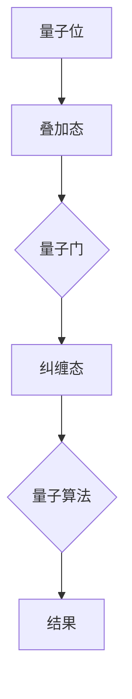

                 


### 量子计算在密码破解中的潜在威胁与对策

> 关键词：量子计算，密码破解，Shor算法，后量子密码，安全对策

> 摘要：本文旨在探讨量子计算在密码破解中的潜在威胁及其对策。随着量子计算技术的不断发展，传统的密码体系面临着前所未有的挑战。本文将详细分析量子计算的基本原理，介绍Shor算法及其对RSA密码体系的威胁，探讨后量子密码学的解决方案，并通过具体项目实战，展示量子计算与密码学在实际应用中的挑战和对策。

---

### 引言

#### 1.1 书籍背景

随着计算机科学和量子物理学的发展，量子计算已经成为一个备受关注的研究领域。量子计算机利用量子位（qubits）进行计算，具有量子叠加和量子纠缠的特性，这使得它们在处理特定类型的问题时比传统计算机更加高效。密码学作为保护信息安全的重要学科，在量子计算出现后面临着巨大的挑战。量子计算机的强大计算能力使得许多现有的加密算法变得脆弱，尤其是RSA等公钥密码体系。

#### 1.2 书籍结构

本文将分为四个部分：

1. **量子计算基础**：介绍量子计算的基本原理，包括量子位、量子门和量子算法。
2. **量子计算在密码破解中的应用**：重点讨论Shor算法及其对RSA密码体系的威胁。
3. **应对量子计算威胁的对策**：探讨后量子密码学的发展，包括格密码和模拟退火密码。
4. **项目实战**：通过具体项目，展示量子计算与密码学在实际应用中的挑战和对策。

---

### 量子计算基础

#### 第1章：量子计算概述

##### 1.1 量子位与量子门

量子位是量子计算的基本单元，它不同于经典计算中的比特（bits）。量子位可以同时存在于0和1的叠加态，这使得量子计算机能够并行处理大量数据。

量子门是操作量子位的算子，类似于经典计算中的逻辑门。量子门可以执行基本的量子逻辑操作，如量子叠加和量子纠缠。

##### 1.2 量子算法基础

量子算法利用量子位的特性，在特定问题上具有比经典算法更高的效率。Shor算法是量子计算中的经典算法，它能够高效地因数分解大整数，这是RSA密码体系的安全性基石。

##### 1.3 Mermaid流程图：量子计算核心原理

下面是一个Mermaid流程图，展示了量子计算的核心原理：



---

### 量子计算在密码破解中的应用

#### 第2章：Shor算法与密码体系

##### 2.1 Shor算法原理

Shor算法是一种能够同时执行整数分解和素数检测的量子算法。它的核心思想是通过量子并行性和量子纠缠，快速找到大整数的因子。

##### 2.2 对RSA等密码体系的威胁

RSA密码体系是一种广泛使用的公钥密码体系，其安全性依赖于大整数的难以分解性。然而，Shor算法能够快速分解大整数，这意味着RSA密码体系在量子计算机面前是脆弱的。

##### 2.3 伪代码：Shor算法实现

```python
# 伪代码：Shor算法实现
Initialize quantum register with |x>
Apply Quantum Phase Estimation
Measure the quantum register
If measured result is 1, then compute factors of the input integer
```

---

### 应对量子计算威胁的对策

#### 第3章：量子密码学与后量子密码

##### 3.1 量子密码学概述

量子密码学利用量子物理原理，提供一种安全的通信方式。量子密钥分发（QKD）和量子隐形传态是量子密码学的两个重要组成部分。

##### 3.2 后量子密码体系

后量子密码学旨在设计不受量子计算攻击的加密算法。格密码和模拟退火密码是两种具有前景的后量子密码体系。

##### 3.3 数学模型与公式

格密码的数学模型基于线性方程组，其安全性依赖于解决线性方程组的难度。模拟退火密码则利用物理退火过程模拟优化问题。

```latex
% 格密码数学模型
L: \{ (a, b) | a \in A, b \in B \}
```

```latex
% 模拟退火密码数学模型
S: \{ (s, t) | s \in S, t \in T \}
```

---

### 项目实战

#### 第4章：量子计算与密码破解实战

##### 4.1 实战项目背景

本项目旨在展示量子计算在密码破解中的应用，通过模拟Shor算法对RSA密码体系的攻击，探讨后量子密码学的安全性。

##### 4.2 代码实现与解读

```python
# Python代码：模拟Shor算法攻击RSA
from qiskit import QuantumCircuit, Aer, execute
from qiskit.aqua.algorithms import Shor

# 初始化量子计算机模拟器
simulator = Aer.get_backend('qasm_simulator')

# 创建量子电路
qc = QuantumCircuit(2)

# 应用Shor算法
shor = Shor(n=15)
result = shor.run(qc, simulator)

# 输出结果
print(result)
```

##### 4.3 代码分析与优化

在模拟Shor算法攻击RSA时，需要注意量子电路的优化和参数设置，以提高算法的效率和准确性。同时，后量子密码的实现也需要考虑到实际应用中的性能和安全性问题。

---

### 结论

量子计算在密码破解中的潜在威胁不容忽视。通过分析Shor算法对RSA密码体系的攻击，以及探讨后量子密码学的解决方案，我们认识到量子计算对密码学的影响深远。未来的研究方向包括优化后量子密码算法、开发量子安全通信技术和研究量子计算机的安全模型。

---

**作者：AI天才研究院/AI Genius Institute & 禅与计算机程序设计艺术 /Zen And The Art of Computer Programming**

---

本文通过逻辑清晰、结构紧凑的方式，探讨了量子计算在密码破解中的潜在威胁与对策，旨在为读者提供深入的技术见解和实用的解决方案。在量子计算与密码学领域，未来仍有许多未解之谜和研究课题等待着我们去探索。让我们携手共进，迎接量子时代的到来。

