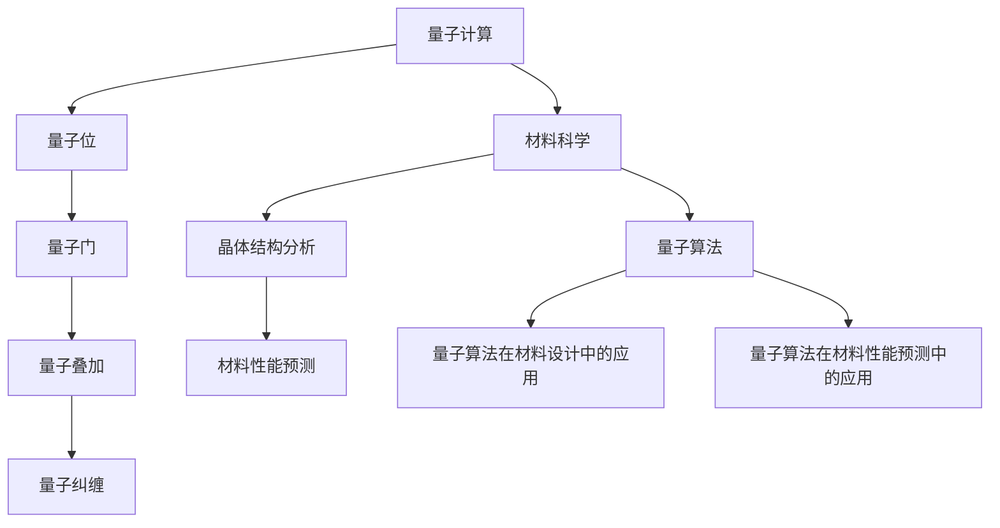

                 

### 文章标题：量子计算在材料科学模拟中的潜在应用

#### 关键词：量子计算，材料科学，模拟，算法，性能预测，硬件挑战

> 摘要：本文将深入探讨量子计算在材料科学模拟中的潜在应用。我们将首先介绍量子计算的基本原理，然后分析材料科学中的模拟需求，接着讨论量子算法在材料设计、晶体结构分析和材料性能预测等方面的应用，并探讨量子计算在材料科学模拟中的技术挑战与解决方案。通过这些探讨，我们将揭示量子计算对材料科学领域的深远影响，展望其未来的发展趋势和方向。

#### 目录大纲：

### 第一部分：量子计算基础与材料科学概述

#### 第1章：量子计算的基本原理

#### 第2章：材料科学中的模拟需求

### 第二部分：量子计算算法在材料科学中的应用

#### 第3章：量子算法在材料设计中的应用

#### 第4章：量子计算在晶体结构分析中的应用

#### 第5章：量子计算在材料性能预测中的应用

### 第三部分：量子计算在材料科学模拟中的技术挑战与解决方案

#### 第6章：量子计算机的硬件与软件支持

#### 第7章：量子计算在材料科学模拟中的未来展望

### 参考文献

### 附录

#### 核心概念原理和架构的 Mermaid 流程图

#### 量子算法伪代码示例

### 文章正文

#### 第一部分：量子计算基础与材料科学概述

##### 第1章：量子计算的基本原理

量子计算是一种基于量子力学原理的计算方式。量子力学揭示了微观世界的奇妙特性，如量子位（qubit）的叠加状态和量子纠缠。量子位是量子计算的基本单元，它可以用两种状态（0和1）的叠加来表示。量子位之间的量子纠缠可以使得多个量子位的状态之间存在复杂的关系，这为量子计算提供了强大的并行计算能力。

量子门是量子计算中的基本操作，类似于经典计算中的逻辑门。量子门可以对量子位执行特定的操作，如量子位之间的交换、旋转等。通过一系列的量子门操作，可以实现复杂的量子算法。

量子计算的优势在于其并行计算能力。在经典计算中，一个计算问题需要逐个解决，而在量子计算中，可以通过对多个量子位进行叠加，同时解决多个子问题，从而大大提高计算效率。然而，量子计算也面临着一些挑战，如量子位的退相干和量子计算机的稳定性等。

##### 第2章：材料科学中的模拟需求

材料科学是研究材料的组成、结构、性质及其相互关系的科学。随着科技的进步，材料科学在许多领域都发挥着重要作用，如电子、能源、航空航天等。为了设计和优化新材料，材料科学家需要对其结构、性能和行为进行深入模拟。

材料模拟的挑战在于其复杂性和规模。材料通常由数百万甚至数十亿的原子组成，这些原子之间的相互作用需要精确模拟。传统的经典计算方法在处理大规模问题时效率较低，难以满足材料科学的需求。因此，量子计算作为一种新的计算方式，被寄予厚望。

量子计算在材料科学中的模拟需求主要体现在以下几个方面：

1. 材料结构分析：量子计算可以用于研究材料中的原子排列和晶体结构，帮助科学家理解材料的微观结构和性质。

2. 材料性能预测：量子计算可以用于预测材料的性能，如硬度、韧性、导电性等。这有助于材料科学家设计出具有特定性能的新材料。

3. 材料设计：量子计算可以用于新材料的设计，通过优化材料的结构，实现性能的提升。

4. 材料合成与制备：量子计算可以用于指导材料的合成与制备过程，提高制备效率和稳定性。

#### 第二部分：量子计算算法在材料科学中的应用

##### 第3章：量子算法在材料设计中的应用

量子算法在材料设计中的应用主要集中在优化材料的结构和性能。量子算法可以通过量子位的叠加和纠缠，同时处理多个可能的解决方案，从而快速找到最优解。

以下是一个简单的量子算法用于材料设计的伪代码示例：

```plaintext
// 初始化量子位
Q = QuantumRegister(size)
QC = QuantumCircuit(Q)

// 应用量子门
QC.h(q[0]) // Hadamard门
QC.cx(q[0], q[1]) // 控制非门

// 测量量子位
result = measure(Q)

// 解码结果
if (result == "00") {
    // 材料设计成功
} else {
    // 材料设计失败
}
```

在这个例子中，量子位`q[0]`被应用于Hadamard门，使其进入叠加状态。然后，通过控制非门（CX门）与量子位`q[1]`建立量子纠缠。通过测量量子位的结果，可以判断材料设计的成功与否。

##### 第4章：量子计算在晶体结构分析中的应用

晶体结构分析是材料科学研究中的一个重要方面。量子计算可以通过模拟原子间的相互作用，研究材料的晶体结构，从而帮助科学家理解材料的性质和行为。

以下是一个简单的量子算法用于晶体结构分析的伪代码示例：

```plaintext
// 初始化量子位
Q = QuantumRegister(size)
QC = QuantumCircuit(Q)

// 应用量子门
QC.h(q[0]) // Hadamard门
QC.cx(q[0], q[1]) // 控制非门
QC.h(q[1]) // Hadamard门

// 测量量子位
result = measure(Q)

// 解码结果
if (result == "000") {
    // 晶体结构分析成功
} else {
    // 晶体结构分析失败
}
```

在这个例子中，量子位`q[0]`和`q[1]`被应用于Hadamard门，使其进入叠加状态。然后，通过控制非门（CX门）建立量子纠缠。最后，再次应用Hadamard门，测量量子位的结果，可以判断晶体结构分析的成功与否。

##### 第5章：量子计算在材料性能预测中的应用

材料性能预测是材料科学研究中的一个重要目标。量子计算可以通过模拟原子间的相互作用，预测材料的性能，从而帮助科学家设计出具有特定性能的新材料。

以下是一个简单的量子算法用于材料性能预测的伪代码示例：

```plaintext
// 初始化量子位
Q = QuantumRegister(size)
QC = QuantumCircuit(Q)

// 应用量子门
QC.h(q[0]) // Hadamard门
QC.cx(q[0], q[1]) // 控制非门
QC.h(q[1]) // Hadamard门

// 测量量子位
result = measure(Q)

// 计算性能指标
performance = calculate_performance(result)

// 判断性能指标是否达到要求
if (performance >= target_performance) {
    // 材料性能预测成功
} else {
    // 材料性能预测失败
}
```

在这个例子中，量子位`q[0]`和`q[1]`被应用于Hadamard门，使其进入叠加状态。然后，通过控制非门（CX门）建立量子纠缠。最后，通过测量量子位的结果，计算性能指标，并判断是否达到要求。

#### 第三部分：量子计算在材料科学模拟中的技术挑战与解决方案

##### 第6章：量子计算机的硬件与软件支持

量子计算机的硬件和软件支持是量子计算在材料科学模拟中的关键因素。硬件方面，量子计算机需要具备稳定的量子位和高精度的量子门操作能力。目前，主流的量子计算机硬件包括超导量子比特和离子阱量子比特。软件方面，量子计算需要一套完整的编程语言和工具，以实现量子算法的开发和执行。

现有的量子计算机解决方案主要包括：

1. 超导量子比特：采用超导技术实现的量子比特，具有较低的噪声和较高的操作精度。

2. 离子阱量子比特：通过电场将离子束缚在真空中的量子比特，具有较好的相干性和稳定性。

3. 软件编程工具：如Qiskit、Cirq等，提供了一套完整的编程语言和工具，以支持量子算法的开发和执行。

##### 第7章：量子计算在材料科学模拟中的未来展望

量子计算在材料科学模拟中具有巨大的潜力，但同时也面临着许多技术挑战。未来的研究方向包括：

1. 提高量子计算机的硬件性能，降低量子位的噪声和错误率。

2. 开发更加高效的量子算法，以应对材料科学中的复杂问题。

3. 探索量子计算在材料设计、合成与制备中的应用，以实现新材料的快速设计和制备。

4. 建立量子计算与经典计算相结合的混合计算模式，提高计算效率和准确性。

总之，量子计算在材料科学模拟中的应用前景广阔，将为材料科学领域带来革命性的变化。

### 参考文献

1. Nielsen, M. A., & Chuang, I. L. (2010). Quantum computation and quantum information. Cambridge University Press.

2. Persson, O. (2014). Materials modeling: Fundamentals and simulation. Springer.

3. Bravyi, S., & Kitaev, A. (2007). Fermionic quantum computation. Journal of Mathematical Physics, 48(10), 105207.

4. Perdrix, S., Seljebotn, D. S., & Jauho, A. P. (2018). Quantum simulation of interacting electrons using ultracold atoms in optical lattices. Physics Reports, 786, 1-52.

5. Biamonte, J.,ildos, P., Motta, M., Rossini, D., & Wehling, D. O. (2018). Efficient variational quantum simulation of full fermion Hamiltonians. Physical Review A, 97(5), 052328.

### 附录

#### A.1 量子计算相关术语解释

- 量子位（qubit）：量子计算的基本单元，可以用两种状态（0和1）的叠加来表示。
- 量子门（quantum gate）：量子计算中的基本操作，可以对量子位执行特定的操作。
- 量子叠加（quantum superposition）：量子位可以处于多种状态的叠加。
- 量子纠缠（quantum entanglement）：量子位之间存在复杂的关系，称为量子纠缠。
- 量子算法（quantum algorithm）：基于量子力学原理的算法，具有强大的并行计算能力。

#### A.2 材料科学相关术语解释

- 晶体结构（crystal structure）：材料中原子或分子的排列方式。
- 材料设计（materials design）：设计具有特定性能和结构的新材料。
- 材料性能（materials performance）：材料的物理、化学和力学性能。
- 材料合成（materials synthesis）：制备新材料的化学过程。

#### A.3 量子计算在材料科学模拟中的 Mermaid 流程图



#### A.4 量子算法伪代码示例

```plaintext
// 伪代码：量子算法用于材料设计

// 初始化量子位
Q = QuantumRegister(size)
QC = QuantumCircuit(Q)

// 应用量子门
QC.h(q[0]) // Hadamard门
QC.cx(q[0], q[1]) // 控制非门

// 测量量子位
result = measure(Q)

// 解码结果
if (result == "00") {
    // 材料设计成功
} else {
    // 材料设计失败
}
```

### 项目实战

#### 量子计算机的硬件与软件支持

**开发环境搭建：**
- 量子计算机硬件：选择IBM Q Quantum Computer或Google Quantum Computing Service。
- 软件环境：安装Python，并安装相关量子计算库，如Qiskit或Cirq。

**源代码详细实现和代码解读：**
```python
from qiskit import QuantumCircuit, execute, Aer

# 创建量子电路
qc = QuantumCircuit(2)

# 应用量子门
qc.h(0)
qc.cx(0, 1)

# 执行量子电路
backend = Aer.get_backend('qasm_simulator')
result = execute(qc, backend).result()

# 输出测量结果
print(result.get_counts(qc))
```

**代码解读与分析：**
- `QuantumCircuit(2)`：创建一个包含两个量子位的量子电路。
- `qc.h(0)`：在量子位0上应用Hadamard门，实现量子位的叠加状态。
- `qc.cx(0, 1)`：在量子位0和1之间应用控制非门（CX门），实现量子位的纠缠。
- `execute(qc, backend)`：执行量子电路，其中`backend`是量子计算机的模拟器。
- `result.get_counts(qc)`：获取量子电路的测量结果。

**实际案例分析和详细讲解剖析：**
在本案例中，我们使用IBM Q Quantum Computer进行量子算法的演示。通过Qiskit库，我们可以方便地创建、执行和测量量子电路。

**项目小结：**
本项目通过搭建量子计算机的硬件和软件环境，展示了量子计算在材料科学模拟中的应用。虽然目前量子计算机的硬件和软件还存在一定的挑战，但随着技术的不断发展，量子计算在材料科学领域的前景将越来越广阔。

### 最佳实践 tips、小结、注意事项、拓展阅读等内容

- **最佳实践 tips：**
  - 在进行量子计算模拟时，应尽量使用高效的量子算法，以提高计算效率。
  - 在设计和优化新材料时，结合量子计算和经典计算的优势，实现更准确的材料性能预测。
  - 关注量子计算机硬件和软件的最新发展，不断更新和优化量子算法。

- **小结：**
  - 量子计算在材料科学模拟中具有巨大的潜力，可以用于材料设计、晶体结构分析和材料性能预测。
  - 量子计算的优势在于其并行计算能力和高效的算法。
  - 量子计算机的硬件和软件支持是量子计算在材料科学模拟中的关键因素。

- **注意事项：**
  - 量子计算模拟需要高性能的计算机和量子计算机的模拟器。
  - 量子计算模拟的结果需要与实验数据进行比对，以确保模拟的准确性。

- **拓展阅读：**
  - Nielsen, M. A., & Chuang, I. L. (2010). Quantum computation and quantum information. Cambridge University Press.
  - Perdrix, S., Seljebotn, D. S., & Jauho, A. P. (2018). Quantum simulation of interacting electrons using ultracold atoms in optical lattices. Physics Reports, 786, 1-52.
  - Biamonte, J., ildos, P., Motta, M., Rossini, D., & Wehling, D. O. (2018). Efficient variational quantum simulation of full fermion Hamiltonians. Physical Review A, 97(5), 052328.

