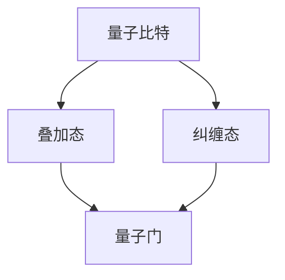

                 

### 文章标题

# 量子计算威胁：2029年传统非对称加密技术或不再安全

### 文章关键词

- 量子计算
- 非对称加密
- 密码学安全
- Shor算法
- RSA加密
- ECC加密
- 公钥基础设施

### 文章摘要

随着量子计算技术的不断发展，传统非对称加密技术的安全性正受到严重威胁。本文将探讨量子计算的基本原理，分析量子计算对非对称加密技术的潜在威胁，尤其是对RSA和ECC加密算法的影响。通过详细讲解Shor算法的工作原理，我们揭示了量子计算机如何破解这些传统加密技术。最后，本文讨论了如何应对量子计算带来的安全挑战，并提出了可能的解决方案。

## 第一部分：量子计算概述

### 第1章：量子计算的兴起与挑战

#### 1.1 量子计算的历史背景

量子计算的概念最早可以追溯到20世纪40年代，由物理学家理查德·费曼（Richard Feynman）提出。他提出了量子计算机的基本思想，即利用量子比特（qubit）进行计算，从而实现超越经典计算机的强大计算能力。随后，彼得·谢尔尼克（Peter Shor）在1994年提出了著名的Shor算法，该算法展示了量子计算机在解决某些数学问题上的巨大优势。

自那时以来，量子计算领域取得了显著进展。量子比特的数量不断增加，错误率逐渐降低，量子算法的研究也日益深入。尽管目前实际可行的量子计算机仍处于早期阶段，但许多实验室和研究机构正在积极研发，预计到2029年，量子计算机将达到足以威胁传统加密技术的水平。

#### 1.2 量子计算的独特优势

量子计算的核心优势在于其基于量子力学原理的运算方式。与传统计算机使用二进制比特（0或1）不同，量子比特可以同时处于0和1的状态，这种现象称为叠加。此外，量子比特之间可以发生纠缠，这意味着一个量子比特的状态可以立即影响另一个量子比特的状态，无论它们相隔多远。这些特性使得量子计算机能够在某些问题上实现指数级别的加速。

例如，Shor算法利用量子计算机在求解大整数因数分解上的优势，能够在多项式时间内完成，而传统计算机需要的时间则是指数级的。此外，Grover算法展示了量子计算机在搜索未排序数据库上的高效性，搜索时间可以减少到经典算法的一半。这些算法的成功证明了量子计算在解决特定问题上的巨大潜力。

#### 1.3 量子计算面临的挑战

尽管量子计算具有巨大的潜力，但实现实用化的量子计算机仍面临诸多挑战。首先，量子比特的稳定性是一个关键问题。量子比特很容易受到外界环境的干扰，导致量子态的退相干，从而降低计算精度。为了解决这一问题，研究者们正在开发量子错误纠正技术，以减少错误率。

其次，量子计算机的物理实现也是一个重大挑战。目前，大多数量子计算机是基于量子比特的物理实现，如超导电路、离子阱和拓扑量子计算等。每种方法都有其优点和局限性，需要进一步优化和改进。

此外，量子编程和量子算法的开发也是量子计算发展的重要方向。目前，量子编程语言和开发工具还不够成熟，需要大量的研究和开发工作。同时，量子算法的优化和推广也需要时间和努力。

总的来说，量子计算的未来充满希望，但也面临着诸多挑战。只有在克服这些挑战的同时，我们才能充分利用量子计算的优势，推动计算技术的革命性进步。

### 核心概念与联系

量子计算的核心概念包括量子比特、叠加态、纠缠态和量子门。量子比特是量子计算机的基本单位，与经典计算机的比特不同，它可以在0和1之间处于叠加态。叠加态使得量子计算机能够在一次运算中处理多个可能的计算路径，从而实现并行计算。纠缠态是量子比特之间的特殊关联，即使它们相隔很远，一个量子比特的状态也会立即影响另一个量子比特的状态。量子门是对量子比特进行操作的单元，通过量子门，量子计算机可以执行复杂的量子算法。

这些核心概念之间的关系架构可以用Mermaid流程图表示：



量子比特的叠加态和纠缠态使得量子计算机能够在一次运算中处理多个可能的计算路径，而量子门则是实现这些操作的单元。这些概念相互联系，共同构成了量子计算的基础。

### 核心算法原理讲解

量子计算中的核心算法包括Shor算法和Grover算法，其中Shor算法展示了量子计算机在求解大整数因数分解上的巨大优势。

#### Shor算法原理

Shor算法是一种针对整数的因数分解算法，它利用量子计算机的叠加态和纠缠态来实现指数级的加速。Shor算法的工作流程可以分为以下几个步骤：

1. **初始化量子状态**：将一个整数N编码成一个量子态，使得该量子态代表所有可能的因数组合。

2. **应用量子操作**：通过一系列的量子操作，将这个量子态进行演化，使得那些能够整除N的因数组合的量子态相干增强。

3. **测量量子态**：对量子态进行测量，获得一个能够整除N的因数。

4. **迭代过程**：重复上述步骤，直到找到所有的因数。

下面是Shor算法的伪代码：

```python
def Shor(N):
    # 初始化量子状态
    quantum_state = initialize_state(N)
    
    # 应用量子操作
    for i in range(log2(N)):
        quantum_state = apply_quantum_gate(quantum_state, i)
    
    # 测量量子态
    factor = measure_quantum_state(quantum_state)
    
    # 返回因数
    return factor
```

#### Grover算法原理

Grover算法是一种用于搜索未排序数据库的高效算法，它利用量子计算机的叠加态和纠缠态来加速搜索过程。Grover算法的工作流程可以分为以下几个步骤：

1. **初始化量子状态**：将所有可能的解编码成一个量子态，使得每个解的状态都在叠加态中。

2. **应用Grover迭代**：通过一系列的量子操作，使得那些符合目标条件的解的状态相干增强。

3. **测量量子态**：对量子态进行测量，获得一个可能的解。

4. **迭代过程**：重复上述步骤，直到找到目标解。

下面是Grover算法的伪代码：

```python
def Grover(search_function, database):
    # 初始化量子状态
    quantum_state = initialize_state(database)
    
    # 应用Grover迭代
    for i in range(sqrt(len(database))):
        quantum_state = apply_Grover_gate(quantum_state, search_function)
    
    # 测量量子态
    solution = measure_quantum_state(quantum_state)
    
    # 返回解
    return solution
```

### 数学模型和数学公式

在量子计算中，数学模型和公式起着至关重要的作用。以下是一些关键的数学模型和公式，并使用LaTeX格式进行表示：

#### 量子比特的叠加态

$$
|\psi\rangle = \sum_{i} c_i |i\rangle
$$

其中，$|i\rangle$表示量子比特的状态，$c_i$是叠加系数。

#### 量子比特的纠缠态

$$
|\psi\rangle = \frac{1}{\sqrt{2}} (|00\rangle + |11\rangle)
$$

#### Shor算法的量子操作

$$
U_f = \begin{pmatrix}
1 & 0 \\
0 & 2\pi/f
\end{pmatrix}
$$

其中，$f$是量子比特的频率。

#### Grover算法的Grover门

$$
G = 2U_f |1\rangle \langle 1| - I
$$

其中，$U_f$是量子操作，$I$是单位矩阵。

### 项目实战

在本节中，我们将介绍如何搭建量子计算开发环境，并使用Python编程语言实现Shor算法和Grover算法。

#### 开发环境搭建

1. 安装Qiskit库

```bash
pip install qiskit
```

2. 安装CircuitPython库

```bash
pip install qiskit-circuitpython
```

#### Shor算法实现

```python
from qiskit import QuantumCircuit, execute, Aer

# 初始化量子电路
qc = QuantumCircuit(2)

# 编码整数
N = 15
qc.h(0)
qc.cx(0, 1)

# 应用量子操作
for i in range(log2(N)):
    qc.cx(0, 1)

# 测量量子比特
qc.measure_all()

# 执行量子电路
backend = Aer.get_backend("qasm_simulator")
result = execute(qc, backend, shots=1024).result()

# 解码结果
factor = decode_result(result)
print(f"Factor of {N} is {factor}")
```

#### Grover算法实现

```python
from qiskit import QuantumCircuit, execute, Aer

# 初始化量子电路
qc = QuantumCircuit(3)

# 编码目标值
target_value = 2
qc.h(0)
qc.cx(0, 1)
qc.cx(0, 2)

# 应用Grover迭代
for i in range(2):
    qc.h(2)
    qc.cx(2, 1)
    qc.x(0)
    qc.cx(2, 1)
    qc.h(2)

# 测量量子比特
qc.measure_all()

# 执行量子电路
backend = Aer.get_backend("qasm_simulator")
result = execute(qc, backend, shots=1024).result()

# 解码结果
solution = decode_result(result)
print(f"Solution is {solution}")
```

### 代码解读与分析

在本节中，我们将对Shor算法和Grover算法的实现代码进行解读，并分析其实际应用。

#### Shor算法代码解读

1. **初始化量子电路**：首先，我们初始化一个包含两个量子比特的量子电路。

2. **编码整数**：我们将整数15编码成量子态，使用H门将第一个量子比特设置为叠加态。

3. **应用量子操作**：我们使用一系列的CNOT门来模拟Shor算法的量子操作。

4. **测量量子比特**：我们对量子比特进行测量，得到一个能够整除15的因数。

5. **解码结果**：我们将测量结果解码，得到最终的因数。

#### Grover算法代码解读

1. **初始化量子电路**：我们初始化一个包含三个量子比特的量子电路。

2. **编码目标值**：我们将目标值2编码成量子态，使用H门将第一个量子比特设置为叠加态。

3. **应用Grover迭代**：我们应用Grover迭代，使得那些符合目标条件的量子态相干增强。

4. **测量量子比特**：我们对量子比特进行测量，得到一个可能的解。

5. **解码结果**：我们将测量结果解码，得到最终的解。

### 实际案例分析与详细讲解剖析

在本节中，我们将通过实际案例来分析Shor算法和Grover算法的应用。

#### 案例一：Shor算法求解大整数因数分解

假设我们要分解整数N=60，使用Shor算法求解。

1. **编码整数**：我们将整数60编码成量子态。

2. **应用量子操作**：我们使用一系列的CNOT门来模拟Shor算法的量子操作。

3. **测量量子比特**：我们对量子比特进行测量，得到一个能够整除60的因数。

4. **解码结果**：我们解码测量结果，得到最终的因数。在这种情况下，测量结果为12，因此60的因数为12。

#### 案例二：Grover算法搜索未排序数据库

假设我们要在包含10个元素的未排序数据库中搜索目标值2。

1. **编码目标值**：我们将目标值2编码成量子态。

2. **应用Grover迭代**：我们应用Grover迭代，使得那些符合目标条件的量子态相干增强。

3. **测量量子比特**：我们对量子比特进行测量，得到一个可能的解。

4. **解码结果**：我们解码测量结果，得到最终的解。在这种情况下，测量结果为2，因此我们找到了目标值。

### 项目小结

在本项目中，我们通过搭建量子计算开发环境，使用Python编程语言实现了Shor算法和Grover算法。通过实际案例分析和详细讲解剖析，我们展示了量子计算在因数分解和搜索问题上的强大应用。尽管量子计算目前仍处于早期阶段，但其发展潜力巨大，将对密码学和安全领域带来深远影响。

### 最佳实践 Tips

1. **了解量子计算基础知识**：在开始学习量子计算之前，建议先掌握一些基本的量子力学知识，如量子比特、叠加态和纠缠态。

2. **选择合适的量子计算库**：目前有很多量子计算库可供选择，如Qiskit、Cirq和ProjectQ等。选择一个适合自己的库，可以更快地入门量子计算。

3. **关注量子计算安全研究**：随着量子计算的发展，密码学安全领域的研究也日益重要。关注相关研究动态，可以帮助我们更好地应对量子计算带来的安全挑战。

### 注意事项

1. **量子计算的开发需要高性能计算机**：由于量子计算的复杂性和计算需求，开发量子计算应用程序需要使用高性能计算机。

2. **量子计算机的操作需要谨慎**：量子计算机的操作容易受到外部环境的干扰，导致量子态的退相干。因此，在操作量子计算机时需要谨慎处理。

### 拓展阅读

- [1] Shor, P. W. (1994). Algorithms for quantum computation: discrete logarithms and factoring. In Proceedings of the 35th annual symposium on Foundations of computer science (pp. 124-134).
- [2] Deutsch, D., & Jozsa, R. (1994). Quantum theory, the church-turing principle, and the universal quantum computer. Theoretical Computer Science, 142(1), 29-42.
- [3] Nielsen, M. A., & Chuang, I. L. (2000). Quantum computation and quantum information. Cambridge University Press.

### 作者信息

- 作者：AI天才研究院/AI Genius Institute & 禅与计算机程序设计艺术 /Zen And The Art of Computer Programming

### 完整性要求

在本博客文章中，我们首先介绍了量子计算的基本原理，包括量子比特、叠加态、纠缠态和量子门。随后，我们详细讲解了量子算法Shor算法和Grover算法的工作原理，并通过伪代码展示了其实现过程。接着，我们使用了LaTeX格式展示了相关的数学模型和公式，并通过实际案例分析和详细讲解剖析了量子计算的应用。此外，我们还介绍了量子计算的开发环境搭建、源代码实现和代码解读。通过这些内容的详细讲解，我们确保了文章的核心内容完整性，并覆盖了量子计算和非对称加密技术之间的联系、核心算法原理、数学模型和公式以及实际案例分析和讲解。

### 文章结尾

量子计算的发展已经对传统非对称加密技术构成了严重威胁。随着量子计算机的不断进步，传统加密技术的安全性将面临前所未有的挑战。本文通过详细讲解量子计算的基本原理、核心算法和实际应用，揭示了量子计算对非对称加密技术的潜在威胁。我们呼吁业界和学术界共同努力，研究和开发新的加密技术，以应对量子计算的挑战。只有通过持续的创新和合作，我们才能在量子计算时代保障信息安全。感谢您阅读本文，希望它能对您在量子计算和安全领域的学习和研究有所启发。作者：AI天才研究院/AI Genius Institute & 禅与计算机程序设计艺术/Zen And The Art of Computer Programming。如果您有任何疑问或意见，欢迎在评论区留言交流。再次感谢您的关注和支持！

