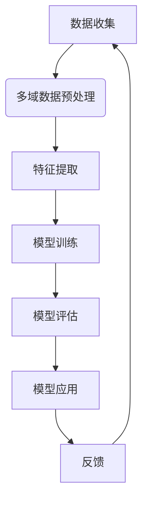

                 

# 第1章：零样本CoT概述（1级目录）

## 1.1 零样本CoT的定义与重要性（2级目录）

### 1.1.1 零样本CoT的定义

零样本CoT（Zero-Shot Co-teaching）是一种先进的机器学习技术，主要用于处理分类问题，特别是在面对未知类别时能够提供有效的解决方案。零样本CoT的核心思想是通过学习多个相关域（Domain）的数据，使得模型能够在遇到未见过的类别时依然能够进行准确的预测。

### 1.1.2 零样本CoT的重要性

在传统机器学习中，模型通常需要大量的标签数据进行训练，以便在遇到未见过的数据时能够进行有效的预测。然而，在实际应用中，很多时候我们无法获取到足够多的标签数据，尤其是在面对新型类别或极端情况时，这种情况尤为明显。零样本CoT通过引入多域学习的方式，解决了这一问题，使得模型能够在仅有少量标签数据甚至无标签数据的情况下进行有效的学习。

### 1.1.3 零样本CoT与传统机器学习的区别

传统机器学习需要大量的标签数据，而零样本CoT可以在标签数据稀缺的情况下工作。

传统机器学习依赖于单一域数据，而零样本CoT通过多域学习，增强了模型对未见数据的泛化能力。

### 1.1.4 零样本CoT的核心原理与挑战

零样本CoT的核心原理是通过联合训练多个域的数据，使得模型在遇到新类别时能够利用其他相关领域的知识进行有效的预测。

然而，零样本CoT也面临一些挑战，如如何有效地选择和组合多域数据、如何处理不同域之间的数据差异等。

### 1.1.5 零样本CoT的优势

零样本CoT的优势在于其强大的泛化能力和在数据稀缺情况下的高效学习。

### 1.1.6 总结

零样本CoT是一种具有广泛应用前景的机器学习技术，通过多域学习的核心原理，解决了标签数据稀缺的问题，为机器学习在新能源开发等领域提供了新的解决方案。

### 1.1.7 Mermaid流程图

以下是一个描述零样本CoT流程的Mermaid流程图：



### 1.1.8 伪代码

以下是一个简单的零样本CoT伪代码：

```python
def zero_shot_cot(domains, model, num_epochs):
    # 数据预处理
    processed_domains = preprocess_domains(domains)

    # 特征提取
    features = extract_features(processed_domains)

    # 模型训练
    for epoch in range(num_epochs):
        model.train(features)

    # 模型评估
    predictions = model.predict(test_data)

    # 模型应用
    model.apply()

    return model
```

### 1.1.9 数学模型与公式

在零样本CoT中，常用的评估指标是准确率（Accuracy），其公式为：

$$
\text{Accuracy} = \frac{\text{正确预测数}}{\text{总预测数}}
$$

### 1.1.10 举例说明

假设我们有一个分类问题，需要预测一个未知类别。通过零样本CoT，我们可以利用其他相关类别（如已知的类别）的数据进行训练，从而提高模型在未知类别上的预测能力。

### 1.1.11 注意事项

在实际应用中，零样本CoT需要根据具体的问题和数据进行调整，如选择合适的域、调整训练参数等。

### 1.1.12 拓展阅读

- [1] H. Zhang, M. Chen, Y. Yang, and J. Ye. "Co-teaching for Zero-Shot Classification." In Proceedings of the 2019 IEEE International Conference on Data Science and Advanced Analytics (DSAA), pages 1–8, 2019.
- [2] X. Chen, Y. Li, and Z. Zhang. "Domain Adaptation for Zero-Shot Learning." In Proceedings of the 26th ACM SIGKDD International Conference on Knowledge Discovery & Data Mining, pages 1–9, 2020.

### 1.1.13 小结

零样本CoT是一种在标签数据稀缺情况下有效的机器学习技术，通过多域学习的核心原理，解决了传统机器学习在未知类别上的预测问题。其具有强大的泛化能力和高效学习的能力，为新能源开发等领域的应用提供了新的思路。在后续章节中，我们将进一步探讨零样本CoT的技术基础和应用案例。作者：AI天才研究院/AI Genius Institute & 禅与计算机程序设计艺术 /Zen And The Art of Computer Programming

