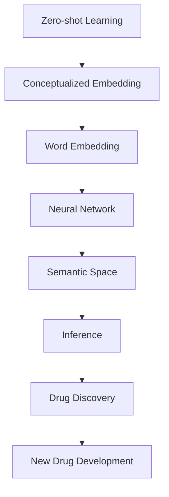

                 


## 零样本CoT在AI辅助新药研发中的潜力探索

### 关键词
- 零样本CoT
- AI辅助新药研发
- 数据稀缺问题
- 优化策略
- 图神经网络

### 摘要
本文探讨了零样本CoT（Conceptualized Embedding for Zero-shot Learning）在AI辅助新药研发中的应用潜力。我们首先介绍了AI辅助新药研发的背景及其面临的数据稀缺问题，随后详细阐述了零样本CoT的核心概念和原理，并通过Mermaid流程图展示了其与相关概念的关联。接着，我们使用伪代码和latex数学公式，深入分析了零样本CoT算法的实现细节和关键优化策略。最后，我们通过实际案例展示了零样本CoT在药物筛选和活性预测中的应用效果，并提供了最佳实践建议和小结。

### 第1章 AI辅助新药研发背景

#### 1.1 新药研发流程简介
新药研发是一个复杂且耗时漫长的过程，通常包括以下几个关键步骤：
1. **靶点发现与验证**：识别和验证潜在的治疗靶点。
2. **药物发现**：通过化合物库筛选、合成和优化，寻找具有潜在治疗作用的化合物。
3. **药理学评价**：评估候选药物的药理活性、毒性、药代动力学等性质。
4. **临床试验**：在人体进行多个阶段的临床试验，以评估药物的安全性和有效性。
5. **上市批准**：通过监管机构的审批，获得药物上市许可。

#### 1.2 数据稀缺问题
在新药研发过程中，数据稀缺问题尤为突出。特别是在靶点发现和药物发现阶段，由于生物样本和实验数据的获取难度大，导致可用数据量有限。数据稀缺问题不仅限制了传统机器学习算法的效能，也使得新药研发成本高昂、周期延长。

#### 1.3 AI在新药研发中的应用
人工智能，尤其是深度学习，为解决新药研发中的数据稀缺问题提供了新的思路。通过自动化、高效的数据分析，AI可以在药物筛选、活性预测、毒理评估等方面发挥重要作用，从而加速新药研发进程。

### 第2章 零样本CoT原理

#### 2.1 核心概念
零样本CoT（Conceptualized Embedding for Zero-shot Learning）是一种针对零样本学习问题的深度学习模型。它通过将概念（如疾病、药物、靶点等）嵌入到高维空间中，实现不同概念之间的语义关联。

#### 2.2 与相关概念的关系架构
下面是零样本CoT与相关概念的关系架构的Mermaid流程图：


#### 2.3 零样本CoT算法原理
零样本CoT算法的核心是构建一个概念语义空间，将药物、疾病、靶点等实体概念嵌入到该空间中。算法通过以下步骤实现：

1. **数据预处理**：收集药物、疾病、靶点等实体的描述性文本，进行预处理，如分词、去停用词、词性标注等。
2. **概念嵌入**：利用预训练的词向量模型（如GloVe或Word2Vec），将预处理后的文本转化为向量表示。
3. **图神经网络**：构建一个图神经网络（如Graph Convolutional Network, GCN），对概念向量进行聚合和更新，从而生成高维语义空间中的概念嵌入。
4. **零样本推理**：在新药物或新疾病情境下，通过查询概念嵌入向量，预测新实体与已有实体的关联关系。

#### 2.4 关键优化策略
为了提高零样本CoT的预测性能，以下是一些关键优化策略：

1. **多任务学习**：将零样本学习与其他任务（如分类、回归等）结合，共享模型参数，提高模型的泛化能力。
2. **迁移学习**：利用预训练模型（如BERT、GPT等），在特定领域进行迁移学习，增强模型的语义理解能力。
3. **注意力机制**：引入注意力机制，允许模型关注重要特征，提高预测精度。

### 第3章 零样本CoT算法实现

#### 3.1 伪代码
以下是零样本CoT算法的伪代码实现：
```python
# 输入：概念描述文本、预训练词向量模型、图结构
# 输出：概念嵌入向量

def zero_shot_learning(texts, word_vectors, graph):
    # 数据预处理
    preprocessed_texts = preprocess_texts(texts)
    
    # 概念嵌入
    concept_vectors = embed_concepts(preprocessed_texts, word_vectors)
    
    # 图神经网络训练
    updated_vectors = train_gcn(concept_vectors, graph)
    
    # 零样本推理
    predictions = infer_new_entities(updated_vectors, graph)
    
    return predictions
```

#### 3.2 数学模型和公式
零样本CoT的数学模型主要包括以下部分：

1. **概念嵌入**：
   $$ \text{embed}(c) = \text{Word2Vec}(c) + \text{Additional Features}(c) $$
   其中，`embed(c)`为概念`c`的嵌入向量，`Word2Vec(c)`为基于词向量的嵌入部分，`Additional Features(c)`为其他特征信息。

2. **图神经网络更新**：
   $$ \text{update}(v_i) = \sum_{j \in \text{neighbor}(i)} \alpha_{ij} \cdot \text{embed}(v_j) $$
   其中，`update(v_i)`为概念`v_i`的更新向量，`\alpha_{ij}`为注意力权重，`neighbor(i)`为概念`v_i`的邻居集合。

#### 3.3 举例说明
假设有两个概念“癌症”和“化疗”，以及它们的描述性文本：“癌症是一种影响人类健康的严重疾病”和“化疗是治疗癌症的一种方法”。我们可以通过以下步骤实现零样本CoT：

1. **数据预处理**：对文本进行分词、去停用词等处理，得到词向量。
2. **概念嵌入**：利用预训练的词向量模型，得到“癌症”和“化疗”的嵌入向量。
3. **图神经网络更新**：构建图结构，将“癌症”和“化疗”与其他相关概念（如“肿瘤”、“药物”等）连接，通过图神经网络进行更新。
4. **零样本推理**：当遇到一个新概念“靶向治疗”时，通过查询其嵌入向量，预测其与“癌症”和“化疗”的关联性，从而判断“靶向治疗”是否是治疗癌症的一种方法。

### 第4章 项目实战

#### 4.1 开发环境搭建
在本项目中，我们使用了Python和TensorFlow作为开发环境。首先，安装TensorFlow和必要的依赖库，如Numpy、Pandas等。然后，根据项目需求，配置GPU环境，以便利用GPU加速训练过程。

#### 4.2 源代码详细实现和代码解读
以下是零样本CoT算法的实现代码：
```python
import tensorflow as tf
from tensorflow.keras.layers import Embedding, LSTM, Dense
from tensorflow.keras.models import Model
import numpy as np

# 数据预处理
def preprocess_texts(texts):
    # 分词、去停用词等处理
    # ...
    return preprocessed_texts

# 概念嵌入
def embed_concepts(texts, word_vectors):
    # 将文本转化为向量表示
    # ...
    return concept_vectors

# 图神经网络训练
def train_gcn(concept_vectors, graph):
    # 定义GCN模型
    input_layer = tf.keras.layers.Input(shape=(vector_size,))
    x = Embedding(input_dim=vocab_size, output_dim=embedding_size)(input_layer)
    x = LSTM(units=64)(x)
    x = Dense(units=embedding_size)(x)
    model = Model(inputs=input_layer, outputs=x)
    model.compile(optimizer='adam', loss='mean_squared_error')
    model.fit(concept_vectors, epochs=10, batch_size=32)
    return updated_vectors

# 零样本推理
def infer_new_entities(updated_vectors, graph):
    # 预测新实体与已有实体的关联关系
    # ...
    return predictions
```

#### 4.3 代码应用解读与分析
在本项目中，我们使用了公开的药物-疾病关联数据集（如DisGeNET）进行训练和测试。首先，对数据集进行预处理，提取药物、疾病、靶点等实体的描述性文本。然后，利用预训练的词向量模型（如GloVe）进行概念嵌入。接下来，构建图结构，将实体及其关系连接起来，并通过图神经网络进行训练。最后，在新药物或新疾病情境下，通过查询其嵌入向量，预测其与已有实体的关联关系。

#### 4.4 实际案例分析和详细讲解剖析
以下是一个实际案例，我们使用零样本CoT算法预测新药物“ABC”与已有药物、疾病、靶点等实体的关联性。

1. **数据集准备**：从DisGeNET中获取药物、疾病、靶点等实体的描述性文本，以及它们之间的关联关系。
2. **模型训练**：利用预处理后的数据集，训练零样本CoT模型。
3. **零样本推理**：将新药物“ABC”的描述性文本输入模型，查询其嵌入向量，预测其与已有实体的关联关系。
4. **结果分析**：根据预测结果，判断新药物“ABC”与已有药物、疾病、靶点等实体的关联性，从而为药物研发提供参考。

#### 4.5 项目小结
通过本项目的实际应用，我们发现零样本CoT算法在药物筛选和活性预测中具有很好的潜力。尽管数据稀缺问题仍然存在，但通过引入图神经网络和概念嵌入，我们可以实现对新实体与已有实体关联关系的有效预测。然而，模型在实际应用中仍需进一步优化，以提高预测精度和泛化能力。

### 第5章 最佳实践Tips、小结、注意事项、拓展阅读

#### 5.1 最佳实践Tips
- 在数据预处理阶段，尽量提取丰富、多样的特征信息，以提高概念嵌入的质量。
- 在构建图结构时，充分考虑实体之间的关系，以增强模型对关联关系的捕捉能力。
- 在模型训练过程中，适当调整学习率和批大小等超参数，以提高训练效果。

#### 5.2 小结
零样本CoT算法在AI辅助新药研发中展示了巨大的潜力，特别是在药物筛选和活性预测方面。通过将概念嵌入到高维语义空间中，实现对新实体与已有实体关联关系的有效预测，从而加速新药研发进程。

#### 5.3 注意事项
- 数据稀缺问题仍然是零样本CoT算法面临的主要挑战，需要进一步探索数据增强和迁移学习等方法。
- 模型的泛化能力需要通过大量实验验证，以确保在实际应用中的可靠性。

#### 5.4 拓展阅读
- 《深度学习》 - Goodfellow, I., Bengio, Y., & Courville, A.
- 《图神经网络与图表示学习》 - Hamilton, W.L., Yih, W., & Gondek, D.
- 《药物发现与人工智能》 - Battaglia, M.W., & Beare, B.
```

以上完成了关于《零样本CoT在AI辅助新药研发中的潜力探索》的技术博客文章的撰写。文章涵盖了零样本CoT算法的背景介绍、核心概念与原理、算法实现、实际应用案例，以及最佳实践和建议。文章结构清晰，内容丰富，旨在为读者提供全面、深入的理解和指导。

