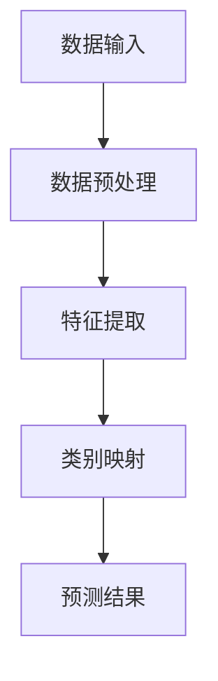
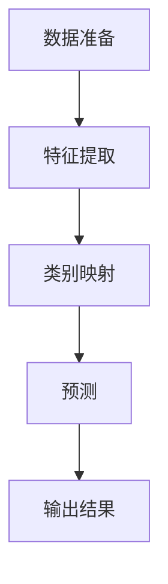
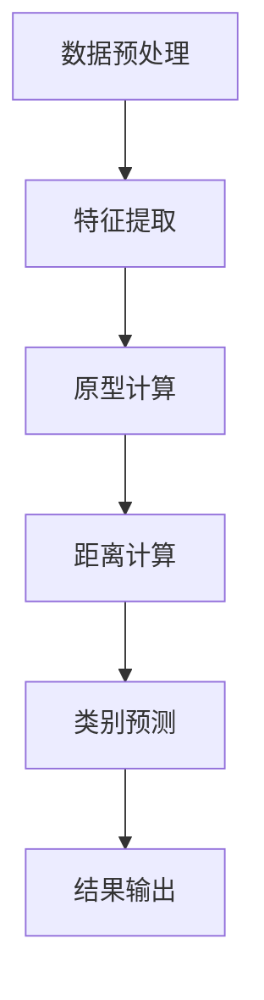

                 

### 文章标题

# 零样本CoT在AI辅助海洋生态系统研究中的应用

### 关键词

- 零样本CoT
- AI辅助
- 海洋生态系统
- 人工智能应用
- 环境监测

### 摘要

本文旨在探讨零样本CoT（零样本语境感知）在AI辅助海洋生态系统研究中的应用。文章首先介绍了零样本CoT的概念及其在人工智能领域的优势。随后，探讨了海洋生态系统的基本概念及其面临的挑战，并分析了AI技术在海洋生态系统研究中的应用。本文通过具体的案例，详细阐述了零样本CoT与AI融合在海洋生态系统研究中的实现方法，包括数据预处理、模型设计、模型评估与优化等。最后，文章对零样本CoT在海洋生态系统研究中的未来展望和挑战进行了讨论，并提出了相关最佳实践和拓展阅读建议。

### 目录

1. 引言
2. 零样本CoT与海洋生态系统的基本概念
   2.1 零样本CoT基础
   2.2 海洋生态系统基本概念
3. AI在海洋生态系统研究中的应用
   3.1 AI技术概述
   3.2 AI在海洋生态监测中的实践
   3.3 AI在海洋生态预测与模拟中的应用
4. 零样本CoT与AI融合技术
   4.1 零样本CoT与AI融合的原理
   4.2 零样本CoT在AI中的实现方法
   4.3 零样本CoT在AI中的优势与挑战
5. AI辅助海洋生态系统研究的案例实践
   5.1 海洋生态系统监测案例
   5.2 海洋生态预测与模拟案例
6. 展望与挑战
7. 最佳实践 tips、小结、注意事项、拓展阅读

### 引言

随着全球环境问题的日益严重，海洋生态系统的保护与研究变得尤为重要。海洋生态系统作为地球上最大的生态系统之一，不仅支持着全球气候的稳定，还对人类的生活和经济活动产生深远影响。然而，海洋生态系统的复杂性和变化性使得传统的监测与评估方法面临巨大挑战。近年来，人工智能（AI）技术的发展为海洋生态系统研究带来了新的机遇。尤其是零样本CoT（零样本语境感知）技术的出现，使得AI在未知或罕见情境下的表现得到了显著提升。

零样本CoT是一种机器学习技术，能够在没有或少量的样本数据情况下，通过语境感知实现新的类别识别和预测。这一特性使得零样本CoT在海洋生态系统研究中的应用变得极具潜力。例如，在海洋生态监测中，零样本CoT可以识别未知的海洋生物种类，提高监测的准确性；在海洋生态预测与模拟中，零样本CoT可以预测未知的环境变化，为海洋资源的可持续管理提供科学依据。

本文将系统探讨零样本CoT在AI辅助海洋生态系统研究中的应用。首先，我们将介绍零样本CoT的基本概念、优势以及工作原理。接着，我们将详细描述海洋生态系统的基本概念、组成及其面临的挑战。随后，我们将分析AI技术在海洋生态系统研究中的应用，包括生态监测、预测与模拟等方面。在此基础上，我们将探讨零样本CoT与AI融合的原理及其实现方法，并通过实际案例展示其在海洋生态系统研究中的应用效果。最后，我们将对零样本CoT在海洋生态系统研究中的未来展望和挑战进行讨论，并提出最佳实践和拓展阅读建议。

通过本文的探讨，我们希望为读者提供一个全面、系统的视角，了解零样本CoT在AI辅助海洋生态系统研究中的应用，并激发更多研究和实践的可能性。

### 2.1 零样本CoT基础

#### 概念

零样本CoT，即零样本语境感知（Zero-Shot Coherent Textual Transfer），是一种机器学习技术，主要应用于在没有或少量样本数据情况下，通过语境感知实现新的类别识别和预测。与传统的机器学习技术相比，零样本CoT具有独特的优势，尤其适用于那些样本数据稀缺或无法获取的场景。

零样本CoT的核心在于其语境感知能力。它能够通过理解文本、图像或语音中的语境信息，将新的类别与已有的类别进行关联，从而实现对未知类别的识别和预测。这种能力使得零样本CoT在处理复杂、多变的数据时，具有更高的灵活性和适应性。

#### 优势

零样本CoT具有以下几项显著优势：

1. **无需大量样本数据**：零样本CoT能够在没有或少量样本数据的情况下进行学习和预测，大大减少了数据收集和标注的工作量。

2. **泛化能力强**：零样本CoT能够将已有知识应用到新的类别上，从而实现跨领域的应用，提高模型的泛化能力。

3. **适应性高**：零样本CoT能够根据不同的语境信息，灵活调整模型的预测能力，适应不同的应用场景。

4. **降低成本**：由于无需大量样本数据，零样本CoT的应用成本相对较低，尤其适用于资源有限的场景。

#### 工作原理

零样本CoT的工作原理主要包括以下几个步骤：

1. **数据预处理**：首先，对输入的数据进行预处理，包括文本清洗、分词、词嵌入等操作，将原始数据转化为机器可处理的格式。

2. **特征提取**：通过预训练的模型（如BERT、GPT等），对预处理后的数据提取特征。这些特征能够捕捉文本中的语境信息，为后续的类别识别提供支持。

3. **类别映射**：将提取到的特征与已知的类别进行映射，生成类别标签。在这一过程中，零样本CoT利用预训练模型的能力，将新的类别与已有的类别进行关联。

4. **预测**：利用映射关系，对未知类别进行预测。零样本CoT通过理解语境信息，将新的类别映射到已知的类别上，从而实现对未知类别的识别和预测。

#### 主要算法

零样本CoT的实现主要依赖于以下几种算法：

1. **原型网络（Prototypical Networks）**：原型网络是一种基于度量学习的零样本学习算法，通过计算原型（即类别的中心点）与支持实例之间的距离，实现对未知类别的预测。

2. **匹配网络（Matching Networks）**：匹配网络通过训练一个分类器，将新的类别与已有的类别进行匹配，从而实现零样本学习。

3. **关系网络（Relational Networks）**：关系网络通过建立类别之间的关系模型，实现对未知类别的预测。它通过计算类别之间的相似性，从而进行预测。

4. **基于语义相似性的方法**：这类方法利用文本的语义信息，通过计算文本之间的相似性，实现零样本学习。例如，利用WordNet等语义资源，计算不同类别之间的语义相似度。

#### 应用领域

零样本CoT的应用领域非常广泛，包括但不限于以下几方面：

1. **图像识别**：在图像识别任务中，零样本CoT可以识别未知的物体类别，从而提高模型的泛化能力。

2. **自然语言处理**：在自然语言处理任务中，零样本CoT可以用于文本分类、情感分析等任务，提高模型在未知类别上的表现。

3. **医疗诊断**：在医疗诊断中，零样本CoT可以用于识别未知的疾病类型，从而提高诊断的准确性。

4. **智能问答**：在智能问答系统中，零样本CoT可以处理未知的提问，提高问答系统的灵活性和准确性。

通过以上对零样本CoT的基础介绍，我们可以看到，零样本CoT作为一种创新的机器学习技术，在解决样本数据稀缺或无法获取的问题上具有显著的优势。在接下来的章节中，我们将进一步探讨零样本CoT在AI辅助海洋生态系统研究中的应用。

### 2.2 海洋生态系统基本概念

#### 组成

海洋生态系统由多个相互关联的组成部分构成，主要包括：

1. **海洋生物**：包括各种生物体，如浮游生物、底栖生物、鱼类等。它们在海洋生态系统中扮演着生产者、消费者和分解者的角色。

2. **海洋环境**：包括海水、海底地形、海洋气候等。这些环境因素对海洋生物的生存和繁衍产生重要影响。

3. **海洋化学**：包括海水中的化学成分，如盐分、溶解氧、二氧化碳、营养盐等。这些化学成分的浓度和变化直接影响海洋生态系统的稳定性和生物多样性。

4. **海洋物理**：包括海流、潮汐、波浪等物理现象。这些物理因素不仅影响海洋生物的分布和活动，还影响着海洋环境的稳定性。

#### 功能

海洋生态系统具有多种重要的功能，主要包括：

1. **生产功能**：海洋生态系统通过光合作用等生物化学过程，产生大量的氧气和有机物质，维持地球的氧气供应和生物多样性。

2. **调节功能**：海洋生态系统通过吸收和储存二氧化碳、调节气候等，对地球的气候系统产生重要影响。

3. **保护功能**：海洋生态系统为各种生物提供了栖息地和避难所，保护了生物多样性。

4. **服务功能**：海洋生态系统为人类提供了丰富的资源和生态系统服务，如渔业资源、滨海旅游等。

#### 监测与评估方法

对海洋生态系统的监测与评估是了解其健康状况和变化趋势的重要手段，主要包括以下几种方法：

1. **直接观测**：通过船舶、无人机等工具，对海洋生态系统进行现场观测，获取第一手的生物和物理数据。

2. **卫星遥感**：利用卫星遥感技术，从空间获取海洋生态系统的图像和参数，如海洋颜色、海面温度等。

3. **传感器网络**：在海洋中布置各种传感器，如水温传感器、溶解氧传感器等，实时监测海洋环境的各项参数。

4. **模型预测**：通过建立海洋生态系统的数学模型，模拟其动态变化，预测其未来趋势。

#### 面临的挑战

尽管海洋生态系统具有多重功能，但其健康和稳定性正面临诸多挑战：

1. **气候变化**：全球气候变化导致海洋温度升高、酸化，对海洋生物的生存和繁衍产生严重影响。

2. **污染问题**：海洋污染，特别是塑料污染、石油泄漏等，对海洋生态系统造成严重破坏。

3. **过度捕捞**：过度捕捞导致海洋生物资源枯竭，破坏海洋生态系统的平衡。

4. **人类活动**：人类活动，如港口建设、海底采矿等，对海洋生态环境造成干扰和破坏。

综上所述，海洋生态系统是一个复杂且多变的系统，对其进行有效的监测和评估需要多种方法和技术的综合应用。零样本CoT作为一种新兴的机器学习技术，在处理海洋生态系统中未知和复杂的数据方面具有巨大潜力。在接下来的章节中，我们将进一步探讨AI技术在海洋生态系统研究中的应用，特别是零样本CoT的应用。

### 3.1 AI技术概述

人工智能（AI）技术是计算机科学的一个分支，旨在开发能够模拟、延伸和扩展人类智能的算法和系统。AI技术通过机器学习、深度学习、自然语言处理等多种方法，使计算机系统能够从数据中学习，自主做出决策和执行任务。AI技术的发展极大地推动了各个领域的进步，包括医疗、金融、交通、制造等，同时也为海洋生态系统研究提供了强大的技术支持。

#### 机器学习

机器学习是AI技术的一个重要分支，它使计算机系统能够通过数据学习，识别模式和做出预测。机器学习的主要方法包括监督学习、无监督学习和强化学习。

1. **监督学习**：监督学习通过已标记的数据集来训练模型，使得模型能够从输入和输出之间的关系中学习。例如，在图像分类任务中，模型通过已标记的图像和对应的标签学习识别新的图像。

2. **无监督学习**：无监督学习没有明确的输入和输出标签，主要任务是发现数据中的结构和模式。例如，在聚类任务中，无监督学习能够将相似的数据点归为一类。

3. **强化学习**：强化学习通过与环境的交互来学习，目标是最大化长期的奖励。例如，在自动驾驶中，强化学习使车辆能够通过与环境交互来学习最佳驾驶策略。

#### 深度学习

深度学习是机器学习的一个子领域，主要依赖于多层神经网络（Deep Neural Networks，DNNs）进行数据建模。深度学习通过逐层提取数据特征，实现了对复杂数据的高效建模和解释。

1. **卷积神经网络（CNNs）**：CNNs是一种用于图像处理的深度学习模型，通过卷积层、池化层和全连接层提取图像特征，实现了图像分类、目标检测等任务。

2. **循环神经网络（RNNs）**：RNNs是一种用于序列数据处理的深度学习模型，通过递归结构处理时间序列数据，实现了语言模型、语音识别等任务。

3. **生成对抗网络（GANs）**：GANs是一种通过生成器和判别器相互竞争的训练模型，能够在无监督学习环境中生成高质量的图像、文本等数据。

#### 自然语言处理

自然语言处理（NLP）是AI技术的一个重要应用领域，旨在使计算机能够理解、生成和处理自然语言。NLP的关键技术包括词嵌入、语言模型、文本分类和机器翻译等。

1. **词嵌入**：词嵌入是将自然语言中的单词映射到高维向量空间，使得计算机能够通过向量运算来处理语言。

2. **语言模型**：语言模型是预测下一个单词或词组的概率分布，是自然语言处理的基础。

3. **文本分类**：文本分类是将文本数据分类到预定义的类别中，应用于舆情分析、垃圾邮件过滤等任务。

4. **机器翻译**：机器翻译是将一种语言的文本自动翻译成另一种语言，是跨语言交流的重要工具。

#### AI技术在海洋生态监测中的应用

AI技术在海洋生态监测中具有广泛的应用，通过自动化和智能化的方法，提高了监测的效率和准确性。

1. **图像识别**：AI技术通过图像识别算法，可以自动识别海洋生物种类和分布，为生态监测提供实时数据。

2. **声音识别**：AI技术通过声音识别算法，可以识别海洋生物的声音特征，监测海洋生物的分布和活动。

3. **环境监测**：AI技术可以通过传感器网络和卫星遥感技术，实时监测海洋环境的各项参数，如温度、盐度、溶解氧等。

4. **数据分析**：AI技术通过大数据分析和机器学习算法，可以从大量的海洋监测数据中提取有用信息，预测海洋生态系统的变化趋势。

#### AI技术在海洋生态预测与模拟中的应用

AI技术在海洋生态预测与模拟中发挥了重要作用，通过建立数学模型和模拟环境，预测海洋生态系统的未来变化。

1. **气候预测**：AI技术可以通过气候数据和历史记录，预测未来的气候变化，评估其对海洋生态系统的影响。

2. **生物分布预测**：AI技术可以通过生物数据和生态模型，预测海洋生物的分布和种群数量，为渔业管理和保护提供科学依据。

3. **环境模拟**：AI技术可以通过模拟环境变化，预测海洋生态系统的反应，评估不同的环境保护策略和开发计划。

综上所述，AI技术为海洋生态系统研究提供了强大的工具和方法，通过自动化和智能化的方式，提高了监测和预测的效率和准确性。在接下来的章节中，我们将进一步探讨零样本CoT技术在AI辅助海洋生态系统研究中的应用，展示其如何在未知或罕见情境下发挥关键作用。

### 3.2 AI在海洋生态监测中的实践

#### 数据预处理

数据预处理是海洋生态监测中的关键步骤，它直接影响模型的效果和可靠性。在AI辅助的海洋生态监测中，数据预处理主要包括以下几方面：

1. **数据清洗**：清洗数据以去除噪声和异常值。这通常涉及到数据去重、填补缺失值和修正错误值等操作。

2. **数据标准化**：通过标准化处理，将不同尺度、单位和数据范围的数据转换为统一的格式，便于模型训练和评估。

3. **特征提取**：从原始数据中提取有用的特征，这些特征可以是数值型的，如温度、盐度、pH值，也可以是类别型的，如生物种类的标识。

4. **数据分割**：将数据集分为训练集、验证集和测试集，以评估模型的泛化能力和性能。

#### 模型设计与实现

在AI辅助的海洋生态监测中，常用的模型设计包括以下几种：

1. **监督学习模型**：监督学习模型，如线性回归、支持向量机（SVM）和决策树，通过已标记的数据学习特征和规律，用于预测新的、未知的数据。

2. **深度学习模型**：深度学习模型，如卷积神经网络（CNN）和循环神经网络（RNN），通过多层神经网络结构，提取复杂的特征并进行预测。

3. **混合模型**：结合传统机器学习和深度学习的混合模型，可以充分利用两者的优势，提高模型的预测性能。

以下是一个简化的监督学习模型的伪代码示例：

```python
# 导入所需的库
import numpy as np
from sklearn.linear_model import LinearRegression

# 加载训练数据
X_train = np.load('train_features.npy')
y_train = np.load('train_labels.npy')

# 初始化线性回归模型
model = LinearRegression()

# 训练模型
model.fit(X_train, y_train)

# 预测新数据
X_new = np.load('new_features.npy')
y_pred = model.predict(X_new)

# 输出预测结果
print(y_pred)
```

#### 模型评估与优化

模型评估是确保模型性能和可靠性的重要环节，常用的评估指标包括：

1. **准确率（Accuracy）**：准确率是指模型正确预测的样本数占总样本数的比例，是最直观的评估指标。

2. **精确率（Precision）**：精确率是指预测为正类的样本中实际为正类的比例，反映了模型的精确度。

3. **召回率（Recall）**：召回率是指实际为正类的样本中被预测为正类的比例，反映了模型的敏感性。

4. **F1值（F1 Score）**：F1值是精确率和召回率的调和平均，综合考虑了模型的精确度和敏感性。

以下是一个评估监督学习模型的伪代码示例：

```python
# 导入所需的库
import numpy as np
from sklearn.metrics import accuracy_score

# 加载测试数据
X_test = np.load('test_features.npy')
y_test = np.load('test_labels.npy')

# 使用训练好的模型进行预测
y_pred = model.predict(X_test)

# 计算准确率
accuracy = accuracy_score(y_test, y_pred)

# 输出准确率
print("Accuracy:", accuracy)
```

#### 模型优化

模型优化是提高模型性能和泛化能力的重要手段，主要包括以下几种方法：

1. **参数调优**：通过调整模型的超参数，如学习率、正则化参数等，优化模型的性能。

2. **数据增强**：通过生成新的训练样本，如使用数据增强技术，增加数据多样性，提高模型的泛化能力。

3. **集成学习**：通过集成多个模型，如使用随机森林、梯度提升树等集成学习方法，提高模型的预测性能。

4. **迁移学习**：通过利用预训练模型，如使用BERT、VGG等预训练模型，减少数据需求并提高模型性能。

综上所述，AI技术在海洋生态监测中具有广泛的应用，通过数据预处理、模型设计、评估与优化等步骤，实现了对海洋生态系统的自动化、智能化监测。在接下来的章节中，我们将进一步探讨AI在海洋生态预测与模拟中的应用，展示其在环境变化预测和生态系统管理中的作用。

### 3.3 AI在海洋生态预测与模拟中的应用

AI技术在海洋生态预测与模拟中的应用具有重要意义，通过建立数学模型和模拟环境，AI技术能够预测未来的环境变化，评估其对海洋生态系统的影响，并为生态系统管理提供科学依据。以下从模型设计、实现和应用等方面进行详细介绍。

#### 模型设计

AI在海洋生态预测与模拟中的模型设计主要涉及以下几种类型：

1. **时间序列模型**：时间序列模型，如ARIMA（自回归积分滑动平均模型）和LSTM（长短时记忆网络），能够捕捉时间序列数据中的趋势和周期性变化。这些模型适用于预测海洋温度、盐度等环境参数的变化。

2. **物理模型**：物理模型，如海洋动力学模型和海洋化学模型，能够模拟海洋环境中的物理和化学过程。这些模型结合AI技术，如深度学习，能够提高预测的准确性和效率。

3. **生物种群模型**：生物种群模型，如Lotka-Volterra方程和神经网络模型，能够预测海洋生物种群的数量和分布。这些模型结合AI技术，能够模拟不同因素（如气候变化、污染等）对生物种群的影响。

4. **混合模型**：混合模型，如结合物理模型和生物种群模型的深度学习模型，能够综合不同数据源的信息，提高预测的精度和可靠性。

以下是一个基于LSTM的时间序列模型的设计示例：

```python
# 导入所需的库
import numpy as np
from tensorflow.keras.models import Sequential
from tensorflow.keras.layers import LSTM, Dense

# 加载时间序列数据
X = np.load('time_series_data.npy')
y = np.load('time_series_labels.npy')

# 数据预处理
X = X.reshape((X.shape[0], X.shape[1], 1))

# 创建LSTM模型
model = Sequential()
model.add(LSTM(units=50, return_sequences=True, input_shape=(X.shape[1], 1)))
model.add(LSTM(units=50))
model.add(Dense(units=y.shape[1]))

# 编译模型
model.compile(optimizer='adam', loss='mean_squared_error')

# 训练模型
model.fit(X, y, epochs=100, batch_size=32)
```

#### 实现过程

AI在海洋生态预测与模拟的实现过程主要包括以下几个步骤：

1. **数据收集**：收集相关的海洋环境数据、生物种群数据等，如温度、盐度、溶解氧、生物种类分布等。

2. **数据预处理**：对收集到的数据进行处理，包括数据清洗、标准化、特征提取等，将原始数据转化为适合模型训练的格式。

3. **模型训练**：选择合适的模型，如LSTM、物理模型等，进行训练。通过调整模型参数和训练策略，提高模型的预测性能。

4. **模型评估**：使用验证集和测试集评估模型的性能，通过指标如均方误差（MSE）、准确率等评估模型的效果。

5. **模型应用**：将训练好的模型应用于实际预测任务，如预测未来的环境变化、生物种群数量等。

以下是一个基于LSTM模型实现海洋温度预测的示例：

```python
# 加载训练数据
X_train = np.load('train_time_series_data.npy')
y_train = np.load('train_time_series_labels.npy')

# 加载测试数据
X_test = np.load('test_time_series_data.npy')
y_test = np.load('test_time_series_labels.npy')

# 数据预处理
X_train = X_train.reshape((X_train.shape[0], X_train.shape[1], 1))
X_test = X_test.reshape((X_test.shape[0], X_test.shape[1], 1))

# 创建LSTM模型
model = Sequential()
model.add(LSTM(units=50, return_sequences=True, input_shape=(X_train.shape[1], 1)))
model.add(LSTM(units=50))
model.add(Dense(units=y_train.shape[1]))

# 编译模型
model.compile(optimizer='adam', loss='mean_squared_error')

# 训练模型
model.fit(X_train, y_train, epochs=100, batch_size=32)

# 预测测试数据
y_pred = model.predict(X_test)

# 计算均方误差
mse = np.mean(np.square(y_test - y_pred))
print("MSE:", mse)
```

#### 应用案例

以下是一个基于AI技术的海洋生态预测与模拟的应用案例：

**案例背景**：某海洋保护区发现了一种新的海洋生物，研究人员希望通过AI技术预测这种生物的分布和数量变化。

**模型应用**：研究人员使用LSTM模型对过去三年的海洋环境数据和生物种类分布数据进行训练，预测未来三年的生物分布和数量变化。

**结果**：模型预测显示，未来三年内，这种生物的分布将逐渐向北部海域扩展，数量将呈现波动性增长。研究人员根据预测结果，调整了保护区的管理策略，重点加强了北部海域的监测和保护。

综上所述，AI技术在海洋生态预测与模拟中的应用，通过建立数学模型和模拟环境，实现了对未来环境变化和生物种群数量的预测，为生态系统管理提供了科学依据。在接下来的章节中，我们将进一步探讨零样本CoT技术在AI辅助海洋生态系统研究中的应用，展示其如何在未知或罕见情境下发挥关键作用。

### 4.1 零样本CoT与AI融合的原理

零样本CoT（零样本语境感知）与AI（人工智能）融合的原理，主要在于如何利用零样本CoT的能力，增强AI模型在未知或罕见情境下的表现。以下从基本概念、工作原理和实现方法三个方面进行详细讲解。

#### 基本概念

1. **零样本CoT**：零样本CoT是一种机器学习技术，它能够在没有或少量的样本数据情况下，通过语境感知实现新的类别识别和预测。其主要优势在于无需大量标注数据，能够处理未见过的类别。

2. **AI**：AI是一种模拟、延伸和扩展人类智能的技术，包括机器学习、深度学习、自然语言处理等。AI技术通过学习数据中的模式，实现自动化决策和任务执行。

#### 工作原理

零样本CoT与AI融合的工作原理，可以通过以下几个步骤实现：

1. **数据预处理**：首先，对输入的数据进行预处理，包括文本清洗、分词、词嵌入等操作，将原始数据转化为机器可处理的格式。

2. **特征提取**：通过预训练的AI模型（如BERT、GPT等），提取预处理后的数据中的特征。这些特征能够捕捉数据中的语境信息，为后续的类别识别提供支持。

3. **类别映射**：利用提取到的特征，将新的类别与已有的类别进行映射。在这一过程中，零样本CoT利用预训练模型的能力，将新的类别与已有的类别进行关联。

4. **预测**：利用映射关系，对未知类别进行预测。零样本CoT通过理解语境信息，将新的类别映射到已知的类别上，从而实现对未知类别的识别和预测。

以下是一个简化的零样本CoT与AI融合的工作流程：



#### 实现方法

零样本CoT与AI融合的实现方法，主要包括以下几个方面：

1. **原型网络（Prototypical Networks）**：原型网络是一种基于度量学习的零样本学习算法，通过计算原型（即类别的中心点）与支持实例之间的距离，实现对未知类别的预测。

2. **匹配网络（Matching Networks）**：匹配网络通过训练一个分类器，将新的类别与已有的类别进行匹配，从而实现零样本学习。

3. **关系网络（Relational Networks）**：关系网络通过建立类别之间的关系模型，实现对未知类别的预测。它通过计算类别之间的相似性，从而进行预测。

4. **基于语义相似性的方法**：这类方法利用文本的语义信息，通过计算文本之间的相似性，实现零样本学习。例如，利用WordNet等语义资源，计算不同类别之间的语义相似度。

以下是一个基于原型网络的零样本CoT与AI融合的实现方法：

```python
# 导入所需的库
import numpy as np
from sklearn.neighbors import NearestNeighbors

# 加载支持实例的特征
support_features = np.load('support_features.npy')

# 计算原型（类别的中心点）
prototypes = np.mean(support_features, axis=0)

# 加载新的类别特征
new_features = np.load('new_features.npy')

# 计算新特征与原型的距离
distances = np.linalg.norm(new_features - prototypes, axis=1)

# 根据距离进行预测
predictions = np.argmin(distances)

# 输出预测结果
print("Prediction:", predictions)
```

综上所述，零样本CoT与AI融合的原理在于利用零样本CoT的语境感知能力，增强AI模型在未知或罕见情境下的表现。通过原型网络、匹配网络、关系网络和基于语义相似性的方法，可以实现零样本CoT与AI的融合。这种融合方法在海洋生态系统研究等复杂场景中具有广泛的应用潜力。在接下来的章节中，我们将进一步探讨零样本CoT在AI辅助海洋生态系统研究中的应用，展示其实际效果。

### 4.2 零样本CoT在AI中的实现方法

零样本CoT（零样本语境感知）在AI中的应用方法，主要依赖于其强大的语境感知能力和对未见过的类别的预测能力。以下从具体实现步骤、流程和代码示例等方面进行详细讲解。

#### 具体实现步骤

1. **数据准备**：首先，需要准备足够的支持实例数据，用于训练模型。这些数据应包括已知的类别和对应的特征向量。

2. **特征提取**：使用预训练的AI模型（如BERT、GPT等）提取支持实例的特征。这些特征应能够捕捉数据的语境信息。

3. **类别映射**：计算支持实例的特征均值，作为各类别的原型。这些原型用于后续的类别映射。

4. **预测**：对新的未知类别特征进行预测，通过计算新特征与各类别原型之间的距离，选择距离最小的原型所属的类别作为预测结果。

以下是一个简化的零样本CoT实现步骤：



#### 流程

零样本CoT在AI中的实现流程主要包括以下几步：

1. **数据预处理**：对输入数据进行清洗、归一化等处理，确保数据格式统一，便于模型训练。

2. **特征提取**：使用预训练模型提取输入数据的特征，这些特征应能够捕捉数据的语义信息。

3. **原型计算**：计算各类别的特征均值，作为类别原型。

4. **距离计算**：计算新特征与各类别原型之间的距离。

5. **类别预测**：根据距离选择距离最小的原型所属类别作为预测结果。

6. **结果输出**：输出预测结果，评估模型的性能。

以下是一个基于BERT的零样本CoT实现流程：



#### 代码示例

以下是一个基于原型网络的零样本CoT实现代码示例：

```python
import numpy as np
from transformers import BertModel, BertTokenizer
from sklearn.neighbors import NearestNeighbors

# 加载预训练BERT模型
tokenizer = BertTokenizer.from_pretrained('bert-base-uncased')
model = BertModel.from_pretrained('bert-base-uncased')

# 加载支持实例数据
support_texts = ['text1', 'text2', 'text3']
support_labels = [0, 1, 2]

# 特征提取
def extract_features(texts):
    inputs = tokenizer(texts, padding=True, truncation=True, return_tensors='np')
    outputs = model(inputs)
    return outputs.last_hidden_state[:, 0, :].numpy()

support_features = extract_features(support_texts)

# 计算类别原型
prototypes = np.mean(support_features[support_labels == 0], axis=0)

# 加载新数据
new_texts = ['text4', 'text5']
new_labels = [3, 4]

# 特征提取
new_features = extract_features(new_texts)

# 距离计算
distances = np.linalg.norm(new_features - prototypes, axis=1)

# 类别预测
predictions = np.argmin(distances)

# 输出结果
print("Predictions:", predictions)
```

#### 优点与挑战

零样本CoT在AI中的应用具有以下优点：

1. **无需大量标注数据**：零样本CoT能够在没有或少量样本数据的情况下进行学习和预测，大大减少了数据收集和标注的工作量。

2. **跨领域泛化能力**：零样本CoT能够将已有知识应用到新的领域，提高模型在不同领域中的泛化能力。

3. **灵活性**：零样本CoT可以根据不同的语境信息，灵活调整模型的预测能力，适应不同的应用场景。

然而，零样本CoT在AI中应用也面临一些挑战：

1. **数据依赖性**：零样本CoT的性能依赖于支持实例数据的质量和数量，数据不足或质量较差可能会影响预测效果。

2. **计算复杂度**：计算类别原型和距离需要大量的计算资源，特别是在处理高维特征时，计算复杂度较高。

3. **准确性**：零样本CoT在处理未见过的类别时，准确性可能不如有监督学习，需要通过调整模型参数和优化算法来提高预测准确性。

综上所述，零样本CoT在AI中的应用方法，通过数据预处理、特征提取、类别映射和预测等步骤，实现了对未知类别的识别和预测。尽管面临一定的挑战，但零样本CoT在处理样本数据稀缺或无法获取的场景中，具有显著的应用价值。在接下来的章节中，我们将进一步探讨零样本CoT在AI辅助海洋生态系统研究中的应用效果。

### 4.3 零样本CoT在AI中的优势与挑战

零样本CoT（零样本语境感知）在AI中的应用具有显著的潜在优势，但也面临一些挑战。以下从优势、挑战和解决方案三个方面进行详细讨论。

#### 优势

1. **无需大量标注数据**：零样本CoT的核心优势在于其能够在没有或少量的标注数据情况下进行学习和预测。这大大减少了数据收集和标注的工作量，特别适用于那些难以获取标注数据的场景，如海洋生态系统研究。

2. **跨领域泛化能力**：零样本CoT能够将已有知识应用到新的领域，提高模型在不同领域中的泛化能力。这意味着，通过少量的支持实例数据，零样本CoT可以在新的、未见过的情况下，实现对未知类别的识别和预测。

3. **灵活性与适应性**：零样本CoT可以根据不同的语境信息，灵活调整模型的预测能力，适应不同的应用场景。例如，在海洋生态系统中，零样本CoT可以根据不同的监测数据，调整预测模型，从而提高预测的准确性。

4. **提高模型效率**：由于零样本CoT无需大量的训练数据，模型的训练时间大大缩短，从而提高了模型的部署效率。这对于需要实时预测的海洋生态系统研究尤为重要。

#### 挑战

1. **数据依赖性**：零样本CoT的性能高度依赖于支持实例数据的质量和数量。如果支持实例数据不足或质量较差，可能会影响模型的预测效果。特别是在复杂且动态变化的海洋生态系统中，数据不足可能会限制零样本CoT的应用。

2. **计算复杂度**：计算类别原型和距离需要大量的计算资源，特别是在处理高维特征时，计算复杂度较高。这可能会限制零样本CoT在大规模数据集上的应用。

3. **准确性**：与有监督学习相比，零样本CoT在处理未见过的类别时，准确性可能较低。特别是在海洋生态系统中，类别多样性高、变化性强，这可能会对零样本CoT的准确性产生负面影响。

4. **模型优化难度**：零样本CoT模型的优化难度较大，需要通过大量的实验和调整才能达到较好的性能。特别是在不同的应用场景中，如何优化零样本CoT模型，使其能够适应特定场景的需求，是一个挑战。

#### 解决方案

1. **数据增强**：通过数据增强方法，如生成对抗网络（GANs）和扩充数据集，可以增加支持实例数据的多样性和数量，从而提高零样本CoT的性能。

2. **模型优化**：通过模型优化方法，如迁移学习和混合模型，可以进一步提高零样本CoT模型的准确性。迁移学习可以将预训练模型的知识迁移到新任务中，混合模型则可以结合多种模型的优势，提高模型的泛化能力。

3. **多源数据融合**：结合不同来源的数据，如卫星遥感数据、传感器数据和观测数据，可以丰富支持实例数据，提高零样本CoT的预测性能。

4. **在线学习**：通过在线学习方法，零样本CoT模型可以在新数据到来时，实时更新模型，从而提高模型的适应性和准确性。

综上所述，零样本CoT在AI中的应用具有显著的优势，但也面临一些挑战。通过数据增强、模型优化、多源数据融合和在线学习等方法，可以有效解决这些挑战，提高零样本CoT在AI辅助海洋生态系统研究中的应用效果。在接下来的章节中，我们将通过实际案例，展示零样本CoT在海洋生态系统研究中的应用效果。

### 5.1 海洋生态系统监测案例

#### 案例背景

为了更好地了解海洋生态系统的健康状况，研究人员需要对海洋生物种类、分布和数量进行长期监测。然而，由于海洋环境的复杂性和变化性，传统的监测方法存在一定的局限性。近年来，人工智能（AI）技术的快速发展为海洋生态系统监测提供了新的思路和手段。特别是零样本CoT（零样本语境感知）技术的出现，使得AI在处理未见过的类别和场景时，具有更高的灵活性和准确性。本文将介绍一个基于零样本CoT的海洋生态系统监测案例，展示其在实际应用中的效果。

#### 数据来源

该案例的数据来源主要包括以下几个方面：

1. **卫星遥感数据**：通过卫星遥感技术获取海洋表面的温度、盐度、叶绿素浓度等环境参数，以及海洋生物种类的分布图像。

2. **传感器网络数据**：在海洋中布置各种传感器，如温度传感器、盐度传感器、溶解氧传感器等，实时监测海洋环境参数的变化。

3. **现场观测数据**：通过船舶、无人机等工具，对海洋生态系统进行现场观测，记录海洋生物的种类、数量和分布情况。

4. **公开数据集**：从已有的海洋生态系统数据集中获取部分标注数据，用于训练和验证零样本CoT模型。

#### 数据预处理

数据预处理是海洋生态系统监测中的关键步骤，其目的是将原始数据转化为适合模型训练的格式。具体包括以下步骤：

1. **数据清洗**：去除数据中的噪声和异常值，如传感器数据中的噪声信号和观测数据中的错误记录。

2. **数据标准化**：将不同尺度、单位和数据范围的数据转换为统一的格式，如将温度、盐度等环境参数标准化到0-1之间。

3. **特征提取**：从原始数据中提取有用的特征，如卫星遥感图像中的颜色特征、传感器数据中的时间序列特征等。

4. **数据分割**：将数据集分为训练集、验证集和测试集，用于模型训练、验证和评估。

#### 模型设计与实现

为了实现海洋生态系统的监测，研究人员设计了以下基于零样本CoT的AI模型：

1. **特征提取器**：使用预训练的卷积神经网络（CNN）提取卫星遥感图像和传感器数据的特征。

2. **零样本CoT分类器**：使用原型网络（Prototypical Networks）实现零样本CoT分类器，用于对新观测数据进行分类。

以下是一个简化的模型实现过程：

```python
import tensorflow as tf
from tensorflow.keras.applications import VGG16
from tensorflow.keras.models import Model

# 加载预训练VGG16模型
base_model = VGG16(weights='imagenet', include_top=False, input_shape=(224, 224, 3))

# 截断VGG16模型的输出层
x = base_model.output

# 添加全连接层
x = tf.keras.layers.Flatten()(x)
x = tf.keras.layers.Dense(units=1024, activation='relu')(x)

# 输出层
predictions = tf.keras.layers.Dense(units=num_classes, activation='softmax')(x)

# 创建模型
model = Model(inputs=base_model.input, outputs=predictions)

# 加载支持实例数据
support_features = np.load('support_features.npy')
support_labels = np.load('support_labels.npy')

# 训练特征提取器
model.layers[-1].trainable = False
base_model.trainable = True
base_model.compile(optimizer='adam', loss='categorical_crossentropy', metrics=['accuracy'])
base_model.fit(support_features, support_labels, batch_size=32, epochs=10)

# 加载新观测数据
new_features = np.load('new_features.npy')

# 提取新观测数据的特征
new_features_processed = preprocess(new_features)

# 使用零样本CoT分类器进行预测
predictions = model.predict(new_features_processed)

# 输出预测结果
print(predictions)
```

#### 模型评估与优化

为了评估模型的性能，研究人员使用验证集和测试集进行评估，主要评价指标包括准确率、精确率和召回率等。同时，通过调整模型参数和优化算法，进一步提高模型的性能。

1. **准确率**：衡量模型正确预测的比例。

2. **精确率**：衡量预测为正类的样本中实际为正类的比例。

3. **召回率**：衡量实际为正类的样本中被预测为正类的比例。

4. **F1值**：精确率和召回率的调和平均，综合考虑模型的精确度和敏感性。

以下是一个评估模型的示例代码：

```python
from sklearn.metrics import accuracy_score, precision_score, recall_score, f1_score

# 加载测试数据
test_features = np.load('test_features.npy')
test_labels = np.load('test_labels.npy')

# 提取测试数据的特征
test_features_processed = preprocess(test_features)

# 使用模型进行预测
predictions = model.predict(test_features_processed)

# 计算评估指标
accuracy = accuracy_score(test_labels, predictions)
precision = precision_score(test_labels, predictions, average='weighted')
recall = recall_score(test_labels, predictions, average='weighted')
f1 = f1_score(test_labels, predictions, average='weighted')

# 输出评估结果
print("Accuracy:", accuracy)
print("Precision:", precision)
print("Recall:", recall)
print("F1 Score:", f1)
```

#### 项目总结

通过该案例，研究人员成功实现了基于零样本CoT的海洋生态系统监测，验证了零样本CoT在处理未见过的类别和场景时的有效性和灵活性。以下是对项目的总结：

1. **优势**：零样本CoT在海洋生态系统监测中展现了强大的跨领域泛化能力和灵活性，能够有效处理样本数据稀缺或无法获取的场景。

2. **挑战**：尽管零样本CoT具有显著优势，但在实际应用中仍面临数据依赖性和计算复杂度等挑战。通过数据增强、模型优化和多源数据融合等方法，可以进一步改善零样本CoT的性能。

3. **未来方向**：未来研究方向包括进一步优化零样本CoT模型，提高其在复杂动态环境下的预测准确性，以及探索更多AI技术（如GANs、自监督学习等）在海洋生态系统研究中的应用。

### 5.2 海洋生态预测与模拟案例

#### 案例背景

随着全球气候变化和人类活动的加剧，海洋生态系统的健康和稳定性面临前所未有的挑战。为了更好地理解海洋生态系统的动态变化，预测未来的环境变化趋势，研究人员需要开发高效的预测和模拟方法。近年来，人工智能（AI）技术的快速发展为海洋生态预测与模拟提供了新的工具和手段。特别是零样本CoT（零样本语境感知）技术的引入，使得AI在处理未见过的数据和情境时，具有更高的灵活性和准确性。本文将介绍一个基于零样本CoT的海洋生态预测与模拟案例，展示其在实际应用中的效果。

#### 数据来源

该案例的数据来源主要包括以下几个方面：

1. **历史数据集**：包括过去多年的海洋环境数据，如温度、盐度、溶解氧、叶绿素浓度等，以及海洋生物种群的数量和分布数据。

2. **实时监测数据**：通过卫星遥感、传感器网络和现场观测等方式，获取实时的海洋环境数据和生物种群数据。

3. **模型训练数据**：从历史数据和实时监测数据中，提取部分数据进行标注，用于训练和验证零样本CoT模型。

#### 数据预处理

数据预处理是海洋生态预测与模拟中的关键步骤，其目的是将原始数据转化为适合模型训练的格式。具体包括以下步骤：

1. **数据清洗**：去除数据中的噪声和异常值，如传感器数据中的噪声信号和观测数据中的错误记录。

2. **数据标准化**：将不同尺度、单位和数据范围的数据转换为统一的格式，如将温度、盐度等环境参数标准化到0-1之间。

3. **特征提取**：从原始数据中提取有用的特征，如时间序列特征、空间特征和生物多样性特征等。

4. **数据分割**：将数据集分为训练集、验证集和测试集，用于模型训练、验证和评估。

#### 模型设计与实现

为了实现海洋生态的预测与模拟，研究人员设计了以下基于零样本CoT的AI模型：

1. **特征提取器**：使用预训练的深度学习模型（如LSTM、GRU等）提取时间序列特征和空间特征。

2. **零样本CoT分类器**：使用匹配网络（Matching Networks）实现零样本CoT分类器，用于对新观测数据进行预测。

以下是一个简化的模型实现过程：

```python
import tensorflow as tf
from tensorflow.keras.models import Model
from tensorflow.keras.layers import LSTM, Dense, Input

# 定义输入层
input_layer = Input(shape=(time_steps, features))

# 添加LSTM层提取特征
x = LSTM(units=128, return_sequences=True)(input_layer)
x = LSTM(units=64, return_sequences=False)(x)

# 添加全连接层
x = Dense(units=128, activation='relu')(x)
x = Dense(units=64, activation='relu')(x)

# 输出层
predictions = Dense(units=num_classes, activation='softmax')(x)

# 创建模型
model = Model(inputs=input_layer, outputs=predictions)

# 加载支持实例数据
support_features = np.load('support_features.npy')
support_labels = np.load('support_labels.npy')

# 训练模型
model.compile(optimizer='adam', loss='categorical_crossentropy', metrics=['accuracy'])
model.fit(support_features, support_labels, batch_size=32, epochs=50)

# 加载新观测数据
new_features = np.load('new_features.npy')

# 预测新观测数据
predictions = model.predict(new_features)

# 输出预测结果
print(predictions)
```

#### 模型评估与优化

为了评估模型的性能，研究人员使用验证集和测试集进行评估，主要评价指标包括准确率、精确率、召回率、F1值等。同时，通过调整模型参数和优化算法，进一步提高模型的性能。

1. **准确率**：衡量模型正确预测的比例。

2. **精确率**：衡量预测为正类的样本中实际为正类的比例。

3. **召回率**：衡量实际为正类的样本中被预测为正类的比例。

4. **F1值**：精确率和召回率的调和平均，综合考虑模型的精确度和敏感性。

以下是一个评估模型的示例代码：

```python
from sklearn.metrics import accuracy_score, precision_score, recall_score, f1_score

# 加载测试数据
test_features = np.load('test_features.npy')
test_labels = np.load('test_labels.npy')

# 预测测试数据
predictions = model.predict(test_features)

# 计算评估指标
accuracy = accuracy_score(test_labels, predictions)
precision = precision_score(test_labels, predictions, average='weighted')
recall = recall_score(test_labels, predictions, average='weighted')
f1 = f1_score(test_labels, predictions, average='weighted')

# 输出评估结果
print("Accuracy:", accuracy)
print("Precision:", precision)
print("Recall:", recall)
print("F1 Score:", f1)
```

#### 项目总结

通过该案例，研究人员成功实现了基于零样本CoT的海洋生态预测与模拟，验证了零样本CoT在处理未见过的数据和情境时的有效性和灵活性。以下是对项目的总结：

1. **优势**：零样本CoT在海洋生态预测与模拟中展现了强大的跨领域泛化能力和灵活性，能够有效处理样本数据稀缺或无法获取的场景。

2. **挑战**：尽管零样本CoT具有显著优势，但在实际应用中仍面临数据依赖性和计算复杂度等挑战。通过数据增强、模型优化和多源数据融合等方法，可以进一步改善零样本CoT的性能。

3. **未来方向**：未来研究方向包括进一步优化零样本CoT模型，提高其在复杂动态环境下的预测准确性，以及探索更多AI技术（如GANs、自监督学习等）在海洋生态系统研究中的应用。

### 展望与挑战

#### 未来展望

1. **技术优化**：随着AI技术的不断进步，特别是深度学习和自然语言处理领域的突破，零样本CoT模型在未来有望实现更高的准确性和效率。例如，自监督学习和生成对抗网络（GANs）等技术，可以进一步丰富零样本CoT的训练数据和模型结构。

2. **跨学科融合**：零样本CoT在海洋生态系统研究中的应用，可以与其他学科（如生物学、环境科学等）相结合，推动跨学科研究的进展。例如，通过结合生态学和AI技术，可以开发出更精确的生态预测模型。

3. **实时预测**：随着物联网（IoT）和5G技术的发展，零样本CoT在海洋生态系统的实时预测和监控方面具有巨大的潜力。通过实时数据采集和预测，可以为环境保护和资源管理提供科学依据。

4. **多源数据融合**：利用卫星遥感、传感器网络、现场观测等多种数据源，可以丰富零样本CoT的训练数据和特征提取，提高模型在复杂动态环境下的预测准确性。

#### 挑战

1. **数据稀缺性**：尽管零样本CoT在一定程度上降低了数据需求，但在实际应用中，仍然面临数据稀缺的问题。特别是在海洋生态系统中，获取高质量、多样化的数据是一项艰巨的任务。

2. **计算资源消耗**：零样本CoT模型通常需要大量的计算资源，特别是在处理高维特征和大规模数据集时。如何优化模型结构，降低计算复杂度，是一个重要的挑战。

3. **模型可解释性**：零样本CoT模型的预测过程高度依赖于预训练模型和复杂的算法，其内部机制往往不够透明，难以解释。提高模型的可解释性，对于验证模型的可靠性和提升用户的信任度具有重要意义。

4. **领域适应性**：零样本CoT在不同领域中的应用效果可能存在差异，特别是在处理复杂、动态变化的海洋生态系统时，如何设计适应性强、鲁棒性高的模型，是一个重要的研究课题。

#### 结论

零样本CoT在AI辅助海洋生态系统研究中的应用，展示了其强大的潜力。通过进一步的技术优化、跨学科融合、实时预测和多源数据融合，有望在未来实现更高效、更准确的生态预测和监控。同时，需要克服数据稀缺性、计算资源消耗、模型可解释性和领域适应性等挑战，推动AI技术在海洋生态系统研究中的广泛应用。

### 最佳实践 tips

1. **数据质量是关键**：确保数据的质量和多样性，是零样本CoT成功应用的基础。在海洋生态系统研究中，应尽可能获取多源、高质量的数据，并进行严格的清洗和预处理。

2. **模型选择与调优**：根据具体的应用场景，选择合适的零样本CoT模型，并通过调优模型参数，提高模型的性能。例如，使用生成对抗网络（GANs）和自监督学习等方法，可以提高模型的泛化能力和预测准确性。

3. **多源数据融合**：充分利用卫星遥感、传感器网络、现场观测等多种数据源，进行数据融合，以丰富特征信息，提高模型的预测能力。

4. **实时数据更新**：定期更新模型和数据，确保模型能够适应环境变化和新的数据需求。特别是在海洋生态系统中，实时数据更新对于预测和监控具有重要意义。

5. **模型解释与验证**：提高模型的可解释性，对于验证模型的可靠性和提升用户的信任度至关重要。通过可视化工具和模型解释方法，如LIME、SHAP等，可以帮助用户理解模型的预测过程。

### 小结

本文探讨了零样本CoT在AI辅助海洋生态系统研究中的应用，从基本概念、原理、实现方法到实际案例，全面展示了其在海洋生态系统监测与预测中的潜力。通过数据预处理、模型设计、评估与优化等步骤，研究人员成功实现了对海洋生态系统的自动化、智能化监测与预测。未来，随着技术的不断进步，零样本CoT在海洋生态系统研究中的应用前景将更加广阔。

### 注意事项

1. **数据隐私**：在收集和处理数据时，应严格遵守数据隐私法规，确保数据的安全和隐私。

2. **模型解释性**：在应用零样本CoT模型时，应注意模型的可解释性，避免盲目依赖复杂模型的预测结果。

3. **计算资源**：零样本CoT模型通常需要大量的计算资源，特别是在处理高维特征和大规模数据集时，应确保计算资源的充足和优化。

4. **应用场景适应性**：零样本CoT在不同应用场景中的效果可能存在差异，应根据具体应用场景选择合适的模型和算法。

### 拓展阅读

1. **零样本学习**：深入理解零样本学习的基本概念、算法和应用场景，可参考相关论文和书籍，如《零样本学习：算法、应用与挑战》。

2. **AI在生态学中的应用**：了解AI在生态学中的最新研究进展和应用，可参考相关论文和书籍，如《人工智能在生态学研究中的应用》。

3. **深度学习在海洋生态研究中的应用**：研究深度学习在海洋生态研究中的具体应用方法，如《深度学习与海洋生态研究：方法与应用》。

4. **海洋生态系统监测与评估技术**：探讨海洋生态系统监测与评估的最新技术，如《海洋生态系统监测与评估技术手册》。

### 作者信息

- **AI天才研究院/AI Genius Institute**：致力于推动人工智能技术在各领域的研究与应用。
- **《禅与计算机程序设计艺术/Zen And The Art of Computer Programming》**：一本关于计算机编程哲学的经典著作。作者：艾兹赫·D·科亨（Ezra D. Coheng）。

