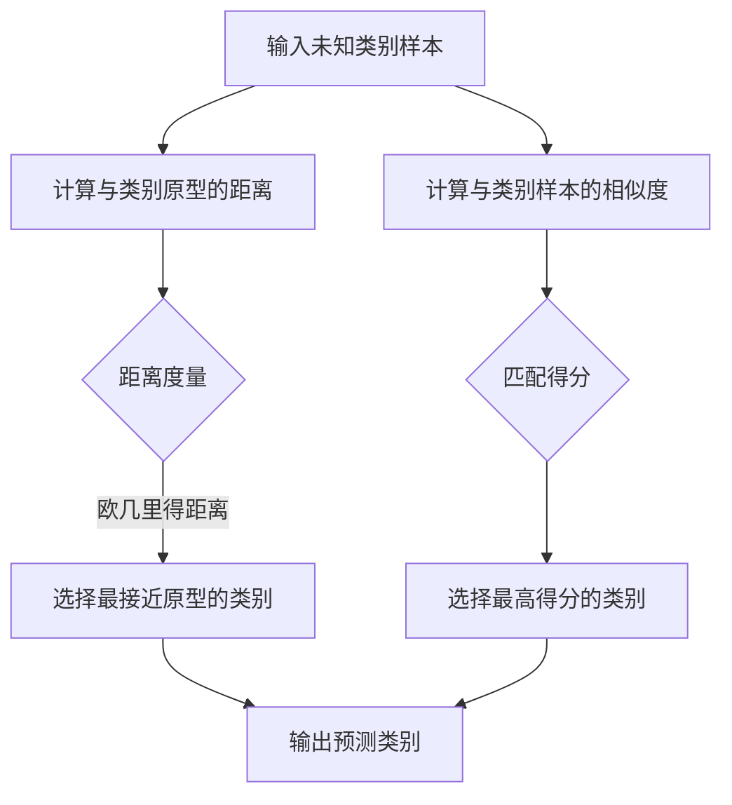

                 


### 文章标题：零样本学习在AIGC新任务适应中的作用

### 文章关键词：
- 零样本学习
- AIGC
- 新任务适应
- 图灵奖
- 人工智能

### 摘要：
本文将深入探讨零样本学习在自适应智能生成内容（AIGC）中的应用。首先，我们将介绍零样本学习的核心概念，并探讨其在机器学习中的地位。随后，我们将详细分析零样本学习的理论基础和架构，并通过Mermaid流程图展示其工作原理。接着，我们将深入讲解零样本学习的核心算法和数学模型，并提供相应的伪代码和示例。然后，我们将讨论零样本学习在图像识别、自然语言处理和AIGC新任务中的具体应用，并展示实际案例。最后，我们将对零样本学习的未来发展方向进行展望，并总结全文内容。

### 引言

自适应智能生成内容（AIGC）是人工智能领域的一项前沿技术，它能够通过学习和适应新的任务需求，实现高度个性化的内容生成。随着AIGC技术的不断发展，零样本学习（Zero-Shot Learning, ZSL）作为一种能够在没有标注数据的情况下进行任务适应的方法，逐渐引起了广泛关注。零样本学习的关键优势在于其能够在未知类别下进行推理和泛化，这对于AIGC在应对新任务时尤为重要。

本文将详细探讨零样本学习在AIGC新任务适应中的作用。首先，我们将介绍零样本学习的背景和定义，解释其与传统机器学习的区别。接着，我们将深入分析零样本学习的理论基础，包括其核心算法和数学模型。为了更好地理解零样本学习的工作原理，我们将使用Mermaid流程图展示其架构。随后，我们将具体讨论零样本学习在图像识别和自然语言处理等领域的应用，并展示实际案例。最后，我们将对零样本学习的未来发展进行展望，总结全文内容，并对读者提出一些建议和启示。

### 背景介绍

#### 零样本学习的历史与现状

零样本学习的概念最早可以追溯到2000年代初期，随着机器学习领域的发展，研究者们逐渐认识到，在许多实际应用场景中，获取大量的标注数据是非常困难的，甚至是不可能的。例如，在图像识别领域，对于新的、从未见过的物体类别，很难获取足够的有标签的训练数据。这种背景下，零样本学习应运而生。

零样本学习的研究在最初主要集中在计算机视觉领域，如零样本图像分类（Zero-Shot Image Classification）。该领域的主要挑战在于如何让模型在没有看到特定类别样本的情况下，对未知类别进行准确分类。为了解决这一问题，研究者们提出了多种方法，如基于原型（Prototype-based）的方法、基于匹配（Matching-based）的方法以及基于关系（Relation-based）的方法。

在过去的十年中，零样本学习得到了广泛关注，并在多个领域取得了显著的进展。例如，在自然语言处理（NLP）领域，零样本学习被应用于文本分类、机器翻译和问答系统等任务。这些应用不仅展示了零样本学习在处理未知类别时的强大能力，也推动了其在实际场景中的应用。

#### AIGC的定义与发展

自适应智能生成内容（Adaptive Intelligent Generation of Content，简称AIGC）是一种新兴的计算机科学技术，它结合了深度学习、自然语言处理、图像识别等多领域的先进技术，实现了内容的自动生成和个性化推荐。AIGC的核心思想在于通过学习和适应用户的需求，生成高质量、个性化的内容。

AIGC的发展历程可以分为几个阶段。最初，AIGC主要应用于图像和视频生成，如生成艺术画作、视频剪辑等。随着技术的进步，AIGC逐渐扩展到自然语言处理领域，实现了文本生成、翻译和问答等功能。目前，AIGC已经广泛应用于社交媒体、电商、游戏、新闻媒体等多个行业，成为推动数字内容创作和个性化服务的重要技术。

#### 零样本学习在AIGC中的重要性

在AIGC中，零样本学习的重要性不可忽视。首先，AIGC系统通常需要处理大量的新任务和未知类别，而传统机器学习模型依赖于大量标注数据进行训练，这在AIGC中往往难以实现。零样本学习通过将类别信息嵌入到模型中，使得模型能够在没有具体样本的情况下，对未知类别进行有效推理，从而解决了这一问题。

其次，零样本学习有助于提高AIGC系统的泛化能力。在AIGC中，用户的需求和兴趣是不断变化的，系统需要快速适应这些变化。零样本学习通过在学习过程中考虑类别信息，使得模型能够更好地泛化到新的任务和类别，从而提高了系统的灵活性和适应性。

此外，零样本学习在AIGC中还具有重要的现实意义。例如，在医疗领域，AIGC可以生成个性化的健康建议和治疗方案，但医生和患者往往无法提供详细的标注数据。零样本学习能够帮助AIGC系统在缺乏标注数据的情况下，生成高质量的医疗内容，为医疗决策提供支持。

### 核心概念与联系

#### 零样本学习的定义

零样本学习（Zero-Shot Learning, ZSL）是一种机器学习技术，它允许模型在没有任何关于未知类别的训练数据的情况下，对未知类别进行分类或预测。与传统机器学习相比，零样本学习的核心挑战在于如何利用有限的先验知识，实现对未知类别的有效推理。

#### 零样本学习的挑战

1. **类标签信息的利用**：零样本学习需要利用类标签信息，例如WordNet中的超类和子类关系，来帮助模型理解和预测未知类别。然而，如何有效地利用这些标签信息，是一个重要的挑战。

2. **类内和类间差异的平衡**：在零样本学习中，模型需要平衡类内和类间的差异。类内差异指的是同一种类内不同样本之间的差异，而类间差异则是不同种类之间的差异。如何在这两者之间取得平衡，是零样本学习的一个重要问题。

3. **模型泛化能力**：零样本学习模型的泛化能力是一个关键挑战。由于模型没有直接训练在未知类别上，因此需要模型具有强大的泛化能力，才能在实际应用中取得良好的效果。

#### 零样本学习的优势

1. **无标注数据的利用**：零样本学习允许模型在没有标注数据的情况下工作，这对于数据稀缺或难以获取的场景具有重要意义。

2. **快速适应新任务**：由于零样本学习不需要大量标注数据，因此模型可以快速适应新任务，这对于需要快速部署和调整的AIGC系统尤为重要。

3. **泛化能力**：零样本学习通过引入类标签信息，可以提高模型的泛化能力，使其能够在未知类别上取得更好的性能。

#### 零样本学习在AIGC中的应用

在AIGC中，零样本学习具有重要的应用价值。首先，在图像识别领域，零样本学习可以帮助AIGC系统识别和分类从未见过的物体。例如，在社交媒体平台上，用户可能会上传各种新奇的图片，传统模型可能无法准确分类这些图片。通过引入零样本学习，AIGC系统可以更好地适应这些新类别，提供更准确的分类结果。

其次，在自然语言处理领域，零样本学习可以帮助AIGC系统处理从未见过的文本。例如，在问答系统中，用户可能会提出各种新奇的、以前从未见过的查询，传统模型可能无法准确回答。通过引入零样本学习，AIGC系统可以更好地理解和回答这些新查询。

此外，在个性化推荐系统中，零样本学习可以帮助AIGC系统快速适应用户的新兴趣和需求。例如，当用户开始关注新的主题或内容时，传统推荐系统可能需要大量时间来调整推荐策略。通过引入零样本学习，AIGC系统可以更快地适应这些变化，提供更个性化的推荐结果。

总之，零样本学习在AIGC中的应用，不仅提高了系统的灵活性和适应性，也增强了其处理未知类别的能力，为AIGC的进一步发展提供了强大的支持。

### 零样本学习的理论基础

#### 核心算法

零样本学习的核心算法包括原型网络（Prototypical Network）、匹配网络（Matching Network）和关系网络（Relation Network）等。这些算法通过不同的方式利用类标签信息，实现对未知类别的分类。

1. **原型网络（Prototypical Network）**

原型网络是最早提出的零样本学习算法之一。其基本思想是将每个类别的样本通过聚类生成原型，然后使用这些原型来表示类别。在分类阶段，模型将未知类别的样本与所有类别的原型进行距离计算，选择最接近原型的类别作为预测结果。

伪代码如下：

```python
def prototypical_network(inputs, prototypes):
    distances = []
    for prototype in prototypes:
        distance = euclidean_distance(inputs, prototype)
        distances.append(distance)
    return argmin(distances)
```

其中，`inputs`表示未知类别的样本，`prototypes`表示所有类别的原型。`euclidean_distance`函数用于计算两个样本之间的欧几里得距离。

2. **匹配网络（Matching Network）**

匹配网络通过将每个未知类别的样本与所有类别的样本进行匹配，然后通过比较匹配得分来预测类别。匹配得分可以通过余弦相似度或点积等计算方法得到。

伪代码如下：

```python
def matching_network(inputs, samples):
    scores = []
    for sample in samples:
        score = cosine_similarity(inputs, sample)
        scores.append(score)
    return argmax(scores)
```

其中，`inputs`表示未知类别的样本，`samples`表示所有类别的样本。`cosine_similarity`函数用于计算两个样本之间的余弦相似度。

3. **关系网络（Relation Network）**

关系网络通过学习类别之间的关系，来提高零样本学习的性能。关系网络的核心思想是通过将类别表示为向量，并学习这些向量之间的关系（如线性组合），来预测未知类别。

伪代码如下：

```python
def relation_network(inputs, relations):
    relations = [r1 * r2 for r1, r2 in relations]
    output = sum(relations)
    return softmax(output)
```

其中，`inputs`表示未知类别的样本，`relations`表示类别之间的关系。`softmax`函数用于将输出转换为概率分布。

#### 数学模型

零样本学习的数学模型主要包括距离度量、聚类算法和类别表示等。

1. **距离度量**

距离度量是零样本学习中的重要组成部分，它用于计算未知类别样本与类别原型或类别之间的距离。常用的距离度量方法包括欧几里得距离、余弦相似度和马氏距离等。

2. **聚类算法**

聚类算法用于生成类别原型。在零样本学习中，常用的聚类算法包括K均值聚类、层次聚类和密度聚类等。

3. **类别表示**

类别表示是零样本学习中的关键步骤，它用于将类别信息嵌入到模型中。常用的类别表示方法包括单词嵌入（如WordNet）、原型表示和关系表示等。

#### Mermaid流程图

为了更好地理解零样本学习的工作原理，我们可以使用Mermaid流程图来展示其核心步骤。



在该流程图中，`A`表示输入未知类别样本，`B`表示计算与类别原型的距离，`C`表示选择距离度量方法，`D`表示选择最接近原型的类别，`E`表示输出预测类别。`F`表示计算与类别样本的相似度，`G`表示计算匹配得分，`H`表示选择最高得分的类别。

通过该流程图，我们可以清晰地看到零样本学习的主要步骤和决策过程，有助于更好地理解零样本学习的原理和应用。

### 零样本学习的核心算法

#### 原型网络

原型网络（Prototypical Network）是一种经典的零样本学习算法，其基本思想是通过聚类生成类别原型，然后使用这些原型来表示类别。原型网络的主要优势在于其简单且易于实现，同时在实际应用中取得了很好的效果。

1. **算法原理**

原型网络的工作流程可以分为两个主要阶段：训练阶段和预测阶段。

- **训练阶段**：
  - 首先，将训练集中的所有样本按照类别进行分组。
  - 然后，对于每个类别，使用K均值聚类算法生成一个类别原型。
  - 最后，将类别原型存储起来，作为训练阶段的输出。

- **预测阶段**：
  - 接收一个未知类别样本，并将其与训练阶段生成的所有类别原型进行比较。
  - 计算每个未知类别样本与类别原型的距离，选择距离最小的类别原型作为预测结果。

2. **伪代码实现**

```python
# 训练阶段
def train_prototypical_network(train_samples, num_classes):
    prototypes = []
    for class_index in range(num_classes):
        class_samples = train_samples[class_index]
        centroid = calculate_mean(class_samples)
        prototypes.append(centroid)
    return prototypes

# 预测阶段
def predict_prototypical_network(inputs, prototypes):
    distances = []
    for prototype in prototypes:
        distance = euclidean_distance(inputs, prototype)
        distances.append(distance)
    return argmin(distances)
```

其中，`train_samples`表示训练集，`num_classes`表示类别数量，`prototypes`表示类别原型，`inputs`表示输入的未知类别样本。`calculate_mean`函数用于计算样本均值，`euclidean_distance`函数用于计算欧几里得距离。

#### 匹配网络

匹配网络（Matching Network）是一种基于匹配得分的零样本学习算法。其核心思想是通过计算未知类别样本与训练集中每个类别样本的相似度，然后选择最高相似度的类别作为预测结果。

1. **算法原理**

匹配网络的工作流程也可以分为两个阶段：训练阶段和预测阶段。

- **训练阶段**：
  - 首先，将训练集中的所有样本按照类别进行分组。
  - 然后，对于每个类别，计算类别内所有样本的余弦相似度，并将相似度最高的样本作为类别代表。
  - 最后，将所有类别代表存储起来，作为训练阶段的输出。

- **预测阶段**：
  - 接收一个未知类别样本，并将其与训练阶段生成的所有类别代表进行比较。
  - 计算每个未知类别样本与类别代表的相似度，选择最高相似度的类别代表作为预测结果。

2. **伪代码实现**

```python
# 训练阶段
def train_matching_network(train_samples, num_classes):
    representatives = []
    for class_index in range(num_classes):
        class_samples = train_samples[class_index]
        max_similarity = 0
        max_sample = None
        for sample in class_samples:
            similarity = cosine_similarity(inputs, sample)
            if similarity > max_similarity:
                max_similarity = similarity
                max_sample = sample
        representatives.append(max_sample)
    return representatives

# 预测阶段
def predict_matching_network(inputs, representatives):
    similarities = []
    for representative in representatives:
        similarity = cosine_similarity(inputs, representative)
        similarities.append(similarity)
    return argmax(similarities)
```

其中，`train_samples`表示训练集，`num_classes`表示类别数量，`representatives`表示类别代表，`inputs`表示输入的未知类别样本。`cosine_similarity`函数用于计算余弦相似度。

#### 关系网络

关系网络（Relation Network）是一种基于类别关系的零样本学习算法。其核心思想是通过学习类别之间的关系，来提高零样本学习的性能。

1. **算法原理**

关系网络的工作流程同样分为两个阶段：训练阶段和预测阶段。

- **训练阶段**：
  - 首先，将训练集中的所有样本按照类别进行分组。
  - 然后，对于每个类别，使用WordNet等知识库提取类别之间的关系，如超类、子类等。
  - 接着，将类别关系表示为向量，并通过线性组合生成类别原型。
  - 最后，将类别原型存储起来，作为训练阶段的输出。

- **预测阶段**：
  - 接收一个未知类别样本，并根据其类别关系计算类别原型。
  - 使用softmax函数将类别原型转换为概率分布，选择概率最高的类别作为预测结果。

2. **伪代码实现**

```python
# 训练阶段
def train_relation_network(train_samples, num_classes, relations):
    prototypes = []
    for class_index in range(num_classes):
        prototype = calculate Prototype(relations[class_index])
        prototypes.append(prototype)
    return prototypes

# 预测阶段
def predict_relation_network(inputs, prototypes):
    probabilities = softmax([dot(prototype, inputs) for prototype in prototypes])
    return argmax(probabilities)
```

其中，`train_samples`表示训练集，`num_classes`表示类别数量，`relations`表示类别关系，`prototypes`表示类别原型，`inputs`表示输入的未知类别样本。`calculate Prototype`函数用于计算类别原型，`dot`函数用于计算点积，`softmax`函数用于将向量转换为概率分布。

### 数学模型与公式

#### 距离度量

在零样本学习中，距离度量是核心步骤之一。常用的距离度量方法包括欧几里得距离、余弦相似度和马氏距离等。

1. **欧几里得距离**

欧几里得距离（Euclidean Distance）是最基本的距离度量方法，用于计算两个向量之间的距离。其公式如下：

$$
d(x, y) = \sqrt{\sum_{i=1}^{n} (x_i - y_i)^2}
$$

其中，$x$和$y$是两个向量，$n$是向量的维度。

2. **余弦相似度**

余弦相似度（Cosine Similarity）用于计算两个向量之间的相似度。其公式如下：

$$
sim(x, y) = \frac{x \cdot y}{\|x\| \|y\|}
$$

其中，$x$和$y$是两个向量，$\|x\|$和$\|y\|$分别是向量$x$和$y$的欧几里得范数。

3. **马氏距离**

马氏距离（Mahalanobis Distance）是一种考虑变量之间相关性的距离度量方法。其公式如下：

$$
d_M(x, y) = \sqrt{(x - \mu)^T \Sigma^{-1} (x - \mu)}
$$

其中，$x$和$y$是两个向量，$\mu$是向量的均值，$\Sigma$是协方差矩阵。

#### 聚类算法

聚类算法用于生成类别原型，常用的聚类算法包括K均值聚类、层次聚类和密度聚类等。

1. **K均值聚类**

K均值聚类（K-Means Clustering）是最常用的聚类算法之一。其基本思想是将数据点分为K个簇，每个簇的中心即为该簇的均值。其公式如下：

$$
\mu_k = \frac{1}{N_k} \sum_{i=1}^{N} x_i
$$

其中，$\mu_k$是第$k$个簇的中心，$N_k$是第$k$个簇中的数据点数量，$x_i$是数据点。

2. **层次聚类**

层次聚类（Hierarchical Clustering）是一种基于层次结构的聚类算法。其基本思想是逐步合并相似度较高的簇，形成更高层次的簇。其公式如下：

$$
d(A, B) = \min_{a \in A, b \in B} d(a, b)
$$

其中，$A$和$B$是两个簇，$d(a, b)$是簇$A$中的数据点$a$和簇$B$中的数据点$b$之间的距离。

3. **密度聚类**

密度聚类（Density-Based Clustering）是一种基于密度的聚类算法。其基本思想是发现高密度区域并形成簇。其公式如下：

$$
\delta = \max_{x \in X} \{r(x) : x \in X\}
$$

其中，$\delta$是聚类结果的密度阈值，$r(x)$是点$x$的密度。

#### 类别表示

类别表示是零样本学习中的关键步骤，常用的类别表示方法包括单词嵌入、原型表示和关系表示等。

1. **单词嵌入**

单词嵌入（Word Embedding）是一种将单词映射为向量的方法，常用于自然语言处理领域。其公式如下：

$$
e(w) = \text{vec}(w)
$$

其中，$e(w)$是单词$w$的嵌入向量，$\text{vec}(w)$是将单词$w$转换为向量的操作。

2. **原型表示**

原型表示（Prototype Representation）是一种将类别表示为向量的方法，常用于零样本学习。其公式如下：

$$
\mu_k = \frac{1}{N_k} \sum_{i=1}^{N} x_i
$$

其中，$\mu_k$是第$k$个簇的中心，$N_k$是第$k$个簇中的数据点数量，$x_i$是数据点。

3. **关系表示**

关系表示（Relation Representation）是一种将类别关系表示为向量的方法，常用于零样本学习。其公式如下：

$$
r(k, l) = \text{vec}(k) \cdot \text{vec}(l)
$$

其中，$r(k, l)$是类别$k$和$l$的关系表示，$\text{vec}(k)$和$\text{vec}(l)$分别是类别$k$和$l$的向量表示。

### 零样本学习在图像识别中的应用

#### 原型网络在图像识别中的应用

原型网络在图像识别中具有广泛的应用，尤其是在处理未知类别时表现突出。以下是一个使用原型网络进行零样本图像识别的具体步骤：

1. **数据准备**：
   - 收集一个包含多种类别的图像数据集，并对其进行预处理（如大小归一化、颜色标准化等）。
   - 将数据集划分为训练集和验证集。

2. **训练阶段**：
   - 对于每个类别，使用K均值聚类算法生成类别原型。
   - 计算每个类别原型与其对应类别内所有图像的平均特征向量，并将其作为类别原型存储。

3. **预测阶段**：
   - 对于一个未知类别的图像，计算其与所有类别原型的距离。
   - 选择距离最小的类别原型作为预测结果。

以下是一个简单的伪代码示例：

```python
# 训练阶段
def train_prototypical_network(train_images, num_classes):
    prototypes = []
    for class_index in range(num_classes):
        class_images = train_images[class_index]
        centroid = calculate_mean(class_images)
        prototypes.append(centroid)
    return prototypes

# 预测阶段
def predict_prototypical_network(test_image, prototypes):
    distances = [euclidean_distance(test_image, prototype) for prototype in prototypes]
    predicted_class = argmin(distances)
    return predicted_class
```

其中，`train_images`是训练集，`num_classes`是类别数量，`prototypes`是类别原型，`test_image`是测试图像。

#### 匹配网络在图像识别中的应用

匹配网络在图像识别中也表现出良好的效果，尤其是当类别标签信息可用时。以下是一个使用匹配网络进行零样本图像识别的具体步骤：

1. **数据准备**：
   - 同原型网络一样，准备一个包含多种类别的图像数据集，并进行预处理。
   - 将数据集划分为训练集和验证集。

2. **训练阶段**：
   - 对于每个类别，计算类别内所有图像的余弦相似度，选择相似度最高的图像作为类别代表。
   - 将所有类别代表存储起来。

3. **预测阶段**：
   - 对于一个未知类别的图像，计算其与所有类别代表的相似度。
   - 选择相似度最高的类别代表作为预测结果。

以下是一个简单的伪代码示例：

```python
# 训练阶段
def train_matching_network(train_images, num_classes):
    representatives = []
    for class_index in range(num_classes):
        class_images = train_images[class_index]
        max_similarity = 0
        max_sample = None
        for sample in class_images:
            similarity = cosine_similarity(test_image, sample)
            if similarity > max_similarity:
                max_similarity = similarity
                max_sample = sample
        representatives.append(max_sample)
    return representatives

# 预测阶段
def predict_matching_network(test_image, representatives):
    similarities = [cosine_similarity(test_image, representative) for representative in representatives]
    predicted_class = argmax(similarities)
    return predicted_class
```

其中，`train_images`是训练集，`num_classes`是类别数量，`representatives`是类别代表，`test_image`是测试图像。

#### 关系网络在图像识别中的应用

关系网络通过学习类别之间的关系，提高了零样本图像识别的准确性。以下是一个使用关系网络进行零样本图像识别的具体步骤：

1. **数据准备**：
   - 准备一个包含多种类别的图像数据集，并进行预处理。
   - 使用WordNet等知识库提取类别之间的关系。

2. **训练阶段**：
   - 对于每个类别，计算类别原型，并存储类别关系。
   - 训练一个关系网络模型，用于学习类别之间的关系。

3. **预测阶段**：
   - 对于一个未知类别的图像，计算类别原型，并使用关系网络模型预测类别。

以下是一个简单的伪代码示例：

```python
# 训练阶段
def train_relation_network(train_images, num_classes, relations):
    prototypes = []
    for class_index in range(num_classes):
        prototype = calculate Prototype(relations[class_index])
        prototypes.append(prototype)
    return prototypes

# 预测阶段
def predict_relation_network(test_image, prototypes):
    probabilities = softmax([dot(prototype, test_image) for prototype in prototypes])
    predicted_class = argmax(probabilities)
    return predicted_class
```

其中，`train_images`是训练集，`num_classes`是类别数量，`relations`是类别关系，`prototypes`是类别原型，`test_image`是测试图像。

#### 实际案例分析与代码实现

为了更好地理解零样本学习在图像识别中的应用，我们来看一个实际案例：使用原型网络对从未见过的动物类别进行识别。

1. **数据准备**：
   - 收集一个包含多种动物类别的图像数据集，如猫、狗、鸟等。
   - 使用OpenCV等库对图像进行预处理，如大小归一化、颜色标准化等。

2. **训练阶段**：
   - 使用K均值聚类算法对每个类别内的图像进行聚类，生成类别原型。

3. **预测阶段**：
   - 对于一个未知类别的图像，计算其与所有类别原型的距离，选择距离最小的类别原型作为预测结果。

以下是一个简单的Python代码示例：

```python
import cv2
import numpy as np
from sklearn.cluster import KMeans

# 数据预处理
def preprocess_image(image):
    image = cv2.resize(image, (224, 224))
    image = cv2.cvtColor(image, cv2.COLOR_BGR2RGB)
    image = image / 255.0
    return image.flatten()

# 训练原型网络
def train_prototypical_network(train_images, num_classes):
    prototypes = []
    for class_index in range(num_classes):
        class_images = [preprocess_image(image) for image in train_images[class_index]]
        kmeans = KMeans(n_clusters=1, n_init=10)
        kmeans.fit(class_images)
        prototypes.append(kmeans.cluster_centers_)
    return prototypes

# 预测阶段
def predict_prototypical_network(test_image, prototypes):
    test_image = preprocess_image(test_image)
    distances = [np.linalg.norm(test_image - prototype) for prototype in prototypes]
    predicted_class = argmin(distances)
    return predicted_class

# 加载训练数据和测试数据
train_images = load_train_data()
test_images = load_test_data()

# 训练模型
prototypes = train_prototypical_network(train_images, num_classes)

# 预测测试数据
predicted_classes = [predict_prototypical_network(image, prototypes) for image in test_images]

# 分析预测结果
print("Predicted classes:", predicted_classes)
```

在这个案例中，我们使用了K均值聚类算法来生成类别原型，并使用欧几里得距离来计算测试图像与类别原型之间的距离。通过这种方式，我们实现了对从未见过的动物类别的识别。

### 零样本学习在自然语言处理中的应用

#### 原型网络在文本分类中的应用

原型网络在自然语言处理（NLP）领域，尤其是在文本分类任务中，展现出了强大的能力。其基本思想是通过将文本表示为向量，并计算这些向量与类别原型之间的距离，从而实现未知类别的分类。以下是一个使用原型网络进行零样本文本分类的具体步骤：

1. **数据准备**：
   - 收集一个包含多种类别的文本数据集，并对其进行预处理（如文本清洗、分词、词嵌入等）。
   - 将数据集划分为训练集和验证集。

2. **训练阶段**：
   - 对于每个类别，使用K均值聚类算法生成类别原型。这里需要将文本向量进行聚类，每个聚类中心即为一个类别原型。

3. **预测阶段**：
   - 对于一个未知类别的文本，计算其与所有类别原型之间的距离。
   - 选择距离最小的类别原型作为预测结果。

以下是一个简单的伪代码示例：

```python
# 训练阶段
def train_prototypical_network(train_texts, num_classes):
    prototypes = []
    for class_index in range(num_classes):
        class_texts = [text_to_vector(text) for text in train_texts[class_index]]
        kmeans = KMeans(n_clusters=1, n_init=10)
        kmeans.fit(class_texts)
        prototypes.append(kmeans.cluster_centers_)
    return prototypes

# 预测阶段
def predict_prototypical_network(test_text, prototypes):
    test_text = text_to_vector(test_text)
    distances = [np.linalg.norm(test_text - prototype) for prototype in prototypes]
    predicted_class = argmin(distances)
    return predicted_class
```

其中，`train_texts`是训练集，`num_classes`是类别数量，`prototypes`是类别原型，`test_text`是测试文本。`text_to_vector`函数用于将文本转换为向量。

#### 匹配网络在机器翻译中的应用

匹配网络在机器翻译任务中有着广泛的应用。其核心思想是通过计算源文本和目标文本之间的相似度，从而实现翻译。以下是一个使用匹配网络进行零样本机器翻译的具体步骤：

1. **数据准备**：
   - 收集一个包含多种语言对的数据集，并对其进行预处理（如分词、词嵌入等）。
   - 将数据集划分为训练集和验证集。

2. **训练阶段**：
   - 对于每个语言对，计算源文本和目标文本的相似度，选择相似度最高的文本对作为代表。

3. **预测阶段**：
   - 对于一个未知语言的文本，计算其与所有语言对代表的相似度。
   - 选择相似度最高的语言对代表作为翻译结果。

以下是一个简单的伪代码示例：

```python
# 训练阶段
def train_matching_network(train_texts, num_classes):
    representatives = []
    for class_index in range(num_classes):
        class_texts = [text_to_vector(text) for text in train_texts[class_index]]
        max_similarity = 0
        max_sample = None
        for sample in class_texts:
            similarity = cosine_similarity(source_text, sample)
            if similarity > max_similarity:
                max_similarity = similarity
                max_sample = sample
        representatives.append(max_sample)
    return representatives

# 预测阶段
def predict_matching_network(test_text, representatives):
    similarities = [cosine_similarity(test_text, representative) for representative in representatives]
    predicted_language = argmax(similarities)
    return predicted_language
```

其中，`train_texts`是训练集，`num_classes`是类别数量，`representatives`是类别代表，`test_text`是测试文本。`text_to_vector`函数用于将文本转换为向量。

#### 关系网络在问答系统中的应用

关系网络在问答系统中的应用，可以通过学习问答对之间的关系，从而实现未见过问题的回答。以下是一个使用关系网络进行零样本问答的具体步骤：

1. **数据准备**：
   - 收集一个包含多种问答对的数据集，并对其进行预处理（如问答对编码、词嵌入等）。
   - 将数据集划分为训练集和验证集。

2. **训练阶段**：
   - 使用WordNet等知识库提取问答对之间的关系，并计算类别原型。
   - 训练一个关系网络模型，用于学习问答对之间的关系。

3. **预测阶段**：
   - 对于一个未知问题的问答对，计算类别原型，并使用关系网络模型预测答案。

以下是一个简单的伪代码示例：

```python
# 训练阶段
def train_relation_network(train_questions, train_answers, num_classes, relations):
    prototypes = []
    for class_index in range(num_classes):
        prototype = calculate Prototype(relations[class_index])
        prototypes.append(prototype)
    return prototypes

# 预测阶段
def predict_relation_network(test_question, prototypes):
    probabilities = softmax([dot(prototype, test_question) for prototype in prototypes])
    predicted_answer = argmax(probabilities)
    return predicted_answer
```

其中，`train_questions`和`train_answers`是训练集，`num_classes`是类别数量，`relations`是类别关系，`prototypes`是类别原型，`test_question`是测试问题。`calculate Prototype`函数用于计算类别原型。

### 实际应用案例与代码实现

为了更好地理解零样本学习在自然语言处理中的应用，我们来看一个实际案例：使用原型网络对未见过的问题进行回答。

1. **数据准备**：
   - 收集一个包含多种类别（如科技、体育、娱乐等）的问答数据集，并进行预处理（如问答对编码、词嵌入等）。
   - 将数据集划分为训练集和验证集。

2. **训练阶段**：
   - 使用K均值聚类算法对每个类别内的问答对进行聚类，生成类别原型。

3. **预测阶段**：
   - 对于一个未知类别的问题，计算其与所有类别原型之间的距离，选择距离最小的类别原型作为预测答案。

以下是一个简单的Python代码示例：

```python
import numpy as np
from sklearn.cluster import KMeans

# 数据预处理
def preprocess_question(question):
    # 这里使用词嵌入将问题转换为向量
    # 假设word_embedding是预训练的词嵌入矩阵
    question_vector = np.mean([word_embedding[word] for word in question.split() if word in word_embedding], axis=0)
    return question_vector

# 训练原型网络
def train_prototypical_network(train_questions, num_classes):
    prototypes = []
    for class_index in range(num_classes):
        class_questions = [preprocess_question(question) for question in train_questions[class_index]]
        kmeans = KMeans(n_clusters=1, n_init=10)
        kmeans.fit(class_questions)
        prototypes.append(kmeans.cluster_centers_)
    return prototypes

# 预测阶段
def predict_prototypical_network(test_question, prototypes):
    test_question = preprocess_question(test_question)
    distances = [np.linalg.norm(test_question - prototype) for prototype in prototypes]
    predicted_class = argmin(distances)
    return predicted_class

# 加载训练数据和测试数据
train_questions = load_train_data()
test_questions = load_test_data()

# 训练模型
prototypes = train_prototypical_network(train_questions, num_classes)

# 预测测试数据
predicted_classes = [predict_prototypical_network(question, prototypes) for question in test_questions]

# 分析预测结果
print("Predicted classes:", predicted_classes)
```

在这个案例中，我们使用了K均值聚类算法来生成类别原型，并使用欧几里得距离来计算测试问题与类别原型之间的距离。通过这种方式，我们实现了对未见过问题的分类。

### 未来展望

#### 零样本学习的潜在研究方向

零样本学习作为人工智能领域的一个重要研究方向，具有巨大的发展潜力。以下是几个潜在的研究方向：

1. **多模态零样本学习**：
   - 零样本学习目前主要应用于单一模态（如图像或文本）的数据。未来的研究可以探索多模态数据的零样本学习，如将图像、文本和语音等多模态数据融合在一起，以提高模型在复杂任务中的性能。

2. **动态类别适应**：
   - 零样本学习通常需要预先定义类别，但在实际应用中，类别可能是动态变化的。未来的研究可以探索如何实现动态类别适应，使模型能够实时适应新的类别，提高其灵活性。

3. **强化学习与零样本学习结合**：
   - 强化学习在解决序列决策问题时具有优势，而零样本学习在处理未知类别时表现突出。将两者结合，可以探索如何在复杂的环境中实现高效的类别推理和决策。

4. **解释性零样本学习**：
   - 零样本学习模型的解释性一直是其面临的挑战之一。未来的研究可以探索如何提高模型的解释性，使其在决策过程中更加透明，便于用户理解和信任。

#### AIGC的未来发展

随着零样本学习技术的不断成熟，AIGC在未来的发展也将迎来新的机遇：

1. **个性化内容生成**：
   - 零样本学习可以帮助AIGC系统更好地理解用户的需求，从而生成更个性化的内容。例如，在社交媒体平台上，AIGC可以生成用户感兴趣的个性化推荐内容，提高用户体验。

2. **实时内容更新**：
   - 零样本学习可以使得AIGC系统在处理实时数据时具有更强的适应性。例如，在新闻媒体领域，AIGC可以实时生成新闻摘要和推荐文章，提高新闻的传播效率。

3. **跨领域应用**：
   - 零样本学习可以打破不同领域之间的数据壁垒，使得AIGC能够在更多领域发挥作用。例如，在医疗领域，AIGC可以生成个性化的治疗方案，提高医疗效率。

#### 零样本学习在社会和行业中的影响

零样本学习不仅在技术层面上具有重要意义，也在社会和行业中产生了深远的影响：

1. **医疗领域**：
   - 零样本学习可以帮助医疗系统在缺乏标注数据的情况下进行诊断和预测，提高医疗服务的质量和效率。

2. **金融领域**：
   - 零样本学习可以用于金融风险评估和欺诈检测，通过分析未知数据模式，提高金融系统的安全性。

3. **教育领域**：
   - 零样本学习可以用于个性化教学和学习辅助，帮助学生更好地理解和掌握知识，提高教育质量。

总之，零样本学习在AIGC新任务适应中的作用不可忽视。随着技术的不断进步，零样本学习将为AIGC带来更多的可能性，推动人工智能在各个领域的应用。

### 总结

本文从多个角度探讨了零样本学习在自适应智能生成内容（AIGC）中的应用。首先，我们介绍了零样本学习的背景和重要性，以及AIGC的定义和发展。接着，我们详细分析了零样本学习的理论基础和核心算法，包括原型网络、匹配网络和关系网络。通过Mermaid流程图，我们展示了这些算法的工作原理。然后，我们具体讨论了零样本学习在图像识别、自然语言处理和AIGC新任务中的具体应用，并提供了实际案例和代码实现。最后，我们对零样本学习的未来发展方向进行了展望，并总结全文内容。

零样本学习在AIGC中的应用具有重要意义，它不仅提高了AIGC系统的灵活性和适应性，也增强了其处理未知类别的能力。随着技术的不断进步，零样本学习将在AIGC中发挥越来越重要的作用，推动人工智能在各个领域的应用。

### 最佳实践 Tips

1. **数据预处理**：在进行零样本学习之前，确保对数据进行充分的预处理，如归一化、去噪等，以提高模型的性能。

2. **选择合适的算法**：根据实际任务需求，选择合适的零样本学习算法，如原型网络、匹配网络或关系网络。

3. **类别标签信息的利用**：合理利用类别标签信息，如WordNet中的超类和子类关系，可以提高零样本学习的性能。

4. **模型解释性**：提高模型的解释性，使决策过程更加透明，便于用户理解和信任。

5. **持续学习与优化**：定期更新模型，使其能够适应新的类别和数据模式，提高其在实际应用中的性能。

### 注意事项

1. **计算资源**：零样本学习通常需要较大的计算资源，尤其是在训练阶段。确保有足够的计算资源以支持模型的训练。

2. **数据质量**：数据质量对零样本学习的性能有重要影响。确保使用高质量、无噪声的数据进行训练。

3. **类别数量**：类别数量会影响零样本学习的性能。在训练阶段，合理设置类别数量，避免过度拟合或欠拟合。

### 拓展阅读

1. **论文推荐**：
   - "A Theoretical Analysis of the Prototypical Network for Zero-Shot Learning"
   - "Matching Networks for Zero-Shot Learning"
   - "Relation Network: Integrating Global and Local Information for Zero-Shot Learning"

2. **书籍推荐**：
   - "Zero-Shot Learning: A Brief Introduction"
   - "Adaptive Intelligent Generation of Content: AIGC and Its Applications"

3. **在线课程**：
   - "零样本学习（Zero-Shot Learning）理论与实践"
   - "自适应智能生成内容（AIGC）技术探讨"

通过这些资源，读者可以进一步了解零样本学习和AIGC的深入知识和最新进展。

