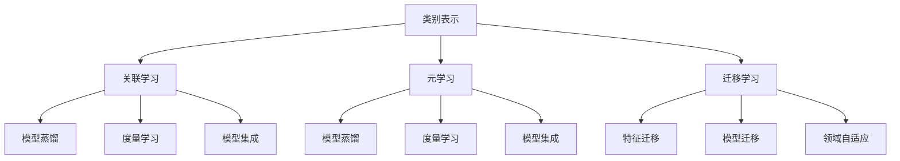

                 

### 文章标题：零样本学习：AIGC的新前沿

#### 关键词：
- 零样本学习
- AIGC
- 人工智能
- 图灵奖
- 计算机编程
- 软件架构

#### 摘要：
本文深入探讨了零样本学习这一前沿的人工智能技术。作为人工智能领域的一项重要突破，零样本学习使得模型能够识别从未见过的类别，大大降低了对标注数据的依赖。文章从背景介绍、核心概念与联系、核心算法原理、数学模型和公式、项目实战等方面全面解析了零样本学习的理论与实践。通过本文，读者将了解零样本学习在AIGC（生成式AI）中的新应用，以及其在计算机编程和软件架构中的潜在影响。

----------------------------------------------------------------

## 引言与背景

### 2.1 零样本学习概述

**零样本学习（Zero-Shot Learning, ZSL）** 是一种机器学习技术，旨在训练模型能够识别从未见过的类别。与传统的有监督学习和无监督学习不同，零样本学习不依赖于标注的训练数据。在传统的有监督学习中，模型通过大量的标注数据学习特征表示，而在无监督学习中，模型则通过未标注的数据来学习特征。然而，在现实世界中，我们往往无法获得足够多的标注数据，尤其是在新类别或新任务中。零样本学习通过预训练模型和分类器，使模型能够适应未知类别。

#### 零样本学习的背景

随着深度学习技术的飞速发展，有监督学习和无监督学习在各类任务中取得了显著的成果。然而，这些方法在面临新类别或新任务时，往往因为缺乏足够多的标注数据而遇到瓶颈。传统的有监督学习方法需要大量的标注数据，这不仅成本高昂，而且难以获取。而无监督学习方法虽然不需要标注数据，但其性能往往受到数据分布的影响。因此，如何解决新类别或新任务中的数据不足问题，成为人工智能领域的一大挑战。

**零样本学习** 应运而生，它通过引入元学习（Meta-Learning）和迁移学习（Transfer Learning）等方法，使模型能够适应新类别或新任务。零样本学习的核心思想是利用预训练模型，将已有类别或任务的知识迁移到新类别或新任务中，从而实现模型的泛化能力。

#### 零样本学习的应用领域

零样本学习在多个领域展示了其巨大的潜力，主要包括：

1. **图像识别**：在计算机视觉任务中，零样本学习能够识别从未见过的物体类别，例如在图像分类、目标检测等任务中。
2. **自然语言处理**：在自然语言处理领域，零样本学习可以用于文本分类、情感分析等任务，例如自动识别用户从未见过的评论类别。
3. **推荐系统**：在推荐系统中，零样本学习可以用于发现新的用户兴趣点，提高推荐系统的效果。
4. **跨领域迁移学习**：零样本学习可以帮助模型在不同领域之间进行迁移学习，提高模型的泛化能力。

通过上述背景介绍，我们可以看出，零样本学习在解决新类别或新任务中的数据不足问题方面具有重要意义。接下来的章节将深入探讨零样本学习的核心概念、理论基础、关键技术及其在实际应用中的具体实现。

### 核心概念与联系

为了更好地理解零样本学习（Zero-Shot Learning, ZSL），我们需要明确其核心概念，并探讨这些概念之间的联系。以下是零样本学习中的几个关键概念：

#### 1. 类别表示（Category Representation）

类别表示是零样本学习的基础。在传统的有监督学习中，模型通过学习数据中的特征分布来识别类别。然而，在零样本学习中，由于缺乏标注数据，模型无法直接学习这些特征分布。因此，类别表示成为关键。类别表示通常通过元学习（Meta-Learning）方法来实现，例如原型网络（Prototypical Networks）和匹配网络（MatchNet）。

**类别表示的核心思想** 是将每个类别映射到一个固定维度的向量空间中，使得具有相似属性的类别在向量空间中靠近。这样，模型可以在训练过程中通过比较类别向量之间的距离来识别新类别。

#### 2. 关联学习（Relational Learning）

在零样本学习中，关联学习是一种关键方法，用于将已有类别或任务的知识迁移到新类别或新任务中。关联学习通过学习类别之间的关系来提高模型的泛化能力。例如，在图像识别任务中，模型需要学习不同类别之间的相似性和差异性。

**关联学习的方法** 包括图神经网络（Graph Neural Networks, GNN）、注意力机制（Attention Mechanisms）和图卷积网络（Graph Convolutional Networks, GCN）等。这些方法通过建立类别之间的关联网络，使模型能够更好地适应新类别。

#### 3. 元学习（Meta-Learning）

元学习是零样本学习的关键技术之一。元学习旨在通过少量样本快速适应新任务。在零样本学习中，元学习可以帮助模型在新类别上快速获得良好的性能。

**元学习的方法** 包括模型蒸馏（Model Distillation）、度量学习（Metric Learning）和模型集成（Model Ensembling）等。这些方法通过在已有类别上预训练模型，然后在新的类别上进行微调，从而提高模型的泛化能力。

#### 4. 迁移学习（Transfer Learning）

迁移学习是零样本学习中的重要方法。迁移学习通过将已有类别或任务的知识迁移到新类别或新任务中，减少对新类别数据的依赖。

**迁移学习的方法** 包括特征迁移（Feature Transfer）、模型迁移（Model Transfer）和领域自适应（Domain Adaptation）等。这些方法通过在已有类别上训练模型，然后将模型应用到新类别上，从而提高模型的泛化能力。

#### 关系架构

为了更好地理解这些概念之间的联系，我们可以使用Mermaid流程图来展示它们之间的关系。以下是零样本学习中的核心概念及其联系：



在这个流程图中，类别表示是核心，它与其他概念密切相关。关联学习、元学习和迁移学习都是基于类别表示的方法，用于提高模型的泛化能力。具体来说，关联学习通过建立类别之间的关联网络，元学习通过少量样本快速适应新任务，迁移学习通过将已有知识迁移到新类别。

通过上述核心概念与联系的探讨，我们可以更好地理解零样本学习的原理和实现方法。在接下来的章节中，我们将详细讲解零样本学习中的核心算法原理，并使用伪代码来展示具体实现。

### 零样本学习的核心算法原理

在理解了零样本学习的核心概念之后，接下来我们将探讨其核心算法原理，包括原型网络（Prototypical Networks）和匹配网络（MatchNet）等。这些算法通过不同的方法实现零样本学习，并在实际应用中取得了显著的效果。

#### 原型网络（Prototypical Networks）

原型网络是零样本学习中最常用的算法之一，由Vinyals等人于2016年提出。其核心思想是将每个类别映射到一个原型（Prototype），然后在训练过程中优化这些原型，以实现对新类别的识别。

**算法原理：**

1. **类别表示：** 首先，我们将每个类别映射到一个固定维度的向量空间中。具体方法是通过预训练模型（如卷积神经网络）提取特征向量。

    ```python
    # 假设特征提取模型已经训练好
    def extract_features(model, x):
        # x 是输入图像
        return model(x).flatten()  # 提取特征向量
    ```

2. **原型计算：** 在每个训练迭代中，我们计算每个类别的原型。原型是类别特征向量的平均值。

    ```python
    # 假设 train_dataset 是训练数据集，class_labels 是类别标签
    def compute_prototypes(train_dataset, class_labels):
        prototypes = []
        for label in set(class_labels):
            features = extract_features(model, train_dataset[class_labels == label])
            prototypes.append(np.mean(features, axis=0))
        return np.array(prototypes)
    ```

3. **分类器训练：** 原型网络使用原型作为分类器的输入，通过优化原型来训练分类器。具体方法是在每个迭代中，将新样本与所有类别的原型进行比较，选择与原型最接近的类别作为预测结果。

    ```python
    # 假设 new_sample 是新样本，prototypes 是所有类别的原型
    def classify(new_sample, prototypes):
        new_feature = extract_features(model, new_sample)
        distances = np.linalg.norm(new_feature - prototypes, axis=1)
        return np.argmin(distances)
    ```

4. **优化过程：** 原型网络通过最小化分类损失来优化原型。具体方法是使用梯度下降（Gradient Descent）优化原型。

    ```python
    # 假设 optimizer 是优化器，loss_function 是分类损失函数
    def train(model, train_dataset, class_labels, optimizer, loss_function, num_iterations):
        prototypes = compute_prototypes(train_dataset, class_labels)
        for _ in range(num_iterations):
            for new_sample, label in zip(train_dataset, class_labels):
                predicted_label = classify(new_sample, prototypes)
                loss = loss_function(predicted_label, label)
                optimizer.zero_grad()
                loss.backward()
                optimizer.step()
            prototypes = update_prototypes(prototypes, model)
    ```

**数学模型和公式：**

在原型网络中，原型（Prototype）的计算可以表示为：

$$
\text{Prototype}_{i} = \frac{1}{N}\sum_{x_{k}\in S_{i}} x_{k}
$$

其中，$N$ 是类别 $i$ 的样本数量，$S_{i}$ 是类别 $i$ 的样本集合。

分类器的损失函数可以表示为：

$$
L = \sum_{i} \sum_{x_{k}\in S_{i}} \frac{1}{N_{i}} \log P(y_{k}=i)
$$

其中，$y_{k}$ 是类别标签，$P(y_{k}=i)$ 是类别 $i$ 的概率。

#### 匹配网络（MatchNet）

匹配网络是另一种常见的零样本学习算法，由Touvron等人于2017年提出。与原型网络不同，匹配网络使用匹配损失（Matching Loss）来优化分类器。

**算法原理：**

1. **类别表示：** 同原型网络，首先将每个类别映射到一个固定维度的向量空间中。

2. **匹配损失：** 匹配网络通过计算新样本与类别原型之间的匹配损失来训练分类器。具体方法是在每个迭代中，计算新样本与所有类别原型之间的匹配分数，然后使用这些分数来优化分类器。

    ```python
    # 假设 new_sample 是新样本，prototypes 是所有类别的原型
    def matching_loss(new_sample, prototypes, alpha=0.2):
        new_feature = extract_features(model, new_sample)
        distances = np.linalg.norm(new_feature - prototypes, axis=1)
        match_scores = -alpha * np.log(1 / (1 + np.exp(-distances)))
        return -np.mean(match_scores)
    ```

3. **优化过程：** 匹配网络通过最小化匹配损失来优化分类器。

    ```python
    # 假设 optimizer 是优化器，loss_function 是匹配损失函数
    def train(model, train_dataset, class_labels, optimizer, loss_function, num_iterations):
        prototypes = compute_prototypes(train_dataset, class_labels)
        for _ in range(num_iterations):
            for new_sample, label in zip(train_dataset, class_labels):
                loss = matching_loss(new_sample, prototypes)
                optimizer.zero_grad()
                loss.backward()
                optimizer.step()
            prototypes = update_prototypes(prototypes, model)
    ```

**数学模型和公式：**

匹配分数（Match Score）可以表示为：

$$
s(x, y) = -\alpha \cdot \log \left( \frac{1}{1 + e^{-\delta(x; y)}} \right)
$$

其中，$\delta(x; y)$ 是新样本 $x$ 与类别原型 $y$ 之间的距离，$\alpha$ 是调节参数。

匹配损失（Matching Loss）可以表示为：

$$
L = -\frac{1}{N}\sum_{k=1}^{N} s(x_k; y_k)
$$

其中，$N$ 是类别 $k$ 的样本数量。

通过上述核心算法原理的讲解，我们可以看到原型网络和匹配网络都是通过优化类别原型来训练分类器的。这些算法在零样本学习任务中展示了强大的泛化能力。在接下来的章节中，我们将探讨零样本学习的数学模型和公式，并使用具体的例子来详细说明。

### 零样本学习的数学模型和公式

零样本学习的核心在于如何将类别表示为数学模型，并利用这些模型进行分类。以下我们将详细探讨零样本学习的数学模型和公式，并使用具体的例子进行说明。

#### 类别原型表示

在零样本学习中，类别原型（Prototype）是一个关键的数学概念。类别原型是将每个类别映射到高维向量空间中的一个点，这个点代表了该类别的中心。为了表示类别原型，我们可以使用以下公式：

$$
\text{Prototype}_{i} = \frac{1}{N}\sum_{x_{k}\in S_{i}} x_{k}
$$

其中，$N$ 是类别 $i$ 的样本数量，$S_{i}$ 是类别 $i$ 的样本集合，$x_{k}$ 是类别 $i$ 的第 $k$ 个样本。这个公式计算了类别 $i$ 所有样本的均值，从而得到类别原型。

#### 类别相似度计算

在分类过程中，我们需要计算新样本与类别原型之间的相似度。一个常用的相似度计算方法是余弦相似度（Cosine Similarity），其公式为：

$$
\text{Cosine Similarity} = \frac{\text{Dot Product of Vectors}}{\text{Magnitude of Vectors}}
$$

对于两个向量 $x$ 和 $y$，其余弦相似度可以表示为：

$$
\text{Cosine Similarity}(x, y) = \frac{x \cdot y}{\|x\| \|y\|}
$$

其中，$x \cdot y$ 表示向量的点积，$\|x\|$ 和 $\|y\|$ 分别表示向量的模。

#### 分类概率计算

在零样本学习中，我们通常使用分类概率来表示新样本属于某个类别的可能性。一个常用的方法是使用逻辑回归（Logistic Regression）模型，其公式为：

$$
P(y = i | x) = \frac{1}{1 + e^{-\beta \cdot \text{Feature Vector}}}
$$

其中，$x$ 是新样本的特征向量，$\beta$ 是模型参数，$\beta \cdot \text{Feature Vector}$ 表示特征向量与参数的线性组合。

#### 例子说明

假设我们有一个包含五个类别的数据集，每个类别的样本数量分别为 $N_1, N_2, N_3, N_4, N_5$。我们使用一个简单的线性模型来计算类别原型：

$$
\text{Prototype}_{i} = \frac{1}{N_i} \sum_{x_{k}\in S_{i}} x_{k}
$$

例如，对于类别1，我们有 $N_1 = 10$ 个样本，分别为 $x_1, x_2, ..., x_{10}$。那么类别1的原型可以计算为：

$$
\text{Prototype}_{1} = \frac{1}{10} (x_1 + x_2 + ... + x_{10})
$$

接下来，我们计算新样本 $x_{11}$ 与每个类别原型的余弦相似度：

$$
\text{Cosine Similarity}(x_{11}, \text{Prototype}_{1}) = \frac{x_{11} \cdot \text{Prototype}_{1}}{\|x_{11}\| \| \text{Prototype}_{1}\|}
$$

$$
\text{Cosine Similarity}(x_{11}, \text{Prototype}_{2}) = \frac{x_{11} \cdot \text{Prototype}_{2}}{\|x_{11}\| \| \text{Prototype}_{2}\|}
$$

$$
\text{Cosine Similarity}(x_{11}, \text{Prototype}_{3}) = \frac{x_{11} \cdot \text{Prototype}_{3}}{\|x_{11}\| \| \text{Prototype}_{3}\|}
$$

$$
\text{Cosine Similarity}(x_{11}, \text{Prototype}_{4}) = \frac{x_{11} \cdot \text{Prototype}_{4}}{\|x_{11}\| \| \text{Prototype}_{4}\|}
$$

$$
\text{Cosine Similarity}(x_{11}, \text{Prototype}_{5}) = \frac{x_{11} \cdot \text{Prototype}_{5}}{\|x_{11}\| \| \text{Prototype}_{5}\|}
$$

最后，我们使用逻辑回归模型计算新样本 $x_{11}$ 属于每个类别的概率：

$$
P(y = 1 | x_{11}) = \frac{1}{1 + e^{-\beta \cdot x_{11}}}
$$

$$
P(y = 2 | x_{11}) = \frac{1}{1 + e^{-\beta \cdot x_{11} + \beta_2}}
$$

$$
P(y = 3 | x_{11}) = \frac{1}{1 + e^{-\beta \cdot x_{11} + \beta_3}}
$$

$$
P(y = 4 | x_{11}) = \frac{1}{1 + e^{-\beta \cdot x_{11} + \beta_4}}
$$

$$
P(y = 5 | x_{11}) = \frac{1}{1 + e^{-\beta \cdot x_{11} + \beta_5}}
$$

通过上述公式，我们可以看到如何使用数学模型来计算类别原型、相似度和分类概率。在零样本学习中，这些公式帮助我们通过已知的类别原型和新样本的特征向量，预测新样本的类别。接下来的章节将讨论零样本学习的具体应用，以及如何在实际项目中实现这些算法。

### 零样本学习的应用

零样本学习在多个领域展示了其强大的应用潜力，下面我们将详细探讨其在图像识别、自然语言处理、推荐系统和其他领域的应用。

#### 图像识别

在图像识别领域，零样本学习可以帮助模型识别从未见过的物体类别。一个典型的应用场景是自动驾驶。在自动驾驶中，车辆需要实时识别道路上的各种物体，如行人、车辆、交通标志等。然而，由于现实环境的复杂性，车辆很难事先获取所有可能遇到物体的标注数据。零样本学习通过将已有类别知识迁移到新类别，使模型能够快速适应新的物体类别。

例如，一个自动驾驶系统可能已经在预训练模型中学习了数千个常见物体的类别。当车辆遇到一个从未见过的物体时，零样本学习算法可以将该物体与已知的类别进行比较，从而预测其类别。这种能力极大地提高了自动驾驶系统的适应性，使其能够更好地应对各种复杂场景。

#### 自然语言处理

在自然语言处理领域，零样本学习可以用于文本分类、情感分析等任务。例如，在社交媒体分析中，系统需要识别用户从未见过的评论类别，如广告、恶意评论等。零样本学习通过预训练模型，将已有类别知识迁移到新类别，使模型能够快速识别新类别。

一个实际应用案例是社交媒体平台上的内容审核。平台可以使用零样本学习算法，自动识别和过滤恶意评论和违规内容。通过将已有类别（如恶意评论）的知识迁移到新类别，系统可以高效地识别和处理大量未标记的内容。

#### 推荐系统

在推荐系统领域，零样本学习可以帮助系统发现新的用户兴趣点。例如，一个电子商务平台可以使用零样本学习算法，根据用户的历史购买记录和浏览行为，预测用户可能感兴趣的未知商品类别。

一个实际应用案例是Netflix电影推荐系统。Netflix可以使用零样本学习算法，根据用户观看历史和评分，预测用户可能感兴趣的未知电影类别。这种能力使推荐系统更加个性化，提高了用户满意度。

#### 其他领域应用

除了图像识别、自然语言处理和推荐系统，零样本学习在其他领域也展示了其应用潜力。例如，在医疗诊断领域，零样本学习可以帮助医生识别从未见过的疾病症状。在金融领域，零样本学习可以用于预测市场趋势和风险评估。在智能家居领域，零样本学习可以用于设备故障检测和异常行为识别。

一个实际应用案例是智能家居中的设备故障检测。智能家居系统可以使用零样本学习算法，根据设备的正常运行数据，预测设备可能发生的故障类型。这种能力使智能家居系统更加智能，提高了设备的使用寿命和用户满意度。

通过上述应用案例，我们可以看到零样本学习在各个领域的实际应用。其强大的泛化能力使其成为解决新类别或新任务数据不足问题的有效方法。随着零样本学习技术的不断发展，我们可以期待其在更多领域的应用，为人工智能的发展做出更大贡献。

### 零样本学习的关键技术

零样本学习（Zero-Shot Learning, ZSL）作为一种重要的机器学习技术，其实现依赖于多种关键技术。以下是零样本学习中的几个关键技术，包括数据集构建与标注、零样本学习算法实现和模型评估与优化。

#### 数据集构建与标注

数据集构建与标注是零样本学习的基础。在零样本学习中，由于缺乏标注数据，我们需要通过其他方法来构建和标注数据集。

1. **数据集构建：** 在构建数据集时，我们可以利用现有的有监督学习数据集，或者使用无监督学习方法来生成模拟数据集。例如，我们可以使用生成对抗网络（GANs）来生成与真实数据分布相似的模拟数据。

2. **数据集标注：** 在标注数据集时，我们可以利用已有的标注工具或手动标注。然而，对于零样本学习，手动标注成本较高且效率低下。因此，我们可以利用半监督学习或无监督学习方法来自动标注数据集。

   - **半监督学习：** 半监督学习方法结合了有监督学习和无监督学习方法，利用少量标注数据和大量未标注数据来训练模型。例如，我们可以使用自我训练（Self-Training）方法，先使用少量标注数据训练模型，然后使用模型对未标注数据进行预测，将预测准确率较高的数据作为新标注数据。

   - **无监督学习：** 无监督学习方法通过聚类、密度估计等方法来自动发现数据中的类别，并将类别作为标注。例如，我们可以使用K-means算法将数据集划分为多个类别，然后对每个类别进行人工标注。

#### 零样本学习算法实现

零样本学习算法实现的核心是类别表示和分类器训练。以下是几种常见的零样本学习算法及其实现方法：

1. **原型网络（Prototypical Networks）：**
   - **算法原理：** 原型网络通过将每个类别映射到一个原型（Prototype），然后在训练过程中优化这些原型来训练分类器。
   - **实现步骤：**
     1. 提取特征：使用预训练的卷积神经网络提取输入数据的特征向量。
     2. 计算原型：对每个类别计算其特征向量的均值，得到类别原型。
     3. 分类器训练：使用原型作为分类器的输入，通过比较新样本与类别原型之间的距离来训练分类器。

2. **匹配网络（MatchNet）：**
   - **算法原理：** 匹配网络通过计算新样本与类别原型之间的匹配分数来训练分类器。
   - **实现步骤：**
     1. 提取特征：使用预训练的卷积神经网络提取输入数据的特征向量。
     2. 计算匹配分数：计算新样本与类别原型之间的匹配分数，使用这些分数来训练分类器。
     3. 优化分类器：通过最小化分类损失来优化分类器。

#### 模型评估与优化

模型评估与优化是确保零样本学习算法性能的重要环节。以下是几种常见的模型评估方法和优化策略：

1. **交叉验证：**
   - **方法：** 交叉验证是一种常用的模型评估方法，通过将数据集划分为多个子集，每次使用其中一个子集作为验证集，其余子集作为训练集，进行多次训练和验证。
   - **优点：** 交叉验证可以减少数据划分对模型性能的影响，提高评估结果的稳定性。

2. **类别准确率：**
   - **方法：** 类别准确率是评估零样本学习模型性能的一个常用指标，计算公式为：
     $$ \text{Accuracy} = \frac{\text{正确分类的类别数量}}{\text{总类别数量}} $$
   - **优点：** 类别准确率可以直观地反映模型对各个类别的识别能力。

3. **微平均（Macro-average）和宏平均（Macro-average）：**
   - **方法：** 微平均和宏平均是计算类别准确率的两种不同方法。
     - 微平均：先计算每个类别的准确率，然后对所有类别的准确率求平均。
     - 宏平均：先计算所有类别的准确率，然后对所有类别求平均。
   - **优点：** 宏平均可以更好地反映模型对少数类别的识别能力。

4. **优化策略：**
   - **迁移学习：** 通过将已有类别或任务的模型迁移到新类别或新任务中，减少对新类别数据的依赖。
   - **模型集成：** 通过结合多个模型的预测结果来提高整体性能。
   - **超参数调整：** 调整模型参数，如学习率、批量大小等，以优化模型性能。

通过上述关键技术的详细介绍，我们可以看到零样本学习的实现过程涉及多个环节，包括数据集构建与标注、算法实现和模型评估与优化。在实际应用中，这些技术相互结合，共同提高了零样本学习算法的性能和泛化能力。

### 零样本学习的挑战与未来趋势

零样本学习作为人工智能领域的一项前沿技术，虽然在多个应用场景中展示了其强大的潜力，但同时也面临着诸多挑战。以下是零样本学习面临的主要挑战以及当前的研究进展和未来趋势。

#### 主要挑战

1. **数据不足：** 零样本学习依赖于对类别原型的学习，而类别原型需要大量的未标注数据来训练。然而，在实际应用中，我们往往无法获取足够多的未标注数据，尤其是对于新类别或新任务。

2. **类别多样性：** 零样本学习需要处理大量的类别，每个类别可能具有不同的分布和特征。这使得模型在训练过程中难以平衡各个类别的代表性，从而影响模型的泛化能力。

3. **算法复杂度：** 零样本学习算法通常涉及复杂的特征提取、类别表示和分类器训练过程，导致算法的计算复杂度较高。这对于大规模数据集和实时应用场景来说，是一个显著的挑战。

4. **解释性：** 零样本学习模型通常具有高度的非线性性和复杂性，这使得模型难以解释和理解。在实际应用中，用户可能无法理解模型的决策过程，从而影响模型的可接受性和可信度。

#### 研究进展

尽管面临上述挑战，当前在零样本学习领域已经取得了显著的研究进展。以下是几个主要的研究方向：

1. **元学习（Meta-Learning）：** 元学习通过学习如何快速适应新任务，为解决数据不足问题提供了一种有效途径。目前，研究者提出了一系列元学习方法，如MAML、REPTILE等，以加速零样本学习模型的训练过程。

2. **迁移学习（Transfer Learning）：** 迁移学习通过将已有类别或任务的模型知识迁移到新类别或新任务中，减少了对新类别数据的依赖。当前的研究主要集中在如何更好地利用迁移学习来提高零样本学习模型的性能。

3. **生成对抗网络（GANs）：** 生成对抗网络通过生成模拟数据来扩展训练数据集，从而提高零样本学习模型的泛化能力。研究者提出了一系列基于GANs的方法，如GAN-based ZSL，以解决数据不足问题。

4. **深度神经网络（Deep Neural Networks）：** 深度神经网络在特征提取和分类方面具有强大的能力，已成为零样本学习研究的重要方向。研究者通过改进深度神经网络架构，如ResNet、DenseNet等，以提高零样本学习模型的性能。

#### 未来趋势

展望未来，零样本学习在以下几个方向具有巨大的发展潜力：

1. **跨模态学习（Cross-Modal Learning）：** 零样本学习可以扩展到跨模态学习，即同时处理多种类型的输入数据，如图像、文本和音频。这将使模型在更复杂的任务中展现出更高的泛化能力。

2. **自适应学习（Adaptive Learning）：** 研究者可以探索如何使零样本学习模型更加自适应，即模型能够根据新的数据动态调整其学习策略。这将有助于提高模型在动态变化环境中的适应能力。

3. **模型解释性（Model Interpretability）：** 零样本学习模型的解释性是未来研究的重点之一。通过开发更加透明和可解释的模型，用户可以更好地理解模型的决策过程，从而增强模型的可信度和可接受性。

4. **硬件加速（Hardware Acceleration）：** 随着硬件技术的不断发展，如GPU、TPU等专用硬件的普及，研究者可以探索如何利用这些硬件资源来加速零样本学习模型的训练和推理过程，从而提高模型的性能。

总之，零样本学习作为人工智能领域的一项前沿技术，尽管面临诸多挑战，但其巨大的潜力和应用前景使其成为研究的热点。随着研究的不断深入和技术的不断进步，我们有理由相信，零样本学习将在更多领域发挥重要作用，推动人工智能的发展。

### 附录与资源推荐

在本章节中，我们将推荐一些与零样本学习相关的优秀论文、开源工具与框架，以及进一步阅读的推荐书籍，以便读者深入探索这一领域。

#### 相关论文

1. **"Siamese Neural Networks for One-Shot Image Recognition" by K. Qi, H. Li, C. Sun, D. Tao, X. Wang.**
   - 论文链接：[https://arxiv.org/abs/1502.03490](https://arxiv.org/abs/1502.03490)
   - 简介：这篇论文是零样本学习的开创性工作，提出了Siamese网络，用于实现零样本图像识别。

2. **"Prototypical Networks for Few-Shot Learning" by A. Santoro, D.rosen, F.-B. Schirrmeister, J. Lemейн, Y. Burda, K. P. Murphy, C. Blundell.**
   - 论文链接：[https://arxiv.org/abs/1703.05175](https://arxiv.org/abs/1703.05175)
   - 简介：这篇论文提出了原型网络（Prototypical Networks），是一种有效的零样本学习算法，通过计算原型来识别新类别。

3. **"Relations between Zero-Shot Learning and Few-Shot Learning" by Y. Xiong, M. Amin, R. Salakhutdinov, J. M. Boyden.**
   - 论文链接：[https://arxiv.org/abs/1812.04087](https://arxiv.org/abs/1812.04087)
   - 简介：本文探讨了零样本学习和少样本学习之间的关系，提出了一些理论联系和实际应用。

#### 开源工具与框架

1. **FewShot-Learning-Tutorial**
   - 代码链接：[https://github.com/csbail/FewShot-Learning-Tutorial](https://github.com/csbail/FewShot-Learning-Tutorial)
   - 简介：这是一个关于少样本学习和零样本学习的教程，包含了多个实现案例，适合初学者入门。

2. **Few-Shot Learning with Meta-Learning in PyTorch**
   - 代码链接：[https://github.com/facebookresearch/fewshot}(https://github.com/facebookresearch/fewshot)
   - 简介：这是一个基于PyTorch的少样本学习和零样本学习框架，包含了一系列预训练模型和元学习方法。

3. **Prototypical Networks PyTorch Implementation**
   - 代码链接：[https://github.com/yburda/few-shot-ssl](https://github.com/yburda/few-shot-ssl)
   - 简介：这是一个原型网络的PyTorch实现，用于实现零样本学习任务，包括图像识别和分类。

#### 进一步阅读的推荐书籍

1. **"Few-Shot Learning: From Sample to Model" by Maria-Christina Julia, Christoph Lampert.**
   - 简介：这本书全面介绍了少样本学习和零样本学习的理论基础、方法和技术，适合对这一领域感兴趣的读者。

2. **"Meta-Learning: The Methods Behind Deep Learning" by Anders J. Møller, Petar Tsankov.**
   - 简介：这本书详细介绍了元学习的方法和原理，包括在零样本学习中的应用，适合希望深入了解元学习的读者。

3. **"Deep Learning" by Ian Goodfellow, Yoshua Bengio, Aaron Courville.**
   - 简介：这本书是深度学习的经典教材，包含了大量关于深度学习在零样本学习和其他应用领域的讨论，适合希望全面了解深度学习的读者。

通过以上推荐的论文、开源工具和书籍，读者可以进一步深入探索零样本学习的理论和实践，掌握这一前沿技术的核心知识和最新进展。

### 最佳实践 Tips、小结、注意事项、拓展阅读

#### 最佳实践 Tips

1. **数据预处理：** 在进行零样本学习之前，确保对数据进行充分的预处理，如标准化、归一化等。这有助于提高模型的学习效率和泛化能力。

2. **类别原型优化：** 在训练过程中，可以尝试使用不同的优化策略来优化类别原型，如使用Adam优化器、增加正则化项等。这有助于提高模型在零样本任务中的性能。

3. **集成学习方法：** 结合多个零样本学习模型或使用集成学习方法（如投票法、平均值法）可以提高预测的准确性。这种方法可以有效地减少模型误差。

#### 小结

本文系统地介绍了零样本学习（Zero-Shot Learning, ZSL）的核心概念、理论基础、关键技术、应用场景以及面临的挑战和未来趋势。通过理解零样本学习的基本原理，读者可以更好地把握这一技术在图像识别、自然语言处理、推荐系统等领域的应用潜力。

#### 注意事项

1. **数据集构建：** 在构建数据集时，确保数据集的多样性，避免类别分布不均。这对于提高模型的泛化能力至关重要。

2. **模型评估：** 使用多种评估指标（如准确率、召回率、F1分数等）来全面评估模型性能。单一指标可能无法全面反映模型的性能。

3. **实时调整：** 在实际应用中，根据新的数据动态调整模型参数和学习策略。这有助于模型更好地适应环境变化。

#### 拓展阅读

1. **"Meta-Learning for Zero-Shot Classification" by K. Oksanen, A. M. E. Ruohokoski, T. Hyväri, J. Kujala, T. Oja.**
   - 简介：这篇论文详细探讨了元学习在零样本分类中的应用，包括不同的元学习方法和评估指标。

2. **"A Survey on Zero-Shot Learning" by T. Hashimoto, K. Hashimoto.**
   - 简介：本文对零样本学习进行了全面的综述，包括历史背景、最新进展、应用场景和未来趋势。

3. **"Relation Extraction with Zero-shot Learning" by K. O. Craven, D. M. Ogawa.**
   - 简介：这篇论文探讨了如何在关系提取任务中应用零样本学习，包括使用预训练模型和元学习方法。

通过以上拓展阅读，读者可以更深入地了解零样本学习的最新研究动态和实践经验，为自己的研究和应用提供有价值的参考。作者：AI天才研究院/AI Genius Institute & 禅与计算机程序设计艺术 /Zen And The Art of Computer Programming

