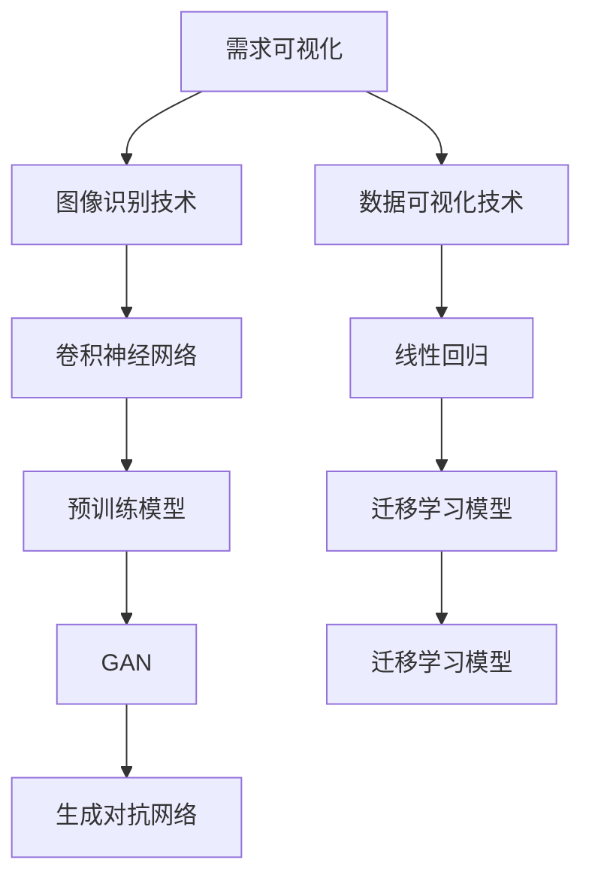

                 

### 需求可视化：提升大模型应用开发效率的利器

#### 关键词：
- 需求可视化
- 大模型
- 应用开发效率
- 人工智能
- 数据分析

#### 摘要：
在人工智能时代，需求可视化成为提升大模型应用开发效率的重要手段。本文详细探讨了需求可视化的核心概念、大模型的原理与应用，并通过实际案例，展示如何利用需求可视化技术提高大模型应用开发的效率和效果。

---

## 引言与概述

在当今快速发展的科技时代，人工智能（AI）已经成为改变各行各业的关键驱动力。特别是在数据密集型领域，如金融、医疗和制造业，大模型的应用极大地提升了数据分析和决策的效率。然而，随着模型复杂度的增加，如何快速理解并有效地利用这些模型成为一个亟待解决的问题。

**需求可视化**，作为一种将抽象的数据和信息转化为易于理解的可视化形式的技术，为解决这一难题提供了有力的工具。通过需求可视化，开发人员可以更直观地理解模型的需求，从而更有效地进行开发、测试和部署。

本文将首先介绍需求可视化的概念和重要性，然后深入探讨大模型的原理与应用，通过实际案例展示如何利用需求可视化技术提升大模型应用开发的效率。

## 需求可视化的基础理论

### 需求可视化的定义与发展历程

**需求可视化**是一种将数据和信息以图形、图表或其他视觉形式展示的技术，旨在帮助用户更好地理解和分析数据。它不仅包括数据的可视化展示，还涉及到如何通过视觉元素传达数据背后的业务逻辑和需求。

需求可视化的发展历程可以追溯到20世纪90年代，随着计算机技术和图形处理能力的提升，人们开始意识到通过可视化方式展示复杂数据的重要性。早期的需求可视化主要是二维图表和简单的图形展示，随着技术的进步，现在可以支持三维、四维甚至更高维度的数据可视化。

### 大模型的原理与分类

**大模型**是指具有巨大参数量和计算能力的人工神经网络模型，能够处理海量数据并进行复杂的模式识别和预测。大模型的原理基于深度学习，特别是卷积神经网络（CNN）和循环神经网络（RNN）等。

大模型可以分为以下几类：
1. **预训练模型**：在大量通用数据上预训练，然后针对特定任务进行微调。
2. **迁移学习模型**：利用在某一领域预训练的模型，在新的任务上进行快速适应。
3. **生成对抗网络（GAN）**：通过生成模型和判别模型之间的对抗训练，生成逼真的数据。

### 需求可视化的核心算法

需求可视化通常涉及到以下核心算法：

#### 图像识别技术

图像识别技术是需求可视化中常用的技术之一。它通过训练卷积神经网络（CNN）对图像进行分类和识别，从而将抽象的图像数据转化为可视化的形式。以下是一个简单的CNN算法的伪代码：

```pseudo
define convolutional_layer(input, filters, kernel_size):
    # 卷积层实现
    return activated(convolution(input, filters, kernel_size))

define pooling_layer(input, pool_size):
    # 池化层实现
    return max_pool(input, pool_size)

input = preprocess_image(image)
conv1 = convolutional_layer(input, filters=32, kernel_size=3)
pool1 = pooling_layer(conv1, pool_size=2)
...
```

#### 数据可视化技术

数据可视化技术通过将数据转换为图形、图表或图像，帮助用户直观地理解和分析数据。常见的数据可视化技术包括折线图、柱状图、散点图和热力图等。以下是一个简单的数据可视化算法的伪代码：

```pseudo
define line_chart(data, x_label, y_label):
    # 创建折线图
    plot(data, xlabel=x_label, ylabel=y_label, line_color='blue')

data = preprocess_data(raw_data)
line_chart(data, '时间', '销售额')
```

### 数学模型与公式

需求可视化中涉及到一些数学模型和公式，例如线性代数、概率论和统计学等。以下是一个简单的线性回归模型的公式：

$$
y = \beta_0 + \beta_1 \cdot x + \epsilon
$$

其中，\(y\) 是预测值，\(x\) 是自变量，\(\beta_0\) 和 \(\beta_1\) 是模型参数，\(\epsilon\) 是误差项。

### Mermaid流程图

为了更好地展示需求可视化与大数据模型之间的关系，我们可以使用Mermaid流程图。以下是一个简单的Mermaid流程图示例：



通过这个流程图，我们可以清晰地看到需求可视化与图像识别技术、数据可视化技术之间的关系，以及大模型的不同类型和应用场景。

### 项目实战

在接下来的章节中，我们将通过实际项目案例，详细讲解如何使用需求可视化技术提升大模型应用开发的效率。

---

通过本文的介绍，我们可以看到需求可视化在大模型应用开发中的重要作用。它不仅帮助我们更好地理解模型的需求，还能提高开发的效率，从而在快速变化的技术环境中保持竞争力。在接下来的章节中，我们将进一步深入探讨大模型的原理和应用，并通过实际案例展示需求可视化的具体实践。希望本文能为您在需求可视化领域的研究和实践提供有价值的参考。作者：AI天才研究院/AI Genius Institute & 禅与计算机程序设计艺术 /Zen And The Art of Computer Programming。

