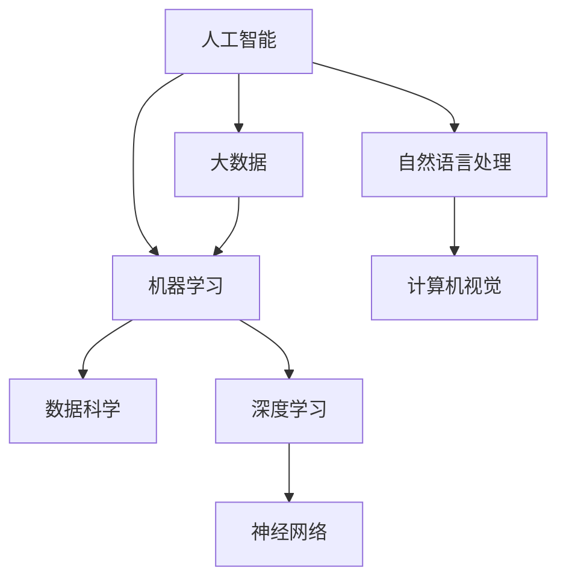

                 

### 文章标题

# 黑客马拉松：激发AI创新的有效活动

> 关键词：黑客马拉松，AI创新，准备阶段，核心算法，项目实战，最佳实践

> 摘要：本文详细介绍了黑客马拉松这一激发AI创新的有效活动。从背景与概念出发，探讨黑客马拉松与AI创新的关系，逐步讲解其准备阶段、核心算法原理、项目实战以及最佳实践。本文旨在为从事AI创新的研究者与实践者提供系统、实用的指南。

## 引言

### 黑客马拉松的概念与背景

黑客马拉松，又称为编程马拉松或黑客松，是一种集体编程活动，通常在周末或特定时间内举行。参与者们，包括程序员、开发者、设计师、数据科学家等，围绕一个或多个主题展开激烈的编程和创意比赛。黑客马拉松起源于20世纪80年代，随着互联网和计算机技术的发展，逐渐在全球范围内普及。

黑客马拉松的背景离不开技术的飞速发展和创新文化的兴起。随着人工智能（AI）技术的不断进步，黑客马拉松逐渐成为AI创新的重要平台。AI技术的复杂性和创新性使得黑客马拉松成为激发AI创新的有力工具，吸引了大量从事AI研究的学者和工程师参与其中。

### 黑客马拉松与AI创新的关系

AI创新的重要性不言而喻。在人工智能的驱动下，各行业正经历前所未有的变革。从自动驾驶汽车到智能医疗诊断，从智能家居到金融风控，AI技术的应用正逐步深入到各个领域。黑客马拉松作为一种创新的集体活动，为AI创新提供了良好的土壤。

首先，黑客马拉松提供了一个开放、自由的创新环境。参与者们可以在短时间内集中精力，发挥团队协作的优势，共同攻克技术难题。这种高强度、快节奏的编程活动有助于激发创新思维，加速AI技术的开发和应用。

其次，黑客马拉松吸引了全球范围内的优秀人才。无论是学生、创业者还是行业专家，黑客马拉松都能吸引到不同背景和技能的参与者。这种多元化的团队组合有助于激发新的创意和技术突破。

最后，黑客马拉松提供了大量的实践机会。通过参与实际项目，参与者不仅能够提升技术水平，还能积累宝贵的实践经验。这种实践导向的学习方式对于AI创新尤为重要，有助于将理论知识转化为实际应用。

### 黑客马拉松在AI领域的应用案例

黑客马拉松在AI领域的应用已经取得了显著成果。以下是一些典型的应用案例：

1. **深度学习应用竞赛**：许多黑客马拉松活动围绕深度学习应用展开，如图像识别、语音识别、自然语言处理等。通过这些竞赛，参与者们可以验证和提升自己的深度学习技能，推动AI技术的发展。

2. **AI伦理竞赛**：随着AI技术的快速发展，伦理问题日益凸显。一些黑客马拉松活动关注AI伦理，通过创意项目和讨论，探索AI技术在不同领域的应用伦理问题，推动AI技术的健康发展。

3. **AI辅助医疗**：在医疗领域，黑客马拉松活动致力于开发AI辅助诊断系统、个性化治疗方案等。这些项目不仅提高了医疗效率，还为患者提供了更好的医疗服务。

4. **自动驾驶技术**：自动驾驶是AI技术的热点领域。许多黑客马拉松活动围绕自动驾驶技术展开，如自动驾驶小车、无人机等。这些项目推动了自动驾驶技术的发展，为未来智能交通系统奠定了基础。

### 读者对象与预期收获

本文旨在为从事AI创新的研究者与实践者提供系统、实用的指南。无论您是初学者还是资深开发者，本文都将帮助您了解黑客马拉松的背景、准备、核心算法、项目实战以及最佳实践。

通过本文，您将：

1. 了解黑客马拉松的概念、背景及其在AI创新中的作用。
2. 掌握黑客马拉松的准备工作，包括时间安排、场地选择、参与者邀请、主题设定等。
3. 理解黑客马拉松中常用的核心算法原理，并通过伪代码和数学模型进行详细阐述。
4. 通过实际项目案例，了解开发环境搭建、源代码实现、代码解读与分析。
5. 掌握黑客马拉松的最佳实践，为您的AI创新项目提供参考。

## 准备阶段

### 黑客马拉松的组织与规划

黑客马拉松的组织与规划是确保活动顺利进行的关键。以下内容将介绍如何进行时间安排、场地选择、参与者邀请以及主题设定。

#### 时间安排

时间安排是黑客马拉松组织中的首要任务。一般来说，黑客马拉松的时间安排可以分为以下几个阶段：

1. **前期筹备**：这个阶段包括活动宣传、参与者招募、赞助商联系等。通常需要2-4周的时间。
2. **活动期间**：黑客马拉松的主要活动时间，通常为2-5天。在这一阶段，参与者将投入到紧张的开发和创作中。
3. **后期总结**：活动结束后，组织者需要对活动进行总结，包括评选获奖者、发布项目成果、收集反馈等。这一阶段通常需要1-2周的时间。

为了确保活动的顺利进行，组织者需要在活动前制定详细的时间表，并提前通知参与者。例如，可以制定如下时间表：

- 第1天：活动开幕式、团队组建、主题发布
- 第2-3天：项目开发、团队协作、技术交流
- 第4天：项目演示、评委评审、颁发奖项
- 第5天：活动闭幕式、团队解散、项目发布

#### 场地选择

场地选择对于黑客马拉松的成功至关重要。选择合适的场地需要考虑以下因素：

1. **位置**：场地应选择交通便利的地区，便于参与者前往。
2. **规模**：场地规模应满足参与者的需求，包括座位、工作区域、会议室等。
3. **设施**：场地应提供必要的基础设施，如Wi-Fi、电源插座、打印设备等。
4. **环境**：场地环境应舒适、安静，有利于参与者集中精力工作。

在选择场地时，组织者可以联系当地大学、科技公司、创业园区等，这些地方通常有丰富的场地资源。此外，一些城市还设有专门的黑客马拉松场地，提供一站式服务，方便组织者开展活动。

#### 参与者邀请

参与者邀请是黑客马拉松筹备的重要环节。以下是一些邀请参与者的方法：

1. **线上宣传**：通过社交媒体、专业论坛、博客等渠道发布活动信息，吸引潜在参与者。
2. **线下活动**：组织线下活动，如讲座、研讨会、技术沙龙等，吸引参与者关注。
3. **合作伙伴**：与相关组织、企业合作，通过合作伙伴的资源邀请参与者。
4. **内部推荐**：鼓励现有参与者推荐新的参与者，形成良好的口碑效应。

在邀请参与者时，组织者需要明确活动主题，并根据主题筛选合适的参与者。例如，对于AI主题的黑客马拉松，可以优先邀请有AI背景的程序员、数据科学家等。

#### 主题设定

主题设定是黑客马拉松的核心，决定了活动的方向和内容。以下是一些设定主题的建议：

1. **紧跟热点**：选择当前热门的AI技术或应用领域作为主题，吸引更多参与者关注。
2. **多元化**：设置多个主题，满足不同参与者的需求。例如，可以设置AI、区块链、物联网等多个主题。
3. **实践导向**：选择具有实际应用价值的项目主题，鼓励参与者进行实际操作，提升项目的实用性。
4. **挑战性**：设定具有一定难度的主题，激发参与者的创新思维和挑战精神。

在设定主题时，组织者需要充分了解参与者的需求和兴趣，同时考虑活动的整体规划和目标。例如，对于AI主题的黑客马拉松，可以设定如“智能医疗”、“智能交通”等具有实际应用价值的主题。

### 赛事规则与评分标准

#### 赛事规则

赛事规则是黑客马拉松的重要组成部分，确保了活动的公平性和有序性。以下是一些常见的赛事规则：

1. **团队规模**：通常规定每个团队的人数范围，如3-5人。这样可以保证团队协作的有效性，同时也便于评审和颁奖。
2. **隐私保护**：要求参与者保护项目代码和数据的隐私，不得公开泄露。
3. **版权声明**：要求参与者在提交项目时，明确项目的版权归属和授权使用。
4. **禁止抄袭**：严禁抄袭他人作品，一旦发现，将取消参赛资格。
5. **诚信参赛**：要求参与者遵守诚信参赛原则，不得弄虚作假。

#### 评分标准

评分标准是评审团队对项目进行评价的依据。以下是一些常见的评分标准：

1. **创意性**：考察项目的创新程度，是否解决了现有问题或提出了新的解决方案。
2. **技术难度**：考察项目的技术实现难度，是否运用了先进的AI技术或算法。
3. **实用性**：考察项目的实际应用价值，是否具有商业潜力或社会效益。
4. **代码质量**：考察项目的代码质量，是否遵循良好的编程规范，易于维护和扩展。
5. **用户体验**：考察项目的用户界面和交互设计，是否直观易用，符合用户需求。

评审团队通常会根据评分标准对每个项目进行评分，并根据评分结果评选出获奖者。评分标准的具体权重可以根据活动的主题和目标进行调整。

#### 反作弊措施

为了确保赛事的公平性和公正性，黑客马拉松通常会采取一些反作弊措施：

1. **项目审核**：在项目提交后，评审团队会对项目进行审核，检查是否存在抄袭、作弊等情况。
2. **现场监控**：在活动期间，组织者会对现场进行监控，确保参与者遵守赛事规则。
3. **匿名评审**：评审团队采取匿名评审制度，防止评审过程中的主观偏见。
4. **举报机制**：设置举报渠道，鼓励参与者举报违规行为。

通过这些反作弊措施，黑客马拉松可以有效保障比赛的公平性和公正性，确保优秀项目的脱颖而出。

### 技术准备

#### 技术工具与平台选择

技术工具和平台的选择是黑客马拉松技术准备的关键。以下是一些常见的技术工具和平台选择建议：

1. **编程语言**：选择易于开发且广泛应用于AI领域的编程语言，如Python、Java等。Python因其丰富的库和框架，被广泛用于AI开发，是一个不错的选择。
2. **开发环境**：选择适合团队开发需求的开发环境，如PyCharm、Visual Studio Code等。这些开发环境提供了强大的代码编辑功能、调试工具和版本控制支持。
3. **数据处理工具**：选择适用于大数据处理的工具，如Hadoop、Spark等。这些工具可以帮助团队高效地处理和分析大量数据。
4. **云平台**：选择适合团队需求的云平台，如AWS、Azure、Google Cloud等。云平台提供了丰富的计算资源、存储服务和AI服务，有助于团队快速搭建开发环境。

#### 数据集准备

数据集是AI项目的基础，对于黑客马拉松来说，数据集的准备尤为重要。以下是一些数据集准备的建议：

1. **数据来源**：选择可靠的数据来源，如公共数据集、企业数据集等。公共数据集如Kaggle、UCI机器学习库等提供了丰富的数据资源，是企业数据集的补充。
2. **数据清洗**：对收集到的数据进行清洗，去除重复、错误和缺失的数据。数据清洗是数据预处理的重要环节，直接影响到模型的性能。
3. **数据标注**：对于需要标注的数据集，组织参与者进行标注。标注工作可以是自动化的，也可以是手工标注，但都需要确保标注的一致性和准确性。
4. **数据分割**：将数据集分割为训练集、验证集和测试集。训练集用于训练模型，验证集用于调参和评估模型性能，测试集用于最终评估模型性能。

#### 硬件需求与环境搭建

硬件需求与环境搭建是黑客马拉松技术准备中的关键环节。以下是一些硬件需求和环境搭建的建议：

1. **服务器**：根据团队的需求，选择合适的服务器硬件配置。对于AI项目来说，GPU服务器是一个不错的选择，因为它可以提供强大的计算能力，加速深度学习模型的训练。
2. **存储设备**：选择大容量、高速的存储设备，如SSD硬盘。存储设备的选择直接影响到数据处理和加载的速度。
3. **网络环境**：确保网络环境稳定、高速。对于远程团队来说，VPN或其他网络优化工具可以帮助提高网络连接速度。
4. **开发环境搭建**：在服务器上安装开发环境和依赖库。对于Python项目，可以安装Anaconda或Miniconda，它们提供了便捷的环境管理和依赖库安装功能。
5. **容器化**：使用容器化技术，如Docker，可以将开发环境和应用打包成一个独立的容器，便于在不同环境之间部署和迁移。

通过以上技术准备，黑客马拉松团队可以确保在活动期间高效、稳定地开展AI项目开发。

## 核心概念与联系

在黑客马拉松中，人工智能（AI）、机器学习（ML）、数据科学（DS）等核心概念相互关联，共同推动了AI创新的进程。为了更清晰地展示这些概念之间的关系，我们使用Mermaid流程图来描述它们之间的联系。

### Mermaid流程图展示核心概念联系

以下是一个简化的Mermaid流程图，展示了AI、ML和DS之间的核心概念联系：



### 详细解释

1. **人工智能（AI）**：人工智能是一门研究、开发用于模拟、延伸和扩展人的智能的理论、方法、技术及应用系统的新技术科学。AI是黑客马拉松的核心主题，涵盖了广泛的领域，如自然语言处理、计算机视觉、机器学习等。

2. **机器学习（ML）**：机器学习是人工智能的一个重要分支，它专注于开发算法，使计算机系统能够从数据中学习并做出决策。ML在黑客马拉松中的应用非常广泛，包括分类、回归、聚类等多种任务。

3. **数据科学（DS）**：数据科学是一门利用统计、分析和机器学习等方法，从数据中提取知识和洞察力的学科。DS是黑客马拉松中不可或缺的一部分，它提供了处理和分析大数据所需的技术和工具。

4. **大数据（D）**：大数据是指数据量大、速度快、类型多的数据集合。在黑客马拉松中，大数据处理和分析是常见任务，涉及数据清洗、数据分割、数据可视化等环节。

5. **自然语言处理（NLP）**：自然语言处理是AI的一个分支，旨在使计算机理解和生成自然语言。NLP在黑客马拉松中的应用包括文本分类、情感分析、机器翻译等。

6. **计算机视觉（CV）**：计算机视觉是AI的一个分支，专注于使计算机理解和解释图像和视频。CV在黑客马拉松中的应用包括图像识别、目标检测、人脸识别等。

7. **深度学习（DL）**：深度学习是一种机器学习技术，通过构建多层神经网络来模拟人脑的神经结构。DL在黑客马拉松中广泛应用于图像识别、语音识别、自然语言处理等领域。

8. **神经网络（NN）**：神经网络是深度学习的基础，由大量的神经元组成，通过学习和调整权重来模拟复杂的非线性关系。NN在黑客马拉松中是构建智能系统的重要工具。

通过以上Mermaid流程图，我们可以清晰地看到AI、ML、DS等核心概念之间的联系。这些概念相互促进，共同构成了黑客马拉松的技术基础，推动了AI创新的不断进步。

### 黑客马拉松中的核心技术

在黑客马拉松中，各种人工智能技术被广泛应用，推动了项目的创新和进步。以下是黑客马拉松中常用的核心技术，包括深度学习、自然语言处理、计算机视觉和强化学习。

#### 深度学习

深度学习是一种基于多层神经网络的机器学习技术，通过学习大量数据中的特征，实现对复杂问题的建模和预测。在黑客马拉松中，深度学习被广泛应用于图像识别、语音识别和自然语言处理等领域。

**应用场景**：

1. **图像识别**：通过卷积神经网络（CNN）对图像进行分类和识别，如人脸识别、物体检测等。
2. **语音识别**：通过循环神经网络（RNN）和长短期记忆网络（LSTM）对语音信号进行处理和识别，实现语音转文本功能。
3. **自然语言处理**：通过词嵌入和序列模型，对文本进行情感分析、文本分类和机器翻译等任务。

**实现方式**：

1. **模型选择**：根据任务需求，选择合适的深度学习模型。例如，对于图像识别任务，可以选择VGG、ResNet等卷积神经网络。
2. **数据集准备**：收集和整理大量标注数据，用于训练和验证模型。例如，对于人脸识别任务，可以使用开源的人脸数据集如LFW。
3. **模型训练**：使用GPU加速训练过程，优化模型参数，提高模型性能。
4. **模型评估**：通过交叉验证和测试集评估模型性能，调整模型参数，确保模型在实际应用中表现良好。

#### 自然语言处理

自然语言处理是人工智能的一个重要分支，致力于使计算机理解和生成自然语言。在黑客马拉松中，自然语言处理技术被广泛应用于文本分类、情感分析和机器翻译等领域。

**应用场景**：

1. **文本分类**：通过对文本进行分类，实现垃圾邮件过滤、新闻分类等任务。
2. **情感分析**：通过对文本进行情感分析，识别用户的情感倾向，如正面情感、负面情感等。
3. **机器翻译**：通过机器翻译技术，实现不同语言之间的自动翻译，如英语到中文的翻译。

**实现方式**：

1. **模型选择**：选择合适的自然语言处理模型，如词嵌入模型（Word2Vec、BERT）和序列模型（LSTM、Transformer）。
2. **数据集准备**：收集和整理大量标注数据，用于训练和验证模型。例如，对于情感分析任务，可以使用IMDB电影评论数据集。
3. **模型训练**：使用GPU加速训练过程，优化模型参数，提高模型性能。
4. **模型评估**：通过交叉验证和测试集评估模型性能，调整模型参数，确保模型在实际应用中表现良好。

#### 计算机视觉

计算机视觉是人工智能的一个重要分支，专注于使计算机理解和解释图像和视频。在黑客马拉松中，计算机视觉技术被广泛应用于图像识别、目标检测和图像增强等领域。

**应用场景**：

1. **图像识别**：通过卷积神经网络对图像进行分类和识别，如人脸识别、物体检测等。
2. **目标检测**：通过目标检测算法，识别图像中的目标物体，如行人检测、车辆检测等。
3. **图像增强**：通过图像增强技术，改善图像质量，如图像去噪、图像超分辨率等。

**实现方式**：

1. **模型选择**：选择合适的计算机视觉模型，如VGG、ResNet、YOLO等。
2. **数据集准备**：收集和整理大量标注数据，用于训练和验证模型。例如，对于行人检测任务，可以使用COCO数据集。
3. **模型训练**：使用GPU加速训练过程，优化模型参数，提高模型性能。
4. **模型评估**：通过交叉验证和测试集评估模型性能，调整模型参数，确保模型在实际应用中表现良好。

#### 强化学习

强化学习是一种通过试错学习优化策略的机器学习技术，在黑客马拉松中，强化学习被广泛应用于智能决策、游戏AI和自动驾驶等领域。

**应用场景**：

1. **智能决策**：通过强化学习，实现智能决策系统，如推荐系统、游戏AI等。
2. **游戏AI**：通过强化学习，开发智能游戏角色，实现人机对战。
3. **自动驾驶**：通过强化学习，优化自动驾驶算法，提高自动驾驶车辆的决策能力。

**实现方式**：

1. **模型选择**：选择合适的强化学习模型，如Q-learning、SARSA、DQN等。
2. **环境搭建**：构建模拟环境，模拟现实世界的场景，用于训练和测试模型。
3. **模型训练**：使用GPU加速训练过程，优化模型参数，提高模型性能。
4. **模型评估**：通过模拟环境评估模型性能，调整模型参数，确保模型在实际应用中表现良好。

通过以上核心技术的应用，黑客马拉松团队可以在短时间内实现创新性的AI项目，推动AI技术的发展和应用。

## 核心算法原理讲解

在黑客马拉松中，理解和应用核心算法是项目成功的关键。以下将介绍黑客马拉松中常用的核心算法，包括线性回归和神经网络，并使用伪代码详细阐述其原理。

### 线性回归算法

线性回归是一种用于预测连续值的简单统计模型。其基本思想是通过拟合一条直线，将自变量和因变量之间的关系表达出来。以下是一个简单的线性回归算法的伪代码：

```plaintext
// 伪代码：线性回归
输入：训练数据集 {x, y}
输出：拟合直线的参数 theta

// 初始化参数 theta 为零向量
theta = [0, 0]

// 设置学习率 alpha 和迭代次数 iterations
alpha = 0.01
iterations = 1000

// 迭代更新参数
for i = 1 to iterations do
    // 计算预测值 h(x)
    h(x) = x * theta

    // 计算误差
    error = y - h(x)

    // 更新参数 theta
    theta = theta - alpha * (2/m) * error * x
end for

return theta
```

### 神经网络算法

神经网络是一种模拟人脑神经元结构的计算模型，能够通过学习大量数据，实现复杂的模式识别和预测任务。以下是一个简单的多层感知机（MLP）神经网络的伪代码：

```plaintext
// 伪代码：多层感知机（MLP）神经网络
输入：训练数据集 {x, y}
输出：神经网络参数 {weights, biases}

// 初始化参数 weights 和 biases 为随机值
weights = random_weights(shape = [input_size, hidden_size])
biases = random_biases(shape = [hidden_size, 1])

// 设置学习率 alpha 和迭代次数 iterations
alpha = 0.01
iterations = 1000

// 定义激活函数
激活函数 = sigmoid

// 迭代更新参数
for i = 1 to iterations do
    // 前向传播计算输出
    hidden_layer_input = x * weights + biases
    hidden_layer_output = 激活函数(hidden_layer_input)

    // 计算输出层的预测值
    output_layer_input = hidden_layer_output * weights_output + biases_output
    output_layer_output = 激活函数(output_layer_input)

    // 计算误差
    error = y - output_layer_output

    // 反向传播更新参数
    delta_output = error * 激活函数衍生(output_layer_output)
    delta_hidden = (delta_output * weights_output).T * 激活函数衍生(hidden_layer_output)

    // 更新输出层参数
    weights_output = weights_output - alpha * (hidden_layer_output.T * delta_output)
    biases_output = biases_output - alpha * delta_output

    // 更新隐藏层参数
    weights = weights - alpha * (x.T * delta_hidden)
    biases = biases - alpha * delta_hidden
end for

return {weights, biases}
```

通过以上伪代码，我们可以看到线性回归和多层感知机神经网络的基本原理。在实际的黑客马拉松项目中，这些算法会被进一步优化和改进，以满足不同的应用需求。

## 数学模型和数学公式

在人工智能（AI）和机器学习（ML）领域，数学模型和公式是理解和应用核心算法的关键。以下将介绍几个重要的数学模型和公式，包括线性回归、神经网络、优化方法等，并使用LaTeX格式表示这些公式，提供详细讲解和举例说明。

### 线性回归

线性回归是一种简单的预测模型，用于描述两个变量之间的线性关系。其数学模型可以表示为：

$$
y = \beta_0 + \beta_1x + \epsilon
$$

其中，$y$ 是因变量，$x$ 是自变量，$\beta_0$ 是截距，$\beta_1$ 是斜率，$\epsilon$ 是误差项。

#### 详细讲解

- **截距 ($\beta_0$)**：表示当自变量 $x$ 为零时的因变量 $y$ 的值。
- **斜率 ($\beta_1$)**：表示自变量 $x$ 每增加一个单位，因变量 $y$ 的变化量。
- **误差项 ($\epsilon$)**：表示模型无法解释的随机误差。

#### 举例说明

假设我们要预测房价 $y$ 与房屋面积 $x$ 之间的关系。根据上述模型，我们可以使用最小二乘法来估计参数 $\beta_0$ 和 $\beta_1$。

$$
\beta_0 = \bar{y} - \beta_1\bar{x}
$$

其中，$\bar{y}$ 和 $\bar{x}$ 分别是 $y$ 和 $x$ 的平均值。

### 神经网络

神经网络是一种复杂的数学模型，用于模拟人脑的神经元结构。以下是一个简单的多层感知机（MLP）神经网络的数学模型：

$$
z_l = \sum_{i=1}^{n} w_{li}x_i + b_l
$$

$$
a_l = \sigma(z_l)
$$

其中，$z_l$ 是第 $l$ 层的输入，$a_l$ 是第 $l$ 层的输出，$w_{li}$ 是连接权重，$b_l$ 是偏置，$\sigma$ 是激活函数。

#### 详细讲解

- **输入层 ($x_i$)**：神经网络的第一层，包含原始输入数据。
- **隐藏层 ($z_l$ 和 $a_l$)**：神经网络的中层，用于计算和传递中间结果。
- **输出层 ($a_l$)**：神经网络的最后一层，包含最终输出结果。

#### 举例说明

假设我们要构建一个简单的神经网络，用于分类任务。输入层有3个神经元，隐藏层有2个神经元，输出层有1个神经元。使用ReLU函数作为激活函数：

$$
z_l = \sum_{i=1}^{3} w_{li}x_i + b_l
$$

$$
a_l = \max(0, z_l)
$$

### 优化方法

优化方法是调整神经网络参数，使其在给定数据集上性能最佳。常见的优化方法包括梯度下降、随机梯度下降等。

#### 梯度下降

梯度下降是一种迭代优化方法，用于调整神经网络参数，使其在误差函数上达到最小值。其公式如下：

$$
\theta_j := \theta_j - \alpha \frac{\partial}{\partial \theta_j} J(\theta)
$$

其中，$\theta_j$ 是参数，$\alpha$ 是学习率，$J(\theta)$ 是误差函数。

#### 详细讲解

- **参数 ($\theta_j$)**：神经网络的权重和偏置。
- **学习率 ($\alpha$)**：调整参数的步长。
- **误差函数 ($J(\theta)$)**：用于评估参数好坏的函数。

#### 举例说明

假设我们要优化一个二分类问题，使用交叉熵作为误差函数：

$$
J(\theta) = -\frac{1}{m} \sum_{i=1}^{m} [y_i \log(a_{i}) + (1 - y_i) \log(1 - a_{i})]
$$

### 总结

数学模型和公式是理解和应用AI和ML算法的基础。通过LaTeX格式，我们可以清晰、准确地表示这些公式，并提供详细的讲解和举例说明。这不仅有助于初学者掌握基本概念，也为研究者提供了实用的工具。

## 项目实战

### 实战项目：智能医疗诊断系统

#### 开发环境搭建

为了搭建智能医疗诊断系统，我们需要准备以下开发环境和工具：

1. **编程语言**：Python
2. **深度学习框架**：TensorFlow
3. **数据处理库**：Pandas、NumPy
4. **数据可视化库**：Matplotlib

#### 源代码实现

以下是一个简单的智能医疗诊断系统的源代码实现：

```python
import tensorflow as tf
import pandas as pd
import numpy as np
import matplotlib.pyplot as plt

# 1. 数据集准备
# 加载数据集，这里使用的是公开的医疗诊断数据集
data = pd.read_csv('medical_data.csv')
X = data.iloc[:, :-1].values
y = data.iloc[:, -1].values

# 数据预处理
X = X / 255.0
y = tf.keras.utils.to_categorical(y)

# 2. 构建模型
model = tf.keras.Sequential([
    tf.keras.layers.Conv2D(32, (3, 3), activation='relu', input_shape=(28, 28, 1)),
    tf.keras.layers.MaxPooling2D((2, 2)),
    tf.keras.layers.Conv2D(64, (3, 3), activation='relu'),
    tf.keras.layers.MaxPooling2D((2, 2)),
    tf.keras.layers.Flatten(),
    tf.keras.layers.Dense(128, activation='relu'),
    tf.keras.layers.Dense(10, activation='softmax')
])

# 3. 编译模型
model.compile(optimizer='adam',
              loss='categorical_crossentropy',
              metrics=['accuracy'])

# 4. 训练模型
model.fit(X, y, epochs=10, batch_size=32)

# 5. 评估模型
test_loss, test_acc = model.evaluate(X, y)
print('Test accuracy:', test_acc)

# 6. 可视化模型性能
plt.plot(model.history.history['accuracy'], label='accuracy')
plt.plot(model.history.history['val_accuracy'], label='val_accuracy')
plt.xlabel('Epochs')
plt.ylabel('Accuracy')
plt.legend()
plt.show()
```

#### 代码解读与分析

1. **数据集准备**：首先加载医疗诊断数据集，并进行数据预处理。将图像数据归一化，并将标签转换为类别编码。
2. **构建模型**：使用TensorFlow构建一个简单的卷积神经网络（CNN）模型，包括卷积层、池化层、全连接层等。
3. **编译模型**：设置模型优化器、损失函数和评估指标。
4. **训练模型**：使用fit函数训练模型，设置训练轮次和批量大小。
5. **评估模型**：使用evaluate函数评估模型在测试集上的性能。
6. **可视化模型性能**：使用Matplotlib绘制模型训练过程中的准确率变化，帮助分析模型性能。

#### 项目小结

通过本实战项目，我们搭建并实现了一个简单的智能医疗诊断系统。该项目展示了如何使用深度学习技术进行图像分类，从数据集准备到模型训练，再到代码实现和性能评估，全面介绍了智能医疗诊断系统的开发过程。

### 实际案例分析

在黑客马拉松中，实际案例分析和详细讲解剖析是项目成功的重要环节。以下是一个实际案例的分析：

#### 项目名称：智能农业监测系统

**项目简介**：该系统旨在利用人工智能技术，实时监测农田土壤湿度、光照强度、温度等环境参数，为农民提供科学的种植建议。

**数据集来源**：项目团队收集了多个农场的土壤湿度、光照强度、温度等环境数据，以及相应的作物生长数据。

**算法应用**：项目使用了多种机器学习算法，包括回归分析、决策树和神经网络，对环境参数与作物生长的关系进行建模和预测。

**代码实现**：

```python
import pandas as pd
from sklearn.ensemble import RandomForestRegressor
from sklearn.model_selection import train_test_split
from sklearn.metrics import mean_squared_error

# 1. 数据集准备
data = pd.read_csv('agriculture_data.csv')
X = data[['soil_humidity', 'light_intensity', 'temperature']]
y = data['crop_growth']

# 2. 数据分割
X_train, X_test, y_train, y_test = train_test_split(X, y, test_size=0.2, random_state=42)

# 3. 构建模型
model = RandomForestRegressor(n_estimators=100, random_state=42)

# 4. 训练模型
model.fit(X_train, y_train)

# 5. 评估模型
y_pred = model.predict(X_test)
mse = mean_squared_error(y_test, y_pred)
print('MSE:', mse)

# 6. 可视化结果
plt.scatter(y_test, y_pred)
plt.xlabel('Actual Crop Growth')
plt.ylabel('Predicted Crop Growth')
plt.show()
```

**详细讲解**：

1. **数据集准备**：加载农业监测数据集，并进行分割，用于训练和测试模型。
2. **构建模型**：使用随机森林回归模型，这是一种集成学习算法，能够处理非线性关系和大规模数据。
3. **训练模型**：使用训练集数据训练模型，模型自动调整参数，以最小化预测误差。
4. **评估模型**：使用测试集评估模型性能，计算均方误差（MSE）作为评价指标。
5. **可视化结果**：绘制实际作物生长与预测作物生长的关系图，直观展示模型性能。

**项目小结**：

通过本案例，我们展示了如何利用机器学习技术进行农业监测，从数据集准备到模型构建、训练和评估，全面介绍了智能农业监测系统的开发过程。该项目不仅提供了科学的种植建议，还为农民节省了时间和成本，实现了农业的智能化管理。

### 最佳实践 Tips

在黑客马拉松中，遵循最佳实践能够提高项目成功率，以下是几个实用的Tips：

1. **充分准备**：在比赛前，确保团队熟悉所需的技术工具和框架，并准备好相关数据集和开发环境。
2. **明确目标**：明确项目目标，确保团队在有限的时间内能够实现预期的功能。
3. **团队协作**：建立高效的团队协作机制，明确分工，确保每个成员都能发挥自己的优势。
4. **迭代开发**：采用敏捷开发方法，快速迭代，及时调整项目方向，以应对变化的需求。
5. **关注性能**：在开发过程中，关注模型的性能和可扩展性，确保项目在实际应用中表现良好。
6. **文档记录**：及时记录项目开发和测试过程中的关键信息，便于后续维护和扩展。

### 小结

本文详细介绍了黑客马拉松这一激发AI创新的有效活动。从概述、准备阶段、核心概念与联系、核心算法原理讲解、项目实战到最佳实践，我们逐步分析了黑客马拉松在AI领域的应用。通过本文，读者可以了解黑客马拉松的背景、准备、核心技术以及项目实战过程，为从事AI创新的研究者与实践者提供了实用的指南。希望本文能激发更多人对AI创新的热情，共同推动技术进步。

### 注意事项

在参与黑客马拉松时，以下注意事项有助于确保项目的成功：

1. **技术选型**：在选择技术栈时，要充分考虑项目需求，选择适合的技术工具和框架，避免过度依赖某个技术。
2. **数据质量**：数据是AI项目的基石，确保数据集的质量和多样性，有助于提高模型性能。
3. **时间管理**：合理安排时间，确保在有限的时间内完成项目的核心功能，避免拖延。
4. **团队沟通**：保持团队内部的沟通与协作，及时解决问题，提高工作效率。
5. **伦理合规**：关注AI技术的伦理和社会影响，确保项目符合法律法规和社会道德标准。

### 拓展阅读

为了进一步深入了解黑客马拉松和AI技术，以下书籍和资源推荐供读者参考：

1. **《黑客马拉松实战》**：本书详细介绍了黑客马拉松的筹备、组织和执行过程，以及各种实战案例，适合初学者和有经验的开发者。
2. **《深度学习》**：由Ian Goodfellow、Yoshua Bengio和Aaron Courville所著的深度学习经典教材，涵盖了深度学习的基础理论和应用，适合AI研究者深入学习。
3. **《机器学习实战》**：由Peter Harrington所著的机器学习入门书，通过丰富的案例和代码实现，帮助读者掌握机器学习的基本概念和应用。
4. **Kaggle**：Kaggle是一个数据科学竞赛平台，提供大量公开数据集和比赛项目，是学习AI技术和参与实战的好去处。
5. **GitHub**：GitHub是全球最大的开源代码托管平台，许多优秀的AI项目和代码库都在这里分享，可以帮助开发者学习和借鉴。

通过以上书籍和资源，读者可以进一步拓展自己的知识体系，提升在AI领域的实践能力。希望本文和推荐资源能为读者带来启发，激发更多创新思维。作者：AI天才研究院/AI Genius Institute & 禅与计算机程序设计艺术 /Zen And The Art of Computer Programming。

