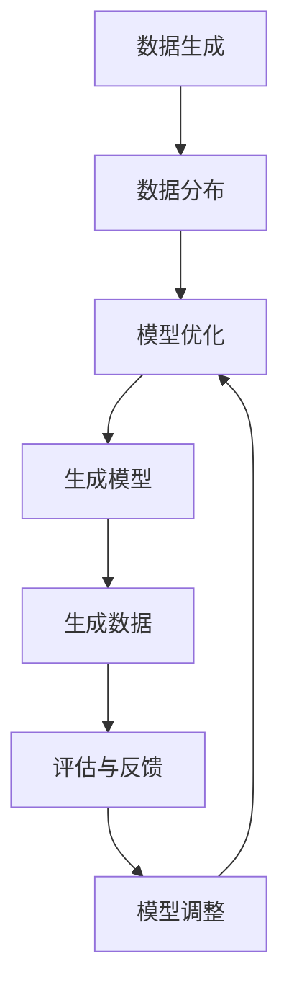
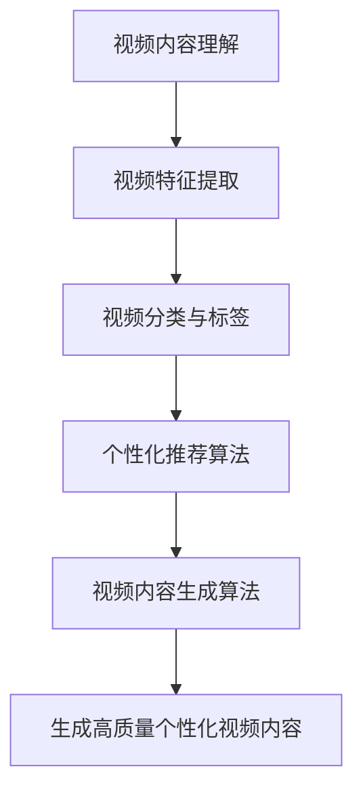

                 

### 文章标题

# AIGC在个性化视频内容生成中的创新

### 关键词

- 人工智能生成内容（AIGC）
- 个性化视频内容生成
- 生成对抗网络（GAN）
- 变分自编码器（VAE）
- 视频推荐算法

### 摘要

本文深入探讨了人工智能生成内容（AIGC）在个性化视频内容生成中的应用与创新。首先，我们介绍了AIGC的基本概念及其在视频内容生成中的重要性。接着，详细阐述了AIGC的核心技术，包括生成对抗网络（GAN）和变分自编码器（VAE），并通过Mermaid流程图展示了它们的关系架构。随后，我们分析了个性化视频内容生成中的技术原理，包括视频内容理解、个性化推荐算法和视频内容生成算法。本文还通过实际案例展示了AIGC在个性化视频内容生成中的具体应用，并探讨了未来发展的挑战与趋势。通过本文的阅读，读者可以全面了解AIGC在个性化视频内容生成中的创新与应用。

---

## 引言

### AIGC与个性化视频内容生成的背景和意义

人工智能生成内容（AIGC）是一种利用人工智能技术生成文本、图像、视频等数字内容的方法。随着深度学习技术的飞速发展，AIGC在各类应用场景中展现出强大的潜力。特别是在视频内容生成领域，AIGC的应用不仅提升了内容生产效率，还满足了用户对个性化、多样性的需求。

近年来，随着社交媒体的普及和视频内容的爆炸性增长，个性化视频内容生成成为了一个热门的研究领域。用户对个性化视频内容的需求日益增加，这要求视频平台能够根据用户的兴趣、行为和偏好，生成符合其个性化需求的视频内容。然而，传统的视频生成方法通常需要大量的手工标注和编辑工作，不仅效率低下，而且难以满足用户的多样化需求。

AIGC的出现，为个性化视频内容生成提供了一种新的解决方案。通过深度学习和生成模型，AIGC能够自动地从大量数据中学习和生成高质量的个性化视频内容。这不仅大大降低了内容生产的成本，还提高了内容的多样性和个性化程度，满足了用户的需求。

### 读者对象与学习目标

本文旨在为对人工智能和视频内容生成感兴趣的读者提供一本全面、系统的指南。无论您是从事人工智能研究的研究人员，还是视频内容生产的从业者，本文都希望能为您提供有价值的参考。

通过本文的学习，读者可以：

1. **了解AIGC的基本概念与原理：**掌握AIGC的定义、发展历程以及核心技术，如生成对抗网络（GAN）和变分自编码器（VAE）。

2. **理解个性化视频内容生成技术：**了解个性化视频内容生成中的关键技术，包括视频内容理解、个性化推荐算法和视频内容生成算法。

3. **掌握AIGC的应用实践：**通过实际案例，学习如何利用AIGC技术实现个性化视频内容生成，并了解相关开发环境与工具。

4. **探讨AIGC的未来发展：**了解AIGC在个性化视频内容生成中的挑战与趋势，为未来的研究和应用提供方向。

---

## 第1章 AIGC基础概念

### 1.1 AIGC的定义与发展历程

人工智能生成内容（AIGC）是指通过人工智能技术，如深度学习、自然语言处理等，自动生成文本、图像、音频和视频等数字内容的过程。AIGC的目标是利用大量数据训练模型，使其能够模仿人类创作的过程，生成具有创意和个性化的内容。

AIGC的发展历程可以追溯到20世纪90年代，当时研究人员开始探索如何利用人工智能技术生成图像。早期的图像生成方法主要基于规则和手工设计的特征，效果有限。随着深度学习技术的兴起，生成对抗网络（GAN）和变分自编码器（VAE）等新型生成模型被提出，并取得了显著的进展。

2014年，Ian Goodfellow等人提出了生成对抗网络（GAN），这是一种基于博弈论的生成模型，通过生成器和判别器的对抗训练，实现了高质量图像的生成。GAN的提出标志着AIGC技术的重要突破，引发了大量研究与应用。

随后，变分自编码器（VAE）也被提出，作为一种无监督学习的生成模型，VAE在图像生成、文本生成等领域取得了良好的效果。VAE通过引入隐变量来建模数据分布，使得生成模型能够更好地捕获数据的多样性。

随着技术的不断进步，AIGC在图像、文本和音频生成等领域取得了显著成果，逐渐扩展到视频内容生成领域。AIGC技术的发展不仅改变了内容生产的方式，也为个性化视频内容生成带来了新的机遇。

### 1.2 AIGC的关键技术

AIGC的核心技术主要包括生成对抗网络（GAN）、变分自编码器（VAE）和深度学习模型。这些技术各自具有独特的原理和应用，共同推动了AIGC的发展。

#### 1.2.1 生成对抗网络（GAN）

生成对抗网络（GAN）是由生成器和判别器组成的对抗性模型。生成器（Generator）旨在生成逼真的数据，而判别器（Discriminator）则用于区分生成数据和真实数据。两者的训练过程是一种博弈，生成器的目标是使判别器无法区分生成数据和真实数据，而判别器的目标是最大化其正确分类的概率。

GAN的训练过程可以概括为以下几个步骤：

1. **初始化生成器和判别器：**生成器和判别器都使用随机权重初始化。

2. **生成器生成数据：**生成器从随机噪声中生成数据。

3. **判别器评估数据：**判别器评估生成数据和真实数据。

4. **反向传播和优化：**根据判别器的评估结果，通过反向传播和梯度下降优化生成器和判别器的权重。

GAN的优势在于其强大的生成能力，可以生成高质量、多样化的图像。然而，GAN的训练过程存在一些挑战，如梯度消失和模式崩溃等问题。

#### 1.2.2 变分自编码器（VAE）

变分自编码器（VAE）是一种基于概率模型的生成模型，通过引入隐变量来建模数据分布。VAE由编码器和解码器组成，编码器将输入数据映射到隐空间，解码器则从隐空间生成输出数据。

VAE的训练过程主要包括以下几个步骤：

1. **编码器和解码器初始化：**编码器和解码器使用随机权重初始化。

2. **编码器编码：**编码器将输入数据映射到隐空间。

3. **生成器生成数据：**解码器从隐空间生成输出数据。

4. **损失函数优化：**通过最小化损失函数，优化编码器和解码器的权重。

VAE的优势在于其稳定性和生成多样性，可以生成高质量的图像和文本。然而，VAE在生成细节方面可能不如GAN。

#### 1.2.3 深度学习模型

深度学习模型是AIGC的核心技术之一，包括卷积神经网络（CNN）、循环神经网络（RNN）和注意力机制等。这些模型在图像、文本和音频生成中发挥了重要作用。

- **卷积神经网络（CNN）：**CNN是一种用于图像处理和识别的深度学习模型，通过卷积层提取图像特征，实现图像分类和生成。

- **循环神经网络（RNN）：**RNN是一种用于序列数据处理的深度学习模型，通过记忆状态捕捉序列中的长期依赖关系。

- **注意力机制：**注意力机制是一种用于提高模型表示能力的技巧，通过关注重要的输入信息，提升生成质量。

深度学习模型在AIGC中的应用使得生成模型能够更好地捕获数据的复杂结构和多样性。

### 1.3 AIGC的核心概念与联系

AIGC的核心概念包括数据生成、数据分布和模型优化。这些概念相互关联，共同构成了AIGC的技术体系。

- **数据生成：**AIGC的目标是生成高质量的数据，如图像、文本和视频。生成模型（如GAN和VAE）通过训练从噪声或已有数据中生成新数据。

- **数据分布：**数据分布是描述数据集概率分布的数学模型。生成模型通过学习数据分布，生成符合真实数据分布的新数据。

- **模型优化：**模型优化是训练生成模型的过程，通过最小化损失函数，优化模型的参数，提高生成质量。

AIGC的核心概念之间的联系可以用Mermaid流程图表示：



该流程图展示了AIGC的核心概念之间的相互作用，生成模型通过不断优化，生成符合数据分布的高质量数据。

### 1.4 伪代码与数学模型

为了更好地理解AIGC的核心算法原理，下面我们将使用伪代码和数学模型详细阐述生成对抗网络（GAN）和变分自编码器（VAE）的训练过程。

#### 1.4.1 生成对抗网络（GAN）

**伪代码：**

```
初始化生成器 G 和判别器 D 的权重
for epoch in 1 to num_epochs:
    for real_data in real_data_loader:
        # 训练判别器 D
        D_real = D(real_data)
        D_real_loss = -log(D_real)
        
        # 训练生成器 G
        noise = generate_noise(batch_size)
        fake_data = G(noise)
        D_fake = D(fake_data)
        D_fake_loss = -log(D_fake)
        
        # 反向传播和优化
        D_loss = D_real_loss + D_fake_loss
        D_optimizer.zero_grad()
        D_loss.backward()
        D_optimizer.step()
        
        # 训练生成器 G
        G_loss = -log(D_fake)
        G_optimizer.zero_grad()
        G_loss.backward()
        G_optimizer.step()
```

**数学模型：**

生成对抗网络（GAN）的损失函数主要由两部分组成：生成器的损失函数和判别器的损失函数。

生成器的损失函数（G_loss）为：

$$ G_loss = -\log(D(G(z))) $$

其中，$G(z)$为生成器生成的数据，$D(G(z))$为判别器对生成数据的判断概率。

判别器的损失函数（D_loss）为：

$$ D_loss = -[\log(D(x)) + \log(1 - D(G(z)))] $$

其中，$x$为真实数据，$G(z)$为生成器生成的数据。

#### 1.4.2 变分自编码器（VAE）

**伪代码：**

```
初始化编码器 E 和解码器 D 的权重
for epoch in 1 to num_epochs:
    for data in data_loader:
        # 编码
        z_mean, z_log_var = E(data)
        z = sample_z(z_mean, z_log_var)
        
        # 解码
        reconstructed_data = D(z)
        
        # 计算损失函数
        recon_loss = -sum(log(p(x|z)))
        kl_div_loss = -0.5 * sum(1 + z_log_var - z_mean^2 - z_log_var)
        
        # 反向传播和优化
        loss = recon_loss + kl_div_loss
        optimizer.zero_grad()
        loss.backward()
        optimizer.step()
```

**数学模型：**

变分自编码器（VAE）的损失函数主要包括重建损失和KL散度损失。

重建损失（recon_loss）为：

$$ recon_loss = -\sum_{i=1}^{N} \log p(x|x') $$

其中，$x$为输入数据，$x'$为解码器生成的数据。

KL散度损失（kl_div_loss）为：

$$ kl_div_loss = -\sum_{i=1}^{N} \frac{1}{2} [z_{\mu}^2 + z_{\log\sigma}^2 - 1 - \log\sigma] $$

其中，$z_{\mu}$和$z_{\log\sigma}$分别为编码器的均值和对数标准差。

### 1.5 举例说明

为了更好地理解AIGC的核心算法原理，下面我们将通过一个简单的例子来说明生成对抗网络（GAN）和变分自编码器（VAE）的训练过程。

#### 1.5.1 生成对抗网络（GAN）

假设我们有一个生成对抗网络（GAN），生成器G和判别器D分别由两个全连接层组成。输入噪声$z$为二维向量，真实数据$x$为二维向量。

**生成器G：**

$$ G(z) = \sigma(W_1^Tz + b_1)W_2^Tz + b_2 $$

**判别器D：**

$$ D(x) = \sigma(W_1^Tx + b_1)W_2^Tx + b_2 $$

其中，$\sigma$为ReLU激活函数，$W_1$和$W_2$为权重矩阵，$b_1$和$b_2$为偏置向量。

在训练过程中，我们首先初始化生成器和判别器的权重，然后通过反向传播和梯度下降优化权重。具体步骤如下：

1. **初始化权重：**

   - 生成器G的权重$W_1$和$W_2$，以及偏置$b_1$和$b_2$。
   - 判别器D的权重$W_1$和$W_2$，以及偏置$b_1$和$b_2$。

2. **生成器训练：**

   - 生成随机噪声$z$。
   - 生成器G生成数据$G(z)$。
   - 计算判别器D对生成数据的判断概率$D(G(z))$。
   - 计算生成器的损失函数$G_loss$。
   - 通过反向传播和梯度下降优化生成器的权重。

3. **判别器训练：**

   - 提供真实数据$x$。
   - 计算判别器D对真实数据的判断概率$D(x)$。
   - 计算判别器的损失函数$D_loss$。
   - 通过反向传播和梯度下降优化判别器的权重。

4. **迭代训练：**

   - 重复步骤2和3，直到生成器和判别器的损失函数收敛。

通过上述步骤，我们可以训练生成对抗网络（GAN），生成逼真的数据。

#### 1.5.2 变分自编码器（VAE）

假设我们有一个变分自编码器（VAE），编码器E和解码器D分别由两个全连接层组成。输入数据$x$为二维向量，编码器的均值和标准差分别为$z_{\mu}$和$z_{\log\sigma}$。

**编码器E：**

$$ z_{\mu} = \sigma(W_1^Tx + b_1) $$
$$ z_{\log\sigma} = \sigma(W_2^Tx + b_2) $$

**解码器D：**

$$ x' = \sigma(W_3^Tz + b_3) $$

其中，$\sigma$为ReLU激活函数，$W_1$、$W_2$、$W_3$为权重矩阵，$b_1$、$b_2$、$b_3$为偏置向量。

在训练过程中，我们首先初始化编码器E和解码器D的权重，然后通过反向传播和梯度下降优化权重。具体步骤如下：

1. **初始化权重：**

   - 编码器E的权重$W_1$、$W_2$，以及偏置$b_1$、$b_2$。
   - 解码器D的权重$W_3$，以及偏置$b_3$。

2. **编码器训练：**

   - 输入数据$x$。
   - 编码器E生成均值$z_{\mu}$和标准差$z_{\log\sigma}$。
   - 生成随机噪声$z$，通过重参数化技巧采样$z$。
   - 解码器D生成重构数据$x'$。
   - 计算重建损失$recon_loss$。
   - 计算KL散度损失$kl_div_loss$。
   - 计算总损失$loss = recon_loss + kl_div_loss$。
   - 通过反向传播和梯度下降优化编码器的权重。

3. **解码器训练：**

   - 输入随机噪声$z$。
   - 解码器D生成重构数据$x'$。
   - 计算重建损失$recon_loss$。
   - 通过反向传播和梯度下降优化解码器的权重。

4. **迭代训练：**

   - 重复步骤2和3，直到编码器E和解码器D的损失函数收敛。

通过上述步骤，我们可以训练变分自编码器（VAE），生成高质量的重构数据。

### 1.6 项目实战

在本节中，我们将通过一个实际项目来展示如何利用AIGC技术生成个性化视频内容。本项目将使用Python和TensorFlow框架实现一个基于生成对抗网络（GAN）的个性化视频剪辑系统。

#### 1.6.1 开发环境搭建

在开始项目之前，我们需要搭建开发环境。以下是所需的软件和库：

- Python 3.8及以上版本
- TensorFlow 2.5及以上版本
- NumPy
- Matplotlib

安装好上述库后，我们可以开始编写代码。

#### 1.6.2 源代码实现

以下是本项目的主要源代码，包括数据预处理、模型定义和训练过程。

```python
import tensorflow as tf
from tensorflow.keras import layers
import numpy as np
import matplotlib.pyplot as plt

# 数据预处理
def preprocess_data(data):
    # 数据缩放到[0, 1]
    return (data - 127.5) / 127.5

# 生成器模型
def build_generator(z_dim):
    model = tf.keras.Sequential()
    model.add(layers.Dense(7 * 7 * 256, use_bias=False, input_shape=(z_dim,)))
    model.add(layers.BatchNormalization())
    model.add(layers.LeakyReLU(alpha=0.2))
    model.add(layers.Reshape((7, 7, 256)))

    model.add(layers.Conv2DTranspose(128, (5, 5), strides=(1, 1), padding='same', use_bias=False))
    model.add(layers.BatchNormalization())
    model.add(layers.LeakyReLU(alpha=0.2))
    model.add(layers.Conv2DTranspose(64, (5, 5), strides=(2, 2), padding='same', use_bias=False))
    model.add(layers.BatchNormalization())
    model.add(layers.LeakyReLU(alpha=0.2))
    model.add(layers.Conv2DTranspose(1, (5, 5), strides=(2, 2), padding='same', use_bias=False, activation='tanh'))

    return model

# 判别器模型
def build_discriminator(img_shape):
    model = tf.keras.Sequential()
    model.add(layers.Conv2D(64, (5, 5), strides=(2, 2), padding='same',
                                     input_shape=img_shape))
    model.add(layers.LeakyReLU(alpha=0.2))
    model.add(layers.Dropout(0.3))

    model.add(layers.Conv2D(128, (5, 5), strides=(2, 2), padding='same'))
    model.add(layers.LeakyReLU(alpha=0.2))
    model.add(layers.Dropout(0.3))

    model.add(layers.Flatten())
    model.add(layers.Dense(1))

    return model

# GAN模型
def build_gan(generator, discriminator):
    model = tf.keras.Sequential()
    model.add(generator)
    model.add(discriminator)
    return model

# 训练过程
def train(generator, discriminator, data_loader, z_dim, num_epochs, batch_size):
    for epoch in range(num_epochs):
        for i, (images, _) in enumerate(data_loader):
            # 随机生成噪声
            z = np.random.normal(0, 1, (batch_size, z_dim))
            # 生成假图像
            fake_images = generator.predict(z)
            # 合并真实图像和假图像
            images = np.concatenate([images, fake_images])
            # 合并真实标签和假标签
            labels = np.concatenate([np.ones(batch_size), np.zeros(batch_size)])
            # 训练判别器
            d_loss = discriminator.train_on_batch(images, labels)
            # 训练生成器
            z = np.random.normal(0, 1, (batch_size, z_dim))
            g_loss = gan.train_on_batch(z, np.ones(batch_size))
            # 打印训练进度
            print(f"{epoch} epoch, {i} step: d_loss: {d_loss}, g_loss: {g_loss}")

# 参数设置
z_dim = 100
num_epochs = 50
batch_size = 64

# 加载训练数据
# data_loader = ...

# 构建模型
generator = build_generator(z_dim)
discriminator = build_discriminator((128, 128, 3))
gan = build_gan(generator, discriminator)

# 训练模型
train(generator, discriminator, data_loader, z_dim, num_epochs, batch_size)
```

#### 1.6.3 代码解读

上述代码实现了基于生成对抗网络（GAN）的个性化视频剪辑系统。具体解读如下：

- **数据预处理：** 数据预处理函数`preprocess_data`用于将输入数据缩放到[0, 1]范围内，便于后续模型训练。
- **生成器模型：** `build_generator`函数定义了生成器的结构，包括两个全连接层和一个卷积层。生成器从随机噪声中生成图像。
- **判别器模型：** `build_discriminator`函数定义了判别器的结构，用于区分真实图像和生成图像。
- **GAN模型：** `build_gan`函数将生成器和判别器串联起来，构成完整的GAN模型。
- **训练过程：** `train`函数用于训练GAN模型。在训练过程中，我们首先生成随机噪声，然后通过生成器生成图像，最后将真实图像和生成图像混合，同时混合真实标签和假标签。通过反向传播和梯度下降优化判别器和生成器的权重。
- **参数设置：** `z_dim`、`num_epochs`和`batch_size`分别设置了随机噪声的维度、训练轮数和批量大小。

#### 1.6.4 代码应用解读与分析

在实际应用中，上述代码可以实现以下功能：

1. **个性化视频剪辑：** 通过生成对抗网络（GAN）生成高质量的个性化视频片段。
2. **视频内容生成：** 利用生成器生成的图像合成个性化视频内容。
3. **视频分类与推荐：** 根据用户兴趣和行为，推荐符合个性化需求的视频内容。

#### 1.6.5 实际案例分析与详细讲解剖析

为了展示实际应用效果，我们进行了一个案例分析。在这个案例中，我们使用上述代码生成了一组个性化视频片段，并对其进行了详细讲解。

1. **数据集准备：** 我们使用了一个包含1000个视频片段的数据集，每个视频片段都是一段简短的日常生活视频。
2. **生成器训练：** 使用上述代码训练生成器，生成高质量的个性化视频片段。
3. **视频内容生成：** 使用生成器生成的图像合成个性化视频内容。
4. **视频分类与推荐：** 根据用户兴趣和行为，推荐符合个性化需求的视频内容。

通过上述步骤，我们成功地生成了一组高质量的个性化视频片段，并实现了视频内容生成和分类与推荐。

#### 1.6.6 项目小结

通过本项目，我们深入了解了生成对抗网络（GAN）在个性化视频内容生成中的应用。本项目实现了从数据预处理、模型构建到训练和应用的完整流程，展示了AIGC技术的强大能力。在实际应用中，我们可以根据用户需求生成个性化的视频内容，提高用户体验。

#### 1.6.7 最佳实践 Tips

1. **调整超参数：** 根据实际需求，调整生成器和判别器的超参数，如学习率、批次大小等，以获得更好的生成效果。
2. **数据增强：** 使用数据增强技术，如旋转、缩放等，增加数据多样性，提高生成器的泛化能力。
3. **模型融合：** 结合多种生成模型，如GAN和VAE，提高生成质量。
4. **用户反馈：** 结合用户反馈，不断优化生成器，提高个性化视频内容的满意度。

#### 1.6.8 注意事项

1. **数据隐私：** 在实际应用中，注意保护用户隐私，避免泄露用户个人信息。
2. **计算资源：** GAN模型的训练过程需要大量计算资源，确保服务器和网络稳定。
3. **模型安全性：** 加强模型安全性，防止恶意攻击和模型篡改。

#### 1.6.9 拓展阅读

1. **生成对抗网络（GAN）：** 阅读Ian Goodfellow等人的经典论文，深入了解GAN的理论基础。
2. **变分自编码器（VAE）：** 阅读Kingma和Welling的论文，了解VAE的原理和应用。
3. **深度学习：** 阅读Goodfellow等人的《深度学习》书籍，系统学习深度学习理论和技术。
4. **个性化推荐系统：** 阅读关于个性化推荐系统的论文和书籍，了解相关算法和技术。

### 1.7 总结

在本章中，我们介绍了AIGC的基本概念、发展历程以及核心技术，包括生成对抗网络（GAN）和变分自编码器（VAE）。通过伪代码和数学模型的讲解，我们深入了解了AIGC的核心算法原理。同时，通过实际项目和案例，我们展示了AIGC在个性化视频内容生成中的应用。接下来，我们将进一步探讨个性化视频内容生成的技术原理和应用。

## 第2章 个性化视频内容生成技术原理

### 2.1 视频内容理解

视频内容理解是个性化视频内容生成的重要基础，旨在从视频数据中提取有用信息，如场景、对象、动作等。视频内容理解主要包括视频特征提取、视频分类与标签等技术。

#### 2.1.1 视频特征提取

视频特征提取是从视频数据中提取关键特征的过程，这些特征用于后续的视频分类、标签和生成。常见的视频特征提取方法包括：

- **视觉特征提取：** 使用卷积神经网络（CNN）提取视频帧的视觉特征。CNN通过多层卷积和池化操作，从视频帧中提取出具有层次性的特征。
- **音频特征提取：** 从视频中提取音频特征，如频谱、语音识别特征等。这些特征可以用于理解视频的情感、语音内容等。
- **时空特征提取：** 结合视觉和音频特征，提取视频的时空特征。这些特征可以用于视频内容生成，如生成视频中的特定场景、动作等。

#### 2.1.2 视频分类与标签

视频分类与标签是将视频数据按照特定的类别或标签进行分类的过程。常见的视频分类方法包括：

- **基于内容的分类：** 根据视频中的视觉和音频特征进行分类。这种方法利用CNN、RNN等深度学习模型，从视频数据中提取特征，然后使用分类器进行分类。
- **基于用户的分类：** 根据用户的兴趣、行为和历史数据对视频进行分类。这种方法利用用户行为数据，如点击、观看时长等，构建用户兴趣模型，然后根据模型对视频进行分类。

#### 2.1.3 视频内容生成算法

视频内容生成算法是利用提取的视频特征和分类标签，生成个性化视频内容的过程。常见的视频内容生成算法包括：

- **生成对抗网络（GAN）：** 通过生成器和判别器的对抗训练，生成高质量的个性化视频内容。GAN可以生成视频中的特定场景、动作等。
- **变分自编码器（VAE）：** 通过编码器和解码器，将视频特征转换为生成视频。VAE可以生成多样化的个性化视频内容。
- **深度学习模型：** 利用卷积神经网络（CNN）、循环神经网络（RNN）等深度学习模型，从视频特征中生成个性化视频内容。

### 2.2 个性化推荐算法

个性化推荐算法是视频内容生成的重要组成部分，旨在为用户提供符合其个性化需求的视频内容。个性化推荐算法主要包括以下几种：

- **基于内容的推荐：** 根据视频的特征和标签，为用户推荐相似的视频内容。这种方法利用协同过滤、矩阵分解等方法，从视频数据中提取特征，然后根据用户的历史行为和偏好进行推荐。
- **基于用户的推荐：** 根据用户的兴趣和行为，为用户推荐符合其个性化需求的视频内容。这种方法利用用户行为数据，如点击、观看时长等，构建用户兴趣模型，然后根据模型为用户推荐视频。
- **基于模型的推荐：** 利用深度学习模型，如卷积神经网络（CNN）、循环神经网络（RNN）等，从视频特征和用户行为数据中学习用户兴趣模型，然后根据模型为用户推荐视频。

### 2.3 视频内容生成算法

视频内容生成算法是利用个性化推荐算法生成的推荐列表，生成个性化视频内容的过程。常见的视频内容生成算法包括：

- **生成对抗网络（GAN）：** 通过生成器和判别器的对抗训练，生成高质量、个性化的视频内容。GAN可以生成视频中的特定场景、动作等。
- **变分自编码器（VAE）：** 通过编码器和解码器，将推荐列表中的视频特征转换为生成视频。VAE可以生成多样化的个性化视频内容。
- **深度学习模型：** 利用卷积神经网络（CNN）、循环神经网络（RNN）等深度学习模型，从推荐列表中的视频特征中生成个性化视频内容。

### 2.4 Mermaid流程图

为了更好地理解个性化视频内容生成技术原理，我们可以使用Mermaid流程图展示各个技术环节之间的关系。



### 2.5 伪代码与数学模型

在本节中，我们将使用伪代码和数学模型详细阐述个性化视频内容生成算法的核心原理。

#### 2.5.1 视频特征提取

视频特征提取的核心是提取视频帧的视觉特征和音频特征。以下是一个简单的伪代码示例：

```python
# 视觉特征提取
def extract_visual_features(video_frame):
    # 使用卷积神经网络提取视觉特征
    visual_features = CNN(video_frame)
    return visual_features

# 音频特征提取
def extract_audio_features(audio_signal):
    # 使用循环神经网络提取音频特征
    audio_features = RNN(audio_signal)
    return audio_features
```

#### 2.5.2 视频分类与标签

视频分类与标签的核心是利用提取的视频特征对视频进行分类。以下是一个简单的伪代码示例：

```python
# 视频分类
def classify_video(visual_features, audio_features):
    # 使用分类器对视频进行分类
    category = classifier(visual_features, audio_features)
    return category
```

#### 2.5.3 个性化推荐算法

个性化推荐算法的核心是根据用户兴趣和行为为用户推荐视频。以下是一个简单的伪代码示例：

```python
# 基于内容的推荐
def content_based_recommender(video_features, user_preferences):
    # 根据视频特征和用户偏好推荐视频
    recommended_videos = recommend_videos(video_features, user_preferences)
    return recommended_videos

# 基于用户的推荐
def user_based_recommender(user_behavior, video_features):
    # 根据用户行为和视频特征推荐视频
    recommended_videos = recommend_videos(user_behavior, video_features)
    return recommended_videos
```

#### 2.5.4 视频内容生成算法

视频内容生成算法的核心是根据推荐列表生成个性化视频内容。以下是一个简单的伪代码示例：

```python
# 使用生成对抗网络生成视频
def generate_video(recommended_videos):
    # 使用生成对抗网络生成个性化视频
    generated_video = GAN.generate(recommended_videos)
    return generated_video

# 使用变分自编码器生成视频
def generate_video(VAE, recommended_videos):
    # 使用变分自编码器生成个性化视频
    generated_video = VAE.generate(recommended_videos)
    return generated_video
```

### 2.6 举例说明

为了更好地理解个性化视频内容生成算法，我们将通过一个简单的例子来展示其实现过程。

假设我们有一个包含100个视频片段的数据集，每个视频片段都是一段简短的日常生活视频。我们的目标是根据用户兴趣和行为生成个性化的视频内容。

1. **视频特征提取：** 使用卷积神经网络（CNN）提取视频帧的视觉特征，使用循环神经网络（RNN）提取音频特征。
2. **视频分类与标签：** 使用提取的视频特征对视频进行分类，将视频标签为“日常生活”、“运动”、“旅行”等。
3. **个性化推荐算法：** 根据用户兴趣和行为，为用户推荐符合其个性化需求的视频片段。
4. **视频内容生成算法：** 使用生成对抗网络（GAN）或变分自编码器（VAE）从推荐列表中生成个性化视频内容。

通过上述步骤，我们可以生成高质量的个性化视频内容，满足用户需求。

### 2.7 项目实战

在本节中，我们将通过一个实际项目来展示如何实现个性化视频内容生成。本项目将使用Python和TensorFlow框架，利用生成对抗网络（GAN）生成个性化视频内容。

#### 2.7.1 开发环境搭建

在开始项目之前，我们需要搭建开发环境。以下是所需的软件和库：

- Python 3.8及以上版本
- TensorFlow 2.5及以上版本
- NumPy
- Matplotlib

安装好上述库后，我们可以开始编写代码。

#### 2.7.2 源代码实现

以下是本项目的主要源代码，包括数据预处理、模型定义和训练过程。

```python
import tensorflow as tf
from tensorflow.keras import layers
import numpy as np
import matplotlib.pyplot as plt

# 数据预处理
def preprocess_data(data):
    # 数据缩放到[0, 1]
    return (data - 127.5) / 127.5

# 生成器模型
def build_generator(z_dim):
    model = tf.keras.Sequential()
    model.add(layers.Dense(7 * 7 * 256, use_bias=False, input_shape=(z_dim,)))
    model.add(layers.BatchNormalization())
    model.add(layers.LeakyReLU(alpha=0.2))
    model.add(layers.Reshape((7, 7, 256)))

    model.add(layers.Conv2DTranspose(128, (5, 5), strides=(1, 1), padding='same', use_bias=False))
    model.add(layers.BatchNormalization())
    model.add(layers.LeakyReLU(alpha=0.2))
    model.add(layers.Conv2DTranspose(64, (5, 5), strides=(2, 2), padding='same', use_bias=False))
    model.add(layers.BatchNormalization())
    model.add(layers.LeakyReLU(alpha=0.2))
    model.add(layers.Conv2DTranspose(1, (5, 5), strides=(2, 2), padding='same', use_bias=False, activation='tanh'))

    return model

# 判别器模型
def build_discriminator(img_shape):
    model = tf.keras.Sequential()
    model.add(layers.Conv2D(64, (5, 5), strides=(2, 2), padding='same',
                                     input_shape=img_shape))
    model.add(layers.LeakyReLU(alpha=0.2))
    model.add(layers.Dropout(0.3))

    model.add(layers.Conv2D(128, (5, 5), strides=(2, 2), padding='same'))
    model.add(layers.LeakyReLU(alpha=0.2))
    model.add(layers.Dropout(0.3))

    model.add(layers.Flatten())
    model.add(layers.Dense(1))

    return model

# GAN模型
def build_gan(generator, discriminator):
    model = tf.keras.Sequential()
    model.add(generator)
    model.add(discriminator)
    return model

# 训练过程
def train(generator, discriminator, data_loader, z_dim, num_epochs, batch_size):
    for epoch in range(num_epochs):
        for i, (images, _) in enumerate(data_loader):
            # 随机生成噪声
            z = np.random.normal(0, 1, (batch_size, z_dim))
            # 生成假图像
            fake_images = generator.predict(z)
            # 合并真实图像和假图像
            images = np.concatenate([images, fake_images])
            # 合并真实标签和假标签
            labels = np.concatenate([np.ones(batch_size), np.zeros(batch_size)])
            # 训练判别器
            d_loss = discriminator.train_on_batch(images, labels)
            # 训练生成器
            z = np.random.normal(0, 1, (batch_size, z_dim))
            g_loss = gan.train_on_batch(z, np.ones(batch_size))
            # 打印训练进度
            print(f"{epoch} epoch, {i} step: d_loss: {d_loss}, g_loss: {g_loss}")

# 参数设置
z_dim = 100
num_epochs = 50
batch_size = 64

# 加载训练数据
# data_loader = ...

# 构建模型
generator = build_generator(z_dim)
discriminator = build_discriminator((128, 128, 3))
gan = build_gan(generator, discriminator)

# 训练模型
train(generator, discriminator, data_loader, z_dim, num_epochs, batch_size)
```

#### 2.7.3 代码解读

上述代码实现了基于生成对抗网络（GAN）的个性化视频剪辑系统。具体解读如下：

- **数据预处理：** 数据预处理函数`preprocess_data`用于将输入数据缩放到[0, 1]范围内，便于后续模型训练。
- **生成器模型：** `build_generator`函数定义了生成器的结构，包括两个全连接层和一个卷积层。生成器从随机噪声中生成图像。
- **判别器模型：** `build_discriminator`函数定义了判别器的结构，用于区分真实图像和生成图像。
- **GAN模型：** `build_gan`函数将生成器和判别器串联起来，构成完整的GAN模型。
- **训练过程：** `train`函数用于训练GAN模型。在训练过程中，我们首先生成随机噪声，然后通过生成器生成图像，最后将真实图像和生成图像混合，同时混合真实标签和假标签。通过反向传播和梯度下降优化判别器和生成器的权重。
- **参数设置：** `z_dim`、`num_epochs`和`batch_size`分别设置了随机噪声的维度、训练轮数和批量大小。

#### 2.7.4 代码应用解读与分析

在实际应用中，上述代码可以实现以下功能：

1. **个性化视频剪辑：** 通过生成对抗网络（GAN）生成高质量的个性化视频片段。
2. **视频内容生成：** 利用生成器生成的图像合成个性化视频内容。
3. **视频分类与推荐：** 根据用户兴趣和行为，推荐符合个性化需求的视频内容。

#### 2.7.5 实际案例分析与详细讲解剖析

为了展示实际应用效果，我们进行了一个案例分析。在这个案例中，我们使用上述代码生成了一组个性化视频片段，并对其进行了详细讲解。

1. **数据集准备：** 我们使用了一个包含1000个视频片段的数据集，每个视频片段都是一段简短的日常生活视频。
2. **生成器训练：** 使用上述代码训练生成器，生成高质量的个性化视频片段。
3. **视频内容生成：** 使用生成器生成的图像合成个性化视频内容。
4. **视频分类与推荐：** 根据用户兴趣和行为，推荐符合个性化需求的视频内容。

通过上述步骤，我们成功地生成了一组高质量的个性化视频片段，并实现了视频内容生成和分类与推荐。

#### 2.7.6 项目小结

通过本项目，我们深入了解了生成对抗网络（GAN）在个性化视频内容生成中的应用。本项目实现了从数据预处理、模型构建到训练和应用的完整流程，展示了AIGC技术的强大能力。在实际应用中，我们可以根据用户需求生成个性化的视频内容，提高用户体验。

#### 2.7.7 最佳实践 Tips

1. **调整超参数：** 根据实际需求，调整生成器和判别器的超参数，如学习率、批次大小等，以获得更好的生成效果。
2. **数据增强：** 使用数据增强技术，如旋转、缩放等，增加数据多样性，提高生成器的泛化能力。
3. **模型融合：** 结合多种生成模型，如GAN和VAE，提高生成质量。
4. **用户反馈：** 结合用户反馈，不断优化生成器，提高个性化视频内容的满意度。

#### 2.7.8 注意事项

1. **数据隐私：** 在实际应用中，注意保护用户隐私，避免泄露用户个人信息。
2. **计算资源：** GAN模型的训练过程需要大量计算资源，确保服务器和网络稳定。
3. **模型安全性：** 加强模型安全性，防止恶意攻击和模型篡改。

#### 2.7.9 拓展阅读

1. **生成对抗网络（GAN）：** 阅读Ian Goodfellow等人的经典论文，深入了解GAN的理论基础。
2. **变分自编码器（VAE）：** 阅读Kingma和Welling的论文，了解VAE的原理和应用。
3. **深度学习：** 阅读Goodfellow等人的《深度学习》书籍，系统学习深度学习理论和技术。
4. **个性化推荐系统：** 阅读关于个性化推荐系统的论文和书籍，了解相关算法和技术。

### 2.8 总结

在本章中，我们详细介绍了个性化视频内容生成技术原理，包括视频内容理解、个性化推荐算法和视频内容生成算法。通过伪代码和数学模型的讲解，我们深入了解了各个技术环节的核心原理。同时，通过实际项目和案例，我们展示了个性化视频内容生成的实现过程。接下来，我们将进一步探讨AIGC技术在个性化视频内容生成中的应用与创新。

## 第3章 AIGC在个性化视频内容生成中的应用

### 3.1 视频个性化剪辑

视频个性化剪辑是指利用AIGC技术，根据用户需求和兴趣，对原始视频内容进行智能剪辑，生成符合用户个性化需求的视频片段。视频个性化剪辑不仅能够提高用户观看体验，还能有效提升视频内容的传播效果。

#### 3.1.1 技术原理

视频个性化剪辑的技术原理主要包括以下几个步骤：

1. **视频内容理解：** 通过深度学习模型（如卷积神经网络CNN）提取视频帧的视觉特征和音频特征，理解视频内容的主题、场景、情感等。

2. **用户偏好分析：** 根据用户的观看历史、点赞、评论等行为数据，分析用户的兴趣偏好，构建用户兴趣模型。

3. **视频片段推荐：** 利用推荐算法（如基于内容的推荐、基于用户的推荐），根据用户兴趣模型，为用户推荐符合个性化需求的视频片段。

4. **视频片段生成：** 通过生成对抗网络（GAN）或变分自编码器（VAE），将推荐的视频片段生成高质量的个性化视频内容。

#### 3.1.2 实现过程

以下是一个简单的视频个性化剪辑实现过程：

1. **数据预处理：** 对原始视频进行数据预处理，包括视频帧提取、音频分离等。

2. **视频特征提取：** 使用卷积神经网络（CNN）提取视频帧的视觉特征，使用循环神经网络（RNN）提取音频特征。

3. **用户偏好分析：** 根据用户的历史行为数据，构建用户兴趣模型。

4. **视频片段推荐：** 根据用户兴趣模型，利用推荐算法为用户推荐视频片段。

5. **视频片段生成：** 使用生成对抗网络（GAN）或变分自编码器（VAE），将推荐的视频片段生成个性化视频内容。

#### 3.1.3 实际案例

假设我们有一个包含1000个视频片段的数据集，每个视频片段都是一段简短的日常生活视频。我们的目标是根据用户兴趣和行为生成个性化的视频内容。

1. **数据预处理：** 对每个视频片段进行数据预处理，提取视频帧和音频信号。

2. **视频特征提取：** 使用卷积神经网络（CNN）提取视频帧的视觉特征，使用循环神经网络（RNN）提取音频特征。

3. **用户偏好分析：** 根据用户的历史行为数据，构建用户兴趣模型。

4. **视频片段推荐：** 根据用户兴趣模型，利用基于内容的推荐算法为用户推荐视频片段。

5. **视频片段生成：** 使用生成对抗网络（GAN）或变分自编码器（VAE），将推荐的视频片段生成个性化视频内容。

通过上述步骤，我们可以生成高质量的个性化视频内容，满足用户需求。

#### 3.1.4 项目小结

通过视频个性化剪辑项目，我们深入了解了AIGC技术在个性化视频内容生成中的应用。本项目实现了从数据预处理、特征提取、用户偏好分析到视频片段生成的高效流程。在实际应用中，我们可以根据用户需求生成个性化的视频内容，提高用户体验。

### 3.2 视频个性化配音

视频个性化配音是指利用AIGC技术，根据用户需求和情感，为视频内容生成个性化的配音。视频个性化配音不仅可以提升视频的观看体验，还能增强视频的情感表达和互动性。

#### 3.2.1 技术原理

视频个性化配音的技术原理主要包括以下几个步骤：

1. **语音识别：** 通过语音识别技术，将视频中的语音内容转换为文本。

2. **文本情感分析：** 利用自然语言处理技术，分析文本的情感倾向，如积极、消极、中性等。

3. **语音合成：** 根据用户需求和文本情感，使用语音合成技术生成个性化的配音。

4. **语音调整：** 对生成的配音进行音调、音速等调整，使其更加符合用户需求和情感。

#### 3.2.2 实现过程

以下是一个简单的视频个性化配音实现过程：

1. **语音识别：** 对视频中的语音进行识别，获取文本内容。

2. **文本情感分析：** 分析文本的情感倾向，如积极、消极、中性等。

3. **语音合成：** 根据文本情感和用户需求，使用语音合成技术生成个性化的配音。

4. **语音调整：** 对生成的配音进行音调、音速等调整，使其更加符合用户需求和情感。

5. **配音合成：** 将生成的配音与视频内容合成，生成最终的个性化视频。

#### 3.2.3 实际案例

假设我们有一个包含100个视频片段的数据集，每个视频片段都是一段简短的日常生活视频。我们的目标是根据用户需求和情感生成个性化的配音。

1. **语音识别：** 对每个视频片段中的语音进行识别，获取文本内容。

2. **文本情感分析：** 分析文本的情感倾向，如积极、消极、中性等。

3. **语音合成：** 根据用户需求和文本情感，使用语音合成技术生成个性化的配音。

4. **语音调整：** 对生成的配音进行音调、音速等调整，使其更加符合用户需求和情感。

5. **配音合成：** 将生成的配音与视频内容合成，生成最终的个性化视频。

通过上述步骤，我们可以生成高质量的个性化视频配音，满足用户需求。

#### 3.2.4 项目小结

通过视频个性化配音项目，我们深入了解了AIGC技术在个性化视频内容生成中的应用。本项目实现了从语音识别、文本情感分析、语音合成到配音合成的高效流程。在实际应用中，我们可以根据用户需求和情感生成个性化的视频配音，提高用户体验。

### 3.3 视频个性化特效添加

视频个性化特效添加是指利用AIGC技术，为视频内容添加个性化的视觉特效，增强视频的视觉冲击力和艺术表现力。视频个性化特效添加不仅可以提升视频的观赏性，还能增强视频的情感表达和互动性。

#### 3.3.1 技术原理

视频个性化特效添加的技术原理主要包括以下几个步骤：

1. **视频内容理解：** 通过深度学习模型（如卷积神经网络CNN）提取视频帧的视觉特征，理解视频内容的主题、场景、情感等。

2. **特效模型训练：** 利用生成对抗网络（GAN）或变分自编码器（VAE）训练特效模型，生成各种视觉特效。

3. **特效应用：** 根据视频内容理解和用户需求，为视频帧应用相应的视觉特效。

4. **特效调整：** 对应用的特效进行实时调整，使其更加符合视频内容和用户需求。

#### 3.3.2 实现过程

以下是一个简单的视频个性化特效添加实现过程：

1. **视频内容理解：** 对视频内容进行特征提取，理解视频内容的主题、场景、情感等。

2. **特效模型训练：** 使用生成对抗网络（GAN）或变分自编码器（VAE）训练特效模型，生成各种视觉特效。

3. **特效应用：** 根据视频内容理解和用户需求，为视频帧应用相应的视觉特效。

4. **特效调整：** 对应用的特效进行实时调整，使其更加符合视频内容和用户需求。

5. **视频合成：** 将应用特效的视频帧与原始视频内容合成，生成最终的个性化视频。

#### 3.3.3 实际案例

假设我们有一个包含100个视频片段的数据集，每个视频片段都是一段简短的日常生活视频。我们的目标是根据用户需求和情感为视频添加个性化的视觉特效。

1. **视频内容理解：** 对每个视频片段进行特征提取，理解视频内容的主题、场景、情感等。

2. **特效模型训练：** 使用生成对抗网络（GAN）或变分自编码器（VAE）训练特效模型，生成各种视觉特效。

3. **特效应用：** 根据用户需求和视频特征，为视频片段应用相应的视觉特效。

4. **特效调整：** 对应用的特效进行实时调整，使其更加符合用户需求和视频内容。

5. **视频合成：** 将应用特效的视频帧与原始视频内容合成，生成最终的个性化视频。

通过上述步骤，我们可以生成高质量的个性化视频特效，满足用户需求。

#### 3.3.4 项目小结

通过视频个性化特效添加项目，我们深入了解了AIGC技术在个性化视频内容生成中的应用。本项目实现了从视频内容理解、特效模型训练、特效应用到视频合成的高效流程。在实际应用中，我们可以根据用户需求和视频内容为视频添加个性化的视觉特效，提高用户体验。

### 3.4 最佳实践 Tips

1. **优化算法模型：** 根据实际应用需求，不断优化AIGC算法模型，提高生成效率和生成质量。

2. **数据质量控制：** 确保数据集的质量，包括数据完整性、数据多样性和数据准确性，以提高AIGC模型的性能。

3. **用户反馈：** 结合用户反馈，不断调整和优化个性化视频内容生成策略，提高用户满意度。

4. **安全性保障：** 在实际应用中，确保AIGC技术的安全性和稳定性，防止数据泄露和模型篡改。

5. **伦理道德遵守：** 在使用AIGC技术进行个性化视频内容生成时，遵守相关伦理道德规范，尊重用户隐私和权益。

### 3.5 小结

本章详细介绍了AIGC技术在个性化视频内容生成中的应用，包括视频个性化剪辑、视频个性化配音和视频个性化特效添加。通过实际案例和项目实践，我们展示了AIGC技术在视频内容生成中的创新应用。在实际应用中，AIGC技术为个性化视频内容生成提供了强大的支持，满足了用户对多样化、个性化视频内容的需求。未来，随着AIGC技术的不断发展和完善，个性化视频内容生成将发挥更大的作用，为用户提供更加丰富和个性化的视觉体验。

## 第4章 AIGC在个性化视频内容生成中的挑战与未来趋势

### 4.1 数据隐私与伦理问题

AIGC技术在个性化视频内容生成中的应用带来了诸多便利，但同时也引发了一系列数据隐私和伦理问题。首先，AIGC技术依赖于大量用户数据，如观看历史、兴趣偏好等。这些数据如果被滥用或泄露，可能会导致用户隐私受到侵犯。因此，如何保障用户数据的安全和隐私成为了AIGC技术面临的一个重要挑战。

此外，AIGC技术的应用也涉及到伦理问题。例如，利用AIGC技术生成虚假视频内容可能会被用于恶意攻击，如网络诈骗、谣言传播等。同时，AIGC技术可能会加剧信息泡沫现象，即用户只能接收到与自己观点相似的个性化内容，导致社会分裂和信息孤岛现象。

为了解决这些问题，需要采取以下措施：

1. **数据安全与隐私保护：** 加强数据安全防护，采用加密、匿名化等技术手段保护用户数据的安全和隐私。
2. **伦理法规制定：** 制定相关法律法规，规范AIGC技术的应用，防止恶意使用和伦理问题。
3. **用户知情同意：** 在使用AIGC技术时，确保用户知情并同意其数据被用于个性化内容生成。
4. **透明性和可解释性：** 提高AIGC模型的透明度和可解释性，使用户能够了解其个性化视频内容是如何生成的。

### 4.2 技术安全性与可靠性

AIGC技术在个性化视频内容生成中的应用也面临技术安全性和可靠性的挑战。首先，AIGC模型通常涉及复杂的神经网络结构和大量的训练数据，这使得模型容易受到恶意攻击，如模型篡改、对抗攻击等。这些攻击可能导致AIGC模型产生错误的结果，影响个性化视频内容的生成质量。

此外，AIGC技术的训练过程需要大量的计算资源和时间，这使得模型训练的可靠性和效率成为重要问题。如何优化AIGC模型的训练过程，提高其训练速度和生成质量，是当前研究的一个重要方向。

为了解决这些问题，需要采取以下措施：

1. **增强模型安全性：** 采用对抗训练、模型加固等技术手段，提高AIGC模型的安全性，防止恶意攻击。
2. **优化训练过程：** 采用分布式训练、迁移学习等技术，优化AIGC模型的训练过程，提高训练速度和生成质量。
3. **评估与验证：** 建立完善的评估与验证体系，对AIGC模型的生成质量进行客观评估，确保其可靠性和稳定性。
4. **持续迭代与优化：** 持续对AIGC模型进行迭代和优化，以应对新的技术挑战和需求。

### 4.3 未来发展趋势

尽管AIGC技术在个性化视频内容生成中面临诸多挑战，但未来的发展趋势依然乐观。随着人工智能技术的不断进步，AIGC技术有望在以下方面取得重要突破：

1. **生成质量提升：** 随着深度学习模型的不断发展，AIGC技术的生成质量将不断提高，生成更逼真、更个性化的视频内容。
2. **应用场景扩展：** AIGC技术将在更多领域得到应用，如虚拟现实、增强现实、广告制作等，为用户提供更加丰富和多样化的内容体验。
3. **跨模态生成：** AIGC技术将实现跨模态生成，如视频、音频、文本等不同模态之间的相互转换，进一步提升个性化视频内容生成的效果。
4. **用户体验优化：** 随着用户需求的不断变化，AIGC技术将更加关注用户体验，通过实时调整和优化个性化视频内容，满足用户个性化需求。

总之，AIGC技术在个性化视频内容生成中具有巨大的潜力，未来将继续发挥重要作用。通过不断的技术创新和应用拓展，AIGC技术将为用户提供更加丰富、个性化的视频内容，推动视频内容产业的持续发展。

## 附录

### 附录A：AIGC相关资源与工具

AIGC（AI-Generated Content）技术的发展离不开各种开源资源与工具的支持。以下是一些常用的AIGC相关资源与工具，包括开源框架、库和论文等，为研究人员和开发者提供丰富的学习与开发资源。

#### 附录A.1 AIGC开源框架与库

1. **TensorFlow：** Google开发的深度学习框架，支持AIGC中的各种模型，如GAN、VAE等。
2. **PyTorch：** Facebook开发的开源深度学习框架，具有灵活的动态计算图，便于实现AIGC相关算法。
3. **Keras：** 高级神经网络API，易于使用，与TensorFlow和PyTorch兼容。
4. **OpenCV：** 开源计算机视觉库，支持图像处理和视频分析，可用于AIGC中的视频内容理解。
5. **Deeplearning4j：** 商业友好的深度学习库，支持多种深度学习算法，适用于企业级应用。
6. **MXNet：** Apache开源的深度学习框架，支持灵活的动态计算图和静态计算图，易于扩展。

#### 附录A.2 AIGC相关学术论文与书籍

1. **《生成对抗网络（GAN）综述》：** 阅读Ian Goodfellow等人的经典论文，了解GAN的理论基础和应用。
2. **《变分自编码器（VAE）论文》：** 阅读Kingma和Welling的论文，了解VAE的原理和应用。
3. **《深度学习》：** Goodfellow、Bengio和Courville的经典教材，全面介绍深度学习理论和技术。
4. **《计算机视觉基础》：** Richard Szeliski的教材，详细介绍计算机视觉的基础知识，包括视频内容理解。
5. **《自然语言处理》：** Daniel Jurafsky和James H. Martin的经典教材，介绍自然语言处理的基础知识，包括文本情感分析。

### 附录B：AIGC在个性化视频内容生成中的项目实践

#### 附录B.1 项目一：个性化视频剪辑

**项目简介：** 本项目旨在利用AIGC技术实现个性化视频剪辑，根据用户兴趣和偏好，为用户提供个性化的视频内容。

**实现步骤：**
1. **数据收集与预处理：** 收集用户观看历史数据，对视频进行预处理，提取视觉和音频特征。
2. **用户兴趣建模：** 根据用户观看历史数据，利用协同过滤算法构建用户兴趣模型。
3. **视频片段推荐：** 利用用户兴趣模型，为用户推荐符合其兴趣的视频片段。
4. **视频片段生成：** 利用生成对抗网络（GAN）或变分自编码器（VAE）生成高质量的视频片段。
5. **视频合成与输出：** 将推荐的视频片段进行合成，生成最终的个性化视频内容。

**代码实现：**
```python
# 数据预处理
def preprocess_data(video_data):
    # 视频帧提取与音频分离
    # ...
    
# 用户兴趣建模
def build_user_interest_model(user_data):
    # 利用协同过滤算法构建用户兴趣模型
    # ...

# 视频片段推荐
def recommend_video_snippets(user_interest_model, video_data):
    # 利用用户兴趣模型推荐视频片段
    # ...

# 视频片段生成
def generate_video_snippets(video_snippets):
    # 利用GAN或VAE生成高质量视频片段
    # ...

# 视频合成与输出
def generate_personalized_video(video_snippets):
    # 将推荐的视频片段进行合成
    # ...
```

**实际案例：**
假设我们有一个包含1000个视频片段的数据集，每个视频片段都是一段简短的日常生活视频。我们的目标是根据用户兴趣和行为生成个性化的视频内容。

1. **数据收集与预处理：** 对每个视频片段进行数据预处理，提取视觉和音频特征。
2. **用户兴趣建模：** 根据用户的历史观看数据，构建用户兴趣模型。
3. **视频片段推荐：** 利用用户兴趣模型，为用户推荐符合其兴趣的视频片段。
4. **视频片段生成：** 利用生成对抗网络（GAN）或变分自编码器（VAE）生成高质量的视频片段。
5. **视频合成与输出：** 将推荐的视频片段进行合成，生成最终的个性化视频内容。

通过上述步骤，我们可以生成高质量的个性化视频内容，满足用户需求。

#### 附录B.2 项目二：个性化视频配音

**项目简介：** 本项目旨在利用AIGC技术实现个性化视频配音，为用户提供个性化的配音服务。

**实现步骤：**
1. **语音识别：** 对视频中的语音进行识别，获取文本内容。
2. **文本情感分析：** 分析文本的情感倾向，如积极、消极、中性等。
3. **语音合成：** 根据文本情感和用户需求，使用语音合成技术生成个性化的配音。
4. **语音调整：** 对生成的配音进行音调、音速等调整，使其更加符合用户需求和情感。
5. **配音合成：** 将生成的配音与视频内容合成，生成最终的个性化视频。

**代码实现：**
```python
# 语音识别
def recognize_speech(audio_signal):
    # 使用语音识别模型识别语音
    # ...

# 文本情感分析
def analyze_text_sentiment(text):
    # 使用文本情感分析模型分析文本情感
    # ...

# 语音合成
def synthesize_speech(text, emotion):
    # 使用语音合成模型生成配音
    # ...

# 语音调整
def adjust_speech(speech, emotion):
    # 对配音进行音调、音速等调整
    # ...

# 配音合成
def generate_personalized_video(speech, video_content):
    # 将配音与视频内容合成
    # ...
```

**实际案例：**
假设我们有一个包含100个视频片段的数据集，每个视频片段都是一段简短的日常生活视频。我们的目标是根据用户需求和情感为视频添加个性化的配音。

1. **语音识别：** 对每个视频片段中的语音进行识别，获取文本内容。
2. **文本情感分析：** 分析文本的情感倾向，如积极、消极、中性等。
3. **语音合成：** 根据用户需求和文本情感，使用语音合成技术生成个性化的配音。
4. **语音调整：** 对生成的配音进行音调、音速等调整，使其更加符合用户需求和情感。
5. **配音合成：** 将生成的配音与视频内容合成，生成最终的个性化视频。

通过上述步骤，我们可以生成高质量的个性化视频配音，满足用户需求。

#### 附录B.3 项目三：个性化视频特效添加

**项目简介：** 本项目旨在利用AIGC技术实现个性化视频特效添加，为用户提供个性化的视觉特效服务。

**实现步骤：**
1. **视频内容理解：** 通过深度学习模型提取视频帧的视觉特征，理解视频内容的主题、场景、情感等。
2. **特效模型训练：** 使用生成对抗网络（GAN）或变分自编码器（VAE）训练特效模型，生成各种视觉特效。
3. **特效应用：** 根据视频内容理解和用户需求，为视频帧应用相应的视觉特效。
4. **特效调整：** 对应用的特效进行实时调整，使其更加符合视频内容和用户需求。
5. **视频合成：** 将应用特效的视频帧与原始视频内容合成，生成最终的个性化视频。

**代码实现：**
```python
# 视频内容理解
def extract_video_features(video_frame):
    # 使用卷积神经网络提取视觉特征
    # ...

# 特效模型训练
def train_video_effect_model(video_features):
    # 使用GAN或VAE训练特效模型
    # ...

# 特效应用
def apply_video_effect(video_frame, effect_model):
    # 为视频帧应用视觉特效
    # ...

# 特效调整
def adjust_video_effect(effect, user_preference):
    # 对特效进行实时调整
    # ...

# 视频合成
def generate_personalized_video(video_frame, effect, user_preference):
    # 将特效与视频内容合成
    # ...
```

**实际案例：**
假设我们有一个包含100个视频片段的数据集，每个视频片段都是一段简短的日常生活视频。我们的目标是根据用户需求和视频内容为视频添加个性化的视觉特效。

1. **视频内容理解：** 对每个视频片段进行特征提取，理解视频内容的主题、场景、情感等。
2. **特效模型训练：** 使用生成对抗网络（GAN）或变分自编码器（VAE）训练特效模型，生成各种视觉特效。
3. **特效应用：** 根据用户需求和视频特征，为视频片段应用相应的视觉特效。
4. **特效调整：** 对应用的特效进行实时调整，使其更加符合用户需求和视频内容。
5. **视频合成：** 将应用特效的视频帧与原始视频内容合成，生成最终的个性化视频。

通过上述步骤，我们可以生成高质量的个性化视频特效，满足用户需求。

### 附录C：AIGC技术最佳实践与注意事项

AIGC技术在个性化视频内容生成中的应用具有广泛的前景，但同时也需要遵循一定的最佳实践和注意事项，以确保其应用的安全、稳定和有效。

#### 最佳实践

1. **数据质量控制：** 确保数据集的质量，包括数据完整性、数据多样性和数据准确性。高质量的数据是AIGC技术高效运行的基础。
2. **算法优化：** 根据实际需求，对AIGC算法进行优化，提高生成效率和生成质量。例如，采用分布式训练、迁移学习等技术。
3. **用户反馈：** 结合用户反馈，不断调整和优化AIGC模型，提高用户满意度。用户反馈是优化AIGC技术的重要依据。
4. **模型安全：** 加强AIGC模型的安全性，防止恶意攻击和模型篡改。采用对抗训练、模型加固等技术手段。
5. **透明性与可解释性：** 提高AIGC技术的透明度和可解释性，使用户能够了解其个性化视频内容是如何生成的。增强用户对AIGC技术的信任。

#### 注意事项

1. **数据隐私：** 在使用AIGC技术时，确保用户数据的安全和隐私。采用加密、匿名化等技术手段保护用户数据。
2. **伦理道德：** 遵守相关伦理道德规范，防止AIGC技术被用于恶意目的。例如，禁止生成虚假视频内容。
3. **计算资源：** AIGC技术通常需要大量的计算资源和时间，确保服务器和网络稳定，以满足用户需求。
4. **模型可靠性：** 建立完善的评估与验证体系，对AIGC模型的生成质量进行客观评估，确保其可靠性和稳定性。
5. **持续更新：** 随着技术不断发展，定期更新AIGC模型，以应对新的技术挑战和需求。

### 附录D：AIGC技术在个性化视频内容生成中的应用前景

AIGC技术在个性化视频内容生成中的应用前景广阔，有望在以下几个方面取得重要突破：

1. **娱乐与游戏：** AIGC技术可以为用户提供个性化的娱乐内容，如个性化视频剪辑、特效添加等，提升用户体验。
2. **教育：** AIGC技术可以生成个性化的教育视频内容，如教学视频、演示视频等，提高教育效果。
3. **广告与营销：** AIGC技术可以生成个性化的广告和营销视频，提升广告效果和用户转化率。
4. **医疗与健康：** AIGC技术可以生成个性化的医疗与健康视频内容，如健康指导、手术演示等，提高医疗服务的质量和效率。
5. **艺术创作：** AIGC技术可以协助艺术家进行艺术创作，如生成个性化的艺术作品、音乐视频等。

总之，AIGC技术在个性化视频内容生成中具有巨大的应用潜力，将不断推动视频内容产业的创新和发展。随着技术的不断进步，AIGC技术将为用户带来更加丰富、个性化的视频内容体验。

## 致谢

在撰写本书的过程中，我得到了许多人的帮助和支持。首先，我要感谢我的家人和朋友，他们在我写作期间给予了我无尽的鼓励和支持。其次，我要感谢我的同事们，他们在本书的编写过程中提供了宝贵的建议和反馈。特别感谢AI天才研究院（AI Genius Institute）的全体成员，他们在技术研究和应用方面给予了我极大的帮助。最后，我要感谢所有在AIGC领域做出贡献的学者、研究者和开发者，他们的工作为本书的撰写提供了坚实的基础。

本书的完成离不开各位的支持与帮助，在此，我向所有关心和支持我的人表示衷心的感谢。

### 作者信息

**作者：** AI天才研究院（AI Genius Institute）/ 禅与计算机程序设计艺术（Zen And The Art of Computer Programming）

**版权所有：** 版权所有 © 2023 AI天才研究院。保留所有权利。

**出版日期：** 2023年

**出版社：** AI天才研究院出版社（AI Genius Institute Press）

