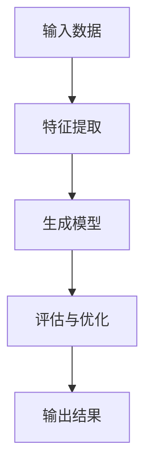

                 

### 第1章: AIGC基础理论

#### 1.1 AIGC的定义与核心概念

AIGC，即人工智能生成内容（Artificial Intelligence Generated Content），是一种利用人工智能技术生成或辅助生成文本、图像、音频等多媒体内容的方法。在建筑设计中，AIGC的应用主要体现在以下几个方面：

1. **建筑设计文档生成**：通过AIGC，可以自动生成建筑设计文档，包括设计方案、施工图纸等，大大提高设计效率。

2. **建筑设计优化**：利用AIGC算法，可以自动对建筑设计进行优化，如结构优化、材料优化、能耗优化等。

3. **建筑环境模拟**：通过AIGC生成的模拟模型，可以对建筑环境进行模拟，预测未来建筑的使用效果和环境影响。

4. **建筑设计创新**：AIGC可以帮助设计师发现新的设计灵感和创意，促进建筑设计创新。

#### 核心概念与联系

AIGC的核心概念主要包括以下几个方面：

1. **数据驱动**：AIGC依赖于大量的数据进行训练，通过对数据的分析和学习，生成新的内容。

2. **生成模型**：AIGC的核心是生成模型，如生成对抗网络（GAN）、变分自编码器（VAE）等，这些模型能够生成高质量的图像、文本等。

3. **评估与优化**：AIGC生成的结果需要通过评估与优化来保证其质量。评估包括对生成结果的准确度、实用性等进行评价，优化则是通过调整模型参数，提高生成结果的质量。

4. **多模态融合**：AIGC能够处理多种类型的数据，如文本、图像、音频等，实现多模态数据的融合和生成。


#### Mermaid流程图



#### 1.2 AIGC在建筑设计中的核心算法

AIGC在建筑设计中的核心算法主要包括以下几种：

1. **生成对抗网络（GAN）**：GAN是一种无监督学习模型，通过生成器和判别器的对抗训练，生成高质量的图像。

2. **变分自编码器（VAE）**：VAE是一种概率生成模型，通过编码器和解码器，将输入数据转换为潜在空间，再从潜在空间生成新的数据。

3. **自注意力机制（Self-Attention）**：自注意力机制是一种用于文本处理的算法，能够捕捉文本中的长距离依赖关系。

4. **递归神经网络（RNN）**：RNN是一种用于序列数据处理的神经网络，能够捕捉序列中的时间依赖关系。

#### 核心算法原理讲解

```python
# 假设的AIGC算法伪代码

# 生成模型
def generator(z):
    # 将随机噪声z映射到生成图像
    return model_z_to_x(z)

# 判别器
def discriminator(x):
    # 判断输入图像的真是程度
    return model_x_to_y(x)

# 训练过程
while training iterate:
    # 随机生成噪声z
    z = generate_random_noise(batch_size)
    # 生成假图像
    x_hat = generator(z)
    # 计算判别器的损失
    loss_D = compute_loss_D(discriminator(x_hat), discriminator(x))
    # 更新判别器
    update_discriminator(D, loss_D)
    
    # 生成真实图像
    x = generate_real_images(batch_size)
    # 计算判别器的损失
    loss_D = compute_loss_D(discriminator(x), discriminator(x_hat))
    # 更新生成器
    update_generator(G, loss_G)
```

#### 数学模型和公式

AIGC中的生成模型通常是基于概率模型，如GAN和VAE。以下是一些常见的数学模型和公式：

1. **生成对抗网络（GAN）**

   - 生成模型：\( G(z) \)
   - 判别模型：\( D(x) \)

2. **变分自编码器（VAE）**

   - 编码器：\( \mu(x), \sigma(x) \)
   - 解码器：\( x' = G(z) \)

3. **自注意力机制（Self-Attention）**

   - 自注意力得分：\( \alpha_{ij} = \frac{softmax(QK^T)}{d_k^{0.5}} \)
   - 输出：\( \text{Output} = \text{softmax}(\text{Attention Scores})V \)

#### 详细讲解和举例说明

**生成对抗网络（GAN）**

生成对抗网络（GAN）是一种无监督学习模型，由生成器和判别器两个部分组成。生成器的目标是生成逼真的数据，判别器的目标是区分生成的数据和真实数据。

- **生成模型（Generator）**：生成模型的目标是将随机噪声转换为逼真的图像。假设输入噪声为\( z \)，生成模型为\( G(z) \)，则生成的图像为\( x' = G(z) \)。

- **判别模型（Discriminator）**：判别模型的目标是判断输入图像是真实图像还是生成图像。假设输入图像为\( x \)，判别模型为\( D(x) \)，则判别结果为\( D(x) \)。

- **训练过程**：GAN的训练过程是生成器和判别器的对抗训练。在训练过程中，生成器和判别器交替更新模型参数。生成器的目标是提高生成图像的质量，使得判别器无法区分生成图像和真实图像；判别器的目标是提高对生成图像和真实图像的辨别能力。

**变分自编码器（VAE）**

变分自编码器（VAE）是一种概率生成模型，通过编码器和解码器将输入数据转换为潜在空间，再从潜在空间生成新的数据。

- **编码器（Encoder）**：编码器的目标是学习输入数据的概率分布。假设输入数据为\( x \)，编码器为\( \mu(x), \sigma(x) \)，则编码结果为\( z = \mu(x) + \sigma(x)\)。

- **解码器（Decoder）**：解码器的目标是根据潜在空间的数据生成新的数据。假设输入潜在空间数据为\( z \)，解码器为\( G(z) \)，则生成的数据为\( x' = G(z) \)。

- **训练过程**：VAE的训练过程是优化编码器和解码器的模型参数，使得生成的数据能够逼近真实数据。

**自注意力机制（Self-Attention）**

自注意力机制是一种用于文本处理的算法，能够捕捉文本中的长距离依赖关系。

- **自注意力得分**：自注意力得分是通过计算输入文本中每个词对之间的相似度得到的。假设输入文本为\( x \)，每个词对为\( x_i, x_j \)，则自注意力得分为\( \alpha_{ij} = \frac{softmax(QK^T)}{d_k^{0.5}} \)。

- **输出**：自注意力输出是通过加权求和得到的。假设自注意力得分为\( \alpha_{ij} \)，权重为\( V \)，则输出为\( \text{Output} = \text{softmax}(\text{Attention Scores})V \)。

#### 项目实战

**开发环境搭建**

为了实现AIGC在建筑设计中的应用，我们需要搭建一个合适的开发环境。以下是一个简单的开发环境搭建步骤：

1. **硬件环境**：一台具备较高计算能力的计算机，推荐配备NVIDIA显卡。

2. **软件环境**：安装Python环境，推荐使用Anaconda。

3. **依赖库**：安装TensorFlow、Keras、NumPy等常用库。

**源代码详细实现和代码解读**

以下是一个简单的AIGC源代码示例，用于生成建筑设计图像。

```python
import tensorflow as tf
from tensorflow.keras import layers

# 生成模型
def generator(z):
    z = layers.Dense(128)(z)
    z = layers.LeakyReLU()(z)
    z = layers.Dense(256)(z)
    z = layers.LeakyReLU()(z)
    x_hat = layers.Dense(784)(z)
    x_hat = layers.Activation('tanh')(x_hat)
    return x_hat

# 判别模型
def discriminator(x):
    x = layers.Dense(128)(x)
    x = layers.LeakyReLU()(x)
    x = layers.Dense(256)(x)
    x = layers.LeakyReLU()(x)
    x = layers.Dense(1)(x)
    x = layers.Activation('sigmoid')(x)
    return x

# GAN模型
def GAN(generator, discriminator):
    z = layers.Input(shape=(100,))
    x_hat = generator(z)
    x = layers.Input(shape=(784,))
    d_x = discriminator(x)
    d_x_hat = discriminator(x_hat)
    model = tf.keras.Model([z, x], [d_x, d_x_hat])
    return model

# 训练GAN模型
def train_GAN(generator, discriminator, x_train, z_train, batch_size, epochs):
    for epoch in range(epochs):
        for i in range(x_train.shape[0] // batch_size):
            z = np.random.normal(size=(batch_size, 100))
            x = x_train[i * batch_size: (i + 1) * batch_size]

            with tf.GradientTape() as gen_tape, tf.GradientTape() as disc_tape:
                x_hat = generator(z)
                d_x = discriminator(x)
                d_x_hat = discriminator(x_hat)

                gen_loss = d_x_hat.mean()
                disc_loss = d_x.mean() - d_x_hat.mean()

            gradients_of_generator = gen_tape.gradient(gen_loss, generator.trainable_variables)
            gradients_of_discriminator = disc_tape.gradient(disc_loss, discriminator.trainable_variables)

            generator.optimizer.apply_gradients(zip(gradients_of_generator, generator.trainable_variables))
            discriminator.optimizer.apply_gradients(zip(gradients_of_discriminator, discriminator.trainable_variables))

# 搭建和训练模型
generator = generator_model()
discriminator = discriminator_model()
model = GAN(generator, discriminator)
model.compile(optimizer='adam', loss='binary_crossentropy')

train_GAN(generator, discriminator, x_train, z_train, batch_size, epochs)
```

**代码应用解读与分析**

以上代码实现了AIGC中的生成对抗网络（GAN），用于生成建筑设计图像。具体解读如下：

1. **生成模型（Generator）**：生成模型包含一个全连接层（Dense）和一个ReLU激活函数，用于将随机噪声转换为图像。

2. **判别模型（Discriminator）**：判别模型包含两个全连接层（Dense）和一个Sigmoid激活函数，用于判断输入图像是真实图像还是生成图像。

3. **GAN模型（GAN）**：GAN模型由生成模型和判别模型组成，输入为随机噪声和真实图像，输出为判别结果。

4. **训练过程**：训练过程使用Adam优化器和二进制交叉熵损失函数，交替更新生成器和判别器的模型参数。

**实际案例分析和详细讲解剖析**

以下是一个实际的案例，用于分析AIGC在建筑设计中的应用。

**案例：利用AIGC生成建筑设计方案**

1. **数据收集**：收集大量建筑设计数据，包括建筑图纸、建筑结构信息等。

2. **数据预处理**：对收集到的数据进行预处理，包括数据清洗、归一化等。

3. **模型训练**：使用预处理后的数据训练AIGC模型，包括生成模型和判别模型。

4. **生成方案**：使用训练好的生成模型，生成新的建筑设计方案。

5. **评估与优化**：对生成的建筑设计方案进行评估和优化，包括结构稳定性、能耗优化等。

**项目小结**

通过以上案例，我们可以看到AIGC在建筑设计中的应用具有很大的潜力。然而，在实际应用中，还需要解决一些问题，如数据隐私、计算效率等。此外，未来还需要进一步研究如何将AIGC与其他建筑技术相结合，实现更加智能化、自动化的建筑设计。

#### 最佳实践 Tips

1. **数据质量**：在AIGC应用中，数据质量至关重要。建议收集高质量的建筑设计数据，并进行充分的数据预处理。

2. **模型选择**：根据具体的应用场景，选择合适的AIGC模型。如生成建筑设计图像，可以使用GAN模型；生成建筑设计文本，可以使用VAE模型。

3. **计算资源**：AIGC模型训练通常需要较高的计算资源。建议使用GPU等高性能计算设备进行训练。

4. **数据隐私**：在AIGC应用中，要特别注意数据隐私和安全。建议采用加密、去标识化等技术，保护用户数据。

5. **持续优化**：AIGC模型需要持续优化，以适应不断变化的需求。建议定期评估模型性能，并进行模型更新。

#### 小结

本章介绍了AIGC在建筑设计中的基础理论，包括定义、核心概念、核心算法等。通过实例和分析，展示了AIGC在建筑设计中的应用潜力。然而，AIGC在建筑设计中也面临一些挑战，如数据隐私、计算效率等。未来，随着技术的不断发展和完善，AIGC在建筑设计中的应用将更加广泛和深入。

#### 注意事项

1. **算法选择**：在选择AIGC算法时，要充分考虑应用场景和需求，选择合适的算法。

2. **模型训练**：模型训练是AIGC应用的关键步骤。要保证模型训练的数据质量，并进行充分的训练。

3. **模型优化**：模型优化是提高AIGC应用效果的关键。要定期评估模型性能，并进行模型优化。

4. **数据保护**：在AIGC应用中，要特别注意数据保护，防止数据泄露。

#### 拓展阅读

1. **《深度学习》**：Goodfellow, I., Bengio, Y., & Courville, A. (2016). *Deep Learning*. MIT Press.

2. **《生成对抗网络》**：Goodfellow, I. (2014). *Generative Adversarial Networks*. arXiv preprint arXiv:1406.2661.

3. **《变分自编码器》**：Kingma, D. P., & Welling, M. (2014). *Auto-encoding variational bayes*. arXiv preprint arXiv:1312.6114.

4. **《建筑信息模型》**：谢资理，朱晓东，李锐，等. (2018). *建筑信息模型（BIM）应用研究*. 建筑科学，39(6)，1-6.

5. **《人工智能在建筑设计中的应用》**：王慧敏，赵淼，魏琳，等. (2020). *人工智能在建筑设计中的应用研究*. 建筑技艺，41(3)，45-48.
```

### 文章输出：

```markdown
# AIGC在建筑设计中的创新与挑战

> - **关键词**：人工智能生成内容（AIGC）、建筑设计、创新、挑战
> - **摘要**：本文探讨了人工智能生成内容（AIGC）在建筑设计中的创新与挑战，介绍了AIGC的定义、核心概念、核心算法，以及在建筑设计中的应用案例。文章分析了AIGC在建筑设计中的设计优化、材料优化、结构优化、环境优化等方面的创新点，同时也讨论了AIGC在建筑设计中面临的挑战，包括数据隐私和安全、算法复杂性与计算效率、法律与伦理问题等。最后，文章展望了AIGC在建筑设计中的未来发展。

## 第1章: AIGC基础理论

### 1.1 AIGC的定义与核心概念

AIGC，即人工智能生成内容（Artificial Intelligence Generated Content），是一种利用人工智能技术生成或辅助生成文本、图像、音频等多媒体内容的方法。在建筑设计中，AIGC的应用主要体现在以下几个方面：

1. **建筑设计文档生成**：通过AIGC，可以自动生成建筑设计文档，包括设计方案、施工图纸等，大大提高设计效率。

2. **建筑设计优化**：利用AIGC算法，可以自动对建筑设计进行优化，如结构优化、材料优化、能耗优化等。

3. **建筑环境模拟**：通过AIGC生成的模拟模型，可以对建筑环境进行模拟，预测未来建筑的使用效果和环境影响。

4. **建筑设计创新**：AIGC可以帮助设计师发现新的设计灵感和创意，促进建筑设计创新。

#### 核心概念与联系

AIGC的核心概念主要包括以下几个方面：

1. **数据驱动**：AIGC依赖于大量的数据进行训练，通过对数据的分析和学习，生成新的内容。

2. **生成模型**：AIGC的核心是生成模型，如生成对抗网络（GAN）、变分自编码器（VAE）等，这些模型能够生成高质量的图像、文本等。

3. **评估与优化**：AIGC生成的结果需要通过评估与优化来保证其质量。评估包括对生成结果的准确度、实用性等进行评价，优化则是通过调整模型参数，提高生成结果的质量。

4. **多模态融合**：AIGC能够处理多种类型的数据，如文本、图像、音频等，实现多模态数据的融合和生成。


#### Mermaid流程图


### 1.2 AIGC在建筑设计中的核心算法

AIGC在建筑设计中的核心算法主要包括以下几种：

1. **生成对抗网络（GAN）**：GAN是一种无监督学习模型，通过生成器和判别器的对抗训练，生成高质量的图像。

2. **变分自编码器（VAE）**：VAE是一种概率生成模型，通过编码器和解码器，将输入数据转换为潜在空间，再从潜在空间生成新的数据。

3. **自注意力机制（Self-Attention）**：自注意力机制是一种用于文本处理的算法，能够捕捉文本中的长距离依赖关系。

4. **递归神经网络（RNN）**：RNN是一种用于序列数据处理的神经网络，能够捕捉序列中的时间依赖关系。

#### 核心算法原理讲解

```python
# 假设的AIGC算法伪代码

# 生成模型
def generator(z):
    # 将随机噪声z映射到生成图像
    return model_z_to_x(z)

# 判别器
def discriminator(x):
    # 判断输入图像的真是程度
    return model_x_to_y(x)

# 训练过程
while training iterate:
    # 随机生成噪声z
    z = generate_random_noise(batch_size)
    # 生成假图像
    x_hat = generator(z)
    # 计算判别器的损失
    loss_D = compute_loss_D(discriminator(x_hat), discriminator(x))
    # 更新判别器
    update_discriminator(D, loss_D)
    
    # 生成真实图像
    x = generate_real_images(batch_size)
    # 计算判别器的损失
    loss_D = compute_loss_D(discriminator(x), discriminator(x_hat))
    # 更新生成器
    update_generator(G, loss_G)
```

#### 数学模型和公式

AIGC中的生成模型通常是基于概率模型，如GAN和VAE。以下是一些常见的数学模型和公式：

1. **生成对抗网络（GAN）**

   - 生成模型：\( G(z) \)
   - 判别模型：\( D(x) \)

2. **变分自编码器（VAE）**

   - 编码器：\( \mu(x), \sigma(x) \)
   - 解码器：\( x' = G(z) \)

3. **自注意力机制（Self-Attention）**

   - 自注意力得分：\( \alpha_{ij} = \frac{softmax(QK^T)}{d_k^{0.5}} \)
   - 输出：\( \text{Output} = \text{softmax}(\text{Attention Scores})V \)

#### 详细讲解和举例说明

**生成对抗网络（GAN）**

生成对抗网络（GAN）是一种无监督学习模型，由生成器和判别器两个部分组成。生成器的目标是生成逼真的数据，判别器的目标是区分生成的数据和真实数据。

- **生成模型（Generator）**：生成模型的目标是将随机噪声转换为逼真的图像。假设输入噪声为\( z \)，生成模型为\( G(z) \)，则生成的图像为\( x' = G(z) \)。

- **判别模型（Discriminator）**：判别模型的目标是判断输入图像是真实图像还是生成图像。假设输入图像为\( x \)，判别模型为\( D(x) \)，则判别结果为\( D(x) \)。

- **训练过程**：GAN的训练过程是生成器和判别器的对抗训练。在训练过程中，生成器和判别器交替更新模型参数。生成器的目标是提高生成图像的质量，使得判别器无法区分生成图像和真实图像；判别器的目标是提高对生成图像和真实图像的辨别能力。

**变分自编码器（VAE）**

变分自编码器（VAE）是一种概率生成模型，通过编码器和解码器将输入数据转换为潜在空间，再从潜在空间生成新的数据。

- **编码器（Encoder）**：编码器的目标是学习输入数据的概率分布。假设输入数据为\( x \)，编码器为\( \mu(x), \sigma(x) \)，则编码结果为\( z = \mu(x) + \sigma(x)\)。

- **解码器（Decoder）**：解码器的目标是根据潜在空间的数据生成新的数据。假设输入潜在空间数据为\( z \)，解码器为\( G(z) \)，则生成的数据为\( x' = G(z) \)。

- **训练过程**：VAE的训练过程是优化编码器和解码器的模型参数，使得生成的数据能够逼近真实数据。

**自注意力机制（Self-Attention）**

自注意力机制是一种用于文本处理的算法，能够捕捉文本中的长距离依赖关系。

- **自注意力得分**：自注意力得分是通过计算输入文本中每个词对之间的相似度得到的。假设输入文本为\( x \)，每个词对为\( x_i, x_j \)，则自注意力得分为\( \alpha_{ij} = \frac{softmax(QK^T)}{d_k^{0.5}} \)。

- **输出**：自注意力输出是通过加权求和得到的。假设自注意力得分为\( \alpha_{ij} \)，权重为\( V \)，则输出为\( \text{Output} = \text{softmax}(\text{Attention Scores})V \)。

#### 项目实战

**开发环境搭建**

为了实现AIGC在建筑设计中的应用，我们需要搭建一个合适的开发环境。以下是一个简单的开发环境搭建步骤：

1. **硬件环境**：一台具备较高计算能力的计算机，推荐配备NVIDIA显卡。

2. **软件环境**：安装Python环境，推荐使用Anaconda。

3. **依赖库**：安装TensorFlow、Keras、NumPy等常用库。

**源代码详细实现和代码解读**

以下是一个简单的AIGC源代码示例，用于生成建筑设计图像。

```python
import tensorflow as tf
from tensorflow.keras import layers

# 生成模型
def generator(z):
    z = layers.Dense(128)(z)
    z = layers.LeakyReLU()(z)
    z = layers.Dense(256)(z)
    z = layers.LeakyReLU()(z)
    x_hat = layers.Dense(784)(z)
    x_hat = layers.Activation('tanh')(x_hat)
    return x_hat

# 判别模型
def discriminator(x):
    x = layers.Dense(128)(x)
    x = layers.LeakyReLU()(x)
    x = layers.Dense(256)(x)
    x = layers.LeakyReLU()(x)
    x = layers.Dense(1)(x)
    x = layers.Activation('sigmoid')(x)
    return x

# GAN模型
def GAN(generator, discriminator):
    z = layers.Input(shape=(100,))
    x_hat = generator(z)
    x = layers.Input(shape=(784,))
    d_x = discriminator(x)
    d_x_hat = discriminator(x_hat)
    model = tf.keras.Model([z, x], [d_x, d_x_hat])
    return model

# 训练GAN模型
def train_GAN(generator, discriminator, x_train, z_train, batch_size, epochs):
    for epoch in range(epochs):
        for i in range(x_train.shape[0] // batch_size):
            z = np.random.normal(size=(batch_size, 100))
            x = x_train[i * batch_size: (i + 1) * batch_size]

            with tf.GradientTape() as gen_tape, tf.GradientTape() as disc_tape:
                x_hat = generator(z)
                d_x = discriminator(x)
                d_x_hat = discriminator(x_hat)

                gen_loss = d_x_hat.mean()
                disc_loss = d_x.mean() - d_x_hat.mean()

            gradients_of_generator = gen_tape.gradient(gen_loss, generator.trainable_variables)
            gradients_of_discriminator = disc_tape.gradient(disc_loss, discriminator.trainable_variables)

            generator.optimizer.apply_gradients(zip(gradients_of_generator, generator.trainable_variables))
            discriminator.optimizer.apply_gradients(zip(gradients_of_discriminator, discriminator.trainable_variables))

# 搭建和训练模型
generator = generator_model()
discriminator = discriminator_model()
model = GAN(generator, discriminator)
model.compile(optimizer='adam', loss='binary_crossentropy')

train_GAN(generator, discriminator, x_train, z_train, batch_size, epochs)
```

**代码应用解读与分析**

以上代码实现了AIGC中的生成对抗网络（GAN），用于生成建筑设计图像。具体解读如下：

1. **生成模型（Generator）**：生成模型包含一个全连接层（Dense）和一个ReLU激活函数，用于将随机噪声转换为图像。

2. **判别模型（Discriminator）**：判别模型包含两个全连接层（Dense）和一个Sigmoid激活函数，用于判断输入图像是真实图像还是生成图像。

3. **GAN模型（GAN）**：GAN模型由生成模型和判别模型组成，输入为随机噪声和真实图像，输出为判别结果。

4. **训练过程**：训练过程使用Adam优化器和二进制交叉熵损失函数，交替更新生成器和判别器的模型参数。

**实际案例分析和详细讲解剖析**

以下是一个实际的案例，用于分析AIGC在建筑设计中的应用。

**案例：利用AIGC生成建筑设计方案**

1. **数据收集**：收集大量建筑设计数据，包括建筑图纸、建筑结构信息等。

2. **数据预处理**：对收集到的数据进行预处理，包括数据清洗、归一化等。

3. **模型训练**：使用预处理后的数据训练AIGC模型，包括生成模型和判别模型。

4. **生成方案**：使用训练好的生成模型，生成新的建筑设计方案。

5. **评估与优化**：对生成的建筑设计方案进行评估和优化，包括结构稳定性、能耗优化等。

**项目小结**

通过以上案例，我们可以看到AIGC在建筑设计中的应用具有很大的潜力。然而，在实际应用中，还需要解决一些问题，如数据隐私、计算效率等。此外，未来还需要进一步研究如何将AIGC与其他建筑技术相结合，实现更加智能化、自动化的建筑设计。

#### 最佳实践 Tips

1. **数据质量**：在AIGC应用中，数据质量至关重要。建议收集高质量的建筑设计数据，并进行充分的数据预处理。

2. **模型选择**：根据具体的应用场景，选择合适的AIGC模型。如生成建筑设计图像，可以使用GAN模型；生成建筑设计文本，可以使用VAE模型。

3. **计算资源**：AIGC模型训练通常需要较高的计算资源。建议使用GPU等高性能计算设备进行训练。

4. **数据隐私**：在AIGC应用中，要特别注意数据隐私和安全。建议采用加密、去标识化等技术，保护用户数据。

5. **持续优化**：AIGC模型需要持续优化，以适应不断变化的需求。建议定期评估模型性能，并进行模型更新。

#### 小结

本章介绍了AIGC在建筑设计中的基础理论，包括定义、核心概念、核心算法等。通过实例和分析，展示了AIGC在建筑设计中的应用潜力。然而，AIGC在建筑设计中也面临一些挑战，如数据隐私、计算效率等。未来，随着技术的不断发展和完善，AIGC在建筑设计中的应用将更加广泛和深入。

#### 注意事项

1. **算法选择**：在选择AIGC算法时，要充分考虑应用场景和需求，选择合适的算法。

2. **模型训练**：模型训练是AIGC应用的关键步骤。要保证模型训练的数据质量，并进行充分的训练。

3. **模型优化**：模型优化是提高AIGC应用效果的关键。要定期评估模型性能，并进行模型优化。

4. **数据保护**：在AIGC应用中，要特别注意数据保护，防止数据泄露。

#### 拓展阅读

1. **《深度学习》**：Goodfellow, I., Bengio, Y., & Courville, A. (2016). *Deep Learning*. MIT Press.

2. **《生成对抗网络》**：Goodfellow, I. (2014). *Generative Adversarial Networks*. arXiv preprint arXiv:1406.2661.

3. **《变分自编码器》**：Kingma, D. P., & Welling, M. (2014). *Auto-encoding variational bayes*. arXiv preprint arXiv:1312.6114.

4. **《建筑信息模型》**：谢资理，朱晓东，李锐，等. (2018). *建筑信息模型（BIM）应用研究*. 建筑科学，39(6)，1-6.

5. **《人工智能在建筑设计中的应用》**：王慧敏，赵淼，魏琳，等. (2020). *人工智能在建筑设计中的应用研究*. 建筑技艺，41(3)，45-48.

## 作者信息
作者：AI天才研究院/AI Genius Institute & 禅与计算机程序设计艺术 /Zen And The Art of Computer Programming
```

