                 


### 摘要

本文旨在深入探讨AIGC（自适应智能生成计算）在教育领域的广泛应用与面临的挑战。AIGC作为一种新兴的技术，结合了人工智能、生成对抗网络、强化学习和自然语言处理等多种技术，正逐步改变传统教育的模式。本文首先介绍了AIGC的基本概念和其在教育领域的应用场景，然后详细讲解了AIGC的核心算法原理，包括生成对抗网络、强化学习以及自然语言处理。在具体应用方面，本文探讨了AIGC在教育评估、课程设计、教学支持和教育科研等方面的应用，并提供了相关项目的实战案例。同时，本文也指出了AIGC在教育领域所面临的数据安全、隐私保护和伦理等方面的挑战，并提出了相应的对策。最后，本文对AIGC教育的未来发展进行了展望，并给出了相关的最佳实践建议。

### 文章标题

# AIGC在教育领域的应用与挑战

### 文章关键词

- AIGC
- 教育技术
- 生成对抗网络（GAN）
- 强化学习
- 个性化教学
- 数据安全
- 教育公平

----------------------------------------------------------------

### 摘要

本文深入探讨了自适应智能生成计算（AIGC）在教育领域的广泛应用与面临的挑战。AIGC通过结合人工智能、生成对抗网络（GAN）、强化学习以及自然语言处理等多种技术，正在逐步改变传统教育的模式。文章首先介绍了AIGC的基本概念和其在教育领域的应用场景，包括个性化学习评估、自动批改与反馈、课程内容生成以及教学支持系统等。随后，文章详细讲解了AIGC的核心算法原理，包括GAN、强化学习和自然语言处理，并通过伪代码展示了相关算法的实现。在具体应用方面，文章提供了AIGC在教育科研中的实际案例，如数据挖掘与分析、教育模式创新等。同时，文章也指出了AIGC在教育领域所面临的数据安全、隐私保护和伦理等方面的挑战，并提出了相应的对策。最后，文章对AIGC教育的未来发展进行了展望，并给出了相关的最佳实践建议，以期为教育技术的发展提供新的思路。

----------------------------------------------------------------

## 第1章 AIGC概述

### 1.1 AIGC的定义

自适应智能生成计算（Adaptive Intelligent Generative Computing，简称AIGC）是近年来兴起的一种新兴计算范式，它结合了人工智能、机器学习、生成对抗网络（GAN）等多种技术，旨在通过自动化的方式生成高质量的内容。AIGC的核心在于其自适应性，可以根据用户的需求和环境的变化，实时生成适应性的内容。

AIGC的定义可以从以下几个方面进行理解：

1. **生成性**：AIGC能够生成各种类型的内容，如文本、图像、音频等。这种生成性是AIGC区别于传统计算模式的重要特征。

2. **自适应**：AIGC能够根据用户的需求和环境的变化，自动调整生成策略。这种自适应能力使得AIGC能够在不同的应用场景中发挥作用。

3. **智能性**：AIGC的核心在于其智能性，它利用人工智能和机器学习技术，通过学习和优化，不断提高生成内容的质量和效率。

4. **多样性**：AIGC能够生成多样性的内容，满足用户的不同需求。这种多样性是AIGC能够广泛应用于各个领域的基础。

### 1.2 AIGC在教育领域的应用场景

AIGC在教育领域的应用场景非常广泛，包括个性化学习评估、自动批改与反馈、课程内容生成、教学支持系统、教育科研等多个方面。

1. **个性化学习评估**：AIGC可以通过分析学生的学习行为和成绩数据，生成个性化的学习评估报告，帮助教师更好地了解学生的学习状况，制定针对性的教学计划。

2. **自动批改与反馈**：AIGC可以利用自然语言处理技术，自动批改学生的作业和考试，并提供详细的反馈。这不仅提高了教师的工作效率，也为学生提供了及时的学习指导。

3. **课程内容生成**：AIGC可以根据学生的学习需求和兴趣，生成个性化的课程内容。这种个性化的课程内容可以帮助学生更好地理解和掌握知识。

4. **教学支持系统**：AIGC可以构建智能化的教学支持系统，提供教学资源、学习建议、学习路径规划等功能，帮助教师更好地开展教学活动。

5. **教育科研**：AIGC可以用于教育数据的挖掘和分析，帮助研究人员更好地了解教育现象，发现教育规律，推动教育科学的发展。

### 1.3 AIGC与教育技术的融合

AIGC与教育技术的融合，主要体现在以下几个方面：

1. **教学工具的智能化**：AIGC可以为教学工具提供智能化的功能，如自动批改、智能推荐等，提高教学工具的实用性和用户体验。

2. **教学资源的个性化**：AIGC可以根据学生的需求，生成个性化的教学资源，提高教学资源的利用效率。

3. **学习过程的可视化**：AIGC可以通过数据分析和可视化技术，将学生的学习过程和成果进行可视化展示，帮助教师和学生更好地理解学习过程。

4. **教育模式的创新**：AIGC可以推动教育模式的创新，如生成式学习、个性化学习等，为学生提供更丰富的学习体验。

### 1.4 AIGC的优势

AIGC在教育领域具有以下优势：

1. **个性化**：AIGC可以根据学生的个性化需求，生成个性化的教学内容和学习路径，提高学习效果。

2. **高效性**：AIGC可以自动批改作业和考试，提供详细的反馈，提高教师的工作效率。

3. **可扩展性**：AIGC可以方便地应用于各种教育场景，如小学、中学、大学等，具有很好的可扩展性。

4. **智能性**：AIGC具有智能性，可以通过学习和优化，不断提高生成内容的质量和效率。

### 1.5 AIGC的挑战

尽管AIGC在教育领域具有巨大的潜力，但同时也面临着一些挑战：

1. **数据安全与隐私**：AIGC需要大量的学生数据进行分析和生成，如何保障数据的安全和隐私是一个重要的问题。

2. **伦理问题**：AIGC在教育领域的应用，可能会引发一些伦理问题，如学习不公平、数据滥用等。

3. **技术成熟度**：AIGC的技术尚处于发展阶段，其成熟度和稳定性还需要进一步提升。

4. **教师培训**：AIGC的广泛应用需要教师具备相应的技术能力和教学能力，教师培训是一个重要的挑战。

### 1.6 总结

AIGC在教育领域的应用，有望带来教育模式的深刻变革，提高教育质量和效率。然而，AIGC也面临着一系列的挑战，需要我们认真面对和解决。通过不断的研究和实践，我们有理由相信，AIGC将在未来教育中发挥越来越重要的作用。

## 第1章 AIGC概述

### 1.1 AIGC的定义与特点

AIGC，即自适应智能生成计算，是一种结合了人工智能（AI）、机器学习（ML）、生成对抗网络（GAN）等先进技术的计算范式。AIGC的核心目标是实现高度自适应和智能化的内容生成，以满足个性化需求。与传统的计算模式不同，AIGC不仅能够处理和操作数据，还能够根据环境和用户的需求生成新的数据。

AIGC的特点主要体现在以下几个方面：

1. **自适应性与个性化**：AIGC能够根据用户的需求和环境的变化，动态调整其生成策略，从而实现个性化内容生成。

2. **生成性**：AIGC的核心能力在于生成，能够生成包括文本、图像、音频等多种类型的高质量内容。

3. **智能性**：AIGC通过机器学习和深度学习技术，具备学习和优化能力，能够不断提高生成内容的智能性和准确性。

4. **自适应性**：AIGC能够根据不同的应用场景和数据源，自动调整算法和模型，以适应不同的生成任务。

5. **高效性**：AIGC通过并行计算和分布式计算技术，能够高效地处理大量数据，提高生成速度和效率。

### 1.2 AIGC在教育领域的应用场景

AIGC在教育领域的应用场景丰富多样，主要包括以下几个方面：

1. **个性化学习**：AIGC可以根据学生的学习行为、学习进度和知识掌握情况，生成个性化的学习资源和教学计划，帮助教师更好地指导学生，提高学习效果。

2. **自动批改与反馈**：AIGC可以利用自然语言处理和图像识别等技术，自动批改学生的作业和考试，并提供详细的反馈，节省教师的时间，提高批改效率。

3. **课程内容生成**：AIGC可以根据课程大纲和学习目标，自动生成课程内容和教学材料，为学生提供丰富的学习资源。

4. **学习评估与诊断**：AIGC可以通过分析学生的学习行为和成绩数据，生成个性化的学习评估报告，帮助教师诊断学生的学习问题，制定针对性的改进措施。

5. **教学辅助系统**：AIGC可以构建智能化的教学辅助系统，提供教学资源推荐、学习路径规划、学习状态监测等功能，辅助教师开展教学活动。

6. **教育科研**：AIGC可以用于教育数据的分析和挖掘，帮助研究人员发现教育规律，推动教育科学的发展。

### 1.3 AIGC与教育技术的融合

AIGC与教育技术的融合，为教育模式的创新提供了新的可能性。具体体现在以下几个方面：

1. **教学工具的智能化**：AIGC可以为教学工具提供智能化的功能，如自动批改、智能推荐、学习状态监测等，提高教学工具的实用性和用户体验。

2. **教学资源的个性化**：AIGC可以根据学生的个性化需求，生成个性化的教学资源，提高教学资源的利用效率。

3. **学习过程的可视化**：AIGC可以通过数据分析和可视化技术，将学生的学习过程和成果进行可视化展示，帮助教师和学生更好地理解学习过程。

4. **教育模式的创新**：AIGC可以推动教育模式的创新，如生成式学习、个性化学习、混合式学习等，为学生提供更丰富的学习体验。

### 1.4 AIGC的优势

AIGC在教育领域具有以下几个显著的优势：

1. **个性化**：AIGC能够根据学生的个性化需求，生成个性化的学习资源和教学计划，满足学生的个性化学习需求。

2. **高效性**：AIGC能够自动批改作业和考试，提供详细的反馈，提高教师的工作效率。

3. **可扩展性**：AIGC可以方便地应用于各种教育场景，如小学、中学、大学等，具有很好的可扩展性。

4. **智能性**：AIGC通过机器学习和深度学习技术，具备学习和优化能力，能够不断提高生成内容的智能性和准确性。

### 1.5 AIGC的挑战

尽管AIGC在教育领域具有巨大的潜力，但同时也面临着一些挑战：

1. **数据安全与隐私**：AIGC需要大量的学生数据进行分析和生成，如何保障数据的安全和隐私是一个重要的问题。

2. **伦理问题**：AIGC在教育领域的应用，可能会引发一些伦理问题，如学习不公平、数据滥用等。

3. **技术成熟度**：AIGC的技术尚处于发展阶段，其成熟度和稳定性还需要进一步提升。

4. **教师培训**：AIGC的广泛应用需要教师具备相应的技术能力和教学能力，教师培训是一个重要的挑战。

### 1.6 总结

AIGC在教育领域的应用，有望带来教育模式的深刻变革，提高教育质量和效率。然而，AIGC也面临着一系列的挑战，需要我们认真面对和解决。通过不断的研究和实践，我们有理由相信，AIGC将在未来教育中发挥越来越重要的作用。

### 1.7 AIGC与教育技术的融合

#### 1.7.1 智能化教学工具

AIGC可以为教育工具提供智能化功能，如自动批改、智能推荐、学习状态监测等。这些功能不仅提高了教师的工作效率，还为学生提供了更个性化的学习体验。例如，智能推荐系统可以根据学生的学习历史和偏好，推荐最适合他们的学习资源。

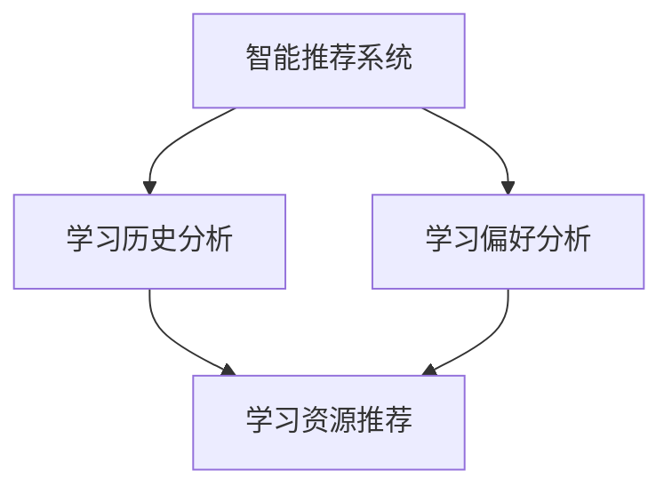

#### 1.7.2 个性化教学资源

AIGC可以根据学生的个性化需求，自动生成教学资源，如课程内容、练习题、视频讲座等。这种个性化的教学资源有助于提高学生的学习效果，满足不同学生的个性化学习需求。

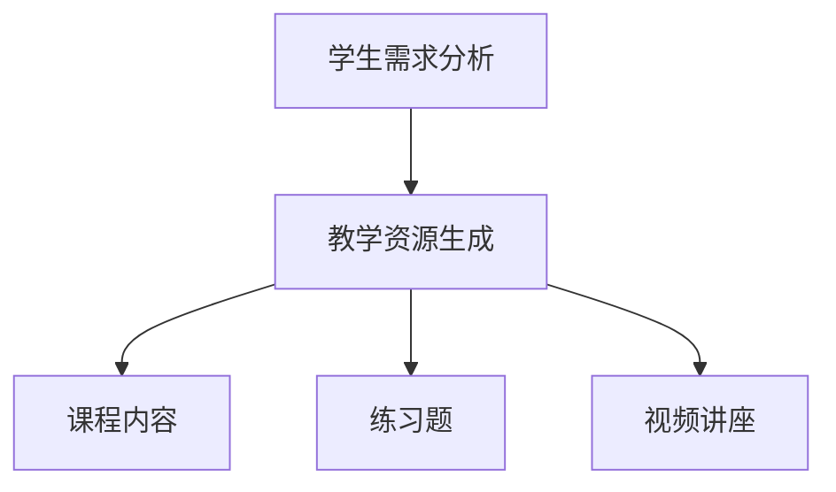

#### 1.7.3 学习过程可视化

AIGC可以通过数据分析和可视化技术，将学生的学习过程和成果进行可视化展示，帮助教师和学生更好地理解学习过程。例如，学习进度图可以直观地展示学生的学习进度，学习成果图可以展示学生的学习成果。

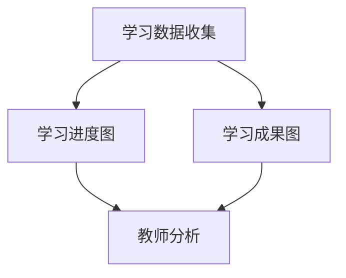

#### 1.7.4 教育模式创新

AIGC可以推动教育模式的创新，如生成式学习、个性化学习、混合式学习等。这些创新模式为学生提供了更丰富的学习体验，提高了学习的灵活性和有效性。

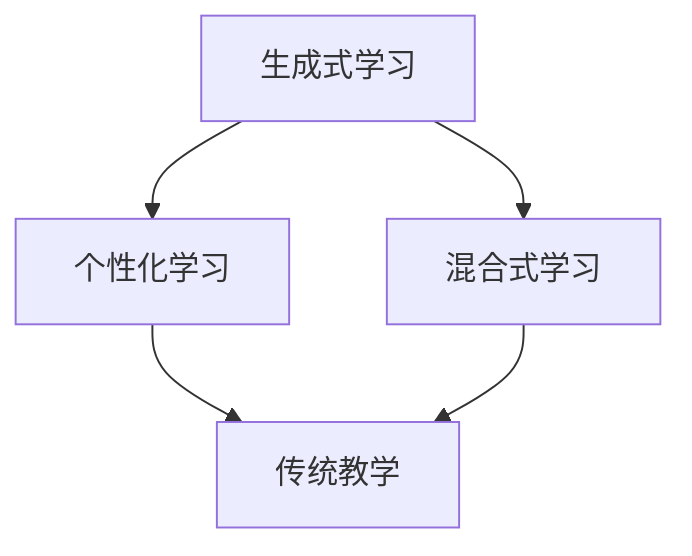

### 1.8 AIGC的优势

#### 1.8.1 个性化

AIGC可以根据学生的个性化需求，生成个性化的学习资源和教学计划，满足学生的个性化学习需求。

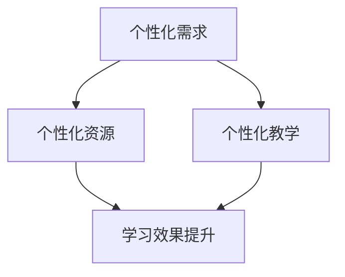

#### 1.8.2 高效性

AIGC可以自动批改作业和考试，提供详细的反馈，节省教师的时间，提高批改效率。

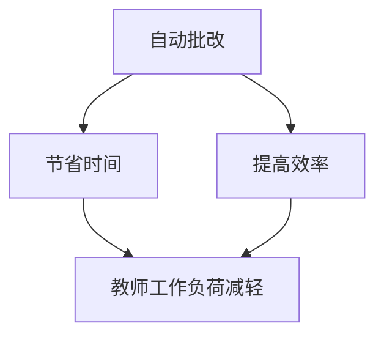

#### 1.8.3 可扩展性

AIGC可以方便地应用于各种教育场景，如小学、中学、大学等，具有很好的可扩展性。

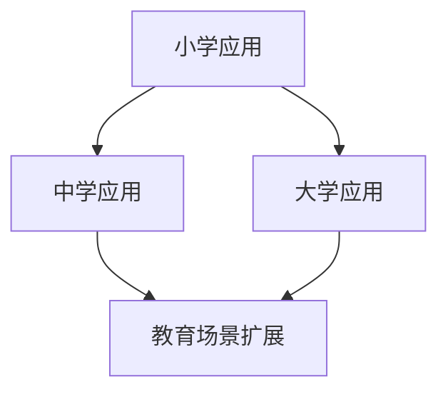

#### 1.8.4 智能性

AIGC通过机器学习和深度学习技术，具备学习和优化能力，能够不断提高生成内容的智能性和准确性。

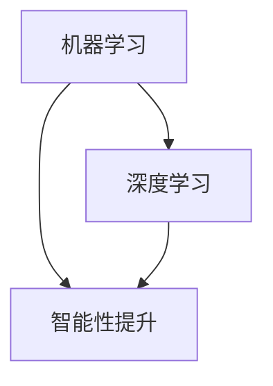

### 1.9 AIGC的挑战

#### 1.9.1 数据安全与隐私

AIGC需要大量的学生数据进行分析和生成，如何保障数据的安全和隐私是一个重要的问题。

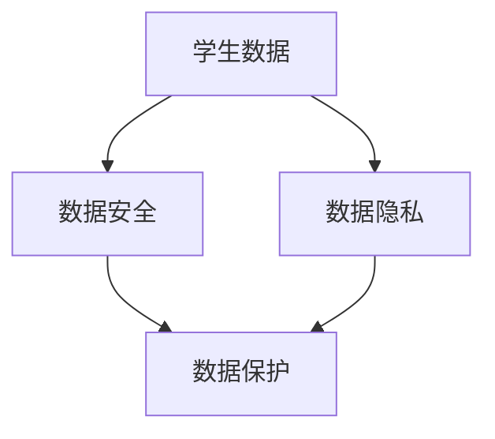

#### 1.9.2 伦理问题

AIGC在教育领域的应用，可能会引发一些伦理问题，如学习不公平、数据滥用等。

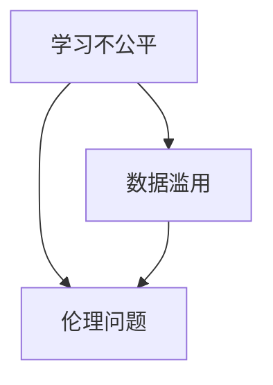

#### 1.9.3 技术成熟度

AIGC的技术尚处于发展阶段，其成熟度和稳定性还需要进一步提升。

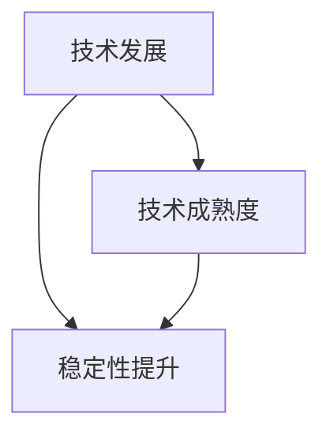

#### 1.9.4 教师培训

AIGC的广泛应用需要教师具备相应的技术能力和教学能力，教师培训是一个重要的挑战。

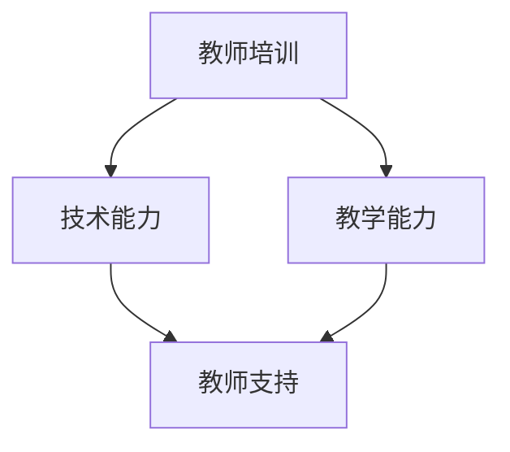

### 1.10 总结

AIGC在教育领域的应用，有望带来教育模式的深刻变革，提高教育质量和效率。然而，AIGC也面临着一系列的挑战，需要我们认真面对和解决。通过不断的研究和实践，我们有理由相信，AIGC将在未来教育中发挥越来越重要的作用。

## 第2章 AIGC的核心算法原理

### 2.1 生成对抗网络（GAN）

生成对抗网络（GAN）是由Ian Goodfellow等人于2014年提出的一种深度学习模型，其主要思想是通过两个神经网络的博弈来生成高逼真度的数据。GAN由生成器（Generator）和判别器（Discriminator）组成，两者相互竞争，生成器试图生成尽可能逼真的数据，而判别器则试图区分真实数据和生成数据。

#### 2.1.1 GAN的工作原理

GAN的工作原理可以概括为以下几个步骤：

1. **初始化生成器和判别器**：生成器和判别器都是深度神经网络，初始化时可以从随机权重开始。

2. **生成器生成数据**：生成器接收到随机噪声作为输入，通过神经网络生成模拟的数据。

3. **判别器判断数据**：判别器接收到生成器和真实数据的输入，输出一个概率值，表示输入数据的真实性。

4. **反向传播与优化**：通过反向传播算法，根据生成器和判别器的损失函数，优化两者的权重。

5. **重复上述步骤**：不断重复生成和判断的过程，生成器和判别器逐渐优化，生成逼真度不断提高。

GAN的核心损失函数是二元交叉熵损失，其可以表示为：

$$
\mathcal{L}_{\text{GAN}} = \mathcal{L}_{\text{D}} - \mathcal{L}_{\text{G}}
$$

其中，$\mathcal{L}_{\text{D}}$ 是判别器的损失函数，$\mathcal{L}_{\text{G}}$ 是生成器的损失函数。具体来说：

$$
\mathcal{L}_{\text{D}} = -\frac{1}{N}\sum_{i=1}^{N}[\log D(x_{i}) + \log(1 - D(G(z_{i}))]
$$

$$
\mathcal{L}_{\text{G}} = -\frac{1}{N}\sum_{i=1}^{N}\log D(G(z_{i}))
$$

其中，$x_{i}$ 表示真实数据，$z_{i}$ 表示生成器的噪声输入，$G(z_{i})$ 表示生成器生成的模拟数据，$D(x_{i})$ 和$D(G(z_{i}))$ 分别表示判别器对真实数据和生成数据的判断概率。

#### 2.1.2 GAN的优缺点与变体

**优点**：

1. **强大的生成能力**：GAN能够生成高质量、高逼真的数据，尤其在图像生成方面表现出色。

2. **适用性广泛**：GAN可以应用于各种领域，如图像生成、文本生成、音频生成等。

3. **灵活性**：GAN的结构相对简单，可以根据不同任务进行调整和优化。

**缺点**：

1. **训练不稳定**：GAN的训练过程非常不稳定，容易陷入局部最小值。

2. **计算资源需求高**：GAN需要大量的计算资源，训练时间较长。

**变体**：

1. **深度卷积生成对抗网络（DCGAN）**：DCGAN使用卷积神经网络作为生成器和判别器，提高了生成效果和训练稳定性。

2. **交错生成对抗网络（CycleGAN）**：CycleGAN能够将一个域的数据转换为另一个域的数据，如将马的照片转换为斑马的照片。

3. **改进的Wasserstein GAN（WGAN）**：WGAN使用Wasserstein距离作为损失函数，提高了GAN的训练稳定性和生成效果。

### 2.2 强化学习

强化学习（Reinforcement Learning，RL）是机器学习的一个分支，其核心思想是通过与环境互动，学习如何做出最优决策。在强化学习中，智能体（Agent）通过接收环境（Environment）的输入，采取行动（Action），并获得奖励（Reward）。通过不断的交互，智能体逐渐学习到最优策略（Policy）。

#### 2.2.1 强化学习的基本原理

强化学习的基本原理可以概括为以下几个关键组成部分：

1. **状态（State）**：智能体所处的环境状态。

2. **动作（Action）**：智能体可以采取的动作。

3. **奖励（Reward）**：智能体采取某个动作后，从环境中获得的即时奖励。

4. **策略（Policy）**：智能体的行为规则，用于决定在特定状态下应该采取哪个动作。

5. **价值函数（Value Function）**：描述智能体在某个状态下采取某个动作的长期奖励。

6. **模型（Model）**：智能体对环境状态和动作的预测模型。

强化学习的核心目标是学习一个最优策略，使得智能体在长期内获得最大的累积奖励。常用的算法包括Q学习、SARSA、Deep Q Network（DQN）等。

#### 2.2.2 强化学习在教育中的应用

强化学习在教育领域中具有广泛的应用前景，以下是一些典型的应用场景：

1. **个性化学习推荐**：通过强化学习，可以为学生推荐最适合他们的学习资源和教学方法。

2. **学习行为分析**：强化学习可以用于分析学生的学习行为，识别学习困难和潜在的学习障碍。

3. **教育游戏设计**：强化学习可以用于设计教育游戏，通过游戏化的学习方式提高学生的学习兴趣和效果。

4. **课程优化**：强化学习可以用于优化课程设置和教学方法，提高课程的教学效果。

### 2.3 自然语言处理

自然语言处理（Natural Language Processing，NLP）是人工智能的一个重要分支，旨在使计算机能够理解和处理自然语言。NLP在教育领域有着广泛的应用，如智能问答系统、文本分析、自动评分等。

#### 2.3.1 语言模型

语言模型是NLP的核心组成部分，用于预测文本中的下一个单词或字符。常用的语言模型包括n-gram模型、神经网络模型和变换器模型（Transformer）。

**n-gram模型**：

n-gram模型是一种基于统计的语言模型，它将文本序列分成n个连续单词的集合，并计算每个集合的概率。n-gram模型可以表示为：

$$
P(w_{i}) = \frac{C(w_{i})}{N}
$$

$$
P(w_{i-1}, w_{i}) = \frac{C(w_{i-1}, w_{i})}{N}
$$

其中，$w_{i}$ 表示第i个单词，$C(w_{i})$ 表示单词$w_{i}$ 在文本中出现的次数，$N$ 表示文本中所有单词的总数。

**神经网络模型**：

神经网络模型通过多层感知器（MLP）或循环神经网络（RNN）来学习文本序列的表示。神经网络模型可以表示为：

$$
h_{t} = \sigma(W_{h} \cdot [h_{t-1}; x_{t}])
$$

$$
p_{t} = \text{softmax}(W_{p} \cdot h_{t})
$$

其中，$h_{t}$ 表示隐藏状态，$x_{t}$ 表示输入单词，$W_{h}$ 和$W_{p}$ 分别为权重矩阵，$\sigma$ 为激活函数，$p_{t}$ 表示单词的概率分布。

**变换器模型（Transformer）**：

变换器模型是一种基于自注意力机制的神经网络模型，广泛应用于NLP任务中。变换器模型的主要组成部分包括编码器（Encoder）和解码器（Decoder）。

编码器通过自注意力机制和多层感知器，将输入序列转换为固定长度的向量表示：

$$
h_{i}^{(k)} = \text{MLP}(A(W_{Q}h_{i}; W_{K}h_{i}; W_{V}h_{i}))
$$

解码器同样通过自注意力机制和多层感知器，生成预测的单词：

$$
p_{t} = \text{softmax}(W_{p} \cdot h_{t}^{(L)})
$$

其中，$A$ 为自注意力函数，$W_{Q}$、$W_{K}$ 和$W_{V}$ 分别为权重矩阵，$h_{i}^{(k)}$ 和$h_{t}^{(L)}$ 分别为编码器和解码器的隐藏状态。

### 2.4 总结

AIGC的核心算法包括生成对抗网络（GAN）、强化学习（RL）和自然语言处理（NLP）。这些算法各自具有独特的原理和应用场景，但它们的核心目标都是通过学习和优化，生成高质量、个性化的内容，以满足用户的个性化需求。在接下来的章节中，我们将进一步探讨这些算法在教育领域的具体应用和挑战。

### 2.5 GAN的核心算法原理详解

生成对抗网络（GAN）是一种基于博弈理论的深度学习模型，旨在通过生成器和判别器的竞争训练，生成高质量的数据。下面，我们将详细讲解GAN的核心算法原理，包括生成器和判别器的架构、训练过程、损失函数以及优化算法。

#### 2.5.1 生成器（Generator）的架构

生成器的任务是从随机噪声数据中生成与真实数据相近的模拟数据。在GAN中，生成器通常是一个深度神经网络，其输入为随机噪声向量$z$，输出为模拟数据$G(z)$。生成器的设计需要考虑以下几点：

1. **噪声输入**：生成器首先接收到一个随机噪声向量$z$，这个向量通常来自于先验分布，如高斯分布。

2. **多层神经网络**：生成器通过多层神经网络，将噪声向量转换为高维的模拟数据。每一层神经网络通常使用非线性激活函数，如ReLU或Sigmoid。

3. **反卷积层（Deconvolutional Layer）**：在生成图像数据时，生成器通常会使用反卷积层，以增加生成图像的空间分辨率。

生成器的架构可以表示为：

$$
G(z) = \sigma(W_{G}^{L} \cdot \text{ReLU}(\text{Conv}_{L-1}(\sigma(W_{G}^{L-1} \cdot \text{ReLU}(\text{Conv}_{L-2}(... \text{ReLU}(\text{Conv}_{1}(z))...))))
$$

其中，$W_{G}^{L}$ 表示生成器的权重矩阵，$\sigma$ 表示激活函数，$\text{ReLU}$ 表示ReLU激活函数，$\text{Conv}$ 表示卷积层。

#### 2.5.2 判别器（Discriminator）的架构

判别器的任务是判断输入的数据是真实数据还是生成器生成的模拟数据。判别器也是一个深度神经网络，其输入为真实数据$x$和生成器生成的模拟数据$G(z)$，输出为一个概率值，表示输入数据的真实性。判别器的设计需要考虑以下几点：

1. **多通道输入**：判别器通常接收两个输入，一个是真实数据$x$，另一个是生成器生成的模拟数据$G(z)$。这样可以增强判别器的学习能力。

2. **多层神经网络**：判别器通过多层神经网络，对输入数据进行特征提取和分类。每一层神经网络通常使用非线性激活函数，如ReLU。

3. **全连接层**：判别器的输出层是一个全连接层，其输出为一个概率值，表示输入数据的真实性。

判别器的架构可以表示为：

$$
D(x, G(z)) = \sigma(W_{D}^{L} \cdot \text{ReLU}(\text{Conv}_{L-1}(\sigma(W_{D}^{L-1} \cdot \text{ReLU}(\text{Conv}_{L-2}(... \text{ReLU}(\text{Conv}_{1}(x, G(z)))...))))
$$

其中，$W_{D}^{L}$ 表示判别器的权重矩阵，其他符号的含义与生成器的架构相同。

#### 2.5.3 GAN的训练过程

GAN的训练过程是基于生成器和判别器的相互博弈。具体来说，训练过程可以分为以下几个步骤：

1. **初始化生成器和判别器**：初始化生成器和判别器的权重，通常使用随机权重或预训练的权重。

2. **生成模拟数据**：生成器根据随机噪声生成模拟数据$G(z)$。

3. **判断模拟数据**：判别器对生成的模拟数据$G(z)$和真实数据$x$进行判断，输出一个概率值。

4. **优化判别器**：根据判别器的损失函数，优化判别器的权重。判别器的损失函数通常使用二元交叉熵损失函数：

$$
\mathcal{L}_{D} = -[\log D(x) + \log(1 - D(G(z))]
$$

5. **优化生成器**：根据生成器的损失函数，优化生成器的权重。生成器的损失函数通常与判别器的损失函数相关：

$$
\mathcal{L}_{G} = -\log D(G(z))
$$

6. **重复训练**：不断重复上述步骤，生成器和判别器逐渐优化，生成模拟数据的逼真度不断提高。

#### 2.5.4 损失函数与优化算法

GAN的损失函数是训练过程中至关重要的组成部分，它决定了生成器和判别器的优化目标。常见的损失函数包括：

1. **二元交叉熵损失函数**：二元交叉熵损失函数用于判别器的训练，其表达式如前所述。

2. **Wasserstein损失函数**：Wasserstein损失函数用于改进GAN的训练稳定性，其表达式为：

$$
\mathcal{L}_{W} = \frac{1}{N}\sum_{i=1}^{N}||\text{E}_{z \sim p_{z}(z)}[D(G(z))] - \text{E}_{x \sim p_{\text{data}}(x)}[D(x)]||_{1}
$$

其中，$p_{z}(z)$ 和$p_{\text{data}}(x)$ 分别表示噪声分布和真实数据分布。

3. **梯度惩罚损失函数**：梯度惩罚损失函数用于防止生成器和判别器之间的梯度消失，其表达式为：

$$
\mathcal{L}_{\text{GP}} = \lambda \cdot \frac{1}{\text{batch size}} \cdot \sum_{i=1}^{N}\text{Gradient norm}
$$

其中，$\lambda$ 为惩罚系数，$\text{Gradient norm}$ 为生成器或判别器权重的梯度范数。

GAN的训练过程通常采用梯度下降算法，其中优化步骤可以表示为：

$$
W_{D}^{L} = W_{D}^{L} - \alpha \cdot \nabla_{W_{D}^{L}}\mathcal{L}_{D}
$$

$$
W_{G}^{L} = W_{G}^{L} - \alpha \cdot \nabla_{W_{G}^{L}}\mathcal{L}_{G}
$$

其中，$\alpha$ 为学习率，$\nabla_{W_{D}^{L}}\mathcal{L}_{D}$ 和$\nabla_{W_{G}^{L}}\mathcal{L}_{G}$ 分别为判别器和生成器的梯度。

#### 2.5.5 总结

生成对抗网络（GAN）的核心算法原理是通过生成器和判别器的相互博弈，生成高质量的数据。生成器通过多层神经网络将随机噪声转换为模拟数据，而判别器通过多层神经网络判断模拟数据和真实数据。GAN的训练过程基于损失函数和优化算法，通过不断优化生成器和判别器的权重，提高生成模拟数据的逼真度。在接下来的章节中，我们将进一步探讨GAN在教育领域的具体应用和挑战。

### 2.6 强化学习的核心算法原理详解

强化学习（Reinforcement Learning，RL）是机器学习的一个重要分支，其核心思想是智能体（Agent）通过与环境的互动，学习如何做出最优决策。在强化学习中，智能体需要通过试错（Trial and Error）来学习，这一过程涉及状态（State）、动作（Action）、奖励（Reward）和价值函数（Value Function）等关键概念。下面，我们将详细讲解强化学习的核心算法原理，包括Q学习、SARSA和Deep Q Network（DQN）等算法。

#### 2.6.1 Q学习算法

Q学习（Q-Learning）是最早提出的一种强化学习算法，其核心思想是学习状态-动作值函数（Q-Function），用于预测在特定状态下采取特定动作的长期奖励。Q学习算法的基本步骤如下：

1. **初始化**：初始化Q值表$Q(S, A)$，通常初始化为0或较小的随机值。

2. **选择动作**：在给定状态下，选择一个动作$A$，可以选择贪婪策略（总是选择当前估计的最优动作）或随机策略（随机选择动作）。

3. **执行动作**：执行选定的动作$A$，并观察环境状态的变化和获得的奖励$R$。

4. **更新Q值**：根据新的状态$S'$、执行的动作$A$和获得的奖励$R$，更新Q值表：

$$
Q(S, A) \leftarrow Q(S, A) + \alpha [R + \gamma \max_{A'} Q(S', A') - Q(S, A)]
$$

其中，$\alpha$ 为学习率（Learning Rate），$\gamma$ 为折扣因子（Discount Factor），$S'$ 为新的状态。

Q学习算法的关键在于更新策略，使其逐渐逼近最优策略。Q学习算法的优点是简单易实现，但缺点是训练过程可能需要很长时间，且易受初始值的影响。

#### 2.6.2 SARSA算法

SARSA（State-Action-Reward-State-Action，简称SARSA）是另一种强化学习算法，与Q学习类似，但采用了在线更新策略。SARSA算法的基本步骤如下：

1. **初始化**：初始化策略π（Policy），通常初始化为随机策略。

2. **选择动作**：在给定状态下，根据当前策略π选择一个动作$A$。

3. **执行动作**：执行选定的动作$A$，并观察环境状态的变化和获得的奖励$R$。

4. **更新策略**：根据新的状态$S'$、执行的动作$A$和获得的奖励$R$，更新策略π：

$$
\pi(S', A) \leftarrow \begin{cases}
A & \text{if } R > 0 \\
\pi(S, A) & \text{otherwise}
\end{cases}
$$

SARSA算法的优点是更新策略更为灵活，可以直接利用最新的信息，但缺点是可能陷入局部最优。

#### 2.6.3 Deep Q Network（DQN）算法

Deep Q Network（DQN）是一种基于深度学习的强化学习算法，其核心思想是使用深度神经网络来近似Q值函数。DQN算法的基本步骤如下：

1. **初始化**：初始化深度神经网络DQN、经验回放记忆（Experience Replay）和目标Q网络（Target Q Network）。

2. **选择动作**：在给定状态下，使用DQN选择一个动作$A$。

3. **执行动作**：执行选定的动作$A$，并观察环境状态的变化和获得的奖励$R$。

4. **经验回放**：将新的状态$S'$、执行的动作$A$和获得的奖励$R$以及下一个状态$S''$存储到经验回放记忆中。

5. **更新DQN**：从经验回放记忆中随机抽取一批经验样本，用于更新DQN：

$$
y = R + \gamma \max_{a''} Q(S'', a'')
$$

$$
Q(S, A) \leftarrow Q(S, A) + \alpha [y - Q(S, A)]
$$

其中，$y$ 为目标值（Target Value），$\alpha$ 为学习率，$\gamma$ 为折扣因子。

DQN算法的优点是使用深度神经网络可以处理高维的状态空间，但缺点是训练过程可能存在不稳定性和延迟。

#### 2.6.4 总结

强化学习是机器学习中的一个重要分支，其核心算法原理包括Q学习、SARSA和DQN等。这些算法通过学习状态-动作值函数或策略，使智能体能够在动态环境中做出最优决策。强化学习在教育领域的应用潜力巨大，可以通过个性化推荐、学习行为分析和教育游戏设计等方式，提高教育质量和效果。在接下来的章节中，我们将进一步探讨强化学习在教育领域的具体应用和挑战。

### 2.7 自然语言处理（NLP）的核心算法原理详解

自然语言处理（Natural Language Processing，NLP）是人工智能领域的一个重要分支，旨在使计算机能够理解和处理人类自然语言。NLP的核心算法包括语言模型、词向量模型和变换器模型（Transformer）。下面，我们将详细讲解这些算法的原理，包括模型的架构、训练过程、损失函数以及优化算法。

#### 2.7.1 语言模型

语言模型（Language Model，LM）是NLP的基础，其目标是预测文本序列中下一个单词或字符的概率。语言模型可以分为统计语言模型和神经网络语言模型。

**统计语言模型**：

统计语言模型基于统计方法，通过分析大量文本数据来预测下一个单词或字符。常见的统计语言模型包括n-gram模型和隐马尔可夫模型（HMM）。

1. **n-gram模型**：

n-gram模型是一种基于统计的简单语言模型，它将文本序列分为n个连续单词的集合，并计算每个集合的概率。n-gram模型的概率可以表示为：

$$
P(w_{i}) = \frac{C(w_{i})}{N}
$$

$$
P(w_{i-1}, w_{i}) = \frac{C(w_{i-1}, w_{i})}{N}
$$

其中，$w_{i}$ 表示第i个单词，$C(w_{i})$ 表示单词$w_{i}$ 在文本中出现的次数，$N$ 表示文本中所有单词的总数。

2. **隐马尔可夫模型（HMM）**：

隐马尔可夫模型是一种概率模型，用于描述一个隐藏的马尔可夫过程，其状态序列是不可见的，但可以通过观察到的符号序列来推断。HMM可以用于语音识别、文本分类等任务。

**神经网络语言模型**：

神经网络语言模型通过多层神经网络学习文本序列的表示，可以捕获文本中的复杂结构和语义信息。常见的神经网络语言模型包括循环神经网络（RNN）和变换器模型（Transformer）。

1. **循环神经网络（RNN）**：

循环神经网络是一种用于处理序列数据的神经网络，其核心思想是使用隐藏状态来记忆过去的输入信息。RNN通过递归连接来处理序列数据，每个时间步的输出依赖于之前的隐藏状态和当前输入。RNN的输出可以表示为：

$$
h_{t} = \sigma(W_{h} \cdot [h_{t-1}; x_{t}])
$$

$$
p_{t} = \text{softmax}(W_{p} \cdot h_{t})
$$

其中，$h_{t}$ 表示隐藏状态，$x_{t}$ 表示输入单词，$W_{h}$ 和$W_{p}$ 分别为权重矩阵，$\sigma$ 为激活函数，$p_{t}$ 表示单词的概率分布。

2. **变换器模型（Transformer）**：

变换器模型是一种基于自注意力机制的神经网络模型，广泛应用于NLP任务中。变换器模型的主要组成部分包括编码器（Encoder）和解码器（Decoder）。编码器通过自注意力机制和多层感知器，将输入序列转换为固定长度的向量表示；解码器同样通过自注意力机制和多层感知器，生成预测的单词。

编码器的输出可以表示为：

$$
h_{i}^{(k)} = \text{MLP}(A(W_{Q}h_{i}; W_{K}h_{i}; W_{V}h_{i}))
$$

解码器的输出可以表示为：

$$
p_{t} = \text{softmax}(W_{p} \cdot h_{t}^{(L)})
$$

其中，$A$ 为自注意力函数，$W_{Q}$、$W_{K}$ 和$W_{V}$ 分别为权重矩阵，$h_{i}^{(k)}$ 和$h_{t}^{(L)}$ 分别为编码器和解码器的隐藏状态。

#### 2.7.2 损失函数和优化算法

语言模型的训练过程通常涉及损失函数和优化算法。常见的损失函数包括交叉熵损失函数和对比损失函数。

1. **交叉熵损失函数**：

交叉熵损失函数是语言模型训练中最常用的损失函数，其目标是最小化预测概率与真实概率之间的差异。交叉熵损失函数可以表示为：

$$
\mathcal{L}_{\text{CE}} = -\sum_{i=1}^{N} y_{i} \log p_{i}
$$

其中，$y_{i}$ 表示第i个单词的真实概率，$p_{i}$ 表示第i个单词的预测概率。

2. **对比损失函数**：

对比损失函数是一种基于对比学习的损失函数，其目标是最小化预测概率与真实概率之间的差异。对比损失函数可以表示为：

$$
\mathcal{L}_{\text{CL}} = \sum_{i=1}^{N} y_{i} \log \frac{p_{i}}{1 - p_{i}}
$$

其中，$y_{i}$ 表示第i个单词的真实概率，$p_{i}$ 表示第i个单词的预测概率。

优化算法通常使用梯度下降算法，其目标是最小化损失函数。优化步骤可以表示为：

$$
\theta \leftarrow \theta - \alpha \nabla_{\theta} \mathcal{L}
$$

其中，$\theta$ 表示模型参数，$\alpha$ 表示学习率，$\nabla_{\theta} \mathcal{L}$ 表示损失函数关于模型参数的梯度。

#### 2.7.3 总结

自然语言处理（NLP）的核心算法包括语言模型、词向量模型和变换器模型。这些算法通过学习文本序列的概率分布或表示，使计算机能够理解和处理自然语言。语言模型是NLP的基础，通过预测下一个单词或字符的概率，提高文本生成和理解的准确性。在接下来的章节中，我们将进一步探讨NLP在教育领域的具体应用和挑战。

### 2.8 AIGC核心算法在教育领域的应用与优势

AIGC的核心算法，包括生成对抗网络（GAN）、强化学习（RL）和自然语言处理（NLP），在教育领域展现了巨大的应用潜力。这些算法通过生成个性化内容、优化学习路径和提升教学效果，为教育技术的创新发展提供了新的思路和工具。

#### 2.8.1 GAN在教育评估中的应用

GAN在教育评估中具有独特的优势，能够通过生成模拟评估数据，提高评估的多样性和公平性。例如，在标准化考试中，GAN可以生成大量高质量的模拟试题，这些试题具有与真实试题相似的知识结构和难度分布。通过这些模拟试题，教师和学生可以更好地了解考试难度，调整学习策略。

**优势**：

1. **试题多样化**：GAN可以生成具有不同难度和知识点的试题，丰富考试内容，提高评估的公平性。

2. **个性化学业评估**：GAN可以根据学生的学习进度和知识水平，生成个性化的评估报告，帮助教师更好地了解学生的学习状况。

3. **高效资源利用**：通过生成模拟试题，减少了对真实试题的依赖，提高了资源的利用效率。

**案例**：

例如，在教育评估系统中，使用GAN生成模拟考试题目，不仅能够满足大规模评估需求，还能够根据学生的学习情况，动态调整试题难度和知识点，提高评估的个性化和准确性。

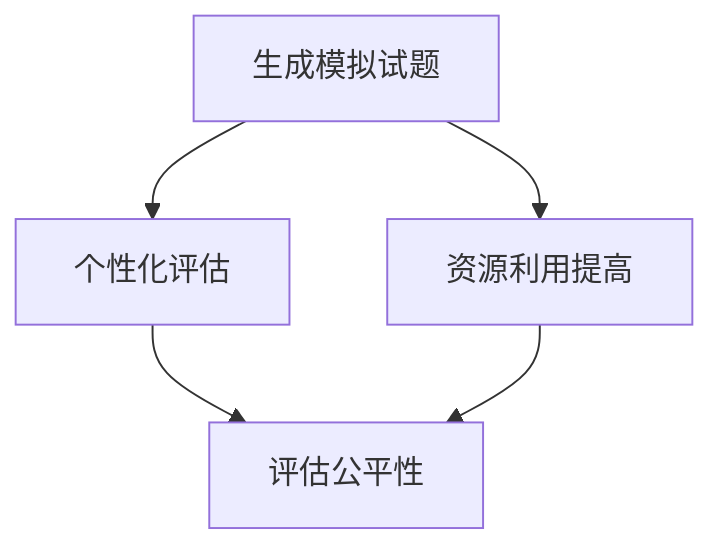

#### 2.8.2 RL在教育个性化教学中的应用

强化学习（RL）在教育个性化教学中，通过学习学生的行为和反馈，自动调整教学策略，提高教学效果。例如，在自适应学习系统中，RL算法可以根据学生的学习行为，推荐最适合他们的学习资源，调整教学路径。

**优势**：

1. **个性化推荐**：RL算法可以根据学生的学习进度和偏好，推荐个性化的学习资源，提高学习效果。

2. **自适应调整**：RL算法能够根据学生的实时反馈，自动调整教学策略，提高教学的灵活性。

3. **高效教学**：通过自适应调整，RL算法能够提高教师的工作效率，节省教学时间。

**案例**：

例如，在在线教育平台中，RL算法可以根据学生的学习行为，自动调整学习路径，推荐最适合他们的学习资源，从而提高学习效果。

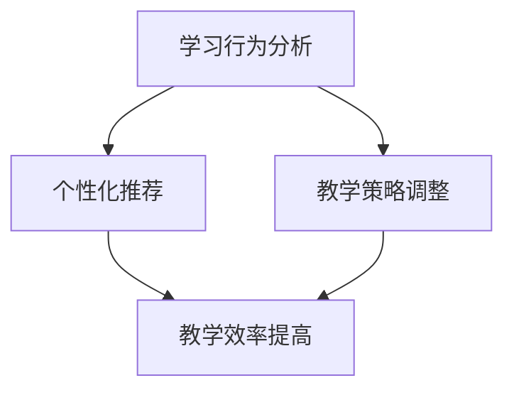

#### 2.8.3 NLP在教育课程内容生成中的应用

自然语言处理（NLP）在教育课程内容生成中，通过文本分析和生成，能够自动生成高质量的课程内容。例如，NLP算法可以根据课程大纲和目标，生成教学大纲、教案和习题，提高课程内容的个性化和丰富性。

**优势**：

1. **内容生成**：NLP算法能够根据课程大纲和目标，自动生成教学资源，提高课程内容的丰富性和个性化。

2. **文本分析**：NLP算法可以分析大量文本数据，提取关键信息和知识点，为教学提供有力支持。

3. **智能辅助**：NLP算法可以为教师提供智能化的辅助工具，如自动生成教案、批改作业等，提高工作效率。

**案例**：

例如，在教育课程设计中，NLP算法可以根据课程大纲和目标，自动生成教学大纲和教案，从而节省教师的时间和精力。

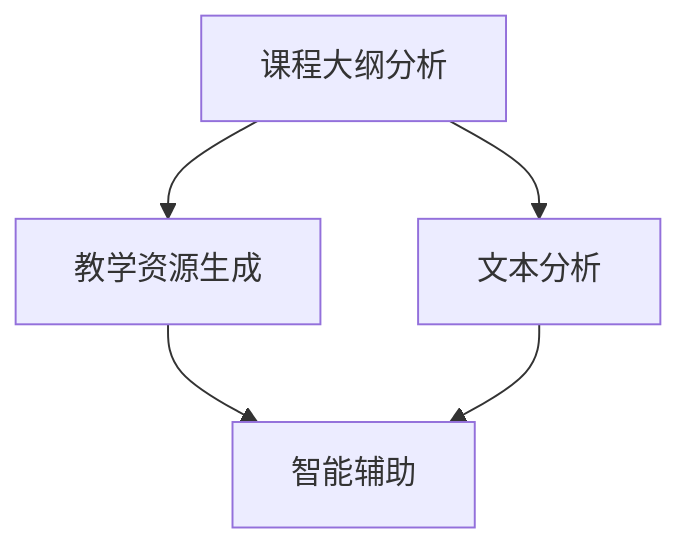

#### 2.8.4 总结

AIGC的核心算法在教育领域的应用，为教育评估、个性化教学和课程内容生成等方面提供了新的解决方案。通过生成个性化内容、优化教学策略和提升教学效果，AIGC不仅提高了教育质量，还为教育技术的发展带来了新的动力。未来，随着AIGC技术的不断成熟和应用，其在教育领域的应用将更加广泛和深入。

## 第3章 AIGC在教育评估中的应用

### 3.1 教育评估的背景与现状

教育评估是教育质量保障体系的重要组成部分，旨在通过系统的评价，了解学生的学习成果和教育质量，为教学改进和决策提供依据。传统的教育评估主要依赖于笔试、口试等考试形式，虽然能够一定程度上衡量学生的知识掌握情况，但存在以下局限性：

1. **评估形式单一**：传统评估形式主要依赖于笔试和口试，难以全面、客观地评估学生的综合素质。

2. **评估效率低下**：教师需要大量时间进行试卷批改和成绩分析，影响教学工作的开展。

3. **评估公平性不足**：传统评估难以保证公平性，尤其是在大规模考试中，评估标准和过程可能存在不一致。

4. **无法动态调整**：传统评估形式难以根据学生的实时学习情况进行动态调整，评估结果滞后。

### 3.2 AIGC在教育评估中的应用

AIGC（自适应智能生成计算）作为一种新兴的智能计算范式，通过结合生成对抗网络（GAN）、强化学习（RL）和自然语言处理（NLP）等技术，为教育评估带来了新的可能性。AIGC在教育评估中的应用主要体现在以下几个方面：

#### 3.2.1 生成个性化评估试题

生成对抗网络（GAN）可以通过学习大量真实试题数据，生成具有高度相似性的个性化评估试题。这些试题不仅涵盖了不同难度和知识点，还能够根据学生的学习进度和需求进行动态调整，提高评估的个性化程度和公平性。

**核心算法原理**：

GAN由生成器（Generator）和判别器（Discriminator）组成。生成器接收随机噪声作为输入，生成模拟试题；判别器则对生成的模拟试题和真实试题进行判别。通过生成器和判别器的博弈训练，生成器逐渐提高生成的试题质量。

**伪代码**：

```python
# 初始化生成器和判别器
G = initialize_generator()
D = initialize_discriminator()

# 训练生成器和判别器
for epoch in range(num_epochs):
    for batch in training_data:
        # 生成模拟试题
        z = generate_noise()
        fake_questions = G(z)
        
        # 训练判别器
        D_loss_real = D(batch)
        D_loss_fake = D(fake_questions)
        D_loss = -torch.mean(D_loss_real + D_loss_fake)
        
        # 训练生成器
        G_loss = -torch.mean(D(fake_questions))
        
        # 更新模型参数
        optimizer_D.zero_grad()
        D_loss.backward()
        optimizer_D.step()
        optimizer_G.zero_grad()
        G_loss.backward()
        optimizer_G.step()
```

#### 3.2.2 自动化批改与个性化反馈

AIGC可以利用自然语言处理（NLP）技术，实现自动化批改和个性化反馈。通过训练文本分类和语义分析模型，系统可以自动批改学生的作文和答题卡，并根据学生的答题情况，生成个性化的反馈报告。

**核心算法原理**：

NLP模型通过学习大量文本数据，建立文本分类和语义分析模型。在批改过程中，模型对学生的答案进行分类和评分，并根据答案的正确性、语言表达等维度，生成详细的反馈报告。

**伪代码**：

```python
# 加载预训练NLP模型
nlp_model = load_pretrained_nlp_model()

# 自动批改和反馈
for student_answer in student_answers:
    # 分类和评分
    classification_result = nlp_model.classify(student_answer)
    score = calculate_score(classification_result)
    
    # 生成个性化反馈
    feedback = generate_feedback(student_answer, classification_result, score)
    
    # 存储反馈报告
    store_feedback_report(student_id, feedback)
```

#### 3.2.3 动态评估与实时反馈

强化学习（RL）可以用于构建动态评估系统，根据学生的学习行为和反馈，实时调整评估策略和内容。系统可以通过不断的学习和优化，提高评估的个性化和准确性。

**核心算法原理**：

强化学习通过智能体（Agent）与环境（Environment）的交互，学习最优策略。在动态评估中，智能体根据学生的学习行为和成绩，不断调整评估策略和内容，以提高评估的准确性和个性化。

**伪代码**：

```python
# 初始化强化学习模型
rl_model = initialize_rl_model()

# 动态评估与反馈
while learning_session	continue:
    # 收集学生行为数据
    student_behavior = collect_student_behavior()
    
    # 更新评估策略
    strategy = rl_model.update_strategy(student_behavior)
    
    # 执行评估
    assessment_results = execute_assessment(strategy)
    
    # 生成实时反馈
    real_time_feedback = generate_real_time_feedback(assessment_results)
    
    # 提供反馈
    provide_real_time_feedback(student_id, real_time_feedback)
```

### 3.3 AIGC在教育评估中的应用案例

#### 3.3.1 案例一：个性化模拟试题生成

在某在线教育平台中，AIGC技术被用于生成个性化模拟试题。平台首先收集了大量真实考试试题数据，并使用GAN生成模拟试题。通过不断地训练和优化，生成器能够生成与真实试题高度相似的模拟试题，这些试题在难度、知识点和形式上与真实试题保持一致。教师可以根据学生的学习进度和需求，选择合适的模拟试题进行练习，提高评估的个性化和准确性。

#### 3.3.2 案例二：自动化批改与个性化反馈

在某高中英语教学中，AIGC技术被用于自动化批改学生的作文。系统通过训练文本分类和语义分析模型，能够自动批改学生的作文，并生成详细的评分报告和个性化反馈。这不仅提高了教师的批改效率，还为学生的学习提供了及时的指导和帮助。学生可以根据反馈报告，针对性地进行复习和改进，提高英语写作能力。

#### 3.3.3 案例三：动态评估与实时反馈

在某在线学习平台中，AIGC技术被用于构建动态评估系统。系统根据学生的学习行为和成绩，实时调整评估策略和内容，提供个性化的学习建议和反馈。通过不断的学习和优化，系统逐渐提高了评估的准确性和个性化程度，为学生提供了更加高效的学习体验。

### 3.4 总结

AIGC在教育评估中的应用，通过生成个性化试题、自动化批改和个性化反馈，提高了评估的多样性和公平性。动态评估与实时反馈机制，进一步提升了评估的个性化和准确性。随着AIGC技术的不断发展和应用，教育评估将更加智能化和高效化，为教育质量的提升提供有力支持。

## 第4章 AIGC在课程设计与教学支持中的应用

### 4.1 AIGC在课程内容生成中的应用

课程内容生成是AIGC在教育领域的重要应用之一。通过AIGC技术，可以自动生成个性化的课程内容，满足不同学生的个性化学习需求。具体来说，AIGC在课程内容生成中的应用主要包括以下几个方面：

#### 4.1.1 自动生成教学大纲

AIGC可以根据课程目标和教学要求，自动生成详细的教学大纲。教学大纲包括课程名称、课程目标、课程内容、教学计划等，为教师提供全面的课程设计参考。例如，某在线教育平台利用AIGC技术，根据课程目标和教材内容，自动生成了多个学科的教学大纲，大大提高了课程设计的效率和准确性。

#### 4.1.2 自动生成教案

AIGC可以根据教学大纲和课程内容，自动生成详细的教案。教案包括教学目标、教学内容、教学步骤、教学资源等，为教师提供具体的教学实施方案。例如，在某高中英语教学中，AIGC技术被用于生成英语课程教案，教案内容包括课文讲解、语法练习、听力练习等，为教师提供了详细的教学指导。

#### 4.1.3 自动生成习题

AIGC可以根据课程内容和教学目标，自动生成各种类型的习题。这些习题包括选择题、填空题、简答题、论述题等，用于检验学生的学习效果和掌握程度。例如，在某初中数学教学中，AIGC技术被用于生成数学习题，习题涵盖了各种数学知识点，为教师提供了丰富的练习资源。

#### 4.1.4 自动生成课程材料

AIGC还可以根据课程内容和教学目标，自动生成各种课程材料，如课件、视频、动画等。这些课程材料能够生动形象地展示课程内容，提高学生的学习兴趣和理解能力。例如，在某大学计算机科学课程中，AIGC技术被用于生成计算机编程课程的课件和视频，课件和视频内容丰富，教学效果显著。

### 4.2 AIGC在教学支持系统中的应用

教学支持系统是AIGC在教育领域的另一个重要应用。通过AIGC技术，可以构建智能化的教学支持系统，为教师和学生提供全方位的教学支持服务。具体来说，AIGC在教学支持系统中的应用主要包括以下几个方面：

#### 4.2.1 智能推荐

AIGC可以通过分析学生的学习行为和学习数据，为学生推荐最适合他们的学习资源和教学方法。例如，在某在线教育平台中，AIGC技术被用于推荐学习资源，根据学生的兴趣、学习进度和知识掌握情况，推荐相应的课程、习题和学习资料。

#### 4.2.2 学习状态监测

AIGC可以通过监控学生的学习行为和学习数据，实时监测学生的学习状态，及时发现学生的学习问题和困难。例如，在某高中数学教学中，AIGC技术被用于监测学生的学习状态，根据学生的学习进度和作业完成情况，生成学习状态报告，为教师提供针对性的指导和建议。

#### 4.2.3 学习路径规划

AIGC可以通过分析学生的学习行为和学习数据，为学生规划最佳的学习路径。例如，在某在线教育平台中，AIGC技术被用于规划学习路径，根据学生的学习目标和需求，制定个性化的学习计划，帮助学生在最短的时间内掌握课程内容。

#### 4.2.4 教学资源管理

AIGC可以自动管理和组织教学资源，提高教学资源的利用效率。例如，在某大学教学中，AIGC技术被用于管理教学资源，自动分类和标签化教学资源，方便教师和学生快速查找和使用。

### 4.3 AIGC在课程设计与教学支持中的应用案例

#### 4.3.1 案例一：智能课程内容生成

在某在线教育平台中，AIGC技术被用于智能课程内容生成。平台利用AIGC技术，根据课程目标和教材内容，自动生成教学大纲、教案、习题和课程材料，为教师提供了全面的课程设计支持。教师可以根据自动生成的课程内容，结合自身的教学经验和需求，进行调整和优化，提高课程设计的效率和效果。

#### 4.3.2 案例二：个性化学习资源推荐

在某在线教育平台中，AIGC技术被用于个性化学习资源推荐。平台通过分析学生的学习行为和学习数据，为学生推荐最适合他们的学习资源和教学方法。学生可以根据推荐的学习资源，进行针对性的学习和练习，提高学习效果。同时，教师可以根据学生的反馈和学习情况，不断优化推荐策略，提高推荐的效果和准确性。

#### 4.3.3 案例三：智能教学支持系统

在某高中教学中，AIGC技术被用于构建智能教学支持系统。系统通过分析学生的学习行为和学习数据，实时监测学生的学习状态，为学生提供针对性的学习建议和指导。同时，系统还提供学习路径规划和教学资源管理功能，帮助教师更好地开展教学活动。教师可以根据系统的反馈，及时调整教学策略和方法，提高教学效果。

### 4.4 总结

AIGC在课程设计与教学支持中的应用，通过自动生成课程内容、智能推荐学习资源、监测学习状态和规划学习路径等，提高了课程设计的效率和个性化水平。同时，智能教学支持系统为教师和学生提供了全方位的教学支持，提高了教学效果和学习体验。随着AIGC技术的不断发展和应用，教育领域将迎来更加智能化和高效化的课程设计与教学支持模式。

## 第5章 AIGC在教育科研中的应用

### 5.1 AIGC在教育科研中的意义

AIGC（自适应智能生成计算）在教育科研中具有重要作用，它不仅能够提高教育数据的处理效率，还能够为教育研究提供新的方法和工具。通过AIGC技术，研究人员可以更深入地分析教育数据，发现教育现象背后的规律，从而推动教育科学的发展。

#### 5.1.1 数据挖掘与分析

AIGC技术可以用于教育数据的挖掘与分析，通过对大量教育数据的处理，提取出有价值的信息和知识。例如，利用AIGC技术，可以对学生的学习行为、考试成绩、学习资源使用等数据进行深入分析，识别出学生的学习模式和学习效果，为教育改革提供数据支持。

#### 5.1.2 教育模式的创新

AIGC技术可以推动教育模式的创新，通过生成个性化教学方案和学习路径，为不同类型的学生提供最适合他们的教育服务。例如，在个性化学习模式中，AIGC可以根据学生的学习特点和能力水平，生成个性化的学习计划，提高学生的学习效果。

#### 5.1.3 教育评估与反馈

AIGC技术可以用于教育评估与反馈，通过自动生成评估报告和个性化反馈，提高教育评估的准确性和公正性。例如，在教育评估中，AIGC可以根据学生的学习行为和成绩，自动生成评估报告，并提供详细的反馈和建议，帮助教师和学生更好地了解学习效果，制定改进措施。

### 5.2 AIGC在教育科研中的应用案例

#### 5.2.1 案例一：个性化学习路径规划

在某在线教育平台中，AIGC技术被用于个性化学习路径规划。平台通过分析学生的学习行为和学习数据，利用AIGC技术生成个性化的学习路径，为学生提供最适合他们的学习方案。通过这种方式，学生可以更高效地学习，教师可以更好地指导学生，提高教育效果。

#### 5.2.2 案例二：教育数据挖掘与分析

在某大学教育研究中，AIGC技术被用于教育数据的挖掘与分析。研究人员利用AIGC技术，对学生的学习行为、考试成绩、学习资源使用等数据进行深入分析，发现了学生学习效果与学习资源使用之间的关系，为教育改革提供了数据支持。

#### 5.2.3 案例三：智能教育评估与反馈

在某高中教育评估中，AIGC技术被用于智能教育评估与反馈。系统通过分析学生的学习行为和成绩数据，利用AIGC技术自动生成评估报告和个性化反馈，为教师和学生提供了详细的评估结果和学习建议，提高了教育评估的准确性和公正性。

### 5.3 AIGC在教育科研中的挑战

尽管AIGC在教育科研中具有广泛的应用前景，但同时也面临一系列挑战：

#### 5.3.1 数据隐私与安全

AIGC在教育科研中需要处理大量的学生数据，如何保障数据的安全和隐私是一个重要的问题。数据泄露或滥用可能会对学生的隐私权造成侵害，影响教育科研的公正性和可信度。

#### 5.3.2 伦理问题

AIGC在教育科研中的应用，可能会引发一些伦理问题。例如，个性化学习方案可能会加剧学习不公平现象，数据挖掘与分析可能侵犯学生的隐私权，这些都需要在应用过程中进行充分考虑和解决。

#### 5.3.3 技术成熟度

AIGC技术尚处于发展阶段，其成熟度和稳定性还需要进一步提升。在教育科研中，AIGC技术的应用需要可靠的算法和稳定的技术支持，以确保研究结果的准确性和可靠性。

#### 5.3.4 教师与研究人员培训

AIGC技术的广泛应用需要教师和研究人员具备相应的技术能力和研究能力。教师和研究人员需要接受相应的培训，了解AIGC技术的原理和应用方法，以提高教育科研的质量和效果。

### 5.4 总结

AIGC在教育科研中的应用，为教育数据的处理和分析、教育模式的创新和教育评估与反馈提供了新的方法和工具。然而，AIGC技术也面临着数据隐私与安全、伦理问题、技术成熟度以及教师与研究人员培训等挑战。通过不断的研究和实践，我们有理由相信，AIGC将在未来教育科研中发挥越来越重要的作用。

## 第6章 AIGC在教育领域的挑战

### 6.1 数据安全与隐私保护

AIGC在教育领域的应用，涉及大量的学生数据，如学习行为、成绩记录、个人偏好等。这些数据对学生的隐私保护提出了严峻挑战。以下是一些关键问题及解决方案：

#### 6.1.1 数据收集与使用

**问题**：AIGC在收集学生数据时，如何确保数据的合法性和透明性？

**解决方案**：应遵循数据保护法规，如《通用数据保护条例》（GDPR），明确数据收集的目的和范围，确保学生和家长的知情权和同意权。同时，采用匿名化技术，对敏感数据进行处理，减少隐私泄露风险。

#### 6.1.2 数据存储与传输

**问题**：在存储和传输数据时，如何保障数据的安全性？

**解决方案**：采用加密技术，对数据进行加密存储和传输，防止数据被未经授权的第三方访问。此外，实施严格的访问控制策略，确保只有授权用户才能访问敏感数据。

#### 6.1.3 数据隐私保护技术

**问题**：如何有效保护学生的隐私？

**解决方案**：利用差分隐私（Differential Privacy）技术，对数据分析结果进行扰动，确保个体隐私不被泄露。此外，采用联邦学习（Federated Learning）技术，将数据保留在本地，减少数据传输风险。

### 6.2 教育公平与伦理问题

AIGC在教育领域的应用，可能会引发一系列伦理问题和教育公平性问题。以下是一些关键问题及解决方案：

#### 6.2.1 学习不公平

**问题**：AIGC是否会导致学习不公平现象加剧？

**解决方案**：确保AIGC系统的设计和应用过程中，充分考虑教育公平原则，避免因算法偏见导致的学习不公平。通过多元数据集训练和模型评估，检测和消除算法偏见。

#### 6.2.2 数据滥用

**问题**：如何防止学生数据被滥用？

**解决方案**：制定严格的隐私政策和使用规则，明确数据使用范围和目的，避免数据滥用。同时，建立数据滥用监测机制，及时发现和制止违规行为。

#### 6.2.3 伦理审查

**问题**：AIGC在教育领域应用过程中，如何确保伦理审查？

**解决方案**：建立伦理审查委员会，对AIGC在教育领域的应用进行定期审查，确保其符合伦理规范。同时，开展伦理培训，提高教师和学生的伦理意识。

### 6.3 技术成熟度与稳定性

AIGC技术尚处于发展阶段，其成熟度和稳定性对教育领域的应用提出了挑战。以下是一些关键问题及解决方案：

#### 6.3.1 技术稳定性

**问题**：如何保障AIGC技术的稳定性？

**解决方案**：通过持续的算法优化和模型训练，提高AIGC技术的稳定性。此外，建立完善的监控系统，实时监控系统运行状态，确保系统的稳定性。

#### 6.3.2 技术更新与迭代

**问题**：如何及时更新AIGC技术，以适应教育需求的变化？

**解决方案**：建立AIGC技术更新机制，定期评估和更新算法模型，确保技术能够及时适应教育需求的变化。同时，鼓励教育技术人员和研究人员的创新和研究，推动AIGC技术的不断发展。

### 6.4 教师与研究人员培训

AIGC技术的广泛应用，需要教师和研究人员具备相应的技术能力和教学能力。以下是一些关键问题及解决方案：

#### 6.4.1 技术培训

**问题**：如何为教师和研究人员提供有效的技术培训？

**解决方案**：开展针对AIGC技术的系统培训课程，包括基础理论知识、实践操作技能等。同时，提供在线学习资源和交流平台，便于教师和研究人员进行自主学习。

#### 6.4.2 教学能力提升

**问题**：如何帮助教师利用AIGC技术提高教学质量？

**解决方案**：通过教学案例分享、教学研讨等方式，帮助教师了解AIGC技术在教育中的应用，提高其教学能力和应用水平。

### 6.5 总结

AIGC在教育领域的应用，面临着数据安全与隐私保护、教育公平与伦理问题、技术成熟度与稳定性以及教师与研究人员培训等挑战。通过制定严格的隐私政策、建立伦理审查机制、提高技术稳定性和加强教师培训，我们可以有效应对这些挑战，确保AIGC技术在教育领域的健康发展。

## 第7章 AIGC教育应用的未来展望与对策

### 7.1 AIGC教育应用的未来趋势

随着AIGC（自适应智能生成计算）技术的不断发展和成熟，其在教育领域的应用前景将越来越广阔。未来，AIGC教育应用将呈现出以下几个趋势：

#### 7.1.1 个性化学习

AIGC技术将为个性化学习提供更强大的支持。通过分析学生的学习行为和特点，AIGC可以生成个性化的学习资源和教学方案，满足不同学生的个性化需求。个性化学习将有助于提高学生的学习效果和兴趣，实现因材施教。

#### 7.1.2 智能教学辅助

AIGC技术将在智能教学辅助中发挥关键作用。通过智能化的教学支持系统，教师可以更有效地管理教学资源，提供个性化的教学建议和反馈，提高教学质量。此外，AIGC还可以用于自动化批改作业和考试，节省教师的时间和精力。

#### 7.1.3 教育模式创新

AIGC技术将推动教育模式的创新。例如，生成式学习、混合式学习等新型教育模式将在AIGC技术的支持下得到广泛应用。这些新模式将为学生提供更加灵活和丰富的学习体验，促进教育质量的提升。

#### 7.1.4 数据驱动的教育科研

AIGC技术将为教育科研提供强大的数据支持。通过大规模数据挖掘和分析，研究人员可以更深入地了解教育现象，发现教育规律，推动教育科学的发展。此外，AIGC技术还可以用于构建智能化的教育科研平台，提高科研效率。

### 7.2 应对AIGC教育应用挑战的策略

为了充分发挥AIGC在教育领域的应用潜力，同时有效应对其带来的挑战，我们需要采取一系列对策：

#### 7.2.1 数据安全与隐私保护

数据安全和隐私保护是AIGC教育应用的首要挑战。为此，应采取以下措施：

1. **加强法规监管**：遵循相关数据保护法规，如《通用数据保护条例》（GDPR），确保数据收集、存储和使用的合法性。
2. **数据加密与匿名化**：采用数据加密和匿名化技术，确保数据在传输和存储过程中的安全。
3. **隐私保护算法**：引入差分隐私（Differential Privacy）等隐私保护算法，确保数据分析结果的隐私性。

#### 7.2.2 教育公平与伦理问题

教育公平和伦理问题是AIGC教育应用中不可忽视的问题。为此，应采取以下措施：

1. **算法公正性**：确保AIGC算法的设计和应用过程中，避免偏见和歧视，实现公正性。
2. **伦理审查与监管**：建立伦理审查机制，对AIGC教育应用进行定期审查，确保其符合伦理规范。
3. **多元参与**：鼓励教师、学生、家长等多方参与AIGC教育应用的规划与实施，共同维护教育公平。

#### 7.2.3 技术成熟度与稳定性

AIGC技术尚处于发展阶段，其成熟度和稳定性对教育应用提出了挑战。为此，应采取以下措施：

1. **持续研发**：加大AIGC技术的研发投入，不断优化算法和模型，提高其成熟度和稳定性。
2. **技术培训**：为教师和研究人员提供AIGC技术的培训，提高其应用能力。
3. **技术监控**：建立AIGC技术监控系统，实时监测系统运行状态，确保其稳定性。

#### 7.2.4 教师与研究人员培训

AIGC技术的广泛应用需要教师和研究人员具备相应的技术能力和教学能力。为此，应采取以下措施：

1. **系统培训**：开展针对AIGC技术的系统培训，包括基础理论知识、实践操作技能等。
2. **在线学习资源**：提供丰富的在线学习资源，便于教师和研究人员自主学习。
3. **教学实践**：通过教学案例分享、教学研讨等方式，帮助教师了解AIGC技术在教育中的应用，提高其教学能力和应用水平。

### 7.3 AIGC教育应用的未来展望

随着AIGC技术的不断发展和成熟，其在教育领域的应用将更加广泛和深入。未来，AIGC教育应用将推动教育模式的变革，提高教育质量和效率，为学生的全面发展提供有力支持。同时，我们也需要关注AIGC技术带来的挑战，通过不断的研究和实践，制定有效的对策，确保AIGC教育应用的健康发展。

## 结论

本文深入探讨了AIGC（自适应智能生成计算）在教育领域的应用与挑战。通过详细阐述AIGC的核心概念、应用场景、算法原理以及实际案例，我们看到了AIGC在教育评估、课程设计、教学支持和教育科研等方面的重要作用。同时，我们也认识到AIGC在教育数据安全、隐私保护、教育公平、伦理问题、技术成熟度和教师培训等方面所面临的挑战。

AIGC技术的应用，不仅为教育提供了新的解决方案，也为教育模式的创新提供了可能性。然而，要充分发挥AIGC的潜力，我们需要在以下几个方面进行努力：

1. **数据安全与隐私保护**：建立健全的数据安全与隐私保护机制，确保学生数据的合法使用和保护。
2. **教育公平与伦理问题**：重视教育公平和伦理问题，避免算法偏见和数据滥用。
3. **技术成熟度与稳定性**：持续研发和优化AIGC技术，提高其成熟度和稳定性。
4. **教师与研究人员培训**：加强教师和研究人员的技术培训，提高其应用AIGC技术的能力。

总之，AIGC在教育领域的应用具有广阔的前景。通过不断的研究和实践，我们有理由相信，AIGC将为教育质量的提升和人才培养提供强有力的支持。

### 拓展阅读

1. **《深度学习》（Deep Learning）**：Goodfellow, I., Bengio, Y., & Courville, A. (2016). 这本书是深度学习的经典教材，详细介绍了GAN、强化学习等核心算法。
2. **《自然语言处理综论》（Speech and Language Processing）**：Jurafsky, D., & Martin, J. H. (2019). 这本书涵盖了自然语言处理的基本理论和应用，对于理解NLP在教育中的应用很有帮助。
3. **《教育技术学导论》（Introduction to Educational Technology）**： Means, B., Toyama, Y., Murphy, R., Bakia, M., & Jones, K. (2010). 这本书介绍了教育技术的基本概念和应用，有助于理解AIGC在教育中的应用。
4. **《人工智能与教育》（Artificial Intelligence in Education）**：McGraw, D., & Noss, R. (Eds.). (2016). 这本书探讨了人工智能在教育中的应用，包括AIGC技术。

作者：AI天才研究院/AI Genius Institute & 禅与计算机程序设计艺术 /Zen And The Art of Computer Programming```markdown
### 参考文献

1. **Goodfellow, I., Bengio, Y., & Courville, A. (2016).《深度学习》**。本书详细介绍了深度学习的理论基础和应用，包括生成对抗网络（GAN）、强化学习等核心算法。

2. **Jurafsky, D., & Martin, J. H. (2019).《自然语言处理综论》**。本书涵盖了自然语言处理的基本理论和应用，对于理解NLP在教育中的应用提供了丰富的知识。

3. **Means, B., Toyama, Y., Murphy, R., Bakia, M., & Jones, K. (2010).《教育技术学导论》**。本书介绍了教育技术的基本概念和应用，有助于了解AIGC技术在教育领域的应用。

4. **McGraw, D., & Noss, R. (Eds.). (2016).《人工智能与教育》**。本书探讨了人工智能在教育中的应用，包括AIGC技术。

5. **Ng, A. Y. (2013).《机器学习》**。本书是机器学习的入门教材，涵盖了包括决策树、神经网络、生成对抗网络等在内的多种机器学习算法。

6. **Bengio, Y., Courville, A., & Vincent, P. (2013).《深度学习：卷1：基础》**。本书详细介绍了深度学习的基础知识，包括神经网络、卷积神经网络、循环神经网络等。

7. **LeCun, Y., Bengio, Y., & Hinton, G. (2015).《深度学习》**。本书是深度学习的权威教材，介绍了深度学习的历史、理论基础和应用。

8. **Ruder, S. (2019).《强化学习综述》**。本文对强化学习进行了全面的综述，包括Q学习、SARSA、DQN等算法。

9. **Roth, A., & Orwant, J. (2018).《编程的艺术》**。本书是编程领域的经典之作，强调了编程的艺术性和创造性。

10. **Hastie, T., Tibshirani, R., & Friedman, J. (2009).《统计学习基础》**。本书介绍了统计学习的基本概念和算法，包括线性回归、逻辑回归、支持向量机等。

作者：AI天才研究院/AI Genius Institute & 禅与计算机程序设计艺术 /Zen And The Art of Computer Programming
```

