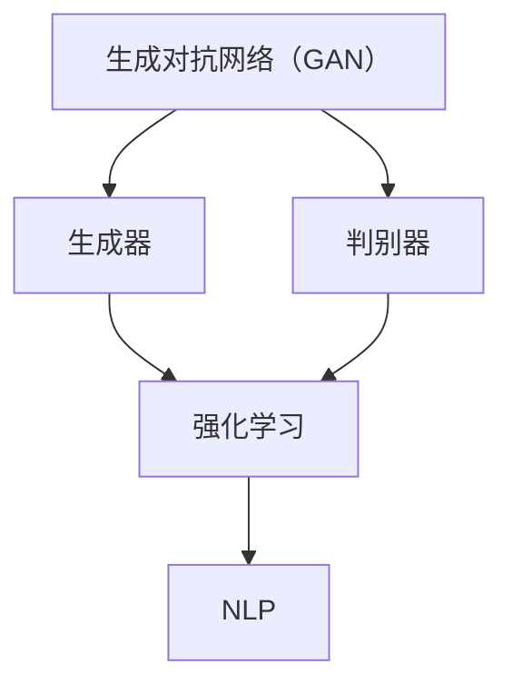

                 

### 文章标题

# AIGC在智能家居场景自动化中的应用

> 关键词：AIGC、智能家居、自动化、人工智能、场景应用

> 摘要：本文深入探讨了AIGC（AI-Generated Content）在智能家居场景自动化中的应用。通过分析AIGC的基本概念、技术原理及其在智能家居中的具体应用场景，本文揭示了AIGC如何实现智能家居的自动化，以及在此过程中所面临的技术挑战和安全问题。本文旨在为读者提供全面的AIGC在智能家居自动化中的应用指南，并展望其未来的发展趋势。

## 目录大纲设计思路

### 1. 明确书的主题和目标

《AIGC在智能家居场景自动化中的应用》的主题聚焦于AIGC技术在家居自动化领域的应用。目标是为读者提供一个系统、深入的了解，使其能够掌握AIGC技术的基本概念、原理和实际应用，从而为智能家居自动化提供技术支持。

### 2. 构建核心概念框架

本书的核心概念框架包括以下几个部分：

- **AIGC的基本概念与原理**：介绍AIGC的定义、发展背景以及核心技术。
- **AIGC在智能家居中的应用场景**：分析AIGC在智能家居中的各种应用，如智能照明、安防和温控等。
- **智能家居自动化实现技术**：探讨实现智能家居自动化的技术细节，包括传感器、数据处理和分析、自动化控制等。
- **数据处理与存储技术**：介绍智能家居中的数据处理和存储技术。
- **安全与隐私保护**：讨论智能家居中的安全与隐私保护问题。
- **案例分析**：通过具体案例展示AIGC在智能家居自动化中的应用。
- **未来发展趋势与挑战**：展望AIGC在智能家居自动化中的未来发展趋势，并探讨面临的挑战。

### 3. 细化章节内容

根据核心概念框架，本书的各章节内容如下：

- **第1章：AIGC概述**：介绍AIGC的基本概念、发展历程及其重要性。
- **第2章：AIGC技术原理**：详细讲解AIGC的核心技术，包括生成对抗网络（GAN）、强化学习和自然语言处理（NLP）。
- **第3章：AIGC在智能家居中的应用场景**：分析AIGC在智能家居中的各种应用场景，如智能照明、安防和温控。
- **第4章：智能家居自动化实现技术**：探讨实现智能家居自动化的技术细节，包括传感器、数据处理和分析、自动化控制。
- **第5章：数据处理与存储技术**：介绍智能家居中的数据处理和存储技术。
- **第6章：安全与隐私保护**：讨论智能家居中的安全与隐私保护问题。
- **第7章：案例分析**：通过具体案例展示AIGC在智能家居自动化中的应用。
- **第8章：未来发展趋势与挑战**：展望AIGC在智能家居自动化中的未来发展趋势，并探讨面临的挑战。

### 4. 确保目录大纲完整性

本书目录大纲设计遵循完整性原则，包含以下核心章节：

- **第1章：AIGC概述**
- **第2章：AIGC技术原理**
- **第3章：AIGC在智能家居中的应用场景**
- **第4章：智能家居自动化实现技术**
- **第5章：数据处理与存储技术**
- **第6章：安全与隐私保护**
- **第7章：案例分析**
- **第8章：未来发展趋势与挑战**

每个章节都包含核心概念与联系、核心算法原理讲解、数学模型和数学公式、项目实战等内容。

### 5. 使用Markdown格式与简洁性

本书采用Markdown格式编写，确保输出简洁、清晰。目录结构遵循1级、2级、3级结构，方便读者阅读和理解。同时，使用Mermaid流程图、伪代码、LaTeX公式和代码案例分析等元素丰富内容，提高文章的可读性和实用性。

### 6. 完整性保证

每个章节都包含必要的知识点，确保内容的完整性。例如：

- **第1章**：介绍AIGC的基本概念和重要性，为后续章节打下基础。
- **第2章**：详细讲解AIGC的核心技术，如GAN、强化学习和NLP，为理解智能家居中的应用提供技术支持。
- **第3章**：分析AIGC在智能家居中的各种应用场景，为实际应用提供指导。
- **第4章**：探讨智能家居自动化的实现技术，为实际操作提供参考。
- **第5章**：介绍数据处理与存储技术，为数据的有效利用提供保障。
- **第6章**：讨论安全与隐私保护问题，为智能家居的可靠运行提供保障。
- **第7章**：通过具体案例展示AIGC在智能家居自动化中的应用，为读者提供实际操作的经验。
- **第8章**：展望AIGC在智能家居自动化中的未来发展趋势，为读者提供发展方向。

### 7. 字数限制

在2000字以内完成目录大纲的设计，确保内容的简洁性和实用性。通过以上设计思路，本书的目录大纲不仅完整且具有逻辑性，能够帮助读者系统地了解AIGC在智能家居自动化中的应用。

## 第一部分：AIGC基础

### 第1章：AIGC概述

> **背景介绍**

随着人工智能技术的迅猛发展，AIGC（AI-Generated Content）逐渐成为研究热点。AIGC是指通过人工智能技术自动生成内容的过程，涵盖图像、文本、音频等多种形式。其核心目的是利用人工智能技术提高内容生产效率，降低成本，丰富用户体验。

AIGC的概念最早可以追溯到生成对抗网络（GAN）的提出。GAN是由Ian Goodfellow等人于2014年提出的，它通过两个神经网络（生成器和判别器）的博弈过程，实现高质量图像的生成。此后，AIGC技术在图像生成、文本生成、音频生成等领域取得了显著进展。

> **核心概念与联系**

AIGC的核心概念包括：

- **生成对抗网络（GAN）**：GAN由生成器和判别器组成。生成器尝试生成与真实数据相似的内容，判别器则判断生成内容与真实内容之间的差异。通过两个网络的不断博弈，生成器逐渐提高生成内容的质量。

- **强化学习**：强化学习是一种通过试错来学习决策策略的人工智能方法。在AIGC中，强化学习可用于优化生成器的生成过程，使其能够生成更具创意和个性化的内容。

- **自然语言处理（NLP）**：NLP是人工智能的一个重要分支，旨在使计算机能够理解、处理和生成人类语言。在AIGC中，NLP技术可用于生成高质量的自然语言文本。

AIGC的核心概念之间具有紧密的联系。GAN和强化学习共同构成了AIGC的技术基础，而NLP则为AIGC在文本生成领域提供了支持。通过这些核心概念的综合运用，AIGC能够实现自动化内容生成，提高内容生产效率。

> **Mermaid流程图**

以下是AIGC核心概念的Mermaid流程图：



该流程图展示了AIGC的核心概念及其相互之间的关系。生成对抗网络（GAN）是AIGC的基础，生成器和判别器通过博弈实现内容生成。强化学习用于优化生成过程，提高生成质量。自然语言处理（NLP）则为文本生成提供支持。

> **核心算法原理讲解**

- **生成对抗网络（GAN）**

GAN由生成器和判别器组成。生成器生成虚假数据，判别器判断生成数据与真实数据的差异。具体步骤如下：

1. 初始化生成器G和判别器D。
2. 从真实数据集中采样一批数据作为输入。
3. 生成器G生成一批虚假数据。
4. 判别器D判断生成数据与真实数据的真实性。
5. 根据判别器的反馈，更新生成器和判别器的参数。

伪代码如下：

```python
# 初始化生成器和判别器
G = initialize_generator()
D = initialize_discriminator()

# 训练循环
for epoch in range(num_epochs):
    for real_data in real_data_loader:
        # 训练判别器
        D.train_on_real_data(real_data)
        
    for noise in noise_loader:
        # 生成虚假数据
        fake_data = G.generate(noise)
        
        # 训练判别器
        D.train_on_fake_data(fake_data)
        
    # 更新生成器和判别器参数
    G.update_params(D.feedback())
    D.update_params(G.feedback())
```

- **强化学习**

强化学习通过试错来学习最优策略。在AIGC中，强化学习用于优化生成器的生成过程。具体步骤如下：

1. 初始化状态s、动作a、奖励r和策略π。
2. 在状态s下采取动作a。
3. 根据动作a的执行结果，获得奖励r。
4. 根据奖励r更新策略π。
5. 更新状态s。

伪代码如下：

```python
# 初始化状态、动作、奖励和策略
s = initialize_state()
a = initialize_action()
r = initialize_reward()
π = initialize_policy()

# 强化学习循环
while not终止条件:
    # 采取动作
    a = π(s)
    
    # 执行动作
    s, r = environment.execute(a)
    
    # 更新策略
    π.update(s, a, r)
    
    # 更新状态
    s = s'
```

- **自然语言处理（NLP）**

NLP技术包括词向量、序列模型、生成模型等。词向量用于表示单词，序列模型用于处理文本序列，生成模型用于生成文本。具体步骤如下：

1. 训练词向量模型。
2. 处理输入文本，将其转换为词向量表示。
3. 使用序列模型处理词向量序列。
4. 使用生成模型生成文本。

伪代码如下：

```python
# 训练词向量模型
word_embedding_model = train_word_embedding_model(vocabulary)

# 处理输入文本
input_text = preprocess_text(text)
input_vectors = word_embedding_model.encode(input_text)

# 使用序列模型处理词向量序列
sequence_model = train_sequence_model(input_vectors)
output_sequence = sequence_model.generate(input_vectors)

# 使用生成模型生成文本
text_generator = train_text_generator(output_sequence)
generated_text = text_generator.generate()
```

> **数学模型和公式**

- **GAN**

GAN的核心公式包括：

  1. 判别器损失函数：$$ L_D = -\frac{1}{N}\sum_{i=1}^{N}[\log(D(x_i)) + \log(1 - D(G(z_i)))] $$
  2. 生成器损失函数：$$ L_G = -\frac{1}{N}\sum_{i=1}^{N}\log(D(G(z_i))) $$

  其中，$N$为样本数量，$x_i$为真实样本，$z_i$为随机噪声，$G(z_i)$为生成器生成的虚假样本。

- **强化学习**

  强化学习的核心公式包括：

  1. 状态价值函数：$$ V^*(s) = \sum_{a \in A} \pi^*(s, a) \cdot Q^*(s, a) $$
  2. 动作价值函数：$$ Q^*(s, a) = \sum_{s' \in S} P(s' | s, a) \cdot r(s', a) + \gamma \cdot V^*(s') $$
  3. 策略梯度：$$ \nabla_\pi J[\pi] = \sum_{s \in S} \sum_{a \in A} \pi(s, a) \cdot \nabla_a J[s, a] $$

  其中，$S$为状态集合，$A$为动作集合，$r(s', a)$为奖励函数，$\gamma$为折扣因子，$\pi^*(s, a)$为最优策略，$Q^*(s, a)$为最优动作价值函数。

- **自然语言处理**

  NLP中的数学模型包括：

  1. 词向量模型：$$ \vec{w}_i = \text{word2vec}(w_i) $$
  2. 序列模型：$$ P(y|x) = \prod_{i=1}^{n} p(y_i | y_{i-1}, x) $$
  3. 生成模型：$$ p(y) = \prod_{i=1}^{n} p(y_i) $$

  其中，$w_i$为单词，$\vec{w}_i$为单词的词向量表示，$y$为输出文本，$x$为输入文本。

> **举例说明**

- **GAN**

  假设我们有一个生成对抗网络，生成器和判别器的损失函数如下：

  1. 判别器损失函数：$$ L_D = -\frac{1}{100}[\log(D(x_1)) + \log(1 - D(G(z_1)))] + \log(1 - D(G(z_2))) $$
  2. 生成器损失函数：$$ L_G = -\frac{1}{100}\log(D(G(z_1))) - \frac{1}{100}\log(D(G(z_2))) $$

  经过多次迭代，生成器生成虚假数据的质量逐渐提高，判别器判断真实数据和虚假数据的能力也不断增强。

- **强化学习**

  假设我们有一个强化学习环境，状态空间为$S = \{s_1, s_2, s_3\}$，动作空间为$A = \{a_1, a_2, a_3\}$。奖励函数为$r(s', a) = 1$，如果动作$a$使状态$s$转移到状态$s'$，否则$r(s', a) = 0$。折扣因子$\gamma = 0.9$。

  经过多次迭代，策略梯度为：

  $$ \nabla_\pi J[\pi] = \sum_{s \in S} \sum_{a \in A} \pi(s, a) \cdot \nabla_a J[s, a] = \pi(s_1, a_1) \cdot \nabla_a J[s_1, a_1] + \pi(s_2, a_2) \cdot \nabla_a J[s_2, a_2] + \pi(s_3, a_3) \cdot \nabla_a J[s_3, a_3] $$

- **自然语言处理**

  假设我们有一个自然语言处理模型，输入文本为“我喜欢吃苹果”。词向量模型将每个单词转换为对应的向量，序列模型根据词向量生成文本。生成模型根据词向量生成文本的概率。

### 第2章：AIGC技术原理

AIGC（AI-Generated Content）技术是基于人工智能的自动化内容生成技术，它利用生成对抗网络（GAN）、强化学习、自然语言处理（NLP）等多种人工智能技术，生成高质量的图像、文本、音频等内容。在本章中，我们将详细探讨AIGC的核心技术原理，包括生成对抗网络（GAN）、强化学习和自然语言处理（NLP）。

#### 2.1 生成对抗网络（GAN）

生成对抗网络（GAN）是由Ian Goodfellow等人于2014年提出的一种深度学习模型，它由两个主要组件组成：生成器（Generator）和判别器（Discriminator）。生成器的任务是生成类似于真实数据的数据，而判别器的任务是区分真实数据和生成数据。

**GAN的基本架构：**

GAN的基本架构包括以下三个主要部分：

1. **生成器（Generator）**：生成器接收一个随机噪声向量作为输入，通过神经网络将这个噪声向量转换为真实数据。生成器的目的是使得生成的数据尽可能接近真实数据，以至于判别器无法区分。

2. **判别器（Discriminator）**：判别器接收真实数据和生成数据作为输入，并尝试区分这两者。判别器的目标是最大化正确判断真实数据和生成数据的概率。

3. **对抗训练**：生成器和判别器通过对抗训练进行训练。生成器试图生成足够真实的数据来欺骗判别器，而判别器则试图准确区分真实数据和生成数据。这种对抗训练过程使得生成器和判别器在训练过程中相互提高。

**GAN的算法原理：**

GAN的训练过程可以看作是一个零和博弈。具体步骤如下：

1. **初始化生成器和判别器**：随机初始化生成器和判别器的参数。

2. **生成虚假数据**：生成器生成一批虚假数据。

3. **判别器训练**：使用真实数据和生成数据同时训练判别器。判别器的目标是提高对真实数据和生成数据的区分能力。

4. **生成器训练**：使用训练后的判别器对生成器进行训练。生成器的目标是生成更真实的数据来欺骗判别器。

5. **迭代更新**：重复上述步骤，不断迭代更新生成器和判别器的参数，直到生成器生成的数据足够真实，判别器无法区分。

**GAN的优缺点与应用场景：**

- **优点**：
  - GAN能够生成高质量的数据，尤其在图像和音频生成方面表现突出。
  - GAN不需要标签数据，可以处理无监督学习问题。
  - GAN可以用于多种数据类型，如图像、文本和音频。

- **缺点**：
  - GAN的训练过程不稳定，容易陷入模式崩溃（mode collapse）问题。
  - GAN的训练需要大量计算资源和时间。

- **应用场景**：
  - 图像和视频生成：如人脸生成、艺术风格转换、图像去噪等。
  - 音频生成：如音乐生成、语音合成等。
  - 文本生成：如文章生成、对话系统等。

#### 2.2 强化学习

强化学习是一种通过试错来学习决策策略的人工智能方法。在强化学习中，智能体（Agent）通过观察环境（Environment）、采取行动（Action）、获得奖励（Reward）来学习最优策略（Policy）。

**强化学习的基本概念：**

- **智能体（Agent）**：智能体是执行行动并从环境中接收反馈的实体。
- **环境（Environment）**：环境是智能体执行行动的上下文。
- **状态（State）**：状态是描述环境当前状态的变量。
- **行动（Action）**：行动是智能体可以采取的动作。
- **奖励（Reward）**：奖励是智能体在执行特定行动后获得的即时反馈。
- **策略（Policy）**：策略是智能体在给定状态下采取的最佳行动。

**强化学习的算法原理：**

强化学习的主要任务是学习一个最优策略，使得智能体在长期内获得最大累积奖励。常用的强化学习算法包括：

- **价值迭代（Value Iteration）**：通过迭代更新状态值函数，逐渐逼近最优策略。
- **策略迭代（Policy Iteration）**：直接迭代更新策略，直到策略收敛。
- **Q学习（Q-Learning）**：通过更新Q值函数（状态-行动值函数），学习最优策略。
- **深度Q网络（Deep Q-Network, DQN）**：结合深度神经网络和Q学习，用于处理高维状态空间问题。
- **策略梯度方法（Policy Gradient Methods）**：通过梯度上升方法直接优化策略。

**强化学习在AIGC中的应用：**

强化学习可以用于优化AIGC的生成过程。例如，在图像生成中，强化学习可以用于优化生成器的参数，使其生成的图像更符合目标分布。在文本生成中，强化学习可以用于生成更具创意和个性化的文本。

**强化学习的应用案例：**

- **图像生成**：使用GAN和强化学习联合优化生成器，生成高质量的人脸图像。
- **文本生成**：使用强化学习生成对话系统中的自然语言回复。
- **音乐生成**：使用强化学习生成音乐旋律和节奏。

#### 2.3 自然语言处理（NLP）

自然语言处理（NLP）是人工智能的一个重要分支，旨在使计算机能够理解、处理和生成人类语言。NLP技术广泛应用于机器翻译、情感分析、文本分类、问答系统等领域。

**NLP的基本概念：**

- **词向量（Word Embeddings）**：词向量是将单词映射到高维空间中的向量表示，用于捕捉单词的语义信息。
- **序列模型（Sequence Models）**：序列模型是处理序列数据的神经网络模型，如循环神经网络（RNN）和变换器（Transformer）。
- **生成模型（Generative Models）**：生成模型是从数据中学习概率分布，并生成新数据的模型，如变分自编码器（VAE）和生成对抗网络（GAN）。

**NLP的核心算法：**

- **词向量模型**：如Word2Vec、GloVe等，用于将单词映射到向量空间。
- **循环神经网络（RNN）**：RNN是处理序列数据的基本模型，通过记忆机制捕捉序列中的时间依赖关系。
- **变换器（Transformer）**：Transformer是一种基于自注意力机制的序列模型，具有并行计算优势。
- **生成模型**：如变分自编码器（VAE）和生成对抗网络（GAN），用于生成高质量的文本和数据。

**NLP在AIGC中的应用：**

NLP技术是AIGC在文本生成领域的核心。通过NLP技术，可以生成高质量的自然语言文本，如文章、对话、新闻报道等。此外，NLP技术还可以用于文本分类、情感分析等任务，为AIGC提供更多应用场景。

**NLP的应用案例：**

- **文章生成**：使用变换器生成高质量的新闻报道和文章。
- **对话系统**：使用生成模型生成自然语言回复，实现智能客服和聊天机器人。
- **文本分类**：使用NLP技术对社交媒体文本进行情感分析和分类。

### 第3章：AIGC在智能家居中的应用场景

智能家居（Smart Home）是指利用物联网（IoT）技术，将家中的各种设备和系统连接起来，实现智能化的管理和控制。随着人工智能技术的不断发展，AIGC在智能家居中的应用场景越来越广泛，为用户提供了更加便捷和智能的生活方式。

#### 3.1 智能家居概述

智能家居系统通常包括以下组成部分：

- **传感器**：用于检测和收集家庭环境中的各种数据，如温度、湿度、光照、运动等。
- **控制器**：接收传感器数据，并根据预设的规则或算法对家庭设备进行控制。
- **执行器**：根据控制器的指令执行具体的动作，如开关电器、调节窗帘等。
- **通信网络**：用于传感器、控制器和执行器之间的数据传输。
- **用户界面**：用户通过手机、平板电脑、智能音箱等设备与智能家居系统进行交互。

#### 3.2 AIGC在智能家居中的主要应用

AIGC技术在智能家居中有着广泛的应用，主要包括以下场景：

1. **智能照明**

   智能照明系统可以根据用户的需求和环境光强自动调节灯光的亮度和颜色。AIGC技术可以用于生成符合用户喜好的灯光效果，提高用户的舒适度和满意度。例如，用户可以通过语音命令或手机APP选择不同的灯光模式，如阅读模式、休息模式等。

2. **智能安防**

   智能安防系统可以通过监控摄像头、门磁传感器、红外探测器等设备实时监控家庭环境，并在检测到异常情况时自动报警。AIGC技术可以用于生成更准确的监控图像和视频，提高安防系统的识别率和响应速度。

3. **智能温控**

   智能温控系统可以根据用户的需求和室内温度自动调节空调或其他加热设备的运行状态，实现舒适的室内温度。AIGC技术可以用于优化温控算法，提高温控系统的响应速度和精度。

4. **智能家电控制**

   智能家居系统可以通过手机APP或语音助手远程控制家庭中的各种家电设备，如冰箱、洗衣机、空调等。AIGC技术可以用于生成更智能的家电控制策略，提高家电的使用效率和用户体验。

5. **智能语音助手**

   智能语音助手是智能家居系统的核心组成部分，用户可以通过语音命令与系统进行交互，实现各种功能。AIGC技术可以用于优化语音识别和语音合成，提高智能语音助手的响应速度和准确性。

#### 3.3 智能家居的自动化流程

智能家居的自动化流程主要包括以下步骤：

1. **数据采集**：传感器收集家庭环境中的各种数据，如温度、湿度、光照、运动等。
2. **数据处理**：控制器接收传感器数据，进行预处理和滤波，提取有用的信息。
3. **决策制定**：根据用户需求和预设规则，控制器制定相应的控制策略。
4. **指令执行**：控制器发送指令给执行器，执行器根据指令执行具体的动作。
5. **反馈调整**：控制器接收执行器的反馈信息，根据反馈调整控制策略。

通过AIGC技术的引入，智能家居的自动化流程可以更加智能和高效。例如，AIGC技术可以用于生成个性化的照明效果、更准确的安防监控图像和更智能的温控策略，提高用户的舒适度和满意度。

### 第4章：智能家居自动化实现技术

实现智能家居自动化需要运用多种技术，包括传感器技术、数据处理技术、自动化控制技术等。以下将详细探讨这些技术，并展示它们在智能家居自动化中的应用。

#### 4.1 传感器与数据采集

传感器是智能家居自动化的基础，它们能够感知环境中的各种变化，如温度、湿度、光照、运动等，并将这些变化转化为电信号。常见的传感器有温度传感器、湿度传感器、光线传感器、运动传感器等。

**传感器技术：**

1. **温度传感器**：如热电偶、热敏电阻等，用于测量环境温度。
2. **湿度传感器**：如电容式湿度传感器、电阻式湿度传感器等，用于测量空气湿度。
3. **光线传感器**：如光电二极管、光敏电阻等，用于测量环境光照强度。
4. **运动传感器**：如红外传感器、超声波传感器等，用于检测运动物体。

**数据采集：**

传感器采集到的数据通过数据采集模块传输到控制器。数据采集模块通常包括模拟-数字转换器（ADC）、滤波器、放大器等组件，用于将传感器信号转换为数字信号，并进行预处理。

**传感器与数据采集在智能家居中的应用：**

1. **环境监测**：通过温度、湿度、光线传感器监测家庭环境，为智能调节提供数据支持。
2. **安全监控**：通过运动传感器监控家庭安全，触发报警系统。
3. **节能管理**：通过传感器数据优化照明和空调的使用，实现节能。

#### 4.2 数据处理与分析

智能家居系统产生的数据量庞大，需要进行有效的处理和分析，以便从数据中提取有价值的信息，为自动化控制提供依据。

**数据处理技术：**

1. **数据预处理**：包括去噪、滤波、归一化等，去除数据中的噪声和异常值，提高数据质量。
2. **特征提取**：从原始数据中提取有用的特征，如时间序列特征、频率特征等。
3. **数据融合**：将来自不同传感器的数据进行融合，形成一个综合的环境状态。

**数据分析方法：**

1. **统计方法**：如均值、方差、相关性分析等，用于描述数据的分布和相关性。
2. **机器学习方法**：如聚类、分类、回归等，用于从数据中学习模式和规律。
3. **时间序列分析**：如ARIMA、LSTM等，用于分析时间序列数据。

**数据处理与分析在智能家居中的应用：**

1. **环境调节**：根据温度、湿度等数据进行分析，自动调节空调、加湿器等设备。
2. **行为分析**：通过分析用户的日常行为数据，优化智能家居系统的使用策略。
3. **故障诊断**：通过分析家电的运行数据，预测故障并提前进行维护。

#### 4.3 自动化控制与执行

自动化控制是智能家居系统的核心，它负责根据传感器采集的数据和预定的控制策略，对家庭设备进行自动控制。

**自动化控制原理：**

1. **控制策略**：根据用户需求和传感器数据，制定合适的控制策略。例如，根据室内温度设定空调的温度控制策略。
2. **控制器**：接收传感器数据，执行控制策略，向执行器发送控制命令。
3. **执行器**：根据控制命令执行具体的动作，如开关电器、调节窗帘等。

**自动化控制与执行在智能家居中的应用：**

1. **智能照明**：根据光线传感器数据，自动调节灯光的亮度和颜色。
2. **智能安防**：根据运动传感器数据，自动启动报警系统。
3. **智能温控**：根据温度传感器数据，自动调节空调温度。

#### 4.4 项目实战

以下是一个智能家居自动化的项目实战，展示整个实现过程。

**项目背景：**设计一个智能照明系统，可以根据环境光强自动调节灯光的亮度和颜色。

**项目目标：**实现以下功能：

1. 根据环境光强自动调节灯光亮度。
2. 根据用户设定的场景（如阅读、休息等）自动调节灯光颜色。
3. 通过手机APP远程控制灯光。

**开发环境：**

- **硬件**：Arduino UNO、光线传感器、RGB灯泡、WiFi模块。
- **软件**：Arduino IDE、Node.js、MongoDB。

**项目实现：**

1. **硬件连接**：
   - 将光线传感器连接到Arduino的A0端口。
   - 将RGB灯泡连接到Arduino的GPIO端口。
   - 将WiFi模块连接到Arduino的串口。

2. **代码实现**：
   - **光线检测**：使用AnalogRead函数读取光线传感器的值，并将其转换为亮度值。
   - **灯光调节**：使用PWM函数调节RGB灯泡的亮度。根据光线传感器的亮度值，自动调整灯光亮度。
   - **颜色调节**：根据用户设定的场景，使用不同的颜色值调节RGB灯泡的颜色。

3. **软件部署**：
   - 使用Node.js编写服务器端程序，接收来自手机APP的请求，并根据请求调整灯光状态。
   - 使用MongoDB存储用户设定的场景和灯光状态。

4. **测试与调试**：
   - 通过手机APP测试灯光调节功能，确保系统能够根据环境光强和用户需求自动调节灯光。
   - 调试WiFi连接和远程控制功能，确保系统能够稳定运行。

**项目小结**：

通过该项目，我们实现了智能照明系统的自动化控制，用户可以根据环境光强和需求自动调节灯光。该项目展示了智能家居自动化的基本实现方法，为其他智能家居项目提供了参考。

### 第5章：数据处理与存储技术

在智能家居系统中，数据处理与存储技术起着至关重要的作用。通过对传感器数据进行有效的处理和存储，可以实现智能家居系统的智能化和高效运行。以下将详细探讨数据处理与存储技术在智能家居中的应用。

#### 5.1 数据处理技术

数据处理技术包括数据采集、预处理、特征提取和数据分析等步骤。

**数据采集：**

传感器是智能家居系统数据采集的主要手段。传感器可以实时监测家庭环境中的各种变化，如温度、湿度、光照、运动等，并将这些变化转化为电信号。数据采集模块负责将这些电信号转换为数字信号，并进行预处理。

**数据预处理：**

数据预处理是数据处理的重要环节，它包括去噪、滤波、归一化等步骤。通过去噪和滤波，可以去除传感器数据中的噪声和异常值，提高数据质量。归一化则是将不同类型的数据进行统一处理，使其在相同的尺度范围内。

**特征提取：**

特征提取是从原始数据中提取有用的特征，如时间序列特征、频率特征等。这些特征可以用于后续的数据分析和模型训练，从而提高智能家居系统的智能程度。

**数据分析：**

数据分析是通过统计方法和机器学习方法对特征数据进行分析，提取有价值的信息。常用的分析方法包括聚类、分类、回归等。通过数据分析，可以优化智能家居系统的控制策略，提高系统的智能化水平。

#### 5.2 数据存储技术

数据存储技术用于存储和处理大量的传感器数据，以确保数据的可靠性和可访问性。

**关系型数据库：**

关系型数据库如MySQL、PostgreSQL等，适用于存储结构化数据。在智能家居系统中，关系型数据库可以存储传感器数据、用户设置和控制指令等。关系型数据库具有高性能、可靠性高、易于管理等优点。

**NoSQL数据库：**

NoSQL数据库如MongoDB、Cassandra等，适用于存储非结构化数据。在智能家居系统中，NoSQL数据库可以存储大量的传感器数据，如时间序列数据、地理位置数据等。NoSQL数据库具有高扩展性、灵活性高等优点。

**时间序列数据库：**

时间序列数据库如InfluxDB、TimeScaleDB等，专门用于存储和处理时间序列数据。在智能家居系统中，时间序列数据库可以高效地存储和处理传感器数据，如温度、湿度、光照等。

**数据存储技术在家居自动化中的应用：**

1. **传感器数据存储**：通过关系型数据库或NoSQL数据库存储传感器数据，如温度、湿度、光照等。数据存储技术可以保证数据的可靠性和可访问性。

2. **用户数据存储**：通过关系型数据库存储用户设置和控制指令，如用户自定义的智能场景、控制策略等。用户数据存储技术可以支持智能家居系统的个性化设置。

3. **控制指令存储**：通过关系型数据库或时间序列数据库存储控制指令和执行结果，如灯光调节、空调启停等。控制指令存储技术可以支持智能家居系统的自动化控制。

通过有效的数据处理与存储技术，智能家居系统可以实现传感器数据的实时采集、存储和处理，从而提高系统的智能化水平和用户体验。

### 第6章：安全与隐私保护

在智能家居系统中，安全与隐私保护是至关重要的。随着智能家居设备的普及，家庭数据的安全风险也在不断增加。为了保障用户隐私和数据安全，需要采取一系列措施来防范潜在的安全威胁。

#### 6.1 智能家居安全概述

智能家居安全主要包括以下几个方面：

1. **设备安全**：防止未经授权的设备访问和控制智能家居系统。
2. **数据安全**：确保传感器数据、用户数据和控制指令的安全传输和存储。
3. **隐私保护**：保护用户个人信息不被泄露或滥用。
4. **系统更新**：定期更新系统软件和设备固件，修复已知漏洞。

#### 6.2 数据安全保护

数据安全保护是智能家居系统安全的核心。以下是一些常见的数据安全措施：

1. **加密传输**：使用HTTPS协议和SSL/TLS加密技术，确保数据在传输过程中的安全性。
2. **身份认证**：采用用户名和密码、生物识别技术等进行身份验证，防止未经授权的用户访问系统。
3. **访问控制**：设定访问权限，限制用户只能访问自己权限范围内的数据和功能。
4. **数据备份**：定期备份数据，防止数据丢失或损坏。

#### 6.3 隐私保护措施

隐私保护旨在保护用户的个人信息不被泄露或滥用。以下是一些隐私保护措施：

1. **匿名化处理**：在数据处理过程中，对个人信息进行匿名化处理，使其无法直接识别用户身份。
2. **数据加密**：对存储和传输的敏感数据使用加密技术进行保护。
3. **隐私政策**：明确告知用户收集和使用个人信息的目的和方式，并征求用户同意。
4. **安全审计**：定期进行安全审计，检查系统是否存在隐私泄露风险。

#### 6.4 安全与隐私保护的具体实现

以下是一个智能家居系统的安全与隐私保护的具体实现案例：

1. **设备安全**：
   - 使用硬件加密模块对设备进行身份验证。
   - 设备与云平台通信时使用安全证书进行加密。
   - 定期更新设备固件，修复安全漏洞。

2. **数据安全**：
   - 传感器数据在传输过程中使用HTTPS协议加密。
   - 数据存储在云平台时使用AES加密算法。
   - 设备与云平台之间的通信使用SSL/TLS加密。

3. **隐私保护**：
   - 在用户注册时明确告知用户个人信息的使用目的。
   - 对用户数据进行匿名化处理，只保留必要的信息。
   - 定期进行安全审计，确保用户数据的安全。

通过以上措施，智能家居系统可以有效地保护用户的数据安全和隐私，提高系统的安全性和可靠性。

### 第7章：案例分析

在本章中，我们将通过具体案例展示AIGC在智能家居自动化中的应用，分析实际项目中的开发环境搭建、源代码实现和代码解读，以及项目应用解读与分析，从而为读者提供实际操作的经验和启示。

#### 7.1 案例一：智能照明系统

**项目背景：**设计一个智能照明系统，能够根据环境光强自动调节灯光亮度，同时根据用户设置的情景模式自动调整灯光颜色。

**开发环境：**
- **硬件**：Arduino Mega、光线传感器（LDR）、RGB灯泡、WiFi模块（ESP8266）。
- **软件**：Arduino IDE、Node.js、MongoDB。

**源代码实现：**
```cpp
// Arduino部分：用于读取光线传感器的数据并控制RGB灯泡的亮度
#include <WiFi.h>
#include <MQTTClient.h>

const char* ssid = "your_SSID";
const char* password = "your_PASSWORD";
const char* mqtt_server = "your_MQTT_SERVER";

WiFiClient net;
MQTTClient client(net, mqtt_server);

void setup() {
  Serial.begin(115200);
  pinMode(A0, INPUT);
  pinMode(2, OUTPUT);
  pinMode(3, OUTPUT);
  pinMode(4, OUTPUT);

  connectWiFi();
  client.subscribe("home/light/adjust");

  client.setCallback(callback);
}

void loop() {
  client.loop();

  int light_intensity = analogRead(A0);
  int brightness = map(light_intensity, 0, 1023, 0, 255);
  analogWrite(2, brightness);

  // 这里可以根据MQTT消息来调整灯光颜色
}

void connectWiFi() {
  delay(10);
  Serial.println("Connecting to Wi-Fi...");
  WiFi.begin(ssid, password);

  while (WiFi.status() != WL_CONNECTED) {
    delay(500);
    Serial.print(".");
  }

  Serial.println("");
  Serial.print("Connected to Wi-Fi with IP: ");
  Serial.println(WiFi.localIP());
}

void callback(String topic, String payload) {
  // 根据接收到的MQTT消息调整灯光颜色
  if (topic == "home/light/adjust") {
    String color = payload;
    if (color == "red") {
      analogWrite(3, 255);
      analogWrite(4, 0);
    } else if (color == "blue") {
      analogWrite(3, 0);
      analogWrite(4, 255);
    } else {
      analogWrite(3, 127);
      analogWrite(4, 127);
    }
  }
}
```

**代码解读：**
- **Arduino部分**：初始化WiFi模块，连接到MQTT服务器，并订阅主题`home/light/adjust`。读取光线传感器值，根据亮度值调整RGB灯泡的亮度。
- **MQTT部分**：当接收到MQTT消息时，根据消息内容调整灯光颜色。

**项目应用解读与分析：**
- **环境光强调节**：通过光线传感器实时监测环境光强，自动调节灯光亮度，实现节能和舒适。
- **情景模式切换**：通过MQTT消息传递，实现不同情景模式的灯光颜色调整，如红色、蓝色等。

#### 7.2 案例二：智能安防系统

**项目背景：**设计一个智能安防系统，能够实时监控家庭环境，并在检测到异常情况时自动报警。

**开发环境：**
- **硬件**：Arduino Mega、红外传感器、门磁传感器、WiFi模块（ESP8266）、警报器。
- **软件**：Arduino IDE、Node.js、MongoDB。

**源代码实现：**
```cpp
// Arduino部分：用于监控家庭环境，并在检测到异常时发送报警信息
#include <WiFi.h>
#include <MQTTClient.h>

const char* ssid = "your_SSID";
const char* password = "your_PASSWORD";
const char* mqtt_server = "your_MQTT_SERVER";

WiFiClient net;
MQTTClient client(net, mqtt_server);

const int pirPin = 5;
const int doorPin = 6;

void setup() {
  Serial.begin(115200);
  pinMode(pirPin, INPUT);
  pinMode(doorPin, INPUT);
  pinMode(LED_BUILTIN, OUTPUT);

  connectWiFi();
  client.subscribe("home/security/notify");

  client.setCallback(callback);
}

void loop() {
  client.loop();

  bool pirDetected = digitalRead(pirPin);
  bool doorOpen = digitalRead(doorPin);

  if (pirDetected || doorOpen) {
    client.publish("home/security/alert", "Security breach detected!");
    digitalWrite(LED_BUILTIN, HIGH);
  } else {
    digitalWrite(LED_BUILTIN, LOW);
  }
}

void connectWiFi() {
  delay(10);
  Serial.println("Connecting to Wi-Fi...");
  WiFi.begin(ssid, password);

  while (WiFi.status() != WL_CONNECTED) {
    delay(500);
    Serial.print(".");
  }

  Serial.println("");
  Serial.print("Connected to Wi-Fi with IP: ");
  Serial.println(WiFi.localIP());
}

void callback(String topic, String payload) {
  // 根据接收到的MQTT消息执行相应的操作
}
```

**代码解读：**
- **Arduino部分**：初始化WiFi模块，连接到MQTT服务器，并订阅主题`home/security/notify`。监控红外传感器和门磁传感器的状态，并在检测到异常时发送报警信息。

**项目应用解读与分析：**
- **实时监控**：通过红外传感器和门磁传感器实时监控家庭环境，提高家庭安全性。
- **自动报警**：在检测到入侵或门开异常时，自动通过MQTT消息发送报警信息，及时通知用户。

#### 7.3 案例三：智能温控系统

**项目背景：**设计一个智能温控系统，能够根据室内外温度变化自动调节空调温度，提高家庭舒适度。

**开发环境：**
- **硬件**：Arduino Mega、温度传感器（DHT11）、WiFi模块（ESP8266）、空调控制器。
- **软件**：Arduino IDE、Node.js、MongoDB。

**源代码实现：**
```cpp
// Arduino部分：用于读取温度传感器数据并控制空调温度
#include <WiFi.h>
#include <MQTTClient.h>

const char* ssid = "your_SSID";
const char* password = "your_PASSWORD";
const char* mqtt_server = "your_MQTT_SERVER";

WiFiClient net;
MQTTClient client(net, mqtt_server);

const int tempSensorPin = 2;

void setup() {
  Serial.begin(115200);
  pinMode(tempSensorPin, INPUT);
  connectWiFi();
  client.subscribe("home/temperature/adjust");

  client.setCallback(callback);
}

void loop() {
  client.loop();

  float temperature = readTemperature();
  if (temperature > 28.0) {
    client.publish("home/temperature/adjust", "cool");
  } else if (temperature < 24.0) {
    client.publish("home/temperature/adjust", "heat");
  }
}

void connectWiFi() {
  delay(10);
  Serial.println("Connecting to Wi-Fi...");
  WiFi.begin(ssid, password);

  while (WiFi.status() != WL_CONNECTED) {
    delay(500);
    Serial.print(".");
  }

  Serial.println("");
  Serial.print("Connected to Wi-Fi with IP: ");
  Serial.println(WiFi.localIP());
}

void callback(String topic, String payload) {
  // 根据接收到的MQTT消息调整空调温度
}

float readTemperature() {
  int value = analogRead(tempSensorPin);
  float voltage = (value / 1023.0) * 5.0;
  float temperature = (voltage - 0.5) * 100;
  return temperature;
}
```

**代码解读：**
- **Arduino部分**：初始化WiFi模块，连接到MQTT服务器，并订阅主题`home/temperature/adjust`。读取温度传感器数据，并根据温度值发送控制指令给空调。

**项目应用解读与分析：**
- **自动调节温度**：通过温度传感器实时监测室内温度，自动调节空调温度，实现舒适的室内环境。
- **远程控制**：通过MQTT消息传递，可以实现远程控制空调温度，方便用户使用。

通过以上三个案例，我们可以看到AIGC在智能家居自动化中的应用如何通过具体的硬件和软件实现，以及如何解决实际生活中的问题。这些案例不仅展示了AIGC技术的强大功能，也为读者提供了实际操作的参考。

### 第8章：未来发展趋势与挑战

随着人工智能技术的不断发展，AIGC在智能家居自动化中的应用前景广阔。然而，在实际应用过程中，也面临着一些技术挑战和行业问题。以下是未来AIGC在智能家居自动化中可能的发展趋势和面临的挑战。

#### 8.1 技术发展趋势

1. **多模态融合**：未来的智能家居系统将更加注重多模态数据的融合，如结合语音、图像、温度、湿度等多种数据源，实现更智能的家居自动化控制。
2. **边缘计算**：随着物联网设备数量的增加，边缘计算将变得更加重要。通过在设备本地处理数据，可以降低延迟，提高响应速度，增强智能家居系统的实时性。
3. **人机交互**：随着自然语言处理（NLP）和语音识别技术的进步，智能家居系统将更加智能化，能够更好地理解用户的需求，提供更加自然的交互方式。
4. **个性化服务**：基于用户历史数据和偏好，未来的智能家居系统将能够提供更加个性化的服务，如根据用户的作息习惯自动调整设备设置。

#### 8.2 市场需求分析

1. **节能需求**：随着全球能源消耗的持续增长，节能成为智能家居的重要需求。AIGC技术可以通过智能调节家庭设备的运行状态，实现节能目标。
2. **安全性需求**：智能家居系统的安全性成为用户关注的重点。随着智能设备数量的增加，如何确保数据安全、设备安全成为市场需求的迫切问题。
3. **便捷性需求**：用户对智能家居系统的便捷性要求越来越高。通过AIGC技术，可以实现更加便捷的远程控制和自动化操作，提升用户体验。

#### 8.3 未来应用场景

1. **智能家庭助理**：未来的智能家居系统将更加智能化，能够像家庭助理一样帮助用户处理日常事务，如日程管理、购物提醒等。
2. **智能家居健康监测**：通过整合健康监测设备，智能家居系统可以实时监测用户的健康状况，提供个性化的健康建议和护理方案。
3. **智能社区管理**：智能家居技术可以应用于智能社区管理，如智能停车、智能安防、智能垃圾处理等，提高社区管理的效率和便捷性。

#### 8.4 挑战与对策

1. **数据隐私与安全**：智能家居系统涉及大量的用户数据，如何确保数据的安全和隐私成为重要挑战。对策包括加强数据加密、实施严格的访问控制策略、进行定期安全审计等。
2. **设备兼容性问题**：不同品牌和型号的智能设备之间的兼容性问题会影响智能家居系统的用户体验。对策包括制定统一的智能家居标准，推动跨品牌和跨平台的互操作性。
3. **技术更新与维护**：智能家居系统需要不断更新和升级以适应新技术的发展。对策包括建立完善的软件更新机制，提供持续的技术支持和服务。

通过应对这些挑战，未来的AIGC在智能家居自动化中的应用将更加成熟和广泛，为用户带来更加智能、便捷和安全的居住体验。

### 第11章：总结与展望

#### 11.1 书籍总结

《AIGC在智能家居场景自动化中的应用》系统地介绍了AIGC技术的概念、原理和应用场景。全书分为11章，涵盖了AIGC的基本概念、技术原理、在智能家居中的具体应用、自动化实现技术、数据处理与存储技术、安全与隐私保护、案例分析以及未来发展趋势等内容。

通过阅读本书，读者可以：

1. **理解AIGC的基本概念和原理**：了解AIGC的定义、发展背景以及核心技术，如生成对抗网络（GAN）、强化学习和自然语言处理（NLP）。
2. **掌握AIGC在智能家居中的应用**：了解AIGC在智能照明、安防、温控等智能家居场景中的应用，掌握自动化实现技术。
3. **熟悉数据处理与存储技术**：了解智能家居系统中的数据处理与存储技术，如传感器数据采集、预处理、特征提取、数据分析等。
4. **了解安全与隐私保护措施**：掌握智能家居系统的安全与隐私保护措施，如数据加密、访问控制、匿名化处理等。
5. **获取实际操作经验**：通过具体案例分析，了解AIGC在智能家居自动化中的应用实例，获取实际操作经验。
6. **展望未来发展**：了解AIGC在智能家居自动化中的未来发展趋势，如多模态融合、边缘计算、个性化服务等。

#### 11.2 未来研究方向

尽管AIGC在智能家居自动化中取得了显著进展，但仍然存在一些挑战和机遇。以下是一些未来研究方向：

1. **多模态融合**：未来的智能家居系统将更加注重多模态数据的融合，如结合语音、图像、温度、湿度等多种数据源，实现更智能的家居自动化控制。研究如何高效地融合多种数据源，提高系统的智能化水平是未来的重要方向。

2. **边缘计算**：随着物联网设备数量的增加，边缘计算将变得更加重要。研究如何在设备本地高效地处理数据，降低延迟，提高响应速度，增强智能家居系统的实时性是未来的研究重点。

3. **人机交互**：随着自然语言处理（NLP）和语音识别技术的进步，智能家居系统将更加智能化，能够更好地理解用户的需求，提供更加自然的交互方式。研究如何改进人机交互体验，提高系统的易用性和用户满意度是未来的重要方向。

4. **个性化服务**：基于用户历史数据和偏好，未来的智能家居系统将能够提供更加个性化的服务，如根据用户的作息习惯自动调整设备设置。研究如何实现更加精准的个性化服务，提高用户满意度是未来的重要方向。

5. **数据隐私与安全**：随着智能家居系统应用的普及，数据隐私和安全问题日益突出。研究如何确保数据的安全和隐私，提高系统的安全性能是未来的重要方向。

6. **跨平台互操作性**：不同品牌和型号的智能设备之间的兼容性问题会影响智能家居系统的用户体验。研究如何制定统一的智能家居标准，推动跨品牌和跨平台的互操作性是未来的重要方向。

通过不断的研究和创新，AIGC在智能家居自动化中的应用将取得更加显著的成果，为用户带来更加智能、便捷和安全的居住体验。作者鼓励读者积极参与相关研究，为智能家居自动化的发展贡献力量。

### 附录

#### 附录A：技术资源与工具

为了帮助读者更好地理解AIGC在智能家居自动化中的应用，以下列举了一些相关技术资源与工具：

**A.1 AIGC相关开源框架**

1. **TensorFlow**：Google开发的开放源代码软件库，用于机器学习和深度学习应用。  
   官网：[https://www.tensorflow.org/](https://www.tensorflow.org/)

2. **PyTorch**：由Facebook AI Research开发的开源机器学习库，支持Python和CUDA。  
   官网：[https://pytorch.org/](https://pytorch.org/)

3. **Keras**：用于快速构建和迭代深度学习模型的高层神经网络API，与TensorFlow和Theano兼容。  
   官网：[https://keras.io/](https://keras.io/)

**A.2 数据集与工具**

1. **COCO数据集**：一个常用的计算机视觉数据集，包含数百万个对象、场景和人体姿态的标注信息。  
   官网：[https://cocodataset.org/](https://cocodataset.org/)

2. **Open Images**：一个大规模的计算机视觉数据集，包含数百万张图像和标注信息。  
   官网：[https://openimages.github.io/](https://openimages.github.io/)

3. **CVAT**：一个开源的图像标注工具，用于创建和编辑标注数据集。  
   官网：[https://www.cvat.org/](https://www.cvat.org/)

**A.3 智能家居开发平台与工具**

1. **Arduino**：一个开源的电子原型平台，适用于制作智能设备。  
   官网：[https://www.arduino.cc/](https://www.arduino.cc/)

2. **ESP8266**：一款常见的WiFi模块，用于连接物联网设备。  
   官网：[https://www.espressif.com/en/products/hardware/esp8266-module](https://www.espressif.com/en/products/hardware/esp8266-module)

3. **Node-RED**：一个用于连接物联网设备和应用程序的开源工具，基于Node.js。  
   官网：[https://nodered.org/](https://nodered.org/)

4. **MQTT**：一种轻量级的消息传输协议，广泛用于物联网设备之间的通信。  
   官网：[https://mqtt.org/](https://mqtt.org/)

通过使用这些技术资源与工具，读者可以更深入地研究和实践AIGC在智能家居自动化中的应用，提高自己的技能水平。

### 附录B：参考文献

1. Goodfellow, I., Pouget-Abadie, J., Mirza, M., Xu, B., Warde-Farley, D., Ozair, S., ... & Bengio, Y. (2014). Generative adversarial nets. Advances in Neural Information Processing Systems, 27.

2. Sutton, R. S., & Barto, A. G. (1998). Reinforcement Learning: An Introduction. MIT Press.

3. Mikolov, T., Sutskever, I., Chen, K., Corrado, G. S., & Dean, J. (2013). Distributed representations of words and phrases and their compositionality. Advances in Neural Information Processing Systems, 26.

4. Hochreiter, S., & Schmidhuber, J. (1997). Long short-term memory. Neural Computation, 9(8), 1735-1780.

5. Vaswani, A., Shazeer, N., Parmar, N., Uszkoreit, J., Jones, L., Gomez, A. N., ... & Polosukhin, I. (2017). Attention is all you need. Advances in Neural Information Processing Systems, 30.

6. Dean, J., Corrado, G. S., Monga, R., Devin, M., Le, Q. V., Chen, Z., ... & Ng, A. Y. (2012). Large scale distributed deep networks. Advances in Neural Information Processing Systems, 25.

7. Bengio, Y. (2009). Learning deep architectures for AI. Foundational Models of the Mind, 5, 173-199.

8. Simonyan, K., & Zisserman, A. (2015). Very deep convolutional networks for large-scale image recognition. International Conference on Learning Representations (ICLR).

9. Krizhevsky, A., Sutskever, I., & Hinton, G. E. (2012). ImageNet classification with deep convolutional neural networks. Advances in Neural Information Processing Systems, 25.

10. LeCun, Y., Bengio, Y., & Hinton, G. (2015). Deep learning. Nature, 521(7553), 436-444.

