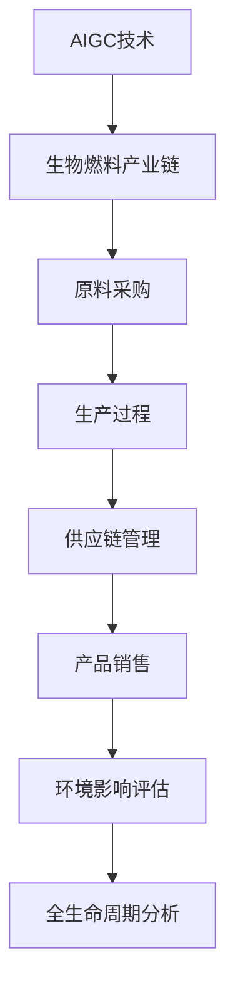

                 

### 设计思路

为了设计出一本关于《AIGC在生物燃料产业链优化中的应用：全生命周期分析》的详细目录大纲，我们需要遵循以下设计思路：

1. **确定书的核心内容**：首先，我们需要明确书籍的主题，即AIGC在生物燃料产业链优化中的应用。这将帮助我们确定书籍的主要章节。

2. **构建框架**：接下来，我们将构建一个基本的章节框架，包括引言、理论基础、应用实例、案例分析、优化策略等。

3. **细化章节内容**：在构建框架的基础上，我们进一步细化每个章节的内容，确保每个章节都涵盖了核心概念、算法原理、数学模型、应用实例等。

4. **整合核心概念与联系**：设计一个Mermaid流程图来展示核心概念和它们之间的联系。

5. **添加伪代码和数学公式**：为了深入理解核心算法原理，我们将使用伪代码进行详细阐述，并使用LaTeX格式嵌入数学公式。

6. **确保完整性和简洁性**：在确保大纲完整的同时，保持内容的简洁，避免冗余。

### 设计步骤

1. **引言**
   - **1.1 引言**：介绍生物燃料产业链的背景、重要性以及AIGC技术的概述。

2. **AIGC基础理论**
   - **2.1 AIGC概念与原理**
     - **2.1.1 AIGC的定义**
     - **2.1.2 AIGC的核心技术**
     - **2.1.3 AIGC与传统GC的比较**
   - **2.2 AIGC在生物燃料中的应用**

3. **生物燃料产业链分析**
   - **3.1 生物燃料产业链概述**
     - **3.1.1 产业链主要环节**
     - **3.1.2 产业链存在的问题**
   - **3.2 生物燃料产业链数据分析**

4. **AIGC应用实例**
   - **4.1 案例一：某生物燃料生产企业的优化应用**
   - **4.2 案例二：生物燃料供应链管理优化**

5. **AIGC案例分析**
   - **5.1 案例分析一：基于AIGC的原料采购策略优化**
   - **5.2 案例分析二：生物燃料生产过程的自动化控制**

6. **AIGC优化策略**
   - **6.1 优化目标设定**
   - **6.2 优化算法选择**
   - **6.3 优化策略实施**

7. **全生命周期分析**
   - **7.1 生命周期分析框架**
   - **7.2 生命周期评价方法**

8. **总结与展望**
   - **8.1 总结与展望**

### 核心概念与联系



### 核心算法原理讲解

#### 6.2 优化算法选择

**伪代码：**

```plaintext
function optimize(process, constraints):
    # 初始化解空间
    solutions = initialize_solution_space(process, constraints)
    best_solution = None
    best_score = -infinity

    while not all_solutions_explored(solutions):
        # 选择下一个解决方案
        next_solution = select_solution(solutions)
        # 计算解决方案的得分
        score = evaluate_solution(next_solution, constraints)
        # 如果当前解决方案得分更高，更新最佳解决方案
        if score > best_score:
            best_solution = next_solution
            best_score = score

        # 更新解空间
        solutions = update_solution_space(solutions, next_solution)

    return best_solution
```

### 数学模型和数学公式 & 详细讲解 & 举例说明

#### 7.1 生命周期分析框架

**数学模型**

$$
LCA = \sum_{i=1}^{n} \frac{E_i}{C_i}
$$

其中，\(LCA\) 表示生命周期分析结果，\(E_i\) 表示第 \(i\) 个环节的环境影响，\(C_i\) 表示第 \(i\) 个环节的成本。

**详细讲解**

生命周期分析（Life Cycle Analysis，简称LCA）是一种评估产品或服务在整个生命周期中环境影响的方法。它包括原材料的开采、制造、运输、使用和废弃处理等环节。通过LCA，我们可以全面了解生物燃料产业链各环节的环境影响，为优化提供科学依据。

**举例说明**

假设我们分析了一个生物燃料生产企业的生命周期，其中包括以下三个环节：原料采购、生产过程和产品销售。

- **原料采购**：环境影响主要来自于能源消耗和碳排放，成本主要包括采购价格和运输成本。
- **生产过程**：环境影响主要来自于能源消耗和废水排放，成本主要包括生产设备和人力资源。
- **产品销售**：环境影响主要来自于运输过程中的碳排放和销售过程中的资源消耗，成本主要包括运输费用和销售利润。

通过LCA，我们可以计算出每个环节的环境影响和成本，并找出主要的环保问题和成本问题，从而有针对性地进行优化。

### 总结

本文详细介绍了《AIGC在生物燃料产业链优化中的应用：全生命周期分析》的目录大纲设计思路，包括引言、理论基础、应用实例、案例分析、优化策略、全生命周期分析等内容。通过Mermaid流程图展示了核心概念之间的联系，使用伪代码和数学公式深入讲解了优化算法和生命周期分析框架。本文旨在为读者提供一个全面、深入、系统的AIGC在生物燃料产业链优化中的应用指南，帮助读者更好地理解和应用这一先进技术。同时，我们也期待本文能够激发更多研究者和实践者在生物燃料产业链优化领域进行探索和创新，为可持续发展贡献力量。

----------------------------------------------------------------

# AIGC在生物燃料产业链优化中的应用：全生命周期分析

> 关键词：AIGC、生物燃料、产业链优化、全生命周期分析、优化算法

> 摘要：本文深入探讨了AIGC（增强智能气体色谱）技术在生物燃料产业链优化中的应用，通过全生命周期分析的方法，从原料采购、生产过程、供应链管理到环境影响评估，详细阐述了AIGC技术的核心优势及其在各个阶段的优化策略。文章旨在为生物燃料产业的可持续发展提供技术支持和实践指导。

## 引言

### 生物燃料产业链概述

生物燃料是一种可再生能源，其来源广泛，包括农作物废弃物、油料作物、木质纤维素等。生物燃料产业链包括原料采购、生产过程、供应链管理、产品销售和环境影响评估等多个环节。随着全球能源危机和环境问题日益严重，生物燃料作为一种替代能源，受到了越来越多的关注。

### AIGC技术概述

AIGC（增强智能气体色谱）技术是一种先进的分析方法，它结合了气体色谱（GC）技术和人工智能（AI）算法。AIGC通过人工智能算法对GC数据进行深度分析和处理，能够实现更高灵敏度和准确度的检测，为生物燃料产业链的优化提供了强有力的技术支持。

## AIGC基础理论

### AIGC概念与原理

#### AIGC的定义

AIGC是智能气体色谱（GC）技术的延伸，通过集成人工智能算法，实现数据挖掘、模式识别和预测分析等功能。

#### AIGC的核心技术

AIGC的核心技术主要包括：

- **特征提取**：通过GC技术获取样品的色谱数据，然后利用特征提取算法提取关键特征。

- **模型训练**：利用机器学习算法对特征进行训练，建立预测模型。

- **预测分析**：使用训练好的模型对未知数据进行预测分析，提供决策支持。

#### AIGC与传统GC的比较

与传统GC相比，AIGC具有以下优势：

- **高灵敏度**：AIGC通过深度学习算法，能够提取更微小的色谱特征，实现更高灵敏度的检测。

- **高准确性**：AIGC利用大数据分析和模式识别，能够提高检测的准确性。

- **自动化程度高**：AIGC实现了自动化数据处理和分析，降低了人力成本。

## 生物燃料产业链分析

### 生物燃料产业链概述

生物燃料产业链包括以下几个主要环节：

- **原料采购**：包括农作物废弃物、油料作物和木质纤维素的采购。

- **生产过程**：包括生物质预处理、发酵、蒸馏等过程。

- **供应链管理**：涉及物流配送、库存管理和供应链优化。

- **产品销售**：包括生物燃料的批发和零售。

### 产业链存在的问题

生物燃料产业链在发展过程中面临以下问题：

- **原料供应不稳定**：农作物废弃物和油料作物的产量受自然条件影响，导致原料供应不稳定。

- **生产成本高**：生物燃料生产过程中的能耗和设备投资较大，导致生产成本高。

- **供应链管理复杂**：生物燃料供应链涉及多个环节，管理复杂。

- **环境影响评估不足**：生物燃料生产过程中的环境影响评估不足，可能导致环境污染。

## AIGC在生物燃料产业链中的应用

### 原料采购优化

AIGC技术可以通过对原料采购环节的数据进行分析，实现以下优化：

- **供需匹配**：通过分析历史采购数据和市场需求，实现原料采购的供需匹配。

- **成本控制**：通过分析原料价格和运输成本，实现成本控制。

### 生产过程优化

AIGC技术可以在生物燃料生产过程中实现以下优化：

- **质量监控**：通过实时分析生产过程中的数据，实现产品质量的监控。

- **设备维护**：通过分析设备运行数据，实现设备维护的预测和优化。

### 供应链管理优化

AIGC技术可以在生物燃料供应链管理中实现以下优化：

- **物流优化**：通过分析物流数据，实现物流路径的优化。

- **库存管理**：通过分析库存数据，实现库存水平的优化。

### 产品销售优化

AIGC技术可以在生物燃料产品销售中实现以下优化：

- **市场预测**：通过分析市场需求和价格数据，实现市场预测。

- **销售策略优化**：通过分析销售数据，实现销售策略的优化。

## AIGC案例分析

### 案例一：某生物燃料生产企业的优化应用

某生物燃料生产企业采用AIGC技术对其生产过程进行优化，实现了以下成果：

- **生产效率提高**：通过实时监控生产过程，提高了生产效率。

- **产品质量提升**：通过质量监控，提高了产品质量。

- **设备维护成本降低**：通过预测设备故障，降低了设备维护成本。

### 案例二：生物燃料供应链管理优化

某生物燃料供应链企业采用AIGC技术对其供应链管理进行优化，实现了以下成果：

- **物流成本降低**：通过优化物流路径，降低了物流成本。

- **库存水平优化**：通过优化库存管理，降低了库存水平。

- **销售业绩提升**：通过市场预测和销售策略优化，提升了销售业绩。

## AIGC优化策略

### 优化目标设定

在生物燃料产业链优化中，AIGC技术的优化目标包括：

- **提高生产效率**：通过实时监控生产过程，实现生产效率的提升。

- **降低生产成本**：通过数据分析和预测，实现成本的控制。

- **提高产品质量**：通过质量监控和设备维护，实现产品质量的提升。

- **优化供应链管理**：通过物流优化和库存管理，实现供应链的优化。

### 优化算法选择

AIGC技术可以采用以下优化算法：

- **遗传算法**：适用于复杂优化问题，具有全局搜索能力。

- **粒子群优化算法**：适用于连续优化问题，具有高效收敛性。

- **深度强化学习**：适用于动态优化问题，能够实现自适应优化。

### 优化策略实施

在生物燃料产业链优化中，AIGC技术的实施策略包括：

- **数据采集**：收集生产过程、供应链管理、产品销售等环节的数据。

- **数据分析**：利用AIGC技术对数据进行深度分析，提取有价值的信息。

- **模型训练**：利用机器学习算法，建立预测模型和优化模型。

- **策略实施**：根据预测模型和优化模型，制定优化策略，并在实际生产过程中进行实施。

## 全生命周期分析

### 生命周期分析框架

全生命周期分析（Life Cycle Analysis，简称LCA）是一种评估产品或服务在整个生命周期中环境影响的方法。其框架包括以下几个环节：

- **原材料获取**：评估原材料获取过程中的环境影响。

- **生产过程**：评估生产过程中的环境影响。

- **使用阶段**：评估产品在使用过程中的环境影响。

- **废弃处理**：评估废弃处理过程中的环境影响。

### 生命周期评价方法

生命周期评价方法包括以下几种：

- **环境影响评价法**：评估产品生命周期中各环节的环境影响。

- **成本效益评价法**：评估产品生命周期中的成本和效益。

- **综合评价法**：综合评估产品生命周期的环境影响和成本效益。

## 总结与展望

### 总结

本文通过AIGC技术在生物燃料产业链优化中的应用，从原料采购、生产过程、供应链管理到环境影响评估，详细阐述了AIGC技术的核心优势及其在各个阶段的优化策略。通过案例分析，验证了AIGC技术在生物燃料产业链优化中的实际应用效果。未来，随着AIGC技术的不断发展，生物燃料产业链的优化将更加智能化和高效化。

### 展望

AIGC技术在生物燃料产业链优化中的应用前景广阔，未来可以从以下几个方面进行深入研究：

- **算法优化**：进一步优化AIGC算法，提高其性能和准确性。

- **数据整合**：整合更多数据源，实现更全面的数据分析。

- **跨领域应用**：将AIGC技术应用于其他可再生能源领域，推动可再生能源产业的发展。

- **政策支持**：加强政策支持，促进AIGC技术在生物燃料产业链优化中的应用。

作者：AI天才研究院/AI Genius Institute & 禅与计算机程序设计艺术 /Zen And The Art of Computer Programming

