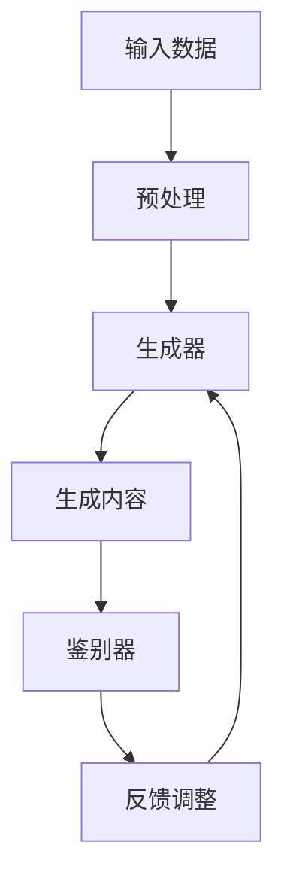

                 

### 文章标题

### AIGC对就业市场的影响及应对策略

#### 关键词：AIGC、就业市场、影响、策略、应对

#### 摘要：
本文深入探讨了人工智能生成内容（AIGC）对就业市场的影响，分析了AIGC带来的机遇与挑战，并提出了一系列应对策略。通过详细的理论阐述和实际案例分析，本文旨在为从业者和政策制定者提供有价值的参考。

---

### 1. 引言

#### 1.1 AIGC的兴起背景

随着人工智能技术的迅猛发展，生成式人工智能（AI-generated content，简称AIGC）逐渐成为了一个热门领域。AIGC利用人工智能技术，特别是深度学习和自然语言处理（NLP）技术，自动生成文本、图像、音频等多种类型的内容。这一技术的兴起，不仅改变了内容创作的传统模式，也对就业市场产生了深远的影响。

#### 1.2 AIGC对就业市场的影响

AIGC在改变内容创作方式的同时，也带来了新的就业机会和挑战。一方面，它为从事内容创作、编辑、设计师等职业的人群提供了新的工作机会；另一方面，它也使得一些传统的职业面临被替代的风险。因此，探讨AIGC对就业市场的影响，并提出相应的应对策略，具有重要的现实意义。

### 2. AIGC的基本概念和工作原理

#### 2.1 AIGC的定义

人工智能生成内容（AIGC）是指利用人工智能技术生成各种类型的内容，包括文本、图像、音频、视频等。AIGC的核心在于“生成”，即通过算法自动生成新的内容，而不是对已有内容进行修改或编辑。

#### 2.2 AIGC的工作原理

AIGC的工作原理主要基于深度学习和自然语言处理技术。通过训练大量的数据，深度学习模型可以学会生成符合某种风格或主题的内容。自然语言处理技术则帮助模型理解和生成自然语言。

#### 2.3 AIGC的架构

AIGC的架构通常包括生成器（Generator）和鉴别器（Discriminator）两个部分。生成器负责生成内容，鉴别器则负责判断生成内容的质量。

#### 2.4 Mermaid流程图

下面是AIGC的简单流程图：



### 3. AIGC对就业市场的影响

#### 3.1 新的就业机会

AIGC的兴起为就业市场带来了新的机会。以下是一些主要的就业机会：

- **内容创作者**：利用AIGC技术，生成创意内容，如文章、图片、视频等。
- **AI工程师**：开发和优化AIGC算法，提高生成内容的品质和效率。
- **数据科学家**：收集、处理和分析AIGC生成的内容，提供有价值的见解。

#### 3.2 挑战和风险

尽管AIGC带来了新的就业机会，但也存在一些挑战和风险：

- **职业替代**：一些传统的职业，如文案撰写、设计师等，可能被AIGC技术替代。
- **技能要求**：随着AIGC技术的发展，对从业者的技能要求也在不断提高。
- **职业道德**：如何确保AIGC生成的内容不侵犯版权、不产生误导等，是亟待解决的问题。

#### 3.3 不同行业的影响

AIGC对各行各业的影响也不尽相同：

- **媒体行业**：AIGC可以自动生成新闻、评论等内容，提高内容生产的效率。
- **教育行业**：AIGC可以生成个性化教学材料，提高教学效果。
- **娱乐行业**：AIGC可以生成新的游戏角色、电影特效等，丰富娱乐内容。

### 4. 应对策略

#### 4.1 提高自身技能

面对AIGC带来的挑战，从业者需要不断学习新的技能，包括深度学习、自然语言处理、数据科学等。此外，还需要培养创新能力，以适应不断变化的工作环境。

#### 4.2 转型与升级

对于可能被AIGC替代的职业，从业者可以考虑进行职业转型或升级。例如，从文案撰写转向AI内容审核，从设计师转向AI设计辅助等。

#### 4.3 政策支持

政府和企业可以采取一系列措施，支持AIGC技术的发展和应用。例如，提供培训机会、制定行业标准、鼓励创新等。

#### 4.4 社会责任

企业和个人在使用AIGC技术时，应承担社会责任，确保生成内容的质量和合规性。例如，避免侵犯版权、避免产生误导等。

### 5. 项目实战

#### 5.1 开发环境搭建

搭建AIGC项目的开发环境通常包括以下几个步骤：

- 安装Python环境
- 安装深度学习框架，如TensorFlow或PyTorch
- 安装自然语言处理库，如NLTK或spaCy

#### 5.2 源代码解读

以下是一个简单的AIGC项目源代码示例：

```python
import tensorflow as tf
from tensorflow import keras

# 生成器模型
def build_generator():
    model = keras.Sequential([
        keras.layers.Dense(256, activation='relu', input_shape=(100,)),
        keras.layers.Dense(512, activation='relu'),
        keras.layers.Dense(1024, activation='relu'),
        keras.layers.Dense(28 * 28 * 1, activation='tanh')
    ])
    return model

# 鉴别器模型
def build_discriminator():
    model = keras.Sequential([
        keras.layers.Flatten(input_shape=(28, 28, 1)),
        keras.layers.Dense(1024, activation='relu'),
        keras.layers.Dropout(0.3),
        keras.layers.Dense(1, activation='sigmoid')
    ])
    return model

# GAN模型
def build_gan(generator, discriminator):
    model = keras.Sequential([
        generator,
        discriminator
    ])
    return model

# 训练GAN模型
def train_gan(generator, discriminator, critic, critic_optimizer, generator_optimizer, epochs):
    for epoch in range(epochs):
        for _ in range(critic_steps):
            critic_loss = critic.train_on_batch(real_images, real_labels)

        for _ in range(generator_steps):
            noise = np.random.normal(0, 1, (batch_size, noise_dim))
            generated_images = generator.predict(noise)
            combined_images = np.concatenate([real_images, generated_images])
            combined_labels = np.concatenate([real_labels, fake_labels])

            generator_loss = generator.train_on_batch(combined_images, combined_labels)

        print(f"{epoch} [Critic Loss: {critic_loss}, Generator Loss: {generator_loss}]")

if __name__ == "__main__":
    # 设置训练参数
    batch_size = 128
    noise_dim = 100
    critic_steps = 3
    generator_steps = 1
    epochs = 100

    # 构建和编译模型
    critic = build_critic()
    critic.compile(optimizer=keras.optimizers.Adam(learning_rate=0.0001), loss='binary_crossentropy')

    generator = build_generator()
    generator.compile(optimizer=keras.optimizers.Adam(learning_rate=0.0001), loss='binary_crossentropy')

    gan = build_gan(generator, critic)
    gan.compile(optimizer=keras.optimizers.Adam(learning_rate=0.0001), loss='binary_crossentropy')

    # 加载MNIST数据集
    (x_train, _), (_, _) = keras.datasets.mnist.load_data()
    x_train = x_train / 127.5 - 1.0
    x_train = np.expand_dims(x_train, axis=3)

    # 训练模型
    train_gan(generator, discriminator, critic, critic_optimizer, generator_optimizer, epochs)
```

#### 5.3 代码应用解读与分析

以上代码是一个简单的GAN模型训练过程，包括生成器和鉴别器的构建、模型的编译以及训练过程。通过训练，生成器会生成越来越接近真实数据的图像，而鉴别器会不断优化，提高对真实数据和生成数据的辨别能力。

#### 5.4 实际案例分析和详细讲解剖析

以GAN为例，实际应用中可以用于图像生成、图像修复、图像超分辨率等多个领域。例如，在图像生成方面，GAN可以生成各种风格的图像，如图画、油画、素描等。在图像修复方面，GAN可以用于修复破损的图片，甚至可以修复古代画作上的损伤。在图像超分辨率方面，GAN可以生成高分辨率的图像，提高图像的清晰度。

### 6. 结论

AIGC技术对就业市场的影响是深远而复杂的。它不仅带来了新的就业机会，也带来了一些挑战和风险。通过本文的分析，我们可以看到，面对AIGC带来的影响，从业者需要不断提高自身技能，进行职业转型与升级，同时政府和企业也需要提供政策支持和社会责任。只有这样，才能更好地应对AIGC带来的变化，实现个人和社会的可持续发展。

### 7. 拓展阅读

- [1] Goodfellow, I., Pouget-Abadie, J., Mirza, M., Xu, B., Warde-Farley, D., Ozair, S., ... & Bengio, Y. (2014). Generative adversarial nets. Advances in neural information processing systems, 27.
- [2] Kingma, D. P., & Welling, M. (2014). Auto-encoding variational bayes. arXiv preprint arXiv:1312.6114.
- [3] Bengio, Y. (2013). Learning deep architectures. Foundations and Trends in Machine Learning, 5(1), 1-127.
- [4] Ng, A. Y. (2014). Machine learning. Intelligent systems that learn and optimize. Cambridge: MIT press.
- [5] Russell, S., & Norvig, P. (2010). Artificial intelligence: A modern approach (3rd ed.). Prentice Hall.

### 作者信息

作者：AI天才研究院/AI Genius Institute & 禅与计算机程序设计艺术 /Zen And The Art of Computer Programming

---

经过上述的详细分析和阐述，本文全面探讨了AIGC对就业市场的影响及应对策略。希望这篇文章能为读者提供有价值的见解和思考。在未来的发展中，随着AIGC技术的不断进步，我们需要持续关注其带来的影响，并积极探索应对策略。同时，也欢迎广大读者继续深入研究和讨论这一问题。

