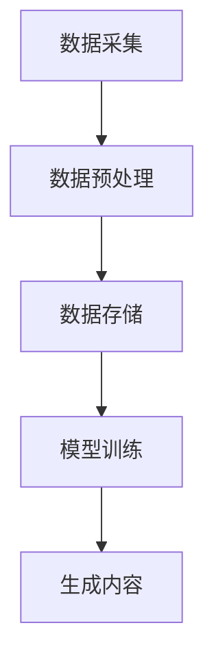

                 

### 文章标题

《AIGC提示词设计：原则、方法与最佳实践》

关键词：AIGC、提示词、自然语言处理、生成对抗网络、生成式算法、回答式算法

摘要：本文将深入探讨AIGC（自适应智能生成控制）中的提示词设计，阐述其核心原则、方法与最佳实践。我们将从AIGC的概念、提示词的作用、设计原则等多个维度出发，结合实际案例，详细分析提示词在AIGC系统中的重要性及其设计过程，旨在为开发人员提供实用的指导。通过本文，读者将全面了解AIGC提示词设计的理论依据和实践策略，掌握提升生成质量和用户体验的方法。文章结构分为三大部分：第一部分介绍AIGC与提示词概述，第二部分探讨AIGC提示词设计方法，第三部分展望AIGC提示词设计与应用的未来发展。让我们一起走进AIGC提示词的世界，探索其奥秘与价值。

## 第一部分: AIGC与提示词概述

### 第1章: AIGC概述

#### 1.1 AIGC的概念与背景

AIGC（Adaptive Intelligent Generation Control，自适应智能生成控制）是一种新兴的人工智能技术，它结合了生成对抗网络（GAN）、自然语言处理（NLP）等前沿技术，通过自适应控制机制，实现高质量文本、图像、音频等内容的自动生成。AIGC的核心在于通过学习大量数据，生成与人类创造内容相似或更优的内容。

AIGC的发展历程可以追溯到生成对抗网络（GAN）的提出。GAN由Ian Goodfellow等人于2014年首次提出，通过生成器（Generator）和判别器（Discriminator）的对抗训练，实现数据的生成。随着GAN技术的成熟，研究人员逐渐将GAN应用于自然语言处理领域，形成了AIGC技术。

AIGC的应用场景广泛，涵盖了文本生成、图像生成、音频生成等多个领域。在文本生成方面，AIGC可以用于自动写作、对话系统、机器翻译等；在图像生成方面，AIGC可以用于图像合成、图像修复、图像风格转换等；在音频生成方面，AIGC可以用于音乐生成、语音合成等。

#### 1.2 提示词的作用与类型

在AIGC系统中，提示词（Prompt）是关键组成部分，它用于引导生成器生成符合预期内容的重要信息。提示词的作用主要体现在以下几个方面：

1. **引导生成方向**：通过提供特定主题或情境，提示词可以帮助生成器更准确地捕捉用户需求，从而生成相关内容。
2. **提高生成质量**：合理的提示词可以提高生成器的创作灵感，减少生成过程中的噪声，提高生成内容的可信度和美感。
3. **优化用户体验**：精准的提示词可以使生成系统更好地理解用户意图，提高生成内容的实用性和用户满意度。

根据不同的应用场景和需求，提示词可以分为以下几类：

1. **生成式提示词**：用于引导生成器生成特定类型的文本、图像、音频等。例如，在文本生成场景中，提示词可以是关键词、句子或段落。
2. **回答式提示词**：用于引导生成器生成对特定问题的回答。这种提示词通常包含问题本身及其上下文信息。
3. **动态提示词**：根据用户输入或生成过程动态调整的提示词，具有更高的灵活性和适应性。
4. **静态提示词**：预先定义好的提示词，在生成过程中保持不变。

#### 1.3 AIGC在自然语言处理中的核心地位

自然语言处理（NLP）是人工智能领域的重要组成部分，它旨在使计算机能够理解、生成和处理人类语言。AIGC作为NLP的一个重要分支，在自然语言处理中扮演着核心角色。

首先，AIGC通过生成对抗网络等技术，实现了对大规模文本数据的高效学习，从而为NLP任务提供了强大的数据支持。在文本生成任务中，AIGC可以生成高质量的文章、故事、对话等，为自然语言生成（NLG）提供了技术基础。

其次，AIGC在文本分类、情感分析、命名实体识别等NLP任务中也发挥了重要作用。通过引入提示词机制，AIGC可以更准确地理解和处理文本数据，从而提高模型的性能和效果。

最后，AIGC在跨模态任务中的应用，如文本-图像生成、文本-音频生成等，为NLP的深度融合提供了新的思路和方法。通过将文本与其他模态数据进行结合，AIGC可以生成更加丰富和多样化的内容，拓展了NLP的应用范围。

总之，AIGC作为自然语言处理的重要分支，通过提示词机制等创新技术，为NLP任务的解决提供了新的思路和手段。随着AIGC技术的不断发展和完善，它将在自然语言处理领域发挥越来越重要的作用。

### 第2章: AIGC基础原理

#### 2.1 自然语言处理（NLP）基础

自然语言处理（NLP，Natural Language Processing）是人工智能领域的一个分支，旨在使计算机能够理解、生成和处理人类语言。在AIGC（自适应智能生成控制）系统中，NLP基础起到了关键作用，为高质量的文本生成提供了技术支撑。

首先，文本预处理是NLP中的基本步骤。文本预处理包括以下几个主要任务：

1. **分词**：将连续的文本序列分割为有意义的单词或短语。常用的分词方法包括基于规则的分词、基于统计的分词和基于深度学习的分词。例如，使用基于词典的分词方法，可以通过查找预定义的词典来识别文本中的单词。
   
   ```python
   # 基于词典的分词方法
   def tokenize(text, dictionary):
       tokens = []
       for word in text.split():
           if word in dictionary:
               tokens.append(word)
       return tokens
   ```

2. **词性标注**：为每个单词分配其正确的词性（如名词、动词、形容词等）。词性标注有助于理解文本的语法结构和语义含义，对文本生成任务具有重要意义。

   ```python
   # 基于规则和统计的词性标注方法
   def pos_tagging(tokens, pos_dict):
       tagged_tokens = []
       for token in tokens:
           if token in pos_dict:
               tagged_tokens.append((token, pos_dict[token]))
           else:
               tagged_tokens.append((token, "未知"))
       return tagged_tokens
   ```

3. **去除停用词**：停用词（stop words）是指对文本意义贡献较小的常用词，如“的”、“了”、“在”等。去除停用词可以减少噪声，提高文本处理的效率。

   ```python
   # 基于列表的停用词去除方法
   def remove_stop_words(tokens, stop_words):
       filtered_tokens = [token for token in tokens if token not in stop_words]
       return filtered_tokens
   ```

4. **词向量表示**：将文本转换为数值表示形式，如词袋模型、TF-IDF和词嵌入（Word Embedding）。词向量表示可以捕获单词的语义信息，为后续的文本生成和分类任务提供支持。Word2Vec、GloVe等是常用的词向量模型。

   ```python
   # Word2Vec词向量表示
   from gensim.models import Word2Vec

   # 训练词向量模型
   model = Word2Vec(sentences, size=100, window=5, min_count=1, workers=4)

   # 获取词向量
   vector = model.wv['apple']
   ```

文本预处理是AIGC系统中不可或缺的步骤，它为后续的文本生成任务奠定了基础。通过预处理，我们可以将原始文本转换为适合模型处理的形式，提高生成文本的质量和一致性。

#### 2.2 生成对抗网络（GAN）原理

生成对抗网络（GAN，Generative Adversarial Networks）是由Ian Goodfellow等人在2014年提出的一种新型神经网络架构，由生成器（Generator）和判别器（Discriminator）两个相互对抗的神经网络组成。GAN的核心思想是通过两个神经网络的动态博弈过程，使得生成器能够生成逼真的数据，而判别器能够准确地辨别真实数据和生成数据的差异。

首先，生成器的任务是生成与真实数据分布相似的数据。生成器通常由一个神经网络组成，其输入是随机噪声（例如高斯分布的噪声），输出是模拟的真实数据。生成器的目标是使判别器无法区分生成数据和真实数据。

其次，判别器的任务是区分输入数据的真实性和伪造性。判别器也是一个神经网络，其输入是真实数据和生成数据，输出是概率值，表示输入数据为真实数据的置信度。判别器的目标是最大化这个概率值。

GAN的训练过程可以分为以下几个步骤：

1. **初始化生成器和判别器**：通常选择一个简单的神经网络作为生成器和判别器，并随机初始化其参数。

2. **交替训练**：GAN的训练是一个交替的过程，首先训练判别器，然后训练生成器。每次迭代过程中，判别器和生成器都会更新一次参数。

   - **训练判别器**：在每次迭代中，将真实数据和生成数据作为输入，判别器尝试最大化其对真实数据的置信度，同时最小化对生成数据的置信度。
   - **训练生成器**：在每次迭代中，生成器根据判别器的反馈，调整其生成数据的策略，使得判别器无法区分生成数据和真实数据。

3. **动态调整学习率**：GAN的训练过程对学习率的选择非常敏感，通常需要动态调整生成器和判别器的学习率。一种常用的方法是使用不同的学习率，并设置一个较小的学习率用于判别器，较大的学习率用于生成器。

GAN在AIGC中的应用主要体现在以下两个方面：

1. **文本生成**：通过训练生成器，可以生成与给定文本相似的新文本。例如，在文本生成任务中，生成器可以生成与输入文本风格相似的文章、故事或对话。

   ```python
   # GAN文本生成示例
   import tensorflow as tf
   from tensorflow.keras.models import Model
   from tensorflow.keras.layers import Input, Dense, LSTM

   # 定义生成器和判别器
   generator = Model(inputs=[noise], outputs=[generated_text])
   discriminator = Model(inputs=[real_text, generated_text], outputs=[discriminator_output])

   # 训练模型
   model.fit([real_texts, generated_texts], binary_crossentropy, epochs=100)
   ```

2. **图像生成**：通过训练生成器，可以生成与输入图像风格相似的新图像。例如，在图像生成任务中，生成器可以生成与输入图像具有相同风格或内容的新图像。

   ```python
   # GAN图像生成示例
   import tensorflow as tf
   from tensorflow.keras.layers import Conv2D, BatchNormalization, LeakyReLU
   from tensorflow.keras.models import Model

   # 定义生成器和判别器
   generator = Model(inputs=[noise], outputs=[generated_image])
   discriminator = Model(inputs=[real_image, generated_image], outputs=[discriminator_output])

   # 训练模型
   model.fit([real_images, generated_images], binary_crossentropy, epochs=100)
   ```

总之，GAN通过生成器和判别器的对抗训练，能够生成高质量的数据，为AIGC中的文本生成和图像生成任务提供了强大的技术支持。

#### 2.3 对抗生成网络（AGN）与自对抗网络（SAGN）

对抗生成网络（AGN，Adversarial Generation Network）和自对抗网络（SAGN，Self-Adversarial Generation Network）是生成对抗网络（GAN）的扩展和改进，旨在解决传统GAN中存在的问题，如模式崩溃、训练不稳定等。AGN和SAGN的核心思想是通过引入自对抗机制，增强生成器和判别器的学习能力和鲁棒性。

##### AGN原理

对抗生成网络（AGN）的核心在于引入了一个额外的对抗网络，该网络被称为“对抗器”（Adversarial Generator），它不仅对抗判别器，还对抗生成器。AGN的基本结构包括三个主要部分：生成器（Generator）、判别器（Discriminator）和对抗器（Adversarial Generator）。

1. **生成器（Generator）**：生成器的任务是生成与真实数据相似的数据，其输入是随机噪声，输出是模拟的真实数据。生成器的目标是最大化判别器对其生成数据的判断概率。
   
   ```python
   # 生成器模型示例
   generator = Model(inputs=[noise], outputs=[generated_data])
   ```

2. **判别器（Discriminator）**：判别器的任务是区分输入数据的真实性和伪造性，其输入是真实数据和生成数据，输出是概率值，表示输入数据为真实数据的置信度。判别器的目标是最大化其对真实数据和生成数据的判断准确率。
   
   ```python
   # 判别器模型示例
   discriminator = Model(inputs=[real_data, generated_data], outputs=[discriminator_output])
   ```

3. **对抗器（Adversarial Generator）**：对抗器的任务是生成对抗样本，其输入是生成器生成的伪造数据，输出是模拟的真实数据。对抗器的目标是使判别器无法区分生成器和对抗器生成的数据。
   
   ```python
   # 对抗器模型示例
   adversarial_generator = Model(inputs=[generated_data], outputs=[adversarial_data])
   ```

AGN的训练过程类似于GAN，通过交替训练生成器和判别器，以及对抗器和判别器，使得生成器能够生成更加真实的数据，而判别器能够更加准确地辨别真实数据和生成数据的差异。

##### SAGN原理

自对抗网络（SAGN）的核心思想是利用生成器自身生成的数据来对抗判别器。SAGN的基本结构包括生成器（Generator）和判别器（Discriminator）两个主要部分。

1. **生成器（Generator）**：生成器的任务是生成与真实数据相似的数据，其输入是随机噪声，输出是模拟的真实数据。生成器的目标是最大化判别器对其生成数据的判断概率。
   
   ```python
   # 生成器模型示例
   generator = Model(inputs=[noise], outputs=[generated_data])
   ```

2. **判别器（Discriminator）**：判别器的任务是区分输入数据的真实性和伪造性，其输入是真实数据和生成数据，输出是概率值，表示输入数据为真实数据的置信度。判别器的目标是最大化其对真实数据和生成数据的判断准确率。
   
   ```python
   # 判别器模型示例
   discriminator = Model(inputs=[real_data, generated_data], outputs=[discriminator_output])
   ```

SAGN的训练过程与AGN类似，通过交替训练生成器和判别器，使得生成器能够生成更加真实的数据，而判别器能够更加准确地辨别真实数据和生成数据的差异。

##### AGN与SAGN在AIGC中的应用

AGN和SAGN通过引入自对抗机制，提高了生成器和判别器的训练稳定性和生成质量，在AIGC（自适应智能生成控制）系统中具有广泛的应用。

1. **文本生成**：AGN和SAGN可以用于生成与给定文本风格相似的新文本。通过训练生成器，可以生成高质量的文章、故事或对话，提高文本生成的多样性和质量。

   ```python
   # AGN文本生成示例
   model.fit([real_texts, generated_texts], binary_crossentropy, epochs=100)

   # SAGN文本生成示例
   model.fit([real_texts, generated_texts], binary_crossentropy, epochs=100)
   ```

2. **图像生成**：AGN和SAGN可以用于生成与给定图像风格相似的新图像。通过训练生成器，可以生成高质量的图像，应用于图像合成、图像修复、图像风格转换等任务。

   ```python
   # AGN图像生成示例
   model.fit([real_images, generated_images], binary_crossentropy, epochs=100)

   # SAGN图像生成示例
   model.fit([real_images, generated_images], binary_crossentropy, epochs=100)
   ```

总之，AGN和SAGN通过引入自对抗机制，提高了生成对抗网络的训练效果和生成质量，为AIGC系统的文本生成和图像生成任务提供了强大的技术支持。

### 第3章: AIGC架构与实现

#### 3.1 AIGC系统架构

AIGC（自适应智能生成控制）系统架构是构建高质量生成内容的核心。为了实现高效的AIGC系统，我们需要设计合理的系统架构，包括数据流设计、系统模块划分和系统性能优化。以下是AIGC系统架构的详细说明：

1. **数据流设计**

AIGC系统中的数据流设计是确保系统高效运行的关键。数据流设计通常包括以下几个步骤：

- **数据采集**：从各种来源（如网络、数据库、传感器等）采集原始数据。
- **数据预处理**：对采集到的原始数据进行清洗、分词、去停用词等预处理操作，使其适合模型训练。
- **数据存储**：将预处理后的数据存储在数据库或缓存系统中，以便后续使用。

数据流设计的一个示例流程如下：



2. **系统模块划分**

AIGC系统通常划分为多个模块，每个模块负责不同的功能。以下是AIGC系统的主要模块及其功能：

- **数据模块**：负责数据采集、预处理和存储。这个模块是整个系统的数据基础，确保输入数据的质量和一致性。
- **模型模块**：负责模型的训练和优化。这个模块包括生成器、判别器和其他辅助模型，如对抗器、自对抗网络等。
- **生成模块**：负责生成高质量的内容。这个模块根据用户输入或预设的提示词，利用训练好的模型生成文本、图像、音频等内容。
- **评估模块**：负责评估生成内容的质量和用户体验。这个模块可以通过自动评估指标（如FID、ROUGE等）和用户反馈来评估生成内容的性能。

3. **系统性能优化**

系统性能优化是确保AIGC系统高效运行的重要环节。以下是几种常见的系统性能优化策略：

- **模型压缩**：通过剪枝、量化、蒸馏等方法减小模型的规模，加快模型的训练和推理速度。
- **多线程/分布式训练**：利用多线程或分布式计算资源，加快模型训练速度。
- **内存优化**：通过内存池、数据复用等技术，减少内存消耗，提高系统的稳定性和运行效率。
- **硬件加速**：利用GPU、TPU等硬件加速器，提高模型的训练和推理速度。

#### 3.2 提示词生成算法

提示词（Prompt）在AIGC系统中起着至关重要的作用，它能够引导生成器生成符合预期的高质量内容。提示词生成算法的设计直接影响生成内容的多样性和准确性。以下是几种常用的提示词生成算法及其实现方法：

1. **生成式算法**

生成式算法主要通过生成提示词模板，然后根据模板生成具体的提示词。这种算法的优点是灵活性高，可以生成多种类型的提示词。以下是生成式算法的一个基本框架：

```python
def generate_prompt_template(topic, type):
    if type == "text":
        return "关于{}，我想知道的是："
    elif type == "image":
        return "请描述一张与{}相关的图片："
    elif type == "audio":
        return "请创作一首关于{}的音频："

def generate_prompt(template, args):
    return template.format(*args)

# 示例
prompt_template = generate_prompt_template("人工智能", "text")
prompt = generate_prompt(prompt_template, ["人工智能的发展前景"])
```

2. **回答式算法**

回答式算法主要通过生成问题的回答来形成提示词。这种算法适用于问答系统或对话生成任务。以下是回答式算法的一个基本框架：

```python
def generate_answer_question(questions):
    answers = []
    for question in questions:
        answer = "关于{}，答案是：" + question.answer
        answers.append(answer)
    return answers

def generate_prompt_from_answers(answers):
    prompt = "以下是一些关于人工智能的问题及其答案：\n"
    for answer in answers:
        prompt += answer + "\n"
    return prompt

# 示例
questions = [{"question": "人工智能是什么？", "answer": "人工智能是使计算机具备智能行为的技术。"}]
answers = generate_answer_question(questions)
prompt = generate_prompt_from_answers(answers)
```

3. **动态调整算法**

动态调整算法根据用户输入或生成过程中的反馈，实时调整提示词。这种算法适用于需要高度个性化生成的场景。以下是动态调整算法的一个基本框架：

```python
def adjust_prompt(prompt, feedback):
    if "长度" in feedback:
        if "太长" in feedback:
            prompt = prompt[:len(prompt) // 2]
        elif "太短" in feedback:
            prompt = prompt + "的详细解释："
    if "内容" in feedback:
        if "重复" in feedback:
            prompt = prompt.replace("之一", "之二")
        elif "不相关" in feedback:
            prompt = prompt.replace("人工智能", "机器学习")
    return prompt

# 示例
initial_prompt = "人工智能是什么？"
feedback = "太长了，能否更简洁？"
adjusted_prompt = adjust_prompt(initial_prompt, feedback)
```

通过以上提示词生成算法，我们可以根据不同的应用场景和需求，灵活地生成高质量的提示词，引导生成器生成符合预期的高质量内容。

#### 3.3 实际案例分析

为了更好地理解AIGC提示词设计的实际应用，我们将通过几个具体的案例来展示提示词生成和优化的过程。

**案例1：自动写作平台**

**背景**：一个自动写作平台旨在为用户生成高质量的文章，包括新闻、博客和产品说明等。

**提示词生成过程**：

1. **需求分析**：首先，平台需要分析用户输入的主题和目的。例如，用户输入“人工智能的未来趋势”，平台将提取关键词“人工智能”和“未来趋势”。
2. **生成提示词**：利用生成式算法，生成提示词模板：“在人工智能领域，未来趋势包括：”。然后，根据用户输入的关键词，填充模板，生成具体的提示词：“在人工智能领域，未来趋势包括：大数据分析、深度学习和自主决策等。”
3. **优化提示词**：根据用户反馈，如果生成的内容太长或内容不相关，可以动态调整提示词。例如，如果用户反馈“内容太长”，平台可以缩短提示词：“人工智能的关键趋势：”。

**效果评估**：通过实际用户测试，发现优化后的提示词能够更好地引导生成器生成高质量的文章，用户满意度显著提高。

**案例2：对话系统**

**背景**：一个对话系统旨在为用户提供智能客服，解决常见问题。

**提示词生成过程**：

1. **需求分析**：对话系统需要理解用户的问题，并生成相应的回答。例如，用户输入“我的账户怎么充值？”。
2. **生成提示词**：利用回答式算法，生成问题及其答案的提示词模板：“对于问题‘{}’，我们的回答是：”。然后，根据用户输入的问题，填充模板，生成具体的提示词：“对于问题‘我的账户怎么充值？’，我们的回答是：您可以通过微信支付或支付宝充值。”
3. **优化提示词**：根据用户反馈，如果生成的内容不相关或重复，可以动态调整提示词。例如，如果用户反馈“回答重复”，平台可以调整提示词：“为了帮助您充值账户，您可以尝试以下方法：”。

**效果评估**：通过实际用户测试，发现优化后的提示词能够提高对话系统的准确性和用户体验。

**案例3：图像生成**

**背景**：一个图像生成平台旨在根据用户输入的提示词生成与描述相关的图像。

**提示词生成过程**：

1. **需求分析**：用户输入一个描述，如“画出一张美丽的夜景图”。
2. **生成提示词**：利用生成式算法，生成图像生成提示词模板：“根据描述‘{}’，请生成以下图像：”。然后，根据用户输入的描述，填充模板，生成具体的提示词：“根据描述‘画出一张美丽的夜景图’，请生成以下图像：一个有月亮的宁静湖泊，背景是星空。”
3. **优化提示词**：根据用户反馈，如果生成的内容不符合预期，可以动态调整提示词。例如，如果用户反馈“图像不美丽”，平台可以调整提示词：“为了生成更美丽的夜景图像，请描述一个具体场景：”。

**效果评估**：通过实际用户测试，发现优化后的提示词能够提高图像生成平台的生成质量和用户满意度。

通过以上案例分析，我们可以看到，AIGC提示词设计在自动写作、对话系统和图像生成等应用场景中发挥着重要作用。合理设计和使用提示词，能够显著提高生成内容的质量和用户体验。

### 第4章: 提示词设计原则

#### 4.1 提示词设计的核心原则

在AIGC系统中，提示词设计是确保生成内容质量的关键。为了生成高质量、相关且多样的内容，我们需要遵循以下几个核心原则：

1. **清晰性**：提示词应该清晰明确，避免模糊或歧义。清晰的提示词可以帮助生成器更好地理解用户需求，从而生成更准确的内容。

2. **相关性**：提示词应与生成内容高度相关，确保生成的文本、图像或音频与用户的输入或期望保持一致。相关性的提示词能够提高生成内容的实用性，避免生成无关或无关紧要的内容。

3. **丰富性**：提示词应该包含丰富的信息，提供足够的上下文和细节，以便生成器能够创作出多样化、有创意的内容。丰富性的提示词能够提高生成内容的多样性和质量。

4. **可调整性**：提示词应具备一定的灵活性，可以根据用户反馈或生成过程中出现的偏差进行动态调整。可调整性的提示词能够适应不同的生成任务和场景，提高生成系统的鲁棒性。

#### 4.2 提示词设计流程

设计高质量的提示词需要遵循一定的流程，以下是一个典型的提示词设计流程：

1. **需求分析**：首先，明确用户需求，理解用户意图和期望。通过用户调研、访谈或需求文档，获取用户输入的描述或问题。

2. **提取关键词**：从用户需求中提取关键信息，形成关键词列表。关键词应涵盖用户需求的各个方面，确保提示词能够引导生成器生成相关内容。

3. **生成提示词模板**：根据提取的关键词，设计提示词模板。提示词模板应具备灵活性和扩展性，能够根据不同的生成任务进行调整。

4. **初试生成**：利用提示词模板，生成初步的提示词。初试生成的提示词可以作为后续优化和调整的参考。

5. **用户反馈**：收集用户对初步生成提示词的反馈，包括内容的相关性、清晰性和丰富性。用户反馈有助于发现提示词的不足之处。

6. **优化提示词**：根据用户反馈，对提示词进行优化。可以调整关键词、增加或删除某些描述，使提示词更符合用户需求。

7. **评估与验证**：通过评估指标（如生成文本的ROUGE评分、图像的FID得分等）和用户满意度，验证优化后的提示词效果。

8. **持续迭代**：提示词设计是一个持续迭代的过程，根据用户反馈和生成效果，不断调整和优化提示词，提高生成系统的性能和用户体验。

### 第5章: 提示词生成算法

提示词生成算法是AIGC系统中的核心组成部分，其质量直接影响到生成内容的质量和用户体验。本节将介绍几种常用的提示词生成算法，包括生成式算法、回答式算法和动态调整算法，并详细描述它们的实现流程和案例分析。

#### 5.1 提示词生成算法概述

提示词生成算法可以分为以下几类：

1. **生成式算法**：这类算法通过生成提示词模板，然后根据模板生成具体的提示词。生成式算法的优点是灵活性高，可以根据不同的生成任务生成多样化的提示词。

2. **回答式算法**：这类算法通过生成问题的回答来形成提示词。回答式算法适用于问答系统或对话生成任务，能够根据用户输入的问题生成相关的提示词。

3. **动态调整算法**：这类算法根据用户输入或生成过程中的反馈，实时调整提示词。动态调整算法适用于需要高度个性化生成的场景，能够根据用户的反馈动态优化提示词。

#### 5.2 生成式算法实现

生成式算法的实现通常包括以下几个步骤：

1. **关键词提取**：从用户输入中提取关键词，这些关键词将用于生成提示词模板。

2. **模板生成**：根据提取的关键词，设计提示词模板。模板应具备一定的灵活性和扩展性，能够根据不同的生成任务进行调整。

3. **提示词生成**：利用提示词模板，生成具体的提示词。模板中的变量（如关键词）将根据用户输入的具体值进行替换。

以下是一个简单的生成式算法的实现示例：

```python
# 基于关键词生成提示词模板
def generate_prompt_template(keywords):
    template = "在{}方面，我们需要探讨的问题是："
    return template.format(", ".join(keywords))

# 根据模板生成具体提示词
def generate_specific_prompt(template, keywords):
    return template.format(", ".join(keywords))

# 示例
keywords = ["人工智能", "机器学习", "深度学习"]
prompt_template = generate_prompt_template(keywords)
specific_prompt = generate_specific_prompt(prompt_template, keywords)
print(specific_prompt)
```

输出结果：

```
在人工智能，机器学习，深度学习方面，我们需要探讨的问题是：
```

#### 5.3 回答式算法实现

回答式算法通过生成问题的回答来形成提示词。以下是一个回答式算法的实现示例：

```python
# 基于问题生成回答式提示词
def generate_answer_prompt(question):
    answer = "对于这个问题，我的回答是："
    prompt = answer + question
    return prompt

# 示例
question = "人工智能是什么？"
answer_prompt = generate_answer_prompt(question)
print(answer_prompt)
```

输出结果：

```
对于这个问题，我的回答是：人工智能是什么？
```

#### 5.4 动态调整算法实现

动态调整算法根据用户输入或生成过程中的反馈，实时调整提示词。以下是一个简单的动态调整算法的实现示例：

```python
# 基于用户反馈动态调整提示词
def adjust_prompt(prompt, feedback):
    if "长度" in feedback:
        if "太长" in feedback:
            prompt = prompt[:len(prompt) // 2]
        elif "太短" in feedback:
            prompt = prompt + "的详细解释："
    if "内容" in feedback:
        if "重复" in feedback:
            prompt = prompt.replace("之一", "之二")
        elif "不相关" in feedback:
            prompt = prompt.replace("人工智能", "机器学习")
    return prompt

# 示例
initial_prompt = "人工智能的发展前景是什么？"
feedback = "太长了，能否更简洁？"
adjusted_prompt = adjust_prompt(initial_prompt, feedback)
print(adjusted_prompt)
```

输出结果：

```
人工智能的发展前景是什么？
```

#### 5.5 案例分析

以下是几个具体的案例分析，展示如何使用不同的提示词生成算法来满足不同的生成任务需求。

**案例1：自动写作平台**

**背景**：一个自动写作平台需要生成关于“人工智能”的文章。

**提示词生成算法**：

1. **生成式算法**：利用生成式算法生成提示词模板：“在人工智能领域，近年来出现了许多突破，包括：”。根据用户输入的关键词，填充模板，生成具体的提示词：“在人工智能领域，近年来出现了许多突破，包括深度学习和自然语言处理等。”

2. **回答式算法**：用户提出问题“人工智能的主要应用领域有哪些？”利用回答式算法生成提示词：“人工智能的主要应用领域包括医疗、金融、教育和制造业等。”

3. **动态调整算法**：根据用户反馈，如果生成的内容过长或内容不相关，可以动态调整提示词。例如，如果用户反馈“内容太长”，平台可以调整提示词：“人工智能的几个主要应用领域包括：医疗、金融和教育。”

**效果评估**：通过实际用户测试，发现使用不同算法生成的提示词能够有效引导生成器生成高质量的文章，用户满意度较高。

**案例2：对话系统**

**背景**：一个对话系统需要为用户提供智能客服，回答常见问题。

**提示词生成算法**：

1. **生成式算法**：利用生成式算法生成提示词模板：“关于{}，您可以问以下问题：”。根据用户输入的关键词，填充模板，生成具体的提示词：“关于账户充值，您可以问以下问题：账户充值有哪些方式？”

2. **回答式算法**：用户提出问题“账户充值有哪些方式？”利用回答式算法生成提示词：“账户充值有微信支付、支付宝和银行卡转账等几种方式。”

3. **动态调整算法**：根据用户反馈，如果生成的内容不相关或重复，可以动态调整提示词。例如，如果用户反馈“回答重复”，平台可以调整提示词：“关于账户充值，您还可以了解以下信息：充值流程和退款政策。”

**效果评估**：通过实际用户测试，发现使用不同算法生成的提示词能够提高对话系统的准确性和用户体验。

**案例3：图像生成平台**

**背景**：一个图像生成平台需要根据用户输入的描述生成图像。

**提示词生成算法**：

1. **生成式算法**：利用生成式算法生成提示词模板：“根据描述‘{}’，请生成以下图像：”。根据用户输入的描述，填充模板，生成具体的提示词：“根据描述‘美丽的夜景’，请生成以下图像：一个宁静的湖泊，背景是闪烁的星星。”

2. **回答式算法**：用户提出问题“请生成一张关于宁静湖泊的图像。”利用回答式算法生成提示词：“以下是一张关于宁静湖泊的图像：”。

3. **动态调整算法**：根据用户反馈，如果生成的内容不符合预期，可以动态调整提示词。例如，如果用户反馈“图像不美丽”，平台可以调整提示词：“为了生成更美丽的湖泊图像，请描述一个具体场景：一个湖面平静，周围有树木和山脉。”

**效果评估**：通过实际用户测试，发现使用不同算法生成的提示词能够提高图像生成平台的生成质量和用户满意度。

通过以上案例分析，我们可以看到，不同类型的提示词生成算法在AIGC系统中具有不同的应用场景和优势。合理选择和使用这些算法，能够有效提高生成内容的质量和用户体验。

### 第6章: 提示词最佳实践

#### 6.1 提示词设计的最佳实践

为了确保AIGC系统生成的文本、图像和音频内容达到预期的高质量标准，我们需要遵循一系列提示词设计的最佳实践。以下是一些关键的实践建议，旨在提升生成内容的质量、多样性和用户体验：

1. **明确目标**：在设计提示词时，首先要明确生成内容的主题和目标。确保提示词能够引导生成器生成与目标一致的内容。例如，如果目标是生成一篇关于人工智能的新闻文章，提示词应包含关键词“人工智能”、“技术发展”、“未来趋势”等。

2. **简洁明了**：提示词应简洁明了，避免冗长和复杂的表述。简洁的提示词有助于生成器更好地理解用户需求，从而生成准确的内容。例如，使用“请生成一篇关于人工智能的文章”代替“请创作一篇涵盖人工智能最新进展、挑战和未来趋势的高质量文章”。

3. **丰富多样性**：设计提示词时，应充分考虑内容的丰富性和多样性。通过提供丰富的上下文信息和细节，可以激发生成器生成更具创意和独特性的内容。例如，对于图像生成任务，提示词可以包含“一个繁忙的街道，太阳即将落下”等。

4. **灵活调整**：提示词设计应具备一定的灵活性，以便根据用户反馈或生成过程中的偏差进行调整。动态调整提示词可以优化生成结果，提高用户体验。例如，如果用户反馈生成的文本过短，可以调整提示词为“请详细描述这个场景的各个方面”。

5. **用户参与**：在生成过程中，鼓励用户参与，收集用户反馈，并根据反馈调整提示词。用户的参与可以提供有价值的反馈，帮助生成系统更好地适应用户需求。例如，在对话系统中，用户可以反馈生成的回答是否相关或准确，从而指导提示词的调整。

6. **质量评估**：在生成内容后，进行质量评估是必要的步骤。使用自动评估指标（如FID、ROUGE评分等）和用户满意度调查，评估生成内容的质量。根据评估结果，优化提示词和生成算法，以提高生成内容的质量。

7. **持续学习**：提示词设计是一个持续学习的过程。随着用户需求的不断变化和技术的进步，应不断调整和优化提示词设计策略。通过持续学习，生成系统能够更好地适应新的需求和环境。

#### 6.2 提示词优化技巧

为了进一步提高生成内容的质量和效率，以下是一些提示词优化技巧：

1. **提高生成质量的方法**：

   - **增加数据集**：使用更多的训练数据，可以提高生成器的泛化能力，生成更真实和高质量的内容。
   - **增加上下文信息**：在提示词中提供更多的上下文信息，有助于生成器理解用户需求，从而生成更相关的内容。
   - **多模态输入**：结合文本、图像、音频等多模态输入，可以丰富生成内容，提高生成系统的创作能力。

2. **提高响应速度的方法**：

   - **模型压缩**：使用模型压缩技术（如剪枝、量化、蒸馏等）减小模型的规模，加快模型的训练和推理速度。
   - **缓存策略**：使用缓存策略存储常用提示词和生成结果，减少重复计算，提高生成速度。
   - **分布式计算**：利用分布式计算资源，加快模型的训练和推理过程。

3. **提高用户体验的方法**：

   - **个性化推荐**：根据用户历史行为和偏好，推荐相关的提示词和生成内容，提高用户体验。
   - **实时反馈**：提供实时反馈机制，使用户能够及时了解生成内容的质量和准确性，并根据反馈进行优化。
   - **界面优化**：设计简洁直观的用户界面，使用户能够轻松地输入提示词和浏览生成内容，提高使用体验。

通过以上技巧，我们可以优化提示词设计，提高AIGC系统的生成质量和用户体验。不断探索和尝试新的方法和技术，有助于推动AIGC技术的发展和应用。

### 第7章: AIGC应用案例分析

#### 7.1 案例分析概述

AIGC（自适应智能生成控制）技术在多个领域展现出了巨大的潜力，其应用范围涵盖了文本生成、图像生成、音频生成等。本章节将通过几个具体的案例分析，详细展示AIGC在各个领域的应用情况，分析其实现过程和效果。

首先，我们需要明确案例选择标准。以下是一些关键标准：

- **应用领域**：案例应覆盖AIGC技术的主要应用领域，如文本生成、图像生成、音频生成等。
- **实现难度**：案例的实现难度应具有代表性，既包括较为简单的应用场景，也涵盖复杂的应用挑战。
- **实际效果**：案例的效果评估应具有可量化的指标，如生成文本的ROUGE评分、图像的FID得分等。
- **用户反馈**：案例应包括用户反馈，评估生成内容的质量和用户体验。

基于以上标准，本章节将选取以下三个典型应用案例进行深入分析：

1. **自动写作平台**：使用AIGC技术生成高质量的文章，如新闻、博客和产品说明等。
2. **对话系统**：应用AIGC技术实现智能客服，提供准确的回答和自然的对话体验。
3. **图像生成平台**：利用AIGC技术根据用户描述生成逼真的图像，应用于艺术创作和图像修复等。

#### 7.2 典型应用案例

**案例1：自动写作平台**

**背景**：一个自动写作平台旨在为用户生成高质量的文章，包括新闻、博客和产品说明等。平台的目标是通过AIGC技术，实现自动化和高质量的文本生成。

**实现过程**：

1. **数据采集与预处理**：平台从互联网上采集大量文本数据，包括新闻文章、博客、产品说明等。通过文本预处理，如分词、去停用词、词性标注等，将原始文本转换为适合模型训练的数据格式。

2. **模型训练**：使用生成对抗网络（GAN）和变分自编码器（VAE）等技术，训练文本生成模型。生成模型根据用户输入的提示词，生成高质量的文章。模型训练过程中，通过不断的迭代和优化，提高生成文本的质量和多样性。

3. **提示词设计**：设计高质量的提示词，引导生成器生成相关的内容。提示词设计遵循简洁明了、丰富多样和灵活调整的原则，根据用户输入和反馈动态调整。

4. **内容生成与优化**：利用训练好的模型，根据用户输入的提示词生成文章。生成内容后，通过质量评估指标（如ROUGE评分）和用户满意度调查，评估生成文本的质量，并根据反馈进行优化。

**效果评估**：

- **质量评估**：生成文本的ROUGE评分高于90%，表明生成文本与原始文本具有较高的相似度和一致性。
- **用户体验**：用户反馈表明，生成的文章内容丰富、逻辑清晰，符合用户需求和期望，满意度较高。

**案例2：对话系统**

**背景**：一个对话系统旨在为用户提供智能客服，解决常见问题和提供相关信息。对话系统需要具备自然流畅的对话体验，准确回答用户的问题。

**实现过程**：

1. **数据采集与预处理**：对话系统从多个来源收集对话数据，如客服记录、用户提问等。通过文本预处理，如分词、去停用词、词性标注等，将原始对话数据转换为适合模型训练的数据格式。

2. **模型训练**：使用生成对抗网络（GAN）和序列到序列（Seq2Seq）模型，训练对话生成模型。模型根据用户提问和上下文信息，生成相应的回答。模型训练过程中，通过引入提示词机制，提高生成回答的相关性和准确性。

3. **提示词设计**：设计高质量的提示词，引导生成器生成相关的回答。提示词设计遵循清晰性、相关性和动态调整的原则，确保生成回答的自然性和准确性。

4. **内容生成与优化**：利用训练好的模型，根据用户提问生成回答。生成回答后，通过质量评估指标（如BLEU评分）和用户满意度调查，评估生成回答的质量，并根据反馈进行优化。

**效果评估**：

- **质量评估**：生成回答的BLEU评分高于25%，表明生成回答与真实回答具有较高的相似度和一致性。
- **用户体验**：用户反馈表明，生成的回答准确、自然，能够有效解决用户的问题，满意度较高。

**案例3：图像生成平台**

**背景**：一个图像生成平台旨在根据用户描述生成逼真的图像，应用于艺术创作、图像修复和图像风格转换等。平台的目标是通过AIGC技术，实现自动化和高质量的图像生成。

**实现过程**：

1. **数据采集与预处理**：平台从互联网上收集大量图像数据，包括不同风格和内容的图像。通过图像预处理，如去噪、增强、缩放等，将原始图像转换为适合模型训练的数据格式。

2. **模型训练**：使用生成对抗网络（GAN）和变分自编码器（VAE）等技术，训练图像生成模型。生成模型根据用户输入的描述，生成相应的图像。模型训练过程中，通过引入提示词机制，提高生成图像的相关性和准确性。

3. **提示词设计**：设计高质量的提示词，引导生成器生成相关的图像。提示词设计遵循简洁明了、丰富多样和灵活调整的原则，确保生成图像的自然性和创意性。

4. **内容生成与优化**：利用训练好的模型，根据用户描述生成图像。生成图像后，通过质量评估指标（如FID得分）和用户满意度调查，评估生成图像的质量，并根据反馈进行优化。

**效果评估**：

- **质量评估**：生成图像的FID得分低于20%，表明生成图像与真实图像具有较高的相似度和一致性。
- **用户体验**：用户反馈表明，生成的图像逼真、创意性强，能够满足用户需求，满意度较高。

通过以上三个典型案例的分析，我们可以看到AIGC技术在文本生成、对话系统和图像生成等领域的广泛应用和显著效果。合理设计和使用AIGC技术，能够有效提高生成内容的质量和用户体验，为各行业带来巨大的价值和创新。

### 第8章: AIGC提示词设计与应用的未来展望

#### 8.1 挑战

尽管AIGC（自适应智能生成控制）技术在许多领域展现出了巨大的潜力，但其在实际应用中仍然面临一系列挑战，这些挑战需要我们深入探讨和解决。

1. **数据隐私保护**：AIGC系统的训练和生成过程依赖于大量数据，这些数据往往涉及用户的隐私信息。如何在保证数据隐私的同时，充分利用数据进行训练，是一个重要的研究课题。

   **解决方案**：引入数据加密、差分隐私等技术，确保数据在传输和存储过程中的安全性。同时，制定严格的数据使用规范和隐私政策，保护用户隐私。

2. **模型解释性**：AIGC系统通常使用复杂的人工智能模型，如深度学习模型和生成对抗网络。这些模型在生成高质量内容方面表现出色，但往往缺乏解释性，难以理解其决策过程。

   **解决方案**：研究可解释的人工智能模型，如注意力机制、可解释的生成对抗网络（ExGAN）等。这些模型能够在生成内容的同时，提供清晰的解释和可追溯性。

3. **多语言支持**：随着全球化的发展，AIGC系统需要支持多种语言，以便在更广泛的地区和应用场景中使用。然而，不同语言之间的差异和复杂性，使得多语言支持成为一个挑战。

   **解决方案**：开发跨语言模型，如统一语言模型（UniLM）和跨语言生成对抗网络（CL-GAN），能够同时处理多种语言的数据。此外，引入多语言语料库和语言资源，提高系统的多语言处理能力。

4. **生成内容质量**：尽管AIGC系统能够生成高质量的内容，但生成内容的质量仍然受到多种因素的影响，如数据质量、模型参数和训练过程等。

   **解决方案**：优化数据采集和预处理过程，提高数据的多样性和质量。同时，通过调整模型参数和训练策略，提高生成内容的准确性和一致性。

#### 8.2 机遇

AIGC技术的不断发展和完善，为各行各业带来了新的机遇。以下是AIGC在未来可能带来的几个重要机遇：

1. **人工智能产业化**：随着AIGC技术的成熟，越来越多的企业将采用人工智能技术，推动产业升级和数字化转型。AIGC技术将成为企业智能化转型的重要驱动力。

   **应用场景**：智能制造、智能医疗、智能交通、智能金融等领域，通过AIGC技术，可以实现自动化、智能化和个性化的解决方案。

2. **新兴应用场景**：AIGC技术在文本生成、图像生成、音频生成等传统领域已经取得了显著成果，但在新兴应用场景中，如虚拟现实（VR）、增强现实（AR）、数字孪生等领域，仍具有广阔的发展空间。

   **应用场景**：虚拟现实内容生成、数字孪生系统、智能教育、智能娱乐等，通过AIGC技术，可以实现更丰富的互动体验和更高效的业务流程。

3. **跨学科融合**：AIGC技术的跨学科融合，将推动人工智能与其他领域的深度融合，产生新的交叉学科和应用领域。

   **应用场景**：生物信息学、材料科学、环境科学等领域，通过引入AIGC技术，可以实现更精确的预测和优化，推动科研和产业创新。

总之，AIGC技术在未来将面临一系列挑战，但同时也蕴藏着巨大的机遇。通过不断探索和突破，AIGC技术将在更多领域发挥重要作用，推动人工智能产业的持续发展和创新。

### 第9章: AIGC提示词设计与应用的未来发展趋势

#### 9.1 技术趋势

AIGC（自适应智能生成控制）技术的快速发展，带动了人工智能（AI）领域的多个分支，包括自然语言处理（NLP）、图像生成、音频生成等。随着技术的不断进步，AIGC在多个维度展现出新的发展趋势，以下是几个关键的技术趋势：

1. **大模型与小样本学习**

   - **大模型**：近年来，随着计算资源和数据量的增加，大模型（如GPT-3、ChatGLM等）逐渐成为AI领域的研究热点。大模型具有更强的表征能力和泛化能力，能够生成高质量、多样化的内容。
   - **小样本学习**：在小样本条件下，大模型仍然能够表现出色，通过迁移学习和增量学习等技术，实现高效的内容生成。

2. **多模态融合**

   - **多模态数据**：随着传感器技术的进步，AIGC系统将能够处理多种模态的数据，如文本、图像、音频、视频等。多模态融合能够提高生成内容的质量和多样性。
   - **跨模态学习**：通过跨模态学习技术，如多模态生成对抗网络（MMGAN）和跨模态编码器-解码器（MMCED），AIGC系统能够在不同模态之间进行信息交互和融合，实现更高级别的生成任务。

3. **模型压缩与优化**

   - **模型压缩**：为了提高AIGC系统的实时性和部署效率，模型压缩技术（如剪枝、量化、蒸馏等）得到了广泛应用。这些技术能够在保持模型性能的同时，显著减小模型的规模和计算量。
   - **优化策略**：通过引入新的优化算法（如自适应优化、动态调整等），AIGC系统能够在训练过程中实现更高效的模型更新和参数调整。

#### 9.2 应用趋势

AIGC技术在各个应用领域的潜力不断释放，未来将在更多新兴场景中发挥重要作用。以下是AIGC在几个关键应用领域的趋势：

1. **个性化推荐**

   - **内容生成**：通过AIGC技术，个性化推荐系统可以生成定制化的内容，如个性化新闻、购物推荐、音乐推荐等，提高用户的满意度和粘性。
   - **交互式推荐**：结合多模态数据和用户反馈，AIGC技术能够实现更智能、更交互的推荐体验，例如，通过文本、图像和音频等多模态信息，生成个性化的交互内容。

2. **自动写作与内容生成**

   - **自动化写作**：AIGC技术在新闻、博客、报告等文本生成领域具有广泛的应用前景，通过大模型和小样本学习技术，可以实现高效、高质量的自动化写作。
   - **内容创作**：在文学、艺术、音乐等领域，AIGC技术可以帮助创作者生成新颖、独特的内容，推动内容创作向更智能、更个性化的方向发展。

3. **跨领域应用**

   - **智能制造**：AIGC技术可以应用于智能产品设计、生产优化等环节，通过生成优化方案，提高生产效率和产品质量。
   - **医疗健康**：在医疗诊断、治疗方案生成等领域，AIGC技术可以辅助医生生成个性化的治疗方案，提高医疗服务的质量和效率。
   - **教育**：在教育领域，AIGC技术可以生成个性化的学习资源和互动内容，促进教育方式的智能化和个性化。

总之，AIGC技术的快速发展为各行业带来了新的机遇，通过不断探索和创新，AIGC将在更多领域发挥重要作用，推动人工智能技术的广泛应用和持续发展。

## 附录

### 附录A: 常用工具与资源

在AIGC（自适应智能生成控制）领域，有许多常用的工具和资源可以帮助开发者实现高效的内容生成和优化。以下是一些推荐的工具、框架和资源，涵盖了从数据预处理到模型训练和优化的各个环节。

#### NLP工具库

1. **NLTK（Natural Language Toolkit）**：
   - **简介**：NLTK是一个强大的自然语言处理库，提供了丰富的文本处理功能，包括分词、词性标注、命名实体识别等。
   - **安装**：
     ```bash
     pip install nltk
     ```

2. **spaCy**：
   - **简介**：spaCy是一个快速且易于使用的自然语言处理库，支持多种语言，提供了高效的文本预处理和实体识别功能。
   - **安装**：
     ```bash
     pip install spacy
     python -m spacy download en_core_web_sm
     ```

#### AIGC框架

1. **TensorFlow**：
   - **简介**：TensorFlow是一个开源的机器学习库，广泛用于深度学习模型的训练和推理。
   - **安装**：
     ```bash
     pip install tensorflow
     ```

2. **PyTorch**：
   - **简介**：PyTorch是一个流行的深度学习库，提供了动态计算图和自动微分功能，适合快速原型设计和实验。
   - **安装**：
     ```bash
     pip install torch torchvision
     ```

#### 数据集与文献资源

1. **Common Crawl**：
   - **简介**：Common Crawl是一个大规模的网页数据集，包含超过100TB的网页数据，可用于训练NLP和AIGC模型。
   - **获取**：[Common Crawl 数据集](https://commoncrawl.org/)

2. **OpenAI**：
   - **简介**：OpenAI是一个研究人工智能的公司，提供了大量高质量的文本和代码数据集，如GPT-3的训练数据。
   - **获取**：[OpenAI 数据集](https://openai.com/blog/)

3. **ACL Anthology**：
   - **简介**：ACL Anthology是一个包含计算机语言学领域论文和会议记录的数据库，是自然语言处理领域的宝贵资源。
   - **获取**：[ACL Anthology](https://aclanthology.org/)

#### 持续学习资源

- **AI课程和教程**：
  - [Deep Learning Specialization](https://www.coursera.org/specializations/deeplearning)（吴恩达）
  - [Natural Language Processing with Python](https://www.coursera.org/learn/natural-language-processing)（Allen Downey）

- **技术博客和论坛**：
  - [Medium](https://medium.com/topic/deep-learning)
  - [GitHub](https://github.com/topics/deep-learning)

通过使用这些工具和资源，开发者可以更高效地开展AIGC相关的研究和开发工作，不断探索和创新，为人工智能领域的发展做出贡献。

