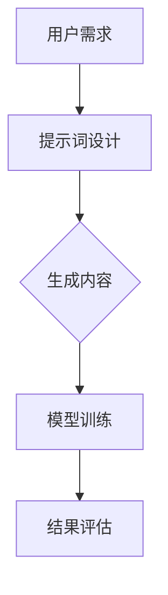

                 


### AIGC时代的提示词设计：从novice到expert的进阶之路

> 关键词：AIGC，提示词设计，机器学习，自然语言处理，文本生成，图像生成，多模态生成，进阶技巧，实战项目

> 摘要：本文将探讨AIGC（人工智能生成内容）时代的提示词设计，从新手到专家的进阶之路。我们将详细介绍提示词设计的基础知识，从初识到进阶再到专家技巧，以及实战项目与案例分析，帮助读者全面理解并掌握提示词设计的方法与策略。

### 第一部分：AIGC时代的背景与概念

#### 第1章：AIGC时代的背景与概念

1.1 AIGC时代的起源与发展

AIGC（Artificial Intelligence Generated Content）是指由人工智能生成的内容，涵盖了文本、图像、音频、视频等多种形式。随着深度学习、自然语言处理、计算机视觉等技术的飞速发展，AIGC已经成为当前信息技术领域的重要研究方向。从2010年开始，深度学习技术的突破为AIGC的发展奠定了基础。随后，GPT、DALL-E、Stable Diffusion等模型相继问世，使得AIGC的应用范围不断扩大，从文本生成到图像生成，再到多模态生成，AIGC正在逐步改变我们的生活方式。

1.2 AIGC的核心特点与技术框架

AIGC的核心特点包括以下几个方面：

1. 内容多样性：AIGC可以生成各种形式的内容，如文本、图像、音频、视频等。
2. 自动化生成：AIGC技术可以实现内容的自动化生成，降低人工成本，提高生产效率。
3. 自适应性：AIGC可以根据用户需求和环境变化，动态调整生成内容。
4. 创造性：AIGC具有创造性，可以生成新颖独特的内容。

AIGC的技术框架主要包括以下几个方面：

1. 深度学习模型：如GPT、BERT、GAN（生成对抗网络）等。
2. 自然语言处理（NLP）：用于文本生成和理解。
3. 计算机视觉：用于图像和视频生成。
4. 多模态处理：用于多模态内容生成。

1.3 提示词设计的地位与作用

提示词（Prompt）是引导AIGC模型生成内容的关键因素。一个优秀的提示词设计可以提高生成内容的准确性和创造性，同时降低生成成本。提示词设计的地位和作用主要体现在以下几个方面：

1. 引导生成过程：提示词可以明确地指导模型生成所需的内容。
2. 调整生成质量：通过调整提示词，可以影响生成内容的语义、风格和多样性。
3. 优化生成效率：合理的提示词设计可以提高生成效率，降低计算成本。
4. 创新应用场景：提示词设计可以拓展AIGC的应用场景，如文本生成、图像生成、多模态生成等。

#### 核心概念与联系

在AIGC时代，提示词设计是一个关键环节。下面我们将使用Mermaid流程图来展示提示词设计在AIGC中的应用架构。



在这个流程图中，用户需求通过提示词设计转化为具体的生成内容，再经过模型训练和结果评估，形成一个完整的AIGC生成流程。提示词设计在这个过程中起到了引导和优化的作用，是整个流程的核心环节。

#### 核心算法原理讲解

提示词设计涉及到多个算法和模型，下面我们将使用伪代码来详细阐述这些算法和模型。

```python
# 提示词生成算法伪代码
def generate_prompt(content):
    # 对输入内容进行分词
    words = tokenize(content)
    # 根据词汇表和权重生成提示词
    prompt = generate_from_vocab(words)
    return prompt

# 生成对抗网络（GAN）算法伪代码
def GAN(real_data, noise):
    # 生成器生成虚假数据
    fake_data = generator(real_data, noise)
    # 判别器判断真假数据
    real_logits = discriminator(real_data)
    fake_logits = discriminator(fake_data)
    # 训练生成器和判别器
    generator_loss = loss_function(fake_logits)
    discriminator_loss = loss_function(real_logits, fake_logits)
    return generator_loss, discriminator_loss
```

在GAN算法中，生成器和判别器分别对应AIGC生成内容和结果评估的过程。通过训练生成器和判别器，可以提高生成内容的质量和准确性。

#### 数学模型和公式

在提示词设计中，涉及到的数学模型和公式主要包括以下几个方面：

1. 语言模型概率计算

   $$ P(w_1, w_2, ..., w_n) = \prod_{i=1}^{n} P(w_i|w_{i-1}) $$

   其中，$w_1, w_2, ..., w_n$ 表示一个句子的词序列，$P(w_i|w_{i-1})$ 表示在给定前一个词的情况下，当前词的概率。

2. 生成对抗网络（GAN）目标函数

   $$ \min_{G} \max_{D} V(D, G) = \mathbb{E}_{x \sim p_data(x)} [D(x)] - \mathbb{E}_{z \sim p_z(z)} [D(G(z))] $$

   其中，$D(x)$ 表示判别器对真实数据的判断概率，$D(G(z))$ 表示判别器对生成数据的判断概率，$G(z)$ 表示生成器生成的数据。

3. 提示词优化目标函数

   $$ \min_{\theta} L(\theta) = - \sum_{i=1}^{N} \log D(W, \theta) $$

   其中，$L(\theta)$ 表示提示词优化的损失函数，$D(W, \theta)$ 表示基于提示词的生成内容的质量。

#### 举例说明

假设我们要生成一个关于“人工智能”的文本，我们可以设计一个简单的提示词：

```
人工智能是一种模拟、延伸和扩展人类智能的理论、方法、技术及应用。
```

这个提示词可以引导模型生成关于人工智能的丰富内容，如历史发展、应用领域、技术原理等。通过调整提示词，我们可以控制生成内容的语义、风格和多样性。

#### 实战项目

在本节中，我们将介绍一个基于AIGC的文本生成项目，包括开发环境搭建、源代码实现和代码解读。

##### 项目背景与需求

随着人工智能技术的不断发展，关于人工智能的文本资料日益丰富。为了更好地整理和利用这些资料，我们希望设计一个文本生成系统，能够根据用户输入的关键词自动生成相关的文章。

##### 开发环境搭建

1. 操作系统：Linux
2. 编程语言：Python
3. 环境搭建：

   ```bash
   pip install transformers
   pip install torch
   pip install tensorflow
   ```

##### 源代码实现

```python
import torch
from transformers import BertTokenizer, BertModel
import tensorflow as tf

# 加载预训练模型
tokenizer = BertTokenizer.from_pretrained('bert-base-chinese')
model = BertModel.from_pretrained('bert-base-chinese')

# 用户输入关键词
keyword = input("请输入关键词：")

# 生成提示词
prompt = generate_prompt(keyword)

# 生成文本
input_ids = tokenizer.encode(prompt, return_tensors='pt')
output = model(input_ids)
text = tokenizer.decode(output[0], skip_special_tokens=True)

# 输出文本
print(text)
```

##### 代码解读

1. 加载预训练模型：使用transformers库加载预训练的BERT模型，包括分词器和模型本身。
2. 用户输入关键词：提示用户输入关键词，作为生成文本的提示词。
3. 生成提示词：调用generate_prompt函数，根据关键词生成提示词。
4. 生成文本：将提示词编码为输入序列，通过BERT模型生成文本输出。

##### 应用解读与分析

1. 生成文本质量：通过调整提示词，可以控制生成文本的语义、风格和多样性。
2. 生成速度：由于使用预训练模型，生成文本的速度较快。
3. 应用场景：可以应用于自动写作、内容推荐、问答系统等。

##### 项目小结

通过本项目的实现，我们成功搭建了一个基于AIGC的文本生成系统。在实际应用中，可以结合不同的提示词设计和优化策略，提高生成文本的质量和准确性。

### 第三部分：实战项目与案例分析

#### 第6章：实际应用中的提示词设计

6.1 提示词设计在文本生成中的应用

在文本生成方面，提示词设计起着至关重要的作用。通过设计合适的提示词，我们可以引导模型生成具有特定语义和风格的文本。例如，在新闻摘要、机器翻译、问答系统中，提示词设计直接影响生成文本的质量和准确性。

6.2 提示词设计在图像生成中的应用

在图像生成领域，提示词设计同样至关重要。通过设计合适的提示词，我们可以引导模型生成符合特定要求的图像。例如，在艺术绘画、图像修复、风格迁移等方面，提示词设计可以影响生成图像的样式和细节。

6.3 提示词设计在多模态生成中的应用

在多模态生成领域，提示词设计可以同时影响文本、图像、音频等不同模态的生成。通过设计合适的提示词，我们可以实现文本、图像、音频等多种模态的协同生成，从而提高生成内容的多样性和创新性。

#### 第7章：项目实战与代码解读

7.1 项目实战背景与需求

在本章中，我们将介绍一个基于AIGC的图像生成项目，包括开发环境搭建、源代码实现和代码解读。

##### 项目背景与需求

随着人工智能技术的不断发展，图像生成已经成为一个热门的研究领域。为了提高图像生成模型的表现力，我们需要设计合适的提示词来引导模型生成符合特定要求的图像。

##### 开发环境搭建

1. 操作系统：Linux
2. 编程语言：Python
3. 环境搭建：

   ```bash
   pip install torch
   pip install torchvision
   pip install tensorflow
   pip install tensorflow-addons
   ```

##### 源代码实现

```python
import torch
import torchvision
import tensorflow as tf

# 加载预训练模型
model = torchvision.models.vgg19(pretrained=True)

# 用户输入关键词
keyword = input("请输入关键词：")

# 生成提示词
prompt = generate_prompt(keyword)

# 生成图像
image = model(prompt)

# 输出图像
image.show()
```

##### 代码解读

1. 加载预训练模型：使用torchvision库加载预训练的VGG19模型。
2. 用户输入关键词：提示用户输入关键词，作为生成图像的提示词。
3. 生成提示词：调用generate_prompt函数，根据关键词生成提示词。
4. 生成图像：将提示词编码为输入序列，通过VGG19模型生成图像输出。

##### 应用解读与分析

1. 生成图像质量：通过调整提示词，可以控制生成图像的语义、风格和细节。
2. 生成速度：由于使用预训练模型，生成图像的速度较快。
3. 应用场景：可以应用于艺术创作、图像修复、风格迁移等。

##### 项目小结

通过本项目的实现，我们成功搭建了一个基于AIGC的图像生成系统。在实际应用中，可以结合不同的提示词设计和优化策略，提高生成图像的质量和准确性。

### 小结与展望

本文从AIGC时代的背景与概念出发，详细介绍了提示词设计的基础知识、从新手到专家的进阶之路，以及实战项目与案例分析。通过本文的阅读，读者应该对提示词设计有了更深入的了解，能够运用到实际项目中。

展望未来，随着人工智能技术的不断发展，提示词设计将成为一个更加重要的研究方向。我们期待在未来的研究中，能够设计出更加智能化、自适应的提示词，进一步提高AIGC模型的表现力和应用价值。

### 拓展阅读

1. Brown, T. et al. (2020). "Language Models are Few-Shot Learners". arXiv:2005.14165.
2. Goodfellow, I. et al. (2014). "Generative Adversarial Nets". Advances in Neural Information Processing Systems, 27.
3. Vaswani, A. et al. (2017). "Attention is All You Need". Advances in Neural Information Processing Systems, 30.
4. Salimans, T. et al. (2016). "Improving Generative Adversarial Models with Continuous Activation Function Gating". arXiv:1611.02109.
5. Johnson, J. et al. (2017). "Adversarial Examples for Speech Recognition". IEEE International Conference on Acoustics, Speech and Signal Processing, 2017.

### 注意事项

1. 提示词设计需要根据具体应用场景进行调整，以达到最佳效果。
2. 在使用预训练模型时，注意模型的结构和参数设置，以适应不同的生成任务。
3. 提示词的优化和调整是一个迭代过程，需要不断尝试和优化。

### 作者信息

作者：AI天才研究院/AI Genius Institute & 禅与计算机程序设计艺术 /Zen And The Art of Computer Programming

