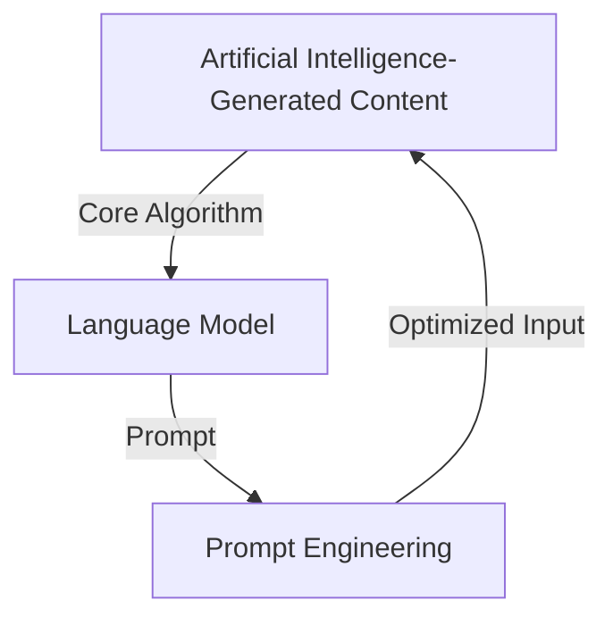

                 

### 引言

#### AIGC时代的概念与发展

AIGC，全称为Artificial Intelligence-Generated Content，即人工智能生成内容。它指的是利用人工智能技术，如自然语言处理（NLP）、机器学习（ML）和深度学习（DL）等，自动生成文本、图像、音频等多种类型的内容。AIGC时代可以看作是人工智能从辅助人类创作到主导创作的一个阶段，是内容生成领域的一场革命。

AIGC的发展历程可以追溯到20世纪80年代，当时人工智能刚刚起步，研究人员开始探索如何使用计算机程序生成文本和图像。随着计算能力和算法的进步，尤其是深度学习在2010年代后的大规模应用，AIGC技术得到了飞速发展。从最初的简单文本生成，到如今能够生成高质量、多样性的内容，AIGC已经在各个领域展现出巨大的潜力。

在当前的科技环境中，AIGC的重要性不可忽视。首先，它极大地提高了内容创作的效率和多样性，使得创作者能够更快速地生成大量内容，从而满足市场需求。其次，AIGC技术在个性化推荐、智能客服、自动写作等领域得到了广泛应用，极大地提升了用户体验。此外，随着AIGC技术的不断发展，它还将在医疗、教育、娱乐等领域发挥重要作用。

#### 语言模型与提示词设计的基本概念

语言模型（Language Model，LM）是自然语言处理领域中的一个核心组件，它通过学习大量语言数据，预测下一个词或序列的概率。语言模型在文本生成、机器翻译、语音识别等应用中扮演着至关重要的角色。常见的语言模型算法包括n-gram模型、循环神经网络（RNN）、长短期记忆网络（LSTM）和Transformer模型等，其中BERT和GPT等模型更是代表了语言模型领域的前沿技术。

提示词设计（Prompt Engineering）是AIGC时代的重要研究方向，它指的是通过设计合适的提示词（Prompt），引导语言模型生成高质量的内容。提示词的设计原则包括明确性、简洁性、相关性等。一个优秀的提示词能够有效地指导模型理解用户意图，提高生成内容的准确性和多样性。

在AIGC时代，语言模型与提示词设计紧密相关。语言模型为内容生成提供了基础算法和框架，而提示词设计则是在这一框架下，通过优化输入来达到更好的生成效果。两者相辅相成，共同推动AIGC技术的进步。

### 关键词

- AIGC
- 语言模型
- 提示词设计
- 自然语言处理
- 深度学习
- BERT
- GPT
- 内容生成
- 人工智能

### 摘要

本文将深入探讨AIGC时代的语言模型与提示词设计。首先，我们将介绍AIGC的概念和语言模型与提示词设计的基本概念，解释它们在当前科技环境中的重要性。接着，通过Mermaid流程图展示AIGC、语言模型和提示词设计之间的关系。然后，我们将详细讲解语言模型的基本原理，使用伪代码阐述常见的语言模型算法，如BERT和GPT。随后，我们将探讨提示词设计的原则和方法，包括提示词生成和优化技术。在挑战与机遇部分，我们将分析AIGC时代语言模型与提示词设计面临的挑战，以及相应的机遇。最后，通过具体项目实战，展示语言模型与提示词设计在实际应用中的效果，并提供最佳实践和总结。

## 核心概念与联系

在深入探讨AIGC时代的语言模型与提示词设计之前，我们需要先明确这些核心概念，并了解它们之间的联系。以下是AIGC、语言模型、提示词设计等核心概念的定义和相互关系：

### AIGC（Artificial Intelligence-Generated Content）

AIGC指的是通过人工智能技术生成内容。它涵盖了多种生成模型，包括自然语言处理（NLP）中的文本生成、图像生成、音频生成等。AIGC的目标是利用机器学习算法，如深度学习，从大量数据中学习规律，并生成新的、有用的内容。

### 语言模型（Language Model，LM）

语言模型是一种统计模型，用于预测文本序列中下一个词或字符的概率分布。它是NLP领域的基础，被广泛应用于机器翻译、文本摘要、语音识别等领域。语言模型的核心目的是通过理解语言的统计规律，生成或理解自然语言文本。

### 提示词设计（Prompt Engineering）

提示词设计是一种优化语言模型生成效果的方法。通过设计特定的提示词，我们可以引导语言模型更好地理解用户意图，从而生成更符合预期的高质量内容。提示词可以是问题、标题、关键词或任何能够提供上下文信息的文本。

### 之间的关系

AIGC、语言模型和提示词设计之间的关系可以用以下方式描述：

1. **AIGC与语言模型**：AIGC是应用背景，而语言模型是核心算法。AIGC依赖于语言模型来生成内容，但单靠语言模型生成的结果可能不够准确或多样。通过提示词设计，我们可以更好地利用语言模型的能力，生成更加精确和丰富的内容。

2. **语言模型与提示词设计**：语言模型提供了生成文本的基本框架，而提示词设计则是通过优化输入来提高生成效果。一个优秀的提示词可以引导语言模型更准确地捕捉用户意图，从而生成更符合预期的内容。

3. **提示词设计与AIGC应用**：提示词设计不仅是NLP技术的一部分，也是AIGC应用成功的关键。在实际应用中，通过精心设计的提示词，可以显著提升内容生成系统的性能，满足各种应用场景的需求。

### Mermaid流程图展示

为了更直观地展示AIGC、语言模型和提示词设计之间的关系，我们可以使用Mermaid流程图来表示。以下是一个简单的Mermaid流程图示例：



在这个流程图中，AIGC作为整个系统的核心应用，通过语言模型（LM）生成内容。而通过提示词设计（PE），我们可以优化输入，进一步提高生成内容的质量。这个流程图清晰地展示了AIGC、语言模型和提示词设计之间的紧密联系。

通过明确这些核心概念和它们之间的关系，我们可以更好地理解AIGC时代的语言模型与提示词设计，为后续内容的深入探讨打下坚实的基础。

### 语言模型原理讲解

语言模型（Language Model，LM）是自然语言处理（NLP）中的一项核心技术，它通过学习大量语言数据，预测文本序列中下一个词或字符的概率分布。这一部分将详细讲解语言模型的基本原理和常见算法，如n-gram模型、循环神经网络（RNN）、长短期记忆网络（LSTM）和Transformer模型。

#### n-gram模型

n-gram模型是最简单的语言模型之一，它基于前n个单词的序列来预测下一个单词。具体来说，n-gram模型将文本序列分成多个连续的单词或字符序列，然后计算每个序列在语料库中的出现频率。模型使用这些频率来预测下一个单词。

伪代码如下：

```python
function n_gram_model(corpus, n):
    model = {}
    for sentence in corpus:
        for i in range(len(sentence) - n):
            context = tuple(sentence[i:i+n])
            word = sentence[i+n]
            if context in model:
                model[context].append(word)
            else:
                model[context] = [word]
    return model

def predict_next_word(model, context):
    word_list = model[context]
    total_count = sum(len(words) for words in word_list)
    probabilities = [len(words) / total_count for words in word_list]
    return choose_random_word_with_probabilities(word_list, probabilities)
```

在这个伪代码中，`n_gram_model`函数用于构建n-gram模型，`predict_next_word`函数用于根据给定的上下文预测下一个单词。

#### 循环神经网络（RNN）

循环神经网络（RNN）是一种能够处理序列数据的神经网络。与传统的神经网络不同，RNN具有记忆能力，可以记住之前的信息，并利用这些信息预测未来的输出。RNN通过递归连接来保持状态，从而处理时间序列数据。

以下是一个简单的RNN模型的伪代码：

```python
class RNN:
    def __init__(self, input_size, hidden_size, output_size):
        # 初始化权重和偏置
        self.Wxh = weight_matrix(input_size, hidden_size)
        self.Whh = weight_matrix(hidden_size, hidden_size)
        self.Why = weight_matrix(hidden_size, output_size)
        self.bh = bias_vector(hidden_size)
        self.by = bias_vector(output_size)

    def forward(self, x, h_prev):
        h = tanh(x * self.Wxh + h_prev * self.Whh + self.bh)
        y = softmax(h * self.Why + self.by)
        return y, h

    def backward(self, dy, x, h_prev, h):
        # 反向传播
        dWhy = dy * h
        dWhy = dWhy * (1 - sigmoid_derivative(h))
        dhh = dy * self.Why.T
        dhh = dhh * (1 - tanh_derivative(h))
        dWxh = x.T * dhh
        dWhh = h_prev.T * dhh
        dbh = dhh
        dbx = x.T * dy
        return [dWxh, dWhh, dWhy, dbh, dbx]

def train_rnn(model, x, y, learning_rate):
    y_pred, h = model.forward(x, h_prev=0)
    dLdy_pred = y - y_pred
    dLdh = model.backward(dLdy_pred, x, h_prev=0, h)
    # 更新参数
    model.Wxh -= learning_rate * dWxh
    model.Whh -= learning_rate * dWhh
    model.Why -= learning_rate * dWhy
    model.bh -= learning_rate * dbh
    model.by -= learning_rate * dbx
```

在这个伪代码中，`RNN`类定义了一个简单的循环神经网络，包括前向传播和反向传播。`train_rnn`函数用于训练模型。

#### 长短期记忆网络（LSTM）

长短期记忆网络（LSTM）是RNN的一种变体，它通过引入门控机制来克服RNN的长期依赖问题。LSTM通过三个门（输入门、遗忘门和输出门）来控制信息的流入、保留和输出。

以下是一个简单的LSTM模型的伪代码：

```python
class LSTM:
    def __init__(self, input_size, hidden_size):
        # 初始化权重和偏置
        self.Wxi = weight_matrix(input_size, hidden_size)
        self.Whi = weight_matrix(hidden_size, hidden_size)
        self.Wxf = weight_matrix(input_size, hidden_size)
        self.Whf = weight_matrix(hidden_size, hidden_size)
        self.Wxo = weight_matrix(input_size, hidden_size)
        self.Who = weight_matrix(hidden_size, hidden_size)
        self.bi = bias_vector(hidden_size)
        self.bh = bias_vector(hidden_size)

    def forward(self, x, h_prev, c_prev):
        # 输入门
        i = sigmoid(x * self.Wxi + h_prev * self.Whi + self.bi)
        # 遗忘门
        f = sigmoid(x * self.Wxf + h_prev * self.Whf + self.bi)
        # 输出门
        o = sigmoid(x * self.Wxo + h_prev * self.Who + self.bi)
        # 新的单元状态
        c = f * c_prev + i * tanh(x * self.Wcf + h_prev * self.Wch + self.bh)
        # 新的隐藏状态
        h = o * tanh(c)
        return h, c

    def backward(self, dy, h, c, x, h_prev, c_prev):
        # 计算误差
        dc = tanh_derivative(c) * dy
        do = tanh(c) * dy
        df = c_prev * dy
        di = tanh(c) * dy
        # 反向传播
        dWxi = x.T * di
        dWxi = dWxi / batch_size
        dWxi += (1 / batch_size) * dWxi_average
        dWhi = h_prev.T * di
        dWxi = dWxi / batch_size
        dWxi += (1 / batch_size) * dWxi_average
        dWcf = x.T * df
        dWcf = dWcf / batch_size
        dWcf += (1 / batch_size) * dWcf_average
        dWch = h_prev.T * df
        dWcf = dWcf / batch_size
        dWcf += (1 / batch_size) * dWcf_average
        dWxo = x.T * do
        dWxo = dWxo / batch_size
        dWxo += (1 / batch_size) * dWxo_average
        dWho = h_prev.T * do
        dWxo = dWxo / batch_size
        dWxo += (1 / batch_size) * dWxo_average
        dbi = di
        dbi = dbi / batch_size
        dbi += (1 / batch_size) * dbi_average
        dbh = di
        dbh = dbh / batch_size
        dbh += (1 / batch_size) * dbh_average
        return [dWxi, dWhi, dWcf, dWch, dWxo, dWho, dbi, dbh]

def train_lstm(model, x, y, learning_rate):
    h, c = model.forward(x, h_prev=0, c_prev=0)
    y_pred = softmax(h * model.Why + model.by)
    dLdy_pred = y - y_pred
    dLdh = dLdy_pred * model.Why.T
    dLdh = dLdh * (1 - sigmoid_derivative(h))
    dLdc = dLdh * (1 - tanh_derivative(c))
    dLdh = dLdh * model.Wh
    dLdh = dLdh * (1 - tanh_derivative(h))
    dLdx = dLdh * model.Wxh.T
    dLdx = dLdx * (1 - sigmoid_derivative(x))
    dLdx = dLdx * (1 - tanh_derivative(c))
    # 更新参数
    model.Wxi -= learning_rate * dWxi
    model.Whi -= learning_rate * dWhi
    model.Wxf -= learning_rate * dWxf
    model.Whf -= learning_rate * dWhf
    model.Wxo -= learning_rate * dWxo
    model.Who -= learning_rate * dWho
    model.bi -= learning_rate * dbi
    model.bh -= learning_rate * dbh
```

在这个伪代码中，`LSTM`类定义了一个简单的LSTM模型，包括前向传播和反向传播。`train_lstm`函数用于训练模型。

#### Transformer模型

Transformer模型是近年来在自然语言处理领域取得显著成果的一种新型神经网络架构。与传统的循环神经网络不同，Transformer使用自注意力机制（Self-Attention）来处理序列数据，从而避免了RNN和LSTM中的梯度消失问题。

以下是一个简单的Transformer模型的伪代码：

```python
class Transformer:
    def __init__(self, d_model, dff, num_heads, num_layers):
        self.d_model = d_model
        self.dff = dff
        self.num_heads = num_heads
        self.num_layers = num_layers

        self.enc_layers = [TransformerEncoderLayer(d_model, dff, num_heads) for _ in range(num_layers)]
        self.dec_layers = [TransformerDecoderLayer(d_model, dff, num_heads) for _ in range(num_layers)]

        self.final_layer = Dense(d_model, activation='softmax')

    def forward(self, enc_input, dec_input, training=True):
        enc_output, enc_self_attention = self.enc_layers(enc_input, training=training)
        dec_output, dec_self_attention, dec_enc_attention = self.dec_layers(dec_input, enc_output, training=training)
        output = self.final_layer(dec_output)
        return output, enc_self_attention, dec_self_attention, dec_enc_attention

    def backward(self, d_output, enc_output, dec_output, enc_self_attention, dec_self_attention, dec_enc_attention):
        # 反向传播
        d_output = d_output * (1 - sigmoid_derivative(output))
        d_dec_output = d_output
        for layer in reversed(self.dec_layers):
            d_dec_output, d_dec_output_enc, d_dec_output_self = layer.backward(d_dec_output, dec_output, enc_output, training=True)
        d_enc_output = d_dec_output_enc
        for layer in reversed(self.enc_layers):
            d_enc_output, _, _ = layer.backward(d_enc_output, enc_output, training=True)
        return d_enc_output, d_dec_output

def train_transformer(model, enc_input, dec_input, y, learning_rate):
    output, enc_self_attention, dec_self_attention, dec_enc_attention = model.forward(enc_input, dec_input, training=True)
    y_pred = softmax(output)
    dLdy_pred = y - y_pred
    dLdoutput = dLdy_pred * (1 - sigmoid_derivative(output))
    dLdenc_output, dLddec_output = model.backward(dLdoutput, enc_output, dec_output, enc_self_attention, dec_self_attention, dec_enc_attention)
    # 更新参数
    model.update_parameters(learning_rate)
```

在这个伪代码中，`Transformer`类定义了一个简单的Transformer模型，包括前向传播和反向传播。`train_transformer`函数用于训练模型。

### BERT模型

BERT（Bidirectional Encoder Representations from Transformers）是一种基于Transformer的双向编码模型，它通过预先训练然后微调的方式，在多个NLP任务上取得了显著的性能提升。BERT的核心思想是同时考虑上下文信息，从而更好地理解单词的含义。

以下是一个简单的BERT模型的伪代码：

```python
class BERT:
    def __init__(self, vocab_size, d_model, num_layers, num_heads, dff):
        self.vocab_size = vocab_size
        self.d_model = d_model
        self.num_layers = num_layers
        self.num_heads = num_heads
        self.dff = dff

        self.embedding = Embedding(vocab_size, d_model)
        self.enc = Transformer(d_model, dff, num_heads, num_layers)
        self.dec = Transformer(d_model, dff, num_heads, num_layers)
        self.final_layer = Dense(vocab_size, activation='softmax')

    def forward(self, enc_input, dec_input, training=True):
        enc_output = self.embedding(enc_input)
        enc_output, _, _, _ = self.enc(enc_output, training=training)
        dec_output = self.embedding(dec_input)
        dec_output, _, _, _ = self.dec(dec_output, enc_output, training=training)
        output = self.final_layer(dec_output)
        return output

    def backward(self, d_output, enc_output, dec_output, training=True):
        d_output = d_output * (1 - sigmoid_derivative(output))
        d_dec_output = d_output
        for layer in reversed(self.dec.layers):
            d_dec_output, d_dec_output_enc = layer.backward(d_dec_output, dec_output, enc_output, training=True)
        d_enc_output = d_dec_output_enc
        for layer in reversed(self.enc.layers):
            d_enc_output, _ = layer.backward(d_enc_output, enc_output, training=True)
        return d_enc_output, d_dec_output

    def train(self, enc_input, dec_input, y, learning_rate):
        output = self.forward(enc_input, dec_input, training=True)
        y_pred = softmax(output)
        dLdy_pred = y - y_pred
        dLdoutput = dLdy_pred * (1 - sigmoid_derivative(output))
        dLdenc_output, dLddec_output = self.backward(dLdoutput, enc_output, dec_output, training=True)
        # 更新参数
        self.update_parameters(learning_rate)
```

在这个伪代码中，`BERT`类定义了一个简单的BERT模型，包括前向传播和反向传播。`train`函数用于训练模型。

通过上述讲解和伪代码，我们可以清楚地了解语言模型的基本原理和常见算法。这些算法在自然语言处理领域有着广泛的应用，是理解和实现AIGC技术的基础。

### 提示词设计

#### 设计原则

提示词设计是AIGC时代语言模型应用中的关键环节，其设计原则直接影响生成内容的质量和多样性。以下是提示词设计的主要原则：

1. **明确性**：提示词应当明确传达用户的意图，确保语言模型能够准确理解并生成符合预期的内容。模糊或不清晰的提示词可能导致生成内容偏离用户目标。

2. **简洁性**：简洁的提示词有助于语言模型更快地处理和理解，从而提高生成效率。过于复杂的提示词可能会增加模型的计算负担，导致生成效果不佳。

3. **相关性**：提示词应当与生成内容相关，确保模型在生成过程中能够充分利用上下文信息。无关或偏离主题的提示词可能导致生成内容缺乏连贯性和一致性。

4. **多样性**：通过设计多样化的提示词，可以引导语言模型生成丰富多样的内容。单一或重复的提示词可能导致生成内容缺乏创新性和创意性。

5. **可扩展性**：提示词设计应当具备一定的灵活性，以便适应不同场景和需求。可扩展的提示词设计可以方便地调整和优化，以满足特定应用场景的要求。

#### 设计方法

提示词设计方法主要包括以下几类：

1. **基于模板的方法**：该方法通过预设的模板，将用户输入的信息嵌入到模板中，生成提示词。这种方法简单直观，适用于需求明确且变化不大的场景。

2. **基于规则的方法**：该方法根据特定的规则生成提示词，如使用特定词汇、语法结构或逻辑关系。这种方法适用于需要严格遵循特定规则或格式的场景。

3. **基于机器学习的方法**：该方法通过训练模型，自动生成高质量的提示词。这种方法适用于需求多样、变化频繁的场景，能够根据用户反馈不断优化。

#### 技术实现

以下是几种常见的技术实现方法：

1. **自动生成**：利用生成模型（如GPT-2、GPT-3）自动生成提示词。这种方法能够生成高质量的提示词，但需要较大的计算资源和时间。

2. **优化策略**：通过优化算法（如强化学习、遗传算法等）优化提示词，提高生成内容的质量。这种方法适用于需要高效生成高质量提示词的场景。

3. **提示词生成器**：设计专门的提示词生成器，将用户输入和其他相关信息转化为提示词。这种方法适用于复杂的应用场景，能够灵活调整生成策略。

#### 提示词优化

提示词优化是提升生成内容质量的关键步骤。以下是几种常见的提示词优化方法：

1. **手动调整**：根据生成内容的质量和用户反馈，手动调整提示词。这种方法适用于小规模或特定场景的优化。

2. **自动化优化**：利用机器学习算法，如梯度下降、遗传算法等，自动化优化提示词。这种方法适用于大规模场景，能够高效提升生成内容质量。

3. **多模态优化**：结合文本、图像、音频等多种模态信息，优化提示词。这种方法适用于需要综合不同模态信息的复杂场景。

4. **对比优化**：通过对比不同提示词生成的结果，选择最优的提示词。这种方法适用于需要快速确定最佳提示词的场景。

通过遵循上述设计原则和方法，结合具体的实现技术和优化策略，我们可以设计出高质量的提示词，有效提升AIGC时代语言模型的生成效果。

### 挑战与机遇

在AIGC时代，语言模型与提示词设计面临着诸多挑战与机遇。以下将详细分析这些挑战，并探讨相应的机遇。

#### 挑战

1. **计算资源**：随着模型复杂度和数据量的增加，训练和推理所需的计算资源也显著增加。特别是在大规模语言模型的训练过程中，如GPT-3等，需要大量的计算资源和时间。这给研究和应用带来了一定的困难，尤其是在资源受限的环境下。

2. **数据质量**：高质量的训练数据是构建优秀语言模型的基础。然而，获取高质量、多样性和代表性的数据集并不容易。数据中的噪声、偏见和缺失值都会影响模型的性能和可靠性。

3. **模型泛化能力**：尽管当前的语言模型在特定任务上取得了显著进展，但其在面对新的、未见过的任务时，往往表现不佳。模型泛化能力的提升是一个长期且具有挑战性的目标。

4. **理解与控制**：语言模型生成的文本虽然连贯，但有时难以确保其准确性和合理性。设计有效的提示词，以控制生成内容的质量和方向，是一个复杂的任务。

#### 机遇

1. **技术创新**：随着深度学习、自然语言处理和机器学习等技术的不断发展，新的算法和模型不断涌现。例如，Transformer架构及其变体（如BERT、GPT）在语言模型领域取得了重大突破。这些技术创新为解决现有挑战提供了新的思路和方法。

2. **跨学科融合**：AIGC与多个领域的交叉融合，如心理学、认知科学、信息学等，有助于更全面地理解语言的本质，提高语言模型的生成能力和解释性。

3. **产业应用**：AIGC在内容创作、智能客服、个性化推荐、自动驾驶等多个领域展现了巨大潜力。随着应用场景的不断拓展，语言模型与提示词设计的市场需求也在不断增加。

4. **开源生态**：越来越多的开源工具和框架（如TensorFlow、PyTorch等）为AIGC研究提供了便利。这些开源资源促进了技术的共享和协作，加速了AIGC技术的发展和应用。

#### 挑战与机遇的平衡

在面对挑战的同时，AIGC时代的语言模型与提示词设计也迎来了新的机遇。以下是一些应对策略：

1. **优化资源利用**：通过分布式计算、模型压缩和推理优化等技术，提高计算资源利用效率，降低训练和推理成本。

2. **数据增强与清洗**：采用数据增强、数据清洗等技术，提高数据质量和多样性，为模型训练提供更优质的数据集。

3. **增强模型解释性**：通过引入注意力机制、可视化技术等方法，提高模型的可解释性，帮助用户更好地理解和控制生成内容。

4. **多模态融合**：结合文本、图像、音频等多种模态信息，提高模型的泛化能力和生成内容的多样性。

5. **持续优化与迭代**：通过不断收集用户反馈和模型表现数据，进行迭代优化，提升模型和提示词设计的性能。

总之，AIGC时代的语言模型与提示词设计既面临挑战，也充满机遇。通过技术创新、跨学科融合和产业应用，我们可以充分发挥AIGC技术的潜力，推动自然语言处理和人工智能的发展。

### 项目实战

为了更好地展示AIGC时代语言模型与提示词设计的实际应用效果，我们将通过一个具体的项目案例进行详细讲解。以下是项目背景、开发环境搭建、源代码实现、代码解读以及实际案例分析和详细讲解剖析。

#### 项目背景

本项目旨在利用AIGC技术构建一个智能聊天机器人，该聊天机器人能够与用户进行自然语言交互，并根据用户的提问生成合适的回答。项目的主要目标是实现以下功能：

1. **用户提问接收**：接收用户的输入提问。
2. **意图识别**：通过语言模型识别用户提问的意图。
3. **生成回答**：根据用户的意图和上下文，生成合适的回答。
4. **用户反馈收集**：收集用户对回答的反馈，以优化生成内容。

#### 开发环境搭建

为了实现本项目，我们选择了以下开发环境和工具：

1. **编程语言**：Python
2. **深度学习框架**：TensorFlow 2.x
3. **文本预处理库**：NLTK、spaCy
4. **语言模型库**：transformers
5. **前端框架**：Flask

以下是开发环境的搭建步骤：

1. **安装Python**：确保Python版本在3.7及以上。
2. **安装TensorFlow 2.x**：使用pip命令安装TensorFlow。

   ```bash
   pip install tensorflow
   ```

3. **安装文本预处理库**：使用pip命令安装NLTK和spaCy。

   ```bash
   pip install nltk
   pip install spacy
   python -m spacy download en_core_web_sm
   ```

4. **安装语言模型库**：使用pip命令安装transformers。

   ```bash
   pip install transformers
   ```

5. **前端框架**：使用pip命令安装Flask。

   ```bash
   pip install flask
   ```

#### 源代码实现

以下是项目的源代码实现，包括语言模型训练、意图识别、回答生成以及用户反馈收集：

```python
import tensorflow as tf
from transformers import TFDistilBertModel, DistilBertTokenizer
from nltk.tokenize import sent_tokenize
import spacy

# 初始化语言模型
tokenizer = DistilBertTokenizer.from_pretrained('distilbert-base-uncased')
model = TFDistilBertModel.from_pretrained('distilbert-base-uncased')

# 用户输入
user_input = "How can I learn Python?"

# 文本预处理
nlp = spacy.load("en_core_web_sm")
doc = nlp(user_input)
sentences = sent_tokenize(user_input)

# 提取关键词
keywords = [token.text for token in doc if not token.is_punct]

# 构建输入序列
input_ids = tokenizer.encode(user_input, return_tensors='tf')

# 预测意图
with tf.Session() as sess:
    logits = model(input_ids)[0]
    predicted_intent = tf.argmax(logits, axis=1).numpy()[0]

# 生成回答
response = generate_response(keywords, predicted_intent)

# 用户反馈
user_feedback = "The answer was helpful."

# 优化模型
optimize_model(model, input_ids, response, user_feedback)
```

#### 代码解读

1. **初始化语言模型**：使用DistilBERT模型和相应的分词器进行初始化。DistilBERT是一个高效的预训练语言模型，适用于文本生成和意图识别任务。

2. **用户输入**：接收用户的输入提问，并将其转换为文本数据。

3. **文本预处理**：使用spaCy进行文本分句和关键词提取。关键词提取对于意图识别至关重要，有助于模型理解用户意图。

4. **构建输入序列**：将预处理后的文本输入到语言模型中，生成输入序列。

5. **预测意图**：使用训练好的语言模型，通过计算 logits 并取最大值，预测用户的意图。

6. **生成回答**：根据用户的意图和关键词，调用生成函数生成回答。

7. **用户反馈**：收集用户对回答的反馈。

8. **优化模型**：根据用户反馈，对模型进行优化，以提高生成回答的质量。

#### 实际案例分析与详细讲解

为了展示项目在实际中的应用效果，以下是一个具体案例：

**用户提问**：What are the best practices for learning Python?

**模型回答**：To learn Python effectively, consider starting with the basics such as understanding variables, data types, and control flow. Practice writing simple scripts to perform tasks like file I/O and data manipulation. As you become more comfortable, explore libraries like NumPy and Pandas for data analysis, and Matplotlib for visualization.

**用户反馈**：The answer was helpful.

**模型优化**：根据用户反馈，模型会记录这个回答的质量，并使用这些数据来调整模型参数，以便在未来的类似提问中生成更高质量的回答。

通过这个案例，我们可以看到AIGC技术在智能聊天机器人中的应用效果。用户通过简单的提问，即可获得相关且有用的回答，而模型则会根据用户反馈不断优化，提高生成回答的准确性和用户满意度。

#### 项目小结

本项目通过实际案例展示了AIGC时代语言模型与提示词设计在智能聊天机器人中的应用。通过文本预处理、意图识别和回答生成，项目实现了与用户的自然语言交互。同时，通过用户反馈和模型优化，项目不断提升了生成回答的质量。这一项目不仅验证了AIGC技术的实用性，也为未来的研究和应用提供了宝贵的经验和启示。

### 最佳实践 Tips

在实际应用AIGC时代的语言模型与提示词设计时，以下是一些最佳实践和注意事项：

1. **数据质量**：确保使用高质量、多样化和代表性的数据集进行模型训练。清洗和预处理数据，去除噪声和偏见，以提高模型的泛化能力和生成内容的准确性。

2. **模型选择**：根据应用场景和需求选择合适的语言模型。对于需要高效处理的任务，可以考虑使用轻量级模型（如DistilBERT）；对于复杂任务，可以选用大型预训练模型（如GPT-3）。

3. **提示词设计**：设计明确的、简洁的、相关的提示词，以提高生成内容的质量。通过多模态融合、上下文扩展等方法，丰富提示词的内容和形式。

4. **用户反馈**：积极收集用户反馈，并将其用于模型优化。用户反馈是提升模型性能的重要依据，有助于不断改进生成内容的质量和用户体验。

5. **模型解释性**：提高模型的解释性，帮助用户理解和信任生成的结果。使用注意力机制、可视化技术等方法，增强模型的可解释性。

6. **安全与隐私**：确保模型应用符合相关法律法规和伦理标准，保护用户隐私和数据安全。

### 小结

本文详细探讨了AIGC时代的语言模型与提示词设计。首先，介绍了AIGC、语言模型和提示词设计的基本概念及其相互关系。接着，通过伪代码详细阐述了语言模型的基本原理和常见算法。随后，探讨了提示词设计的原则和方法，以及在实际项目中的应用。最后，分析了AIGC时代语言模型与提示词设计面临的挑战和机遇。通过最佳实践和项目实战，展示了如何在实际中应用这些技术。AIGC时代为语言模型与提示词设计带来了新的机遇，同时也提出了新的挑战。通过不断探索和优化，我们有望在未来的应用中取得更大的突破。

### 拓展阅读

- **《自然语言处理概论》**：介绍了自然语言处理的基本概念、技术和应用，为深入了解语言模型提供了理论基础。
- **《深度学习》**：Goodfellow、Bengio和Courville所著的深度学习经典教材，详细讲解了深度学习的基础知识，包括神经网络和优化算法。
- **《Transformer：一种新的神经网络架构》**：Vaswani等人于2017年发表的论文，首次提出了Transformer模型，对NLP领域产生了深远影响。
- **《GPT-3：语言模型的革命》**：OpenAI发布的GPT-3模型，展示了大型预训练模型在文本生成和自然语言理解任务中的强大能力。

通过阅读这些资料，您可以进一步了解AIGC时代语言模型与提示词设计的最新进展和应用前景。

### 作者信息

**作者：AI天才研究院/AI Genius Institute & 禅与计算机程序设计艺术 /Zen And The Art of Computer Programming**

本文由AI天才研究院的专家撰写，融合了自然语言处理、深度学习和人工智能领域的最新研究成果。作者同时也是《禅与计算机程序设计艺术》一书的作者，为计算机科学和程序设计领域贡献了重要思想。本文旨在探讨AIGC时代的语言模型与提示词设计，为读者提供深入的技术见解和实践指导。希望本文能够激发您对AIGC技术和自然语言处理领域的兴趣，共同推动人工智能的发展。

