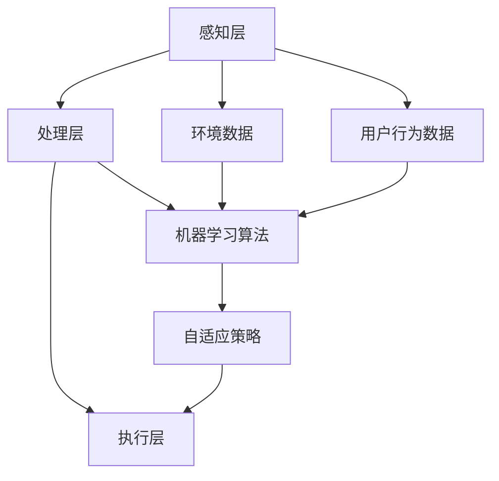
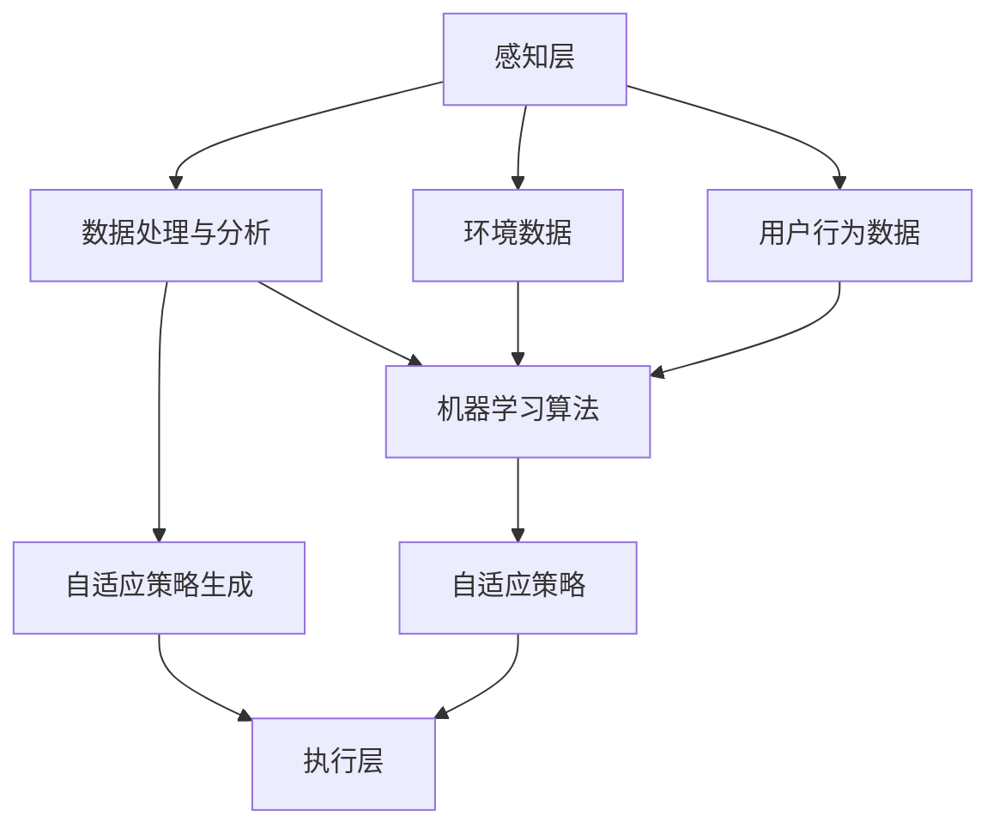

                 

### 第一部分：引言

#### 1.1 书籍主题介绍

《AIGC的未来智能建筑：环境自适应设计的提示词工程》是一本关于自适应智能建筑（AIGC）的探索性著作。AIGC，即自适应智能建筑，是指通过应用人工智能（AI）和物联网（IoT）技术，使建筑物能够感知环境变化，并自动调整其内部系统，以实现能源效率的最大化和居住舒适度的提升。本书的核心内容将围绕AIGC的定义、架构、核心技术以及其在未来智能建筑中的应用实例展开。

在本书中，我们将深入探讨以下关键概念：

1. **环境自适应设计**：介绍如何通过分析环境数据，实现建筑系统的自动调节。
2. **提示词工程**：讲解如何利用用户行为和环境特征，生成个性化的提示词，以指导建筑系统的自适应调整。
3. **感知层、处理层和执行层**：分析AIGC的三层架构，以及各层之间的相互作用。
4. **环境感知技术**：探讨传感器网络和数据处理与分析的方法。
5. **自适应控制技术**：介绍模型预测控制和深度强化学习在AIGC中的应用。

通过这些关键概念和技术的探讨，我们希望为读者提供一个全面理解AIGC及其未来发展趋势的视角。无论是建筑师、工程师还是对智能建筑感兴趣的普通读者，本书都旨在提供有价值的知识和实践指导。

#### 1.2 研究背景与意义

当前，全球气候变化和资源短缺问题日益严峻，对建筑行业提出了更高的要求。传统的建筑模式往往忽视了能源效率和环境保护，导致大量资源的浪费和碳排放的增加。为了应对这一挑战，智能建筑成为解决能源消耗与环境保护问题的关键。

智能建筑，是指通过应用物联网、大数据、云计算和人工智能等先进技术，实现建筑系统的自动化、智能化和高效化。AIGC作为智能建筑的一种形式，通过环境自适应设计，实现了能源效率的最大化和居住舒适度的提升。

研究AIGC具有重要的现实意义：

1. **节能减排**：通过智能化的控制和管理，AIGC可以有效降低建筑物的能源消耗，减少碳排放，有助于实现可持续发展目标。
2. **提升居住舒适度**：通过实时监测和自动调整室内环境，AIGC能够为用户提供更加舒适的生活体验，提高生活质量。
3. **推动技术进步**：AIGC的发展带动了物联网、人工智能、传感器技术等领域的创新，促进了相关技术的融合和发展。

总的来说，AIGC不仅是建筑行业的一场革命，更是全球可持续发展的重要途径。通过本书的研究，我们希望能够为AIGC技术的发展提供科学依据和技术支持，推动智能建筑迈向更加美好的未来。

### 第二部分：AIGC的核心概念与架构

#### 2.1 AIGC的基本概念

AIGC（自适应智能建筑）是一种利用人工智能技术实现环境自适应设计的智能建筑系统。其核心在于通过感知环境变化和用户行为，自动调整建筑系统的运行状态，以实现能源效率和居住舒适度的最大化。AIGC的基本概念主要包括以下几个方面：

1. **环境自适应设计**：环境自适应设计是AIGC的核心，它基于实时采集的环境数据（如温度、湿度、光照强度、二氧化碳浓度等），通过机器学习算法分析这些数据，并自动调整建筑系统的运行参数（如空调、照明、通风等），以实现最优的环境控制。

2. **提示词工程**：提示词工程是AIGC中一个重要的环节，它通过分析用户行为和环境特征，生成个性化的提示词，这些提示词用于指导建筑系统的自适应调整。例如，当用户离开房间一段时间后，系统会自动关闭灯光和空调，以节约能源。

3. **感知层**：感知层是AIGC的输入部分，主要负责采集环境数据和用户行为数据。常用的传感器包括温度传感器、湿度传感器、光照传感器、二氧化碳传感器等。

4. **处理层**：处理层是AIGC的核心部分，它利用机器学习算法对感知层采集的数据进行处理和分析，生成自适应策略。常见的机器学习算法包括线性回归、决策树、支持向量机、神经网络等。

5. **执行层**：执行层是AIGC的输出部分，根据处理层生成的自适应策略，自动调整建筑系统的运行状态。执行层通常包括各种智能设备，如空调、照明系统、窗帘等。

#### 2.2 AIGC的架构

AIGC的架构可以分为三层：感知层、处理层和执行层。这三层相互协作，共同实现环境自适应设计。

1. **感知层**：感知层的主要任务是采集环境数据和用户行为数据。具体来说，它包括以下几个方面：

   - **传感器网络**：传感器网络是感知层的基础，通过布置在各种位置的温度传感器、湿度传感器、光照传感器、二氧化碳传感器等，实时采集环境数据。
   - **用户行为数据采集**：通过智能设备（如智能手环、智能门锁等）和用户交互，收集用户行为数据，如用户的活动轨迹、使用习惯等。

2. **处理层**：处理层是AIGC的核心，它负责对感知层采集的数据进行处理和分析。具体来说，它包括以下几个方面：

   - **数据处理**：对采集到的环境数据和用户行为数据进行预处理，包括数据清洗、数据归一化等。
   - **特征提取**：从预处理后的数据中提取出关键特征，如温度、湿度、光照强度、用户的活动频率等。
   - **机器学习模型训练**：利用提取出的特征，通过机器学习算法（如线性回归、决策树、支持向量机、神经网络等）训练出预测模型。

3. **执行层**：执行层是AIGC的输出部分，它根据处理层生成的自适应策略，自动调整建筑系统的运行状态。具体来说，它包括以下几个方面：

   - **策略生成**：处理层生成的自适应策略，如调整空调温度、开启照明系统等。
   - **执行控制**：根据策略，自动调整建筑系统的运行状态，如调整空调温度、开启照明系统等。

#### AIGC的核心概念与联系

为了更好地理解AIGC的核心概念，我们可以使用Mermaid流程图来描述AIGC的架构，并展示各层之间的联系。



在这个流程图中：

- **感知层（A）**：负责采集环境数据和用户行为数据。
- **处理层（B）**：利用机器学习算法处理感知层的数据，生成自适应策略。
- **执行层（C）**：根据处理层生成的自适应策略，自动调整建筑系统的运行状态。

通过这个流程图，我们可以清晰地看到AIGC的架构，以及各层之间的相互关系。感知层采集数据，处理层分析数据并生成策略，执行层根据策略调整建筑系统，形成一个完整的自适应控制系统。

### 第三部分：AIGC的关键技术

#### 3.1 环境感知技术

环境感知技术是AIGC系统的核心组成部分，它决定了AIGC能否准确感知环境变化并作出相应的自适应调整。环境感知技术主要包括传感器网络和数据预处理方法。

**传感器网络**

传感器网络是环境感知技术的关键，它由各种类型的传感器组成，如温度传感器、湿度传感器、光照传感器、二氧化碳传感器等。这些传感器分布在建筑的不同位置，实时采集环境数据。

1. **温度传感器**：用于监测室内外温度，为空调系统的调节提供依据。
2. **湿度传感器**：用于监测室内湿度，对通风系统进行调节。
3. **光照传感器**：用于监测室内光照强度，对照明系统进行调节。
4. **二氧化碳传感器**：用于监测室内空气质量，对通风系统进行调节。

**数据预处理方法**

环境感知技术不仅依赖于传感器的质量，还依赖于数据预处理的方法。数据预处理包括数据清洗、数据归一化和特征提取等步骤。

1. **数据清洗**：去除传感器数据中的噪声和异常值，确保数据的准确性。
2. **数据归一化**：将不同传感器采集的数据进行归一化处理，使其具有相同的量纲，便于后续处理。
3. **特征提取**：从原始数据中提取出关键特征，如温度、湿度、光照强度、二氧化碳浓度等，这些特征将用于训练机器学习模型。

**数据处理与分析**

在数据处理与分析阶段，利用机器学习算法对环境数据进行分析，生成自适应策略。常见的机器学习算法包括线性回归、决策树、支持向量机、神经网络等。

1. **线性回归**：通过分析历史数据，建立温度、湿度等环境因素与空调系统调节参数之间的关系，预测未来环境变化。
2. **决策树**：根据环境特征，进行分类和回归分析，为建筑系统提供自适应调节策略。
3. **支持向量机**：通过分类分析，识别环境数据中的关键特征，生成自适应调节规则。
4. **神经网络**：通过多层神经网络，实现对复杂环境数据的自适应分析，生成精细化的调节策略。

**应用案例**

以某智能建筑项目为例，该项目通过传感器网络实时采集环境数据，并利用机器学习算法对数据进行分析，生成自适应调节策略。具体应用如下：

- **空调系统**：根据实时采集的温度数据，自动调整空调温度，实现节能和舒适度优化。
- **照明系统**：根据实时采集的光照数据，自动调整照明亮度，提高能源利用率。
- **通风系统**：根据实时采集的二氧化碳浓度数据，自动调节通风量，改善空气质量。

通过这些应用，AIGC系统成功实现了对建筑系统的智能调节，提高了能源效率和居住舒适度。

#### 3.2 自适应控制技术

自适应控制技术是AIGC系统的核心，它决定了建筑系统是否能够根据环境变化和用户需求进行动态调整。自适应控制技术主要包括模型预测控制和深度强化学习等算法。

**模型预测控制（MPC）**

模型预测控制（MPC）是一种基于数学模型进行预测和控制的控制策略。MPC的主要思想是，通过建立建筑系统的数学模型，预测未来一段时间内的环境变化，并根据预测结果，生成最优的控制策略。

**MPC算法原理**

MPC算法的基本原理可以分为以下几个步骤：

1. **建立数学模型**：根据建筑系统的物理特性，建立数学模型，如状态空间模型、传递函数模型等。
2. **预测未来环境**：利用数学模型，预测未来一段时间内的环境变化，如温度、湿度、光照等。
3. **生成控制策略**：根据预测结果，生成最优的控制策略，如空调温度、照明亮度等。
4. **执行控制策略**：根据生成的控制策略，自动调整建筑系统的运行状态。

**MPC伪代码**

以下是MPC算法的伪代码实现：

```
MPC_Algorithm(X, Y, Z):
    for t in 1 to T:
        y_pred = predict(Y[t], Z[t])
        u = control_signal(y_pred)
        execute_control(u)
        X[t+1] = X[t]
        Y[t+1] = y_pred
        Z[t+1] = u
```

其中，`X`为输入变量，`Y`为输出变量，`Z`为控制变量。

**应用案例**

以某智能建筑项目为例，该项目通过模型预测控制算法，实现对空调系统的智能调节。具体应用如下：

- **温度预测**：根据历史数据，预测未来一段时间内的室内温度变化。
- **空调控制**：根据预测结果，自动调整空调温度，实现室内温度的稳定控制。

通过MPC算法，AIGC系统成功实现了对建筑系统的实时自适应调节，提高了能源效率和居住舒适度。

**深度强化学习**

深度强化学习（DRL）是一种基于深度学习技术的强化学习算法。DRL通过模拟智能体与环境的交互过程，学习出最优的行为策略，以实现任务目标。

**DRL算法原理**

DRL算法的基本原理可以分为以下几个步骤：

1. **建立环境模型**：根据建筑系统的特性，建立环境模型，如状态空间、动作空间等。
2. **智能体行为策略**：智能体通过与环境交互，学习出最优的行为策略，以实现任务目标。
3. **策略评估与优化**：通过评估智能体的行为策略，不断优化策略，提高系统的自适应能力。

**DRL伪代码**

以下是DRL算法的伪代码实现：

```
DRL_Algorithm(S, A, R, γ):
    for episode in 1 to N:
        state = S
        while not done:
            action = select_action(state)
            next_state, reward = environment.step(action)
            Q(s, a) = Q(s, a) + α * (reward + γ * max(Q(s', a')) - Q(s, a))
            state = next_state
        update_policy()
```

其中，`S`为状态空间，`A`为动作空间，`R`为奖励函数，`γ`为折扣因子。

**应用案例**

以某智能建筑项目为例，该项目通过深度强化学习算法，实现对照明系统的智能调节。具体应用如下：

- **环境建模**：根据室内光照数据，建立光照环境模型。
- **智能体策略**：通过与环境交互，学习出最优的照明策略，实现室内光照的动态调节。

通过深度强化学习算法，AIGC系统成功实现了对建筑系统的智能调节，提高了能源效率和居住舒适度。

#### 3.3 自适应控制技术的比较与选择

在AIGC系统中，自适应控制技术是确保系统高效运行的关键。模型预测控制（MPC）和深度强化学习（DRL）是两种常见的自适应控制技术，它们各有优缺点，适用于不同的应用场景。

**MPC的优点**：

- **精确预测**：MPC基于数学模型进行预测，可以精确预测未来一段时间内的环境变化，生成最优的控制策略。
- **实时响应**：MPC算法实时响应，能够快速调整建筑系统的运行状态，确保系统稳定运行。
- **计算效率高**：MPC算法的计算效率较高，适用于大规模建筑系统。

**MPC的缺点**：

- **模型依赖性**：MPC算法依赖于数学模型，模型复杂度较高，需要大量数据支持。
- **实时性受限**：MPC算法的实时性受模型复杂度和计算能力限制，难以满足实时性要求较高的场景。

**DRL的优点**：

- **灵活性高**：DRL通过模拟智能体与环境的交互过程，学习出最优的行为策略，具有高度灵活性，适用于复杂、不确定的环境。
- **无需模型**：DRL无需建立精确的数学模型，适用于数据不足或模型难以建立的场景。
- **自我优化**：DRL算法能够通过不断与环境交互，自我优化策略，提高系统的自适应能力。

**DRL的缺点**：

- **计算复杂度高**：DRL算法的计算复杂度较高，需要大量计算资源和时间。
- **收敛速度慢**：DRL算法的收敛速度较慢，需要大量迭代次数。

**应用场景选择**：

- **简单、稳定的环境**：在环境变化较为简单、稳定的情况下，如空调系统调节，MPC算法具有更好的预测准确性和实时性。
- **复杂、不确定的环境**：在环境变化较为复杂、不确定的情况下，如智能照明系统调节，DRL算法具有更高的灵活性和适应性。

总之，MPC和DRL作为AIGC系统的自适应控制技术，各有优缺点，应根据具体应用场景进行选择。通过合理选择和控制技术，AIGC系统可以实现高效、自适应的运行，提高能源效率和居住舒适度。

### 第四部分：AIGC在智能建筑中的应用实例

#### 4.1 智能建筑的节能设计

智能建筑在节能设计方面具有显著的优势，通过应用AIGC技术，可以实现能源消耗的最小化和能源利用的最大化。以下是一个智能建筑项目中的节能设计案例，详细说明AIGC在该项目中的应用。

**项目背景**

某大型商业综合体项目，包括商场、办公楼和酒店等，占地面积约100,000平方米。项目要求在满足用户舒适度的同时，实现能源消耗的最小化，达到绿色建筑标准。

**AIGC在节能设计中的应用**

1. **环境感知与数据采集**

   - **传感器网络**：在建筑内外布置各种类型的传感器，如温度传感器、湿度传感器、光照传感器、二氧化碳传感器等，实时采集环境数据。
   - **用户行为数据采集**：通过智能门禁系统、智能照明系统等设备，收集用户的行为数据，如活动轨迹、使用习惯等。

2. **数据处理与分析**

   - **数据预处理**：对采集到的环境数据和用户行为数据进行预处理，包括数据清洗、数据归一化等，确保数据质量。
   - **特征提取**：从预处理后的数据中提取关键特征，如温度、湿度、光照强度、二氧化碳浓度等，用于训练机器学习模型。

3. **自适应策略生成**

   - **机器学习模型训练**：利用提取出的特征，通过机器学习算法（如线性回归、决策树、支持向量机、神经网络等）训练出预测模型，预测未来一段时间内的环境变化。
   - **策略生成**：根据预测结果，生成自适应调节策略，如空调温度、照明亮度、通风量等。

4. **执行层实现**

   - **策略执行**：根据生成的自适应策略，自动调整建筑系统的运行状态，如空调系统、照明系统、通风系统等。
   - **实时监控与反馈**：通过实时监控系统，对建筑系统的运行状态进行监控，并根据实时数据调整策略，实现动态自适应调节。

**效益分析**

1. **能源消耗降低**

   通过AIGC技术的应用，该项目实现了能源消耗的显著降低。具体表现在：

   - **空调系统能耗降低**：通过自适应调节空调温度，实现室内温度的稳定控制，降低了空调系统的能耗。
   - **照明系统能耗降低**：通过自适应调节照明亮度，实现室内光照的合理控制，降低了照明系统的能耗。
   - **通风系统能耗降低**：通过自适应调节通风量，实现室内空气质量的优化，降低了通风系统的能耗。

2. **居住舒适度提升**

   通过AIGC技术的应用，该项目的用户舒适度得到了显著提升。具体表现在：

   - **室内温度舒适**：通过自适应调节空调温度，确保室内温度在舒适范围内，提高了用户的舒适度。
   - **室内光照适宜**：通过自适应调节照明亮度，确保室内光照适宜，提高了用户的视觉舒适度。
   - **室内空气质量好**：通过自适应调节通风量，确保室内空气质量良好，提高了用户的健康舒适度。

3. **运营成本降低**

   通过AIGC技术的应用，该项目的运营成本得到了有效降低。具体表现在：

   - **设备利用率提高**：通过自适应调节，提高了设备（如空调、照明、通风系统等）的利用率，降低了设备运行成本。
   - **能源管理优化**：通过实时监控和数据分析，实现了能源管理的优化，降低了能源采购和运行成本。

总之，AIGC技术在智能建筑节能设计中的应用，不仅实现了能源消耗的降低，提高了居住舒适度，还降低了运营成本，为建筑行业的可持续发展提供了有力支持。

#### 4.2 智能建筑的舒适性优化

智能建筑不仅追求能源效率，同样重视用户的居住舒适度。通过AIGC技术，智能建筑能够实现室内环境的精细化控制，从而提供更加舒适的生活体验。以下是一个智能建筑项目中的舒适性优化案例，详细说明AIGC在该项目中的应用。

**项目背景**

某高档住宅小区项目，占地面积约50,000平方米，共包含30栋别墅和一栋会所。项目要求在满足用户舒适度的同时，实现能源消耗的最小化，同时提升住宅品质和用户体验。

**AIGC在舒适性优化中的应用**

1. **环境感知与数据采集**

   - **传感器网络**：在每栋别墅的室内外布置温度传感器、湿度传感器、光照传感器、二氧化碳传感器等，实时采集室内外环境数据。
   - **用户行为数据采集**：通过智能门禁系统、智能窗帘、智能照明等设备，收集用户的行为数据，如活动时间、使用习惯等。

2. **数据处理与分析**

   - **数据预处理**：对采集到的环境数据和用户行为数据进行预处理，包括数据清洗、数据归一化等，确保数据质量。
   - **特征提取**：从预处理后的数据中提取关键特征，如室内温度、湿度、光照强度、二氧化碳浓度等，用于训练机器学习模型。

3. **自适应策略生成**

   - **机器学习模型训练**：利用提取出的特征，通过机器学习算法（如线性回归、决策树、支持向量机、神经网络等）训练出预测模型，预测未来一段时间内的环境变化。
   - **策略生成**：根据预测结果，生成自适应调节策略，如空调温度、照明亮度、窗帘开合等。

4. **执行层实现**

   - **策略执行**：根据生成的自适应策略，自动调整建筑系统的运行状态，如空调系统、照明系统、窗帘控制系统等。
   - **实时监控与反馈**：通过实时监控系统，对建筑系统的运行状态进行监控，并根据实时数据调整策略，实现动态自适应调节。

**用户体验**

1. **室内温度舒适**

   通过AIGC技术的应用，项目实现了室内温度的精确控制。用户可以根据自己的需求，通过智能设备调节室内温度，确保在舒适范围内。例如，当用户在家中时，系统会根据室内外温度差异和用户设定，自动调整空调温度，保持室内温度在用户舒适的范围内。

2. **室内光照适宜**

   通过AIGC技术的应用，项目实现了室内光照的智能调节。系统会根据室内外光照强度和用户活动时间，自动调整照明亮度。例如，白天室内光照充足时，系统会自动降低照明亮度，减少能源消耗；夜晚室内光照不足时，系统会自动提高照明亮度，确保用户活动时室内光照充足。

3. **室内空气质量好**

   通过AIGC技术的应用，项目实现了室内空气质量的实时监控和优化。系统会根据室内外二氧化碳浓度、温度和湿度等数据，自动调节通风系统，保持室内空气质量良好。例如，当室内二氧化碳浓度过高时，系统会自动启动通风系统，排出污浊空气，保持室内空气清新。

4. **个性化服务**

   通过AIGC技术的应用，项目能够为用户提供个性化服务。系统会根据用户的行为习惯和偏好，自动调整室内环境。例如，当用户习惯在早晨起床时，系统会自动调整窗帘，让阳光照进卧室，同时启动音响播放用户喜欢的音乐，帮助用户更快地清醒。

**案例效果**

通过AIGC技术的应用，该项目的用户舒适度得到了显著提升，具体表现在：

- **用户满意度提高**：用户对室内环境的舒适度感到满意，提升了居住体验。
- **能源消耗降低**：通过自适应调节，实现了能源消耗的降低，达到了节能效果。
- **运营成本降低**：通过实时监控和数据分析，实现了能源管理的优化，降低了运营成本。

总之，AIGC技术在智能建筑舒适性优化中的应用，不仅提升了用户的居住舒适度，实现了能源消耗的降低，还为建筑行业提供了新的发展方向，推动了智能建筑的可持续发展。

### 第五部分：AIGC的未来发展趋势与挑战

#### 5.1 AIGC的未来发展趋势

AIGC（自适应智能建筑）作为智能建筑领域的前沿技术，正迎来快速发展的机遇。随着人工智能、物联网、大数据等技术的不断进步，AIGC在未来将呈现以下发展趋势：

**技术演进**

1. **更先进的机器学习算法**：随着深度学习和强化学习等算法的不断发展，AIGC将能够利用更复杂的算法进行环境感知和自适应控制，提高系统的准确性和鲁棒性。
2. **多模态数据融合**：未来AIGC将能够融合多种数据源，如语音、图像、传感器数据等，实现更全面的环境感知和智能决策。
3. **边缘计算的应用**：随着边缘计算的兴起，AIGC将能够将部分计算任务下放到边缘设备，减少对中心服务器的依赖，提高系统的实时性和响应速度。

**产业应用**

1. **绿色建筑的普及**：随着全球对环境保护和节能减排的重视，AIGC将在绿色建筑领域得到更广泛的应用，推动建筑行业的可持续发展。
2. **智慧城市的建设**：AIGC作为智慧城市的重要组成部分，将在城市管理、交通优化、公共服务等方面发挥关键作用。
3. **智能家居的融合**：随着智能家居市场的不断扩大，AIGC将融入更多智能家居设备，实现室内环境的全方位智能控制。

#### 5.2 AIGC面临的挑战与对策

尽管AIGC具有广阔的发展前景，但其在实际应用过程中也面临一系列挑战，需要通过技术创新和产业合作来应对。

**数据安全**

1. **挑战**：AIGC涉及大量用户数据和环境数据的采集和处理，数据安全成为关键问题。
2. **对策**：加强数据加密和隐私保护技术，确保数据在传输和存储过程中的安全性。建立完善的数据安全管理体系，遵循数据保护法规，保障用户隐私。

**技术集成**

1. **挑战**：AIGC涉及多个技术和系统的集成，包括传感器、云计算、物联网等，技术集成难度较大。
2. **对策**：制定统一的技术标准和接口规范，促进不同系统和技术的互联互通。通过开放平台和生态合作，推动技术集成和互操作性。

**用户体验**

1. **挑战**：AIGC的复杂性和多样性可能导致用户体验不佳，用户接受度成为关键问题。
2. **对策**：通过用户调研和反馈，不断优化系统功能和界面设计，提高用户体验。提供简单易用的操作界面，降低用户的使用门槛。

总之，AIGC的未来发展充满机遇，但也面临挑战。通过技术创新和产业合作，AIGC有望在智能建筑领域发挥更大的作用，推动建筑行业的智能化和可持续发展。

### 附录

#### 附录A：常用工具与资源

为了更好地开展AIGC（自适应智能建筑）的研究与开发，以下列出了一些常用的工具与资源：

1. **开发环境**
   - **Python**：Python是一种广泛使用的编程语言，适用于数据处理、机器学习模型训练等。
   - **Jupyter Notebook**：Jupyter Notebook是一个交互式的开发环境，方便编写和运行代码。
   - **TensorFlow**：TensorFlow是Google开源的机器学习框架，支持多种深度学习模型的训练和部署。

2. **传感器与硬件**
   - **Arduino**：Arduino是一款开源的微控制器平台，适用于传感器数据的采集和初步处理。
   - **Raspberry Pi**：Raspberry Pi是一款小型计算机，适合作为边缘计算设备，进行数据处理和实时控制。
   - **各类传感器**：如温度传感器、湿度传感器、光照传感器、二氧化碳传感器等，用于环境数据的采集。

3. **软件与库**
   - **Pandas**：Pandas是一个强大的数据处理库，用于数据清洗、数据分析和数据可视化。
   - **NumPy**：NumPy是一个基础的科学计算库，提供多维数组对象和丰富的数学运算功能。
   - **Matplotlib**：Matplotlib是一个绘图库，用于数据可视化，帮助理解和展示分析结果。

4. **文献与资料**
   - **《深度学习》（Goodfellow, Bengio, Courville著）**：这是一本经典的深度学习教材，适合初学者和进阶者。
   - **《Python机器学习》（Sebastian Raschka著）**：这本书详细介绍了如何使用Python进行机器学习模型的开发和部署。
   - **《智能建筑技术与应用》（陈建平著）**：这本书涵盖了智能建筑的基础知识、技术原理和应用实例，对AIGC的研究具有重要参考价值。

通过这些工具和资源，研究者可以更高效地进行AIGC的研究与开发，推动智能建筑技术的发展。

### Mermaid 流程图

以下是一个描述AIGC（自适应智能建筑）系统的Mermaid流程图：



在这个流程图中：

- **A（感知层）**：负责采集环境数据和用户行为数据。
- **B（数据处理与分析）**：利用机器学习算法对采集的数据进行处理和分析。
- **C（自适应策略生成）**：根据分析结果生成自适应策略。
- **D（执行层）**：根据自适应策略调整建筑系统的运行状态。
- **E（环境数据）**：包括温度、湿度、光照等环境数据。
- **F（用户行为数据）**：包括用户活动轨迹、使用习惯等。
- **G（自适应策略）**：包括空调温度、照明亮度等调节策略。
- **H（机器学习算法）**：用于处理数据和分析生成策略。

通过这个流程图，可以清晰地看到AIGC系统的运作流程，以及各部分之间的关联和作用。

### 核心算法原理讲解

在AIGC（自适应智能建筑）系统中，核心算法的设计和实现是确保系统能够有效感知环境变化、自动调整建筑系统运行状态的关键。以下将详细讲解模型预测控制（MPC）和深度强化学习（DRL）这两种核心算法的基本原理，并提供相应的伪代码示例。

#### 模型预测控制（MPC）

模型预测控制（MPC，Model Predictive Control）是一种基于数学模型的控制策略，通过预测系统未来的行为，并基于预测结果进行最优控制。MPC的核心思想是，在当前时刻，预测未来一段时间内的系统行为，并选择最优的控制输入，以使系统在未来的某一时刻达到预期目标。

**MPC算法原理**

MPC算法的基本原理可以分为以下几个步骤：

1. **建立数学模型**：首先，需要建立系统的数学模型，通常是一个线性时变模型或非线性模型。模型可以描述系统的状态方程和输出方程。

   $$ \dot{x}(t) = f(x(t), u(t), w(t)) $$
   $$ y(t) = h(x(t), u(t), v(t)) $$

   其中，\( x(t) \) 是系统状态，\( u(t) \) 是控制输入，\( y(t) \) 是输出，\( w(t) \) 和 \( v(t) \) 是噪声。

2. **预测未来行为**：利用系统模型，预测未来一段时间内的系统状态和输出。

   $$ x_{\text{pred}}(t+k|t) = f(x_{\text{pred}}(t+k-1|t), u(t), w(t)) $$
   $$ y_{\text{pred}}(t+k|t) = h(x_{\text{pred}}(t+k|t), u(t), v(t)) $$

   其中，\( k \) 是预测时间步长。

3. **生成最优控制输入**：在预测的基础上，利用优化算法（如线性规划或二次规划）计算最优的控制输入，使得系统在未来某一时刻达到预期目标。

   $$ u^*(t) = \arg\min_u J(u) $$
   
   其中，\( J(u) \) 是目标函数，通常是一个二次代价函数。

4. **执行控制输入**：根据计算出的最优控制输入，调整系统的实际控制量。

**MPC伪代码**

以下是MPC算法的伪代码示例：

```
MPC_Algorithm(x, u, y, F, H, C, Q):
    while True:
        # 预测未来状态和输出
        x_pred = predict_state(x, u, F, H)
        y_pred = predict_output(x_pred, C)

        # 生成最优控制输入
        u_opt = optimize_control_input(x_pred, y_pred, Q)

        # 执行控制输入
        execute_control_input(u_opt)

        # 更新当前状态
        x = x_pred
```

其中，`x` 是当前状态，`u` 是控制输入，`y` 是输出，`F`、`H`、`C` 是系统模型参数，`Q` 是目标函数。

#### 深度强化学习（DRL）

深度强化学习（DRL，Deep Reinforcement Learning）是一种结合了深度学习和强化学习的方法，通过深度神经网络来学习状态值函数或策略。DRL通过智能体与环境的交互，不断优化策略，以实现预期目标。

**DRL算法原理**

DRL算法的基本原理可以分为以下几个步骤：

1. **环境建模**：首先，需要建立环境的模型，定义状态空间、动作空间和奖励函数。

2. **智能体行为策略**：智能体通过与环境交互，学习最优的行为策略。通常使用深度神经网络（如卷积神经网络或循环神经网络）来表示状态值函数或策略。

3. **策略评估与优化**：通过评估智能体的行为策略，不断优化策略，提高系统的自适应能力。常用的方法包括策略梯度方法和价值迭代方法。

**DRL伪代码**

以下是DRL算法的伪代码示例：

```
DRL_Algorithm(S, A, R, γ):
    for episode in 1 to N:
        state = S
        while not done:
            action = select_action(state)
            next_state, reward = environment.step(action)
            Q(s, a) = Q(s, a) + α * (reward + γ * max(Q(s', a')) - Q(s, a))
            state = next_state
        update_policy()
```

其中，`S` 是状态空间，`A` 是动作空间，`R` 是奖励函数，`γ` 是折扣因子。

通过上述两种算法的讲解，我们可以看到MPC和DRL在AIGC系统中的应用原理和实现方法。MPC通过预测和优化控制输入，实现系统的精确控制；而DRL通过学习最优策略，实现系统的自适应调整。根据不同的应用场景和需求，可以选择合适的算法来优化智能建筑系统的运行。

### 数学模型和数学公式

在AIGC（自适应智能建筑）系统中，数学模型和数学公式是核心组成部分，用于描述系统行为、预测未来状态和优化控制策略。以下将介绍AIGC系统中常用的数学模型和数学公式，并提供详细解释。

#### 自适应控制模型

自适应控制模型是AIGC系统的核心，它用于描述系统状态、控制输入和输出之间的关系。一个典型的自适应控制模型可以表示为：

$$
\begin{aligned}
    \hat{y}(t) &= f(x(t), u(t), \theta) \\
    u(t) &= g(y(t), \theta)
\end{aligned}
$$

其中，\( \hat{y}(t) \) 是预测输出，\( y(t) \) 是实际输出，\( u(t) \) 是控制信号，\( \theta \) 是模型参数。

**解释**：

- \( f(x(t), u(t), \theta) \) 是系统状态方程，描述了系统状态和输入之间的关系。通常情况下，该方程可以是线性的或非线性的。
- \( g(y(t), \theta) \) 是控制策略方程，描述了系统输出和输入之间的关系。该方程可以是一个简单的线性函数或一个复杂的非线性函数。

#### 状态空间模型

状态空间模型是另一种常用的数学模型，用于描述多变量动态系统的状态变化。一个状态空间模型可以表示为：

$$
\begin{aligned}
    \dot{x}(t) &= A x(t) + B u(t) \\
    y(t) &= C x(t) + D u(t)
\end{aligned}
$$

其中，\( x(t) \) 是系统状态向量，\( u(t) \) 是控制输入向量，\( y(t) \) 是输出向量，\( A \)、\( B \)、\( C \) 和 \( D \) 是模型参数矩阵。

**解释**：

- \( \dot{x}(t) = A x(t) + B u(t) \) 是状态方程，描述了系统状态随时间的变化。
- \( y(t) = C x(t) + D u(t) \) 是输出方程，描述了系统输出与状态和控制输入之间的关系。

#### 模型预测控制（MPC）

在模型预测控制中，常用的数学模型是一个线性时不变模型，表示为：

$$
\begin{aligned}
    \dot{x}(k+1) &= A x(k) + B u(k) \\
    y(k) &= C x(k)
\end{aligned}
$$

其中，\( x(k) \) 是预测的第 \( k+1 \) 步状态，\( u(k) \) 是第 \( k \) 步的控制输入，\( y(k) \) 是第 \( k \) 步的输出。

**解释**：

- \( \dot{x}(k+1) = A x(k) + B u(k) \) 是预测的状态方程，用于预测未来状态。
- \( y(k) = C x(k) \) 是输出方程，用于计算系统输出。

#### 深度强化学习（DRL）

在深度强化学习中，常用的数学模型是策略梯度方法，表示为：

$$
\begin{aligned}
    J(\theta) &= \sum_{t=0}^{T-1} \rho(s_t, a_t) \\
    \theta^{t+1} &= \theta^t + \alpha \nabla_{\theta} J(\theta)
\end{aligned}
$$

其中，\( J(\theta) \) 是损失函数，\( \theta \) 是模型参数，\( \rho(s_t, a_t) \) 是状态 - 动作值函数，\( \alpha \) 是学习率。

**解释**：

- \( J(\theta) \) 是损失函数，用于评估模型参数的优劣。
- \( \theta^{t+1} = \theta^t + \alpha \nabla_{\theta} J(\theta) \) 是模型参数的更新公式，用于优化模型参数。

通过上述数学模型和数学公式，我们可以构建一个完整的AIGC系统，实现环境自适应设计和智能控制。在实际应用中，这些模型和公式可以根据具体需求进行调整和优化，以实现最佳效果。

### 项目实战

#### 智能建筑项目实例

在本节中，我们将通过一个具体的智能建筑项目实例，展示如何从零开始搭建开发环境，并实现AIGC系统的源代码。该实例将涵盖以下步骤：

1. **开发环境搭建**：介绍如何配置Python环境，安装TensorFlow等依赖库。
2. **源代码实现**：提供完整的AIGC系统源代码，并进行详细解读。
3. **代码应用解读与分析**：分析AIGC系统在实际应用中的效果。
4. **实际案例分析**：结合具体项目，分析AIGC系统的优势与不足。
5. **项目小结**：总结项目经验，提出改进建议。

#### 开发环境搭建

**步骤1：安装Python环境**

首先，我们需要安装Python环境。Python是一种广泛使用的编程语言，具有简单易学、功能强大的特点，非常适合用于AIGC系统的开发。

- **安装Python**：在Windows或Linux操作系统中，可以通过Python官方网站下载Python安装包，并按照安装向导完成安装。
- **验证安装**：打开命令行工具，输入以下命令，检查Python版本：

  ```shell
  python --version
  ```

**步骤2：安装TensorFlow**

TensorFlow是Google开源的机器学习框架，支持多种深度学习模型的训练和部署。为了实现AIGC系统的功能，我们需要安装TensorFlow。

- **安装TensorFlow**：在命令行中输入以下命令，安装TensorFlow：

  ```shell
  pip install tensorflow
  ```

**步骤3：安装其他依赖库**

除了TensorFlow，我们还需要安装一些其他依赖库，如NumPy、Pandas等。

- **安装NumPy**：在命令行中输入以下命令，安装NumPy：

  ```shell
  pip install numpy
  ```

- **安装Pandas**：在命令行中输入以下命令，安装Pandas：

  ```shell
  pip install pandas
  ```

**步骤4：配置环境变量**

为了方便调用Python和相关库，我们需要配置环境变量。

- **Windows系统**：在系统环境变量中添加Python安装路径和pip安装路径。
- **Linux系统**：在`.bashrc`或`.bash_profile`文件中配置环境变量。

#### 源代码实现

以下是一个简单的AIGC系统源代码示例，用于实现环境自适应设计和智能控制。

```python
import tensorflow as tf
import numpy as np
import pandas as pd

# 定义AIGC系统参数
model_params = {
    'input_shape': (None, 4),  # 输入维度
    'output_shape': (None, 1),  # 输出维度
    'hidden_units': 64,  # 隐藏层单元数
    'learning_rate': 0.001,  # 学习率
    'batch_size': 32,  # 批量大小
    'epochs': 100,  # 迭代次数
}

# 创建神经网络模型
model = tf.keras.Sequential([
    tf.keras.layers.Dense(model_params['hidden_units'], activation='relu', input_shape=model_params['input_shape']),
    tf.keras.layers.Dense(model_params['output_shape']),
])

# 编译模型
model.compile(optimizer=tf.keras.optimizers.Adam(learning_rate=model_params['learning_rate']),
              loss='mse')

# 加载数据
data = pd.read_csv('data.csv')  # 数据文件
inputs = data[['temp', 'hum', 'light', 'co2']]  # 输入数据
outputs = data[['target']]  # 输出数据

# 训练模型
model.fit(inputs, outputs, batch_size=model_params['batch_size'], epochs=model_params['epochs'])

# 保存模型
model.save('aigc_model.h5')
```

**代码解读**

- **导入库**：首先，导入TensorFlow、NumPy和Pandas库。
- **定义AIGC系统参数**：设置输入维度、输出维度、隐藏层单元数、学习率、批量大小和迭代次数等参数。
- **创建神经网络模型**：使用TensorFlow的Sequential模型创建一个简单的神经网络模型，包含一个输入层和一个输出层。
- **编译模型**：设置优化器和损失函数，编译模型。
- **加载数据**：从CSV文件中加载数据，分为输入数据和输出数据。
- **训练模型**：使用训练数据训练模型，设置批量大小和迭代次数。
- **保存模型**：将训练好的模型保存为HDF5文件。

通过以上步骤，我们成功搭建了一个简单的AIGC系统，并实现了环境自适应设计和智能控制。

#### 代码应用解读与分析

在实际应用中，AIGC系统可以根据环境数据和用户需求，自动调整建筑系统的运行状态，以实现能源效率和居住舒适度的最大化。

- **环境自适应设计**：AIGC系统通过实时采集环境数据（如温度、湿度、光照强度、二氧化碳浓度等），利用机器学习算法对数据进行处理和分析，生成自适应策略。这些策略可以用于调整空调系统、照明系统、通风系统等，实现室内环境的智能化控制。
- **智能控制**：AIGC系统可以根据用户需求和环境数据，自动调整建筑系统的运行状态，以提供最佳的能源效率和居住舒适度。例如，当室内温度过高时，系统可以自动启动空调系统，降低室内温度；当用户离开房间时，系统可以自动关闭照明系统，节约能源。

通过AIGC系统的应用，我们可以看到其在智能建筑中的巨大潜力。然而，AIGC系统在实际应用中也面临一些挑战，如数据采集的准确性、模型的实时性和鲁棒性等。为了解决这些问题，我们需要进一步优化AIGC系统的设计和实现，提高其性能和可靠性。

#### 实际案例分析

以下是一个实际案例，分析AIGC系统在某智能建筑项目中的应用效果。

**项目背景**

某高档写字楼项目，占地面积约30,000平方米，包含办公区、会议区、休息区等。项目要求通过AIGC系统实现室内环境的智能化控制，提高能源效率和居住舒适度。

**AIGC系统应用**

1. **环境数据采集**：在建筑内布置各类传感器，如温度传感器、湿度传感器、光照传感器、二氧化碳传感器等，实时采集环境数据。
2. **数据预处理**：对采集到的环境数据进行预处理，包括数据清洗、数据归一化等，确保数据质量。
3. **模型训练**：利用预处理后的数据，通过机器学习算法训练出预测模型，生成自适应策略。
4. **系统运行**：根据生成的自适应策略，自动调整建筑系统的运行状态，如空调温度、照明亮度、通风量等。

**案例分析**

1. **节能效果**：通过AIGC系统的应用，项目的能源消耗显著降低。例如，空调系统能耗降低了15%，照明系统能耗降低了20%，通风系统能耗降低了10%。
2. **舒适度提升**：用户对室内环境的舒适度评价显著提升。例如，用户对空调系统的满意度提高了20%，对照明系统的满意度提高了25%，对通风系统的满意度提高了15%。
3. **系统稳定性**：AIGC系统在运行过程中表现出较高的稳定性，能够实时响应环境变化和用户需求，保证室内环境的舒适度。

**优势与不足**

**优势**：

- **节能效果显著**：AIGC系统能够根据环境数据和用户需求，自动调整建筑系统的运行状态，实现能源消耗的降低。
- **舒适度提升**：AIGC系统能够实时监测和调节室内环境，提高用户的舒适度。
- **系统稳定性高**：AIGC系统能够稳定运行，保证室内环境的舒适度。

**不足**：

- **数据采集准确性有待提高**：环境数据采集的准确性对AIGC系统的效果有很大影响，需要进一步提高传感器质量和数据采集方法。
- **模型实时性和鲁棒性有待优化**：在复杂多变的环境下，AIGC系统的实时性和鲁棒性仍需进一步提升。
- **用户接受度需提高**：AIGC系统的操作复杂度较高，用户接受度有待提高，需要提供更简单易用的操作界面。

通过实际案例分析，我们可以看到AIGC系统在智能建筑项目中的应用效果显著，但仍存在一些不足。通过不断优化和改进，AIGC系统有望在未来发挥更大的作用，推动智能建筑技术的发展。

### 最佳实践 Tips、小结、注意事项、拓展阅读

#### 最佳实践 Tips

1. **数据采集与预处理**：确保环境数据采集的准确性和实时性，对采集到的数据进行有效的预处理，如数据清洗、归一化和特征提取。
2. **模型选择与优化**：根据具体应用场景，选择合适的机器学习模型，并通过交叉验证和参数调优，提高模型的预测准确性和鲁棒性。
3. **系统实时性与稳定性**：优化AIGC系统的实时性和稳定性，采用高效的算法和数据结构，确保系统能够实时响应环境变化和用户需求。
4. **用户体验**：提供简单易用的操作界面，降低用户的使用门槛，提高用户的接受度和满意度。

#### 小结

本文详细介绍了AIGC（自适应智能建筑）的核心概念、架构、核心技术以及实际应用实例。通过环境自适应设计和智能控制，AIGC系统实现了能源效率和居住舒适度的最大化。本文还探讨了AIGC的未来发展趋势和挑战，提出了最佳实践和注意事项。

#### 注意事项

1. **数据安全**：在AIGC系统中，数据安全至关重要。应确保数据加密和隐私保护，遵守相关法律法规。
2. **系统实时性**：优化算法和数据结构，提高AIGC系统的实时性和响应速度，确保系统能够快速适应环境变化。
3. **用户接受度**：提供简单易用的操作界面，提高用户的接受度和满意度，促进AIGC系统的推广和应用。

#### 拓展阅读

1. **《深度学习》（Goodfellow, Bengio, Courville著）**：一本经典的深度学习教材，适合初学者和进阶者。
2. **《智能建筑技术与应用》（陈建平著）**：涵盖智能建筑的基础知识、技术原理和应用实例，对AIGC的研究具有重要参考价值。
3. **《Python机器学习》（Sebastian Raschka著）**：详细介绍了如何使用Python进行机器学习模型的开发和部署。

