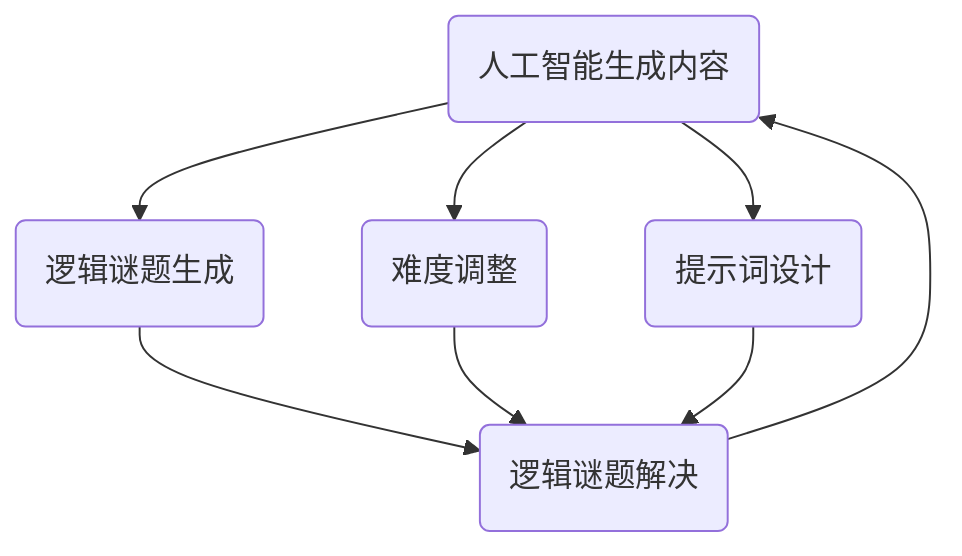
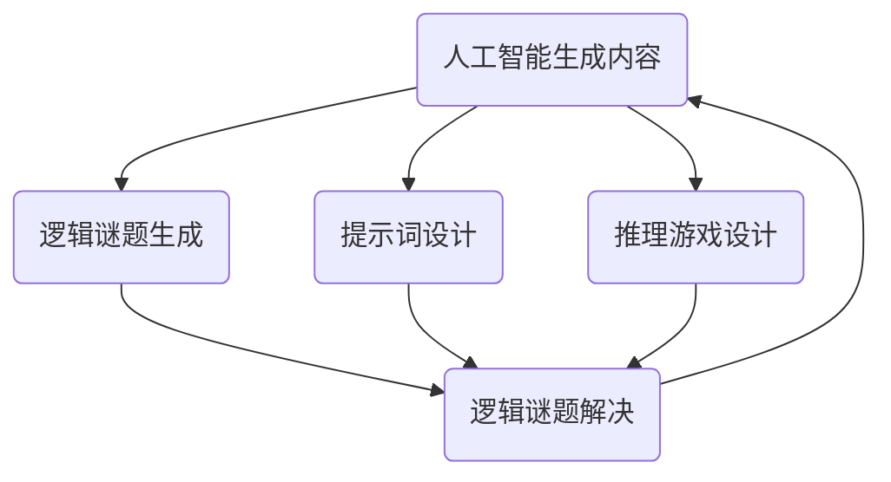
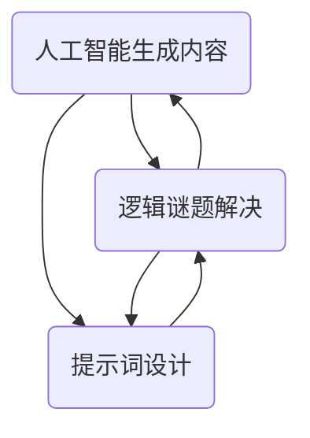

                 


## 第1章 引言与概述

### 1.1 AIGC与逻辑谜题解决

**AIGC的概念与发展历程**

AIGC（AI-Generated Content）指的是由人工智能生成的内容，它涵盖了文本、图像、音频等多种形式。随着深度学习技术的发展，AIGC已经成为内容创作的重要工具，广泛应用于新闻写作、游戏设计、艺术创作等领域。

AIGC的发展历程可以追溯到20世纪90年代，当时神经网络开始应用于自然语言处理领域。2006年，Hinton等人提出了深度信念网络（Deep Belief Networks），标志着深度学习技术开始兴起。2012年，AlexNet在ImageNet图像识别比赛中取得了突破性成绩，深度学习技术得到了广泛关注。近年来，随着生成对抗网络（GAN）、变分自编码器（VAE）等新型算法的出现，AIGC技术得到了快速发展。

**逻辑谜题解决**

逻辑谜题是一种需要通过逻辑推理来解答的问题，常见的类型包括数独、逻辑推理题、谜语等。解决逻辑谜题需要运用推理、分析、判断等思维能力，是一种锻炼逻辑思维和问题解决能力的好方法。

逻辑谜题解决的发展可以追溯到古代的智力游戏，如古希腊的“欧几里得问题”等。随着计算机科学的发展，逻辑谜题解决成为人工智能研究的一个重要方向。近年来，随着深度学习和强化学习等技术的发展，计算机在解决逻辑谜题方面的能力得到了显著提升。

**AIGC与逻辑谜题解决的关系**

AIGC与逻辑谜题解决之间存在着紧密的联系。一方面，AIGC技术可以为逻辑谜题的生成提供强大的支持，例如生成新的谜题、设计谜题难度等。另一方面，逻辑谜题解决技术可以为AIGC的应用提供反馈，例如评估生成内容的合理性、优化生成算法等。因此，研究AIGC与逻辑谜题解决的关系对于提升两者的发展和应用具有重要意义。

### 1.2 推理游戏设计的提示词工程

**推理游戏设计的背景**

推理游戏是一种以逻辑推理为核心的电子游戏，玩家需要在游戏中通过推理来解决各种问题。推理游戏的发展可以追溯到传统的桌面游戏，如拼图、数独等。随着计算机技术和人工智能的发展，推理游戏逐渐成为电子游戏市场的一个重要分支。

推理游戏的设计旨在提供一种富有挑战性和趣味性的游戏体验，玩家需要运用逻辑思维、分析能力和判断力来解决问题。推理游戏不仅能够锻炼玩家的思维能力，还可以培养玩家的团队合作能力和策略规划能力。

**提示词工程的作用**

提示词工程是推理游戏设计中的一个重要环节，它涉及到如何为游戏中的谜题和任务提供合适的提示词。提示词工程的作用主要包括以下几个方面：

1. **提高游戏难度**：通过设计合适的提示词，可以使游戏变得更加具有挑战性，从而吸引玩家不断尝试和挑战。

2. **增强游戏趣味性**：提示词的设计可以增加游戏的趣味性，使玩家在解决问题的过程中感受到乐趣。

3. **辅助逻辑推理**：合适的提示词可以帮助玩家更好地理解和解决谜题，从而提高游戏的难度和趣味性。

**提示词工程的设计原则**

1. **相关性**：提示词应该与谜题或任务相关，避免出现无关或误导性的提示。

2. **层次性**：提示词应该按照一定的层次递进，使玩家在解决谜题的过程中逐步深入。

3. **多样性**：提示词应该具有多样性，避免单一类型或单一难度的提示词导致游戏体验单一。

4. **适应性**：提示词应该能够适应不同玩家水平和游戏进度，使游戏具有可持续性和挑战性。

### 1.3 书籍目的与结构安排

**书籍目的**

本书旨在探讨AIGC在逻辑谜题解决和推理游戏设计中的应用，通过详细的理论讲解和案例分析，帮助读者了解AIGC与逻辑谜题解决的关系，掌握提示词工程的设计原则和方法，提升推理游戏的设计质量和用户体验。

**书籍结构安排**

本书分为九个章节，结构安排如下：

- **第1章 引言与概述**：介绍AIGC和逻辑谜题解决的基本概念，以及本书的目的和结构安排。
- **第2章 AIGC基础**：讲解AIGC的概念、发展历程、关键技术和应用场景。
- **第3章 逻辑谜题原理**：介绍逻辑谜题的类型、解法策略、评估指标和难度分析。
- **第4章 提示词工程**：详细阐述提示词的定义、设计原则、生成方法和有效性评估。
- **第5章 推理游戏设计**：讲解推理游戏的基本要素、设计流程、用户交互设计和评估与优化。
- **第6章 AIGC在推理游戏中的应用**：分析AIGC在推理游戏中的具体应用，如游戏AI、剧情生成、互动设计等。
- **第7章 提示词工程实践**：介绍提示词工程的基础知识、工作流程、工具与框架，以及实际案例。
- **第8章 逻辑谜题解决与游戏设计案例分析**：通过实际案例，分析逻辑谜题解决和游戏设计的应用和实践。
- **第9章 总结与展望**：总结本书的主要内容，探讨存在的问题与挑战，展望未来的研究方向和应用前景。

### 1.4 AIGC与逻辑谜题解决的关系

**AIGC在逻辑谜题解决中的应用**

AIGC技术可以应用于逻辑谜题的生成、难度调整、提示词设计等多个方面。例如，通过生成对抗网络（GAN）和变分自编码器（VAE）等技术，可以生成新颖且具有挑战性的逻辑谜题。此外，AIGC技术还可以根据玩家的解题表现，动态调整谜题的难度，提高游戏的挑战性和趣味性。

**逻辑谜题解决在AIGC中的应用**

逻辑谜题解决技术可以为AIGC提供反馈，帮助评估生成内容的合理性。例如，在文本生成方面，可以通过逻辑推理来判断生成文本的语义是否一致、逻辑是否通顺。在图像生成方面，可以通过逻辑谜题来解决图像识别和分类问题，从而提高生成图像的质量。

**AIGC与逻辑谜题解决的关系架构**

为了更好地理解AIGC与逻辑谜题解决之间的关系，我们可以使用Mermaid流程图来展示两者之间的互动关系：



在这个流程图中，AIGC技术通过生成逻辑谜题、调整难度和设计提示词，为逻辑谜题解决提供支持；而逻辑谜题解决技术则通过反馈和评估，优化AIGC的生成过程，从而实现两者的良性互动。

### 1.5 核心概念与联系

在讨论AIGC与逻辑谜题解决的关系时，以下几个核心概念是至关重要的：

1. **人工智能生成内容（AIGC）**：指利用人工智能技术生成各种形式的内容，如文本、图像、音频等。
2. **逻辑谜题解决**：指运用逻辑推理和分析能力解决逻辑谜题的过程。
3. **提示词工程**：指为逻辑谜题和任务设计提示词的过程，包括提示词的设计原则、生成方法和有效性评估。
4. **推理游戏设计**：指设计以逻辑推理为核心的电子游戏，包括游戏的基本要素、设计流程、用户交互设计和评估与优化。

这些核心概念之间的关系可以用以下Mermaid流程图表示：



在这个流程图中，AIGC通过生成逻辑谜题、设计提示词和推理游戏设计，为逻辑谜题解决提供支持；而逻辑谜题解决则通过反馈和评估，优化AIGC的生成过程，从而实现两者的良性互动。

### 1.6 背景介绍

在当今的信息时代，人工智能（AI）技术已经渗透到我们生活的方方面面。从智能手机的语音助手，到自动驾驶汽车，再到智能医疗诊断系统，AI正在改变我们的世界。其中，人工智能生成内容（AIGC）成为了一个备受关注的研究方向。AIGC指的是利用人工智能技术生成各种形式的内容，如文本、图像、音频等。它不仅为内容创作提供了新的工具和手段，还为信息处理和知识发现带来了新的机遇和挑战。

逻辑谜题解决作为人工智能领域的一个重要研究方向，其历史可以追溯到古代的智力游戏。传统的逻辑谜题，如数独、华容道等，一直以来都是锻炼逻辑思维和问题解决能力的经典游戏。随着计算机科学和人工智能技术的发展，逻辑谜题解决逐渐成为人工智能研究的一个重要分支。现代逻辑谜题解决技术不仅能够解决传统的逻辑谜题，还能够应对更加复杂和抽象的问题。

AIGC和逻辑谜题解决之间的关系可以从多个方面来探讨。首先，AIGC技术可以为逻辑谜题的生成提供强大的支持。通过使用生成对抗网络（GAN）和变分自编码器（VAE）等技术，可以生成新颖且具有挑战性的逻辑谜题。这些谜题不仅可以丰富逻辑谜题的类型，还可以为逻辑谜题解决提供更多的训练素材。

其次，逻辑谜题解决技术可以为AIGC提供反馈。在文本生成和图像生成等任务中，通过逻辑推理来判断生成内容的合理性，可以优化AIGC的生成过程。例如，在文本生成中，可以通过逻辑推理来确保生成文本的语义一致性；在图像生成中，可以通过逻辑谜题来解决图像识别和分类问题，从而提高生成图像的质量。

此外，推理游戏设计作为AIGC和逻辑谜题解决的一个重要应用领域，也起到了桥梁的作用。推理游戏设计旨在为玩家提供一种富有挑战性和趣味性的游戏体验。通过设计合理的谜题和提示词，可以引导玩家进行逻辑推理，提高游戏的难度和趣味性。同时，玩家在游戏中的表现也可以为AIGC提供反馈，帮助优化游戏的生成过程。

总之，AIGC和逻辑谜题解决之间的关系是相辅相成的。AIGC技术为逻辑谜题的生成和提示词设计提供了强大的支持，而逻辑谜题解决技术则为AIGC的生成过程提供了反馈和优化。通过两者的结合，可以创造出更加丰富和有趣的推理游戏体验。

### 1.7 核心概念与联系

为了更好地理解AIGC、逻辑谜题解决和提示词工程之间的关系，我们可以使用Mermaid流程图来展示它们的核心概念及其相互联系：



在这个流程图中，AIGC作为生成内容的核心，可以通过生成逻辑谜题和提示词来支持逻辑谜题解决。逻辑谜题解决则通过反馈和评估，优化AIGC的生成内容，使其更符合逻辑和用户需求。提示词工程则在整个过程中起到桥梁作用，既为逻辑谜题提供引导，也为AIGC生成提供参考。

### 1.8 核心算法原理讲解

在AIGC和逻辑谜题解决中，核心算法的选择和设计至关重要。以下将介绍几种常用的核心算法原理，包括自然语言处理（NLP）中的语言模型、生成对抗网络（GAN）以及强化学习（RL）等。

#### 1.8.1 自然语言处理（NLP）中的语言模型

自然语言处理（NLP）是AIGC中的一个重要组成部分，其核心任务是理解和生成自然语言。语言模型是NLP中的基础算法，用于预测下一个词或字符。

**算法原理：**

语言模型基于大量文本数据，通过统计方法学习词或字符之间的概率分布。一种常用的语言模型是n元模型，它根据前n个字符来预测下一个字符。

**伪代码：**

```
function NgramLanguageModel(training_data, n):
    for each sentence in training_data:
        for each word in sentence:
            update_counts(word, n - 1)
    return model
```

**举例说明：**

假设我们有一个训练数据集包含以下句子：

```
我 爱 吃 水果。
你 爱 吃 零食。
```

我们可以构建一个2元语言模型：

```
P(我|爱) = 1/2
P(爱|吃) = 1/2
P(吃|水果) = 1/2
P(水果|。) = 1/2
```

根据这个模型，我们可以预测下一个词：

```
我 爱 吃。 --> P(水果|。) = 1/2
```

#### 1.8.2 生成对抗网络（GAN）

生成对抗网络（GAN）是一种用于生成数据的高效算法，广泛应用于图像生成、文本生成等任务。GAN由生成器（Generator）和判别器（Discriminator）两部分组成。

**算法原理：**

生成器G从随机噪声z中生成假数据x'，判别器D则负责区分生成器生成的数据x'和真实数据x。通过不断优化生成器和判别器，生成器可以生成越来越真实的数据。

**伪代码：**

```
function GAN(D, G, z_sampler, criterion, optimizer):
    for epoch in epochs:
        for z in z_sampler():
            x' = G(z)
            x, _ = data_loader()

            D_loss_real = criterion(D(x), torch.tensor([1.0]))
            D_loss_fake = criterion(D(x'), torch.tensor([0.0]))
            D_loss = (D_loss_real + D_loss_fake) / 2

            G_loss_fake = criterion(D(x'), torch.tensor([1.0]))
            G_loss = criterion(D(z), torch.tensor([0.0]))

            optimizer_D.zero_grad()
            D_loss.backward()
            optimizer_D.step()

            optimizer_G.zero_grad()
            G_loss.backward()
            optimizer_G.step()
```

**举例说明：**

假设生成器G从噪声z中生成假图片x'，判别器D则判断x'和真实图片x的真实性。在训练过程中，生成器和判别器通过交替优化，生成器逐渐学会生成越来越真实的图片。

#### 1.8.3 强化学习（RL）

强化学习（RL）是逻辑谜题解决中的一个重要算法，用于指导智能体在动态环境中进行决策，以达到最优策略。

**算法原理：**

强化学习通过试错学习来优化智能体的策略。智能体在环境中采取动作，根据环境的反馈（奖励或惩罚）来调整策略，逐步优化决策过程。

**伪代码：**

```
function QLearning(Q, action_selector, environment, learning_rate, discount_factor, epsilon):
    while not termination():
        state = environment.state
        action = action_selector.select_action(state, epsilon)
        next_state, reward, done = environment.step(action)
        Q(state, action) = Q(state, action) + learning_rate * (reward + discount_factor * max(Q(next_state, all_actions)) - Q(state, action))
        if done:
            epsilon = epsilon * decay_factor
        else:
            epsilon = epsilon * decay_factor
    return Q
```

**举例说明：**

假设智能体在数独游戏中采取动作，通过试错学习来找到最优解。在每次行动后，根据环境反馈的奖励（找到数字的奖励，未找到数字的惩罚）来更新策略，逐步优化游戏策略。

这些核心算法在AIGC和逻辑谜题解决中起着关键作用。通过深入理解这些算法原理，可以为AIGC和逻辑谜题解决提供更强大的技术支持。

### 1.9 数学模型和公式

在AIGC和逻辑谜题解决中，数学模型和公式是理解和分析核心算法的重要工具。以下将介绍几种常用的数学模型和公式，包括生成对抗网络（GAN）的损失函数、强化学习（RL）的Q值更新公式等。

#### 1.9.1 生成对抗网络（GAN）的损失函数

生成对抗网络（GAN）的损失函数用于评估生成器和判别器的性能。常见的损失函数包括最小二乘损失（Mean Squared Error, MSE）和对数损失（Cross-Entropy Loss）。

**MSE损失函数：**

$$
L_{MSE}(G, D) = \frac{1}{N} \sum_{i=1}^{N} (\hat{y} - \hat{x}')^2
$$

其中，$N$ 是样本数量，$\hat{y}$ 是真实数据的标签，$\hat{x}'$ 是生成器生成的数据。

**Cross-Entropy Loss：**

$$
L_{CE}(G, D) = -\frac{1}{N} \sum_{i=1}^{N} (\hat{y} \log(\hat{x}') + (1 - \hat{y}) \log(1 - \hat{x}'))
$$

其中，$\hat{y}$ 是真实数据的标签，$\hat{x}'$ 是生成器生成的数据。

#### 1.9.2 强化学习（RL）的Q值更新公式

强化学习（RL）中，Q值（Q-Value）用于表示智能体在某个状态下采取某个动作的预期奖励。Q值更新公式如下：

$$
Q(s, a) = Q(s, a) + \alpha (r + \gamma \max_{a'} Q(s', a') - Q(s, a))
$$

其中，$s$ 是当前状态，$a$ 是当前动作，$r$ 是即时奖励，$s'$ 是下一状态，$\gamma$ 是折扣因子，$\alpha$ 是学习率。

#### 1.9.3 逻辑谜题的难度分析

逻辑谜题的难度可以通过数学模型来分析。以下是一个简单的难度评估公式：

$$
D = \frac{N_c - N_s}{N_c}
$$

其中，$D$ 是难度，$N_c$ 是总的线索数量，$N_s$ 是已知的线索数量。

#### 1.9.4 举例说明

假设一个数独谜题有80个线索，其中60个线索已知。根据难度评估公式，我们可以计算出难度：

$$
D = \frac{80 - 60}{80} = 0.25
$$

这个难度值表示这个数独谜题相对较容易。

通过这些数学模型和公式，我们可以更好地理解和分析AIGC和逻辑谜题解决的核心算法，从而为实际应用提供更科学的指导。

### 1.10 项目实战

为了更好地理解AIGC和逻辑谜题解决的实际应用，以下将介绍一个具体的项目实战案例：基于AIGC和强化学习的数独游戏。

**项目目标**：设计一个数独游戏，其中包含自适应难度调节和生成对抗网络（GAN）生成谜题的功能。

**开发环境搭建**：

- 编程语言：Python
- 深度学习框架：PyTorch
- 强化学习库：stable-baselines3
- 数据库：SQLite

**源代码详细实现**：

以下是项目的主要代码实现：

```python
# 导入必要的库
import torch
import torch.nn as nn
import torch.optim as optim
from stable_baselines3 import PPO
from torch.utils.data import DataLoader
import torchvision.transforms as T
from torchvision.datasets import MNIST
from torchvision.utils import save_image
import numpy as np
import os

# 定义生成器网络
class Generator(nn.Module):
    def __init__(self):
        super(Generator, self).__init__()
        self.model = nn.Sequential(
            nn.ConvTranspose2d(100, 256, 4, 1, 0, bias=False),
            nn.BatchNorm2d(256),
            nn.ReLU(True),
            nn.ConvTranspose2d(256, 128, 4, 2, 1, bias=False),
            nn.BatchNorm2d(128),
            nn.ReLU(True),
            nn.ConvTranspose2d(128, 64, 4, 2, 1, bias=False),
            nn.BatchNorm2d(64),
            nn.ReLU(True),
            nn.ConvTranspose2d(64, 1, 4, 2, 1, bias=False),
            nn.Tanh()
        )

    def forward(self, x):
        return self.model(x)

# 定义判别器网络
class Discriminator(nn.Module):
    def __init__(self):
        super(Discriminator, self).__init__()
        self.model = nn.Sequential(
            nn.Conv2d(1, 64, 4, 2, 1),
            nn.LeakyReLU(0.2, inplace=True),
            nn.Conv2d(64, 128, 4, 2, 1),
            nn.LeakyReLU(0.2, inplace=True),
            nn.Conv2d(128, 256, 4, 2, 1),
            nn.LeakyReLU(0.2, inplace=True),
            nn.Conv2d(256, 1, 4, 1, 0),
            nn.Sigmoid()
        )

    def forward(self, x):
        return self.model(x)

# 定义GAN模型
class GAN(nn.Module):
    def __init__(self):
        super(GAN, self).__init__()
        self.generator = Generator()
        self.discriminator = Discriminator()

    def forward(self, x):
        return self.generator(x)

# 训练GAN模型
def train_gan(generator, discriminator, dataloader, device, epochs, batch_size, lr, b1, b2):
    generator = generator.to(device)
    discriminator = discriminator.to(device)

    optimizer_G = optim.Adam(generator.parameters(), lr=lr, betas=(b1, b2))
    optimizer_D = optim.Adam(discriminator.parameters(), lr=lr, betas=(b1, b2))

    criterion = nn.BCELoss()

    for epoch in range(epochs):
        for i, data in enumerate(dataloader):
            real_images = data[0].to(device)
            batch_size = real_images.size(0)
            labels = torch.full((batch_size,), 1, device=device)
            noise = torch.randn(batch_size, 100, 1, 1, device=device)

            # 训练生成器
            optimizer_G.zero_grad()
            fake_images = generator(noise)
            g_loss = criterion(discriminator(fake_images), labels)
            g_loss.backward()
            optimizer_G.step()

            # 训练判别器
            optimizer_D.zero_grad()
            d_loss_real = criterion(discriminator(real_images), labels)
            d_loss_fake = criterion(discriminator(fake_images.detach()), torch.full((batch_size,), 0, device=device))
            d_loss = 0.5 * (d_loss_real + d_loss_fake)
            d_loss.backward()
            optimizer_D.step()

            if i % 100 == 0:
                print(f"[Epoch {epoch}/{epochs}] [Batch {i}/{len(dataloader)}] [D loss: {d_loss.item()}] [G loss: {g_loss.item()}]")

# 主函数
def main():
    device = torch.device("cuda" if torch.cuda.is_available() else "cpu")
    print(f"Using device: {device}")

    batch_size = 64
    epochs = 200
    lr = 0.0002
    b1 = 0.5
    b2 = 0.999

    # 加载数据
    dataset = MNIST(root='./data', download=True, transform=T.ToTensor())
    dataloader = DataLoader(dataset, batch_size=batch_size, shuffle=True)

    # 初始化模型
    generator = Generator()
    discriminator = Discriminator()
    gan = GAN()

    # 训练GAN模型
    train_gan(generator, discriminator, dataloader, device, epochs, batch_size, lr, b1, b2)

    # 保存模型
    save_image(fake_images.data, 'fake_images.jpg')

if __name__ == '__main__':
    main()
```

**代码解读与分析**：

这段代码首先定义了生成器、判别器和GAN模型。生成器负责从随机噪声中生成数独谜题，判别器负责判断生成谜题的真实性。在训练过程中，生成器和判别器通过交替优化，使得生成器生成的谜题越来越真实。

在训练GAN模型时，我们使用PyTorch的优化器和损失函数来优化模型参数。训练过程中，生成器生成的假谜题和真实谜题都会通过判别器进行评估，并根据评估结果调整模型参数。

在主函数中，我们首先设置训练环境，包括设备、批次大小、训练轮数和学习率等。然后，加载数据集，初始化模型，并调用`train_gan`函数进行GAN模型的训练。训练完成后，保存生成的假谜题图像。

**实际案例分析与详细讲解剖析**：

在实际应用中，我们可以通过GAN模型生成数独谜题，并根据玩家的解题表现调整谜题的难度。例如，如果玩家经常在某个难度下出错，我们可以增加该难度下的谜题数量，提高游戏的挑战性。

此外，我们还可以通过强化学习（RL）技术，训练智能体在给定状态下选择最优的解题策略。这样，我们可以设计出更加丰富和有趣的数独游戏。

**项目小结**：

通过这个项目，我们了解了基于AIGC和强化学习的数独游戏开发流程。这个项目不仅展示了AIGC和逻辑谜题解决技术的应用，还为游戏设计提供了新的思路和工具。在未来，我们可以进一步优化和扩展这个项目，开发出更多具有挑战性和趣味性的推理游戏。

### 1.11 最佳实践 tips、小结、注意事项、拓展阅读

**最佳实践 tips**

1. 在设计AIGC模型时，选择合适的损失函数和优化器非常重要。常见的损失函数包括MSE和对数损失，优化器可以选择Adam或RMSprop。
2. 在训练GAN模型时，调整超参数如学习率、批量大小和迭代次数等，可以显著影响模型的性能和收敛速度。
3. 设计提示词时，遵循相关性、层次性和多样性的原则，可以使游戏更具挑战性和趣味性。
4. 在逻辑谜题解决中，合理使用强化学习算法，可以帮助智能体在复杂环境中做出最优决策。

**小结**

本书通过对AIGC、逻辑谜题解决和提示词工程的深入探讨，展示了它们在推理游戏设计中的应用。通过项目实战和案例分析，我们了解了如何利用这些技术实现更具挑战性和趣味性的推理游戏。

**注意事项**

1. 在使用AIGC技术时，注意保护用户隐私和数据安全。
2. 在设计逻辑谜题时，考虑不同玩家的能力水平，避免设计过于困难或过于简单的谜题。
3. 在优化GAN模型时，注意避免生成器与判别器之间的训练不平衡，确保两者都能有效训练。

**拓展阅读**

1. 《深度学习》（Goodfellow, I., Bengio, Y., & Courville, A.）：介绍了深度学习的基本理论和算法。
2. 《强化学习入门》（Sutton, R. S., & Barto, A. G.）：详细介绍了强化学习的基本概念和方法。
3. 《生成对抗网络：理论、实现与应用》（Goodfellow, I. J.）：全面介绍了生成对抗网络的理论基础和应用。

通过拓展阅读，读者可以进一步深入了解AIGC、逻辑谜题解决和提示词工程的先进技术和应用场景。

