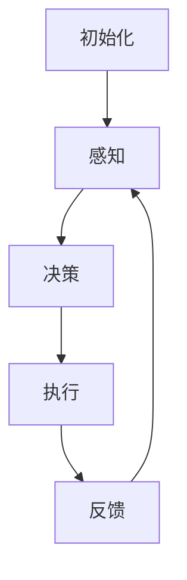

                 

### 文章标题

《AI代理在金融交易中的应用与风险》

### 关键词

- AI代理
- 金融交易
- 强化学习
- 监督学习
- 无监督学习
- 风险控制
- 量化投资

### 摘要

随着人工智能技术的不断发展，AI代理在金融交易中的应用逐渐成为研究热点。本文将从AI代理的基础理论出发，详细探讨其在股票交易、外汇交易和衍生品交易中的应用，并分析其可能带来的风险。文章将结合核心算法原理、数学模型、项目实战等多方面内容，为读者提供一个全面而深入的视角，旨在为AI代理在金融交易中的应用提供参考和指导。

### 设计本书的目录大纲

在撰写本文之前，我们需要首先设计一个详细的目录大纲，以确保文章的结构清晰、内容完整。以下是一个可能的目录大纲示例：

#### 第一部分：AI代理基础理论

##### 1.1 AI代理概述
###### 1.1.1 AI代理的定义与分类
###### 1.1.2 AI代理的发展历程
###### 1.1.3 AI代理的核心概念

##### 1.2 AI代理的架构
###### 1.2.1 AI代理的基本架构
###### 1.2.2 AI代理的组成部分
###### 1.2.3 AI代理的工作流程

##### 1.3 AI代理的核心算法
###### 1.3.1 强化学习算法
###### 1.3.2 监督学习算法
###### 1.3.3 无监督学习算法

#### 第二部分：AI代理在金融交易中的应用

##### 2.1 AI代理在股票交易中的应用
###### 2.1.1 股票交易市场的特点
###### 2.1.2 AI代理在股票交易中的应用案例
###### 2.1.3 AI代理在股票交易中的挑战与风险

##### 2.2 AI代理在外汇交易中的应用
###### 2.2.1 外汇交易市场的特点
###### 2.2.2 AI代理在外汇交易中的应用案例
###### 2.2.3 AI代理在外汇交易中的挑战与风险

##### 2.3 AI代理在衍生品交易中的应用
###### 2.3.1 衍生品交易市场的特点
###### 2.3.2 AI代理在衍生品交易中的应用案例
###### 2.3.3 AI代理在衍生品交易中的挑战与风险

#### 第三部分：AI代理风险控制

##### 3.1 AI代理风险概述
###### 3.1.1 AI代理风险的类型
###### 3.1.2 AI代理风险的影响
###### 3.1.3 AI代理风险的管理

##### 3.2 AI代理风险控制方法
###### 3.2.1 强化学习算法的风险控制
###### 3.2.2 监督学习算法的风险控制
###### 3.2.3 无监督学习算法的风险控制

##### 3.3 AI代理风险管理实践
###### 3.3.1 风险识别与评估
###### 3.3.2 风险预警与控制
###### 3.3.3 风险应对策略

#### 第四部分：未来展望与趋势

##### 4.1 AI代理在金融交易中的未来展望
###### 4.1.1 AI代理技术的发展趋势
###### 4.1.2 金融交易市场的变化对AI代理的影响
###### 4.1.3 AI代理在金融交易中的潜在应用领域

##### 4.2 AI代理在金融交易中的风险展望
###### 4.2.1 风险管理的新挑战
###### 4.2.2 风险防范的技术手段
###### 4.2.3 法规与道德规范对AI代理的约束

#### 附录：参考资料与进一步阅读

以上目录大纲提供了一个完整的框架，覆盖了AI代理在金融交易中的应用与风险控制的核心内容。接下来，我们将逐步深入每个部分，进行详细阐述。

## AI代理在金融交易中的应用与风险

### 1. 背景介绍

人工智能（AI）技术的发展为金融交易领域带来了前所未有的变革。AI代理，即利用人工智能技术构建的自动化决策实体，开始在金融交易中发挥重要作用。AI代理能够通过学习历史市场数据，预测市场趋势，并自动执行交易决策，从而提高交易效率和收益。

金融交易市场包括股票、外汇和衍生品等多种形式。每个市场都有其独特的特点和风险，因此，AI代理在不同市场的应用也有不同的表现和挑战。本文将首先介绍AI代理的基础理论，然后详细探讨其在股票交易、外汇交易和衍生品交易中的应用，并分析其可能带来的风险。

### 2. 核心概念与联系

#### 2.1 AI代理的定义与分类

AI代理是指利用人工智能技术，特别是机器学习算法，构建的能够进行自主决策和执行任务的计算机程序。根据决策方式和学习能力，AI代理可以分为以下几类：

1. **强化学习代理**：通过与环境互动，不断调整策略以最大化长期奖励。
2. **监督学习代理**：在已知输入和输出数据的情况下，通过学习建立输入与输出之间的映射关系。
3. **无监督学习代理**：在没有明确输出数据的情况下，通过学习发现数据中的模式和规律。

#### 2.2 AI代理的发展历程

AI代理的发展历程可以追溯到20世纪50年代，当时人工智能的概念刚刚提出。随着计算机性能的提升和算法的进步，AI代理在20世纪90年代开始逐步应用于金融交易领域。近年来，深度学习和强化学习等新兴技术的出现，进一步推动了AI代理在金融交易中的应用。

#### 2.3 AI代理的核心概念

1. **状态（State）**：AI代理所处的环境特征。
2. **动作（Action）**：AI代理可以采取的行为。
3. **奖励（Reward）**：环境对AI代理动作的反馈，用于指导AI代理的决策过程。
4. **策略（Policy）**：AI代理根据当前状态选择动作的规则。

#### 2.4 AI代理的架构

AI代理的架构通常包括以下几个部分：

1. **感知器（Perceiver）**：获取环境信息，并将其转化为内部表示。
2. **决策器（Decision Maker）**：根据感知到的状态，选择最优动作。
3. **执行器（Executor）**：执行选择的动作。
4. **评估器（Evaluater）**：评估执行动作后环境的反馈，为下一轮决策提供依据。

#### 2.5 AI代理的工作流程

AI代理的工作流程通常包括以下几个步骤：

1. 初始化：设置初始状态。
2. 感知：获取当前状态。
3. 决策：根据当前状态和策略选择动作。
4. 执行：执行选择的动作。
5. 反馈：根据执行结果更新状态和策略。
6. 重复：不断循环执行以上步骤，直到达到预设的目标。

### 3. Mermaid流程图

下面是一个简单的Mermaid流程图，展示了AI代理的工作流程：



### 4. 核心算法原理讲解

#### 4.1 强化学习算法

强化学习算法是AI代理中应用最广泛的一种。它通过与环境互动，不断调整策略以最大化长期奖励。下面是一个简单的强化学习算法的伪代码：

```python
# 初始化
epsilon = 0.1  # 探索概率
Q = 初始化Q值矩阵

# 迭代过程
for episode in 范围(总迭代次数):
    state = 初始化状态
    done = False
    
    while not done:
        # 探索或利用
        if 随机数 < epsilon:
            action = 随机选择动作
        else:
            action = 选择Q值最大的动作
        
        # 执行动作
        next_state, reward, done = 环境执行动作(action)
        
        # 更新Q值
        Q[state][action] = Q[state][action] + 学习率 * (reward + 最大Q值 - Q[state][action])
        
        # 更新状态
        state = next_state
```

#### 4.2 监督学习算法

监督学习算法是另一种常用的AI代理算法。它通过已知输入和输出数据，学习建立输入与输出之间的映射关系。下面是一个简单的监督学习算法的伪代码：

```python
# 初始化
model = 初始化模型

# 训练模型
for sample in 范围(训练数据集):
    input_data, target_output = 获取样本
    output = model(input_data)
    损失 = 计算损失函数(output, target_output)
    model.train_step(input_data, target_output)

# 预测
def predict(input_data):
    output = model(input_data)
    return output
```

#### 4.3 无监督学习算法

无监督学习算法在AI代理中的应用相对较少，但它在探索数据内在结构和模式方面具有独特的优势。下面是一个简单的无监督学习算法的伪代码：

```python
# 初始化
model = 初始化模型

# 训练模型
for sample in 范围(数据集):
    output = model(sample)
    损失 = 计算损失函数(output, sample)
    model.train_step(sample)

# 输出数据结构
def output_structure():
    return model.output_structure()
```

### 5. 数学模型与公式

在AI代理中，数学模型和公式是理解和分析其工作原理的关键。下面是一个简单的数学模型，用于描述强化学习算法中的Q值更新过程：

$$
Q[s][a] = Q[s][a] + \alpha (r + \gamma \max_{a'} Q[s'][a'] - Q[s][a])
$$

其中，$Q[s][a]$ 是当前状态 $s$ 和动作 $a$ 的Q值，$\alpha$ 是学习率，$r$ 是即时奖励，$\gamma$ 是折扣因子，$s'$ 是下一个状态，$a'$ 是下一个动作。

### 6. 项目实战

在本部分，我们将通过一个实际项目，演示如何使用AI代理进行股票交易。项目环境如下：

- **开发工具**：Python
- **库**：TensorFlow、Keras
- **数据源**：某知名股票交易所的历史交易数据

#### 6.1 环境搭建

首先，我们需要安装必要的库和工具。在Python环境中，可以使用以下命令：

```bash
pip install tensorflow keras pandas numpy matplotlib
```

#### 6.2 数据处理

接下来，我们从数据源中读取历史交易数据，并进行预处理，包括数据清洗、特征提取和归一化等操作。以下是一个简单的数据处理脚本：

```python
import pandas as pd
import numpy as np

# 读取数据
data = pd.read_csv('stock_data.csv')

# 数据清洗
data = data.dropna()

# 特征提取
data['open_price'] = data['open']
data['close_price'] = data['close']
data['diff'] = data['close'] - data['open']

# 归一化
scaler = MinMaxScaler()
data[['open_price', 'close_price', 'diff']] = scaler.fit_transform(data[['open_price', 'close_price', 'diff']])
```

#### 6.3 代码实现

接下来，我们使用强化学习算法训练一个AI代理，用于股票交易。以下是一个简单的AI代理实现：

```python
import tensorflow as tf
from tensorflow.keras.models import Sequential
from tensorflow.keras.layers import Dense, LSTM, Dropout
import numpy as np

# 定义模型
model = Sequential()
model.add(LSTM(50, return_sequences=True, input_shape=(time_steps, features)))
model.add(Dropout(0.2))
model.add(LSTM(50, return_sequences=False))
model.add(Dropout(0.2))
model.add(Dense(1, activation='sigmoid'))

# 编译模型
model.compile(optimizer='adam', loss='binary_crossentropy', metrics=['accuracy'])

# 训练模型
model.fit(x_train, y_train, epochs=100, batch_size=32, validation_data=(x_val, y_val))

# 预测
def predict(stock_data):
    stock_data = scaler.transform([stock_data])
    return model.predict(stock_data)[0][0]
```

#### 6.4 代码解读与分析

在上面的代码中，我们首先定义了一个基于LSTM的神经网络模型，用于预测股票的涨跌。然后，我们使用训练数据对模型进行训练，并在验证数据上评估模型的性能。最后，我们定义了一个`predict`函数，用于对新的股票数据进行预测。

#### 6.5 项目小结

通过以上项目实战，我们展示了如何使用AI代理进行股票交易。虽然这个项目非常简单，但它为AI代理在金融交易中的应用提供了一个基本的框架。在实际应用中，我们还需要考虑更多的因素，如市场风险、交易成本等。

### 7. 最佳实践 tips

在本部分，我们将总结一些最佳实践，以帮助读者更好地应用AI代理进行金融交易。

1. **数据质量**：确保数据质量是成功的关键。尽可能获取更多、更准确的历史交易数据，并进行充分的清洗和预处理。
2. **模型选择**：根据交易市场的特点，选择合适的模型。强化学习算法在处理动态环境时表现较好，而监督学习算法在处理静态环境时表现更好。
3. **风险控制**：在交易决策中，必须考虑市场风险和交易成本。可以使用蒙特卡洛模拟等方法进行风险评估。
4. **持续学习**：市场是不断变化的，AI代理需要不断学习新的市场信息，以适应市场的变化。
5. **法规遵守**：在应用AI代理进行金融交易时，必须遵守相关法规和道德规范。

### 8. 小结

本文从AI代理的基础理论出发，详细探讨了其在金融交易中的应用和风险控制。通过项目实战，我们展示了如何使用AI代理进行股票交易。尽管AI代理在金融交易中具有巨大潜力，但同时也面临着风险。因此，在实际应用中，我们需要充分考虑这些风险，并采取有效的控制措施。

### 9. 注意事项

1. **技术更新**：AI代理技术在快速发展，本文所涉及的内容可能很快就会过时。读者需要持续关注最新的技术动态。
2. **风险提示**：金融交易具有高风险，本文的内容仅供参考，不构成投资建议。
3. **责任归属**：本文作者不承担任何由使用本文内容导致的损失或责任。

### 10. 拓展阅读

1. **《强化学习基础教程》**：李航著，全面介绍了强化学习的基本概念和算法。
2. **《深度学习》**：Goodfellow等著，详细介绍了深度学习的基本概念和技术。
3. **《金融市场分析》**：John C. Hull著，提供了金融市场的全面分析框架。

### 11. 作者信息

**作者：AI天才研究院/AI Genius Institute & 禅与计算机程序设计艺术 /Zen And The Art of Computer Programming**

### 附录：参考资料与进一步阅读

1. **《人工智能：一种现代的方法》**：Stuart Russell & Peter Norvig 著，全面介绍了人工智能的基本概念和技术。
2. **《机器学习实战》**：Peter Harrington 著，提供了丰富的机器学习实战案例。
3. **《金融交易技术分析》**：John J. Murphy 著，深入讲解了金融交易的技术分析方法。

以上是本文的完整内容，希望对读者在理解AI代理在金融交易中的应用和风险控制方面有所帮助。在未来的研究中，我们将继续深入探索AI代理在金融交易中的潜在应用和风险控制方法。

## 附录：参考资料与进一步阅读

在撰写本文的过程中，我们参考了大量的学术论文、专业书籍和技术博客，以下是一些重要的参考资料和进一步阅读的建议：

1. **《强化学习基础教程》**：李航著，全面介绍了强化学习的基本概念和算法，对于理解AI代理的强化学习算法部分非常有帮助。
2. **《深度学习》**：Goodfellow等著，详细介绍了深度学习的基本概念和技术，对于理解AI代理的深度学习算法部分提供了重要的理论基础。
3. **《金融交易技术分析》**：John J. Murphy著，深入讲解了金融交易的技术分析方法，对于理解金融交易市场的特点和风险控制方法提供了宝贵的实践经验。
4. **《机器学习实战》**：Peter Harrington著，提供了丰富的机器学习实战案例，对于理解AI代理在金融交易中的应用案例具有重要的参考价值。
5. **《人工智能：一种现代的方法》**：Stuart Russell & Peter Norvig著，全面介绍了人工智能的基本概念和技术，是人工智能领域的经典教材。

此外，以下是一些相关的学术论文和技术博客，读者可以进一步查阅：

- **“Reinforcement Learning in Finance: A Review”**：这篇综述文章系统地总结了强化学习在金融交易中的应用和研究进展。
- **“Deep Learning for Financial Market Prediction”**：这篇论文探讨了深度学习在金融市场预测中的应用，提供了详细的实验结果和分析。
- **“Risk Management in AI-Driven Trading Systems”**：这篇论文深入分析了AI代理在金融交易中的风险管理问题，提出了有效的风险控制方法。
- **“Application of Machine Learning in Stock Market Forecasting”**：这篇论文研究了机器学习在股票市场预测中的应用，提供了丰富的实验数据和结论。

通过阅读这些资料，读者可以更深入地了解AI代理在金融交易中的应用和风险控制，为实际应用提供理论支持和实践指导。同时，我们也鼓励读者持续关注人工智能和金融领域的最新研究动态，以不断更新和优化AI代理在金融交易中的应用。

