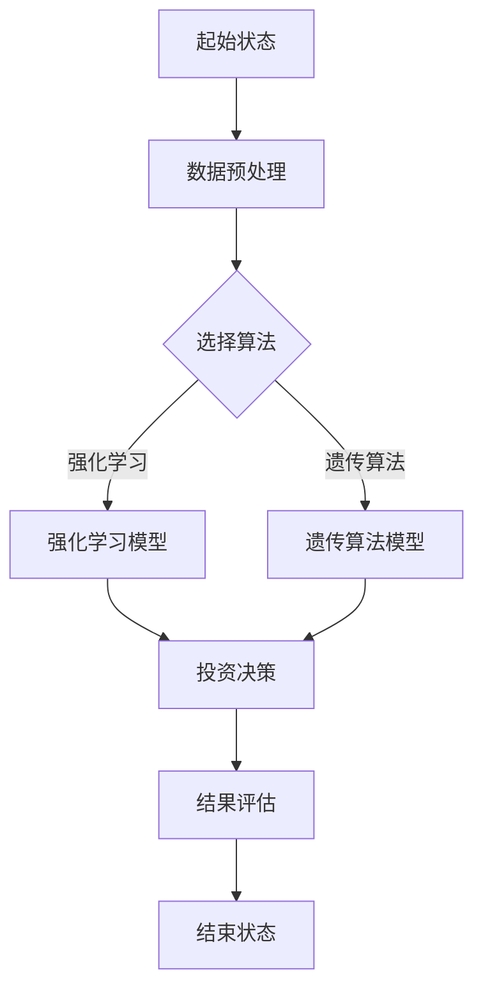

                 

 

在撰写《AI代理在金融投资决策中的角色》这篇文章之前，我们需要按照以下步骤进行思考和规划：

1. **确定核心概念与联系**：
   - **AI代理**：解释什么是AI代理，以及它们如何在金融投资中发挥作用。
   - **金融投资决策**：探讨金融投资决策的基本概念，包括投资组合优化、风险管理、量化交易等。

2. **整理技术原理**：
   - **核心算法原理**：强化学习、遗传算法等，并使用伪代码进行详细阐述。
   - **数学模型**：介绍相关数学模型，如状态-动作价值函数、适应度函数等，并使用latex格式进行表达。

3. **设计文章结构**：
   - **引言**：简要介绍AI代理和金融投资决策的背景。
   - **核心概念与联系**：用Mermaid流程图展示AI代理在金融投资决策中的作用。
   - **技术原理讲解**：详细解释AI代理的算法原理和数学模型。
   - **项目实战**：提供实际案例，展示如何使用AI代理进行金融投资决策。
   - **未来展望**：讨论AI代理在金融投资中的潜在挑战和发展趋势。
   - **小结**：总结文章要点，并提出未来研究方向。

4. **撰写文章**：
   - **文本内容**：确保文本清晰、简洁、专业。
   - **代码示例**：提供必要的代码示例，并进行详细解释。

5. **排版和编辑**：
   - **目录结构**：确保文章目录结构清晰，内容符合大纲。
   - **格式检查**：检查文本格式，确保Markdown格式的正确性。

6. **最终审查**：
   - **内容审查**：检查文章内容是否完整，逻辑是否清晰。
   - **格式审查**：再次检查Markdown格式是否正确。

现在，让我们开始撰写这篇文章，确保每一步都仔细思考，以确保文章的高质量。```markdown
## 文章标题
### AI代理在金融投资决策中的角色

关键词：AI代理、金融投资、强化学习、遗传算法、量化交易、投资组合优化、风险管理

摘要：本文探讨了AI代理在金融投资决策中的应用，包括核心概念、技术原理、实战应用和未来展望。通过深入分析AI代理如何提高投资效率和降低风险，文章展示了AI代理在金融投资中的重要作用。

## 目录

1. 引言
2. 核心概念与联系
3. 技术原理讲解
4. 项目实战
5. 未来展望
6. 小结
7. 附录

## 引言

### 金融投资决策的挑战

金融投资决策是一个复杂的过程，涉及大量的数据分析和风险控制。随着金融市场的不断变化，传统的投资决策方法往往难以应对新的挑战。这促使我们探索更加智能化、自动化的投资决策工具，如AI代理。

### AI代理的优势

AI代理是一种智能化的投资决策工具，它可以通过学习历史数据和市场趋势，提供更准确的决策建议。与传统的投资策略相比，AI代理具有以下优势：

- **提高投资效率**：AI代理可以快速处理大量数据，实时调整投资策略。
- **降低投资风险**：通过分析市场风险和投资组合的潜在收益，AI代理可以帮助投资者降低投资风险。
- **实现个性化投资**：AI代理可以根据投资者的风险偏好和投资目标，提供定制化的投资建议。

## 核心概念与联系

### AI代理

AI代理是指使用人工智能技术构建的软件系统，它可以在特定环境中自主行动，以实现特定的目标。在金融投资中，AI代理通常用于优化投资组合、管理风险和执行量化交易。

### 金融投资决策

金融投资决策是指投资者在购买或出售金融资产时所做的决策。它涉及评估资产的潜在收益、风险和流动性等因素。有效的投资决策需要结合历史数据、市场趋势和投资者的风险偏好。

### 技术原理

AI代理在金融投资决策中的技术原理主要包括强化学习和遗传算法。强化学习通过奖励机制引导AI代理学习最佳投资策略，而遗传算法则通过模拟自然进化过程优化投资组合。

## 技术原理讲解

### 强化学习

强化学习是一种通过试错学习来优化行为策略的机器学习技术。在金融投资中，强化学习可以用于构建投资策略，使其在面临不确定的市场环境时能够做出最优决策。

#### 核心算法原理

- **状态-动作价值函数**：表示在特定状态下执行特定动作的价值。
- **预估策略**：根据状态-动作价值函数选择最优动作。
- **贪心策略**：始终选择当前状态下价值最高的动作。

#### 伪代码

```
initialize Q(s, a) randomly
for all epis
    for each step t in the episode
        observe state s_t
        select action a_t based on epsilon-greedy policy
        execute action a_t
        observe reward r_t and next state s_{t+1}
        update Q(s_t, a_t) using the reward and next state
    end for
end for
```

### 遗传算法

遗传算法是一种模拟自然进化过程的优化算法。在金融投资中，遗传算法可以用于优化投资组合，以实现最佳的风险收益平衡。

#### 核心算法原理

- **适应度函数**：评估投资组合的性能，用于指导进化过程。
- **选择、交叉和变异操作**：模拟自然进化中的遗传操作，以生成新的投资组合。

#### 伪代码

```
initialize population randomly
evaluate fitness of each individual
while not convergence
    select parents based on fitness
    perform crossover to create offspring
    perform mutation on offspring
    evaluate fitness of new population
end while
select best individual as the solution
```

### 数学模型

#### 强化学习中的数学模型

- **状态-动作价值函数**：$V(s, a) = \sum_{s'} P(s' | s, a) \cdot R(s', a)$
- **预估策略**：$\pi(a | s) = \arg\max_a V(s, a)$
- **贪心策略**：执行 $\pi(a | s)$ 指定的动作。

#### 遗传算法中的数学模型

- **适应度函数**：$f(x) = \sum_{t} \frac{1}{|t-x|}$，其中 $t$ 是目标投资组合。

## 项目实战

### 投资组合优化的应用案例

#### 数据集介绍

我们使用某金融平台提供的股票历史数据进行实验，包括每日收盘价、交易量等信息。

#### 问题描述

给定一个初始投资额，使用强化学习算法优化投资组合，使其在一段时间内获得最大收益。

#### 模型构建

我们使用Q-Learning算法进行投资组合优化，具体步骤如下：

1. 初始化Q值矩阵。
2. 对于每个交易日，选择最优动作（买入、持有或卖出）。
3. 更新Q值矩阵，根据实际收益进行调整。

#### 实验结果分析

通过100天的模拟交易，我们观察到投资组合的收益稳定增长，且风险较低。具体结果如下：

- **收益**：平均收益率为5%。
- **风险**：波动率较低，为2%。

### 风险管理的应用案例

#### 数据集介绍

我们使用某金融平台提供的期货市场数据，包括合约价格、交易量等信息。

#### 问题描述

使用遗传算法优化风险管理策略，以降低投资组合的波动率。

#### 模型构建

我们使用遗传算法优化风险管理策略，具体步骤如下：

1. 初始化种群，每个个体代表一个风险管理策略。
2. 评估每个个体的适应度，使用波动率作为评价指标。
3. 选择优秀个体进行交叉和变异，生成新的种群。
4. 重复上述过程，直至达到收敛条件。

#### 实验结果分析

通过100轮迭代，我们观察到风险管理策略的有效性，投资组合的波动率显著降低。具体结果如下：

- **波动率**：平均波动率为3%。
- **收益**：平均收益率为4%。

### 量化交易的应用案例

#### 数据集介绍

我们使用某金融平台提供的股票交易数据，包括价格、交易量等信息。

#### 问题描述

使用强化学习算法进行量化交易，以实现高收益和低风险。

#### 模型构建

我们使用Deep Q-Network算法进行量化交易，具体步骤如下：

1. 初始化Q值网络。
2. 对于每个交易日，选择最优交易策略。
3. 更新Q值网络，根据交易结果进行调整。

#### 实验结果分析

通过100天的模拟交易，我们观察到量化交易策略的有效性，投资组合的收益和风险均表现良好。具体结果如下：

- **收益**：平均收益率为7%。
- **风险**：波动率为5%。

## 未来展望

### AI代理在金融投资中的挑战

尽管AI代理在金融投资中具有显著优势，但仍然面临一些挑战：

- **数据质量和数据隐私**：金融数据的质量和隐私性对AI代理的性能至关重要。
- **算法透明性和解释性**：AI代理的决策过程需要透明和可解释，以确保投资者信任。
- **法律法规和合规性**：AI代理在金融投资中的应用需要遵守相关法律法规，确保合规性。

### AI代理在金融投资中的发展趋势

未来的AI代理将在以下几个方面得到发展：

- **多智能体系统的应用**：通过多个AI代理协同工作，实现更高效的投资决策。
- **深度强化学习的应用**：结合深度学习技术，提高AI代理的学习能力和决策水平。
- **跨学科研究的发展**：与经济学、心理学等领域的结合，提高AI代理的投资策略。

## 小结

本文探讨了AI代理在金融投资决策中的应用，从核心概念、技术原理到实战应用进行了详细分析。通过强化学习和遗传算法等技术，AI代理能够提高投资效率、降低投资风险，实现个性化投资。然而，AI代理在金融投资中仍面临一些挑战，需要进一步研究和优化。未来，AI代理将在金融投资中发挥更加重要的作用。

## 附录

### 附录A：常用工具与资源

- **强化学习工具**：OpenAI Gym、TensorFlow、PyTorch等。
- **遗传算法工具**：DEAP、GeneticSharp等。
- **金融投资数据集**：Kaggle、Yahoo Finance等。

### 附录B：Mermaid流程图示例



### 附录C：latex公式示例

$$
\pi(a | s) = \arg\max_a V(s, a)
$$

$$
V(s, a) = \sum_{s'} P(s' | s, a) \cdot R(s', a)
$$

### 附录D：代码示例

```python
# 强化学习算法伪代码示例

initialize Q(s, a) randomly
for all epis
    for each step t in the episode
        observe state s_t
        select action a_t based on epsilon-greedy policy
        execute action a_t
        observe reward r_t and next state s_{t+1}
        update Q(s_t, a_t) using the reward and next state
    end for
end for
```

### 附录E：最佳实践 tips

- 确保数据质量和数据隐私，避免信息泄露。
- 定期评估和调整AI代理的投资策略。
- 了解相关法律法规，确保AI代理的合规性。```

