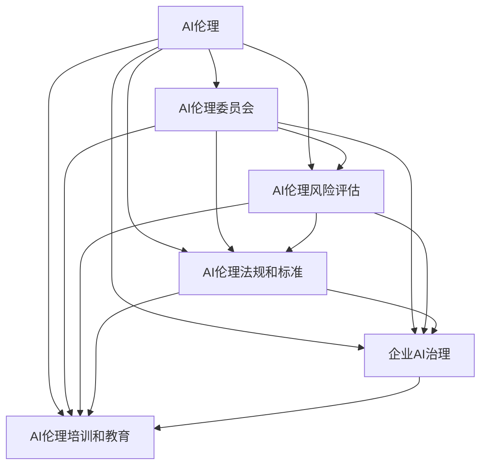

                 

### 背景介绍

人工智能（AI）作为现代科技的前沿领域，已经深刻地改变了我们的工作和生活方式。然而，随着AI技术的飞速发展，其潜在的社会伦理问题也日益凸显。AI系统的决策过程往往具有复杂性和不可预测性，可能导致不公平、歧视、隐私泄露等问题。因此，如何确保AI系统的伦理合规性，成为了企业和研究人员亟待解决的课题。

为了应对这一挑战，越来越多的企业开始设立AI伦理委员会，作为内部监督机制，确保AI项目在开发和应用过程中遵循伦理原则。AI伦理委员会的设立，不仅有助于提高企业的社会责任感，还能够增强公众对AI技术的信任度。

本文旨在探讨企业AI伦理委员会的最佳实践，从多个维度分析其设立和运作的必要性、关键要素和成功案例。文章将分为七个部分，依次介绍AI伦理的基本概念和原则、AI伦理委员会的设立与运作、AI伦理风险评估、AI伦理法规和标准、企业AI治理实践、AI伦理培训和教育以及未来展望。通过这一系列探讨，我们希望为读者提供一份全面、系统的AI伦理委员会建设指南。

### 核心概念与联系

在深入探讨企业AI伦理委员会的最佳实践之前，我们首先需要明确几个核心概念，并理解它们之间的相互关系。以下是本文将涉及的一些核心概念：

1. **AI伦理**：AI伦理是研究人工智能系统在社会应用中的伦理问题和原则的学科。它关注AI技术对社会的影响，以及如何确保AI系统的公平性、透明性、可解释性和安全性。

2. **AI伦理委员会**：AI伦理委员会是企业内部设立的专门负责监督和管理AI项目伦理合规性的机构。其职责包括制定伦理准则、评估AI项目的潜在风险、审查和监督AI系统的开发和应用过程。

3. **AI伦理风险评估**：AI伦理风险评估是识别、评估和缓解AI项目潜在伦理风险的过程。这包括分析AI系统的设计、实现和应用过程中可能出现的伦理问题，并制定相应的风险缓解策略。

4. **AI伦理法规和标准**：AI伦理法规和标准是规范和指导AI系统开发和应用的法律法规和标准体系。这些法规和标准旨在确保AI系统的伦理合规性，保护用户的隐私和权益。

5. **企业AI治理**：企业AI治理是指企业在AI项目开发和应用过程中采取的管理策略和实践。它包括建立AI伦理委员会、制定AI伦理准则、实施AI伦理风险评估、遵循AI伦理法规和标准等。

6. **AI伦理培训和教育**：AI伦理培训和教育是指对企业和个人进行AI伦理知识的培训和普及。通过培训和教育，提高相关人员对AI伦理的认识和责任感，从而促进AI技术的健康发展。

下面，我们使用Mermaid流程图来展示这些核心概念之间的相互关系：

在这个流程图中，我们可以看到，AI伦理是核心，贯穿于整个AI系统的开发和应用过程。AI伦理委员会、AI伦理风险评估、AI伦理法规和标准、企业AI治理以及AI伦理培训和教育都是AI伦理的具体实践和延伸，它们相互联系，共同构成了一个完整的AI伦理体系。

### AI伦理的基本概念和原则

AI伦理作为人工智能领域的重要组成部分，其核心在于确保AI系统在社会应用中遵循一定的伦理原则，以减少潜在的负面影响。以下将详细阐述AI伦理的基本概念和原则。

#### 1. 公平性（Fairness）

公平性是AI伦理的重要原则之一，旨在确保AI系统在不同群体或个体之间不产生不公平的偏见。具体而言，公平性要求AI系统在决策过程中不应因种族、性别、年龄、地域等因素导致歧视。为了实现这一目标，需要从数据收集、算法设计到模型训练等多个环节进行公平性的评估和优化。例如，在招聘AI系统中，确保不会因候选人的性别或种族背景而影响其评估结果。

#### 2. 透明性（Transparency）

透明性要求AI系统的决策过程和内部机制能够被理解和追踪。这有助于提高用户对AI系统的信任度，并便于在出现问题时进行责任追溯。透明性可以通过多种方式实现，如提供决策路径、输出结果的可解释性报告，或者使用可视化工具展示AI模型的运行过程。例如，在医疗诊断AI系统中，医生和患者需要了解AI的诊断依据和推理过程，以确保诊断结果的可靠性和信任度。

#### 3. 可解释性（Interpretability）

可解释性是透明性的进一步扩展，强调AI系统内部参数和权重对决策结果的影响。可解释性有助于用户理解AI系统的决策依据，从而在出现异常结果时进行有效的问题定位和调整。提高可解释性可以通过简化模型结构、增加中间层可视化或解释性算法（如LIME、SHAP等）来实现。例如，在金融风控AI系统中，银行需要解释贷款审批决策的原因，以便客户理解拒绝贷款的理由。

#### 4. 安全性（Security）

安全性是确保AI系统在运行过程中不受恶意攻击和数据泄露的风险。安全性包括数据安全、模型安全和应用安全等多个层面。数据安全要求对输入数据进行有效的加密和验证，防止数据篡改或泄露。模型安全则关注对抗攻击（Adversarial Attack）和模型鲁棒性（Robustness），确保AI系统在异常输入下仍能保持稳定运行。应用安全涉及系统的隔离和监控，以防止恶意行为对整个系统造成破坏。

#### 5. 隐私保护（Privacy Protection）

隐私保护是AI伦理的关键原则，特别是在处理个人数据时。AI系统需要遵循隐私保护法规，如GDPR和CCPA，确保用户数据的安全和隐私。隐私保护措施包括数据去识别化（De-identification）、差分隐私（Differential Privacy）和隐私增强技术（Privacy-Preserving Techniques），如联邦学习（Federated Learning）和同态加密（Homomorphic Encryption）。

#### 6. 责任归属（Accountability）

责任归属强调在AI系统造成负面影响时，应明确责任主体和责任范围。这有助于提高AI系统的可信度和法律责任的可追究性。责任归属需要从AI系统的设计、开发和部署等环节进行全面的考虑，确保每个环节的责任明确和可控。

#### 7. 可持续性（Sustainability）

可持续性是AI伦理的长期目标，强调AI系统对环境和社会的积极影响。可持续性包括资源的合理利用、碳排放的减少和生态平衡的维护。通过采用绿色AI技术和可持续发展策略，实现AI技术与环境保护的双赢。

#### 8. 社会责任（Social Responsibility）

社会责任强调企业在AI技术开发和应用过程中，应考虑对社会和环境的责任。社会责任包括促进教育公平、支持公益项目、提高社会福利和减少社会不平等。通过积极履行社会责任，企业能够提升品牌形象，并获得更广泛的社会认可和支持。

### 总结

AI伦理的基本概念和原则是确保AI系统在社会应用中遵循道德规范、减少负面影响的关键。通过公平性、透明性、可解释性、安全性、隐私保护、责任归属、可持续性和社会责任等原则的实践，我们可以构建一个更加负责任、公正和可持续的人工智能未来。

### AI伦理委员会的设立与运作

为了确保人工智能（AI）系统的开发和部署符合伦理标准，企业需要设立专门的AI伦理委员会（AI Ethics Committee）。这一委员会不仅有助于识别和缓解AI系统可能带来的伦理风险，还能提升企业的社会责任感和公众信任度。以下将详细探讨AI伦理委员会的设立背景、目的、职责以及运作机制。

#### 设立背景

随着AI技术的发展和应用，其潜在的社会影响和伦理问题日益受到关注。AI系统在决策过程中可能因设计缺陷或数据偏差而导致不公平、歧视、隐私泄露等问题。这些问题的出现不仅损害了用户的权益，也可能给企业带来法律和声誉风险。为了应对这些挑战，企业开始意识到需要设立专门的伦理委员会，以监督和管理AI项目的伦理合规性。

#### 设立目的

AI伦理委员会的设立目的主要包括以下几个方面：

1. **确保AI系统的伦理合规性**：通过制定和实施伦理准则，确保AI系统在设计和部署过程中遵循伦理原则，减少潜在的社会负面影响。
2. **提升社会责任感**：企业通过设立AI伦理委员会，表明其对社会责任的重视，增强公众对企业的信任和认可。
3. **降低法律风险**：遵守伦理规范有助于企业规避法律风险，避免因伦理问题引发的诉讼和罚款。
4. **促进技术发展**：通过伦理委员会的监督和指导，鼓励AI技术在符合伦理标准的前提下不断创新和发展。

#### 职责

AI伦理委员会的具体职责包括以下几个方面：

1. **制定伦理准则**：根据企业价值观和社会责任，制定AI伦理准则，为AI项目的开发和应用提供指导。
2. **评估伦理风险**：对AI项目进行伦理风险评估，识别潜在的伦理问题，制定风险缓解策略。
3. **审查和监督**：对AI项目的开发过程和应用进行审查和监督，确保遵守伦理准则和法规要求。
4. **培训和教育**：对相关人员进行AI伦理培训，提高对伦理问题的认识和责任感。
5. **政策建议**：基于对AI伦理的研究和实践，向企业高层提供政策建议，优化企业的AI治理策略。

#### 运作机制

AI伦理委员会的运作机制主要包括以下几个方面：

1. **组织结构**：AI伦理委员会应由来自不同部门、具有不同背景的成员组成，确保委员会的多样性和专业性。成员应包括AI专家、伦理学家、法律顾问、用户代表等。
2. **决策流程**：AI伦理委员会应建立透明的决策流程，确保每个决策都经过充分讨论和论证。决策流程应包括问题提出、讨论、评估、决策和反馈等环节。
3. **工作计划**：AI伦理委员会应制定年度工作计划，明确重点工作领域和时间节点，确保委员会的工作有序进行。
4. **报告机制**：AI伦理委员会应定期向企业高层和相关部门提交工作报告，汇报AI项目的伦理审查和监督情况。
5. **沟通和合作**：AI伦理委员会应与企业其他部门保持密切沟通和合作，共同推动AI项目的伦理合规性。

#### 成功案例

以下是一个成功的企业AI伦理委员会案例：

**案例：科技公司X的AI伦理委员会**

- **背景**：科技公司X在开发一款智能招聘系统时，意识到可能存在数据偏见和歧视问题。
- **设立过程**：公司成立了由数据科学家、伦理学家、法律顾问和人力资源专家组成的AI伦理委员会。
- **职责**：委员会制定了详细的伦理准则，对招聘系统进行了全面的风险评估，并提出了改进措施。
- **运作**：委员会定期召开会议，审查招聘系统的算法和数据处理流程，确保其符合伦理标准。
- **效果**：通过AI伦理委员会的监督，科技公司X成功避免了数据偏见和歧视问题，提升了招聘系统的公平性和透明性，赢得了用户的信任。

#### 挑战与应对策略

在设立和运作AI伦理委员会的过程中，企业可能会面临以下挑战：

1. **资源有限**：AI伦理委员会需要专业的人才和资源支持，企业可能面临人员不足和资金压力。
2. **沟通障碍**：不同背景的成员在沟通和协作过程中可能存在障碍，影响委员会的效率和效果。
3. **伦理争议**：在伦理问题的判断和决策过程中，可能存在不同的观点和争议，需要通过民主协商和科学论证来达成一致。

应对策略包括：

1. **加强培训**：通过定期培训提高成员的伦理意识和专业知识，增强团队合作能力。
2. **建立沟通机制**：建立有效的沟通机制，促进成员之间的信息共享和意见交流。
3. **多方参与**：鼓励用户代表和社会各界参与伦理委员会的工作，提高决策的透明度和公正性。

### 总结

AI伦理委员会的设立与运作是企业确保AI系统伦理合规性、提升社会责任感和促进技术发展的重要手段。通过明确的职责、透明的决策流程和有效的沟通合作，企业可以更好地应对AI技术带来的伦理挑战，构建一个公正、透明、可信赖的AI生态系统。

### AI伦理风险评估

AI伦理风险评估是确保人工智能（AI）系统在开发和应用过程中遵循伦理准则的关键步骤。其目的是识别、评估和缓解AI系统可能带来的伦理风险，从而保障系统的公平性、透明性和安全性。以下将详细探讨AI伦理风险评估的基本方法、步骤和具体措施。

#### 基本方法

AI伦理风险评估的方法可以分为定性分析和定量分析两种：

1. **定性分析**：通过专家访谈、案例研究、文献综述等方法，识别和描述AI系统可能存在的伦理风险。定性分析的优势在于能够深入理解风险的背景和复杂性，但其评估结果较为主观。

2. **定量分析**：通过数据分析和建模方法，对伦理风险进行量化评估。定量分析通常涉及风险概率和影响的分析，如使用风险矩阵（Risk Matrix）和风险图（Risk Map）等工具。定量分析的结果更具客观性，但需要依赖准确的数据和模型。

#### 步骤

AI伦理风险评估通常包括以下步骤：

1. **风险识别**：在AI系统的设计、实现和应用过程中，识别可能出现的伦理问题。风险识别的方法包括专家评审、头脑风暴、文献调研等。

2. **风险分析**：对识别出的伦理风险进行详细分析，评估其发生的可能性和影响程度。风险分析可以采用定性分析（如专家评分法）和定量分析（如蒙特卡罗模拟）相结合的方法。

3. **风险评价**：根据风险分析的结果，对伦理风险进行排序和评价。风险评价的方法包括风险矩阵（Risk Matrix）、风险优先级排序（Risk Priority Number, RPN）等。

4. **风险缓解**：制定和实施风险缓解策略，以降低伦理风险的发生概率或影响程度。风险缓解措施包括改进系统设计、加强数据治理、完善法规和标准等。

#### 具体措施

以下是几个常见的AI伦理风险缓解措施：

1. **数据治理**：确保AI系统的输入数据质量，避免数据偏见和误导。数据治理措施包括数据清洗、数据去识别化、数据加密等。

2. **算法透明性**：提高AI算法的可解释性和透明性，使相关人员能够理解算法的决策过程和依据。算法透明性可以通过可视化工具、决策路径图、可解释性算法（如LIME、SHAP）等实现。

3. **隐私保护**：加强用户隐私保护措施，确保AI系统在处理个人数据时遵守隐私保护法规。隐私保护措施包括差分隐私、数据匿名化、隐私增强技术等。

4. **责任归属**：明确AI系统设计和部署过程中的责任主体和责任范围，确保在出现伦理问题时能够追溯和追究责任。

5. **用户参与**：鼓励用户参与AI系统的设计和评估过程，提高系统的透明性和公正性。用户参与可以通过用户调研、用户反馈机制、用户代表参与等实现。

#### 成功案例

以下是一个AI伦理风险评估的成功案例：

**案例：金融机构Y的AI伦理风险评估**

- **背景**：金融机构Y在开发一款信用评分系统时，意识到可能存在数据偏见和歧视问题。
- **评估过程**：AI伦理委员会对信用评分系统进行了全面的伦理风险评估，包括数据治理、算法透明性、隐私保护和责任归属等方面的评估。
- **措施**：委员会制定了详细的改进措施，包括数据清洗、算法透明性提升、用户隐私保护和责任归属明确等。
- **效果**：通过伦理风险评估和改进措施，金融机构Y成功降低了信用评分系统中的数据偏见，提高了评分的公正性和透明性，赢得了用户的信任。

#### 总结

AI伦理风险评估是确保AI系统符合伦理准则的关键步骤。通过明确的风险识别、详细的风险分析和有效的风险缓解措施，企业可以降低AI系统可能带来的伦理风险，构建一个公平、透明、安全的AI生态系统。

### AI伦理法规和标准

在人工智能（AI）技术的迅猛发展中，伦理法规和标准成为了确保技术合理使用和公平发展的基石。以下将分析当前国际和国内关于AI伦理的法规和标准，并探讨企业在遵循这些法规和标准时应采取的措施。

#### 国际AI伦理法规和标准

1. **欧盟通用数据保护条例（GDPR）**：GDPR是国际上最具影响力的隐私保护法规之一，旨在加强对个人数据的保护。GDPR要求企业在处理个人数据时必须获得用户明确同意、确保数据最小化原则、实现数据可携带性和提供数据透明性。对于AI系统，GDPR强调了数据匿名化和隐私保护技术的重要性。

2. **加州消费者隐私法案（CCPA）**：CCPA是美国的一项隐私保护法案，主要针对企业的数据处理和用户隐私权。CCPA要求企业在收集、使用和共享个人数据时必须提供透明度、用户有权访问和删除自己的数据，以及企业在数据处理过程中需采取合理的保护措施。

3. **国际标准化组织（ISO）标准**：ISO发布了ISO/IEC 17020标准，提供了对AI伦理评估的指南。此外，ISO/IEC JTC1/SC42工作组正在制定一系列AI伦理标准，旨在为AI系统的设计、开发、部署和维护提供全面的指导。

#### 国内AI伦理法规和标准

1. **中华人民共和国个人信息保护法（PIPL）**：PIPL是国内首部个人信息保护综合性法律，与GDPR和CCPA类似，强调个人信息的保护原则、数据处理规范和用户权利保障。PIPL要求企业在收集、处理和使用个人信息时必须遵循合法、正当、必要的原则，并采取必要的安全保护措施。

2. **信息安全技术个人信息安全规范（GB/T 35273-2020）**：该规范是国内关于个人信息保护的推荐性国家标准，为企业的个人信息保护工作提供了详细的技术指导。规范要求企业在设计、开发和运营过程中，确保个人信息的安全性和合规性。

3. **国家标准化管理委员会（SAC）标准**：SAC正在制定多项与AI伦理相关的标准，如《人工智能伦理规范》和《人工智能安全标准》，旨在为AI系统的开发和应用提供全面的法律和技术框架。

#### 企业如何遵循AI伦理法规和标准

为了确保AI系统在开发和应用过程中遵循伦理法规和标准，企业可以采取以下措施：

1. **制定AI伦理准则**：企业应根据国际和国内的伦理法规和标准，制定适用于自身业务的AI伦理准则。准则应明确AI系统的设计、开发、测试和部署过程中的伦理要求。

2. **设立AI伦理委员会**：企业应设立专门的AI伦理委员会，负责监督和管理AI系统的伦理合规性。委员会成员应具备相关的专业知识，确保能够有效识别和评估AI系统的伦理风险。

3. **进行伦理审查**：在AI系统的每个开发阶段，企业应进行伦理审查，确保系统设计、算法选择、数据处理和用户隐私等方面符合伦理准则和法规要求。

4. **实施数据治理**：企业应建立完善的数据治理体系，确保数据的合法收集、存储、处理和传输，遵循最小化原则和去识别化处理。

5. **培训和教育**：企业应对员工进行AI伦理培训，提高其对伦理问题的认识和责任感。培训内容应包括法规要求、伦理原则和实际案例分析。

6. **持续改进**：企业应建立持续的AI伦理改进机制，定期审查和更新AI系统的伦理准则和措施，确保其与最新法规和标准保持一致。

#### 案例分析与启示

以下是一个企业在遵循AI伦理法规和标准方面的成功案例：

**案例：互联网公司Z的AI伦理实践**

- **背景**：互联网公司Z在开发一款基于用户数据的推荐系统时，面临数据隐私保护和算法公平性问题。
- **措施**：公司制定了详细的AI伦理准则，设立了AI伦理委员会，对推荐系统进行了全面的伦理审查。在数据处理方面，公司采用了数据去识别化和差分隐私技术，确保用户隐私得到保护。在算法设计方面，公司进行了多次迭代和优化，确保推荐结果的公平性和透明性。
- **效果**：通过严格的AI伦理管理和措施，互联网公司Z成功避免了数据隐私泄露和算法偏见问题，赢得了用户的信任，并减少了法律风险。

### 总结

AI伦理法规和标准为企业在开发和应用AI技术时提供了明确的法律和技术指导。企业应积极遵循这些法规和标准，建立完善的AI伦理管理体系，确保AI系统的公平性、透明性和安全性。通过案例分析和启示，企业可以借鉴成功经验，不断完善自身的AI伦理实践，推动AI技术的健康发展。

### 企业AI治理实践

在人工智能（AI）技术的快速发展的背景下，企业AI治理已经成为确保AI系统合规性和可持续发展的重要环节。通过成功的AI治理实践，企业不仅能够提升自身的竞争力，还能增强公众对AI技术的信任。以下将分享几个成功的AI治理案例，并总结这些案例中的最佳实践。

#### 案例一：科技公司A的AI治理实践

**背景**：科技公司A在开发智能客服系统时，意识到AI技术可能带来的数据隐私和公平性问题。

**措施**：
1. **设立AI伦理委员会**：公司成立了由数据科学家、伦理学家和法律顾问组成的AI伦理委员会，负责监督AI系统的伦理合规性。
2. **全面伦理审查**：在AI系统开发过程中，委员会对数据收集、算法设计和用户隐私等方面进行了全面审查，确保符合伦理准则和法规要求。
3. **数据治理**：公司采用了数据去识别化和差分隐私技术，确保用户数据的安全性和隐私性。
4. **透明性提升**：公司通过开发决策路径图和可解释性算法，提高了AI系统的透明性，使用户能够理解其决策过程。

**效果**：通过严格的AI治理实践，科技公司A成功避免了数据隐私泄露和算法偏见问题，赢得了用户的信任和好评。

#### 案例二：金融公司B的AI风险管理

**背景**：金融公司B在开发信用评分系统时，担心算法可能带来的歧视问题。

**措施**：
1. **算法公平性评估**：公司对信用评分系统进行了算法公平性评估，确保评分结果对不同人群公平。
2. **多样性招聘**：公司鼓励多元化招聘，确保AI伦理委员会成员的多样性，以提高决策的公正性。
3. **用户反馈机制**：公司建立了用户反馈机制，收集用户对AI系统的意见和建议，不断优化系统设计。

**效果**：通过这些措施，金融公司B成功减少了算法偏见，提高了评分系统的公正性和可信度。

#### 案例三：电商平台C的AI推荐系统

**背景**：电商平台C希望其推荐系统能够更好地满足用户需求，同时保护用户隐私。

**措施**：
1. **用户隐私保护**：公司采用了联邦学习（Federated Learning）技术，确保在模型训练过程中不泄露用户隐私。
2. **数据最小化原则**：公司仅收集必要的用户数据，并采取数据去识别化处理，以减少隐私泄露风险。
3. **透明性提升**：公司开发了用户友好的可视化工具，帮助用户理解推荐系统的运作机制。

**效果**：通过这些措施，电商平台C在保护用户隐私的同时，提高了推荐系统的准确性和用户满意度。

#### 最佳实践总结

1. **设立AI伦理委员会**：企业应设立专门的AI伦理委员会，负责监督和管理AI系统的伦理合规性。
2. **全面伦理审查**：在AI系统开发和应用过程中，应进行全面伦理审查，确保系统的公平性、透明性和安全性。
3. **数据治理**：企业应建立完善的数据治理体系，确保数据的合法收集、存储和处理，并采取隐私保护技术。
4. **用户参与**：鼓励用户参与AI系统的设计和评估过程，提高系统的透明性和公正性。
5. **持续改进**：企业应建立持续的AI治理改进机制，定期审查和更新AI系统的伦理准则和措施，确保其与最新法规和标准保持一致。

通过这些最佳实践，企业可以确保AI系统的伦理合规性，提升公众对AI技术的信任，从而在竞争激烈的市场中脱颖而出。

### AI伦理培训和教育

AI伦理培训和教育是确保企业和个人在人工智能（AI）领域内具备伦理意识与责任感的关键环节。随着AI技术的广泛应用，相关人员的伦理素养和专业知识成为衡量AI系统发展质量的重要指标。以下将讨论AI伦理培训和教育的重要性，以及具体的教育内容和实践方法。

#### 重要性

1. **提升伦理素养**：AI伦理培训可以帮助企业和个人了解AI技术的潜在风险和伦理问题，从而在设计和应用过程中避免违反伦理准则。
2. **增强责任感**：通过系统性的教育培训，提高相关人员的责任感，确保他们在处理AI问题时能够充分考虑社会和伦理影响。
3. **促进合规性**：AI伦理培训有助于企业和个人遵守相关法规和标准，降低法律风险，提高AI系统的可信度和公众接受度。

#### 教育内容

AI伦理培训的内容应包括以下几个方面：

1. **AI伦理基础**：介绍AI伦理的基本概念、原则和重要性，包括公平性、透明性、可解释性、隐私保护、责任归属等。
2. **法规与标准**：详细讲解国际和国内关于AI伦理的法律法规和标准，如GDPR、CCPA、PIPL等，确保培训内容与最新法规和标准保持一致。
3. **案例分析**：通过真实案例和案例研究，深入分析AI技术在实际应用中遇到的伦理问题及其解决方案，帮助学员理解和应对实际挑战。
4. **实践技能**：教授如何进行AI伦理风险评估、伦理审查和合规性评估等实践技能，提高学员在具体工作中的应用能力。
5. **道德决策**：培养学员在面临伦理困境时，能够做出符合伦理准则的决策能力，包括道德推理和道德判断。

#### 实践方法

以下是几种常见的AI伦理培训和教育实践方法：

1. **在线课程**：利用在线学习平台，提供灵活的AI伦理培训课程，使学员可以根据自己的时间安排学习。
2. **工作坊和研讨会**：组织专题工作坊和研讨会，邀请行业专家和学者进行讲座，促进学员之间的交流和讨论。
3. **案例研究**：通过分析真实的AI案例，让学员深入探讨其中的伦理问题，培养实际应用能力。
4. **角色扮演**：通过角色扮演活动，让学员在模拟场景中体验伦理决策的过程，提高其伦理敏感性和责任感。
5. **持续学习**：建立持续的AI伦理培训机制，定期更新课程内容，确保学员的知识和技能与行业最新发展保持同步。

#### 效果评估

为了确保AI伦理培训的有效性，企业可以采用以下方法进行效果评估：

1. **问卷调查**：通过问卷调查了解学员对培训内容的满意度和培训效果，收集反馈意见。
2. **考试和评估**：对学员进行定期考试和评估，检验其对AI伦理知识的掌握程度和应用能力。
3. **案例分析和报告**：要求学员完成实际案例分析报告，评估其在解决伦理问题方面的能力。
4. **行为观察**：观察学员在实际工作中的行为表现，评估其伦理意识和责任感的变化。

通过系统性的AI伦理培训和教育，企业可以培养具备高伦理素养和专业能力的AI人才，为AI技术的健康发展提供有力保障。

### 未来展望

在人工智能（AI）技术的持续发展中，AI伦理问题的重要性日益凸显。随着AI技术的不断进步，我们不仅可以预见到更多创新应用的出现，同时也将面临一系列新的伦理挑战。以下将探讨AI伦理在未来可能的发展趋势、面临的主要挑战以及相应的应对策略。

#### 发展趋势

1. **技术透明性的提升**：随着AI技术的发展，更多先进算法和模型的应用将带来更高的透明性。例如，基于深度学习的模型通过可视化工具和解释性算法，将有助于用户更好地理解AI系统的决策过程。

2. **跨学科合作加强**：AI伦理问题涉及多个领域，包括计算机科学、法律、社会学、心理学等。未来，跨学科的合作将进一步加强，为解决复杂的AI伦理问题提供多样化的视角和解决方案。

3. **全球性法规和标准的完善**：随着各国对AI伦理问题的关注，全球性的法规和标准有望逐步完善。这将为AI系统的开发和部署提供更加明确和统一的指导，促进国际间的合作与协调。

4. **社会责任意识的增强**：企业和社会对AI伦理问题的认识将进一步提高，社会责任意识将驱动更多企业采取积极的AI伦理治理措施，以增强公众的信任和支持。

#### 主要挑战

1. **数据隐私和安全**：随着数据量的爆炸式增长，数据隐私和安全问题将更加突出。如何在确保数据有效利用的同时，保护用户的隐私和数据安全，仍是一个巨大的挑战。

2. **算法偏见和公平性**：AI系统的算法偏见和公平性问题仍然存在，如何确保AI系统在不同人群之间公平地执行任务，避免歧视和偏见，需要更多的研究和实践。

3. **责任归属和责任承担**：在AI系统的开发和部署过程中，如何明确责任主体和责任范围，确保在发生伦理问题时能够追溯和追究责任，是一个亟待解决的难题。

4. **全球治理与协调**：不同国家和地区在AI伦理问题上的法规和标准存在差异，如何在全球范围内实现治理和协调，将是一个长期而复杂的任务。

#### 应对策略

1. **加强立法和监管**：政府应加强立法和监管，制定明确的AI伦理法规和标准，为AI系统的开发和应用提供法律保障。

2. **推动跨学科研究**：鼓励计算机科学、法律、社会学等领域的专家共同研究AI伦理问题，提出创新性解决方案。

3. **建立国际合作机制**：通过国际组织和多边合作，推动全球范围内的AI伦理治理和协调，制定统一的伦理准则和标准。

4. **加强教育培训**：对企业和个人进行AI伦理培训和教育，提高其伦理意识和责任感，为AI技术的健康发展奠定基础。

5. **鼓励技术创新**：支持AI伦理相关的技术创新，如隐私保护算法、公平性检测工具等，为解决伦理问题提供技术手段。

通过加强立法、推动跨学科合作、建立国际合作机制、加强教育培训和鼓励技术创新，我们可以应对未来AI伦理发展的挑战，构建一个更加公正、透明和可持续的AI生态系统。

