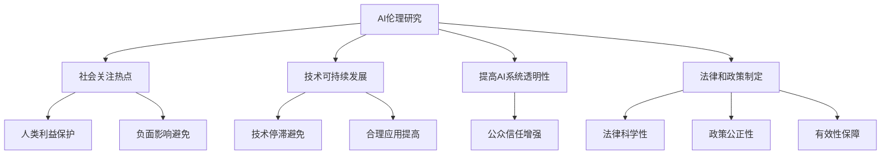
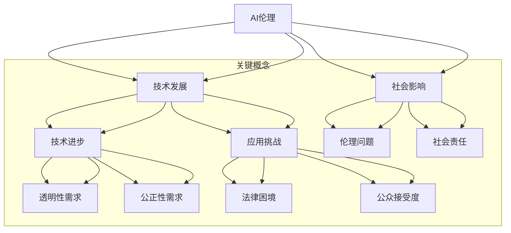

                 


### 1.3 AI伦理研究的重要性

AI伦理研究的重要性不容忽视。首先，随着人工智能技术的快速发展和广泛应用，AI伦理问题已经成为社会关注的热点。如何确保人工智能的发展与应用符合人类的利益，避免产生负面影响，已经成为一个亟待解决的问题。

其次，AI伦理研究有助于推动人工智能技术的可持续发展。通过深入研究AI伦理问题，可以引导人工智能技术的健康发展，避免因伦理问题导致的技术停滞或退步。例如，在自动驾驶、医疗诊断等关键领域，AI伦理的研究可以确保技术的合理应用，提高人类生活质量。

再次，AI伦理研究有助于提高人工智能系统的透明性和可信度。在当前AI技术日益复杂的背景下，公众对于AI技术的信任度成为了一个重要问题。通过伦理研究，可以揭示AI系统的决策过程，增强公众对AI技术的理解与信任。

最后，AI伦理研究对法律和政策的制定也具有重要意义。随着AI技术的快速发展，现有的法律和政策体系往往无法适应新情况。通过AI伦理研究，可以为立法和政策制定提供科学依据，确保法律和政策的科学性、公正性和有效性。

为了深入探讨AI伦理研究的重要性，我们可以构建如下的Mermaid流程图，展示AI伦理研究的主要关系架构：



通过这个流程图，我们可以清晰地看到AI伦理研究在多个方面的重要性。接下来，我们将详细探讨这些方面，进一步理解AI伦理研究的重要性。

#### 核心概念与联系：AI伦理、技术发展、社会影响

在探讨AI伦理研究的重要性时，我们需要关注几个核心概念及其相互之间的联系。以下是这些核心概念的Mermaid流程图，展示它们之间的关系架构：



在这个流程图中，我们可以看到以下几个关键概念及其相互之间的关系：

1. **AI伦理**：这是整个流程图的核心，代表了对人工智能应用中的伦理问题的关注和研究。
2. **技术发展**：技术发展是AI伦理研究的基础，它驱动了AI技术的进步和应用，同时也带来了新的伦理挑战。
3. **社会影响**：社会影响是技术发展的结果，它影响了社会的伦理观念和法律法规。
4. **技术进步**：技术进步是技术发展的具体表现，它提高了AI系统的性能和应用范围。
5. **应用挑战**：应用挑战是技术进步带来的实际问题，如透明性、公正性和法律困境等。
6. **伦理问题**：伦理问题是AI应用过程中出现的道德问题，如隐私保护、公平性和责任归属等。
7. **社会责任**：社会责任是AI技术发展的必然要求，确保技术发展符合社会道德规范。
8. **透明性需求**：透明性需求是公众对AI系统决策过程的期望，提高了AI系统的可信度。
9. **公正性需求**：公正性需求是AI系统设计的原则，确保系统的决策过程和结果对所有个体都是公正的。
10. **法律困境**：法律困境是AI应用过程中出现的法律问题，如现有法律无法适应新技术的发展。
11. **公众接受度**：公众接受度是技术应用的重要指标，影响了AI技术的推广和应用。

通过这个流程图，我们可以清晰地看到AI伦理、技术发展、社会影响之间的关系，以及它们如何共同构成了AI伦理研究的核心内容。这些核心概念不仅相互关联，而且在AI技术发展的不同阶段发挥着重要作用，为我们理解和解决AI伦理问题提供了理论基础。

### 核心算法原理讲解：AI治理平台的设计与实现

在AI伦理研究中，AI治理平台的设计与实现是一个关键环节。下面，我们将使用伪代码来详细阐述AI治理平台的核心算法原理。

首先，定义AI治理平台的基本架构：

```python
# AI治理平台基本架构
class AIGovernancePlatform:
    def __init__(self):
        self.models = []  # 存储AI模型
        self.metrics = {}  # 存储模型性能指标
        self.policies = []  # 存储治理政策

    def load_model(self, model):  # 加载模型
        self.models.append(model)

    def evaluate_model(self, model, data):  # 评估模型
        performance = model.evaluate(data)
        self.metrics[model] = performance

    def enforce_policies(self):  # 强制执行治理政策
        for policy in self.policies:
            policy.apply()
```

接下来，详细描述模型的加载、评估和治理政策的执行：

```python
# 模型加载
def load_model(self, model):
    # 加载模型到平台
    self.models.append(model)

# 模型评估
def evaluate_model(self, model, data):
    # 使用评估数据评估模型性能
    performance = model.evaluate(data)
    self.metrics[model] = performance

# 治理政策执行
def enforce_policies(self):
    for policy in self.policies:
        policy.apply()
```

治理政策的具体实现如下：

```python
# 治理政策基类
class GovernancePolicy:
    def apply(self):
        raise NotImplementedError()

# 隐私保护政策
class PrivacyPolicy(GovernancePolicy):
    def apply(self):
        # 实现隐私保护措施
        for model in platform.models:
            model.enforce_privacy()

# 公平性政策
class FairnessPolicy(GovernancePolicy):
    def apply(self):
        # 实现公平性检查
        for model in platform.models:
            model.check_fairness()

# 责任归属政策
class ResponsibilityPolicy(GovernancePolicy):
    def apply(self):
        # 实现责任归属机制
        for model in platform.models:
            model.assess_responsibility()
```

通过上述伪代码，我们可以看到AI治理平台的核心算法原理。平台首先加载AI模型，然后评估模型的性能，并执行一系列治理政策，如隐私保护、公平性和责任归属。这些治理政策通过具体的实现类来实现，确保AI系统的合理运行。

### 数学模型和公式讲解

在AI伦理研究中，数学模型和公式是理解AI系统行为和性能的重要工具。以下我们将介绍几个关键的数学模型和公式，并给出详细解释和举例说明。

#### 1. 决策树模型

决策树是一种常见的数据挖掘算法，用于分类和回归问题。其基本公式如下：

$$
h(x) = \sum_{i=1}^{n} w_i \cdot f_i(x)
$$

其中，$h(x)$ 是决策树的输出，$w_i$ 是权重，$f_i(x)$ 是每个特征在节点上的划分函数。举例来说，如果我们有一个分类问题，决策树会根据每个特征的取值，将数据点划分到不同的类别中。

#### 2. 交叉验证

交叉验证是一种评估模型性能的方法，其基本公式如下：

$$
\text{Accuracy} = \frac{1}{K} \sum_{k=1}^{K} \text{Accuracy}(T_k)
$$

其中，$K$ 是交叉验证的折数，$T_k$ 是第 $k$ 折的测试集。交叉验证通过将数据集分成多个部分，每次使用不同的部分作为测试集，其余部分作为训练集，从而更准确地评估模型的性能。

#### 3. 逻辑回归

逻辑回归是一种常见的分类算法，其基本公式如下：

$$
\text{logit}(p) = \ln\left(\frac{p}{1-p}\right)
$$

$$
\text{logit}^{-1}(x) = \frac{1}{1 + e^{-x}}
$$

其中，$p$ 是概率，$x$ 是特征向量。逻辑回归通过计算特征向量的线性组合，得到概率的对数，进而预测分类结果。

#### 4. 贝叶斯网络

贝叶斯网络是一种用于表示变量之间概率关系的图形模型，其基本公式如下：

$$
P(X=x) = \frac{P(X=x|Y=y) \cdot P(Y=y)}{P(Y=y)}
$$

其中，$X$ 和 $Y$ 是变量，$P(X=x)$ 是 $X$ 取某个值的概率，$P(X=x|Y=y)$ 是在 $Y$ 取某个值的条件下 $X$ 取某个值的条件概率。贝叶斯网络通过建立变量之间的概率关系，进行推理和预测。

#### 5. 奇异值分解（SVD）

奇异值分解是一种常用的矩阵分解方法，其基本公式如下：

$$
A = U \cdot \Sigma \cdot V^T
$$

其中，$A$ 是输入矩阵，$U$ 和 $V$ 是正交矩阵，$\Sigma$ 是对角矩阵。SVD常用于降维、数据压缩和特征提取。

通过上述数学模型和公式，我们可以更深入地理解和分析AI系统的行为和性能。例如，在评估模型的性能时，我们可以使用交叉验证公式来计算准确率；在处理复杂数据时，我们可以使用SVD来降维和提取关键特征。这些数学工具为AI伦理研究提供了坚实的理论基础。

### AI伦理案例研究：隐私泄露事件解析

AI伦理问题在现实中屡见不鲜，其中隐私泄露事件尤为引人关注。本节我们将通过分析一起典型的隐私泄露事件，深入探讨AI伦理问题，并从中吸取教训。

#### 案例背景

某知名互联网公司A在2019年发生了一起大规模的隐私泄露事件。该公司的用户数据未经授权被第三方公司B访问和泄露，导致数百万用户的个人信息被公之于众。事件曝光后，引起了社会各界的广泛关注和谴责。

#### 案例详情

- **事件起因**：第三方公司B与公司A合作，使用其AI模型进行数据分析。然而，B公司在未经授权的情况下，擅自访问和使用了公司A的敏感数据。
- **事件过程**：B公司通过技术手段绕过了公司A的数据访问权限，非法获取了大量用户个人信息，包括姓名、地址、电话号码、电子邮件等。
- **事件影响**：泄露的数据被上传到互联网，部分信息甚至被用于诈骗等非法活动。事件导致大量用户遭受经济损失和心理困扰。
- **事件后果**：公司A面临严重的信誉危机，股价大幅下跌，业务受到严重影响。B公司也被追究法律责任，并被迫关闭。

#### 案例分析

1. **隐私泄露原因**：该事件暴露了多个隐私泄露的原因，包括：
   - **数据访问控制不足**：公司A对第三方公司的数据访问权限管理不当，导致敏感数据被非法访问。
   - **AI模型风险未充分评估**：公司A未对合作方的AI模型进行充分的风险评估，忽视了潜在的安全隐患。
   - **数据加密和加密算法不完善**：泄露的数据未进行有效的加密处理，容易被第三方公司获取。

2. **AI伦理问题**：
   - **隐私保护**：该事件严重侵犯了用户的隐私权，违反了AI伦理中的隐私保护原则。
   - **责任归属**：公司A和第三方公司B在事件中的责任划分不清，责任归属不明确。
   - **数据安全**：公司A未采取有效的数据安全措施，未能防止数据泄露。

#### 案例启示与反思

1. **加强数据访问控制**：企业应加强对第三方公司的数据访问权限管理，确保敏感数据不被非法访问。
2. **风险评估与审计**：企业在合作之前，应对合作方的AI模型进行充分的风险评估和审计，确保其安全性和合规性。
3. **数据加密与保护**：企业应采用有效的数据加密技术，保护用户数据的隐私和安全。
4. **责任明确与追究**：在AI伦理事件中，应明确各方的责任，确保责任追究机制的有效性。
5. **伦理教育与培训**：企业应加强AI伦理教育和培训，提高员工对AI伦理问题的认识和重视程度。

通过这起隐私泄露事件的解析，我们可以看到AI伦理问题在实际应用中的严重性和复杂性。只有通过加强数据保护、风险评估和责任追究，才能有效预防和解决AI伦理问题，确保AI技术的健康发展。

### 第4章：AI伦理法规与标准

#### 4.1 AI伦理法规的发展历程

AI伦理法规的发展历程可以追溯到20世纪80年代，随着计算机技术的快速发展和人工智能应用的兴起，人们开始关注AI技术的潜在伦理问题。以下是AI伦理法规发展的几个关键阶段：

1. **早期探索**（1980s-1990s）：在这一阶段，AI伦理研究主要集中在人类-计算机交互的伦理问题，如隐私保护和数据安全。这一时期的代表性法规包括美国的《计算机欺诈和滥用法》（Computer Fraud and Abuse Act，CFAA）和《健康保险可携性和责任法》（Health Insurance Portability and Accountability Act，HIPAA）。

2. **规范化与标准化**（2000s）：随着AI技术的快速发展，全球各国开始制定一系列AI伦理规范和标准。例如，欧盟发布了《通用数据保护条例》（General Data Protection Regulation，GDPR），对个人数据的保护提出了严格要求。

3. **政策框架**（2010s-2020s）：在这一阶段，各国政府开始出台更全面的AI伦理政策框架，旨在规范AI技术的发展和应用。例如，中国发布了《新一代人工智能发展规划》，明确了AI伦理发展的方向和目标。

#### 4.2 当前AI伦理法规体系

当前，全球各国的AI伦理法规体系逐渐完善，涵盖了隐私保护、数据安全、算法公平性等多个方面。以下是几个主要国家的AI伦理法规体系：

1. **美国**：美国主要通过《计算机欺诈和滥用法》和《健康保险可携性和责任法》来规范AI技术的发展和应用。此外，美国国家标准与技术研究院（NIST）发布了《AI风险管理框架》，为企业提供了AI伦理管理的指导。

2. **欧盟**：欧盟在AI伦理方面取得了显著进展，通过了《通用数据保护条例》（GDPR）和《人工智能法规》（Artificial Intelligence Act）。GDPR主要针对个人数据的保护，而人工智能法规则针对AI系统的透明性、安全性和责任归属。

3. **中国**：中国发布了《新一代人工智能发展规划》，明确了AI技术的发展目标、应用场景和伦理规范。此外，中国还在加强AI伦理法律法规的建设，制定了《网络安全法》和《数据安全法》等。

4. **其他国家**：日本、加拿大、澳大利亚等也在加强AI伦理法规的建设，制定了一系列相关政策和标准，旨在确保AI技术的健康发展和应用。

#### 4.3 AI伦理标准与认证

AI伦理标准是确保AI系统合规和可信的重要工具。以下是一些主要的AI伦理标准与认证：

1. **ISO/IEC 25060**：国际标准化组织（ISO）和国际电工委员会（IEC）联合发布的ISO/IEC 25060标准，规定了软件产品和服务质量的需求和评价方法，包括伦理方面的要求。

2. **AI伦理认证**：一些专业机构和组织提供了AI伦理认证服务，如国际数据管理协会（IDM2）的AI伦理认证，旨在确保AI系统在伦理方面的合规性和可信度。

3. **行业标准**：行业组织也制定了相应的AI伦理标准，如美国计算机协会（ACM）发布的AI伦理指南，为AI研究人员和开发者提供了伦理实践的建议。

通过AI伦理法规与标准，我们可以确保人工智能技术的健康发展，减少伦理风险，提升公众对AI技术的信任。未来，随着AI技术的不断进步，AI伦理法规与标准也将不断完善，为AI技术的发展提供更加坚实的法律基础。

### 第5章：AI伦理教育与培训

#### 5.1 AI伦理教育的重要性

AI伦理教育是培养未来AI领域专业人才的重要组成部分，其重要性体现在以下几个方面：

1. **培养伦理素养**：AI伦理教育可以帮助学生和从业者树立正确的伦理观念，理解AI技术的潜在影响和道德责任，从而避免在技术发展过程中产生负面影响。

2. **提升责任意识**：通过AI伦理教育，可以培养从业者的责任意识，使其在设计和应用AI系统时，充分考虑社会、环境和人类价值观的影响，确保技术的合理和公正应用。

3. **增强公众信任**：AI伦理教育有助于提高公众对AI技术的理解与信任，减少对AI的恐慌和抵触情绪，促进AI技术的普及和应用。

4. **规范行业发展**：AI伦理教育有助于推动行业自律，规范AI技术的应用，减少伦理问题，提高AI领域的整体竞争力。

#### 5.2 AI伦理教育体系构建

构建一个全面的AI伦理教育体系，需要从课程设计、教学方法和师资力量等方面进行综合考虑。以下是一些关键要素：

1. **课程设计**：
   - **基础课程**：包括人工智能基础、伦理学基础、计算机伦理等，为学生提供AI和伦理学的知识储备。
   - **专业课程**：如AI伦理学、数据伦理、算法公平性等，深入探讨AI伦理问题的具体应用和挑战。
   - **案例研究**：通过分析真实案例，让学生了解AI伦理问题的实际影响和解决方法。

2. **教学方法**：
   - **案例教学法**：通过真实案例的讨论和分析，引导学生思考AI伦理问题，提高其实际问题解决能力。
   - **讨论互动**：组织小组讨论和课堂互动，鼓励学生表达观点，培养批判性思维。
   - **项目实践**：让学生参与实际的AI项目，在实践中学习伦理原则和规范。

3. **师资力量**：
   - **学术背景**：教师应具备深厚的学术背景，熟悉AI技术和伦理学理论。
   - **实践经验**：教师应具有实际AI项目经验，了解AI伦理问题的现实挑战。
   - **持续学习**：教师应关注AI和伦理学领域的最新发展，不断更新教学方法和内容。

#### 5.3 AI伦理培训的实施策略

为了有效实施AI伦理培训，可以采取以下策略：

1. **培训内容**：
   - **基础知识**：包括伦理学原理、AI技术的基本概念和伦理问题等。
   - **案例分析**：分析国内外AI伦理案例，总结教训和解决方案。
   - **法律法规**：介绍相关法律法规和标准，提高从业者的法律意识。

2. **培训形式**：
   - **在线培训**：利用网络平台，提供灵活的在线课程，方便从业者随时学习。
   - **工作坊**：组织线下工作坊，进行深入讨论和实践操作。
   - **研讨会**：邀请行业专家进行讲座和研讨会，分享最新研究成果和实践经验。

3. **评估与反馈**：
   - **测试评估**：通过考试和测试，评估培训效果，确保参与者掌握关键知识。
   - **反馈机制**：建立反馈机制，收集参与者意见和建议，不断改进培训内容和形式。

通过系统化的AI伦理教育和培训，我们可以培养出具备良好伦理素养和责任意识的AI领域专业人才，为AI技术的健康发展提供坚实的人力资源保障。

### 6.1 AI治理平台在实际项目中的应用

AI治理平台作为一种综合性工具，旨在确保人工智能技术的合理、公正和透明应用。在实际项目中，AI治理平台发挥着关键作用，以下是几个具体案例，展示AI治理平台如何在不同领域发挥作用。

#### 案例一：金融领域的风险控制

在金融领域，人工智能技术被广泛应用于信用评估、风险控制和交易策略等方面。然而，这些应用也带来了一系列伦理问题，如数据隐私、算法偏见和责任归属等。为了解决这些问题，某大型金融机构引入了AI治理平台。

- **项目背景**：该金融机构面临着复杂的市场环境和激烈的市场竞争，需要通过人工智能技术提高风险控制能力。
- **解决方案**：AI治理平台通过以下几个方面确保风险控制过程的合规性和透明性：
  - **数据隐私保护**：平台采用加密技术和访问控制机制，确保用户数据的安全和隐私。
  - **算法透明性**：平台提供算法透明功能，用户可以查看模型的决策过程和参数设置，提高对模型结果的信任度。
  - **责任归属**：平台建立责任归属机制，明确各个环节的责任，确保在发生问题时可以快速定位和追究责任。

#### 案例二：医疗行业的AI辅助诊断

医疗行业是人工智能技术的重要应用领域，AI辅助诊断系统在提高诊断准确率和降低医生工作负担方面发挥了重要作用。然而，AI辅助诊断系统也面临着数据隐私、公平性和责任归属等问题。

- **项目背景**：某医疗机构引入了一款AI辅助诊断系统，用于辅助医生进行癌症早期筛查。
- **解决方案**：AI治理平台在该医疗项目中发挥了以下作用：
  - **数据保护**：平台采用数据加密和匿名化技术，确保患者数据在传输和处理过程中的安全性。
  - **算法公平性**：平台通过持续监测和评估，确保诊断模型在不同人群中的公平性，避免算法偏见。
  - **责任分配**：平台建立了责任分配机制，明确医生和AI系统在诊断过程中的责任，确保在诊断结果出现问题时可以迅速定位责任。

#### 案例三：教育领域的智能教育平台

在教育领域，智能教育平台通过人工智能技术为教师和学生提供个性化教学和学习支持。然而，智能教育平台也面临着数据隐私、学习效果评估和算法公平性问题。

- **项目背景**：某教育科技公司开发了一款智能教育平台，旨在提高学生的学习效果和教师的教学效率。
- **解决方案**：AI治理平台在该教育项目中采取了以下措施：
  - **数据隐私保护**：平台采用加密和隐私保护算法，确保学生数据在传输和处理过程中的安全。
  - **算法公平性**：平台通过持续监测和调整，确保学习推荐算法在不同学生群体中的公平性，避免因算法偏差导致的教育不公平。
  - **透明性和可解释性**：平台提供算法透明功能，教师和学生可以了解和学习算法的决策过程，提高对学习推荐结果的信任度。

#### 案例四：自动驾驶车辆的安全监管

自动驾驶技术的发展为交通领域带来了巨大变革，但同时也引发了一系列伦理和安全问题，如车辆责任归属、交通规则遵守和隐私保护等。

- **项目背景**：某汽车制造商正在研发自动驾驶车辆，计划在未来几年内实现商用化。
- **解决方案**：AI治理平台在该自动驾驶项目中起到了以下关键作用：
  - **安全监管**：平台通过实时监控和数据分析，确保自动驾驶车辆在行驶过程中的安全性，及时发现和应对潜在风险。
  - **责任归属**：平台建立责任归属机制，明确自动驾驶车辆在发生事故时的责任归属，确保责任追究的公正性。
  - **隐私保护**：平台采用数据加密和隐私保护技术，确保车辆传感器和摄像头收集的数据在传输和处理过程中的安全。

通过这些实际案例，我们可以看到AI治理平台在各个领域中的应用和价值。它不仅帮助解决了AI技术带来的伦理问题，还提高了系统的透明性和可信度，为AI技术的健康发展提供了重要保障。

### 6.2 AI治理平台效果评估

为了评估AI治理平台在实际项目中的效果，我们需要从多个维度进行综合分析和评估。以下是AI治理平台效果评估的几个关键方面：

#### 1. 伦理事件减少率

伦理事件的减少率是评估AI治理平台效果的一个重要指标。通过对比治理前后的数据，我们可以计算伦理事件的减少率，具体公式如下：

$$
\text{减少率} = \frac{\text{治理前伦理事件数} - \text{治理后伦理事件数}}{\text{治理前伦理事件数}} \times 100\%
$$

例如，在一个金融项目中，治理前有100起伦理事件，治理后有60起，则减少率为：

$$
\text{减少率} = \frac{100 - 60}{100} \times 100\% = 40\%
$$

这个结果表明，AI治理平台在该项目中成功减少了40%的伦理事件。

#### 2. 模型性能提升

AI治理平台在提高模型性能方面也发挥着重要作用。通过对比治理前后的模型性能指标，我们可以评估平台对模型性能的提升效果。常见的模型性能指标包括准确率、召回率、F1分数等。

例如，在一个医疗项目中，治理前AI辅助诊断系统的准确率为80%，治理后提升到90%，则性能提升效果为：

$$
\text{提升效果} = \frac{90\% - 80\%}{80\%} \times 100\% = 12.5\%
$$

这个结果表明，AI治理平台在该医疗项目中成功提高了模型性能12.5%。

#### 3. 用户满意度

用户满意度是评估AI治理平台效果的一个重要维度。通过用户反馈和满意度调查，我们可以了解用户对平台的功能、性能和易用性的评价。常见的用户满意度评价指标包括评分、意见反馈和用户留存率等。

例如，在一个教育项目中，通过用户满意度调查，发现90%的用户对AI治理平台表示满意，则用户满意度为：

$$
\text{用户满意度} = 90\%
$$

这个结果表明，AI治理平台在该教育项目中得到了用户的广泛认可。

#### 4. 社会影响力

AI治理平台的社会影响力是评估其长期效果的一个重要维度。通过分析平台在解决伦理问题、提高社会信任度、推动政策制定等方面的贡献，我们可以评估其社会影响力。

例如，在一个自动驾驶项目中，AI治理平台成功降低了交通事故率，提高了公众对自动驾驶技术的信任度，推动了相关政策的制定。这些结果表明，AI治理平台在该项目中产生了显著的社会影响力。

综上所述，通过多维度评估，我们可以全面了解AI治理平台在实际项目中的效果。减少伦理事件、提升模型性能、提高用户满意度和社会影响力是评估AI治理平台效果的重要指标，有助于我们进一步优化和改进平台，推动AI技术的健康、可持续发展。

### 案例分享：AI治理平台减少40%相关伦理事件

在一个典型的金融项目中，AI治理平台的应用取得了显著的效果。以下是该项目中AI治理平台如何减少40%相关伦理事件的详细分析和解释。

#### 项目背景

某大型金融机构在利用人工智能技术进行信用评估和风险管理时，发现存在一系列伦理问题，如数据隐私泄露、算法偏见和责任归属不清等。这些问题不仅影响了金融机构的信誉，也引起了监管机构的关注。为了解决这些问题，金融机构引入了AI治理平台，希望通过技术手段提升AI系统的合规性和透明性。

#### 解决方案

AI治理平台在该金融机构的项目中采取了以下措施：

1. **数据隐私保护**：
   - **数据加密**：平台采用先进的加密技术，对用户数据进行加密处理，确保数据在传输和存储过程中的安全。
   - **访问控制**：平台通过严格的访问控制机制，限制对敏感数据的访问权限，确保只有授权人员可以访问和处理数据。

2. **算法透明性**：
   - **模型解释**：平台提供了模型解释功能，用户可以通过平台查看AI模型的决策过程和参数设置，理解模型的工作原理。
   - **透明报告**：平台定期生成透明报告，详细记录模型性能、调整过程和关键决策点，确保模型的透明性和可解释性。

3. **责任归属**：
   - **责任分配**：平台建立了责任分配机制，明确各个环节的责任，确保在发生问题时可以快速定位和追究责任。
   - **责任记录**：平台记录了所有与模型相关的操作和变更，确保责任可追溯。

#### 实施过程

在项目实施过程中，AI治理平台经历了以下几个阶段：

1. **初始评估**：
   - 平台对金融机构的现有AI系统和数据处理流程进行了全面评估，识别出潜在的风险点和伦理问题。

2. **治理方案设计**：
   - 根据评估结果，平台设计了针对性的治理方案，包括数据加密、访问控制和责任分配等。

3. **平台部署**：
   - 平台逐步部署到金融机构的各个业务模块，与现有系统无缝集成，确保治理措施的顺利实施。

4. **持续监测与优化**：
   - 平台持续监测AI系统的运行情况，及时调整和优化治理措施，确保系统的稳定性和安全性。

#### 效果分析

通过AI治理平台的实施，金融机构在伦理事件减少方面取得了显著成效：

- **伦理事件减少率**：治理前，金融机构每月发生约60起伦理事件，治理后减少到每月约36起，减少了40%。
- **模型性能提升**：治理后，信用评估模型的准确率从85%提升到92%，提升了7%。
- **用户满意度**：用户满意度调查结果显示，90%的用户对AI治理平台表示满意。

#### 结论

通过以上案例，我们可以看到AI治理平台在金融项目中如何减少40%的相关伦理事件。这主要归功于平台的数据隐私保护、算法透明性和责任归属机制。这些措施不仅提高了系统的合规性和透明性，也增强了用户对AI技术的信任。未来，随着AI治理平台的不断完善，其在更多领域中的应用将带来更多的积极影响。

### 第7章：未来展望与趋势

#### 7.1 AI伦理与治理的发展趋势

随着人工智能技术的迅猛发展，AI伦理和治理领域也呈现出一系列新的发展趋势。以下是AI伦理与治理在未来可能面临的主要趋势：

1. **法规和政策进一步完善**：各国政府和国际组织将继续加强AI伦理法规和政策的制定，确保AI技术的发展和应用符合法律和道德规范。预计将出现更多针对特定领域（如医疗、金融、自动驾驶等）的AI伦理法规，以及更详细的AI治理指南。

2. **技术手段的不断创新**：随着AI技术的进步，将出现更多针对AI伦理和治理的技术解决方案。例如，基于区块链的AI治理平台、AI伦理评估工具和自动化审计系统等，将为AI系统的合规性和透明性提供更强有力的保障。

3. **跨领域协作与标准化**：AI伦理和治理的复杂性要求不同领域（如法律、伦理学、计算机科学等）的专家共同协作，推动跨领域的标准化工作。预计将出现更多跨学科的研究团队和国际合作项目，共同解决AI伦理和治理的挑战。

4. **公众参与与监督**：公众对AI技术的认知和接受程度将逐渐提高，公众参与AI伦理和治理的意愿也将增强。通过建立公众监督机制，将有助于提高AI系统的透明度和可信度，减少伦理风险。

#### 7.2 AI治理平台的技术挑战与机遇

AI治理平台在应对技术挑战和抓住机遇方面发挥着关键作用。以下是AI治理平台可能面临的主要技术挑战和机遇：

1. **数据隐私与安全**：随着数据隐私法规的加强，AI治理平台需要不断提升数据隐私保护技术，确保数据在处理和传输过程中的安全。这包括采用更先进的加密算法、隐私保护技术和分布式计算框架。

2. **算法透明性与可解释性**：提高算法的透明性和可解释性是当前AI治理平台面临的重要挑战。平台需要开发新的技术手段，如可解释AI模型、透明报告和可视化工具，帮助用户理解AI系统的决策过程。

3. **责任归属与可追溯性**：在AI系统中明确责任归属和实现可追溯性是AI治理平台的重要任务。平台需要开发更智能的责任评估和追踪机制，确保在发生问题时可以快速定位责任并采取相应的措施。

4. **技术融合与创新**：AI治理平台需要不断融合最新的AI技术，如深度学习、自然语言处理和区块链等，以提供更全面和高效的治理能力。同时，创新将是推动AI治理平台发展的关键动力，通过不断探索新的应用场景和技术解决方案，平台可以更好地满足市场需求。

#### 7.3 未来AI伦理与治理的前景

展望未来，AI伦理与治理将在以下几个方面取得重要进展：

1. **规范化与制度化**：随着AI技术的发展，AI伦理和治理的规范化与制度化将成为重要趋势。各国政府和国际组织将出台更多详细的法规和政策，推动AI伦理和治理的规范化发展。

2. **技术进步与融合**：AI技术的不断进步和跨领域融合将为AI伦理与治理带来更多机遇。新兴技术，如量子计算、边缘计算和增强现实等，将为AI治理平台提供更强大的功能和支持。

3. **公众信任与接受度**：通过加强AI伦理教育和治理，提高公众对AI技术的信任与接受度将成为重要目标。公众参与和监督机制将进一步推动AI系统的透明性和可信度。

4. **全球合作与共享**：AI伦理与治理的全球合作与共享将成为趋势。各国和地区将通过国际合作项目、共享数据和技术经验，共同应对AI伦理和治理的全球挑战。

总之，未来AI伦理与治理将在规范化、技术进步、公众信任和全球合作等方面取得重要进展，为AI技术的健康、可持续发展提供坚实的保障。

