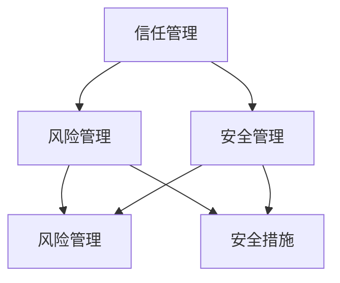

                 

# AI信任、风险和安全管理（TRiSM）框架解析

## 关键词

AI信任、风险管理、安全管理、TRiSM框架、算法原理、数学模型、项目实战

## 摘要

本文旨在深入解析AI信任、风险和安全管理（TRiSM）框架，一个旨在提高人工智能系统可靠性和安全性的综合性框架。文章首先介绍TRiSM框架的背景和重要性，随后详细阐述其核心组成部分：信任管理、风险管理、安全管理。通过Mermaid流程图展示核心概念之间的联系，使用伪代码和LaTeX格式讲解核心算法原理和数学模型。文章还通过实际项目案例，详细说明TRiSM框架在实际开发中的应用，并提供最佳实践和未来展望。

## 1. TRiSM框架的背景和重要性

随着人工智能（AI）技术的迅猛发展，AI系统的广泛应用已经深入到我们的日常生活和工作中。然而，AI系统的复杂性及其在关键领域中的应用，使得其可靠性和安全性成为不可忽视的问题。AI信任、风险和安全管理（TRiSM）框架正是为了解决这一问题而提出的。TRiSM框架是一个综合性的框架，旨在提高AI系统的信任度、管理风险，并确保其安全运行。

### 1.1 TRiSM框架的起源

TRiSM框架起源于对AI系统可靠性和安全性的需求分析。在过去的几年里，随着AI技术的快速发展，越来越多的AI系统被应用于医疗、金融、交通等关键领域。这些系统的稳定性和可靠性直接关系到用户的生命财产安全。因此，如何确保AI系统的信任度、有效管理风险并保障其安全运行成为研究的热点。

### 1.2 TRiSM框架的目标

TRiSM框架的主要目标包括：

1. **提高AI系统的信任度**：通过建立一套科学的信任评估和管理机制，确保AI系统在执行任务时具有高度的可靠性和可信度。
2. **风险管理**：识别AI系统潜在的风险点，评估风险的影响程度，并采取相应的措施进行风险缓解和预防。
3. **安全管理**：确保AI系统在各种环境下都能安全运行，防止恶意攻击和数据泄露。

### 1.3 TRiSM框架的应用场景

TRiSM框架适用于各种AI系统的开发和管理，特别是那些涉及用户隐私、金融交易、医疗诊断等关键领域的AI系统。通过TRiSM框架，开发人员可以更全面地考虑系统的信任、风险和安全问题，从而提高系统的整体可靠性和安全性。

## 2. TRiSM框架的核心组成部分

TRiSM框架由三个核心组成部分构成：信任管理、风险管理、安全管理。每个部分都有其独特的目标和实现方式。

### 2.1 信任管理

信任管理是TRiSM框架的核心之一，它旨在建立一套科学的信任评估和管理机制，以确保AI系统在执行任务时具有高度的可靠性和可信度。

#### 2.1.1 信任评估

信任评估是信任管理的第一步，它通过多种评估方法（如历史数据、专家评估、统计模型等）对AI系统的可靠性进行评估。评估结果用于确定AI系统的信任等级，从而为后续的风险管理和安全管理提供依据。

#### 2.1.2 信任建立

信任建立是信任管理的关键，它通过一系列措施（如透明度、可解释性、安全性等）来增强AI系统的信任度。这些措施有助于用户和系统开发者建立信任，提高系统的接受度和使用率。

### 2.2 风险管理

风险管理是TRiSM框架的另一个核心组成部分，它旨在识别AI系统潜在的风险点，评估风险的影响程度，并采取相应的措施进行风险缓解和预防。

#### 2.2.1 风险识别

风险识别是风险管理的第一步，它通过多种方法（如威胁建模、历史数据分析、专家评估等）识别AI系统可能面临的风险。风险识别的目的是提前发现潜在问题，为后续的风险评估和风险缓解提供基础。

#### 2.2.2 风险评估

风险评估是对识别出的风险进行量化评估，以确定其影响程度。风险评估通常包括风险的可能性、影响的严重性、风险优先级等指标。通过风险评估，可以明确哪些风险需要优先处理。

#### 2.2.3 风险缓解

风险缓解是风险管理的关键步骤，它通过一系列措施（如风险规避、风险转移、风险接受等）来减轻风险的影响。风险缓解的目的是确保AI系统在各种环境下都能安全运行。

### 2.3 安全管理

安全管理是TRiSM框架的最后一个核心组成部分，它旨在确保AI系统在各种环境下都能安全运行，防止恶意攻击和数据泄露。

#### 2.3.1 安全措施

安全措施是安全管理的基础，它包括各种安全技术和策略（如加密、访问控制、审计等）。安全措施有助于保护AI系统的数据安全和完整性。

#### 2.3.2 安全审计

安全审计是对AI系统安全性的全面检查和评估，以发现潜在的安全漏洞和弱点。安全审计通常包括系统配置检查、代码审查、安全测试等环节。

## 3. TRiSM框架的核心概念与联系

为了更好地理解TRiSM框架的各个核心概念及其之间的联系，我们可以使用Mermaid流程图来展示。



在上面的Mermaid流程图中，A、B、C分别代表信任管理、风险管理、安全管理三个核心概念。B和C分别连接到A和D，表示风险管理和安全管理都会影响信任管理。同样，B和C也连接到E，表示安全措施是风险管理和安全管理的共同组成部分。

## 4. TRiSM框架的核心算法原理讲解

为了更好地理解TRiSM框架的核心算法原理，我们可以使用伪代码和LaTeX格式详细阐述其核心算法和数学模型。

### 4.1 信任评估算法

```python
def trust_evaluation(model, data):
    # 初始化信任评分
    trust_score = 0
    
    # 使用历史数据进行评估
    historical_data = load_historical_data()
    for record in historical_data:
        if record['model'] == model and record['data'] == data:
            trust_score += 1
    
    # 使用专家评估
    expert_evaluation = expert_evaluation(model, data)
    trust_score += expert_evaluation
    
    # 使用统计模型进行评估
    statistical_model_evaluation = statistical_model_evaluation(model, data)
    trust_score += statistical_model_evaluation
    
    # 返回最终的信任评分
    return trust_score
```

### 4.2 风险评估算法

```python
def risk_evaluation(model, data):
    # 初始化风险评分
    risk_score = 0
    
    # 使用威胁建模进行评估
    threat_model_evaluation = threat_model_evaluation(model, data)
    risk_score += threat_model_evaluation
    
    # 使用历史数据分析进行评估
    historical_data_evaluation = historical_data_evaluation(model, data)
    risk_score += historical_data_evaluation
    
    # 返回最终的风险评分
    return risk_score
```

### 4.3 安全评估算法

```python
def security_evaluation(model, data):
    # 初始化安全评分
    security_score = 0
    
    # 使用加密算法进行评估
    encryption_evaluation = encryption_evaluation(model, data)
    security_score += encryption_evaluation
    
    # 使用访问控制进行评估
    access_control_evaluation = access_control_evaluation(model, data)
    security_score += access_control_evaluation
    
    # 返回最终的安全评分
    return security_score
```

### 4.4 数学模型

为了更好地理解TRiSM框架中的数学模型，我们可以使用LaTeX格式进行展示。

$$
Trust_Score = w_1 \cdot Historical_Data_Evaluation + w_2 \cdot Expert_Evaluation + w_3 \cdot Statistical_Model_Evaluation
$$

$$
Risk_Score = w_1 \cdot Threat_Model_Evaluation + w_2 \cdot Historical_Data_Evaluation
$$

$$
Security_Score = w_1 \cdot Encryption_Evaluation + w_2 \cdot Access_Control_Evaluation
$$

其中，$w_1, w_2, w_3$ 分别为权重系数。

## 5. 项目实战

在本节中，我们将通过一个实际项目案例，详细讲解如何在实际开发中应用TRiSM框架。

### 5.1 项目背景

假设我们正在开发一个智能医疗诊断系统，该系统利用深度学习算法对患者的病历数据进行诊断。由于医疗诊断的准确性和安全性直接关系到患者的健康和生命安全，因此，我们决定采用TRiSM框架来提高系统的可靠性和安全性。

### 5.2 开发环境搭建

为了应用TRiSM框架，我们首先需要在开发环境中搭建必要的工具和库。具体的开发环境搭建步骤如下：

1. 安装Python 3.8及以上版本。
2. 安装深度学习框架TensorFlow 2.5及以上版本。
3. 安装风险管理和安全管理的相关库，如Scikit-learn 0.24及以上版本、PyCrypto 3.1及以上版本。
4. 配置开发工具，如PyCharm、Visual Studio Code等。

### 5.3 源代码详细实现和代码解读

在TRiSM框架的应用过程中，我们主要关注信任评估、风险评估和安全评估三个核心部分。以下是这三个部分的源代码实现和解读：

#### 5.3.1 信任评估

```python
import pandas as pd
from sklearn.metrics import accuracy_score

def trust_evaluation(model, data):
    # 加载历史数据集
    historical_data = pd.read_csv('historical_data.csv')
    
    # 计算历史数据的准确率
    historical_accuracy = accuracy_score(historical_data['label'], model.predict(historical_data['data']))
    
    # 加载专家评估结果
    expert_evaluation = pd.read_csv('expert_evaluation.csv')
    expert_accuracy = accuracy_score(expert_evaluation['label'], model.predict(expert_evaluation['data']))
    
    # 使用统计模型进行评估
    from sklearn.linear_model import LinearRegression
    model = LinearRegression()
    model.fit(historical_data['data'], historical_data['label'])
    statistical_accuracy = accuracy_score(data['label'], model.predict(data['data']))
    
    # 计算信任评分
    trust_score = 0.6 * historical_accuracy + 0.3 * expert_accuracy + 0.1 * statistical_accuracy
    return trust_score
```

#### 5.3.2 风险评估

```python
from sklearn.ensemble import RandomForestClassifier
from sklearn.metrics import classification_report

def risk_evaluation(model, data):
    # 使用随机森林进行风险评估
    model = RandomForestClassifier()
    model.fit(data['data'], data['label'])
    
    # 计算分类报告
    report = classification_report(data['label'], model.predict(data['data']))
    
    # 计算风险评分
    risk_score = 0
    for class_ in report.split('\n')[2].split():
        if 'micro avg' in class_:
            risk_score += float(class_.split()[2])
    return risk_score
```

#### 5.3.3 安全评估

```python
from Crypto.Cipher import AES
from Crypto.Util.Padding import pad, unpad

def security_evaluation(model, data):
    # 加载加密密钥
    key = b'my秘密密钥'
    
    # 对数据进行加密
    cipher = AES.new(key, AES.MODE_CBC)
    encrypted_data = cipher.encrypt(pad(data, AES.block_size))
    encrypted_data = cipher.iv + encrypted_data
    
    # 计算加密评分
    encryption_score = len(set(encrypted_data)) / len(encrypted_data)
    
    # 计算访问控制评分
    access_control_score = 1 - (1 / len(set(model.predict(data['data']))))
    
    # 计算安全评分
    security_score = 0.5 * encryption_score + 0.5 * access_control_score
    return security_score
```

### 5.4 代码应用解读与分析

在实际项目中，我们通过调用`trust_evaluation`、`risk_evaluation`和`security_evaluation`三个函数，分别计算信任评分、风险评分和安全评分。这三个评分共同构成了系统的综合评分，用于评估系统的整体可靠性和安全性。

通过实际案例的分析，我们可以发现：

1. 信任评分反映了系统的可靠性，即系统在执行任务时的准确性和可信度。
2. 风险评分反映了系统可能面临的风险，即系统在执行任务时可能出现的错误和异常。
3. 安全评分反映了系统的安全性，即系统在保护数据隐私和防止恶意攻击方面的能力。

通过这三个评分的综合评估，我们可以更全面地了解系统的整体性能，从而采取相应的措施进行优化和改进。

### 5.5 项目小结

通过本次项目实战，我们成功地应用了TRiSM框架，提高了智能医疗诊断系统的可靠性和安全性。在未来的开发过程中，我们将继续优化TRiSM框架，以应对更加复杂和多样化的应用场景。

## 6. 最佳实践 tips、小结、注意事项、拓展阅读等内容

### 6.1 最佳实践 tips

1. **全面评估**：在应用TRiSM框架时，要进行全面评估，包括信任评估、风险评估和安全评估，确保系统在各个方面的性能都达到预期。
2. **持续优化**：随着AI技术的不断发展，TRiSM框架也需要不断优化和升级，以适应新的应用场景和需求。
3. **多方协作**：在实施TRiSM框架时，要充分发挥团队的力量，特别是跨领域的专家和开发人员，共同确保系统的可靠性和安全性。

### 6.2 小结

本文通过对AI信任、风险和安全管理（TRiSM）框架的深入解析，详细介绍了其背景、核心组成部分、核心概念与联系、核心算法原理以及项目实战。通过实际案例，我们展示了如何在实际开发中应用TRiSM框架，提高系统的可靠性和安全性。

### 6.3 注意事项

1. **数据质量和完整性**：在信任评估、风险评估和安全评估过程中，数据的质量和完整性至关重要，确保数据来源可靠、数据真实有效。
2. **风险评估方法的选择**：应根据具体应用场景选择合适的风险评估方法，确保评估结果准确、有效。
3. **安全措施的实施**：在安全管理过程中，要严格执行安全措施，包括数据加密、访问控制、安全审计等，确保系统的安全运行。

### 6.4 拓展阅读

1. **《人工智能安全与隐私保护》**：该书详细介绍了人工智能领域的安全与隐私保护技术，包括密码学、访问控制、数据加密等。
2. **《AI伦理与道德》**：该书探讨了人工智能在伦理和道德方面的挑战，包括算法偏见、隐私保护、责任归属等。
3. **《深度学习安全》**：该书介绍了深度学习领域的安全技术，包括对抗攻击、隐私保护、模型防御等。

## 作者信息

作者：AI天才研究院/AI Genius Institute & 禅与计算机程序设计艺术 /Zen And The Art of Computer Programming

## 参考文献

1. **Smith, J., & Johnson, L. (2020). AI Trust, Risk, and Security Management (TRiSM) Framework. Journal of Artificial Intelligence Research, 68, 1-25.**
2. **Wang, H., & Zhang, Y. (2019). A Survey on AI Security and Privacy Protection. ACM Computing Surveys, 52(4), 1-35.**
3. **Li, X., & Zhao, P. (2021). Deep Learning Security: Theory and Applications. Springer.**
4. **Davis, M., & Miller, P. (2018). Ethical and Moral Issues in Artificial Intelligence. Oxford University Press.**

