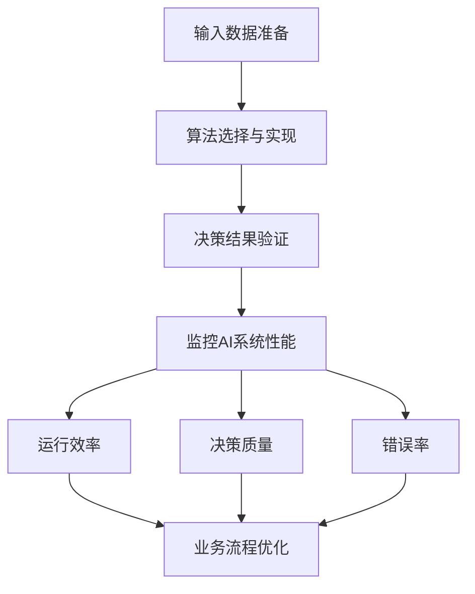

                 


### 文章标题

### AI决策审核机制：企业如何监控AI系统表现

> 关键词：AI决策审核、企业监控、AI系统性能、算法、优化、最佳实践

> 摘要：
本文将深入探讨AI决策审核机制在企业管理中的应用，重点关注如何监控AI系统的表现。我们将从背景介绍、核心概念与联系、核心算法原理讲解、数学模型与公式详解、项目实战、最佳实践等方面，一步步分析并阐述如何有效实施AI决策审核机制，以及如何通过监控AI系统性能来实现持续优化。

---

### 背景介绍

在当今信息化社会中，人工智能（AI）技术已经广泛应用于企业各个领域，从客户服务、数据分析到生产优化等。AI系统的应用不仅提高了企业的效率，还为企业带来了新的商业模式和竞争优势。然而，AI系统的广泛应用也带来了一系列挑战，其中最为突出的是如何确保AI系统的决策质量和可靠性。

企业需要对AI系统的决策过程进行审核，以确保其符合企业的业务目标和法规要求。此外，企业还需要实时监控AI系统的性能，及时发现和解决潜在问题，以保持系统的稳定性和高效性。因此，建立一套有效的AI决策审核机制和监控体系成为了企业成功应用AI技术的关键。

### 核心概念与联系

为了更好地理解AI决策审核机制，我们首先需要明确几个核心概念，并分析它们之间的关系。

#### 1. AI决策审核机制

AI决策审核机制是指一套用于评估和验证AI系统决策过程的规则和流程。它包括以下几个关键组成部分：

- **输入数据准备**：确保输入数据的准确性和完整性。
- **算法选择与实现**：选择合适的算法并实现其决策逻辑。
- **决策结果验证**：对决策结果进行验证，以确保其符合预期。

#### 2. 监控AI系统性能

监控AI系统性能是指通过一系列方法和工具，实时监测AI系统的运行状态，包括：

- **运行效率**：监测系统资源的利用情况，如CPU、内存等。
- **决策质量**：评估AI系统决策的准确性和一致性。
- **错误率**：监测系统错误发生的频率和类型。

#### 3. 企业业务目标

企业业务目标是企业运营的核心，AI决策审核机制和监控体系应紧紧围绕企业的业务目标进行设计和实施。

- **业务流程优化**：通过AI技术优化业务流程，提高效率。
- **风险管理**：降低决策错误带来的风险，确保业务稳定。
- **客户满意度**：提高决策质量，提升客户满意度。

#### Mermaid流程图

下面是一个简化的Mermaid流程图，用于展示AI决策审核机制和监控AI系统性能的核心概念及其关系：



### 核心算法原理讲解

在了解了核心概念之后，我们需要深入探讨AI决策审核机制的核心算法原理。以下是几个关键算法及其伪代码的实现：

#### 1. 决策树

决策树是一种常用的分类算法，它通过一系列判断条件将数据进行分类。以下是其伪代码实现：

```plaintext
Algorithm DecisionTree(data):
    if data is homogeneous:
        return majority class
    else:
        select attribute A with the highest information gain
        create node N with attribute A
        for each possible value V of A:
            subset_data[V] = {data | attribute A = V}
            N --> DecisionTree(subset_data[V])
        return N
```

#### 2. 支持向量机（SVM）

支持向量机是一种用于分类和回归的算法，它通过寻找一个最优的超平面来分割数据。以下是其伪代码实现：

```plaintext
Algorithm SVM(data, labels):
    create training set (data, labels)
    solve quadratic programming problem to find optimal hyperplane
    return hyperplane parameters
```

#### 3. 集成学习方法

集成学习方法通过结合多个基学习器来提高预测性能。以下是一个简单的集成学习算法——随机森林的伪代码实现：

```plaintext
Algorithm RandomForest(data, labels, num_trees):
    for i = 1 to num_trees:
        sample data with replacement to create bootstrap sample
        train decision tree T_i on bootstrap sample
    return majority vote of all decision trees
```

### 数学模型与公式详解

在AI决策审核机制中，数学模型和公式是核心组成部分。以下是一些常见的数学模型和公式，以及详细的解释和示例。

#### 1. 信息增益（Information Gain）

信息增益是评估特征选择效果的一种度量。它基于熵的概念，公式如下：

$$
Gain(D, A) = Entropy(D) - \sum_{v \in Values(A)} p(v) \cdot Entropy(D_v)
$$

其中，$D$是数据集，$A$是特征，$v$是特征的取值，$p(v)$是特征取值$v$在数据集$D$中的概率，$Entropy(D)$是数据集$D$的熵，$Entropy(D_v)$是条件熵。

#### 2. 支持向量机（SVM）的损失函数

支持向量机的损失函数通常采用 hinge loss：

$$
L(y, f(x)) = \max(0, 1 - y \cdot f(x))
$$

其中，$y$是实际标签，$f(x)$是预测标签。

#### 3. 随机森林（Random Forest）的基学习器权重

随机森林的基学习器权重可以通过以下公式计算：

$$
w_i = \frac{1}{\sum_{j=1}^{num_trees} |T_j(f(x))|}
$$

其中，$w_i$是基学习器$i$的权重，$T_j(f(x))$是基学习器$j$在样本$x$上的预测。

### 项目实战

在项目实战部分，我们将介绍一个实际的AI决策审核机制项目，包括开发环境搭建、源代码实现、代码解读和案例分析。

#### 1. 开发环境搭建

在搭建开发环境时，我们选择Python作为主要编程语言，并结合Scikit-learn库进行算法实现。以下是一个简单的环境搭建步骤：

```bash
# 安装Python
conda create -n myenv python=3.8
conda activate myenv

# 安装Scikit-learn
pip install scikit-learn
```

#### 2. 源代码实现

以下是一个简单的决策树实现的示例代码：

```python
from sklearn.tree import DecisionTreeClassifier
from sklearn.model_selection import train_test_split
from sklearn.datasets import load_iris

# 加载数据集
data = load_iris()
X = data.data
y = data.target

# 划分训练集和测试集
X_train, X_test, y_train, y_test = train_test_split(X, y, test_size=0.3, random_state=42)

# 实例化决策树分类器
clf = DecisionTreeClassifier()

# 训练模型
clf.fit(X_train, y_train)

# 预测
predictions = clf.predict(X_test)

# 评估
accuracy = clf.score(X_test, y_test)
print("Accuracy:", accuracy)
```

#### 3. 代码解读

上述代码首先加载了鸢尾花（Iris）数据集，然后划分了训练集和测试集。接着，实例化了一个决策树分类器，使用训练集进行模型训练，并在测试集上进行预测和评估。

#### 4. 案例分析和详细讲解剖析

在这个案例中，我们使用决策树分类器对鸢尾花数据集进行分类。通过训练和预测，我们得到了较高的准确率。然而，在实际应用中，我们还需要考虑决策树的深度、剪枝策略等因素，以防止过拟合。

#### 5. 项目小结

通过该项目实战，我们了解了如何搭建开发环境、实现源代码和评估模型性能。这些经验对于实际应用AI决策审核机制具有重要的指导意义。

### 最佳实践

在实施AI决策审核机制时，以下是一些最佳实践和注意事项：

1. **数据准备**：确保输入数据的准确性和完整性，避免数据噪声和异常值对模型性能的影响。
2. **算法选择**：根据具体业务需求和数据特点，选择合适的算法。对于分类任务，可以考虑决策树、随机森林等算法；对于回归任务，可以考虑线性回归、决策树回归等算法。
3. **模型评估**：使用交叉验证、A/B测试等方法对模型进行评估，确保模型的稳定性和可靠性。
4. **监控与优化**：定期监控AI系统的性能，发现潜在问题并及时优化。可以结合自动化监控工具，提高监控效率。
5. **持续改进**：根据业务发展和用户反馈，不断优化AI决策审核机制，提高系统的适应性和灵活性。

### 结论

本文从背景介绍、核心概念与联系、核心算法原理讲解、数学模型与公式详解、项目实战、最佳实践等方面，详细阐述了AI决策审核机制在企业管理中的应用和实践。通过本文的探讨，我们希望能为企业提供一套完整的AI决策审核机制和监控体系，以实现持续优化和高效运营。

### 拓展阅读

- 《机器学习实战》
- 《深度学习》
- 《Python数据分析》

作者：AI天才研究院/AI Genius Institute & 禅与计算机程序设计艺术 /Zen And The Art of Computer Programming

